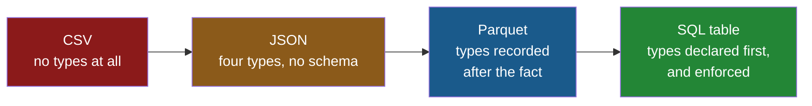

# 4.1 — A table that knows its own types

## One-line answer

A database table is a store that was told the type of every column before a single row went in, so it
is the first source on this day that can *refuse* bad data rather than merely record it.

---

## The story

The flat gets tired of emailing the shopping list around and puts it in a shared app instead.

The app is unremarkable. You type an item, a number and a price, and everybody's phone shows the same
list. Under it, on somebody's laptop, there is a single file that holds the whole thing.

The interesting part happens the first time somebody makes a mistake. In the box that wants how many,
they type `lots`. On the emailed spreadsheet, `lots` had always just sat there, and whoever added the
list up afterwards found out. This time the app says no, immediately, before the list is saved.

Nobody set that up. It came from the way the list was written down. When the list was made, somebody
had to say, once, that the item is words, the count is a whole number and the price is money. That
sentence was stored with the list, and everything written afterwards is checked against it.

That is the whole difference between this and every file on the day so far. A CSV takes whatever you
give it. This asks first.

---

## The idea in plain language

A **database** is a program that stores data and answers questions about it. A **relational
database** stores that data as **tables**: named collections of rows, where every row has the same
named columns, which is the same shape as the frame Day 26 built
([Day 26, 1.3](../../../day-26-frames-and-copy-on-write/parts/01-the-two-objects/1.3-a-table-of-columns.md)).

The thing that makes a table different from a CSV of the same rows is its **schema**. A schema is a
written-down statement of what the table's columns are called and what type each one holds. It is
created before any data, it is stored inside the database beside the data, and every write is checked
against it.

That is the sentence to hold on to for the rest of section 4:
[1.1](../01-the-csv/1.1-a-csv-has-no-types-in-it.md) said a CSV has no types in it, and a table does.
Parquet also has types in it ([3.1](../03-parquet/3.1-columns-on-disk-with-types.md)), but Parquet
records the types of data that has *already been written*. A table declares them **first**, and can
then reject a row that does not fit. Recording and enforcing are different jobs, and this is the only
source on the day that does the second one.

**SQL** — usually said "sequel", and standing for Structured Query Language — is the language you
talk to such a database in. You will meet two kinds of sentence in it today, and no more:

- `CREATE TABLE …` — the schema, said out loud once.
- `SELECT … FROM … WHERE …` — a question, asked as many times as you like.

**SQLite** is the particular database this day uses. It is unusual in a way that makes it perfect
here: it is not a server. There is nothing to install, nothing to start and no password, because the
entire database is one ordinary file on disk and the library that reads it is already inside Python
as the `sqlite3` module. It is also, by a wide margin, the most deployed database in the world, since
it is the thing inside phones, browsers and applications like the flat's shopping app.

One term you need before the next part. A **connection** is an open session with the database: the
object your code holds while it is talking to the file, and closes when it is done. Everything in
[4.2](4.2-read-sql-and-the-connection.md) goes through one.

And one honest warning, because this day is about types and SQLite's are strange. Most databases
enforce a column's type absolutely. SQLite instead has **type affinity**, which means a column has a
preferred type and will convert a value towards it if it can — but if it cannot, it stores the value
as it came. So the app's refusal in the story came from the app, not from SQLite.
[4.4](4.4-to-sql-and-what-sqlite-invents.md) is where that costs somebody a column.

---

## Why Setu needs it

- **[4.2](4.2-read-sql-and-the-connection.md)** reads from this table into a frame, and the point of
  that part is that the dtypes arrive correct with no `dtype=` argument anywhere.
- **[4.4](4.4-to-sql-and-what-sqlite-invents.md)** writes a frame back into a table, and needs the
  schema idea to explain what the write invented.
- **Day 30** puts an imputer in a pipeline to deal with missing values. A `NOT NULL` column is the
  version of that problem which was prevented rather than repaired, and knowing which of the two you
  have changes the pipeline.
- **Day 226** builds the project's data layer on Postgres, and the schema for it is exactly this idea
  with more types and real enforcement. Everything about `CREATE TABLE` here transfers.
- **Days 228 and 229** put a database behind a tool an agent can call. An agent that can be handed a
  table which refuses nonsense is a much safer agent than one writing to a CSV.

---

## The mechanism

The whole database, made from nothing:

```python
import sqlite3
from pathlib import Path

Path("data").mkdir(exist_ok=True)
Path("data/shop.db").unlink(missing_ok=True)
con = sqlite3.connect("data/shop.db")
con.execute("""
CREATE TABLE shopping (
    item   TEXT    NOT NULL,
    need   INTEGER NOT NULL,
    price  REAL    NOT NULL,
    aisle  TEXT    NOT NULL,
    bought TEXT
)
""")
con.executemany(
    "INSERT INTO shopping VALUES (?, ?, ?, ?, ?)",
    [
        ("milk", 2, 1.15, "07", "2026-08-30"),
        ("bread", 1, 1.40, "03", "2026-08-30"),
        ("eggs", 6, 0.32, "07", None),
        ("rice", 1, 2.05, "11", "2026-08-24"),
    ],
)
con.commit()
con.close()
print("made data/shop.db")
```

**Line by line:**

- `Path("data/shop.db").unlink(missing_ok=True)` — delete any previous copy, because `CREATE TABLE`
  on a table that already exists is an error and this script is meant to be re-runnable.
  `missing_ok=True` means the first run is not an error either
  ([Day 16, 1.4](../../../day-16-files-and-context-managers/parts/01-the-path/1.4-exists-mkdir-and-the-race.md)).
- `sqlite3.connect("data/shop.db")` — **this creates the file if it is not there.** There is no
  server, no port and no password; the path *is* the database. That single line is the whole reason
  this day can teach SQL under Principle 5's zero budget.
- `con.execute("""…""")` — a triple-quoted string, so the SQL can be laid out over several lines and
  read like the table it describes
  ([Day 7, 1.3](../../../day-07-strings/parts/01-text/1.3-escapes-and-raw-strings.md)).
- `item TEXT` — the column's **declared type**. `TEXT` for words, `INTEGER` for whole numbers, `REAL`
  for numbers with a fractional part. SQLite has only five such types, which is far fewer than most
  databases and part of why it is small.
- `aisle TEXT` — **the point of the entire section.** `07` is declared as text here, once, in the
  file, forever. Section 1 spent three parts getting that same column to survive a CSV read
  ([1.3](../01-the-csv/1.3-when-the-guess-is-wrong.md)), and needed a `dtype=` argument at every
  single read to do it. Here, nobody reading this table can get it wrong.
- `NOT NULL` — a **constraint**: a rule the database enforces on every write. `NULL` is SQL's word
  for "no value", the same idea as the blank field in
  [1.6](../01-the-csv/1.6-na-values-and-the-blank.md). Four columns forbid it and `bought` allows it,
  because an item you have not bought yet genuinely has no date.
- `bought TEXT` — and here is SQLite being small in a way that costs you later: **it has no date
  type.** A date is stored as text in an agreed layout, or as a number. That is not an accident of
  this example; it is the format, and [4.4](4.4-to-sql-and-what-sqlite-invents.md) is where it bites.
- `executemany` with `(?, ?, ?, ?, ?)` — one statement run once per row of the list. The `?` marks
  are **placeholders**, and everything about why they are not string formatting is
  [4.3](4.3-params-not-f-strings.md).
- `None` for the eggs' `bought` — Python's `None` becomes SQL's `NULL`. This is the third spelling of
  "missing" the day has met, after the CSV's empty field and pandas' `NaN`
  ([Day 26, 2.5](../../../day-26-frames-and-copy-on-write/parts/02-the-str-dtype/2.5-the-missing-value-in-a-text-column.md)).
- `con.commit()` — **without this line the rows are not saved.** Everything since the connection
  opened is a **transaction**, a group of changes that either all happen or none do, and `commit`
  is what makes them permanent. Closing without committing throws the work away silently.
- `con.close()` — the file is released. `sqlite3` connections are also context managers, but not in
  the way you would expect, which is why this part closes by hand and
  [4.2](4.2-read-sql-and-the-connection.md) explains the trap.

```text
made data/shop.db
```

The schema is not something you wrote on the side; it is stored in the database and you can ask for
it back:

```python
import sqlite3

con = sqlite3.connect("data/shop.db")
for (statement,) in con.execute("SELECT sql FROM sqlite_master WHERE name = 'shopping'"):
    print(statement)
con.close()
```

**Line by line:**

- `sqlite_master` is a table SQLite maintains about itself, holding one row per table, index and view
  in the file. Every database has an equivalent, and querying it is how a tool discovers what is in a
  database it was handed.
- `SELECT sql FROM …` — the `sql` column stores the exact `CREATE TABLE` text the table was made
  with. **The schema is data.** That is the concrete meaning of "the types are in the file".
- `for (statement,) in …` — a cursor yields one **tuple per row**, and this query returns one column,
  so the tuple has one element. Unpacking in the `for` target gets the string out without a `[0]`
  ([Day 8, 1.4](../../../day-08-containers/parts/01-sequences/1.4-unpacking-and-star-rest.md)).

```text
CREATE TABLE shopping (
    item   TEXT    NOT NULL,
    need   INTEGER NOT NULL,
    price  REAL    NOT NULL,
    aisle  TEXT    NOT NULL,
    bought TEXT
)
```

Where the four sources on this day sit, on the one axis that matters:



Reading left to right, each store knows more about itself than the one before. Only the last one can
say no.

---

## When it breaks

**The constraint doing its job:**

```text
$ uv run python -c "
import sqlite3
con = sqlite3.connect('data/shop.db')
con.execute(\"INSERT INTO shopping VALUES ('tea', NULL, 1.0, '02', NULL)\")
" 2>&1 | tail -1
```

```text
sqlite3.IntegrityError: NOT NULL constraint failed: shopping.need
```

**What it means.** The write was rejected and nothing was stored. `IntegrityError` is the DBAPI's
class for "this violates a rule the table declared", and the message names the table and the column.
**This is the error you want**, and it is the one no file format on this day can produce. A CSV would
have taken the blank field and let [1.6](../01-the-csv/1.6-na-values-and-the-blank.md) find out later.

**The table that was never made:**

```text
$ uv run python -c "
import sqlite3
con = sqlite3.connect('data/shop.db')
con.execute('SELECT * FROM shoping')
" 2>&1 | tail -1
```

```text
sqlite3.OperationalError: no such table: shoping
```

**What it means.** A typo in the table name, and worth showing because of what it implies about
`connect`. `sqlite3.connect` **never fails on a missing file** — it makes one. So a typo in the
*path* gives you a brand new, empty database rather than an error, and the first thing you notice is
this message about a table that was definitely there yesterday. When you meet `no such table` on a
database you are sure you built, check the path before you check the table.

**The one that does not fail — no commit:**

```text
$ uv run python -c "
import sqlite3
con = sqlite3.connect('data/temp.db')
con.execute('CREATE TABLE t (a INTEGER)')
con.execute('INSERT INTO t VALUES (1)')
con.close()
con2 = sqlite3.connect('data/temp.db')
print(con2.execute('SELECT COUNT(*) FROM t').fetchone())
"
```

```text
(0,)
```

**What it means.** The table survived and the row did not. No error, no warning, and a count of zero
where you expected one. `CREATE TABLE` was committed implicitly, the `INSERT` was not, and closing
the connection rolled it back. **This is the day's recurring shape once more**: the failure is not an
exception, it is a plausible wrong answer. If a script "worked" and the data is not there, look for
the missing `commit()` first.

---

## In production

**What a professional writes instead of the teaching version.** The schema is not a string inside a
script. It lives in a file that is committed to the repository, so that the shape of the data has a
history:

```python
import sqlite3
from pathlib import Path

SCHEMA_SQL = Path("sql/001_shopping.sql")


def open_db(path: Path) -> sqlite3.Connection:
    """Open the shopping database, creating the schema on a fresh file."""
    fresh = not path.exists()
    con = sqlite3.connect(path)
    con.execute("PRAGMA foreign_keys = ON")
    if fresh:
        con.executescript(SCHEMA_SQL.read_text(encoding="utf-8"))
        con.commit()
    return con
```

**Line by line:**

- `SCHEMA_SQL` is a path to a `.sql` file, not a triple-quoted string. It is reviewable on its own, a
  diff on it shows a schema change, and the `001_` prefix is the start of a **migration** sequence —
  the numbered, ordered list of schema changes a real project accumulates.
- `fresh = not path.exists()` — computed **before** `connect`, because `connect` creates the file and
  after that line the answer is always `False`. This is the ordering bug the previous section warned
  about, written down as one line of defence.
- `PRAGMA foreign_keys = ON` — SQLite ships with foreign key constraints **off** for backwards
  compatibility, and every connection has to turn them on for itself. It is the single most surprising
  default in the library: a link between two tables that you declared is not enforced until you say
  this. It is also exactly what Principle 4 means by never accepting a framework default.
- `executescript` rather than `execute` — `execute` runs **one** statement, and a schema file holds
  several. Passing a multi-statement string to `execute` raises `ProgrammingError`, which is a
  confusing first meeting.
- The function returns the connection rather than opening and closing one internally, so the caller
  decides the transaction boundary. A helper that commits on your behalf takes away the only tool you
  have for making several writes happen together.

**What changes at scale.** Two things, and the first one is the reason to learn SQLite properly
rather than treating it as a toy. **SQLite is single-writer.** Many readers at once are fine; two
processes writing at once means one waits, and if it waits too long you get
`database is locked`. Turning on write-ahead logging with `PRAGMA journal_mode = WAL` lets readers
carry on while a write is in progress and is the standard first fix, but the single-writer rule
stands. Second, **an unindexed query reads the whole table.** With four rows nothing is slow; with
four million, a `WHERE aisle = '07'` with no index on `aisle` scans every row, and `EXPLAIN QUERY
PLAN` in front of your query is how you find out which of the two is happening. Neither problem is
visible on the shopping list, and both arrive on the same afternoon in a real system.

The larger production point is the one the story opened with. A database is the only source on this
day that can **enforce**, and enforcement belongs as close to the data as you can put it. A `NOT
NULL` on the column is checked for every writer, forever, including the one somebody writes in a
different language next year. The same check in your loader protects only the rows that come through
your loader.

**The failure that only appears with real data.** A dashboard read `SELECT * FROM events` into a
frame and worked for months. The table grew past what the machine could hold, and the job started
dying on `MemoryError` — not because the query was wrong, but because `SELECT *` had always been
wrong and the table had been small enough to hide it. The fix was to name the columns and let the
database do the aggregation, which is [4.2](4.2-read-sql-and-the-connection.md)'s production section.
The lesson is that a query which "works" on a small table has not been tested; it has been let off.

**The review comment a senior engineer leaves.** *"The `CREATE TABLE` is a string literal in
`etl.py`. If the schema changes we have no record of when or why. Move it to `sql/` and give it a
number. Also, `bought` is `TEXT` — write down the format you expect, because SQLite will not check
it."*

**The interview question.** *"What does a database give you that a Parquet file does not?"* The
answer is not "speed" — for a full-table scan of analytical data, Parquet usually wins. It is that a
table has a **declared, enforced schema**, so bad data is rejected at the write instead of discovered
at the read; it supports **transactions**, so a group of changes either all happen or none do; it
allows **concurrent writers** with defined behaviour; and it is **indexed for row lookup**, so
finding one row is fast rather than requiring a scan. The follow-up is "so when do you use Parquet
instead", and the answer is when the access pattern is analytical: reading many rows and few columns,
written once, never updated — which is exactly what
[3.4](../03-parquet/3.4-column-pruning.md) measured.

---

## Check yourself

```bash
uv run python -c "
import sqlite3
con = sqlite3.connect('data/shop.db')
print(con.execute('SELECT COUNT(*) FROM shopping').fetchone()[0], 'rows')
for row in con.execute('PRAGMA table_info(shopping)'):
    print(row)
con.close()
"
```

`PRAGMA table_info` prints one row per column: its position, name, declared type, whether it is
`NOT NULL`, its default, and whether it is part of the primary key. Read the `aisle` line and say
what a CSV of the same four rows would have needed at every read to get the same guarantee.

**Answer out loud, without scrolling up:**

> Name the one thing a database table can do that a CSV, a JSON file and a Parquet file all cannot.
> Then say what `sqlite3.connect` does when the file you name does not exist, and why that is the
> first thing to suspect when you meet `no such table`.

---

**Next:** [4.2 — `read_sql` and the connection](4.2-read-sql-and-the-connection.md).
