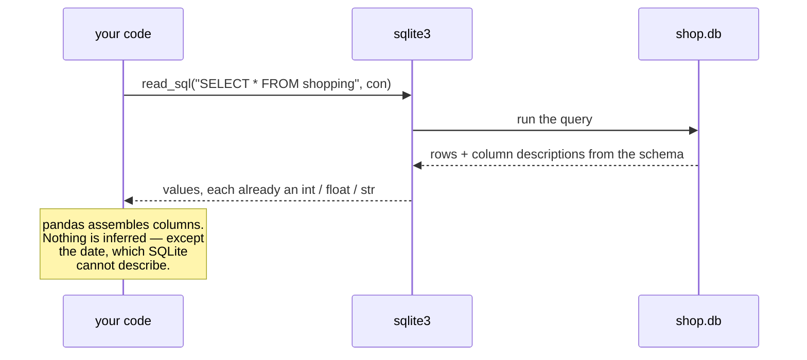

# 4.2 — `read_sql` and the connection: the dtypes that arrived correct

## One-line answer

`pd.read_sql` runs a query through an open connection and builds a frame from the answer, and because
the table declared its column types there is no `dtype=` argument to get wrong — with one exception,
the date, which SQLite cannot store as a date.

---

## The story

Somebody in the flat wants to know what the week cost, and the list now lives in the app's file
rather than in an emailed spreadsheet.

They already know how this goes. Every time the list arrived as a spreadsheet, reading it took an
argument or two to stop the aisle numbers losing their leading zeros — `07` kept turning into `7`,
and the shop's signs all say `07`.

So they write the read, brace for it, and check the aisle column first out of habit.

It is fine. `07` is still `07`, and nobody passed anything to make that happen.

Then they check the date column, because it is the other one that always needs help, and that one is
still wrong. It came back as words, not as a date, and adding a week to it would fail.

Two columns, the same file, and only one of them needed rescuing. The reason is worth knowing,
because it decides what you have to remember every time you read from a database.

---

## The idea in plain language

`pd.read_sql` takes a **query** — a question written in SQL — and a **connection**, sends the
question to the database, and turns the rows that come back into a DataFrame.

The **connection** was introduced in [4.1](4.1-a-table-that-knows-its-types.md): the object your code
holds while it is talking to the database file. `read_sql` does not open one and does not close one.
You open it, you hand it over, and closing it is your job.

The reason the dtypes come out right is the whole argument of section 4. When a query runs, the
database sends back not only values but a description of each column, taken from the schema that
[4.1](4.1-a-table-that-knows-its-types.md) declared. `aisle` was created as `TEXT`, so text is what
arrives, and pandas has nothing to guess. Compare that with the CSV, where the same column arrived as
the characters `07` with no note attached, and pandas guessed a number
([1.3](../01-the-csv/1.3-when-the-guess-is-wrong.md)).

The date is the exception, and it is SQLite's fault rather than pandas'. **SQLite has no date type.**
Its five types are text, whole numbers, floating-point numbers, raw bytes and null, and a date is
stored as one of those — normally text in the `YYYY-MM-DD` layout. So the description that comes back
with the `bought` column honestly says "text", pandas honestly builds a text column, and you get
words where you wanted dates. The fix is `parse_dates=`, the same argument
[1.5](../01-the-csv/1.5-parse-dates-and-the-date-that-stayed-text.md) needed for the CSV.

That gives the rule to remember, and it is short. **Reading from SQLite, you inherit the types and
you still have to say which columns are dates.** Reading from a database that does have a date type,
such as Postgres on Day 226, even that argument goes away.

One more term, because you will see three function names and they are not interchangeable.
`read_sql_query` takes a query. `read_sql_table` takes a table name and reads all of it, but only
works through SQLAlchemy — a separate library that speaks to many databases through one interface —
and **fails on a plain `sqlite3` connection**. `read_sql` is a wrapper that tries to work out which
of the two you meant. This day uses `read_sql` for its readability and shows what `read_sql_table`
does when it cannot help you.

---

## Why Setu needs it

- **[4.3](4.3-params-not-f-strings.md)** is about the one argument this part deliberately left out —
  how you get a value from Python into the `WHERE` clause safely.
- **[4.4](4.4-to-sql-and-what-sqlite-invents.md)** goes the other way and writes a frame into a
  table, and the date problem here is exactly what comes back to bite there.
- **[5.1](../05-the-module/5.1-the-loaders-module.md)** gathers all four sources behind one module,
  and this is the source whose loader needs the fewest arguments.
- **Day 31** is `groupby`, and the production section here is a first look at the question that runs
  under all of it: whether the grouping happens in pandas or in the database.
- **Day 226** puts the project's data in Postgres, and **Day 228** exposes it to an agent as a
  read-only tool. Every query that tool runs is this call.

---

## The mechanism

The read, with nothing passed but the query and the connection:

```python
import sqlite3

import pandas as pd

con = sqlite3.connect("data/shop.db")
frame = pd.read_sql("SELECT * FROM shopping", con)
con.close()
print(frame)
print()
print(frame.dtypes.to_string())
```

**Line by line:**

- `sqlite3.connect(...)` — opened here, in the caller, because `read_sql` will not do it for you. It
  takes an already-open connection and leaves its lifetime entirely to you.
- `pd.read_sql("SELECT * FROM shopping", con)` — the query is the first argument and the connection
  the second. **There is no `dtype=` and no `usecols=`**, and that absence is the finding: the schema
  supplied both.
- `SELECT *` is used here to show what the table holds, and it is the last time this section does
  it. Naming the columns is the production habit, for the reason
  [3.4](../03-parquet/3.4-column-pruning.md) gave about closed reads, and the *In production* section
  below is mostly about it.
- `con.close()` **before** the print — the frame is already fully built in memory by the time
  `read_sql` returns, so the connection is not needed to look at it. `read_sql` is not lazy, and that
  is the fact [5.2](../05-the-module/5.2-the-file-that-does-not-fit.md) has to work around.

```text
    item  need  price aisle      bought
0   milk     2   1.15    07  2026-08-30
1  bread     1   1.40    03  2026-08-30
2   eggs     6   0.32    07         NaN
3   rice     1   2.05    11  2026-08-24

item          str
need        int64
price     float64
aisle         str
bought        str
```

**Look at `aisle` first.** It is `str`, and it still reads `07`. Nothing was passed to make that
happen. Section 1 needed `dtype={"aisle": "str"}` on every single read to get the same result
([1.4](../01-the-csv/1.4-dtype-at-read-time.md)), and forgetting it once silently destroyed the
leading zero ([1.3](../01-the-csv/1.3-when-the-guess-is-wrong.md)). **The declaration in the table
did the work that the argument had been doing.**

Now look at `bought`. It is `str`, and it should be a date. And the eggs' missing date came back as
`NaN` — a float, sitting in a text column, which is the mixed-missing-value situation
[Day 26, 2.5](../../../day-26-frames-and-copy-on-write/parts/02-the-str-dtype/2.5-the-missing-value-in-a-text-column.md)
described.

One argument fixes both:

```python
import sqlite3

import pandas as pd

con = sqlite3.connect("data/shop.db")
frame = pd.read_sql("SELECT * FROM shopping", con, parse_dates=["bought"])
con.close()
print(frame)
print()
print(frame.dtypes.to_string())
```

**Line by line:**

- `parse_dates=["bought"]` — a list of column names to convert after the rows arrive. It is the same
  argument, with the same spelling and the same meaning, as the one `read_csv` takes
  ([1.5](../01-the-csv/1.5-parse-dates-and-the-date-that-stayed-text.md)). pandas keeps these names
  deliberately consistent across readers, which is worth relying on.
- It is a **list**, not a single string. Passing `parse_dates="bought"` is accepted and does
  something different, which is a good reason to always write the list form.
- Nothing else changed. Every other column was already right.

```text
    item  need  price aisle     bought
0   milk     2   1.15    07 2026-08-30
1  bread     1   1.40    03 2026-08-30
2   eggs     6   0.32    07        NaT
3   rice     1   2.05    11 2026-08-24

item                 str
need               int64
price            float64
aisle                str
bought    datetime64[us]
```

The missing date is now `NaT` rather than `NaN` — "not a time", the missing value that belongs to
datetime columns. A missing value that has the right *type* is the difference between a column you
can subtract and one you cannot.

Where the type information comes from, in each of the two reads this day has now done:



Compare that with the CSV path, where the arrow back from the file carries characters and nothing
else, and every dtype in the frame was a decision pandas made
([1.2](../01-the-csv/1.2-read-csv-and-what-it-guessed.md)).

The database can also answer a question rather than hand over the table:

```python
import sqlite3

import pandas as pd

query = """
SELECT aisle, COUNT(*) AS lines, SUM(need * price) AS spend
FROM shopping
GROUP BY aisle
ORDER BY spend DESC
"""
con = sqlite3.connect("data/shop.db")
summary = pd.read_sql(query, con)
con.close()
print(summary)
print()
print(summary.dtypes.to_string())
```

**Line by line:**

- The query is a module-level string rather than an inline literal, so it can be read, formatted and
  eventually moved into a file of its own without touching the call.
- `COUNT(*)` counts rows in each group and `SUM(need * price)` multiplies the two columns row by row
  and adds the results. **The multiplication happens inside the database**, over columns it never
  sent you.
- `AS lines` and `AS spend` — the names the computed columns arrive under. Without them the column
  name is the expression text, and `frame["SUM(need * price)"]` is not something anybody wants to
  type twice.
- `GROUP BY aisle` — one output row per distinct aisle. This is the same split-apply-combine idea
  Day 31 builds in pandas, done here by the database.
- `ORDER BY spend DESC` — sorted by the computed column, largest first. Sorting is Day 29's subject;
  the point here is that the database will do it before sending anything.
- **Four rows became three, and five columns became three.** For a shopping list that is nothing. For
  a table of ten million rows it is the difference between a frame that fits in memory and one that
  does not, which is the *In production* argument below.

```text
  aisle  lines  spend
0    07      2   4.22
1    11      1   2.05
2    03      1   1.40

aisle        str
lines      int64
spend    float64
```

The computed columns have correct dtypes too. `COUNT` returns a whole number and `SUM` over a `REAL`
column returns a floating-point number, and the database described both.

---

## When it breaks

**The connection closed too early:**

```text
$ uv run python -c "
import sqlite3
import pandas as pd
con = sqlite3.connect('data/shop.db')
con.close()
pd.read_sql('SELECT * FROM shopping', con)
" 2>&1 | tail -1
```

```text
sqlite3.ProgrammingError: Cannot operate on a closed database.
```

**What it means.** The connection object still exists after `close()`; it just cannot do anything.
This is the error you get from putting `con.close()` in a `finally` block and then returning a
generator, or from closing inside a helper and reading outside it.

Notice that this one is **not** a pandas error. A query that fails *in the database* comes back
wrapped — `pandas.errors.DatabaseError: Execution failed on sql 'SELECT * FROM shoping': no such
table: shoping`, with the SQL quoted in the message, which is the most useful part of it. This
failure happens earlier than that, when pandas asks the dead connection for a cursor, so the driver's
own exception comes straight out. **Where an error is wrapped tells you how far the call got**, and
here it never reached the database at all.

**`read_sql_table` on a `sqlite3` connection:**

```text
$ uv run python -c "
import sqlite3
import pandas as pd
con = sqlite3.connect('data/shop.db')
pd.read_sql_table('shopping', con)
" 2>&1 | tail -1
```

```text
NotImplementedError
```

**What it means.** A bare `NotImplementedError` **with no message at all** — no colon, no hint. It is one of the least helpful errors in pandas, and the cause is simple:
`read_sql_table` is implemented only for SQLAlchemy connections, and you handed it a raw DBAPI one.
The fix is to write the query yourself — `pd.read_sql("SELECT * FROM shopping", con)` — or to install
SQLAlchemy. Knowing that this blank error means "wrong kind of connection" saves the search.

**The one that does not fail — `with con:` does not close it:**

```text
$ uv run python -c "
import sqlite3
con = sqlite3.connect('data/shop.db')
with con:
    con.execute('SELECT 1')
con.execute('SELECT 1')
print('still open after the with block')
"
```

```text
still open after the with block
```

**What it means.** `with con:` looks exactly like `with open(...) as f:` and does something else.
For a file, the `with` block closes the file
([Day 16, 4.1](../../../day-16-files-and-context-managers/parts/04-context-managers/4.1-with-the-block-that-cleans-up.md)).
For a `sqlite3` connection it **commits the transaction on success and rolls it back on an
exception**, and leaves the connection open. So a script that uses `with con:` and never calls
`close()` leaks a connection and holds the file, on a database whose main limitation is that only one
process may write at a time. This is not a bug in `sqlite3`; the block is a transaction boundary, not
a resource boundary. `contextlib.closing(con)` is the wrapper that gives you the other behaviour
([Day 16, 4.6](../../../day-16-files-and-context-managers/parts/04-context-managers/4.6-a-connection-that-always-closes.md)).

---

## In production

**What a professional writes instead of the teaching version.** The connection's lifetime is a
context manager, the columns are named, and the query is not `SELECT *`:

```python
import sqlite3
from contextlib import closing
from pathlib import Path

import pandas as pd

SPEND_BY_AISLE = """
SELECT aisle, COUNT(*) AS lines, SUM(need * price) AS spend
FROM shopping
WHERE bought IS NOT NULL
GROUP BY aisle
ORDER BY spend DESC
"""


def spend_by_aisle(db: Path) -> pd.DataFrame:
    """What each aisle cost, computed by the database."""
    with closing(sqlite3.connect(f"file:{db}?mode=ro", uri=True)) as con:
        return pd.read_sql(SPEND_BY_AISLE, con)
```

**Line by line:**

- `closing(...)` — wraps any object with a `close()` method into a context manager that calls it on
  the way out, including when the body raises. This is the piece the previous section showed missing,
  and it is why the plain `with con:` form is not enough.
- `f"file:{db}?mode=ro"` with `uri=True` — **the connection is read-only.** The path is given as a
  URI so that `mode=ro` can be attached to it, and any write through this connection now fails
  instead of succeeding. This is Principle 11's blast radius applied to a database: a reporting
  function has no business being able to write, so it is not able to. It also protects against the
  `connect` behaviour [4.1](4.1-a-table-that-knows-its-types.md) warned about — under `mode=ro` a
  mistyped path is an error rather than a silently created empty database.
- `WHERE bought IS NOT NULL` — SQL's spelling for a missing check. **`= NULL` matches nothing, ever**,
  including other nulls, because null means "unknown" and two unknowns are not known to be equal.
  Writing `WHERE bought = NULL` returns zero rows and no error, which is SQL's version of the silent
  wrong answer this day keeps meeting.
- The function returns the summary, not the table. **The frame that crosses back into Python is three
  rows wide**, whatever the table's size.

**What changes at scale.** The question stops being how to read the table and becomes whether to read
it at all. `pd.read_sql("SELECT * FROM events", con)` on a table of fifty million rows tries to build
the whole thing in memory and dies; the same aggregation expressed in SQL returns a few hundred rows
and runs on the machine that already has the data on its disk. The general rule is **push the
computation to the data**, and its main exception is that anything not expressible in SQL — a model,
a text embedding, a custom function — has to come back to Python anyway, so the design question is
where the boundary sits, not which side wins.

Two mechanical facts matter once the rows are numerous. `read_sql` takes a `chunksize=` argument, and
with it returns a **generator of frames** instead of one frame, which is the database version of
[5.2](../05-the-module/5.2-the-file-that-does-not-fit.md)'s chunked read. And a connection is **not
safe to share between threads** by default, so the concurrency work of Day 19 does not extend to
handing one connection to several workers
([Day 19, 4.3](../../../day-19-typing-dataclasses-and-concurrency/parts/04-concurrency/4.3-threads.md)).
Real services keep a **connection pool** — a small set of connections handed out and returned — which
is one of the main things SQLAlchemy provides on top of the driver.

**The failure that only appears with real data.** A nightly report ran `pd.read_sql` on a growing
table and got slower every week without anyone noticing, because the schedule had room. Then it
crossed the machine's memory and failed at three in the morning, and the traceback pointed at a line
that had not changed in two years. The lesson is that `SELECT *` has no failure mode until it has a
catastrophic one, and that the size of what a query returns is worth asserting on rather than
assuming: a `LIMIT` in development, and a row-count check in production, both turn a future
`MemoryError` into a present error message.

**The review comment a senior engineer leaves.** *"`read_sql('SELECT * FROM shopping', con)` and then
a `groupby` in pandas. The database can do that group-by, and then we move three rows over the wire
instead of the whole table. Also this connection is never closed — wrap it in `closing()` — and it
should be `mode=ro`, since this function only reports."*

**The interview question.** *"You need a monthly summary from a large table. Do you aggregate in SQL
or in pandas?"* The answer that shows experience starts with the data volume: aggregate in SQL,
because the database is next to the disk, it has indexes, and the result crossing the network is
small. Then the honest qualifications — you aggregate in pandas when the operation has no SQL
spelling, when you need the raw rows for something else anyway, or when the query would be
unreadable and the table is small enough not to care. The follow-up is often "how would you know it
was too slow", and the answer is `EXPLAIN QUERY PLAN`, plus timing the query separately from the
frame construction, because those are two different problems with two different fixes.

---

## Check yourself

```bash
uv run python -c "
import sqlite3
import pandas as pd
con = sqlite3.connect('data/shop.db')
a = pd.read_sql('SELECT * FROM shopping', con)
b = pd.read_csv('data/shopping.csv')
con.close()
print('from the database:', a['aisle'].tolist())
print('from the csv     :', b['aisle'].tolist())
"
```

The two lists hold the same column from the same four rows, and they are not the same. Say which read
needed an extra argument to be correct, and where the other one got its answer from.

**Answer out loud, without scrolling up:**

> `read_sql` needed no `dtype=` to keep the aisle as text, but still needed `parse_dates=` to get a
> date. Explain why one of those was free and the other was not. Then say what `with con:` does to a
> `sqlite3` connection, and what it does not do.

---

**Next:** [4.3 — `params=`, not f-strings](4.3-params-not-f-strings.md).
