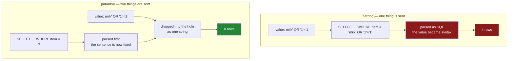

# 4.3 — `params=`, not f-strings: the value that changed the question

## One-line answer

A value belongs in `params=` and never inside the query string, because a query built by pasting text
together cannot tell your **question** apart from your **answer** — and the first name with an
apostrophe in it proves that.

---

## The story

The shopping app gets a search box. You type an item, it shows you that line of the list.

It works on the first thing anybody tries, which is `milk`. It works on `bread`. It works for a week.

Then the flat starts keeping a second list, for the things they order from the corner shop rather
than the supermarket, and the corner shop's own name goes in as an item: `o'brien's`.

The search box breaks. Not "finds nothing" — breaks, with an error, on a name that is spelled
correctly and is genuinely in the list.

Everyone's first instinct is that the apostrophe is a strange character and needs handling. It is
not. It is an ordinary character in an ordinary name, and hundreds of thousands of people have one in
theirs. What went wrong is on the other side: the search was built by gluing the typed word into the
middle of a sentence, and the apostrophe happened to be a piece of punctuation in the language that
sentence was written in.

The search box did not go wrong because the name was unusual. It went wrong because it was never
able to tell the difference between the sentence and the word.

---

## The idea in plain language

A query is a sentence in SQL, and SQL — like English — uses punctuation. A quote mark opens and
closes a piece of text.

When you build a query by putting a value into the middle of the string yourself, the value's
characters and the sentence's characters end up in the same place, and the database has no way to
tell which is which. All it receives is one finished sentence. If the value contained a quote mark,
that quote mark is now the sentence's punctuation, and the sentence means something else.

**Parameter binding** is the alternative, and it is not a fancier kind of quoting. It sends **two
things** instead of one: the query, with a `?` where the value goes, and the value, separately. The
database prepares the query first, decides what the sentence means, and only then drops the value
into the hole. A value that arrives that way **cannot change the sentence**, whatever characters it
contains, because the sentence was already understood before the value showed up.

The `?` is called a **placeholder**. In `pd.read_sql` the values go in `params=`, as a sequence in
the order the placeholders appear.

There are two reasons this matters, and they are worth keeping separate because people usually only
learn the second one.

**The first is correctness, and it is the one that will actually happen to you.** Names contain
apostrophes. Notes contain quotes. Somebody will type one, and code that pastes values into query
text will break on a perfectly ordinary input.

**The second is safety.** If the value comes from somewhere you do not control — a search box, a
form, a file, a message to an agent — then whoever supplies it is writing part of your sentence.
That is called **SQL injection**, and it is one of the oldest and most damaging classes of bug there
is. You do not defend against it by inspecting the value for suspicious characters, because you will
not think of them all. You defend against it by never letting values into the sentence, which is what
`params=` does.

One thing binding cannot do, and it is the most common follow-up question. **Placeholders stand in
for values only** — not for table names, not for column names, and not for keywords like `ASC`. That
is not a limitation to work around with string formatting; it is the boundary of the guarantee, and
what to do instead is in *In production*.

---

## Why Setu needs it

- **[4.4](4.4-to-sql-and-what-sqlite-invents.md)** writes rows back, and every write takes values
  from somewhere. The same rule applies with more at stake.
- **[5.1](../05-the-module/5.1-the-loaders-module.md)** builds the day's loader module, and its SQL
  loader takes an argument from the caller. This is why that argument does not go into the string.
- **Day 226** builds the project's data layer, and **Day 227** ingests data from sources nobody in
  this project controls. Every value crossing that boundary is untrusted by definition.
- **Day 228** is the hardened `paper-db` server — a tool an agent can call. **An agent generates its
  own arguments from text it read**, so an agent-called query is the exact case this part is about,
  with no human in between to notice the apostrophe. Principle 11's blast radius rule and Principle
  12's approval rule both rest on it.

---

## The mechanism

The search, built the way it breaks:

```python
import sqlite3

import pandas as pd

con = sqlite3.connect("data/shop.db")
wanted = "milk"
frame = pd.read_sql(f"SELECT * FROM shopping WHERE item = '{wanted}'", con)
con.close()
print(frame)
```

**Line by line:**

- `f"… WHERE item = '{wanted}'"` — the value is formatted into the string, so what reaches the
  database is one finished sentence: `SELECT * FROM shopping WHERE item = 'milk'`.
- Note the hand-written `'` quotes around `{wanted}`. **Having to write those is the warning sign.**
  You are supplying the punctuation that makes the value a value, which means the value can supply
  punctuation too.
- This works, and it will keep working for as long as every value happens to contain no quote mark.
  That is not a property of the code; it is a property of the data so far.

```text
   item  need  price aisle      bought
0  milk     2   1.15    07  2026-08-30
```

The same code, with the corner shop's name:

```python
import sqlite3

import pandas as pd

con = sqlite3.connect("data/shop.db")
wanted = "o'brien"
frame = pd.read_sql("SELECT * FROM shopping WHERE item = ?", con, params=(wanted,))
con.close()
print(frame)
print("rows:", len(frame))
```

**Line by line:**

- `"… WHERE item = ?"` — a plain string, not an f-string, and **no quotes around the `?`**. The
  placeholder is not text being substituted; it is a hole in a prepared statement.
- `params=(wanted,)` — a tuple, and **the trailing comma matters**. `(wanted)` is just `wanted` in
  brackets, and passing a bare string makes `sqlite3` iterate it character by character, which
  produces the confusing error in *When it breaks*
  ([Day 8, 1.3](../../../day-08-containers/parts/01-sequences/1.3-a-tuple-is-a-record.md)).
- The apostrophe is now nothing special. It is one of the characters of a value, and values are not
  parsed as SQL.
- The result is empty because there is no `o'brien` in the four-row list — **and an empty result is
  the correct answer.** The version that broke could not even get far enough to be wrong.

```text
Empty DataFrame
Columns: [item, need, price, aisle, bought]
Index: []
rows: 0
```

Now the version that does not raise, which is the one that matters:

```python
import sqlite3

import pandas as pd

con = sqlite3.connect("data/shop.db")
typed = "milk' OR '1'='1"
glued = pd.read_sql(f"SELECT * FROM shopping WHERE item = '{typed}'", con)
bound = pd.read_sql("SELECT * FROM shopping WHERE item = ?", con, params=(typed,))
con.close()
print("f-string returned", len(glued), "rows for a query meant to return one")
print("params=  returned", len(bound), "rows")
```

**Line by line:**

- `typed` is what somebody put in the search box. It is text, and it is allowed to be anything.
- In the f-string version the finished sentence becomes
  `SELECT * FROM shopping WHERE item = 'milk' OR '1'='1'`. The typed value **closed the quote,
  added a condition and left the final quote to be closed by the template**. `'1'='1'` is true for
  every row, so the `WHERE` clause now matches everything.
- In the bound version the sentence is still `WHERE item = ?`, and the whole of `typed` is compared
  as one item name. No such item exists, so nothing matches.
- **Neither call raises.** The first one answers a different question than the one the code intended,
  and answering a different question quietly is exactly the failure this day keeps meeting.

```text
f-string returned 4 rows for a query meant to return one
params=  returned 0 rows
```

Four rows out of a search for one item. On a shopping list that is a curiosity. On a table of
customers it is a data breach, and the code that caused it looks completely reasonable.

What actually travels to the database in each case:



The whole defence is in the order of the arrows. On the right, the query is understood **before** the
value exists.

---

## When it breaks

**The apostrophe, glued in:**

```text
$ uv run python -c "
import sqlite3
import pandas as pd
con = sqlite3.connect('data/shop.db')
w = \"o'brien\"
pd.read_sql(f\"SELECT * FROM shopping WHERE item = '{w}'\", con)
" 2>&1 | tail -1
```

```text
pandas.errors.DatabaseError: Execution failed on sql 'SELECT * FROM shopping WHERE item = 'o'brien'': near "brien": syntax error
```

**What it means.** Read the quoted SQL in the message and you can see the whole bug:
`item = 'o'brien'`. The value's apostrophe closed the string after `o`, so `brien` is sitting in the
sentence as a word the database does not recognise, and `near "brien": syntax error` is the correct
complaint. **The error is about your SQL, not about the data**, which is why it sends people looking
in the wrong place. Whenever a query fails on a value that looks fine, read the SQL the message
quotes back at you — the value will be visible inside the sentence, where it should never have been.

**A bare string in `params=`:**

```text
$ uv run python -c "
import sqlite3
import pandas as pd
con = sqlite3.connect('data/shop.db')
pd.read_sql('SELECT * FROM shopping WHERE item = ?', con, params='milk')
" 2>&1 | tail -1
```

```text
pandas.errors.DatabaseError: Execution failed on sql 'SELECT * FROM shopping WHERE item = ?': Incorrect number of bindings supplied. The current statement uses 1, and there are 4 supplied.
```

**What it means.** Four bindings, from one word. `params=` wants a **sequence of values**, and a
string is a sequence — of its characters. `"milk"` is four characters, so `sqlite3` sees four values
for one placeholder. The fix is `params=("milk",)` with the trailing comma. This error is a rite of
passage, and once you have read "there are 4 supplied" for a four-letter word, you never forget what
it means.

**The count that does not match:**

```text
$ uv run python -c "
import sqlite3
import pandas as pd
con = sqlite3.connect('data/shop.db')
pd.read_sql('SELECT * FROM shopping WHERE item = ? AND need = ?', con, params=('milk',))
" 2>&1 | tail -1
```

```text
pandas.errors.DatabaseError: Execution failed on sql 'SELECT * FROM shopping WHERE item = ? AND need = ?': Incorrect number of bindings supplied. The current statement uses 2, and there are 1 supplied.
```

**What it means.** Two holes, one value. It is a good error — it names both counts — but it says
nothing about *which* value is missing, and with eight placeholders in a long query that is a real
search. Named placeholders are the fix, and they are in *In production*.

---

## In production

**What a professional writes instead of the teaching version.** Named placeholders and a dictionary,
so the query reads as a sentence and the values are labelled:

```python
import sqlite3
from contextlib import closing
from pathlib import Path

import pandas as pd

BY_AISLE_SINCE = """
SELECT item, need, price, aisle, bought
FROM shopping
WHERE aisle = :aisle
  AND bought >= :since
ORDER BY bought DESC
"""


def lines_in_aisle(db: Path, aisle: str, since: str) -> pd.DataFrame:
    """Every line bought in one aisle on or after `since`."""
    with closing(sqlite3.connect(f"file:{db}?mode=ro", uri=True)) as con:
        return pd.read_sql(BY_AISLE_SINCE, con, params={"aisle": aisle, "since": since})
```

**Line by line:**

- `:aisle` and `:since` — **named** placeholders. `params=` then takes a dictionary, so adding a
  third condition cannot silently shift the others along, and the previous section's "which one was
  missing" question answers itself.
- The columns are named rather than `SELECT *`, which is
  [3.4](../03-parquet/3.4-column-pruning.md)'s closed-read argument applied to SQL: a new column
  added to the table upstream cannot change this function's output.
- `mode=ro` on the connection — a function that only reads is connected in a way that cannot write
  ([4.2](4.2-read-sql-and-the-connection.md)). Parameter binding stops a value from becoming syntax;
  a read-only connection stops it from mattering if one ever did. **Two independent defences, because
  the cost of the second is one argument.**
- `aisle: str` and `since: str` are typed, and the type checker will complain if a caller passes a
  frame or a list. That is not a security control, but it catches the ordinary mistakes before they
  reach the database
  ([Day 19, 1.4](../../../day-19-typing-dataclasses-and-concurrency/parts/01-type-hints/1.4-the-type-checker.md)).

**What to do when the thing you need to vary is not a value.** Sorting by a column the caller picks
is the common case, and no placeholder can help — `ORDER BY ?` is not valid SQL. The answer is an
**allow-list**, never formatting:

```python
SORTABLE = {"item", "need", "price", "bought"}


def sort_clause(column: str) -> str:
    """Turn a caller's column name into SQL, or refuse it."""
    if column not in SORTABLE:
        raise ValueError(f"cannot sort by {column!r}; choose one of {sorted(SORTABLE)}")
    return f"ORDER BY {column}"
```

**Line by line:**

- `SORTABLE` is a set of names **you** wrote. The caller's string is never used to build SQL; it is
  used to *choose* one of your strings. That is the difference between an allow-list and a check.
- `if column not in SORTABLE: raise` — a deny-list of dangerous characters would be the wrong shape
  here, because it has to anticipate every attack, while an allow-list has to anticipate only the
  four columns you meant.
- `{column!r}` in the message — `!r` shows the value with quotes and escapes, so a name with trailing
  whitespace is visible rather than invisible
  ([Day 7, 3.3](../../../day-07-strings/parts/03-formatting/3.3-repr-and-the-debugging-f-string.md)).
- The error names the legal options. An error that says what you may do instead is worth twice one
  that only says no.

**What changes at scale.** Binding stops being only a correctness rule and becomes a performance one.
A database **prepares** a statement — parses it and plans it — and can reuse that plan when the same
statement comes back with different values. A parameterised query is the *same* statement every time,
so the plan is reused. A query built by formatting is a brand new statement on every call, so it is
parsed and planned every time, and on a busy service the parsing shows up in the profile. Some
databases keep a cache of plans keyed by the query text, and a formatted query fills it with millions
of one-use entries.

**The failure that only appears with real data.** An internal search worked for two years, on real
users, in production. It broke on a customer surname containing an apostrophe — a common surname,
belonging to a real person, who could not be found in the system that was supposed to hold their
record. That is the true shape of this bug: it is not usually an attack, it is an ordinary name that
the code was never able to represent. The attack is the same bug, found on purpose by somebody else.

**The review comment a senior engineer leaves.** *"`f"…WHERE item = '{item}'"` — please bind this.
`params=(item,)`. It is not only injection: this breaks on any value with a quote in it, and we have
user-entered text going through here. And if the sort column is caller-supplied, allow-list it
against a set of names rather than formatting it in."*

**The interview question.** *"What is SQL injection and how do you prevent it?"* A weak answer says
"escape the input" or "strip dangerous characters". The answer that shows you have used this:
injection happens because a query built by string concatenation mixes code and data into one
sentence, so a value containing SQL punctuation becomes part of the statement. The prevention is
**parameter binding**, which sends the statement and the values separately, so the statement is
parsed before the values arrive and a value can never become syntax. Then the two follow-ups that
separate people who have read about it from people who have shipped it: **binding covers values
only**, so identifiers need an allow-list; and **it is a correctness fix as much as a security one**,
because the first thing it saves you from is a customer named O'Brien.

---

## Check yourself

```bash
uv run python -c "
import sqlite3
import pandas as pd
con = sqlite3.connect('data/shop.db')
t = \"milk' OR '1'='1\"
print('glued :', len(pd.read_sql(f\"SELECT * FROM shopping WHERE item = '{t}'\", con)), 'rows')
print('bound :', len(pd.read_sql('SELECT * FROM shopping WHERE item = ?', con, params=(t,))), 'rows')
con.close()
"
```

One line asks for one item and gets the whole table. Say, in one sentence, what the database received
in each case — not what your code looked like, but what arrived.

**Answer out loud, without scrolling up:**

> Explain why `params=` is safe in a way that carefully escaping quotes is not. Then name the one
> thing a placeholder cannot stand in for, and say what you use instead when the caller needs to
> choose it.

---

**Next:** [4.4 — `to_sql`, and what SQLite invents](4.4-to-sql-and-what-sqlite-invents.md).
