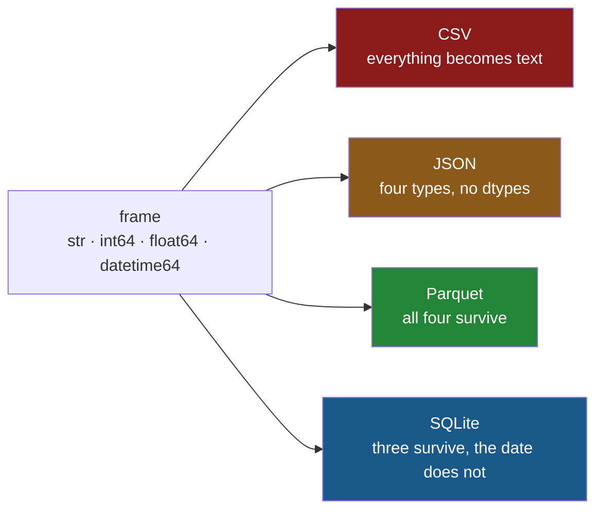

# 4.4 — `to_sql`, and what SQLite invents

## One-line answer

`to_sql` will happily create a table for you, but the schema it invents is a guess made from your
frame's dtypes — it adds a column you did not ask for, it cannot express a date, and the table it
builds enforces almost nothing.

---

## The story

The flat's list has been living in a spreadsheet, and somebody decides to move it into the app's
file properly.

It is one line of code, and it works. The list is in the database, the app shows it, everybody is
pleased.

Two things turn up later.

The first is a column nobody put there. Sitting in front of the item names is a column of `0, 1, 2,
3`, which is not part of the shopping list. Nobody typed it and nobody wants it, but it is now in the
table and the app's own screens have started showing it.

The second takes longer to find. The dates went in as dates and come back as words — `2026-08-30
00:00:00`, with a time on the end that nobody ever entered. Sorting the list by date now sorts it
alphabetically, which is nearly right and therefore hard to spot.

Neither of these is a bug in anybody's code. Both come from the same thing: nobody said what the
table should look like, so something else decided.

---

## The idea in plain language

`to_sql` writes a frame into a database table. If the table does not exist, **it creates one**, and
to create one it needs a schema — a declaration of the columns and their types, which
[4.1](4.1-a-table-that-knows-its-types.md) introduced.

You did not write that schema, so `to_sql` writes it for you by translating each column's dtype into
the nearest SQL type it can find. That translation is the subject of this part, and it goes wrong in
three specific ways.

**It writes the index as a column.** A frame's index is not one of its columns
([Day 26, 1.2](../../../day-26-frames-and-copy-on-write/parts/01-the-two-objects/1.2-the-index-is-not-a-row-number.md)),
but `to_sql` stores it as one by default, under the name `index`. When your index is the default
range of row numbers, that column is pure noise, permanently written into the table.

**It cannot express a date in SQLite.** [4.2](4.2-read-sql-and-the-connection.md) established that
SQLite has no date type. So a `datetime64` column is written as text, and when it comes back it is
text. **A round trip through SQLite loses the date type**, which is exactly what the round trip
through Parquet did not do ([3.2](../03-parquet/3.2-the-round-trip-that-keeps-dtypes.md)).

**The table it makes enforces nothing.** No `NOT NULL`, no keys, no constraints — because a frame's
dtypes do not record any of that. The whole reason section 4 exists is that a table can refuse bad
data ([4.1](4.1-a-table-that-knows-its-types.md)), and a table created this way has given that up.

There is one more idea you need, and it is SQLite's alone. **Type affinity** was mentioned in
[4.1](4.1-a-table-that-knows-its-types.md) and this is where it costs you. In most databases a
column's type is enforced absolutely: put text in an integer column and the write fails. SQLite
instead treats the declared type as a *preference*. It will convert a value towards that type if it
can, and if it cannot, **it stores the value as it came and says nothing**. So an `INTEGER` column in
SQLite can contain the word `lots`, and the first thing that notices is pandas, several days later.

Finally, the argument that decides what happens when the table is already there. `if_exists=` takes
one of four values: `"fail"` (the default — raise), `"replace"` (**drop** the table and make a new
one), `"append"` (add these rows to what is there), and `"delete_rows"` (empty the table but keep it).
The difference between the last two and `"replace"` is the one that catches people: `replace` operates
on the **table**, not on its rows, so it takes the schema, the constraints and the indexes with it.

---

## Why Setu needs it

- **[5.3](../05-the-module/5.3-the-round-trip-test.md)** is the test that pins which formats survive
  a round trip. SQLite is the one that fails it, and this part is why.
- **[5.1](../05-the-module/5.1-the-loaders-module.md)** decides what the day's module will and will
  not do. Writing to SQL with an invented schema is one of the things it deliberately refuses.
- **Day 226** creates the project's real tables in Postgres, by hand, in a migration file. This part
  is the argument for why they are not created by a `to_sql` call.
- **Day 227** is the ingestion project, which writes what it scrapes. Choosing between `replace` and
  `append` on a job that reruns is the difference between an empty table and a table of duplicates.
- **Day 234** serves this data through an API, and a stray `index` column in the table becomes a
  stray field in the response, which somebody's client then starts depending on.

---

## The mechanism

The one-line write, and the schema it invented:

```python
import sqlite3
from pathlib import Path

import pandas as pd

frame = pd.read_csv(
    "data/shopping.csv",
    dtype={"item": "str", "need": "int64", "price": "float64", "aisle": "str"},
    parse_dates=["bought"],
)
Path("data/idx.db").unlink(missing_ok=True)
con = sqlite3.connect("data/idx.db")
frame.to_sql("shopping", con)
for (statement,) in con.execute("SELECT sql FROM sqlite_master WHERE name = 'shopping'"):
    print(statement)
con.close()
```

**Line by line:**

- The frame is read with `dtype=` and `parse_dates=`, so it is **correct going in**. Everything that
  follows is damage done by the write, not by the read
  ([1.4](../01-the-csv/1.4-dtype-at-read-time.md)).
- `frame.to_sql("shopping", con)` — the table name and the connection. **This is the version almost
  everybody writes the first time**, and the two arguments it is missing are the whole part.
- `sqlite_master` again, so the schema `to_sql` wrote can be read back
  ([4.1](4.1-a-table-that-knows-its-types.md)). The point is that you did not write this and you
  should look at it.

```text
CREATE TABLE "shopping" (
"index" INTEGER,
  "item" TEXT,
  "need" INTEGER,
  "price" REAL,
  "aisle" TEXT,
  "bought" TIMESTAMP
)
```

**There is the column nobody asked for.** `"index" INTEGER` is the frame's row numbers, now
permanently part of the table. `index=False` is the fix, and it should be on essentially every
`to_sql` call you ever write; the exception is when the index genuinely carries information, such as
a timestamp index, and then it deserves a real name via `index_label=`.

Look at `"bought" TIMESTAMP` too. SQLite accepts that word in a `CREATE TABLE` — it accepts almost
any word — but it has no `TIMESTAMP` type, so the column's affinity ends up as text. The declaration
is a note to human readers and nothing more.

Now the round trip, done properly, with the write fixed:

```python
import sqlite3
from pathlib import Path

import pandas as pd

frame = pd.read_csv(
    "data/shopping.csv",
    dtype={"item": "str", "need": "int64", "price": "float64", "aisle": "str"},
    parse_dates=["bought"],
)
Path("data/out.db").unlink(missing_ok=True)
con = sqlite3.connect("data/out.db")
written = frame.to_sql("shopping", con, index=False, if_exists="replace")
back = pd.read_sql("SELECT * FROM shopping", con)
con.close()
print("rows written:", written)
print("went in :", frame["bought"].dtype)
print("came out:", back["bought"].dtype)
print(back[["item", "bought"]].head(2))
```

**Line by line:**

- `index=False` — the row numbers stay out of the table. This is the argument the previous block was
  missing.
- `if_exists="replace"` — **drop the table and build it again.** It makes the script re-runnable,
  which is why it is used here, and it is the most destructive of the three options: it throws away
  the existing table's schema, its constraints and its indexes along with its rows.
- `written = frame.to_sql(...)` — `to_sql` returns the number of rows it wrote. Checking it against
  `len(frame)` is a one-line assertion that the write did what you think, and almost nobody uses it.
- `pd.read_sql` with no `parse_dates=`, deliberately, to show what the table alone can say
  ([4.2](4.2-read-sql-and-the-connection.md)).

```text
rows written: 4
went in : datetime64[us]
came out: str
    item               bought
0   milk  2026-08-30 00:00:00
1  bread  2026-08-30 00:00:00
```

**A `datetime64[us]` went in and a `str` came out**, carrying a midnight nobody typed. The value is
not wrong, but the type is, and every date operation downstream now fails or silently does string
work instead. `parse_dates=["bought"]` on the read restores it, and the fact that you must remember
to is the cost of this store.

Where each of the day's four formats stands on the round trip:



And here is affinity, which is the part that surprises people who have used other databases:

```python
import sqlite3
from pathlib import Path

Path("data/aff.db").unlink(missing_ok=True)
con = sqlite3.connect("data/aff.db")
con.execute("CREATE TABLE t (need INTEGER NOT NULL)")
con.execute("INSERT INTO t VALUES (2)")
con.execute("INSERT INTO t VALUES ('lots')")
con.commit()
print(list(con.execute("SELECT need, typeof(need) FROM t")))
con.close()
```

**Line by line:**

- `need INTEGER NOT NULL` — as strict a declaration as SQLite's syntax allows here.
- `INSERT INTO t VALUES ('lots')` — text, into that column. **This succeeds.** There is no error, no
  warning and no conversion; the value could not be made into an integer, so SQLite kept it as text.
- `typeof(need)` — a SQLite function returning the storage class of the value **in that row**, not
  the column's declared type. It is the only way to see what actually happened, and running it on a
  suspect column is the first diagnostic when a numeric column starts behaving oddly.

```text
[(2, 'integer'), ('lots', 'text')]
```

Two rows in one `INTEGER` column, holding two different storage classes. Read that table into pandas
and the column arrives as `object` — the dtype Day 26 spent a whole section explaining had gone away
([Day 26, 2.4](../../../day-26-frames-and-copy-on-write/parts/02-the-str-dtype/2.4-dtypes-equals-object-finds-nothing.md)).
It is back, because the column genuinely holds two kinds of thing.

---

## When it breaks

**`if_exists` doing its job:**

```text
$ uv run python -c "
import sqlite3
import pandas as pd
con = sqlite3.connect('data/out.db')
pd.DataFrame({'item': ['tea']}).to_sql('shopping', con, index=False, if_exists='fail')
" 2>&1 | tail -1
```

```text
ValueError: Table 'shopping' already exists.
```

**What it means.** `"fail"` is the default, and it is the right default: writing into a table you did
not know was there is how a job silently doubles its data. The message is plain, and meeting it is a
prompt to decide which of `replace` and `append` you actually meant — not to reach for whichever one
makes the error go away.

**A `STRICT` table refusing what an ordinary one accepts:**

```text
$ uv run python -c "
import sqlite3
con = sqlite3.connect(':memory:')
con.execute('CREATE TABLE t (need INTEGER NOT NULL) STRICT')
con.execute(\"INSERT INTO t VALUES ('lots')\")
" 2>&1 | tail -1
```

```text
sqlite3.IntegrityError: cannot store TEXT value in INTEGER column t.need
```

**What it means.** The same insert that succeeded a moment ago now fails, because of one keyword. A
`STRICT` table enforces its declared types the way other databases do, and the error names the value's
type, the column's type and the column. SQLite added strict tables in version 3.37.0 (2021) —
*STRICT Tables*, canonical documentation at <https://www.sqlite.org/stricttables.html> — precisely
because affinity surprises people. **This is the single most valuable thing in this part**, and
`to_sql` will never write it for you.

**The one that does not fail — appending a frame with a column missing:**

```text
$ uv run python -c "
import sqlite3
import pandas as pd
con = sqlite3.connect('data/app.db')
f = pd.read_csv('data/shopping.csv')
f.to_sql('shopping', con, index=False, if_exists='replace')
f.drop(columns=['aisle']).to_sql('shopping', con, index=False, if_exists='append')
print(con.execute('SELECT COUNT(*) FROM shopping').fetchone())
print(pd.read_sql('SELECT * FROM shopping', con).tail(2))
"
```

```text
(8,)
   item  need  price aisle               bought
6  eggs     6   0.32   NaN                  NaN
7  rice     1   2.05   NaN  2026-08-24 00:00:00
```

**What it means.** A frame with four columns was appended to a table with five, and it worked. The
missing column was filled with `NULL` on every new row, silently, and the table now holds four good
rows and four rows with a hole in them. Nothing raised, and `COUNT(*)` says eight, which looks
healthy. Had the table been created with `aisle TEXT NOT NULL` — as
[4.1](4.1-a-table-that-knows-its-types.md) wrote it by hand — this would have been an
`IntegrityError` on the first row. **The table `to_sql` invented could not refuse it, and that is the
concrete cost of letting a write invent your schema.**

---

## In production

**What a professional writes instead of the teaching version.** The table is created from a schema
file with real constraints, and `to_sql` only ever appends into it:

```python
import sqlite3
from contextlib import closing
from pathlib import Path

import pandas as pd

CREATE = """
CREATE TABLE IF NOT EXISTS shopping (
    item   TEXT    NOT NULL,
    need   INTEGER NOT NULL,
    price  REAL    NOT NULL,
    aisle  TEXT    NOT NULL,
    bought TEXT
) STRICT
"""


def append_shopping(db: Path, frame: pd.DataFrame) -> int:
    """Append rows into a table whose schema we own. Returns the number written."""
    out = frame.assign(bought=frame["bought"].dt.strftime("%Y-%m-%d"))
    with closing(sqlite3.connect(db)) as con:
        con.execute(CREATE)
        written = out.to_sql("shopping", con, index=False, if_exists="append")
        con.commit()
    if written != len(frame):
        raise RuntimeError(f"wrote {written} rows, expected {len(frame)}")
    return written
```

**Line by line:**

- `CREATE TABLE IF NOT EXISTS … STRICT` — **the schema is ours**, with the `NOT NULL` constraints
  that make the silent append above impossible, and `STRICT` so affinity cannot store a word in a
  number column. `IF NOT EXISTS` makes the function safe to call every time.
- `.dt.strftime("%Y-%m-%d")` — the date is turned into text **deliberately, in a format we chose**,
  rather than being turned into text by accident with a midnight attached. If the store cannot hold a
  type, converting on purpose beats letting the driver decide. The `.dt` accessor is Day 33's
  subject; here it is doing one job.
- `if_exists="append"` and never `"replace"` — replace would drop the table and take the `STRICT`
  declaration and the constraints with it, quietly undoing every guarantee this function exists to
  provide. **That is the real danger of `replace`**: not that it deletes rows, but that it deletes
  the schema. When a refresh really does need to empty the table first, `"delete_rows"` is the
  option that does it without dropping anything.
- `written != len(frame)` — the returned count checked rather than ignored, which turns a partial
  write into an exception instead of a quiet shortfall. It is the same "check the effect, do not
  assume it" habit as Day 26's module
  ([Day 26, 5.1](../../../day-26-frames-and-copy-on-write/parts/05-the-module/5.1-the-shopping-list-module.md)).
- `con.commit()` inside the `with` — `closing` closes the connection but does not commit, and an
  uncommitted write is discarded on close ([4.1](4.1-a-table-that-knows-its-types.md)).

**What changes at scale.** `to_sql` inserts row by row, and on anything large that is the slowest
part of the job. Two arguments help: `chunksize=` sends the rows in batches instead of one enormous
statement, and `method="multi"` puts several rows into each `INSERT`. Both are worth measuring rather
than assuming, because the best combination depends on the driver. Past a certain size the honest
answer is that `to_sql` is the wrong tool: every real database has a bulk loader — `COPY` in
Postgres, `.import` in the SQLite shell — that is faster by an order of magnitude, and reaching for
it is normal rather than an admission of defeat.

The other thing that changes is **what a rerun does.** A job that appends is not safe to run twice;
a job that replaces is not safe to run at all if anything else writes to that table. The production
answer is usually neither: it is an **upsert**, keyed on something that identifies a row, so that
rerunning the job updates rather than duplicates. `to_sql` cannot do it, and this is the point where
most projects stop using it for writes and write the SQL themselves.

**The failure that only appears with real data.** A nightly job used `if_exists="replace"` to refresh
a reporting table, and worked perfectly for months. Someone then added an index to that table to make
the dashboard fast. The next night's run dropped the table and rebuilt it, the index went with it,
and the dashboard was slow again — with nothing in any log, because dropping a table is exactly what
`replace` is documented to do. The lesson is that anything attached to the table is collateral.
`if_exists="delete_rows"` is the option that was meant, and the difference is visible in one run:

```text
$ uv run python -c "
import sqlite3
import pandas as pd
con = sqlite3.connect(':memory:')
con.execute('CREATE TABLE shopping (item TEXT NOT NULL, need INTEGER NOT NULL) STRICT')
con.execute('CREATE INDEX idx_item ON shopping(item)')
f = pd.DataFrame({'item': ['milk'], 'need': [2]})
show = lambda: [r[0] for r in con.execute(
    \"SELECT sql FROM sqlite_master WHERE tbl_name='shopping'\")]
f.to_sql('shopping', con, index=False, if_exists='delete_rows'); print('delete_rows:', show())
f.to_sql('shopping', con, index=False, if_exists='replace');     print('replace    :', show())
"
```

```text
delete_rows: ['CREATE TABLE shopping (item TEXT NOT NULL, need INTEGER NOT NULL) STRICT', 'CREATE INDEX idx_item ON shopping(item)']
replace    : ['CREATE TABLE "shopping" (
"item" TEXT,
  "need" INTEGER
)']
```

`delete_rows` left the `STRICT`, both `NOT NULL`s and the index exactly as they were. `replace` threw
away all four and wrote pandas' guess in their place — which is [4.1](4.1-a-table-that-knows-its-types.md)'s
enforcement, silently undone by a refresh job.

**The review comment a senior engineer leaves.** *"`df.to_sql('shopping', con)` — this creates the
table on first run, which means our schema is whatever pandas guessed that day. Put the DDL in
`sql/`, make it `STRICT` with `NOT NULL` where we mean it, and use `if_exists='append'` here. Also
`index=False`, or we ship a row-number column to every consumer."*

**The interview question.** *"You have a DataFrame and you need it in a database. What do you
watch out for?"* The answer that shows you have done it: do not let `to_sql` create the table,
because the schema it invents has no constraints, no keys and no indexes, and it will be wrong in a
way nobody sees until the data is bad; pass `index=False` unless the index means something; be
deliberate about `if_exists`, remembering that `replace` drops the table and everything attached to
it while `delete_rows` keeps them; and check the returned row count. Then the one that gets a follow-up: **know what your database
cannot store.** SQLite has no date and no boolean type, so decide the representation yourself rather
than discovering it on the way back out.

---

## Check yourself

```bash
uv run python -c "
import sqlite3
import pandas as pd
con = sqlite3.connect('data/out.db')
print(pd.read_sql('SELECT * FROM shopping', con).dtypes.to_string())
print()
print(list(con.execute('SELECT bought, typeof(bought) FROM shopping LIMIT 2')))
con.close()
"
```

`typeof` reports what is actually stored, one row at a time. Say what the frame's `bought` column was
before it was written, what it is now, and which of the two arguments on the write would have
prevented it. (One of them would not have. Say which, and why.)

**Answer out loud, without scrolling up:**

> Name the three things `to_sql` decides for you when it creates a table, and say which one of them
> you can never fix afterwards without rewriting the table. Then explain what type affinity is, and
> what one keyword turns it off.

---

**Next:** [5.1 — `src/setu/loaders.py`, the day's module](../05-the-module/5.1-the-loaders-module.md).
