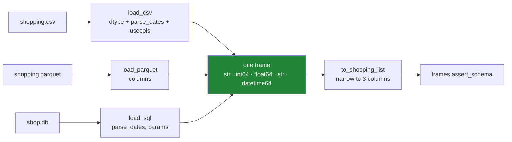

# 5.1 — `src/setu/loaders.py`: one frame, four stores

## One-line answer

The day's module puts one typed frame behind four different stores, so that the rest of the project
asks for a shopping list rather than asking for a CSV — and the arguments that make each read correct
are written down once, in one file, instead of at every call site.

---

## The story

By now the flat's list arrives four ways.

The shop emails a spreadsheet. The app on the phone has its own file. Somebody exported a copy in a
format that opens quickly. And there is still the original text file that started all this.

For a while, whoever needed the list just opened whichever copy was nearest. That is where the
trouble came from. Each copy needs slightly different handling, and each person remembered a
different amount of it. One of them always remembered the aisle numbers keep their leading zero.
One of them never did. So the same question — what did this week cost — got two answers depending on
who asked it, and both people were sure they had done it right.

Nobody was careless. The knowledge about how to open each copy correctly was just sitting in
people's heads instead of being written down anywhere.

---

## The idea in plain language

The module is one file with one job: **turn any of the four stores into the same frame.**

The value of that is not tidiness. It is that every argument this day has argued for —
`dtype=`, `parse_dates=`, `usecols=`, `columns=`, `params=` — is a piece of knowledge about the data,
and knowledge that lives at a call site has to be remembered at every call site. Written once in a
module, it is remembered by the import.

Two words for what this file is. It is a **loader**, meaning code whose only job is getting data in;
and it is an **anti-corruption layer**, which is the name for a piece of code that sits at a boundary
and stops the outside world's shape from leaking into yours. Everything past this module works with
one frame. Nothing past it knows what a `usecols` is.

The module holds three kinds of thing:

**The definitions.** `SCHEMA` — column name to dtype name, which
[1.4](../01-the-csv/1.4-dtype-at-read-time.md) argued for — plus `DATES` for the columns that get
parsed rather than converted, and `COLUMNS` derived from both. These are the day's arguments turned
into constants.

**The readers.** One function per store, each taking a path and returning the same frame. They differ
only in how much work they have to do, and that difference is the day's whole argument: the CSV
reader needs three arguments, the Parquet reader needs one, and the SQL reader needs none for its
types and one for its date.

**The narrowing.** Day 26's module has a `SCHEMA` of three columns — item, need, price — and its
`assert_schema` deliberately rejects a frame with extra columns
([Day 26, 5.2](../../../day-26-frames-and-copy-on-write/parts/05-the-module/5.2-asserting-the-schema.md)).
The file has five. **That is not a conflict; it is a boundary.** The file's shape and the domain
object's shape are allowed to differ, and one function converts between them.

One thing the module deliberately does **not** do. It does not write to SQL. Everything in
[4.4](../04-sql/4.4-to-sql-and-what-sqlite-invents.md) argues that a table's schema should not be
invented by a write, so a module whose job is reading has no `to_sql` in it at all. **What a module
refuses to do is part of its design.**

---

## Why Setu needs it

- **[5.2](5.2-the-file-that-does-not-fit.md)** adds the chunked reader to this module, which is the
  same functions again for a file that will not fit in memory.
- **[5.3](5.3-the-round-trip-test.md)** is the test file, and it tests exactly the promises this part
  writes down.
- **Day 26's `frames.py`** owns what a shopping list *is*; this module owns how it *arrives*. Keeping
  those separate is why `to_shopping_list` exists rather than one enormous schema.
- **Day 30** onwards, every modelling day starts by loading data. The split-before-scaler rule
  (Principle 8) only makes sense if loading is a step that ends cleanly, and this is that step.
- **Day 227**, the ingestion project, is this module grown up: more sources, the same shape, the same
  refusal to let a source's quirks past the boundary.

---

## The mechanism

The head of the file — the definitions and the exception, before any function:

```python
"""Read the flat's shopping list from any of four stores, and get one typed frame back."""

from __future__ import annotations

import sqlite3
from collections.abc import Iterator
from contextlib import closing
from pathlib import Path

import pandas as pd

from setu.frames import SCHEMA as LIST_SCHEMA
from setu.frames import SchemaError, assert_schema

SCHEMA: dict[str, str] = {"item": "str", "need": "int64", "price": "float64", "aisle": "str"}
DATES: tuple[str, ...] = ("bought",)
COLUMNS: list[str] = [*SCHEMA, *DATES]

SHOPPING_QUERY = f"SELECT {', '.join(COLUMNS)} FROM shopping"


class LoadError(ValueError):
    """The store did not produce the shopping list this module promises."""
```

**Line by line:**

- The docstring says the contract in one sentence — *any of four stores, one typed frame* — where
  `help(loaders)` will show it.
- `from setu.frames import SCHEMA as LIST_SCHEMA` — Day 26's schema, **imported and renamed**, not
  copied. The rename is the point: two schemas exist on purpose, and giving them different names in
  this file makes it impossible to use the wrong one by accident.
- `from setu.frames import SchemaError, assert_schema` — the exception and the check are **reused**,
  not rewritten. A second exception class meaning the same thing is how `except` clauses start missing
  errors ([Day 18, 2.2](../../../day-18-exceptions/parts/02-the-hierarchy/2.2-which-built-in-to-raise.md)).
- `SCHEMA` here has **four** entries where Day 26's has three. `aisle` is in the file and not in the
  domain object, and this is the file's schema.
- `DATES` is a **tuple**, not a list, because it is a constant and a tuple cannot be appended to by
  accident ([Day 8, 1.3](../../../day-08-containers/parts/01-sequences/1.3-a-tuple-is-a-record.md)).
  It is converted with `list(DATES)` at each call, because `parse_dates=` wants a list.
- `COLUMNS = [*SCHEMA, *DATES]` — **derived**, so the column list cannot drift from the schema
  ([3.4](../03-parquet/3.4-column-pruning.md)). Unpacking a dict gives its keys, in insertion order,
  so the order here is the order the file is expected in.
- `SHOPPING_QUERY` is built from `COLUMNS`, which is the one place on this day where SQL is
  constructed by formatting — and it is safe for a reason worth stating: **the values being formatted
  are the module's own constants, not anything a caller supplied.** That is the exact distinction
  [4.3](../04-sql/4.3-params-not-f-strings.md) drew between an allow-list and an injection.
- `LoadError(ValueError)` — a bad file is a bad *value*, so `ValueError` is the right parent, and a
  caller who has never heard of this module still catches it.

The four readers:

```python
def load_csv(path: str | Path) -> pd.DataFrame:
    """Read a shopping-list CSV with every type declared at read time."""
    return pd.read_csv(path, usecols=COLUMNS, dtype=SCHEMA, parse_dates=list(DATES))


def load_parquet(path: str | Path) -> pd.DataFrame:
    """Read a shopping-list Parquet file. The file carries its own types."""
    return pd.read_parquet(path, columns=COLUMNS)


def load_sql(db: str | Path, aisle: str | None = None) -> pd.DataFrame:
    """Read the shopping table, optionally one aisle, through a read-only connection."""
    query = SHOPPING_QUERY
    params: tuple[str, ...] = ()
    if aisle is not None:
        query += " WHERE aisle = ?"
        params = (aisle,)
    with closing(sqlite3.connect(f"file:{db}?mode=ro", uri=True)) as con:
        return pd.read_sql(query, con, params=params, parse_dates=list(DATES))
```

**Line by line:**

- **Read the three bodies against each other; the comparison is the day.** `load_csv` needs three
  arguments to be correct. `load_parquet` needs one, and that one is for pruning rather than for
  types ([3.2](../03-parquet/3.2-the-round-trip-that-keeps-dtypes.md)). `load_sql` needs none for its
  types and one for its date, because SQLite has no date
  ([4.2](../04-sql/4.2-read-sql-and-the-connection.md)). **The length of each argument list is a
  measure of how much the store failed to record about itself.**
- `str | Path` on every path parameter — callers pass strings, and refusing them would be pedantry.
  The functions hand the value straight to pandas, which accepts both
  ([Day 16, 1.1](../../../day-16-files-and-context-managers/parts/01-the-path/1.1-a-path-is-not-a-string.md)).
- `usecols=COLUMNS` and `columns=COLUMNS` together — the same closed read expressed in each reader's
  own argument name, so a sixth column appearing in the file changes nothing here.
- `aisle: str | None = None` — the optional filter. The default `None` means "all of them", which is
  different from an empty string meaning "the aisle whose name is empty", and that difference is why
  the check below is `is not None` rather than `if aisle`.
- `params: tuple[str, ...] = ()` — declared before the branch, so both paths pass the same argument
  and `read_sql` is called in exactly one place. An empty tuple with no placeholders is fine.
- `query += " WHERE aisle = ?"` — the **clause** is added by the module and the **value** goes in
  `params`. That is the whole rule from [4.3](../04-sql/4.3-params-not-f-strings.md): structure from
  us, values bound.
- `f"file:{db}?mode=ro"` with `uri=True` — the connection cannot write, so no bug in this module can
  damage the database (Principle 11). It also turns a mistyped path into an error rather than a new
  empty database ([4.1](../04-sql/4.1-a-table-that-knows-its-types.md)).
- `closing(...)` — the connection is closed even when `read_sql` raises. `with con:` would commit
  rather than close, which is the trap [4.2](../04-sql/4.2-read-sql-and-the-connection.md) showed
  ([Day 16, 4.6](../../../day-16-files-and-context-managers/parts/04-context-managers/4.6-a-connection-that-always-closes.md)).

The dispatcher, and the narrowing:

```python
def load(path: str | Path) -> pd.DataFrame:
    """Read a shopping list from whichever store `path` names, chosen by its suffix."""
    path = Path(path)
    readers = {".csv": load_csv, ".parquet": load_parquet, ".db": load_sql}
    try:
        reader = readers[path.suffix]
    except KeyError:
        raise LoadError(
            f"cannot load {path.name}: no reader for {path.suffix!r}; "
            f"expected one of {sorted(readers)}"
        ) from None
    return reader(path)


def to_shopping_list(frame: pd.DataFrame) -> pd.DataFrame:
    """Narrow a loaded frame to the three columns Day 26's schema promises."""
    missing = [name for name in LIST_SCHEMA if name not in frame.columns]
    if missing:
        raise LoadError(f"loaded frame is missing {', '.join(missing)}")
    return assert_schema(frame[list(LIST_SCHEMA)].copy())
```

**Line by line:**

- `readers` is a **dictionary of functions**, not an `if`/`elif` chain. Adding a format is one entry,
  and the legal set is a value the error message can print
  ([Day 14, 1.1](../../../day-14-decorators/parts/01-functions-as-values/1.1-a-function-is-a-value.md)).
- `raise … from None` — suppresses the `KeyError` in the traceback. The `KeyError` is an
  implementation detail of the lookup and showing it under "During handling of the above exception"
  only invites the reader to debug the wrong thing
  ([Day 18, 2.3](../../../day-18-exceptions/parts/02-the-hierarchy/2.3-raise-from-and-the-chain.md)).
- `{path.suffix!r}` — `!r` puts quotes around `.xlsx`, so an empty suffix prints as `''` rather than
  as nothing at all
  ([Day 7, 3.3](../../../day-07-strings/parts/03-formatting/3.3-repr-and-the-debugging-f-string.md)).
- `sorted(readers)` in the message — the legal options, listed. An error that says what you may do
  instead is worth twice one that only says no.
- `missing = [...]` checked **before** the selection — selecting a column that is not there raises a
  `KeyError` naming the column but not the situation, and this turns it into a sentence about
  shopping lists.
- `frame[list(LIST_SCHEMA)]` — the three domain columns, in the schema's order, so the result matches
  Day 26's expectation exactly rather than the file's ordering.
- `.copy()` — **an explicit copy**, so the narrowed frame owns its data. Under Copy-on-Write the
  result would behave like a copy anyway
  ([Day 26, 3.1](../../../day-26-frames-and-copy-on-write/parts/03-copy-on-write/3.1-every-result-behaves-like-a-copy.md)),
  and writing it down says the intent to a reader rather than relying on them knowing the version.
- `assert_schema(...)` from Day 26, applied to the narrowed frame — **the check is not rewritten
  here.** The module that owns the definition owns the check.

What the module is for, in one picture:



Everything left of the green box is this day. Everything right of it is Day 26's, unchanged.

---

## When it breaks

**A format there is no reader for:**

```text
$ uv run python -c "
from setu.loaders import load
load('shopping.xlsx')
" 2>&1 | tail -1
```

```text
setu.loaders.LoadError: cannot load shopping.xlsx: no reader for '.xlsx'; expected one of ['.csv', '.db', '.parquet']
```

**What it means.** The message names the file, the suffix and the legal set. Compare it with what the
bare dictionary lookup would have produced — `KeyError: '.xlsx'` — which names the suffix and nothing
else. The `from None` is why the `KeyError` is not also printed underneath.

**A frame that has lost a column, on the way to Day 26's schema:**

```text
$ uv run python -c "
from setu.loaders import load_csv, to_shopping_list
to_shopping_list(load_csv('data/shopping.csv').drop(columns=['price']))
" 2>&1 | tail -1
```

```text
setu.loaders.LoadError: loaded frame is missing price
```

**What it means.** Caught by the module's own check rather than by the selection, which is the
difference between this sentence and `KeyError: "['price'] not in index"`. The lesson is general:
**a check placed one line before the operation turns a library's error into your project's error**,
and yours can mention shopping lists.

**The database that is not there — and why the error is good:**

```text
$ uv run python -c "
from setu.loaders import load_sql
load_sql('data/nope.db')
" 2>&1 | tail -1
```

```text
sqlite3.OperationalError: unable to open database file
```

**What it means.** This is `mode=ro` earning its place. Without it, `sqlite3.connect` would have
**created** `data/nope.db`, and the failure would have arrived one line later as `no such table:
shopping` — an error about a table, on a database that was never yours
([4.1](../04-sql/4.1-a-table-that-knows-its-types.md)). The message here is vaguer and the diagnosis
is far better, which is a trade worth making on purpose.

---

## In production

**What a professional writes instead of the teaching version.** Two changes, and neither is about
the reading.

The first is that the module does not decide where files live. Every function takes a path, and no
function builds one, so the module is testable against `tmp_path` and has no opinion about
deployment. That is why there is no `DATA` constant here, and it is the boundary
[1.1](../01-the-csv/1.1-a-csv-has-no-types-in-it.md)'s production section put in a separate helper.

The second is what happens when the schema and the file disagree. In a real ingestion path the read
is followed immediately by a check, and the check is *loud*:

```python
def load_checked(path: str | Path) -> pd.DataFrame:
    """Load, then prove the frame is what this module promised. Raise if it is not."""
    frame = load(path)
    actual = {name: str(frame[name].dtype) for name in SCHEMA if name in frame.columns}
    wrong = {name: got for name, got in actual.items() if got != SCHEMA[name]}
    if wrong or set(frame.columns) != set(COLUMNS):
        raise LoadError(
            f"{Path(path).name} did not load as promised: "
            f"columns {sorted(frame.columns)}, wrong dtypes {wrong or 'none'}"
        )
    return frame
```

**Line by line:**

- The check runs **after** the read, because `dtype=` is a request and not a guarantee: it is silently
  ignored for a column name that does not appear in the file
  ([1.4](../01-the-csv/1.4-dtype-at-read-time.md)). Asking for a dtype and confirming you got it are
  two separate acts.
- `set(frame.columns) != set(COLUMNS)` — compared as **sets**, because for this check order does not
  matter and `usecols=` and `columns=` disagree about order anyway
  ([3.4](../03-parquet/3.4-column-pruning.md)).
- `wrong or 'none'` in the message — the empty dictionary would print as `{}`, and a message that
  reads "wrong dtypes none" tells the reader the failure was about the columns
  ([Day 5, 2.4](../../../day-05-operators-and-conditionals/parts/02-conditionals/2.4-and-or-return-operands.md)).
- It returns the frame, so it composes into a chain the way Day 26's `assert_schema` does.

**What changes at scale.** Three things this module would gain in a real project. It would grow a
`source` column, or something equivalent, so a row can be traced back to the file it came from — the
first question asked about a bad number is always where it came from, and a frame assembled from
four stores cannot answer it. It would gain **caching**, since re-reading a large Parquet file on
every call is waste, and the natural shape is a converted local copy rather than a decorator. And
`load_csv` would gain `encoding=` and `on_bad_lines=` as explicit arguments, because
[1.1](../01-the-csv/1.1-a-csv-has-no-types-in-it.md) showed both defaults being wrong on real data.

The most important scaling change, though, is one this module has already made: **it has no global
state.** Every function takes its input and returns its output, which is what makes the whole thing
testable without a fixture directory and safe to call from several threads
([Day 10, 3.3](../../../day-10-functions/parts/03-the-module/3.3-pure-functions-and-the-seam.md)).

**The failure that only appears with real data.** A loader like this ran for a year against a
partner's monthly CSV. Then one month the file arrived with its columns in a different order.
Nothing broke — `usecols=` and `dtype=` are both keyed by name, so the frame came out identical, and
that is the module working correctly. What broke was a downstream script that had been reading
`frame.iloc[:, 3]` for a year. The lesson is that a loader's guarantee is only worth what its callers
rely on, and a guarantee about *names* does not protect code written against *positions*.

**The review comment a senior engineer leaves.** *"Good — one module, one frame. Two things: `load`
dispatches on the suffix, so a `.txt` file that is really a CSV cannot be read at all. Either accept
an explicit `format=` override or document that the suffix is the contract. And `load_checked` should
be the public one; `load` being the easy name means everyone will use the unchecked version."*

**The interview question.** *"How do you organise data loading in a project?"* The answer that shows
you have maintained one: put it behind a module, so that the arguments which make a read correct are
written once rather than at every call; return the same shape from every source, so the rest of the
code does not branch on the format; validate immediately after loading, because a request for a dtype
is not proof you got it; and keep the loader free of both file-location decisions and global state,
so it can be tested against a temporary directory. The follow-up is usually about schema changes,
and the honest answer is that you want the loader to **fail** on an unexpected column rather than
tolerate it, because a tolerated change becomes a silent one.

---

## Check yourself

```bash
uv run python -c "
from setu.loaders import SCHEMA, DATES, COLUMNS, load
print('SCHEMA :', SCHEMA)
print('DATES  :', DATES)
print('COLUMNS:', COLUMNS)
print()
print(load('data/shopping.csv').dtypes.to_string())
"
```

`COLUMNS` was never typed out; it was derived. Say what would go wrong if it had been written by hand
and a sixth column were added to `SCHEMA` a year from now.

**Answer out loud, without scrolling up:**

> Three readers, three different numbers of arguments. Say how many each needs and why, without
> naming the arguments. Then say why this module has no function that writes to SQL.

---

**Next:** [5.2 — The file that does not fit](5.2-the-file-that-does-not-fit.md).
