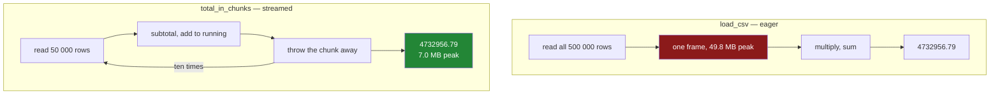

# 5.2 — The file that does not fit: `chunksize` and the running total

## One-line answer

`chunksize=` turns a read into a stream of small frames instead of one big one, so a file larger than
your memory can still be added up — and the running total that comes out is the same to the penny,
but not bit-for-bit identical, which is worth knowing before you write the test.

---

## The story

The shop offers to send the flat everything, not just this week.

It arrives as one file with three years of shopping in it, and it is far bigger than anything anybody
has opened before. Somebody runs the same line they always run to add up a shopping list, and the
laptop's fan comes on, and then everything gets slow, and then the terminal prints a wall of red and
the machine is usable again.

The thing that catches people out here is that nothing was wrong with the question. Adding up three
years of prices is not a hard sum. It is not even a slow sum.

What went wrong is that the code insisted on holding all three years at once before adding up any of
it. And you do not need to. If you were doing this on paper you would not lay every receipt on the
table first — you would take them one at a time, keep a running total, and put each one down.

---

## The idea in plain language

Every read so far on this day has been **eager**: `pd.read_csv` reads the whole file, builds the whole
frame, and hands it back. Everything works on it afterwards, so the frame has to exist in full,
and that means the machine must hold all of it at once.

The frame is also **bigger in memory than the file on disk**, which is the part that surprises people.
Text on disk is compact; a frame has typed columns, an index, and per-column overhead
([3.3](../03-parquet/3.3-the-size-and-the-speed-measured.md) measured a 1.6 MB file becoming 23 MB of
frame). So "the file is 4 GB and I have 16 GB of memory" is not the reassurance it sounds like.

**Chunked reading** is the alternative. Pass `chunksize=n` and the reader gives back not a frame but
an **iterator** of frames, each holding at most `n` rows. You loop over it, do your work on each
chunk, and let each one be thrown away before the next arrives. Only one chunk is in memory at a
time.

An **iterator** is an object you can take items from one at a time, which produces each item only
when asked ([Day 11, 1.1](../../../day-11-iterators-and-generators/parts/01-iterators/1.1-iterable-and-iterator.md)).
That "only when asked" is where the saving comes from: the rows that have not been asked for yet do
not exist yet.

The catch is that **not every calculation can be done this way.** Work out which one you have before
you write anything:

- A **running total** works. Add each chunk's subtotal to a number you keep. Sums, counts, minimums
  and maximums are all like this.
- A **filter** works. Keep the rows you want from each chunk, collect the small results, join them at
  the end.
- A **mean** works, but not the obvious way. The mean of the chunk means is wrong when the chunks are
  different sizes; you have to carry the sum and the count separately and divide once at the end.
- A **median**, a **sort** and a **deduplication** do not work chunk by chunk at all, because each of
  them needs to see every row before it can answer. These need a different tool, and Day 35's DuckDB
  is one of them.

There is one more thing to know before the code, and it costs people an afternoon. **An iterator is
used up once.** Loop over it twice and the second loop sees nothing at all — no error, no warning,
just zero rows. *When it breaks* has the transcript.

---

## Why Setu needs it

- **[5.1](5.1-the-loaders-module.md)** is the module this part adds two functions to, and they follow
  its rules exactly: same schema, same columns, same declared dtypes.
- **[5.3](5.3-the-round-trip-test.md)** tests them, and the "same to the penny but not identical"
  finding below is why one of those tests uses `pytest.approx` rather than `==`.
- **[3.4](../03-parquet/3.4-column-pruning.md)** is the other half of this. Pruning cuts the columns,
  chunking cuts the rows, and a file too big for memory usually needs both.
- **Day 31**'s `groupby` is exactly the operation that does *not* chunk naively, and knowing why is
  what stops a chunked group-by from producing plausible nonsense.
- **Day 35** is where the honest answer becomes "stop doing this in pandas", and this part is what
  makes that answer meaningful rather than fashionable.

---

## The mechanism

The two functions, added to `src/setu/loaders.py`:

```python
def iter_csv(path: str | Path, chunksize: int = 50_000) -> Iterator[pd.DataFrame]:
    """Yield the CSV a chunk at a time, each chunk typed exactly like load_csv's frame."""
    if chunksize < 1:
        raise ValueError(f"chunksize must be at least 1, got {chunksize}")
    yield from pd.read_csv(
        path, usecols=COLUMNS, dtype=SCHEMA, parse_dates=list(DATES), chunksize=chunksize
    )


def total_in_chunks(path: str | Path, chunksize: int = 50_000) -> float:
    """What the whole list comes to, without ever holding the whole list."""
    running = 0.0
    for chunk in iter_csv(path, chunksize):
        running += float((chunk["need"] * chunk["price"]).sum())
    return running
```

**Line by line:**

- `Iterator[pd.DataFrame]` as the return type — the signature says "frames, one at a time", so a
  caller knows not to expect a frame before reading a word of the body
  ([Day 19, 1.2](../../../day-19-typing-dataclasses-and-concurrency/parts/01-type-hints/1.2-the-vocabulary.md)).
- `if chunksize < 1: raise ValueError` — checked **before** any reading. `chunksize=0` is otherwise a
  confusing failure from deep inside pandas, and this turns it into one sentence.
- `usecols`, `dtype` and `parse_dates` are **exactly** `load_csv`'s
  ([5.1](5.1-the-loaders-module.md)). This is the rule that makes chunking safe: a chunk must be
  typed identically to the whole frame, or the chunks disagree with each other and any later
  `concat` produces `object` columns.
- `yield from` rather than `return` — this makes `iter_csv` a **generator function**, so calling it
  produces a fresh iterator every time
  ([Day 11, 2.4](../../../day-11-iterators-and-generators/parts/02-generators/2.4-yield-from-and-the-pipeline.md)).
  That is not decoration: it is what makes the exhaustion trap below impossible for callers of *this*
  function, because each call starts a new read.
- `running = 0.0` and not `0` — a float from the start, so the accumulator's type never changes
  partway through the loop.
- `float(...)` inside the loop — each chunk's sum is a NumPy scalar, converted at the boundary, which
  is the same habit Day 26's `total` used
  ([Day 26, 5.1](../../../day-26-frames-and-copy-on-write/parts/05-the-module/5.1-the-shopping-list-module.md)).
- **Nothing accumulates a frame.** `running` is one number, so the peak memory of this function is
  one chunk regardless of the file's size. Collecting the chunks into a list and concatenating them
  at the end is the most common way this technique is written wrong, and *When it breaks* measures
  what it costs.

Now measure it, on the half-million-row file
[3.3](../03-parquet/3.3-the-size-and-the-speed-measured.md) built:

```python
import os
import tracemalloc

from setu import loaders as ld

path = "data/big.csv"
print("on disk:", f"{os.path.getsize(path) / 1e6:.2f} MB")

tracemalloc.start()
whole = ld.load_csv(path)
whole_total = float((whole["need"] * whole["price"]).sum())
whole_peak = tracemalloc.get_traced_memory()[1]
tracemalloc.stop()
del whole

tracemalloc.start()
chunk_total = ld.total_in_chunks(path, chunksize=50_000)
chunk_peak = tracemalloc.get_traced_memory()[1]
tracemalloc.stop()

print(f"whole file  total {whole_total:12.2f}   peak {whole_peak / 1e6:6.1f} MB")
print(f"in chunks   total {chunk_total:12.2f}   peak {chunk_peak / 1e6:6.1f} MB")
print("equal to the penny:", round(whole_total, 2) == round(chunk_total, 2))
print("exactly equal     :", whole_total == chunk_total)
print("difference        :", abs(whole_total - chunk_total))
```

**Line by line:**

- `tracemalloc` rather than a stopwatch — this part is about **memory**, and `tracemalloc` measures
  what Python allocated rather than what the operating system reports, which is the number that
  decides whether the job survives.
- `get_traced_memory()[1]` — the tuple is `(current, peak)`, and the **peak** is the answer. The
  current figure after the read tells you what is still held; the peak tells you the moment that
  would have killed the process.
- `del whole` between the two measurements — the frame is released before the second read starts, so
  the chunked measurement is not sitting on top of the eager one.
- Two separate `start()`/`stop()` pairs rather than one, so each read gets its own peak instead of
  sharing the highest.
- `round(..., 2) == round(..., 2)` **and** `==` on the raw values, both printed. That is the finding
  this block exists for, and printing only one of them would hide it.

```text
on disk: 13.53 MB
whole file  total   4732956.79   peak   49.8 MB
in chunks   total   4732956.79   peak    7.0 MB
equal to the penny: True
exactly equal     : False
difference        : 9.313225746154785e-10
```

**Three things in those six lines.**

A 13.53 MB file needed 49.8 MB to read whole — nearly four times the file, which is the fact that
turns "my file is smaller than my memory" into a false comfort. The chunked version peaked at 7.0 MB,
and that number barely moves as the file grows, because it is the size of one chunk rather than the
size of the file.

And the totals agree to the penny but are **not the same number**. They differ by about 9.3 in the
tenth decimal place. Nothing is broken: floating-point addition is not associative, so adding five
hundred thousand numbers in one order and in another gives answers that differ in the last bits
([Day 23, 2.6](../../../day-23-ufuncs-and-statistics/parts/02-statistics/2.6-float-summation-and-the-drift.md)).
**The chunk boundaries changed the order of the additions, so they changed the last bits of the
answer.** This is exactly why [5.3](5.3-the-round-trip-test.md) compares these two totals with
`pytest.approx` and not with `==`; a test written with `==` would pass on your machine and fail on
somebody else's.

The two shapes of read, side by side:



The arrow that loops back is the whole idea. Nothing on the right ever holds more than one chunk.

---

## When it breaks

**`chunksize=0`, caught by the module:**

```text
$ uv run python -c "
from setu.loaders import iter_csv
next(iter_csv('data/big.csv', chunksize=0))
" 2>&1 | tail -1
```

```text
ValueError: chunksize must be at least 1, got 0
```

**What it means.** The guard fired. Note that it needed `next(...)` to fire at all: `iter_csv` is a
generator function, so **its body does not run until the first item is asked for**. A validation
check inside a generator is therefore deferred, which is occasionally what you want and more often a
surprise. If the check must happen at call time, the pattern is a plain function that validates and
then returns an inner generator.

**The iterator used twice — no error, and a wrong answer:**

```text
$ uv run python -c "
import pandas as pd
reader = pd.read_csv('data/big.csv', chunksize=100_000)
print('first pass :', sum(len(c) for c in reader))
print('second pass:', sum(len(c) for c in reader))
"
```

```text
first pass : 500000
second pass: 0
```

**What it means.** Half a million rows, then nothing, and **no exception at all**. The reader was
consumed by the first loop and there is nothing left in it. This is the day's recurring shape one
last time: a plausible wrong answer rather than a failure. It bites hardest in code that does two
passes — "count the rows, then process them" — where the second pass silently does nothing and every
downstream number is zero or empty. `iter_csv` in [5.1](5.1-the-loaders-module.md) avoids it by being
a generator *function*, so each call returns a fresh iterator; a `TextFileReader` stored in a variable
does not
([Day 11, 1.3](../../../day-11-iterators-and-generators/parts/01-iterators/1.3-exhaustion.md)).

**The chunked read that put the whole frame back together:**

```text
$ uv run python -c "
import tracemalloc
import pandas as pd
from setu.loaders import iter_csv
tracemalloc.start()
frame = pd.concat(list(iter_csv('data/big.csv', chunksize=50_000)), ignore_index=True)
print('rows:', len(frame), 'peak:', round(tracemalloc.get_traced_memory()[1] / 1e6, 1), 'MB')
"
```

```text
rows: 500000 peak: 24.1 MB
```

**What it means.** No error, and the number even looks encouraging — 24.1 MB against the eager read's
49.8 MB, so this *is* cheaper than `load_csv`. That is exactly why the mistake survives review.

Compare it with the right number instead. `total_in_chunks` peaked at **7.0 MB**, and it would peak at
7.0 MB on a file of any size. This peaks at 24.1 MB on a 13.53 MB file, and it grows with the file,
because `list(...)` materialises every chunk and `concat` then builds the complete frame beside them.
**You have written a slower `read_csv`.** The saving came from avoiding the parser's internal buffers,
not from streaming, and it disappears the moment the file is genuinely too big — at which point this
line fails in exactly the same way the eager read did.

The rule to take from it: **chunk only when the result is smaller than the input.** If the last line
of your chunked read is a `concat`, you have not solved the problem, you have rephrased it.

---

## In production

**What a professional writes instead of the teaching version.** A running total is a special case of
a **reduction**, and writing one function per statistic does not scale. The shape that does is a
reducer passed in:

```python
from collections.abc import Callable, Iterator
from pathlib import Path

import pandas as pd


def reduce_csv[T](
    path: str | Path,
    start: T,
    step: Callable[[T, pd.DataFrame], T],
    chunksize: int = 50_000,
) -> T:
    """Fold `step` over the file's chunks, holding only one chunk and the accumulator."""
    total = start
    for chunk in iter_csv(path, chunksize):
        total = step(total, chunk)
    return total


def spend(path: str | Path) -> float:
    return reduce_csv(path, 0.0, lambda acc, c: acc + float((c["need"] * c["price"]).sum()))


def row_count(path: str | Path) -> int:
    return reduce_csv(path, 0, lambda acc, c: acc + len(c))
```

**Line by line:**

- `reduce_csv[T]` — a **generic** function: `T` is whatever type the accumulator is, so the same
  function serves a float total and an integer count without either caller losing its type
  ([Day 19, 1.2](../../../day-19-typing-dataclasses-and-concurrency/parts/01-type-hints/1.2-the-vocabulary.md)).
- `step: Callable[[T, pd.DataFrame], T]` — takes the running value and a chunk, returns the new
  running value. **The signature is the contract that makes chunking correct**: a step that cannot be
  expressed this way, such as a median, cannot be chunked, and the type is where you find that out.
- `start: T` rather than a default of `0` — the caller supplies the identity, because `0.0` is wrong
  for a count and `0` is wrong for a set.
- `total = step(total, chunk)` — reassignment, not mutation, so a step that returns a new object is
  as welcome as one that adds a number.
- The two callers are one line each. Adding "the most expensive chunk" or "distinct items" is another
  line, not another function like `total_in_chunks`.

**What changes at scale.** Three things.

**Choosing `chunksize` stops being arbitrary.** Too small and the per-chunk overhead — a function
call, an allocation, a dtype conversion — dominates. Too large and you are back to the memory problem
you were solving. It is a number to measure on your data rather than to copy, and the useful way to
think about it is rows-per-chunk times bytes-per-row against the memory you are willing to use.

**Chunking is single-threaded and stays that way.** The chunks arrive in order from one file handle,
so this uses one core no matter how many you have. Real pipelines that outgrow this move to a tool
that splits the work — which is Day 35's subject, and the reason the answer there is often "use
DuckDB and write the same thing as one SQL query".

**The format usually changes before the code does.** Everything here is work you are doing because a
CSV cannot be read in parts ([3.4](../03-parquet/3.4-column-pruning.md)). A Parquet file with several
row groups can be read a piece at a time *and* pruned to the columns you need, so the honest
production advice is to convert once and then stop chunking. Chunking a CSV is the right tool
precisely when you do not control the file.

**The failure that only appears with real data.** A chunked job computed a daily average by taking
the mean of each chunk's mean. It was correct for a year, because every chunk was full. Then the
input shrank and the last chunk held a few hundred rows instead of fifty thousand — and that tiny
chunk's mean counted exactly as much as every full chunk's. The reported average moved by several per
cent with no error anywhere and no code change. **A mean does not chunk; a sum and a count do.** Carry
both and divide once at the end.

**The review comment a senior engineer leaves.** *"`pd.concat(list(iter_csv(path)))` — this is
chunking that reassembles the frame, so it costs more memory than reading it whole. Either reduce
inside the loop or read it eagerly and be honest about it. Also `total_in_chunks` and the eager total
are compared with `==` in the test; those differ in the last bits because the addition order changed.
Use `pytest.approx`."*

**The interview question.** *"How do you process a file larger than memory in pandas?"* The answer
that shows you have done it: read it in chunks with `chunksize=`, which gives an iterator of frames,
and **reduce inside the loop** so that only one chunk and an accumulator are ever held. Then the two
qualifications that matter: not every operation chunks — sums, counts and filters do, medians, sorts
and global deduplication do not, and a mean chunks only if you carry the sum and the count separately
— and reassembling the chunks at the end defeats the point entirely. The follow-up is usually "what
would you do instead", and the honest answer is convert the file to Parquet, or hand the whole job to
something built for it, because chunked pandas is a workaround for a file format that cannot be read
in parts.

---

## Check yourself

```bash
uv run python -c "
import tracemalloc
from setu import loaders as ld
for size in (5_000, 50_000, 500_000):
    tracemalloc.start()
    ld.total_in_chunks('data/big.csv', chunksize=size)
    print(f'chunksize {size:>7}: peak {tracemalloc.get_traced_memory()[1] / 1e6:5.1f} MB')
    tracemalloc.stop()
"
```

Three chunk sizes, three peaks, and the largest is close to reading the file whole. Say what the
smallest one costs you that the printout does not show.

**Answer out loud, without scrolling up:**

> Name two calculations that can be done chunk by chunk and two that cannot, and say what the two
> groups have in common. Then say why the chunked total and the whole-file total are not the same
> number, and what that means for the test you write about them.

---

**Next:** [5.3 — The round-trip test](5.3-the-round-trip-test.md).
