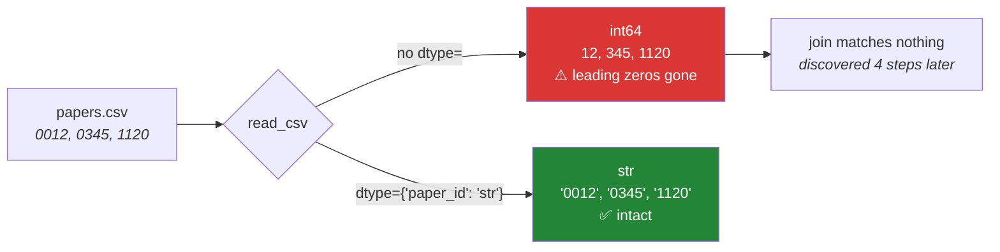

# Day 27 — Reading and writing: typed at read time

**Phase 4 · Module 4 · Data analysis with Pandas** · ID: **PD-02**

> **Yesterday:** pandas 3.0's Copy-on-Write and the `str` dtype, both reproduced as live failures.
> **Today:** getting data *in*. The rule is one sentence — **declare types at read time, not after** —
> and it saves you five `astype` calls, one memory blow-up, and one silently corrupted ID column.
> **Tomorrow:** `loc`, `iloc`, and alignment.

```bash
./m start 27 && ./m scaffold 27
```

**Time:** 100 minutes. **Request budget:** 0 model calls.

---

## §1 The story

Here is the bug, and it is not hypothetical — it is the single most common data-quality failure in
the field.

You have a CSV of paper records. One column is `paper_id`, and the values look like `0012`, `0345`,
`1120`. You call `pd.read_csv(path)` and pandas, being helpful, notices they are all digits and reads
them as integers. `0012` becomes `12`. Every leading zero is gone. Your join against the reference
table now matches nothing, and the error surfaces four transformations later as "why is this
dataframe empty".

Nothing warned you. Pandas did exactly what it was designed to do: **infer**.



Inference is a guess made from a *sample* of the file. It is wrong in three predictable ways:

1. **Identifiers become numbers.** IDs, postcodes, phone numbers, product codes — anything with
   leading zeros or too many digits for `int64`.
2. **Dates stay strings.** `"2017-06-12"` is text until you say otherwise, and every date operation
   on it silently does string comparison.
3. **One bad cell poisons a column.** A single `"N/A"` in a numeric column makes the whole thing
   `object`, costing memory and blocking arithmetic. (Day 20's "one string in a numeric list", one
   level up.)

The fix is boring and complete: **say what you want.** `dtype=`, `parse_dates=`, `na_values=`,
`usecols=`. Four keyword arguments that turn a guess into a contract.

The second half of today is **format choice**, and one number makes the case: on a 500 MB dataset,
Parquet typically reads 10–50× faster than CSV and stores it in a quarter of the space, because it is
columnar, compressed, and **carries its own dtypes**. CSV has no type information at all — that is
precisely why inference has to exist.

---

## §2 Setup — run this

```bash
uv add "pyarrow"
mkdir -p days/day-27/lab
touch days/day-27/lab/reading.py
```

- `pyarrow` came in on Day 26 for the string dtype; it also provides the Parquet engine. If it is
  already in `pyproject.toml`, this is a no-op.

`src/setu/frames.py` and `src/setu/io.py` both grow today.

---

## §3 PD-02 — reading with intent

`days/day-27/lab/reading.py`:

```python
"""PD-02: inference is a guess. Declare instead."""

from __future__ import annotations

import io
import time
from pathlib import Path

import pandas as pd

RAW = """paper_id,title,year,citations,published,venue
0012,Attention Is All You Need,2017,98000,2017-06-12,NeurIPS
0345,BERT,2018,72000,2018-10-11,NAACL
1120,GPT-3,2020,N/A,2020-05-28,
"""


def inference_guesses_wrong() -> None:
    naive = pd.read_csv(io.StringIO(RAW))
    print(f"\n{naive.dtypes.to_dict()=}")
    print(f"{naive['paper_id'].tolist()=}   <- leading zeros GONE")
    print(f"{naive['citations'].dtype=}   <- 'N/A' made the whole column text")
    print(f"{naive['published'].dtype=}   <- dates are strings")


def declare_instead() -> None:
    typed = pd.read_csv(
        io.StringIO(RAW),
        dtype={"paper_id": "str", "title": "str", "venue": "str", "year": "int16"},
        parse_dates=["published"],
        na_values=["N/A", "", "NULL", "-"],
    )
    print(f"\n{typed.dtypes.to_dict()=}")
    print(f"{typed['paper_id'].tolist()=}   <- intact")
    print(f"{typed['citations'].dtype=}   <- float64: numeric with a real NaN")
    print(f"{typed['published'].dtype=}   <- proper datetime")
    print(f"{typed['published'].dt.year.tolist()=}   <- .dt works now")
    print(f"{typed['venue'].isna().tolist()=}   <- the empty cell is missing, not ''")


def why_citations_is_float() -> None:
    typed = pd.read_csv(io.StringIO(RAW), na_values=["N/A"])
    print(f"\n{typed['citations'].dtype=}   <- float64, because NaN is a float")

    nullable = pd.read_csv(
        io.StringIO(RAW), na_values=["N/A"], dtype={"citations": "Int64"}
    )
    print(f"{nullable['citations'].dtype=}   <- capital-I Int64: a NULLABLE integer")
    print(f"{nullable['citations'].tolist()=}   <- <NA>, not NaN")
    print("  ^ 'Int64' (nullable) vs 'int64' (numpy). One capital letter, different types.")


def usecols_and_chunks() -> None:
    slim = pd.read_csv(io.StringIO(RAW), usecols=["paper_id", "year"], dtype={"paper_id": "str"})
    print(f"\n{list(slim.columns)=}   <- read only what you need")

    reader = pd.read_csv(io.StringIO(RAW), chunksize=2, dtype={"paper_id": "str"})
    for i, chunk in enumerate(reader):
        print(f"  chunk {i}: {len(chunk)} rows")
    print("  ^ chunksize returns an ITERATOR (Day 11). This is how a 20 GB CSV is read.")


def formats_compared(tmp: Path) -> None:
    rng_frame = pd.DataFrame(
        {
            "id": [f"{i:06d}" for i in range(200_000)],
            "value": range(200_000),
            "score": [i / 7 for i in range(200_000)],
            "label": ["alpha", "beta", "gamma", "delta"] * 50_000,
        }
    )

    csv_path, parquet_path = tmp / "d.csv", tmp / "d.parquet"

    start = time.perf_counter()
    rng_frame.to_csv(csv_path, index=False)
    csv_write = time.perf_counter() - start

    start = time.perf_counter()
    rng_frame.to_parquet(parquet_path, index=False)
    parquet_write = time.perf_counter() - start

    start = time.perf_counter()
    back_csv = pd.read_csv(csv_path, dtype={"id": "str"})
    csv_read = time.perf_counter() - start

    start = time.perf_counter()
    back_parquet = pd.read_parquet(parquet_path)
    parquet_read = time.perf_counter() - start

    print(f"\n  format   write     read      size")
    print(f"  csv      {csv_write:.3f}s   {csv_read:.3f}s   {csv_path.stat().st_size / 1024**2:>6.1f} MiB")
    print(f"  parquet  {parquet_write:.3f}s   {parquet_read:.3f}s   {parquet_path.stat().st_size / 1024**2:>6.1f} MiB")

    print(f"\n{back_csv['id'].iloc[0]=}       <- only because we passed dtype=")
    print(f"{back_parquet['id'].iloc[0]=}   <- parquet CARRIES its dtypes; no dtype= needed")
    print(f"{back_parquet.dtypes.equals(rng_frame.dtypes)=}   <- exact round-trip")


def index_is_not_data() -> None:
    frame = pd.DataFrame({"a": [1, 2]})
    buffer = io.StringIO()
    frame.to_csv(buffer)
    print(f"\n{buffer.getvalue()!r}   <- an unnamed index column snuck in")
    buffer = io.StringIO()
    frame.to_csv(buffer, index=False)
    print(f"{buffer.getvalue()!r}   <- index=False")
    print("  ^ round-trip a CSV three times without index=False and you get")
    print("    'Unnamed: 0', 'Unnamed: 0.1', 'Unnamed: 0.2'.")


if __name__ == "__main__":
    import tempfile

    inference_guesses_wrong()
    declare_instead()
    why_citations_is_float()
    usecols_and_chunks()
    formats_compared(Path(tempfile.mkdtemp()))
    index_is_not_data()
```

**Line by line:**

- `io.StringIO(RAW)` — treats a string as a file. It keeps the lesson self-contained and is genuinely
  useful in tests, so fixtures need no temp files.
- `dtype={"paper_id": "str"}` — **the fix.** A dict mapping column name to dtype. Columns you do not
  name are still inferred, so you only declare the ones that matter.
- `"int16"` for `year` — years fit comfortably. Day 20's dtype-size lesson, now saving memory on a
  real column.
- `parse_dates=["published"]` — converts at read time. Without it the column is text and
  `.dt.year` raises. Note that pandas 3.0 defaults datetimes to **microsecond** resolution (Day 26),
  which is why dates before 1678 no longer overflow.
- `na_values=["N/A", "", "NULL", "-"]` — **your** list of what counts as missing. Pandas has a default
  list, but real data invents its own sentinels, and `"-"` in a numeric column is otherwise a string
  that poisons the dtype.
- `citations` becoming `float64` — because NumPy's `int64` **cannot hold NaN**. Any integer column with
  a missing value becomes float. That is not a pandas quirk; it is a property of the underlying type.
- `dtype={"citations": "Int64"}` — **capital I.** pandas' *nullable* integer type, which has a real
  `<NA>` and stays integral. One capital letter distinguishes it from NumPy's `int64`, and mixing them
  up is a genuine source of confusion. Use nullable types when a column is conceptually integral and
  can be missing.
- `usecols=` — read only the columns you need. On a 200-column export where you want four, this is a
  50× memory saving before any processing happens.
- `chunksize=2` — returns an **iterator** of dataframes rather than one dataframe. Day 11's laziness,
  in pandas. This is how a file larger than RAM gets processed.
- The format comparison — run it and record your numbers. Parquet is typically several times faster to
  read and a fraction of the size, and critically `back_parquet.dtypes.equals(original.dtypes)` is
  `True`: **Parquet stores the schema.** CSV cannot, which is the root of everything in §1.
- `to_csv(buffer)` without `index=False` — writes the index as an unnamed first column. Read it back
  and you get `Unnamed: 0`. Do this three times and you have three of them. **Always pass
  `index=False`** unless the index is genuinely meaningful data.

---

## §4 Build brief

Extend `src/setu/io.py`:

```python
def read_table(path: Path, *, spec: dict[str, str] | None = None, **kwargs) -> pd.DataFrame:
    """TODO(me): read csv / json / jsonl / parquet by suffix, with types declared.

    - dispatch on path.suffix; raise UnsupportedFormat for anything else
    - `spec` maps column -> dtype and is passed as dtype= (parquet ignores it: it
      carries its own schema, so ASSERT the loaded dtypes match spec instead)
    - always encoding='utf-8', always index_col=None
    - raise FileNotFoundError with the path in the message
    """
    raise NotImplementedError


def write_table(frame: pd.DataFrame, path: Path) -> int:
    """TODO(me): write by suffix, return the row count.

    - index=False for csv
    - create parent directories
    - ATOMIC: reuse Day 16's atomic_write pattern (temp file, then rename)
    """
    raise NotImplementedError


def read_in_chunks(path: Path, *, size: int = 100_000, spec=None):
    """TODO(me): yield dataframes of at most `size` rows, lazily.

    csv uses chunksize=; parquet reads row groups. Must not load the whole file.
    """
    raise NotImplementedError
```

And in `src/setu/frames.py`:

```python
def check_schema(frame: pd.DataFrame, spec: dict[str, str]) -> None:
    """TODO(me): raise DataError if any column in `spec` is missing or has the wrong dtype.

    The message must name EVERY problem at once, not just the first
    (Day 19's Pydantic lesson, applied to dataframes).
    Compare dtypes as strings; 'str' must match pandas 3.0's str dtype.
    """
    raise NotImplementedError


def infer_spec(frame: pd.DataFrame) -> dict[str, str]:
    """TODO(me): produce a spec dict from a frame you have already validated by hand.

    This is how you CAPTURE a schema once and then enforce it forever.
    Day 227's ingestion writes one of these next to every dataset (Principle 9).
    """
    raise NotImplementedError
```

- `check_schema` reporting every problem at once is Day 19's lesson repeated deliberately. "Column
  `year` is float64, expected int16" three times in one message beats three separate runs.
- `infer_spec` + `check_schema` together are the workflow: look at the data **once**, capture what it
  should be, then enforce that on every future load. That is provenance (Principle 9) made executable.

---

## §5 The eval that must be able to fail

Add to `tests/test_io.py`:

```python
import pandas as pd

from setu.frames import check_schema, infer_spec
from setu.io import read_in_chunks, read_table, write_table


CSV = "paper_id,year,citations\n0012,2017,98000\n0345,2018,\n"


def test_read_preserves_leading_zeros(tmp_path):
    path = tmp_path / "p.csv"
    path.write_text(CSV, encoding="utf-8")
    frame = read_table(path, spec={"paper_id": "str", "year": "int16"})
    assert frame["paper_id"].tolist() == ["0012", "0345"], "leading zeros were inferred away"


def test_read_without_a_spec_still_works(tmp_path):
    path = tmp_path / "p.csv"
    path.write_text(CSV, encoding="utf-8")
    assert len(read_table(path)) == 2


def test_csv_round_trip_has_no_unnamed_column(tmp_path):
    frame = pd.DataFrame({"a": [1, 2]})
    path = tmp_path / "a.csv"
    write_table(frame, path)
    back = read_table(path)
    assert list(back.columns) == ["a"], f"index leaked into the file: {list(back.columns)}"


def test_parquet_round_trips_dtypes_exactly(tmp_path):
    frame = pd.DataFrame(
        {"id": ["001", "002"], "n": pd.array([1, None], dtype="Int64"), "x": [1.5, 2.5]}
    )
    path = tmp_path / "a.parquet"
    write_table(frame, path)
    back = read_table(path)
    assert back.dtypes.equals(frame.dtypes), "parquet should carry the schema"
    assert back["id"].tolist() == ["001", "002"]


def test_write_is_atomic(tmp_path):
    path = tmp_path / "a.csv"
    write_table(pd.DataFrame({"a": [1]}), path)

    class Exploding(pd.DataFrame):
        pass

    with pytest.raises(Exception):
        write_table(None, path)  # type: ignore[arg-type]
    assert read_table(path)["a"].tolist() == [1], "a failed write clobbered the good file"
    assert list(tmp_path.iterdir()) == [path], "a temp file was left behind"


def test_unsupported_suffix_is_rejected(tmp_path):
    path = tmp_path / "a.xyz"
    path.write_text("x", encoding="utf-8")
    with pytest.raises(Exception):
        read_table(path)


def test_chunked_reading_is_lazy(tmp_path):
    path = tmp_path / "big.csv"
    pd.DataFrame({"n": range(50_000)}).to_csv(path, index=False)
    stream = read_in_chunks(path, size=1000)
    first = next(iter(stream))
    assert len(first) == 1000


def test_chunks_cover_every_row(tmp_path):
    path = tmp_path / "big.csv"
    pd.DataFrame({"n": range(10_500)}).to_csv(path, index=False)
    total = sum(len(chunk) for chunk in read_in_chunks(path, size=1000))
    assert total == 10_500, "the ragged final chunk was dropped"


def test_check_schema_reports_every_problem_at_once():
    frame = pd.DataFrame({"a": [1.0], "b": ["x"]})
    with pytest.raises(Exception) as info:
        check_schema(frame, {"a": "int64", "b": "int64", "c": "str"})
    message = str(info.value)
    assert "a" in message and "b" in message and "c" in message, (
        "only the first problem was reported"
    )


def test_check_schema_passes_a_correct_frame(tmp_path):
    path = tmp_path / "p.csv"
    path.write_text(CSV, encoding="utf-8")
    spec = {"paper_id": "str", "year": "int16"}
    check_schema(read_table(path, spec=spec), spec)  # must not raise


def test_infer_then_check_is_a_fixed_point():
    frame = pd.DataFrame({"a": [1, 2], "b": ["x", "y"]})
    check_schema(frame, infer_spec(frame))  # must not raise
```

**Line by line:**

- `test_read_preserves_leading_zeros` — **the day's real assessment.** It is the §1 bug, as a test. An
  implementation that forgets to pass `spec` through as `dtype=` fails here with a message naming the
  cause.
- `test_csv_round_trip_has_no_unnamed_column` — catches the missing `index=False`, and prints the
  actual columns so the failure explains itself.
- `test_parquet_round_trips_dtypes_exactly` — `Int64` (nullable) survives the round trip. CSV cannot
  do this at all; that contrast is the argument for Parquet in one assertion.
- `test_write_is_atomic` — the same three-part check as Day 16: the failure raised, the good file
  survived, no temp file orphaned. Reusing `atomic_write` is the intended solution.
- `test_chunks_cover_every_row` — 10 500 rows in chunks of 1000. The ragged final chunk again
  (Days 8, 11, 22 — fourth time, still catching people).
- `test_check_schema_reports_every_problem_at_once` — three distinct faults: wrong dtype, wrong dtype,
  missing column. A loop that raises on the first fails this, and the message says why.
- `test_infer_then_check_is_a_fixed_point` — a property test: whatever `infer_spec` produces must
  satisfy `check_schema`. If the two disagree about how to spell a dtype, this catches it immediately
  rather than on Day 227.

```bash
uv run python -m pytest tests/test_io.py -v
```

---

## §6 Request budget

| Resource | Spent today |
|---|---|
| LLM calls | **0** |

---

## §7 Traps

- **`read_csv` with no `dtype=`.** IDs lose leading zeros. Silently.
- **Forgetting `parse_dates=`.** Dates stay text and every comparison is a string comparison.
- **Not setting `na_values=`.** `"N/A"`, `"-"`, `"NULL"` become strings and poison the column.
- **Expecting an integer column with missing values to stay integer.** `int64` cannot hold NaN. Use
  nullable `Int64` if you need both.
- **Confusing `Int64` and `int64`.** One capital letter, two different types.
- **`to_csv` without `index=False`.** `Unnamed: 0`, then `Unnamed: 0.1`, forever.
- **Reading a 200-column export in full** when you need four. `usecols=`.
- **CSV for anything you will read more than once.** Parquet is faster, smaller, and typed.
- **Writing in place.** A crash mid-write destroys the previous good file (Day 16).
- **A dataset with no `SOURCE.md` row.** Principle 9. Where did it come from, and may you use it?

---

## §8 Verify before you code

Written **2026-08-21**:

- <https://pandas.pydata.org/docs/reference/api/pandas.read_csv.html> — `dtype`, `parse_dates`,
  `na_values`, `usecols`, `chunksize`.
- <https://pandas.pydata.org/docs/user_guide/integer_na.html> — nullable `Int64` versus `int64`.
- <https://pandas.pydata.org/docs/user_guide/io.html#parquet> — engine options and schema round-tripping.
- <https://pandas.pydata.org/docs/whatsnew/> — confirm nothing in the 3.x line changed these defaults.

---

## §9 Say it in an interview

> "I never let `read_csv` infer types on anything that matters. Inference reads a sample and guesses,
> and it guesses wrong in predictable ways — an ID column of `0012` becomes the integer 12, and you
> find out four joins later when a result set is empty. So the loader takes a schema dict and passes
> it as `dtype=`, plus explicit `parse_dates` and `na_values`, and there's a `check_schema` that reports
> every mismatch at once rather than the first. For anything read more than once I use Parquet,
> because it carries its own dtypes — the round-trip is exact, including nullable integers, which CSV
> simply cannot represent."

---

## §10 Done when

Tick [`CHECKLIST.md`](CHECKLIST.md), then `./m check && ./m done 27`.
