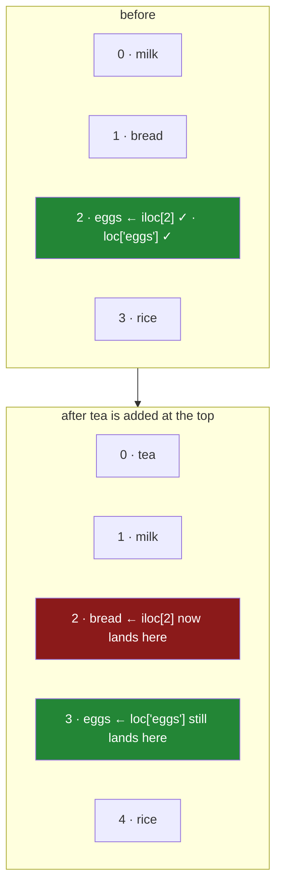

# 1.1 — Two ways to say "that row"

## One-line answer

There are exactly two ways to point at a row — by its **label**, which is the name it carries, or by
its **position**, which is where it currently sits — and pandas gives them two different names,
`loc` and `iloc`, because the same row has both and they are not interchangeable.

---

## The story

The shopping list is stuck to the fridge with a magnet. Four lines: milk, bread, eggs, rice.

Somebody in the flat is at the shop and rings up to ask about one of them. There are two ways they
can say which.

They can say **"how many eggs?"** That works wherever the eggs are on the list. It works if somebody
reordered it. It works if a line was added above. The word "eggs" identifies the line no matter what
has happened to the rest.

Or they can say **"what's the third one?"** That also works, and it is quicker to say, and if nobody
has touched the list it means exactly the same thing.

Then somebody adds `tea` to the top of the list, because they are standing next to the fridge and it
is the first free space.

Now "how many eggs" still gets you eggs. "What's the third one" gets you bread.

Neither person did anything wrong. They were pointing at the same line in two different ways, and one
of those ways survives the list changing and the other does not.

---

## The idea in plain language

Every row in a pandas frame has two handles on it.

The **label** is the name the row carries. It lives in the frame's **index** — the column of names
down the left-hand side, which is not one of the frame's columns and is not a row number
([Day 26, 1.2](../../../day-26-frames-and-copy-on-write/parts/01-the-two-objects/1.2-the-index-is-not-a-row-number.md)).
A label belongs to its row and travels with it. Sort the frame, filter it, add rows above it — the
label is unchanged, because it *is* the row's name.

The **position** is how far down the row currently sits. First is `0`, second is `1`, and so on
([Day 21, 1.1](../../../day-21-indexing-and-views/parts/01-one-element/1.1-index-and-the-negative-index.md)).
A position is not a property of the row at all. It is a fact about the frame's current arrangement,
and it changes the moment anything moves.

pandas gives you both, under two names:

- **`.loc`** takes labels. "The row called `eggs`."
- **`.iloc`** takes positions. "The row at place 2." The `i` stands for *integer*.

The reason there are two rather than one is that a label can itself be a number. If your index is
customer numbers, then `frame[7]` is genuinely ambiguous: it might mean the customer whose number is
7, or the eighth row. There is no rule pandas could pick that would not be wrong half the time, so it
does not pick. **You say which you meant, and the name of the accessor is where you say it.**

That gives the habit to build now, before any code. **Use `loc` unless you specifically want
position.** Nearly all real work is about *which thing*, not *where it currently is* — and code
written against positions quietly changes meaning when the data changes, whereas code written against
labels either keeps working or fails loudly.

---

## Why Setu needs it

- **[1.2](1.2-loc-by-label.md)** and **[1.3](1.3-iloc-by-position.md)** are these two ideas one at a
  time, with everything each accessor accepts.
- **[1.5](1.5-the-slice-that-includes-its-end.md)** is where the difference bites hardest: the two
  accessors disagree about whether a range includes its last item.
- **Section 4** is the same distinction again at a larger scale — when two frames meet, pandas lines
  them up by **label**, and everything surprising there follows from that
  ([4.2](../04-alignment/4.2-alignment-is-automatic.md)).
- **[Day 27, 3.4](../../../day-27-reading-and-writing/parts/03-parquet/3.4-column-pruning.md)** found
  that `usecols=` and `columns=` disagree about column order, so a frame's positions depend on which
  format it was read from. This part is why that mattered.
- **Day 91 onwards**, every model gets a frame's columns in a fixed order. Knowing which of your code
  depends on order and which on names is what makes that safe.

---

## The mechanism

The list, with its labels in the index:

```python
import pandas as pd

shop = pd.DataFrame(
    {
        "item": pd.Series(["milk", "bread", "eggs", "rice"], dtype="str"),
        "need": [2, 1, 6, 1],
        "price": [1.15, 1.40, 0.32, 2.05],
        "aisle": pd.Series(["07", "03", "07", "11"], dtype="str"),
    }
).set_index("item")
print(shop)
```

**Line by line:**

- The four rows are the ones the whole of Day 26 and Day 27 used, so nothing here is a new example.
- `dtype="str"` stated on the two text columns, so the frame matches what pandas 3.0 infers and the
  aisle keeps its leading zero
  ([Day 27, 1.4](../../../day-27-reading-and-writing/parts/01-the-csv/1.4-dtype-at-read-time.md)).
- `.set_index("item")` — **this is the line that makes the day possible.** It moves the `item` column
  out of the frame's columns and into its index, so the rows stop being numbered `0, 1, 2, 3` and
  start being named `milk, bread, eggs, rice`. The frame now has three columns, not four.
- Without this line the index would be the default `RangeIndex`, where every label happens to equal
  its own position — and then `loc` and `iloc` agree on everything, which hides the entire subject.
  **A frame with a meaningful index is where this day's ideas become visible.**

```text
       need  price aisle
item
milk      2   1.15    07
bread     1   1.40    03
eggs      6   0.32    07
rice      1   2.05    11
```

Notice `item` sitting on its own line above the row names. That is pandas showing the index's *name*,
and it is how you tell an index from a column when you print a frame.

Now the same row, asked for both ways:

```python
print("by label   :", shop.loc["eggs"]["need"])
print("by position:", shop.iloc[2]["need"])
print("same row?  :", shop.loc["eggs"].equals(shop.iloc[2]))
```

**Line by line:**

- `shop.loc["eggs"]` — a **label** goes in `loc`'s brackets. The string `"eggs"` is the row's name.
- `shop.iloc[2]` — an **integer** goes in `iloc`'s brackets, counting from zero, so `2` is the third
  row.
- `.equals(...)` rather than `==` — comparing two Series with `==` gives a Series of booleans rather
  than one answer, which is the same trap
  [Day 27, 5.3](../../../day-27-reading-and-writing/parts/05-the-module/5.3-the-round-trip-test.md)
  met when comparing frames.
- Both expressions name the same row **right now**, and that is the whole point of the next block.

```text
by label   : 6
by position: 6
same row?  : True
```

**Both say 6, and that is the point of this block, not a coincidence.** Right now the eggs *are* the
third row, so the two ways of asking agree, and every line of code written either way works. This is
the state most code is written in, and it is why the difference goes unnoticed for so long.

Now add `tea` at the top, exactly as somebody standing at the fridge would:

```python
tea = pd.DataFrame(
    {"need": [1], "price": [2.50], "aisle": ["05"]},
    index=pd.Index(["tea"], name="item"),
)
with_tea = pd.concat([tea, shop])
print(with_tea)
print()
print("by label   :", with_tea.loc["eggs"]["need"])
print("by position:", with_tea.iloc[2]["need"])
```

**Line by line:**

- The new row is built as its own one-row frame first, rather than inline, so that its index can be
  given properly. A row without a label has nothing for `loc` to find.
- `index=pd.Index(["tea"], name="item")` — the label **and** the index's name. Concatenating a named
  index with an unnamed one loses the name, and then the printed frame no longer says `item` above
  the row names.
- `"aisle": ["05"]` — a plain list, not a `pd.Series`. **A Series brings its own index**, and a Series
  built from a bare list is labelled `0`, which does not match `tea`; pandas would line the two up by
  label, find nothing in common, and put `NaN` in the aisle. That is section 4's subject arriving
  early ([4.2](../04-alignment/4.2-alignment-is-automatic.md)), and it is the single easiest way to
  put a hole in a frame you just built.
- `pd.concat([tea, shop])` — stacks the frames, new one first, which is what "added it to the top"
  means.
- Nothing about the eggs row changed. Same label, same values, new position.

```text
       need  price aisle
item
tea       1   2.50    05
milk      2   1.15    07
bread     1   1.40    03
eggs      6   0.32    07
rice      1   2.05    11

by label   : 6
by position: 1
```

**`loc` still says 6. `iloc` now says 1.** Neither is broken. `loc["eggs"]` asked for the eggs and got
them; `iloc[2]` asked for the third row and got bread, which is now genuinely the third row. The two
lines of code did not change, and one of them changed its meaning.

The two handles on one row:



The label followed the row. The position stayed where it was and got a different row.

---

## When it breaks

**A label that is not there:**

```text
$ uv run python -c "
import pandas as pd
shop = pd.DataFrame({'need': [2, 1]}, index=pd.Index(['milk', 'bread'], name='item'))
shop.loc['tea']
" 2>&1 | tail -1
```

```text
KeyError: 'tea'
```

**What it means.** There is no row called `tea`, and `loc` says so. **This is the good failure**, and
it is most of the argument for using labels: asking for something that is not there is an error, not
a wrong row. Note that it is a `KeyError` — the same exception a dictionary raises for a missing key
([Day 8, 2.4](../../../day-08-containers/parts/02-sets-and-dicts/2.4-get-setdefault-and-counter.md)) —
because looking a label up in an index is a dictionary lookup.

**A position past the end:**

```text
$ uv run python -c "
import pandas as pd
shop = pd.DataFrame({'need': [2, 1]}, index=pd.Index(['milk', 'bread'], name='item'))
shop.iloc[9]
" 2>&1 | tail -1
```

```text
IndexError: single positional indexer is out-of-bounds
```

**What it means.** A different exception — `IndexError`, which is what a list raises — because
positions are offsets rather than keys. The two accessors raise two different exception types for
"not found", and that is worth knowing when you write an `except` clause: catching `KeyError` around
an `iloc` call catches nothing.

**Giving `loc` a position:**

```text
$ uv run python -c "
import pandas as pd
shop = pd.DataFrame({'need': [2, 1]}, index=pd.Index(['milk', 'bread'], name='item'))
shop.loc[2]
" 2>&1 | tail -1
```

```text
KeyError: 2
```

**What it means.** `loc` did not fall back to treating `2` as a position. It looked for a row
**labelled** `2`, did not find one, and raised. That is the right behaviour and it is why the two
accessors exist — but it also explains the confusing case: on a frame with the default `RangeIndex`,
where the labels really are `0, 1, 2, 3`, `shop.loc[2]` **works** and returns the third row. Code
written that way then breaks the first time somebody calls `set_index`, with a `KeyError` that names
a number nobody typed.

---

## In production

**What a professional writes instead of the teaching version.** Position-based access almost never
appears in application code. Where it does, it is wrapped and named, so that the assumption is
written down:

```python
import pandas as pd


def first_row(frame: pd.DataFrame) -> pd.Series:
    """The frame's first row in its current order. Raises if the frame is empty."""
    if frame.empty:
        raise ValueError("cannot take the first row of an empty frame")
    return frame.iloc[0]
```

**Line by line:**

- The docstring says **"in its current order"**, which is the whole reason this function exists. A
  reader of `frame.iloc[0]` at a call site cannot tell whether the author meant "the first one" or
  "the one I happen to know is first"; a reader of `first_row(frame)` can.
- `if frame.empty: raise ValueError` — `iloc[0]` on an empty frame raises
  `IndexError: single positional indexer is out-of-bounds`, which does not mention frames or
  emptiness. One check turns it into a sentence.
- It returns a Series, because one row across several columns is a Series. The dtype of that Series
  is worth knowing about, and [1.2](1.2-loc-by-label.md) has it.
- **There is no `first_row_by_label`**, because that idea does not exist: labels have no order to be
  first in, only the frame does.

**What changes at scale.** Two things.

The first is a performance fact that surprises people. **`loc` is not slower than `iloc`** in the way
you might expect, because a pandas index is hash-based, so a label lookup is roughly constant time
just as a position is
([Day 8, 2.1](../../../day-08-containers/parts/02-sets-and-dicts/2.1-a-set-is-a-hash-table.md)). What
*is* slow is doing either of them in a Python loop, one row at a time, and Day 29 is entirely about
why. The choice between `loc` and `iloc` is a correctness decision, not a speed one.

The second is that an index only helps if it is **unique**, and pandas does not require that. A
duplicated label turns `loc` from "give me that row" into "give me every row with that name", and the
*shape* of what comes back changes with the data. That is enough of a trap to have its own part
([5.3](../05-reindexing/5.3-duplicate-labels.md)).

**The failure that only appears with real data.** A reporting script took the top result with
`frame.iloc[0]` after a sort, and was correct for a year. Then an upstream change added a row that
tied for first place, the sort's tie-break went the other way, and the report named a different
winner every night with no error and no code change. **`iloc[0]` after a sort is an assumption about
ties**, not a selection. Writing it as `frame.nlargest(1, "score")` — Day 29's subject — says the
same thing without pretending the position is meaningful.

**The review comment a senior engineer leaves.** *"`df.iloc[3]` — what is row 3? If this is the row
for a particular customer, set the index and use `loc`. If it genuinely is 'the fourth row of
whatever came back', say so in a comment, because the next person will assume it was a typo."*

**The interview question.** *"What is the difference between `loc` and `iloc`?"* The short answer is
label against position. The answer that shows you have been bitten adds three things: they raise
**different exceptions** when the thing is missing, `KeyError` against `IndexError`; they disagree
about **slices**, where `loc` includes the endpoint and `iloc` does not; and on a default
`RangeIndex` they look identical, which is exactly why code written with `loc` and integers breaks
the day somebody sets a real index. The follow-up is usually "which do you reach for", and the answer
is `loc`, because almost all real questions are about which row rather than where it sits.

---

## Check yourself

```bash
uv run python -c "
import pandas as pd
shop = pd.DataFrame(
    {'need': [2, 1, 6, 1], 'price': [1.15, 1.40, 0.32, 2.05]},
    index=pd.Index(['milk', 'bread', 'eggs', 'rice'], name='item'),
)
print('loc  :', shop.loc['eggs']['need'])
print('iloc :', shop.iloc[2]['need'])
flipped = shop.sort_index()
print()
print(flipped)
print('loc  :', flipped.loc['eggs']['need'])
print('iloc :', flipped.iloc[2]['need'])
"
```

`sort_index()` puts the rows in alphabetical order. One of the two answers changes and one does not.
Say which, before you run it. (Both print as floats rather than whole numbers — that is
[1.2](1.2-loc-by-label.md)'s subject, and worth noticing now.)

**Answer out loud, without scrolling up:**

> A row has a label and a position. Say which of the two belongs to the row and which belongs to the
> frame. Then say what `shop.loc[2]` does on a frame whose index is `['milk', 'bread']`, and what it
> does on a frame that has never had `set_index` called on it.

---

**Next:** [1.2 — `loc`, by label](1.2-loc-by-label.md).
