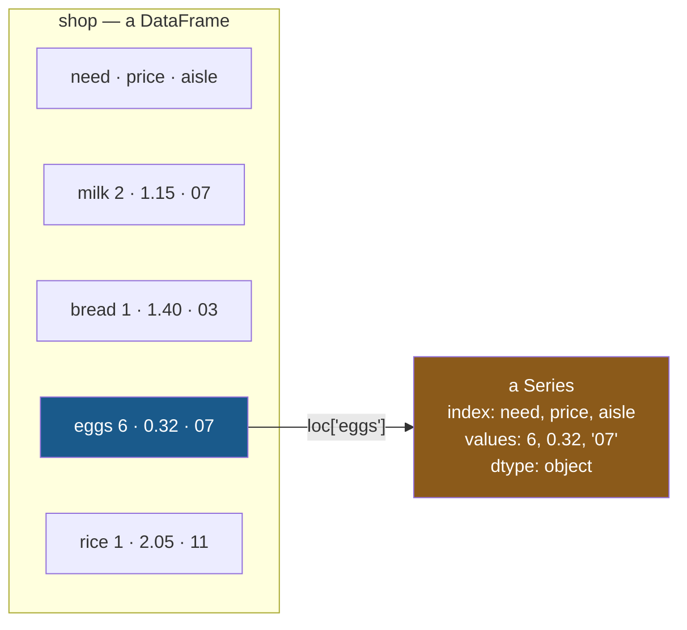

# 1.2 — `loc`, by label — and the row that came back as `object`

## One-line answer

`loc` takes labels and accepts four things — one label, a list of labels, a slice of labels, or a
boolean mask — and what you get back has a different **shape** for each of them, which is where most
of the confusion about `loc` actually lives.

---

## The story

Somebody at the shop rings up and asks about the eggs.

The answer comes back as three things at once: six of them, thirty-two pence, aisle seven. That is
one line of the list read out, and it is a perfectly ordinary thing to ask for.

Then they ask for the eggs and the rice, and the answer is two lines. Then they ask just for the
price of the eggs, and the answer is one number.

Three questions, three different **shapes** of answer: a line, some lines, a number. Nobody at either
end of the phone notices this, because in conversation it is obvious.

In code it stops being obvious, because a piece of code that expects a number and gets a line does
not complain — it carries on and does something strange several steps later.

---

## The idea in plain language

`loc` is the label accessor. What goes inside its square brackets is a **label**, or a description of
several labels, and there are four things it accepts.

**One label.** `shop.loc["eggs"]` — that row. Because a row runs across all the columns, what comes
back is a **Series**, one entry per column.

**A list of labels.** `shop.loc[["milk", "eggs"]]` — those rows, in the order you named them. What
comes back is a **DataFrame**, because several rows is a table. Note the double brackets: the outer
pair belongs to `loc`, the inner pair is the list.

**A slice of labels.** `shop.loc["bread":"rice"]` — everything from one label to another, in the
frame's current order. Also a DataFrame. This one has a surprise in it, and it gets its own part
([1.5](1.5-the-slice-that-includes-its-end.md)).

**A boolean mask.** `shop.loc[shop["price"] > 1]` — the rows where something is true. That is
section 2's whole subject ([2.2](../02-masks/2.2-selecting-with-a-mask.md)).

The rule underneath all four is worth saying plainly, because it removes the need to memorise
anything: **one label gives you one dimension less; a collection of labels keeps the dimension.** Ask
for one row of a table and you get a Series. Ask for a list of rows — even a list of one — and you
get a table.

That last point is the one that catches people. `shop.loc["eggs"]` and `shop.loc[["eggs"]]` are not
the same thing. One is a Series, one is a one-row DataFrame, and the difference is a pair of
brackets.

There is one more thing to know about what comes back, and it surprises people who read Day 26
carefully. A **row** crosses every column, and the columns have different types
([Day 26, 1.4](../../../day-26-frames-and-copy-on-write/parts/01-the-two-objects/1.4-one-dtype-per-column.md)).
A Series holds one type. So a row taken out of a mixed frame has to hold a whole number, a decimal
and a piece of text in one Series — and the only dtype that can do that is `object`, the dtype Day 26
said had gone away
([Day 26, 2.4](../../../day-26-frames-and-copy-on-write/parts/02-the-str-dtype/2.4-dtypes-equals-object-finds-nothing.md)).
It has not gone away. It is what you get whenever you slice a frame the short way.

---

## Why Setu needs it

- **[1.3](1.3-iloc-by-position.md)** is the same four shapes with positions, and the shapes behave
  identically, which is the one thing the two accessors do agree about.
- **[1.4](1.4-rows-and-columns-at-once.md)** adds the second argument, which is how you avoid the
  `object` Series entirely by never taking a whole row.
- **[2.2](../02-masks/2.2-selecting-with-a-mask.md)** is the fourth thing `loc` accepts, and it is the
  one you will use most.
- **[3.1](../03-writing/3.1-assigning-through-loc.md)** puts `loc` on the left of an `=`, which is
  the only safe way to write into a frame
  ([Day 26, 4.3](../../../day-26-frames-and-copy-on-write/parts/04-chained-assignment/4.3-loc-the-single-step.md)).
- **Day 30** builds a pipeline whose first step selects columns. A step that returns a Series where
  the next step expects a frame fails with a message about dimensions, and this part is where you
  learn to read it.

---

## The mechanism

The frame, and the four things `loc` accepts. Starting with one label:

```python
import pandas as pd

shop = pd.DataFrame(
    {
        "item": pd.Series(["milk", "bread", "eggs", "rice"], dtype="str"),
        "need": [2, 1, 6, 1],
        "price": [1.15, 1.40, 0.32, 2.05],
        "aisle": pd.Series(["07", "03", "07", "11"], dtype="str"),
    }
).set_index("item")

row = shop.loc["eggs"]
print(row)
print()
print("type :", type(row).__name__)
print("dtype:", row.dtype)
```

**Line by line:**

- `shop.loc["eggs"]` — one label, so one row, so **one dimension less than the frame**. A frame is
  two-dimensional; a row is one-dimensional, which is a Series.
- `type(row).__name__` printed rather than assumed, because the shape of the result is the thing this
  part is about and guessing it is how people get it wrong.
- `row.dtype` — singular. A frame has `dtypes`, plural, one per column
  ([Day 26, 1.5](../../../day-26-frames-and-copy-on-write/parts/01-the-two-objects/1.5-reading-a-frame-before-you-touch-it.md)).
  A Series has exactly one, and the next block is about what that one turns out to be.

```text
need        6
price    0.32
aisle      07
Name: eggs, dtype: object
```

**Read the last line.** `dtype: object` — on pandas 3.0, where Day 26 spent a whole section explaining
that text columns are `str` now and `object` has stopped appearing.

Nothing is broken. The three values in this Series are a whole number, a decimal and a piece of text,
and there is no single dtype that holds all three, so pandas falls back to `object` — the dtype that
means "these are arbitrary Python objects, stored as pointers". **Taking a whole row out of a mixed
frame always does this**, and it has a real cost: the `6` in that Series is now a Python `int` rather
than an entry in an `int64` column, so arithmetic on it is Python-speed rather than NumPy-speed.

The names go sideways and the values keep their columns:



**The column names became the Series' index.** That is what "one dimension less" looks like: the
frame's columns had to go somewhere, and they became the labels of the result.

Now a list of labels, and the pair of brackets that changes everything:

```python
print(shop.loc[["milk", "eggs"]])
print()
one_label = shop.loc["eggs"]
one_item_list = shop.loc[["eggs"]]
print("loc['eggs']  ->", type(one_label).__name__, one_label.shape)
print("loc[['eggs']] ->", type(one_item_list).__name__, one_item_list.shape)
```

**Line by line:**

- `shop.loc[["milk", "eggs"]]` — the **outer** brackets are `loc`'s and the **inner** brackets are a
  Python list. The list is one argument, so `loc` sees a collection of labels rather than one label.
- The result keeps the order **you asked for**, not the frame's order. `["eggs", "milk"]` would give
  the eggs first. That is a genuine reordering tool and it is worth knowing.
- `shop.loc["eggs"]` against `shop.loc[["eggs"]]` — **the same row, two different types.** The first
  is a Series of three values; the second is a DataFrame with one row and three columns.
- `.shape` printed for both, because `(3,)` against `(1, 3)` is the clearest possible statement of
  what the extra brackets did.

```text
      need  price aisle
item
milk     2   1.15    07
eggs     6   0.32    07

loc['eggs']  -> Series (3,)
loc[['eggs']] -> DataFrame (1, 3)
```

**`(3,)` against `(1, 3)`.** One is a row read out; the other is a table that happens to have one row
in it. When a function is documented as taking a DataFrame and you hand it `loc["eggs"]`, this is the
difference that causes the error — and `loc[["eggs"]]` is usually the fix.

And a column, which `loc` also does:

```python
prices = shop.loc[:, "price"]
print(prices)
print()
print("type :", type(prices).__name__, "dtype:", prices.dtype)
```

**Line by line:**

- `shop.loc[:, "price"]` — two arguments separated by a comma: rows first, columns second. The bare
  `:` means "every row", exactly as it does in a NumPy slice
  ([Day 21, 1.3](../../../day-21-indexing-and-views/parts/01-one-element/1.3-slicing-one-axis.md)).
  [1.4](1.4-rows-and-columns-at-once.md) is that comma's own part.
- One column label, so again **one dimension less** — a Series.
- This one's dtype is `float64`, not `object`, because a column really does hold one type. **Slicing
  a frame the tall way keeps the dtype; slicing it the wide way loses it.** That sentence is the
  whole of this part in one line.

```text
item
milk     1.15
bread    1.40
eggs     0.32
rice     2.05
Name: price, dtype: float64

type : Series dtype: float64
```

---

## When it breaks

**A label that is not in the list:**

```text
$ uv run python -c "
import pandas as pd
shop = pd.DataFrame({'need': [2, 1]}, index=pd.Index(['milk', 'bread'], name='item'))
shop.loc['tea']
" 2>&1 | tail -1
```

```text
KeyError: 'tea'
```

**What it means.** Straightforward, and the good case. Compare it with the list form below, which is
not.

**A list where one label is missing:**

```text
$ uv run python -c "
import pandas as pd
shop = pd.DataFrame({'need': [2, 1]}, index=pd.Index(['milk', 'bread'], name='item'))
shop.loc[['milk', 'tea']]
" 2>&1 | tail -1
```

```text
KeyError: "['tea'] not in index"
```

**What it means.** The same failure, with a different message — and this one is worth reading
carefully because **it lists exactly which labels were missing.** With a list of forty labels that
message is the whole diagnosis. It is also a behaviour that changed: older pandas returned the rows
it could find and filled the rest with `NaN`, which meant a typo produced a row of nothing instead of
an error. If you find advice online about `loc` silently inserting missing rows, it is describing a
version that no longer exists — and [5.1](../05-reindexing/5.1-reindex-say-the-index-you-want.md) is
the function that still does it, on purpose.

**The one that does not fail — a Series where a frame was wanted:**

```text
$ uv run python -c "
import pandas as pd
shop = pd.DataFrame(
    {'need': [2, 1, 6], 'price': [1.15, 1.40, 0.32]},
    index=pd.Index(['milk', 'bread', 'eggs'], name='item'),
)
row = shop.loc['eggs']
print('sum of the row:', row.sum())
print('sum of a frame:', shop.loc[['eggs']].sum().to_dict())
"
```

```text
sum of the row: 6.32
sum of a frame: {'need': 6.0, 'price': 0.32}
```

**What it means.** `row.sum()` added the count to the price and got `6.32`, which is not a quantity
that exists. No error, no warning — the Series had a number of eggs and a price in it, and `sum`
added them because that is what `sum` does to a Series of numbers. The frame version summed **each
column**, which is what anybody actually meant.

This is the day's recurring shape, the same one Day 27 kept meeting: **the failure is a plausible
wrong number, not an exception.** A row is not a small table; it is a different thing with the same
values in it, and `sum`, `mean`, `max` and `describe` all mean something different on each.

---

## In production

**What a professional writes instead of the teaching version.** The shape of the return value is
stated in the signature, and a helper that must return a frame uses the double-bracket form so it
cannot accidentally return a Series:

```python
import pandas as pd


def lines_for(frame: pd.DataFrame, items: list[str]) -> pd.DataFrame:
    """The rows for `items`, in the order asked for. Raises if any is unknown."""
    missing = [name for name in items if name not in frame.index]
    if missing:
        raise KeyError(f"not on the list: {', '.join(missing)}; have {list(frame.index)}")
    return frame.loc[items]
```

**Line by line:**

- `items: list[str]` and `-> pd.DataFrame` — **the signature is where the shape is promised.** A
  caller never has to work out whether one item gives a Series, because the parameter is always a
  list.
- `frame.loc[items]` with `items` already a list — no inner brackets needed, because the variable
  *is* the collection. This is the form that never accidentally drops a dimension.
- The `missing` check runs first, so the message names every unknown item at once and lists what is
  available. `KeyError: "['tea'] not in index"` says which label; this says which label **and** what
  the legal ones are.
- `name not in frame.index` — an index membership test, which is a hash lookup rather than a scan
  ([Day 8, 2.1](../../../day-08-containers/parts/02-sets-and-dicts/2.1-a-set-is-a-hash-table.md)), so
  this check is cheap even on a large frame.

**What changes at scale.** Two things, and the first is about that `object` Series.

Taking whole rows out of a frame is the single most common way to make pandas slow. Each
`frame.loc[label]` on a mixed frame builds a new `object` Series, boxing every value into a Python
object, and doing that in a loop over a million rows is the anti-pattern Day 29 measures in full. The
production instinct is that **you almost never want a row**: you want a column, or a filtered frame,
and both keep their dtypes.

The second is that `loc` on a **sorted** index can do better than a hash lookup — pandas can binary
search a monotonic index, which is what makes label-based slicing on a time index fast. That only
holds while the index is sorted, and `index.is_monotonic_increasing` is how you check rather than
hope. On an unsorted index a label *slice* has to scan.

**The failure that only appears with real data.** A function returned `frame.loc[key]` and its caller
did `result["price"]`. It worked for two years, because every key matched exactly one row. Then a
duplicate appeared upstream, `loc` returned a two-row **DataFrame** instead of a Series, and
`result["price"]` — which had been "the price" — silently became a two-element Series. Every
downstream number turned into a Series, and the report filled with values like
`item\nmilk 1.15\nmilk 1.20`. **The shape of `loc`'s result depends on the data, not only on the
code**, whenever the index might not be unique
([5.3](../05-reindexing/5.3-duplicate-labels.md)).

**The review comment a senior engineer leaves.** *"`df.loc[item]` here returns a Series if the index
is unique and a DataFrame if it is not, and we do not enforce uniqueness on load. Either assert
`index.is_unique` in the loader or use `df.loc[[item]]` and handle a frame consistently."*

**The interview question.** *"What does `df.loc['x']` return?"* The answer that shows you have used
it: it depends on the index. With a unique index, a Series — one entry per column, and its dtype will
be `object` if the columns are not all the same type, which quietly costs you NumPy's speed. With a
duplicated index, a DataFrame. And `df.loc[['x']]` is always a DataFrame, which is why library code
tends to use the double-bracket form: **it makes the return type a property of the code rather than
of the data.**

---

## Check yourself

```bash
uv run python -c "
import pandas as pd
shop = pd.DataFrame(
    {'need': [2, 1, 6, 1], 'price': [1.15, 1.40, 0.32, 2.05]},
    index=pd.Index(['milk', 'bread', 'eggs', 'rice'], name='item'),
)
for label, got in [
    (\"loc['eggs']\",        shop.loc['eggs']),
    (\"loc[['eggs']]\",      shop.loc[['eggs']]),
    (\"loc[['eggs','rice']]\", shop.loc[['eggs', 'rice']]),
    (\"loc[:, 'price']\",    shop.loc[:, 'price']),
]:
    print(f'{label:24} {type(got).__name__:10} {got.shape}')
"
```

Four calls, two of them returning Series and two returning DataFrames. Say the rule that predicts
which, in one sentence, without using the word "brackets".

**Answer out loud, without scrolling up:**

> `shop.loc["eggs"]` on this frame comes back with `dtype: object`, on a pandas version where text
> columns are `str`. Explain why that is correct rather than a bug. Then say what `.sum()` does to
> that result, and why the answer is meaningless.

---

**Next:** [1.3 — `iloc`, by position](1.3-iloc-by-position.md).
