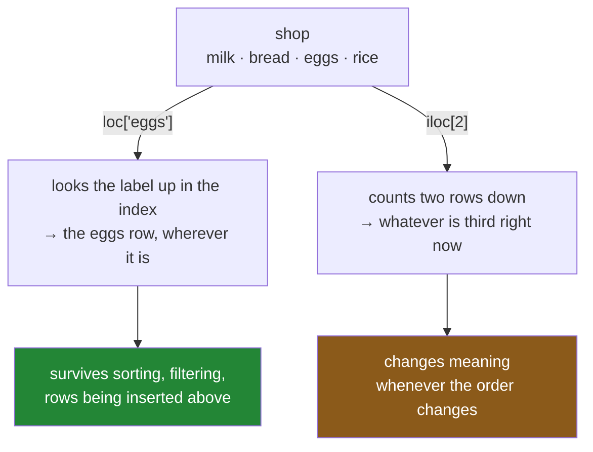

# 1.3 — `iloc`, by position — and the two places it is the right answer

## One-line answer

`iloc` counts rows from zero, ignores every label completely, and behaves exactly like a NumPy index
— which makes it the wrong tool for almost everything and the right tool for exactly two jobs:
looking at the top of a frame, and sampling it.

---

## The story

Somebody prints the shopping list out to take to the shop, and the printer jams after the first page.

They ring the flat and say: "I've only got the first three lines. What are they?"

That is a question about **positions**, and it is a perfectly good one. It is not a question about
milk, or bread, or eggs. It is a question about the first three of whatever happens to be there, and
the honest answer is "the first three, in whatever order the list is currently in".

Later the same person asks a different question: "is the milk on there?" That one is not about
positions at all, and answering it by counting down from the top would be a strange way to go about
it.

Both questions are reasonable. They are just different questions, and only one of them is about
where things sit.

---

## The idea in plain language

`iloc` selects by **position** — how far down a row sits, counting from zero
([1.1](1.1-two-ways-to-say-that-row.md)). It does not look at the index at all. A frame whose labels
are `milk, bread, eggs, rice` and a frame whose labels are `0, 1, 2, 3` behave identically under
`iloc`, because `iloc` never asks what anything is called.

It accepts the same four kinds of thing `loc` does, and the shapes work the same way
([1.2](1.2-loc-by-label.md)):

- **One integer.** `shop.iloc[2]` — the third row, as a Series.
- **A list of integers.** `shop.iloc[[0, 2]]` — those rows, as a DataFrame, in the order asked for.
- **A slice.** `shop.iloc[1:3]` — a range of positions, as a DataFrame.
- **A boolean mask.** Also allowed, though `loc` is the usual home for masks
  ([2.2](../02-masks/2.2-selecting-with-a-mask.md)).

Two things `iloc` can do that `loc` cannot.

**Negative positions count from the end.** `shop.iloc[-1]` is the last row, exactly as it is for a
Python list ([Day 21, 1.1](../../../day-21-indexing-and-views/parts/01-one-element/1.1-index-and-the-negative-index.md)).
There is no label equivalent, because labels have no "end" — the frame does.

**Its slices behave like Python's.** `iloc[1:3]` gives two rows, not three, because the end is
excluded just as it is in `list[1:3]`. `loc` disagrees, and that disagreement is
[1.5](1.5-the-slice-that-includes-its-end.md).

Now the important part, which is **when to use it**, because the honest answer is "rarely".

`iloc` is right when the question genuinely is about position:

- **Looking.** The first few rows, to see what you have. `frame.head()` is `iloc[:5]` with a nicer
  name, and it is what you should actually write.
- **Sampling.** Taking every hundredth row, or a fixed slice for a quick experiment.
- **Splitting an ordered thing.** A time series split into "before" and "after" is genuinely
  positional, and Day 108's time-series cross-validation is built on it.

`iloc` is wrong everywhere else, and for one reason: **a position is a fact about the frame's current
arrangement, not about the row.** Code that says `iloc[3]` is code that will keep running, and keep
meaning something different, every time the data changes upstream. It never raises. It just starts
being about a different row.

---

## Why Setu needs it

- **[1.5](1.5-the-slice-that-includes-its-end.md)** is the one place `loc` and `iloc` disagree about
  what a range means, and it is easier to see once both accessors are familiar.
- **[4.5](../04-alignment/4.5-turning-alignment-off.md)** is `iloc`'s idea taken to its conclusion:
  dropping the labels entirely so that two frames line up by position. Sometimes that is what you
  want, and it is always a decision rather than a default.
- **[Day 27, 3.4](../../../day-27-reading-and-writing/parts/03-parquet/3.4-column-pruning.md)** showed
  that `usecols=` and `columns=` return columns in different orders, so `iloc[:, 0]` on a loaded
  frame depends on which format it came from. This part is the other half of that warning.
- **Day 29** measures what happens when you use `iloc` in a Python loop, one row at a time, and the
  number is the reason the whole day exists.
- **Day 108** splits a time series for cross-validation, where position *is* the meaning, and `iloc`
  is finally the correct tool with no caveat attached.

---

## The mechanism

The same frame, asked positionally:

```python
import pandas as pd

shop = pd.DataFrame(
    {
        "item": pd.Series(["milk", "bread", "eggs", "rice"], dtype="str"),
        "need": [2, 1, 6, 1],
        "price": [1.15, 1.40, 0.32, 2.05],
        "aisle": pd.Series(["07", "03", "07", "11"], dtype="str"),
    }
).set_index("item")

print("iloc[2]     :", shop.iloc[2].to_dict())
print("iloc[-1]    :", shop.iloc[-1].to_dict())
print("iloc[0, 1]  :", shop.iloc[0, 1], type(shop.iloc[0, 1]).__name__)
print()
print("iloc[[0, 2]]:")
print(shop.iloc[[0, 2]])
```

**Line by line:**

- `shop.iloc[2]` — the third row, and **the labels are ignored entirely**. If this frame had been
  sorted or filtered first, the same expression would name a different row without changing.
- `.to_dict()` on the row rather than printing the Series, only to keep the output compact. The row
  is still the `object` Series [1.2](1.2-loc-by-label.md) explained.
- `shop.iloc[-1]` — the **last** row. There is no `loc` equivalent, because "last" is a property of
  the frame's order rather than of any label. This is the one genuinely convenient thing `iloc` has
  that `loc` does not.
- `shop.iloc[0, 1]` — row 0, column 1, giving one value. Note that the column is also positional
  here: `1` is the second column, `price`. **Nothing in that expression says what it means**, which
  is the strongest argument against writing it.
- `type(...).__name__` prints `float64`, not `float` — a single value pulled out of a frame is a
  **NumPy scalar**, not a plain Python number
  ([Day 20, 2.1](../../../day-20-arrays-and-dtypes/parts/02-dtypes/2.1-a-dtype-is-a-promise.md)).
  That matters at the boundary, which is why Day 26's `total` wrapped it in `float()`.
- `shop.iloc[[0, 2]]` — a list of positions, giving a DataFrame, with the same double-bracket rule as
  `loc` ([1.2](1.2-loc-by-label.md)).

```text
iloc[2]     : {'need': 6, 'price': 0.32, 'aisle': '07'}
iloc[-1]    : {'need': 1, 'price': 2.05, 'aisle': '11'}
iloc[0, 1]  : 1.15 float64

iloc[[0, 2]]:
      need  price aisle
item
milk     2   1.15    07
eggs     6   0.32    07
```

**Notice the labels are still there in the result.** `iloc` ignores labels when *choosing* rows, but
the rows it returns keep their names. Selecting positionally does not throw the index away — that
takes a deliberate `reset_index` or `to_numpy`
([4.5](../04-alignment/4.5-turning-alignment-off.md)).

The two accessors, side by side, on the same frame:



Now the case where `iloc` really is the right answer — and the function you should write instead:

```python
print(shop.head(2))
print()
print("head(2) is iloc[:2]:", shop.head(2).equals(shop.iloc[:2]))
print()
print("every other row:")
print(shop.iloc[::2])
```

**Line by line:**

- `shop.head(2)` — the first two rows. This is positional, it is honest about being positional, and
  it says what it means. **Prefer it to `iloc[:2]` every time**; they are the same operation and one
  of them reads.
- `.equals(...)` confirms they are the same object-for-object, so the preference really is about
  readability rather than behaviour.
- `shop.iloc[::2]` — a **step** of two, giving every other row, exactly as in a Python slice or a
  NumPy one
  ([Day 21, 1.5](../../../day-21-indexing-and-views/parts/01-one-element/1.5-the-step-and-the-reverse.md)).
  There is no label equivalent at all, and sampling is one of `iloc`'s two genuine jobs.

```text
       need  price aisle
item
milk      2   1.15    07
bread     1   1.40    03

head(2) is iloc[:2]: True

every other row:
      need  price aisle
item
milk     2   1.15    07
eggs     6   0.32    07
```

---

## When it breaks

**A position past the end:**

```text
$ uv run python -c "
import pandas as pd
shop = pd.DataFrame({'need': [2, 1]}, index=pd.Index(['milk', 'bread'], name='item'))
shop.iloc[9]
" 2>&1 | tail -1
```

```text
IndexError: single positional indexer is out-of-bounds
```

**What it means.** `IndexError`, not `KeyError`, because positions are offsets rather than keys
([1.1](1.1-two-ways-to-say-that-row.md)). Worth remembering when writing an `except`: the two
accessors fail with different exception types for the same kind of mistake.

**A label given to `iloc`:**

```text
$ uv run python -c "
import pandas as pd
shop = pd.DataFrame({'need': [2, 1]}, index=pd.Index(['milk', 'bread'], name='item'))
shop.iloc['milk']
" 2>&1 | tail -3
```

```text
TypeError: Cannot index by location index with a non-integer key
```

**What it means.** A third exception type — `TypeError` this time — and a clear message. `iloc` will
not look a label up, ever, even when the label would work. That strictness is the feature: the two
accessors never quietly do each other's job.

**The one that does not fail — a slice past the end:**

```text
$ uv run python -c "
import pandas as pd
shop = pd.DataFrame({'need': [2, 1]}, index=pd.Index(['milk', 'bread'], name='item'))
print('iloc[9] raises, but iloc[5:9] does not:')
print(shop.iloc[5:9])
print('rows:', len(shop.iloc[5:9]))
"
```

```text
iloc[9] raises, but iloc[5:9] does not:
Empty DataFrame
Columns: [need]
Index: []
rows: 0
```

**What it means.** One position past the end raises; a *slice* past the end returns nothing at all,
silently. That is Python's slice behaviour, inherited faithfully — `[1, 2][5:9]` is `[]` too — and it
is correct. It is also the reason a paging bug produces empty pages rather than an error: a job that
asks for `iloc[page * size : (page + 1) * size]` past the last page gets an empty frame, and every
count downstream is zero with nothing raised anywhere. **Check `len` after a positional slice, or use
`head`/`tail`, which cannot run off the end.**

---

## In production

**What a professional writes instead of the teaching version.** Positional access is wrapped, named,
and its assumption is asserted:

```python
import pandas as pd


def train_test_split_in_time(
    frame: pd.DataFrame, holdout: int
) -> tuple[pd.DataFrame, pd.DataFrame]:
    """Split an already-sorted frame into everything-but-the-last-`holdout` and the last `holdout`."""
    if not frame.index.is_monotonic_increasing:
        raise ValueError("frame must be sorted by time before a positional split")
    if not 0 < holdout < len(frame):
        raise ValueError(f"holdout must be between 1 and {len(frame) - 1}, got {holdout}")
    return frame.iloc[:-holdout], frame.iloc[-holdout:]
```

**Line by line:**

- The name says **in time**, so a reader knows the positions are meaningful here rather than
  incidental. This is the case `iloc` exists for.
- `index.is_monotonic_increasing` — **the assumption, asserted.** A positional split of an unsorted
  time series is not a time split; it is a random split wearing a time split's name, and it leaks the
  future into the training set. Principle 8 calls leakage the enemy, and this is one of its quietest
  forms.
- `0 < holdout < len(frame)` — a chained comparison
  ([Day 5, 1.3](../../../day-05-operators-and-conditionals/parts/01-operators/1.3-comparison-and-chaining.md)),
  and it exists because `frame.iloc[:-0]` is **empty**, not "everything". Negative-slice arithmetic
  has that hole in it and a `holdout` of zero falls straight down it.
- `frame.iloc[:-holdout], frame.iloc[-holdout:]` — the two halves, which together are exactly the
  whole frame with no row in both. Writing them as one expression each makes that easy to check by
  eye.
- **No labels anywhere**, deliberately. The split is about order, and the function says so.

**What changes at scale.** Two things.

`iloc` on a large frame is cheap — it is an offset into an array — but `iloc` **in a loop** is not,
and Day 29 measures exactly how not. The cost is not the lookup; it is building a new Python object
per row, which for a mixed frame means the `object` Series from
[1.2](1.2-loc-by-label.md), several hundred times slower than the vectorised equivalent.

The second is that positions and **partitioning** interact badly. A frame read from a set of Parquet
files, or from a distributed job, has an order that depends on how many files there were and which
finished first. `iloc[0]` on such a frame is not stable across runs and there is nothing in the code
to warn you. This is why production pipelines sort explicitly before any positional operation, and
why a sort with no tie-break is only half a fix.

**The failure that only appears with real data.** A dashboard displayed the top result with
`frame.iloc[0]` after a `sort_values("score", ascending=False)`. Correct for a year. Then two rows
tied on `score`, and the underlying sort — which is stable, but stable *with respect to the input
order*, and the input arrived from a set of files read in whatever order the filesystem returned —
picked a different winner on different runs. **The bug was not `iloc[0]`; it was a sort without a
tie-break, which `iloc[0]` then made visible as a wrong answer instead of an error.** The fix is
`sort_values(["score", "item"], ascending=[False, True])`, which is Day 29's subject.

**The review comment a senior engineer leaves.** *"`df.iloc[:100]` to get a sample — that is the
first hundred rows in whatever order they arrived, not a sample. If you want the top hundred, sort
and say so. If you want a random hundred, use `sample(100, random_state=...)` so it is reproducible.
Either way, `head(100)` reads better than `iloc[:100]`."*

**The interview question.** *"When would you use `iloc` over `loc`?"* The answer that shows judgement
is short and mostly negative: rarely — for looking at the top of a frame, for sampling, and for
splitting something whose order is the meaning, such as a time series. Everywhere else `loc` is
right, because a position is a fact about the frame's current arrangement rather than about the row,
so positional code silently changes meaning when the data changes. Then the detail that shows you
have used it: `iloc` supports negative indices and Python-style exclusive slices, `loc` supports
neither, and `iloc` raises `IndexError` where `loc` raises `KeyError`.

---

## Check yourself

```bash
uv run python -c "
import pandas as pd
shop = pd.DataFrame(
    {'need': [2, 1, 6, 1], 'price': [1.15, 1.40, 0.32, 2.05]},
    index=pd.Index(['milk', 'bread', 'eggs', 'rice'], name='item'),
)
print('before sorting: iloc[0] is', shop.iloc[0].name, '| loc[\"milk\"] is milk')
s = shop.sort_values('price')
print('after sorting : iloc[0] is', s.iloc[0].name, '| loc[\"milk\"] is milk')
"
```

`.name` on a row Series gives you its label. One line of that output changes and one does not — and
neither call was edited between them.

**Answer out loud, without scrolling up:**

> Name the two things `iloc` can do that `loc` cannot. Then name the two jobs `iloc` is genuinely the
> right tool for, and say what makes them different from every other selection you will write.

---

**Next:** [1.4 — Rows and columns at once](1.4-rows-and-columns-at-once.md).
