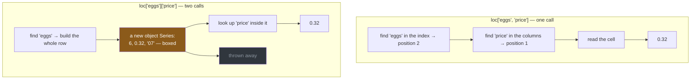

# 1.4 — Rows and columns at once: the comma

## One-line answer

`loc` and `iloc` take **two** arguments separated by a comma — rows first, columns second — and using
the comma instead of two separate lookups is what turns "find the row, then find the column" into one
step that pandas can answer directly.

---

## The story

Somebody at the shop wants one thing: the price of the eggs.

There are two ways to get it out of a list on a fridge. You can run your finger down to the eggs
line, then across to the price column — one movement, ending on one cell. Or you can copy out the
whole eggs line onto a scrap of paper, carry it over, and then read the price off the scrap.

Both give you thirty-two pence. The second one involves writing down a number of eggs and an aisle
number that nobody asked about, and then throwing them away.

On a fridge that costs you nothing. It is a four-line list and a scrap of paper.

The reason it is worth noticing is that in code the scrap of paper gets made, properly, every single
time — and if the question is asked a million times, a million scraps get made and thrown away.

---

## The idea in plain language

Everything so far has given `loc` one argument, and that argument selected **rows**. There is a
second argument, and it selects **columns**:

```
frame.loc[ rows , columns ]
```

The comma is doing real work. `shop.loc["eggs", "price"]` says "the eggs row, the price column" as
one request, and pandas goes straight to that cell. `shop.loc["eggs"]["price"]` says two separate
things: build the whole eggs row, then look up `price` in it.

Both give thirty-two pence. They are not the same operation, and the difference matters for three
reasons.

**The intermediate object.** The two-step version builds a whole row — which, as
[1.2](1.2-loc-by-label.md) showed, is an `object` Series with every value boxed into a Python object.
The one-step version builds nothing.

**Chained assignment.** On the left of an `=`, the two-step version is the trap Day 26 spent a whole
section on
([Day 26, 4.2](../../../day-26-frames-and-copy-on-write/parts/04-chained-assignment/4.2-two-brackets-two-calls.md)).
Two sets of brackets means two calls, and under Copy-on-Write the write lands on a temporary object
that is thrown away. `loc` with a comma is a single call, so there is nothing to lose the write.
That is [3.1](../03-writing/3.1-assigning-through-loc.md)'s subject.

**Readability.** `frame.loc[mask, "need"]` says "the need column, for the rows that match" in one
line, and there is no clearer way to write it.

Both arguments accept everything the single argument accepted — one label, a list, a slice, a mask —
and they can be mixed freely. `shop.loc[shop["price"] > 1, ["need", "aisle"]]` is a mask for the rows
and a list for the columns, and it is an entirely ordinary thing to write.

Two shorthands exist for the single-cell case. **`at`** is `loc` restricted to exactly one cell, and
**`iat`** is `iloc` restricted to one cell. They are faster because they skip the work of handling
lists, slices and masks. The speed difference is smaller than people expect, and *In production* has
the measurement.

---

## Why Setu needs it

- **[2.2](../02-masks/2.2-selecting-with-a-mask.md)** puts a mask in the first argument, which is the
  form you will write most often.
- **[3.1](../03-writing/3.1-assigning-through-loc.md)** puts this whole expression on the left of an
  `=`, and the comma is what makes that safe.
- **[Day 26, 4.3](../../../day-26-frames-and-copy-on-write/parts/04-chained-assignment/4.3-loc-the-single-step.md)**
  is where the single-step argument was first made. This part is the reading half of it.
- **Day 30** builds a pipeline that selects the feature columns before fitting anything. Selecting
  rows and columns in one step is what stops the split and the selection getting out of order, which
  is where leakage comes from (Principle 8).
- **Day 31**'s `groupby` produces frames you immediately narrow to one column, and the comma form is
  how that is written.

---

## The mechanism

One cell, three ways:

```python
import pandas as pd

shop = pd.DataFrame(
    {
        "item": pd.Series(["milk", "bread", "eggs", "rice"], dtype="str"),
        "need": [2, 1, 6, 1],
        "price": [1.15, 1.40, 0.32, 2.05],
        "aisle": pd.Series(["07", "03", "07", "11"], dtype="str"),
    }
).set_index("item")

print("one step  :", shop.loc["eggs", "price"])
print("two steps :", shop.loc["eggs"]["price"])
print("at        :", shop.at["eggs", "price"])
```

**Line by line:**

- `shop.loc["eggs", "price"]` — **one call**, two arguments. pandas resolves the row label and the
  column label together and returns the value at that intersection.
- `shop.loc["eggs"]["price"]` — **two calls.** The first builds a Series of the whole row; the second
  looks `price` up inside it. The answer is the same and the work is not.
- `shop.at["eggs", "price"]` — the single-cell accessor. It only accepts one row label and one column
  label; give it a list and it raises. That restriction is the reason it is faster.
- All three print `0.32`, which is the point: **there is no correctness difference when reading.** The
  difference appears when you write ([3.1](../03-writing/3.1-assigning-through-loc.md)) and when you
  do it many times.

```text
one step  : 0.32
two steps : 0.32
at        : 0.32
```

What actually happens in each case:



The right-hand path builds an object nobody wanted and then discards it. That is the scrap of paper.

Now the useful forms — a block of the table, and a mask with a column:

```python
print(shop.loc[["milk", "eggs"], ["need", "price"]])
print()
print(shop.loc[shop["price"] > 1, "need"])
```

**Line by line:**

- `shop.loc[["milk", "eggs"], ["need", "price"]]` — a list for the rows and a list for the columns,
  giving a **DataFrame**, because both arguments kept their dimension
  ([1.2](1.2-loc-by-label.md)). The result is in the order you asked for, on both axes.
- `shop.loc[shop["price"] > 1, "need"]` — **a mask for the rows and one label for the columns.** The
  mask keeps the row dimension and the single column label drops the column dimension, so the result
  is a Series. This is the single most common shape of pandas selection you will write, and section 2
  is entirely about the first half of it.
- The `aisle` column never appears in either result and was never built. That is the comma earning
  its place.

```text
      need  price
item
milk     2   1.15
eggs     6   0.32

item
milk     2
bread    1
rice     1
Name: need, dtype: int64
```

**The second result is `int64`, not `object`.** Selecting rows *and* naming a column keeps you inside
one column, so the dtype survives — where taking the whole row would have boxed everything
([1.2](1.2-loc-by-label.md)). **The comma is how you avoid the `object` Series entirely.**

---

## When it breaks

**A column that is not there:**

```text
$ uv run python -c "
import pandas as pd
shop = pd.DataFrame({'need': [2, 1]}, index=pd.Index(['milk', 'bread'], name='item'))
shop.loc['milk', 'cost']
" 2>&1 | tail -1
```

```text
KeyError: 'cost'
```

**What it means.** The message names the column and nothing else, so on a frame with forty columns it
does not tell you whether you got the name wrong or the frame wrong. `frame.columns` is the first
thing to print when you meet it. Note that the *row* label was fine — pandas resolves the row first,
so a `KeyError` from a two-argument `loc` can be about either axis and does not say which.

**Giving `at` more than one cell:**

```text
$ uv run python -c "
import pandas as pd
shop = pd.DataFrame({'need': [2, 1]}, index=pd.Index(['milk', 'bread'], name='item'))
shop.at[['milk', 'bread'], 'need']
" 2>&1 | tail -1
```

```text
pandas.errors.InvalidIndexError: ['milk', 'bread']
```

**What it means.** The message is the list you passed and nothing else — no verb, no explanation of
what was invalid about it. What pandas is trying to say is "`at` takes one label, not a list", and the
fix is `loc`. It is a genuinely unhelpful error, and it is the reason to reach for `at` only where you
have already decided the answer is exactly one cell.

**The one that does not fail — the comma that was a tuple:**

```text
$ uv run python -c "
import pandas as pd
shop = pd.DataFrame(
    {'need': [2, 1, 6], 'price': [1.15, 1.40, 0.32]},
    index=pd.Index(['milk', 'bread', 'eggs'], name='item'),
)
print(shop.loc[['milk', 'eggs'], 'need'].to_dict())
print(shop.loc['milk':'eggs', 'need'].to_dict())
print(shop.loc[('milk', 'need')])
"
```

```text
{'milk': 2, 'eggs': 6}
{'milk': 2, 'bread': 1, 'eggs': 6}
2
```

**What it means.** The third line is the interesting one. `shop.loc[("milk", "need")]` — with round
brackets — did exactly the same thing as `shop.loc["milk", "need"]`, because **the comma inside square
brackets already builds a tuple**; the two forms are identical to Python
([Day 8, 1.3](../../../day-08-containers/parts/01-sequences/1.3-a-tuple-is-a-record.md)). That is
harmless here and it stops being harmless with a `MultiIndex`, where a tuple is how you name a single
row across several index levels, and pandas then has to guess whether your tuple means "one row of a
two-level index" or "a row and a column". Day 32 meets that ambiguity properly; for now, the rule is
to write the comma form and never the round brackets, so the two ideas never look alike.

---

## In production

**What a professional writes instead of the teaching version.** The comma form, always, and `at` only
where a measurement justified it:

```python
import pandas as pd


def price_of(shop: pd.DataFrame, item: str) -> float:
    """The price of one item, as a plain Python float."""
    try:
        return float(shop.at[item, "price"])
    except KeyError:
        raise KeyError(f"{item!r} is not on the list; have {list(shop.index)}") from None
```

**Line by line:**

- `shop.at[item, "price"]` — one cell, and the function's whole job is one cell, so the restricted
  accessor states that intent. If this ever needs to return several prices it will not silently start
  doing so; it will raise, and somebody will change the signature.
- `float(...)` — the **boundary conversion**. `at` returns a NumPy scalar and every caller downstream
  — a JSON response, a log line, a database write — is better off with a plain Python float, which is
  the habit Day 26's module established
  ([Day 26, 5.1](../../../day-26-frames-and-copy-on-write/parts/05-the-module/5.1-the-shopping-list-module.md)).
- `except KeyError: raise ... from None` — the bare `KeyError: 'tea'` becomes a sentence naming what
  is available. `from None` hides the original, which adds nothing here
  ([Day 18, 2.3](../../../day-18-exceptions/parts/02-the-hierarchy/2.3-raise-from-and-the-chain.md)).
- `list(shop.index)` in the message — fine for a shopping list, and **wrong for a frame of a million
  rows**, where it would print a million labels into a log. Real code caps it: `list(shop.index[:10])`
  and a count.

**What changes at scale.** The interesting thing here is how small the `at` advantage turns out to be:

```python
import timeit

import pandas as pd

shop = pd.DataFrame(
    {"need": [2, 1, 6, 1], "price": [1.15, 1.40, 0.32, 2.05]},
    index=pd.Index(["milk", "bread", "eggs", "rice"], name="item"),
)
n = 20_000
loc = timeit.timeit(lambda: shop.loc["eggs", "price"], number=n)
at = timeit.timeit(lambda: shop.at["eggs", "price"], number=n)
print(f"loc {loc / n * 1e6:.2f} us   at {at / n * 1e6:.2f} us   ratio {loc / at:.1f}x")
```

**Line by line:**

- `timeit.timeit(..., number=n)` with a lambda, so the frame is built once and only the lookup is
  timed ([Day 25, 4.2](../../../day-25-copy-view-and-the-gate/parts/04-the-benchmark/4.2-timeit-honestly.md)).
- `n = 20_000` because one lookup is far too fast to time on its own; the total is divided back down
  to get a per-call figure.
- Both expressions ask for the same cell, so the only difference measured is the accessor's overhead.

```text
loc 16.68 us   at 12.09 us   ratio 1.4x
```

**1.4×, not 100×.** `at` is faster, and it is *not* the optimisation anybody needs, because both are
around fifteen microseconds — which is enormous compared with reading a value out of an array, and
tiny compared with anything else in a program. The real lesson is the scale of the number: **a single
cell lookup costs about fifteen microseconds, so a million of them costs about fifteen seconds**,
which is why Day 29 argues that the answer is never to make the lookup faster but to stop doing it
one row at a time.

**The failure that only appears with real data.** A service looked up one field per request with
`frame.loc[key]["field"]`. It was fine at ten requests a second. At a thousand it was the slowest
thing in the profile — not because of the lookup, but because each call built a whole `object` row
across ninety columns and discarded eighty-nine of them. Changing it to `frame.loc[key, "field"]` cut
the call cost by an order of magnitude with no other change, and moving the whole thing to a
dictionary cut it by another. **The comma was worth ten times more than the accessor choice.**

**The review comment a senior engineer leaves.** *"`df.loc[i]['col']` — use `df.loc[i, 'col']`. Two
lookups build the whole row and throw it away, and if this ever ends up on the left of an assignment
it silently does nothing under Copy-on-Write."*

**The interview question.** *"What is the difference between `df.loc[a, b]` and `df.loc[a][b]`?"*
The answer that shows you have hit it: reading, they give the same value, but the second builds an
intermediate row — an `object` Series if the columns are mixed — and throws it away, so it is
noticeably slower in a loop. Writing, they are not the same at all: the second is chained assignment,
which under Copy-on-Write writes into a temporary and **silently does nothing**. That is the answer
worth having, because the read case is a performance note and the write case is a bug.

---

## Check yourself

```bash
uv run python -c "
import pandas as pd
shop = pd.DataFrame(
    {
        'need': [2, 1, 6, 1],
        'price': [1.15, 1.40, 0.32, 2.05],
        'aisle': pd.Series(['07', '03', '07', '11'], dtype='str'),
    },
    index=pd.Index(['milk', 'bread', 'eggs', 'rice'], name='item'),
)
a = shop.loc['eggs']
b = shop.loc[shop['price'] > 1, 'need']
print('loc[eggs]        ', type(a).__name__, a.dtype)
print('loc[mask, need]  ', type(b).__name__, b.dtype)
"
```

Both are Series, and only one of them kept a real dtype. Say which, and say what the comma did to
make the difference. Then delete the `aisle` column from the frame and run it again — one of the two
answers changes, and that tells you exactly what causes `object`.

**Answer out loud, without scrolling up:**

> Give three reasons to write `df.loc[row, col]` rather than `df.loc[row][col]`, and say which of the
> three is a bug rather than an inefficiency. Then say roughly what one cell lookup costs, and what
> that number implies about doing it a million times.

---

**Next:** [1.5 — The slice that includes its end](1.5-the-slice-that-includes-its-end.md).
