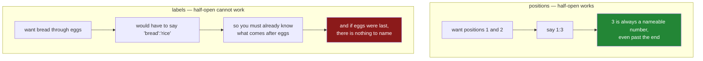

# 1.5 — The slice that includes its end

## One-line answer

`loc["bread":"rice"]` includes `rice` and `iloc[1:3]` excludes position 3 — so `loc` is the one thing
in Python that counts a range the way people do, and that inconsistency is deliberate, because a
label slice with an excluded end would be unusable.

---

## The story

Somebody is reading the shopping list down the phone and the person at the other end says: "just do
me bread through to rice."

Everybody knows what that means. Bread, eggs, rice. The word "through" includes the thing after it,
which is why nobody has ever had to explain it.

Now imagine they had said "bread through to rice" and got bread and eggs, stopping just before the
rice. That would be baffling. You would have to know what came after rice in order to say "rice", and
if rice were the last item there would be nothing to name at all.

That is the whole reason `loc` behaves the way it does, and it is worth understanding rather than
memorising — because everywhere else in Python, ranges stop before their end, and this is the one
place they do not.

---

## The idea in plain language

Python slices are **half-open**: `list[1:3]` gives you positions 1 and 2, and stops before 3. Every
sequence in the language works that way, and NumPy inherits it
([Day 21, 1.3](../../../day-21-indexing-and-views/parts/01-one-element/1.3-slicing-one-axis.md)).

`iloc` follows that rule exactly, because `iloc` is positional and positions are what the rule is
for.

`loc` **does not**. A label slice includes both ends.

That is not an inconsistency somebody forgot to fix. It is forced by what labels are. Half-open
slicing works because with positions you can always name the one *after* the last one you want: to
get positions 1 and 2 you say 3, and 3 always exists as a number even if there is no row there. With
labels there is no such thing. To get "bread through eggs" under a half-open rule you would have to
name whatever comes after eggs — which means you would have to already know the order of the data you
are trying to slice, and if eggs were last there would be no label to name.

So the two accessors count differently, and both are right for what they are:

| | what goes in | end included? | why |
|---|---|---|---|
| `iloc[1:3]` | positions | **no** | you can always name the next position |
| `loc["bread":"rice"]` | labels | **yes** | there may be no next label to name |

There are two more things to know about label slices, and both surprise people.

**A label slice uses the frame's current order, not alphabetical order.** `loc["bread":"rice"]` means
"start at the row called bread, keep going down the frame, stop after the row called rice". If the
frame is not sorted, the answer depends entirely on how the rows happen to be arranged.

**On an unsorted index, a backwards slice returns nothing at all** — no error, just an empty frame.
That is *When it breaks*, and it is the reason the production advice is to sort before slicing.

---

## Why Setu needs it

- **[5.1](../05-reindexing/5.1-reindex-say-the-index-you-want.md)** is what you reach for when you
  want a specific set of labels rather than a range of them, and it does not care about order at all.
- **[2.4](../02-masks/2.4-isin-between-and-the-readable-ones.md)** has `between`, which expresses
  "from here to there" on *values* — and it is inclusive at both ends too, for the same reason.
- **Day 33** resamples a time series, where label slicing is the natural way to say "March" and where
  the inclusive end is exactly what you want. A date slice that excluded its last day would drop the
  thirty-first of the month every time.
- **Day 108** splits a time series for cross-validation, and getting the boundary off by one row is
  the difference between a valid split and a leak (Principle 8).

---

## The mechanism

The same range, said three ways:

```python
import pandas as pd

shop = pd.DataFrame(
    {
        "item": pd.Series(["milk", "bread", "eggs", "rice"], dtype="str"),
        "need": [2, 1, 6, 1],
        "price": [1.15, 1.40, 0.32, 2.05],
        "aisle": pd.Series(["07", "03", "07", "11"], dtype="str"),
    }
).set_index("item")

print("loc['bread':'rice'] ->", list(shop.loc["bread":"rice"].index))
print("iloc[1:3]           ->", list(shop.iloc[1:3].index))
print("plain list [1:3]    ->", ["milk", "bread", "eggs", "rice"][1:3])
```

**Line by line:**

- `shop.loc["bread":"rice"]` — a **label** slice. Bread is at position 1 and rice at position 3, so
  this is asking for the same span as the two lines below it.
- `shop.iloc[1:3]` — a **position** slice covering positions 1 and 2.
- The plain Python list is there as the control. It is the behaviour you already know, and it is what
  `iloc` matches.
- `list(...index)` printed rather than the frames, because the only thing being compared is **which
  rows came back**.

```text
loc['bread':'rice'] -> ['bread', 'eggs', 'rice']
iloc[1:3]           -> ['bread', 'eggs']
plain list [1:3]    -> ['bread', 'eggs']
```

**Three rows against two.** `loc` included `rice`; `iloc` and the plain list stopped before position
3. Two of the three agree, and the one that disagrees is the one taking labels.

Why the rule has to be different:



The right-hand column is the argument. Inclusive label slicing is not a quirk; it is the only rule
that can work.

Now the second surprise — a label slice follows the frame's order, not the alphabet:

```python
sorted_shop = shop.sort_index()
print("frame order  :", list(shop.index))
print("sorted order :", list(sorted_shop.index))
print()
print("unsorted loc['bread':'rice'] ->", list(shop.loc["bread":"rice"].index))
print("sorted   loc['bread':'milk'] ->", list(sorted_shop.loc["bread":"milk"].index))
```

**Line by line:**

- `sort_index()` returns a **new** frame with the rows in alphabetical order by label. It does not
  change `shop` ([Day 26, 3.1](../../../day-26-frames-and-copy-on-write/parts/03-copy-on-write/3.1-every-result-behaves-like-a-copy.md)).
- The two `loc` slices use **different end labels** on purpose, because "from bread to milk" picks out
  a different set of rows in each ordering. The point is not that one answer is wrong; it is that the
  question means something different in each frame.
- `loc` walks the index from the first label to the second **in the order the frame currently has**.
  It is not looking for "everything alphabetically between these two".

```text
frame order  : ['milk', 'bread', 'eggs', 'rice']
sorted order : ['bread', 'eggs', 'milk', 'rice']

unsorted loc['bread':'rice'] -> ['bread', 'eggs', 'rice']
sorted   loc['bread':'milk'] -> ['bread', 'eggs', 'milk']
```

Same frame, same data, two orderings, and a label slice means something different in each. **That is
why the production rule is to sort before slicing by label**, and to check rather than assume.

---

## When it breaks

**A label slice with the ends the wrong way round — which does not raise:**

```text
$ uv run python -c "
import pandas as pd
shop = pd.DataFrame(
    {'need': [2, 1, 6, 1]},
    index=pd.Index(['milk', 'bread', 'eggs', 'rice'], name='item'),
)
out = shop.loc['rice':'bread']
print(out)
print('rows:', len(out))
"
```

```text
Empty DataFrame
Columns: [need]
Index: []
rows: 0
```

**What it means.** `rice` is at position 3 and `bread` at position 1, so pandas started at 3 and
walked forwards looking for `bread`, never found it, and returned nothing. **No error, no warning, an
empty frame**, and every count computed from it is zero. This is the silent failure this day keeps
meeting, and it is especially nasty because the labels were both real — the mistake was only in their
order relative to the frame's.

**A label that is not there, inside a slice:**

```text
$ uv run python -c "
import pandas as pd
shop = pd.DataFrame(
    {'need': [2, 1, 6, 1]},
    index=pd.Index(['milk', 'bread', 'eggs', 'rice'], name='item'),
)
shop.loc['bread':'tea']
" 2>&1 | tail -1
```

```text
KeyError: "Cannot get right slice bound for non-monotonic index with a missing label 'tea'. Either sort the index or specify an existing label."
```

**What it means.** This is one of the best error messages in pandas: it names the label, says *why* it
could not be used, and gives both fixes. Read it as a statement of the rule. On a **non-monotonic**
index — an unsorted one — pandas must find the endpoint in order to know where to stop, so a missing
label is fatal.

Sort the index and the same call **succeeds**, because a monotonic index can be binary-searched and
pandas will slice up to where the label *would have been*:

```text
$ uv run python -c "
import pandas as pd
shop = pd.DataFrame(
    {'need': [2, 1, 6, 1]},
    index=pd.Index(['milk', 'bread', 'eggs', 'rice'], name='item'),
).sort_index()
print('index :', list(shop.index))
print('slice :', list(shop.loc['bread':'tea'].index))
"
```

```text
index : ['bread', 'eggs', 'milk', 'rice']
slice : ['bread', 'eggs', 'milk', 'rice']
```

Everything up to where `tea` would sort — which is past `rice`, so the whole frame. **The same
expression raises on one frame and returns every row on another**, and the only difference is whether
somebody called `sort_index()`. That is worth knowing before it happens to you, and it is the second
reason the production version below asserts monotonicity rather than hoping for it.

**The one that is correct and looks wrong — slicing columns:**

```text
$ uv run python -c "
import pandas as pd
shop = pd.DataFrame(
    {'need': [2, 1], 'price': [1.15, 1.40], 'aisle': ['07', '03']},
    index=pd.Index(['milk', 'bread'], name='item'),
)
print(list(shop.loc[:, 'need':'price'].columns))
print(list(shop.iloc[:, 0:2].columns))
"
```

```text
['need', 'price']
['need', 'price']
```

**What it means.** Here the two forms agree — and only by coincidence. `loc[:, "need":"price"]` is
inclusive, so it takes two columns; `iloc[:, 0:2]` is exclusive, so it also takes two. The same rule
difference applies on the column axis as on the row axis, and it is easier to miss there because
column counts are small enough that both answers often look plausible. **Nothing about slicing
changes when you move to the second argument**, including the inconsistency.

---

## In production

**What a professional writes instead of the teaching version.** A label slice is preceded by the
assertion that makes it meaningful:

```python
import pandas as pd


def rows_between(frame: pd.DataFrame, first: str, last: str) -> pd.DataFrame:
    """Every row from `first` to `last` inclusive, on a sorted index."""
    if not frame.index.is_monotonic_increasing:
        raise ValueError("index must be sorted before slicing by label; call sort_index() first")
    for label in (first, last):
        if label not in frame.index:
            raise KeyError(f"{label!r} is not a label in this frame")
    if first > last:
        raise ValueError(f"{first!r} sorts after {last!r}; the slice would be empty")
    return frame.loc[first:last]
```

**Line by line:**

- `is_monotonic_increasing` — **the assertion that turns a label slice from a guess into a
  question with one answer.** On an unsorted frame the same call means different things at different
  times, and there is nothing in the result to tell you which you got.
- The membership loop checks both ends **before** slicing, because a missing endpoint raises on an
  unsorted index and silently succeeds on a sorted one. This function is for the sorted case, so
  without this check the failure mode would be the quiet one.
- `if first > last` — the explicit guard for the empty result above. It is the only one of the three
  checks that catches a genuine logic error rather than a state problem, and it is the one that would
  otherwise return an empty frame with no complaint.
- `frame.loc[first:last]` with the **inclusive** end, and the docstring says "inclusive" out loud, so
  a caller who has spent all week in Python slices is warned.

**What changes at scale.** Two things.

A label slice on a **sorted** index is a binary search — fast, and it does not build an intermediate
list of labels. On an unsorted index pandas has to scan for the endpoints, which is linear, and on a
large frame that difference is the whole cost of the operation. `sort_index()` once, and then slice
many times, is the shape that pays.

The place this actually matters is **time series**, which is where label slicing earns its keep. A
`DatetimeIndex` supports partial-string slicing, so `frame.loc["2026-08"]` is every row in August and
`frame.loc["2026-08-01":"2026-08-31"]` is the same thing spelled out. **Both include the 31st**, and
that is exactly what a person means by "August". If those slices were half-open, every monthly report
in the world would silently drop its last day. Day 33 is where this becomes the main tool.

**The failure that only appears with real data.** A daily job selected a month with
`frame.loc[start:end]`, where `end` was computed as the first day of the *next* month — the half-open
convention, written by somebody with good habits from every other part of Python. Because `loc` is
inclusive, the job included one row from the following month, every month, for a year. The totals
were about three per cent high and nobody noticed, because three per cent is within the range that a
month-to-month change makes plausible. **The bug was not in pandas and not in the arithmetic; it was
in assuming the slice worked the way slices work everywhere else.**

**The review comment a senior engineer leaves.** *"`df.loc[start:end]` with `end` set to the first of
the next month — `loc` slices are inclusive, so this pulls in an extra day. Either set `end` to the
last day of the month, or use a mask: `df[(df.index >= start) & (df.index < next_month)]`, which is
half-open and says so."*

**The interview question.** *"Are pandas slices inclusive?"* The answer that shows you know why:
`iloc` is exclusive at the end, like every Python slice; `loc` is **inclusive**, because it takes
labels and there is not always a next label to name. Then the two consequences that people who have
actually used it mention: a `loc` slice follows the frame's current order, so it is only meaningful
on a sorted index, and getting the ends the wrong way round returns an empty frame rather than an
error. The follow-up is usually about dates, and there the inclusive end is a feature — a month slice
that included everything but the last day would be wrong in the ordinary sense of the word.

---

## Check yourself

```bash
uv run python -c "
import pandas as pd
shop = pd.DataFrame(
    {'need': [2, 1, 6, 1]},
    index=pd.Index(['milk', 'bread', 'eggs', 'rice'], name='item'),
)
print('loc slice  :', list(shop.loc['bread':'rice'].index))
print('iloc slice :', list(shop.iloc[1:3].index))
print('backwards  :', list(shop.loc['rice':'bread'].index))
s = shop.sort_index()
print('sorted, missing endpoint:', list(s.loc['bread':'tea'].index))
"
```

The last line asks for a label that does not exist, on a sorted index, and gets rows back. Run the
same line on the unsorted frame and it raises. Say why one raises and the other does not.

**Answer out loud, without scrolling up:**

> `loc` slices include their last label and `iloc` slices do not. Give the reason — not the rule, the
> reason — in one sentence about what labels are. Then say what `loc["rice":"bread"]` returns on a
> frame ordered milk, bread, eggs, rice, and why that is the most dangerous answer it could give.

---

**Next:** [2.1 — A comparison makes a column](../02-masks/2.1-a-comparison-makes-a-column.md).
