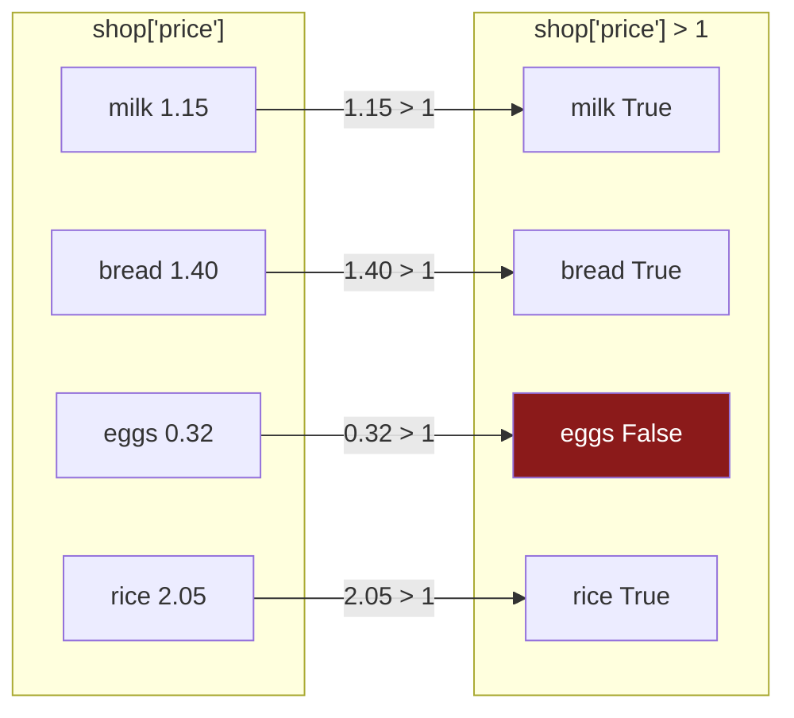

# 2.1 — A comparison makes a column

## One-line answer

`shop["price"] > 1` does not give you `True` or `False` — it gives you a **whole column** of them,
one per row, with the same labels as the frame it came from, and everything else in this section is
built on that one fact.

---

## The story

Somebody goes through the shopping list with a pen and puts a tick next to everything over a pound.

They do not answer a question. They do not say "yes" or "no". They go down the list, line by line,
and leave a mark beside each one: tick, tick, nothing, tick.

What they have made is a second list. It is exactly as long as the first, it lines up with it row for
row, and every entry is either a tick or a blank. It is not the answer to anything yet — it is a
column of decisions, sitting next to the original.

The useful part comes next: you can hold the marked-up sheet next to the list and read off only the
ticked lines. But that is a second step, and the tick column exists on its own before anybody does
it.

---

## The idea in plain language

In ordinary Python, a comparison gives you one answer. `3 > 1` is `True`, and that is the whole
result.

With a pandas column, a comparison is applied to **every value at once** and gives you one answer per
row. `shop["price"] > 1` compares each of the four prices against 1 and hands back four booleans.

That result is called a **mask** — a column of `True` and `False`, the same length as the frame, in
the same order, **carrying the same labels**. Day 21 built exactly this over a NumPy array
([Day 21, 3.1](../../../day-21-indexing-and-views/parts/03-boolean-masks/3.1-a-comparison-makes-an-array.md));
the only thing pandas adds is that the mask keeps the index, and that addition turns out to matter a
great deal ([2.5](2.5-the-mask-that-matched-nothing.md) and
[4.2](../04-alignment/4.2-alignment-is-automatic.md)).

The word for "applied to every value at once, without you writing a loop" is **vectorised**. It is
how every arithmetic and comparison operator on a Series behaves, and Day 29 measures why that
matters. For now the only thing to hold on to is that the result is a *column*, not an answer.

The mask's dtype is `bool`, and that has a pleasant consequence. `True` counts as 1 and `False` as 0,
so:

- `mask.sum()` is **how many rows matched**.
- `mask.mean()` is **what fraction matched**.
- `mask.any()` is "did anything match" and `mask.all()` is "did everything".

Those four are worth knowing before you learn to select with a mask at all, because a surprising
amount of real work is counting rather than filtering.

One warning, stated now and demonstrated in [2.3](2.3-and-or-not-and-the-brackets.md): a mask is a
column, so `if mask:` is meaningless. Python does not know whether a column of four booleans is true
or false, and it raises rather than guessing. The same is true of `and`, `or` and `not`.

---

## Why Setu needs it

- **[2.2](2.2-selecting-with-a-mask.md)** is the next step — putting the mask inside `loc` to keep
  the rows it marked.
- **[2.3](2.3-and-or-not-and-the-brackets.md)** is what happens when you want two conditions, and it
  is entirely a consequence of the result being a column.
- **[3.2](../03-writing/3.2-the-new-column-that-was-a-mask.md)** keeps the mask *as a column*, which
  is often more useful than filtering with it.
- **Day 30** counts missing values per column before deciding on an imputer, and every one of those
  counts is `mask.sum()`.
- **Day 34** builds `describe()` into a data-quality report, and most of its rows are a mask and a
  mean — "what fraction of this column is negative", "what fraction is null".

---

## The mechanism

The comparison, and what it actually returns:

```python
import pandas as pd

shop = pd.DataFrame(
    {
        "item": pd.Series(["milk", "bread", "eggs", "rice"], dtype="str"),
        "need": [2, 1, 6, 1],
        "price": [1.15, 1.40, 0.32, 2.05],
        "aisle": pd.Series(["07", "03", "07", "11"], dtype="str"),
    }
).set_index("item")

over_a_pound = shop["price"] > 1
print(over_a_pound)
print()
print("type :", type(over_a_pound).__name__)
print("dtype:", over_a_pound.dtype)
print("len  :", len(over_a_pound))
```

**Line by line:**

- `shop["price"]` — one column, as a Series
  ([Day 26, 1.1](../../../day-26-frames-and-copy-on-write/parts/01-the-two-objects/1.1-a-column-with-labels.md)).
- `> 1` — the comparison. **The `1` is a single number and the column has four values**, so pandas
  compares every value against that one number. That is broadcasting, the same rule NumPy uses
  ([Day 22, 1.1](../../../day-22-broadcasting-and-shape/parts/01-broadcasting/1.1-adding-one-number-to-every-day.md)).
- The variable is called `over_a_pound` rather than `mask`, because a mask is always a mask *of*
  something and naming it after the question makes every later line readable.
- `len(over_a_pound)` is 4 — **the same length as the frame**, which is the property everything in
  this section depends on.

```text
item
milk      True
bread     True
eggs     False
rice      True
Name: price, dtype: bool

type : Series
dtype: bool
len  : 4
```

**Read the index down the left.** The mask carries `milk, bread, eggs, rice` — the frame's labels,
not row numbers. That is what makes it a *pandas* mask rather than a NumPy one, and
[2.5](2.5-the-mask-that-matched-nothing.md) is where those labels stop being a formality.

`Name: price` is there too: the mask remembers which column it came from, which is a small kindness
when you print one in a debugger and cannot remember what you asked.

The pen going down the list:



Four comparisons, four answers, one per row, in order. No loop was written and none was run.

Now the four things a mask answers on its own, before any selection happens:

```python
print("how many :", over_a_pound.sum())
print("fraction :", over_a_pound.mean())
print("any?     :", over_a_pound.any())
print("all?     :", over_a_pound.all())
```

**Line by line:**

- `.sum()` on a boolean column — `True` is 1 and `False` is 0, so summing counts the `True`s. This is
  the most common thing anybody does with a mask, and it does not involve selecting anything.
- `.mean()` — the same arithmetic divided by the length, so it is **the proportion that matched**.
  `0.75` means three quarters. This one line is most of a data-quality report.
- `.any()` and `.all()` return a single Python `bool`, not a column, which makes them the two mask
  operations you *can* put in an `if`. That is exactly what the error in
  [2.3](2.3-and-or-not-and-the-brackets.md) is telling you to do.
- Note that `sum` and `mean` here are counting rows, **not** adding prices. The mask has forgotten the
  prices entirely; it only knows which rows said yes.

```text
how many : 3
fraction : 0.75
any?     : True
all?     : False
```

Masks can be built from anything that compares, including text:

```python
print("aisle 07     :", (shop["aisle"] == "07").tolist())
print("not aisle 07 :", (shop["aisle"] != "07").tolist())
print("name has 'r' :", shop.index.str.contains("r").tolist())
```

**Line by line:**

- `shop["aisle"] == "07"` — equality on a `str` column, which compares value by value exactly as `>`
  did on the numbers. The leading zero survives because the column is text
  ([Day 27, 1.4](../../../day-27-reading-and-writing/parts/01-the-csv/1.4-dtype-at-read-time.md)) —
  had it been read as `int64`, this comparison would have to be `== 7` and the day's whole first
  section would have been for nothing.
- `!=` gives the opposite mask directly. It is clearer than negating with `~`, and
  [2.3](2.3-and-or-not-and-the-brackets.md) explains when you have no choice.
- `shop.index.str.contains("r")` — **a mask built from the index rather than a column.** The index is
  an `Index`, not a Series, but it has the same `.str` accessor, and the result lines up with the
  frame the same way. Day 33 is where `.str` gets its own treatment.
- `.tolist()` only to keep the output on one line; the real objects are Series.

```text
aisle 07     : [True, False, True, False]
not aisle 07 : [False, True, False, True]
name has 'r' : [False, True, False, True]
```

---

## When it breaks

**Putting a mask in an `if`:**

```text
$ uv run python -c "
import pandas as pd
shop = pd.DataFrame({'price': [1.15, 0.32]}, index=pd.Index(['milk', 'eggs'], name='item'))
if shop['price'] > 1:
    print('yes')
" 2>&1 | tail -1
```

```text
ValueError: The truth value of a Series is ambiguous. Use a.empty, a.bool(), a.item(), a.any() or a.all().
```

**What it means.** `if` needs one `True` or `False` and you gave it four. pandas refuses to guess,
and the message lists the four ways to reduce a column to one answer. **It is not being difficult** —
"is this column true" has at least two sensible meanings, `any` and `all`, and silently picking one
would be wrong half the time. This is the same refusal Day 21 met on a NumPy array
([Day 21, 3.3](../../../day-21-indexing-and-views/parts/03-boolean-masks/3.3-and-or-not-and-why-and-raises.md)),
and it is the single most common pandas error there is.

**Comparing against the wrong type:**

```text
$ uv run python -c "
import pandas as pd
shop = pd.DataFrame(
    {'aisle': ['07', '03']},
    index=pd.Index(['milk', 'eggs'], name='item'),
).astype({'aisle': 'str'})
print((shop['aisle'] == 7).tolist())
print((shop['aisle'] == '07').tolist())
"
```

```text
[False, False]
[True, False]
```

**What it means.** **No error.** Comparing a text column against the number 7 is legal and the answer
is `False` everywhere, because no string equals a number. A filter written that way silently matches
nothing, and [2.5](2.5-the-mask-that-matched-nothing.md) is about what happens next. This is the
concrete cost of the aisle column's dtype being wrong, and it is why
[Day 27, 1.3](../../../day-27-reading-and-writing/parts/01-the-csv/1.3-when-the-guess-is-wrong.md)
insisted the damage happens at read time rather than here.

**The one that looks fine and is not — `NaN` in a comparison:**

```text
$ uv run python -c "
import pandas as pd
shop = pd.DataFrame(
    {'price': [1.15, None, 0.32, 2.05]},
    index=pd.Index(['milk', 'bread', 'eggs', 'rice'], name='item'),
)
print('over  :', (shop['price'] > 1).sum())
print('under :', (shop['price'] <= 1).sum())
print('total :', (shop['price'] > 1).sum() + (shop['price'] <= 1).sum(), 'of', len(shop))
"
```

```text
over  : 2
under : 1
total : 3 of 4
```

**What it means.** Two plus one is three, and there are four rows. The bread row has no price, and
**every comparison against a missing value is `False`** — so bread is not over a pound and it is also
not under a pound. It falls out of both halves.

That is not a bug; it is what "unknown" has to mean. But it destroys an assumption people rely on
without noticing: **a mask and its apparent opposite do not add up to the whole frame.** Splitting
data into two groups this way silently loses every row with a missing value in the column you split
on, and nothing anywhere says so. [2.5](2.5-the-mask-that-matched-nothing.md) has the defence, and
Day 30 is where missing values get their own day.

---

## In production

**What a professional writes instead of the teaching version.** Masks get names, and the name is the
question:

```python
import pandas as pd


def quality_report(frame: pd.DataFrame) -> dict[str, float]:
    """The fraction of rows failing each of the shopping list's rules."""
    return {
        "missing_price": frame["price"].isna().mean(),
        "free_items": (frame["price"] == 0).mean(),
        "negative_need": (frame["need"] < 0).mean(),
        "unknown_aisle": (~frame["aisle"].str.fullmatch(r"\d{2}")).mean(),
    }
```

**Line by line:**

- Every value is a **mask followed by `.mean()`**, so every number in the report is a fraction between
  0 and 1 and they are all comparable. A report mixing counts and fractions is a report somebody will
  misread.
- `.isna()` rather than `== None` or `!= x` — **the only correct way to test for missing**, because
  as the failure above showed, a missing value compares `False` against everything, including
  against itself. `frame["price"] == None` is `False` on every row, always
  ([Day 26, 2.5](../../../day-26-frames-and-copy-on-write/parts/02-the-str-dtype/2.5-the-missing-value-in-a-text-column.md)).
- `frame["price"] == 0` as its own line — free items are a different problem from missing ones, and
  a report that lumps them together cannot tell you which you have.
- `str.fullmatch(r"\d{2}")` — exactly two digits, which is what an aisle code is. `contains` would
  accept `007` and `a07`; `fullmatch` anchors both ends. Text validation is Day 33's subject and this
  is the shape it takes.
- `~` to negate, because `.str.fullmatch` has no "does not match" form. That operator is
  [2.3](2.3-and-or-not-and-the-brackets.md)'s subject and it is here because there is no alternative.

**What changes at scale.** The mask itself is cheap and the thing you do with it may not be.

A boolean mask over `n` rows is `n` bytes — NumPy stores `bool` as one byte, not one bit — so a mask
over a hundred million rows is 100 MB. Building five of them to combine with `&` means five such
arrays alive at once, plus the intermediates. On a large frame the memory cost of an elaborate filter
is real, and the fix is usually to filter in stages so the frame shrinks before the next condition is
applied.

The other thing that changes is where the mask should happen at all. Everything in this section
filters **after** loading. Day 27 argued for closed reads, and the same argument applies here:
`read_parquet` can take a filter and never read the rows
([Day 27, 3.4](../../../day-27-reading-and-writing/parts/03-parquet/3.4-column-pruning.md)), and a SQL
`WHERE` clause filters before anything crosses the wire
([Day 27, 4.2](../../../day-27-reading-and-writing/parts/04-sql/4.2-read-sql-and-the-connection.md)).
**A mask is the right tool for data you already have, and the wrong tool for data you have not
fetched yet.**

**The failure that only appears with real data.** A pipeline split customers into "active" and
"inactive" with `df[df["last_seen"] > cutoff]` and `df[df["last_seen"] <= cutoff]`, then reported on
both. The two groups were used for a year before anybody added them up. Customers who had never been
seen at all had a null `last_seen`, so they were in neither group — about four per cent of the base,
invisible in both reports, and precisely the group the whole exercise was meant to find. **The
totals were never checked against the input**, which is the actual lesson: after splitting a frame in
two, assert that the parts add up.

**The review comment a senior engineer leaves.** *"`df[df['x'] > 0]` and `df[df['x'] <= 0]` — these
do not partition the frame, because nulls fail both. Either drop or handle nulls explicitly first, or
use `~(df['x'] > 0)` for the second group and say in a comment that nulls land there."*

**The interview question.** *"What does `df['a'] > 5` return?"* A Series of booleans, one per row,
carrying the frame's index — not a single answer, which is why `if df['a'] > 5:` raises
`ValueError: The truth value of a Series is ambiguous`. Then the two things that show experience:
because `bool` sums as 0 and 1, `.sum()` counts matches and `.mean()` gives the matching fraction,
which is most of a data-quality report; and **comparisons against missing values are always
`False`**, so a mask and its negation-by-opposite-operator do not cover the frame between them.

---

## Check yourself

```bash
uv run python -c "
import pandas as pd
shop = pd.DataFrame(
    {'need': [2, 1, 6, 1], 'price': [1.15, 1.40, 0.32, 2.05]},
    index=pd.Index(['milk', 'bread', 'eggs', 'rice'], name='item'),
)
m = shop['price'] > 1
print(m.tolist(), m.dtype)
print('count   :', m.sum())
print('fraction:', m.mean())
print('spend on those:', (shop['need'] * shop['price'])[m].sum())
"
```

The last line uses the mask on a column it was not built from. Say why that works, and what would
have to be true for it to stop working.

**Answer out loud, without scrolling up:**

> `shop["price"] > 1` returns something with a length. Say what it is, how long, and what it carries
> besides the booleans. Then say why `(shop["price"] > 1).sum()` and `(shop["price"] <= 1).sum()` do
> not always add up to the number of rows.

---

**Next:** [2.2 — Selecting with a mask](2.2-selecting-with-a-mask.md).
