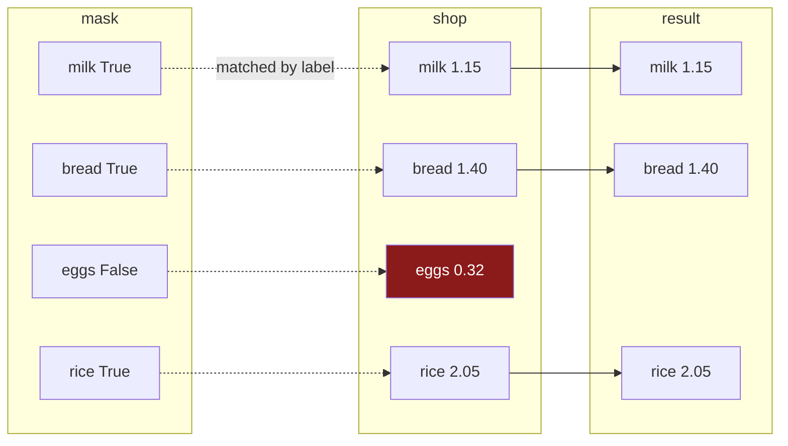

# 2.2 — Selecting with a mask

## One-line answer

Putting a mask inside `loc` keeps the rows where it said `True` and drops the rest — and because the
mask carries labels, pandas matches it to the frame **by label rather than by position**, which is
what makes it safe and what makes it fail in one specific way.

---

## The story

The list has been marked up. There is a tick beside milk, a tick beside bread, nothing beside eggs, a
tick beside rice.

Somebody now wants to know what the ticked items come to. They hold the two sheets side by side —
the list and the ticks — and read down both at once, taking only the lines where there is a tick.

The thing that makes this work is that the two sheets line up. Same lines, same order, same number of
them. If somebody handed you a tick sheet from last week's list, with different items on it, you
would not try to read them side by side. You would stop and say these do not go together.

That instinct — to check that two things line up before using one against the other — is the whole of
this part, and it is the thing pandas does for you.

---

## The idea in plain language

A mask goes inside `loc`'s square brackets, in the **rows** position:

```
frame.loc[ mask ]
frame.loc[ mask , "column" ]
```

The result is a new frame containing only the rows where the mask was `True`, with their labels
intact. Rows where it was `False` are not in the result at all — this is a **filter**, not a
blanking-out. Something that replaces values rather than dropping rows is
[3.3](../03-writing/3.3-where-mask-and-the-write-that-was-not.md)'s subject.

There is a shorthand. `frame[mask]` — with no `loc` — does the same thing. It is very widely used and
it is what you will see everywhere. This day writes `frame.loc[mask]` instead, for one reason:
**square brackets on a frame mean different things depending on what is inside them.** `frame["price"]`
is a column, `frame[["price", "need"]]` is two columns, `frame[mask]` is a filter on rows, and
`frame["a":"b"]` is a slice on rows. Four meanings, one pair of brackets. `loc` has one meaning and
says which axis it is talking about, which is why it is the form to build a habit around — and it is
the form that is safe on the left of an `=`
([3.1](../03-writing/3.1-assigning-through-loc.md)).

Now the part that makes pandas different from NumPy here.

Day 21 filtered a NumPy array with a mask, and that worked **by position**: the first boolean went
with the first element, and the only requirement was that the lengths matched
([Day 21, 3.2](../../../day-21-indexing-and-views/parts/03-boolean-masks/3.2-indexing-with-a-mask.md)).

pandas matches **by label**. The mask's index is compared against the frame's index, and pandas will
not use a mask whose labels do not match — it raises instead. That is a real protection: it means a
mask built from last month's frame cannot silently filter this month's, even if both happen to have
the same number of rows.

The cost of that protection is one error message you have to learn to read, and it is in *When it
breaks*.

---

## Why Setu needs it

- **[2.3](2.3-and-or-not-and-the-brackets.md)** combines two masks before putting them here, which is
  the form most real filters take.
- **[2.5](2.5-the-mask-that-matched-nothing.md)** is about what you get when the mask is `False`
  everywhere, which this part's happy path never shows you.
- **[3.1](../03-writing/3.1-assigning-through-loc.md)** puts this same expression on the left of an
  `=`, and the fact that it is a single `loc` call is what makes that work.
- **[Day 26, 4.5](../../../day-26-frames-and-copy-on-write/parts/04-chained-assignment/4.5-the-filtered-frame-that-warned-nobody.md)**
  showed that a filtered frame is a **copy** under Copy-on-Write, so writing to it does not touch the
  original. That is still true here, and it is the single most important thing to remember about the
  result.
- **Day 30** splits data before fitting anything (Principle 8), and every split in the curriculum
  from here on is a mask in a `loc`.

---

## The mechanism

The filter, and the labels that make it work:

```python
import pandas as pd

shop = pd.DataFrame(
    {
        "item": pd.Series(["milk", "bread", "eggs", "rice"], dtype="str"),
        "need": [2, 1, 6, 1],
        "price": [1.15, 1.40, 0.32, 2.05],
        "aisle": pd.Series(["07", "03", "07", "11"], dtype="str"),
    }
).set_index("item")

over_a_pound = shop["price"] > 1
print(shop.loc[over_a_pound])
print()
print("rows in :", len(shop))
print("rows out:", len(shop.loc[over_a_pound]))
```

**Line by line:**

- `over_a_pound` is the mask from [2.1](2.1-a-comparison-makes-a-column.md), built and named on its
  own line. Building it separately is not just style: a named mask can be counted, inverted and
  reused, and a mask written inline inside the brackets can only filter.
- `shop.loc[over_a_pound]` — the mask in the **rows** position. There is no comma, so every column
  comes back.
- The result keeps the labels of the rows that survived. `eggs` is simply absent; nothing was left
  behind as a blank.
- `len` printed on both sides, because **the whole point of a filter is that the count changes**, and
  checking it is the habit [2.5](2.5-the-mask-that-matched-nothing.md) argues for.

```text
       need  price aisle
item
milk      2   1.15    07
bread     1   1.40    03
rice      1   2.05    11

rows in : 4
rows out: 3
```

How the two line up:



**The dotted lines are label matches, not position matches.** Reorder the mask and the same rows come
back; that is the next block.

Proof that it really is by label, not by position:

```python
shuffled_mask = over_a_pound.sort_index()
print("frame order:", list(shop.index))
print("mask order :", list(shuffled_mask.index))
print()
print("filtered with the shuffled mask:", list(shop.loc[shuffled_mask].index))
```

**Line by line:**

- `over_a_pound.sort_index()` puts the mask's rows in alphabetical order — `bread, eggs, milk, rice`
  — while the frame is still in its original order.
- **The booleans are now in a different order from the frame's rows.** Under NumPy's positional rule
  this would filter the wrong rows and say nothing
  ([Day 21, 3.2](../../../day-21-indexing-and-views/parts/03-boolean-masks/3.2-indexing-with-a-mask.md)).
- pandas lines the two indexes up first, so `eggs → False` still applies to the eggs row wherever
  either of them sits.
- The result comes back in the **frame's** order, not the mask's. The mask says which; the frame says
  where.

```text
frame order: ['milk', 'bread', 'eggs', 'rice']
mask order : ['bread', 'eggs', 'milk', 'rice']

filtered with the shuffled mask: ['milk', 'bread', 'rice']
```

**Same three rows, in the frame's order.** That is alignment doing its job, and it is the first
appearance of the idea section 4 is entirely about
([4.2](../04-alignment/4.2-alignment-is-automatic.md)).

And the form you will write most often — a mask and a column together:

```python
print(shop.loc[over_a_pound, "need"])
print()
print("total needed, of the dear things:", shop.loc[over_a_pound, "need"].sum())
```

**Line by line:**

- `shop.loc[over_a_pound, "need"]` — mask for the rows, one label for the columns. The mask keeps the
  row dimension and the single column label drops the column dimension, so the result is a Series
  ([1.4](../01-label-and-position/1.4-rows-and-columns-at-once.md)).
- Its dtype is `int64`, not `object` — narrowing to one column means you never build a mixed row
  ([1.2](../01-label-and-position/1.2-loc-by-label.md)).
- `.sum()` on that Series adds the **counts**, which is a meaningful number, unlike the `sum` of a
  whole row that [1.2](../01-label-and-position/1.2-loc-by-label.md) warned about.

```text
item
milk     2
bread    1
rice     1
Name: need, dtype: int64

total needed, of the dear things: 4
```

---

## When it breaks

**A mask whose labels do not match:**

```text
$ uv run python -c "
import pandas as pd
shop = pd.DataFrame(
    {'price': [1.15, 1.40]},
    index=pd.Index(['milk', 'bread'], name='item'),
)
wrong = pd.Series([True, False], index=['milk', 'tea'])
shop.loc[wrong]
" 2>&1 | tail -1
```

```text
pandas.errors.IndexingError: Unalignable boolean Series provided as indexer (index of the boolean Series and of the indexed object do not match).
```

**What it means.** The mask has two entries and the frame has two rows, so a positional tool would
have filtered happily and given you a wrong answer. pandas checked the **labels**, found `tea` where
it expected `bread`, and refused.

**This is the error you want.** It is long and it is worded awkwardly — "unalignable boolean Series
provided as indexer" is not how anybody speaks — but what it is saying is simple: *this tick sheet is
not for this list*. The usual cause is building a mask from one frame and applying it to another,
most often after a filter or a `groupby` has changed the index in between.

**A mask that is too short:**

```text
$ uv run python -c "
import pandas as pd
shop = pd.DataFrame(
    {'price': [1.15, 1.40, 0.32]},
    index=pd.Index(['milk', 'bread', 'eggs'], name='item'),
)
shop.loc[[True, False]]
" 2>&1 | tail -1
```

```text
IndexError: Boolean index has wrong length: 2 instead of 3
```

**What it means.** A plain Python **list** of booleans has no index, so pandas falls back to matching
by position — and then the lengths have to agree. Note the difference from the previous failure: a
*Series* mask is checked by label, a *list* mask by position. **The protection comes from the labels,
so a mask that has thrown its labels away has thrown the protection away too.** That is worth
remembering whenever you find yourself writing `.tolist()` or `.to_numpy()` on a mask
([4.5](../04-alignment/4.5-turning-alignment-off.md)).

**The one that does not fail — writing to the filtered result:**

```text
$ uv run python -c "
import pandas as pd
shop = pd.DataFrame(
    {'need': [2, 1, 6, 1], 'price': [1.15, 1.40, 0.32, 2.05]},
    index=pd.Index(['milk', 'bread', 'eggs', 'rice'], name='item'),
)
cheap = shop.loc[shop['price'] < 1]
cheap['need'] = 99
print('the filtered frame:'); print(cheap)
print('the original      :'); print(shop.loc['eggs'].to_dict())
"
```

```text
the filtered frame:
      need  price
item
eggs    99  0.32
the original      :
{'need': 6, 'price': 0.32}
```

**What it means.** The write landed on `cheap` and **the original is untouched** — no error, no
warning, nothing printed. Under Copy-on-Write a filtered frame is a genuine copy, so this is
correct behaviour and the result is exactly what the code asked for. It is still the mistake people
actually make, because they expected `shop` to change
([Day 26, 4.5](../../../day-26-frames-and-copy-on-write/parts/04-chained-assignment/4.5-the-filtered-frame-that-warned-nobody.md)).

**A filter gives you a new frame. To change the original, put the mask on the left of the `=` instead
of filtering first** — `shop.loc[shop["price"] < 1, "need"] = 99` — which is
[3.1](../03-writing/3.1-assigning-through-loc.md).

---

## In production

**What a professional writes instead of the teaching version.** Filters are named functions, the mask
is separate from the selection, and the count is checked:

```python
import pandas as pd


def dear_items(shop: pd.DataFrame, threshold: float = 1.0) -> pd.DataFrame:
    """The rows costing more than `threshold`. Empty is a valid answer; None is not."""
    if "price" not in shop.columns:
        raise KeyError(f"no price column; have {list(shop.columns)}")
    expensive = shop["price"] > threshold
    return shop.loc[expensive].copy()
```

**Line by line:**

- `threshold: float = 1.0` — the number is a parameter with a default rather than a literal buried in
  the body, so "over a pound" can become "over two pounds" without editing the filter.
- The column check first, because `shop["price"]` on a frame without that column raises `KeyError:
  'price'`, which does not say what the frame did have.
- `expensive` is built on its own line. It can be counted, logged or inverted, and the return line
  reads as English.
- `.copy()` — **explicit, and deliberate.** Under Copy-on-Write the result already behaves like a
  copy ([Day 26, 3.1](../../../day-26-frames-and-copy-on-write/parts/03-copy-on-write/3.1-every-result-behaves-like-a-copy.md)),
  so this changes no behaviour. It states to a reader that the caller owns the result and may write
  to it, which under the old rules was the difference between working code and a warning. Writing it
  down costs one call and removes a question.
- The docstring says **"Empty is a valid answer"**, which is [2.5](2.5-the-mask-that-matched-nothing.md)'s
  subject and the single most useful sentence in this function.

**What changes at scale.** Three things.

**Filter early and filter narrow.** `shop.loc[mask, ["need", "price"]]` builds a frame of two columns;
`shop.loc[mask]` builds one of all forty. On a large frame that is the difference between a copy you
notice and one you do not, and it is the same closed-read argument
[Day 27, 3.4](../../../day-27-reading-and-writing/parts/03-parquet/3.4-column-pruning.md) made about
reading.

**A filter always copies.** There is no view here — the rows that survive are gathered into new
memory, exactly as NumPy's fancy indexing does
([Day 21, 4.3](../../../day-21-indexing-and-views/parts/04-fancy-indexing/4.3-fancy-indexing-always-copies.md)).
So a chain of five filters builds five frames, and on a large one it is cheaper to combine the
conditions into a single mask with `&` ([2.3](2.3-and-or-not-and-the-brackets.md)) than to filter
five times.

**And the fastest filter is the one that never happens in pandas at all**, because the rows were
never read: a `WHERE` clause
([Day 27, 4.2](../../../day-27-reading-and-writing/parts/04-sql/4.2-read-sql-and-the-connection.md))
or a Parquet row-group filter does the same job before anything crosses into memory.

**The failure that only appears with real data.** A monthly job built a mask from a reference frame
and applied it to the transactions frame. It worked for eleven months because both frames happened to
carry the same default `RangeIndex`, so the labels matched by accident. In the twelfth month the
reference frame arrived pre-filtered, its index had gaps, and the job died on
`Unalignable boolean Series provided as indexer`. **The error was correct and eleven months late** —
the code had been matching by coincidence all along. The fix was to derive the mask from the frame
being filtered, which is the rule: **a mask belongs to the frame it was built from.**

**The review comment a senior engineer leaves.** *"`df[df['x'] > 0]` — use `df.loc[...]`. Plain
brackets on a frame mean four different things depending on the argument, and this one is one
refactor away from becoming chained assignment. Also, this filters then selects two columns; do it in
one `loc` so we do not build the wide intermediate."*

**The interview question.** *"How does boolean indexing work in pandas, and how is it different from
NumPy?"* The answer that shows you have used both: in NumPy the mask is matched by **position** and
the only requirement is equal length; in pandas it is matched by **label**, so a mask from a
different frame raises `IndexingError` instead of silently filtering the wrong rows. Then the two
practical consequences: converting the mask to a list or an array throws that protection away and
puts you back on positional matching, and the filtered result is always a **copy**, so writing to it
does not change the frame you filtered.

---

## Check yourself

```bash
uv run python -c "
import pandas as pd
shop = pd.DataFrame(
    {'need': [2, 1, 6, 1], 'price': [1.15, 1.40, 0.32, 2.05]},
    index=pd.Index(['milk', 'bread', 'eggs', 'rice'], name='item'),
)
m = shop['price'] > 1
print('by label   :', list(shop.loc[m].index))
print('shuffled   :', list(shop.loc[m.sort_index()].index))
print('as a list  :', list(shop.loc[m.tolist()].index))
print('as a list, reversed:', list(shop.loc[m.tolist()[::-1]].index))
"
```

The last line reverses the booleans and gets rows back with no error at all. Say which of the four
calls was protected by labels and which was not.

**Answer out loud, without scrolling up:**

> A mask has four entries and a frame has four rows. Say what pandas checks before using one against
> the other, and what it does when the check fails. Then say what happens to the original frame when
> you write into the result of a filter.

---

**Next:** [2.3 — `&`, `|`, `~` and the brackets](2.3-and-or-not-and-the-brackets.md).
