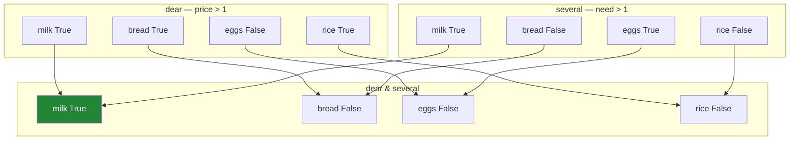

# 2.3 — `&`, `|` and `~` — and the brackets you cannot leave out

## One-line answer

Two conditions are combined with `&`, `|` and `~` rather than `and`, `or` and `not`, and **every
condition must be wrapped in its own brackets**, because `&` binds more tightly than `>` and without
them Python does the comparison last.

---

## The story

Somebody wants the things that are both over a pound *and* needed more than once.

They say it out loud without thinking: "over a pound and more than one". Two conditions, joined by
the word "and", which is how everybody has ever expressed this.

Written down in code, using the word "and", it does not work. It does not give the wrong rows — it
stops, with a complaint about a truth value being ambiguous, which is not a sentence anybody has said
at a shop.

Then they remove the "and", put in an `&`, and it still does not work. Same complaint.

The second failure is the interesting one, and it is not really about `and` at all. It is about where
Python decides to put the brackets you did not write.

---

## The idea in plain language

Python's `and`, `or` and `not` work on **one** true-or-false value each. `x and y` asks Python "is x
true?" and then "is y true?", and to do that it has to reduce each side to a single yes or no.

A mask is a **column** of values ([2.1](2.1-a-comparison-makes-a-column.md)), so there is no single
yes or no to reduce it to. Python raises rather than guessing, which is the same refusal Day 21 met
on a NumPy array
([Day 21, 3.3](../../../day-21-indexing-and-views/parts/03-boolean-masks/3.3-and-or-not-and-why-and-raises.md)).

The operators that do work are the **elementwise** ones — the ones that combine two columns row by
row and give back a column:

| you mean | you write | not |
|---|---|---|
| both | `&` | `and` |
| either | `\|` | `or` |
| not | `~` | `not` |

These are the bitwise operators, borrowed for this job because Python lets a type decide what they
mean ([Day 5, 1.5](../../../day-05-operators-and-conditionals/parts/01-operators/1.5-bitwise-and-the-mask.md)).
pandas defines them to combine masks row by row. Python does not let a type redefine `and`, `or` or
`not`, which is the real reason this substitution exists — it is not a style choice, it is the only
option available.

Now the brackets, which is the part that actually costs people time.

`&` has **higher precedence than `>`**. So this:

```
shop["price"] > 1 & shop["need"] > 1
```

is not "price over 1, and need over 1". Python reads it as:

```
shop["price"] > (1 & shop["need"]) > 1
```

The `1 & shop["need"]` happens *first*, and everything after that is nonsense wearing a familiar
shape. **The fix is to bracket each condition:**

```
(shop["price"] > 1) & (shop["need"] > 1)
```

The rule to carry out of this part is short: **every condition gets its own brackets, always.** Not
when it is ambiguous — always. It costs two characters and removes a category of bug that produces a
confusing error at best and, in some arrangements, a plausible wrong answer.

---

## Why Setu needs it

- **[2.4](2.4-isin-between-and-the-readable-ones.md)** gives you `isin` and `between`, which replace
  whole chains of `|` and `&` with one readable call.
- **[2.5](2.5-the-mask-that-matched-nothing.md)** is where a too-narrow `&` chain ends up, and this
  part is how such a chain gets built.
- **[3.1](../03-writing/3.1-assigning-through-loc.md)** uses combined masks on the left of an `=`,
  where an off-by-one-condition mask writes to the wrong rows rather than selecting them.
- **Day 30** builds the missing-value strategy from masks like `(a.isna()) & (b.notna())`, and every
  one of those needs its brackets.
- **Day 34**'s data-quality report is a stack of these, and the readability difference between a
  bracketed chain and an `isin` is what makes it maintainable.

---

## The mechanism

The two conditions, combined correctly:

```python
import pandas as pd

shop = pd.DataFrame(
    {
        "item": pd.Series(["milk", "bread", "eggs", "rice"], dtype="str"),
        "need": [2, 1, 6, 1],
        "price": [1.15, 1.40, 0.32, 2.05],
        "aisle": pd.Series(["07", "03", "07", "11"], dtype="str"),
    }
).set_index("item")

dear = shop["price"] > 1
several = shop["need"] > 1
print(shop.loc[dear & several])
print()
print("dear    :", dear.tolist())
print("several :", several.tolist())
print("both    :", (dear & several).tolist())
```

**Line by line:**

- The two masks are built and **named separately**. Once they have names, `dear & several` reads as
  English and no brackets are needed at all — which is the strongest argument for naming them.
- `dear & several` — row by row: `True & True` is `True`, everything else is `False`. The result is
  another mask, the same length, with the same labels
  ([2.1](2.1-a-comparison-makes-a-column.md)).
- Printing all three masks side by side shows the combination happening. Only milk is `True` in both.
- `shop.loc[...]` — the combined mask goes into `loc` exactly as a single one did
  ([2.2](2.2-selecting-with-a-mask.md)); nothing about the selection changes.

```text
      need  price aisle
item
milk     2   1.15    07

dear    : [True, True, False, True]
several : [True, False, True, False]
both    : [True, False, False, False]
```

The three operators, row by row:



Four rows in, four rows out. Nothing is dropped by `&` — it produces a mask, and the *dropping*
happens later, in `loc`.

Now `|` and `~`, and the one place `~` is genuinely necessary:

```python
print("either      :", (dear | several).tolist())
print("not dear    :", (~dear).tolist())
print("same as <=  :", (shop["price"] <= 1).tolist())
print()
print("neither     :", (~dear & ~several).tolist())
print("de Morgan   :", (~(dear | several)).tolist())
```

**Line by line:**

- `dear | several` — either condition. Three rows qualify, which is more than `&` gave, as it should
  be.
- `~dear` — the opposite of the mask, flipping every value. It is the tilde character, and on most
  keyboards it is the least familiar of the three.
- `shop["price"] <= 1` gives the same answer **here**, and the two are not interchangeable in general.
  When the column has missing values they differ, and that is
  [2.1](2.1-a-comparison-makes-a-column.md)'s failure and [2.5](2.5-the-mask-that-matched-nothing.md)'s
  defence. **`~mask` flips whatever the mask said; `<=` asks a new question that a missing value
  answers `False` to as well.**
- The last two lines are the same set of rows written two ways — "not dear and not several" against
  "not (dear or several)". They agree, as the algebra says they must, and the second is easier to
  read once there are more than two conditions.

```text
either      : [True, True, True, True]
not dear    : [False, False, True, False]
same as <=  : [False, False, True, False]

neither     : [False, False, False, False]
de Morgan   : [False, False, False, False]
```

---

## When it breaks

**Using `and`:**

```text
$ uv run python -c "
import pandas as pd
shop = pd.DataFrame(
    {'need': [2, 1], 'price': [1.15, 1.40]},
    index=pd.Index(['milk', 'bread'], name='item'),
)
shop.loc[(shop['price'] > 1) and (shop['need'] > 1)]
" 2>&1 | tail -1
```

```text
ValueError: The truth value of a Series is ambiguous. Use a.empty, a.bool(), a.item(), a.any() or a.all().
```

**What it means.** Even with both conditions correctly bracketed, `and` cannot work. Python evaluates
the left side, tries to decide whether it is true, and there is no answer for a column of two
booleans. **The brackets were right and the operator was wrong** — which is worth seeing, because
people meeting this error usually change the brackets first.

**Leaving the brackets out:**

```text
$ uv run python -c "
import pandas as pd
shop = pd.DataFrame(
    {'need': [2, 1], 'price': [1.15, 1.40]},
    index=pd.Index(['milk', 'bread'], name='item'),
)
shop.loc[shop['price'] > 1 & shop['need'] > 1]
" 2>&1 | tail -1
```

```text
ValueError: The truth value of a Series is ambiguous. Use a.empty, a.bool(), a.item(), a.any() or a.all().
```

**What it means.** **The identical message, from a completely different mistake** — and that is why
this error is so confusing. Here the operator was right and the brackets were wrong. Python's
precedence turned the expression into `shop["price"] > (1 & shop["need"]) > 1`, which is a chained
comparison, and a chained comparison is `a > b and b > c` under the covers
([Day 5, 1.3](../../../day-05-operators-and-conditionals/parts/01-operators/1.3-comparison-and-chaining.md)).
There is the `and`, inserted by the language, on two Series.

So the same message means two different things, and the way to tell them apart is to look at what you
wrote rather than at the error. **If you see "truth value of a Series is ambiguous", check for a
literal `and`/`or` first, then check every condition has its own brackets.**

**The one that does not fail — a mask combined with a number:**

```text
$ uv run python -c "
import pandas as pd
shop = pd.DataFrame(
    {'need': [2, 1, 6, 1]},
    index=pd.Index(['milk', 'bread', 'eggs', 'rice'], name='item'),
)
print('need      :', shop['need'].tolist())
print('need & 1  :', (shop['need'] & 1).tolist())
print('rows kept :', list(shop.loc[(shop['need'] & 1).astype(bool)].index))
"
```

```text
need      : [2, 1, 6, 1]
need & 1  : [0, 1, 0, 1]
rows kept : ['bread', 'rice']
```

**What it means.** `&` on an integer column is a genuine **bitwise and**, done on the numbers
themselves: `2 & 1` is 0, `1 & 1` is 1, `6 & 1` is 0. What came out is a column of odd-or-even flags,
and it filtered two rows without any error at all.

That is the sub-expression the missing brackets created above, doing exactly what it was asked. It is
also the reason the bracket rule is *always* rather than *when needed*: **on a numeric column,
`&` with a number is legal and silent**, so an expression can be missing its brackets, produce no
error, and return a confident wrong answer. The version that raised was the lucky one.

---

## In production

**What a professional writes instead of the teaching version.** Long conditions are named, not
chained, and the combination reads as a sentence:

```python
import pandas as pd


def restock_candidates(shop: pd.DataFrame) -> pd.DataFrame:
    """Items worth reordering: cheap enough to stock up on, and running low."""
    affordable = shop["price"] <= 2.00
    running_low = shop["need"] >= 2
    known_aisle = shop["aisle"].notna()
    return shop.loc[affordable & running_low & known_aisle]
```

**Line by line:**

- Three named masks, then one line combining them. Compare it with the single expression —
  `shop.loc[(shop["price"] <= 2.00) & (shop["need"] >= 2) & (shop["aisle"].notna())]` — which is the
  same logic and cannot be read without counting brackets.
- **Named masks need no brackets in the combination**, because a name is already a single term. The
  bracket rule exists to protect expressions, and naming them makes the rule moot.
- Each name says what the condition *means*, not what it tests. `running_low` is a business idea;
  `shop["need"] >= 2` is its current definition, and the definition can change on one line.
- `.notna()` rather than `!= None`, for the reason [2.1](2.1-a-comparison-makes-a-column.md) gave:
  comparison against a missing value is always `False`, so `!= None` is `True` everywhere and tests
  nothing.
- Each mask can be counted independently when the answer is empty, which is
  [2.5](2.5-the-mask-that-matched-nothing.md)'s whole technique — and impossible with one long
  expression.

**What changes at scale.** Two things.

**Each `&` builds a new array.** A five-condition chain allocates five masks plus four intermediates,
each one byte per row ([2.1](2.1-a-comparison-makes-a-column.md)). At a hundred million rows that is
close to a gigabyte of booleans for a filter that keeps a thousand rows. The fix is to apply the most
selective condition first as a filter, so the frame is small before the rest of the conditions are
computed — the opposite of the "one big mask" advice, and it only matters at that scale.

**`query` exists for the readability problem**, and it is worth knowing about even if you rarely use
it: `shop.query("price > 1 and need > 1")` takes a **string**, parses it itself, and inside that
string `and` and `or` work normally because Python never sees them. It is genuinely more readable for
long conditions and it costs a parse per call, cannot be checked by a linter or a type checker, and
hides column-name typos until run time. [2.4](2.4-isin-between-and-the-readable-ones.md) shows it
next to the alternatives.

**The failure that only appears with real data.** A filter was written as
`df[df["score"] > 0.5 & df["reviewed"]]` — no brackets, and `reviewed` a boolean column, so `&`
between a float `0.5` and a boolean column raised immediately in testing. Somebody "fixed" it by
casting: `df["reviewed"].astype(int)`. Now `0.5 & 1` was a valid bitwise operation, nothing raised,
and the filter had quietly become something nobody could describe. It ran for months. **The cast
silenced an error that was doing its job**, which is the general lesson: when a type error appears in
a boolean expression, the fix is almost never a cast.

**The review comment a senior engineer leaves.** *"Bracket each condition — `(a > 1) & (b > 2)`. It
works here by luck because both sides are already masks, but the first time somebody adds a bare
number this becomes a bitwise operation on the values and stops raising. And please name the three
conditions; I cannot tell what this filter means without evaluating it in my head."*

**The interview question.** *"Why can't you use `and` between two pandas conditions?"* Because `and`
needs a single true-or-false value from each side and a mask is a column of them, so pandas raises
`ValueError: The truth value of a Series is ambiguous` rather than guessing between `any` and `all`.
The follow-up that separates people who have read this from people who have hit it: **the same error
also appears when you have used `&` correctly but left the brackets out**, because `&` binds tighter
than `>` and the expression becomes a chained comparison — which contains an implicit `and`. And the
worst case is not an error at all: on a numeric column, `&` with a number is a valid bitwise
operation, so a missing bracket can return a confident wrong answer.

---

## Check yourself

```bash
uv run python -c "
import pandas as pd
shop = pd.DataFrame(
    {'need': [2, 1, 6, 1], 'price': [1.15, 1.40, 0.32, 2.05]},
    index=pd.Index(['milk', 'bread', 'eggs', 'rice'], name='item'),
)
dear = shop['price'] > 1
several = shop['need'] > 1
print('both   :', list(shop.loc[dear & several].index))
print('either :', list(shop.loc[dear | several].index))
print('neither:', list(shop.loc[~dear & ~several].index))
print('bitwise:', (shop['need'] & 1).tolist())
"
```

The last line does arithmetic, not logic, and does not complain. Say what it computed and why that
makes the bracket rule non-negotiable.

**Answer out loud, without scrolling up:**

> `ValueError: The truth value of a Series is ambiguous` has two different causes. Name both, and say
> how you tell which one you have. Then say why `~mask` and `<=` are not always the same thing.

---

**Next:** [2.4 — `isin`, `between`, and the readable ones](2.4-isin-between-and-the-readable-ones.md).
