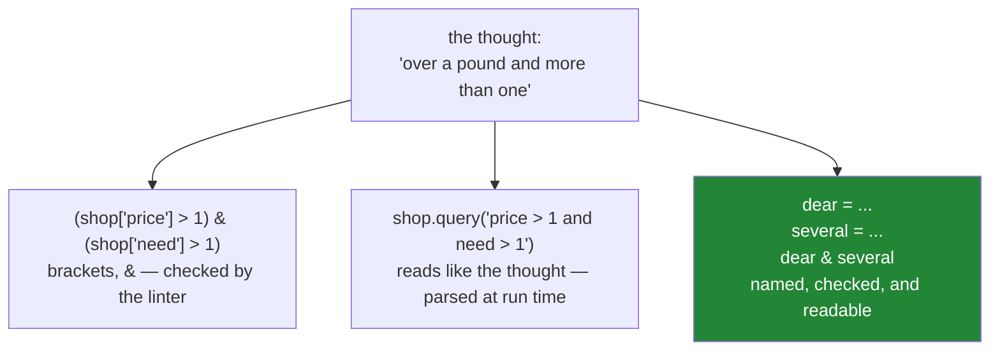

# 2.4 — `isin`, `between`, and the readable ones

## One-line answer

`isin` replaces a chain of `|` with a list, `between` replaces a pair of `&` with two numbers, and
both exist because a filter you can read out loud is a filter somebody can check.

---

## The story

Somebody is doing the shop and only wants the things in the two aisles nearest the door: seven and
eleven.

Said out loud, that is one thought: *the things in aisle seven or eleven*.

Written with what section 2 has given us so far, it is a chain: aisle equals seven, or aisle equals
eleven — and each of those needs its own brackets. Two aisles is fine. Then somebody adds a third,
and a fourth, and the line stops fitting on the screen, and the brackets stop being countable by eye.

Nothing is wrong with the long version. It gives the right answer every time.

The problem is that the person reviewing it a month later has to count brackets to check that the
third aisle was not accidentally joined with an `&`. The thought was simple and its written form is
not, and that gap is where mistakes live.

---

## The idea in plain language

Three methods turn common shapes of condition into one readable call.

**`isin`** takes a collection and asks, for every row, "is this value one of these?" It replaces a
chain of `==` joined by `|`:

```
(shop["aisle"] == "07") | (shop["aisle"] == "11")     becomes     shop["aisle"].isin(["07", "11"])
```

**`between`** takes a low and a high value and asks "is this value in that range?" It replaces a pair
of comparisons joined by `&`:

```
(shop["price"] >= 1.0) & (shop["price"] <= 1.5)     becomes     shop["price"].between(1.0, 1.5)
```

**`between` includes both ends by default**, which is the same choice `loc` slices make and for a
related reason: it is what people mean by "between one pound and one fifty"
([1.5](../01-label-and-position/1.5-the-slice-that-includes-its-end.md)). The `inclusive=` argument
takes `"both"`, `"neither"`, `"left"` or `"right"` when you need something else, and stating it
explicitly is a kindness to the next reader.

**`query`** is different in kind. It takes the whole condition as a **string** and parses it itself:

```
shop.query("price > 1 and need > 1")
```

Inside that string, `and` and `or` work normally, because Python never sees them — pandas is reading
the text. It is genuinely more readable for long conditions. It also has real costs, and *In
production* is honest about them.

All three return a mask, and every mask goes in `loc` exactly as before
([2.2](2.2-selecting-with-a-mask.md)). Nothing about selection changes; this part is entirely about
how the condition is written.

---

## Why Setu needs it

- **[2.3](2.3-and-or-not-and-the-brackets.md)** is what these methods replace, and knowing the long
  form is what lets you read somebody else's code.
- **[2.5](2.5-the-mask-that-matched-nothing.md)** is about empty results, and `isin` with a list
  containing a typo is one of the two most common ways to get one.
- **[5.1](../05-reindexing/5.1-reindex-say-the-index-you-want.md)** does something that looks like
  `isin` and is not: `reindex` *demands* labels and inserts blanks for the missing ones, where `isin`
  merely tests. Knowing which you want is the point.
- **Day 30** selects the numeric columns for an imputer with something very like this, and
  `select_dtypes` is the same readability idea applied to columns.
- **Day 34** builds a data-quality report where every rule is one readable line, and `between` is
  most of the range checks in it.

---

## The mechanism

`isin`, against the chain it replaces:

```python
import pandas as pd

shop = pd.DataFrame(
    {
        "item": pd.Series(["milk", "bread", "eggs", "rice"], dtype="str"),
        "need": [2, 1, 6, 1],
        "price": [1.15, 1.40, 0.32, 2.05],
        "aisle": pd.Series(["07", "03", "07", "11"], dtype="str"),
    }
).set_index("item")

by_the_door = shop["aisle"].isin(["07", "11"])
the_long_way = (shop["aisle"] == "07") | (shop["aisle"] == "11")
print(shop.loc[by_the_door])
print()
print("same mask?", by_the_door.equals(the_long_way))
```

**Line by line:**

- `.isin(["07", "11"])` — the method goes on the **column**, and the list is what to look for. It
  returns a mask the same length as the column
  ([2.1](2.1-a-comparison-makes-a-column.md)), so everything after it is unchanged.
- The list is a list of **strings**, matching the column's `str` dtype. `isin([7, 11])` would find
  nothing, silently, which is the failure [2.1](2.1-a-comparison-makes-a-column.md) showed and which
  section 2 keeps coming back to.
- `the_long_way` is built for comparison only. In real code you write one of these, not both.
- `.equals(...)` rather than `==`, because comparing two masks with `==` gives a third mask rather
  than an answer ([1.2](../01-label-and-position/1.2-loc-by-label.md)).
- **The gain is not speed.** `isin` uses a hash set internally so it does scale better than a long
  `|` chain, but on four rows the difference is nothing. The gain is that the list can be a variable,
  come from a config file, or grow to forty entries without the line changing shape.

```text
      need  price aisle
item
milk     2   1.15    07
eggs     6   0.32    07
rice     1   2.05    11

same mask? True
```

`between`, and the ends it includes:

```python
mid_priced = shop["price"].between(1.0, 1.5)
print(shop.loc[mid_priced])
print()
print("both ends :", shop["price"].between(1.15, 1.40).tolist())
print("left only :", shop["price"].between(1.15, 1.40, inclusive="left").tolist())
```

**Line by line:**

- `.between(1.0, 1.5)` — low first, high second. Both ends are included by default, so a price of
  exactly 1.50 would qualify.
- The second pair of lines uses the frame's **actual values** as the bounds — 1.15 is milk's price and
  1.40 is bread's — so the difference the `inclusive=` argument makes is visible rather than
  theoretical.
- `inclusive="left"` includes the low end and excludes the high one, which is the half-open convention
  everything else in Python uses ([1.5](../01-label-and-position/1.5-the-slice-that-includes-its-end.md)).
  Bread drops out.
- **State `inclusive=` whenever a boundary value could really occur.** The default is fine for
  "roughly between", and it is a bug waiting to happen for date ranges and price bands, where the
  boundary is exactly where the interesting rows sit.

```text
       need  price aisle
item
milk      2   1.15    07
bread     1   1.40    03

both ends : [True, True, False, False]
left only : [True, False, False, False]
```

The three ways of writing one filter:



The third is what this day recommends, and `isin` and `between` are how the individual names get
short enough for it to work.

`query`, and what it buys:

```python
print(shop.query("price > 1 and need > 1"))
print()
print(
    "same as the mask version:",
    shop.query("price > 1 and need > 1").equals(shop.loc[(shop["price"] > 1) & (shop["need"] > 1)]),
)
```

**Line by line:**

- The whole condition is a **string**, and `and` inside it is fine — pandas parses the text itself, so
  Python never evaluates that `and` ([2.3](2.3-and-or-not-and-the-brackets.md)).
- Column names are written bare, without `shop["..."]`, which is most of the readability gain.
- A name with a space in it needs backticks — `` shop.query("`unit price` > 1") `` — and a Python
  variable is referenced with an `@` prefix: `shop.query("price > @limit")`. Both are worth knowing
  because both are unguessable.
- `.equals(...)` confirms the two produce the identical frame. **The choice between them is entirely
  about readability and tooling**, not about behaviour.

```text
      need  price aisle
item
milk     2   1.15    07

same as the mask version: True
```

---

## When it breaks

**`isin` with the wrong type — which does not raise:**

```text
$ uv run python -c "
import pandas as pd
shop = pd.DataFrame(
    {'aisle': ['07', '03', '07', '11']},
    index=pd.Index(['milk', 'bread', 'eggs', 'rice'], name='item'),
).astype({'aisle': 'str'})
print('as strings:', shop['aisle'].isin(['07', '11']).sum(), 'rows')
print('as numbers:', shop['aisle'].isin([7, 11]).sum(), 'rows')
"
```

```text
as strings: 3 rows
as numbers: 0 rows
```

**What it means.** Three rows against none, from the same column and the same two aisles. The only
difference is quotes.

`isin` never raises on a type mismatch, because "is this string one of these numbers" is a
well-formed question whose answer is simply always no. So the mask is `False` everywhere, the filter
returns an empty frame, and nothing at any point suggests that a mistake was made. This is the same
failure [2.1](2.1-a-comparison-makes-a-column.md) showed with `==`, and it is why
[Day 27, 1.3](../../../day-27-reading-and-writing/parts/01-the-csv/1.3-when-the-guess-is-wrong.md)
spent so long on getting the aisle column's dtype right at read time: a column read as `int64` makes
every correctly-written string filter in the project silently match nothing.
[2.5](2.5-the-mask-that-matched-nothing.md) is entirely about what to do when you meet the empty
frame.

**`between` with the arguments the wrong way round:**

```text
$ uv run python -c "
import pandas as pd
shop = pd.DataFrame(
    {'price': [1.15, 1.40, 0.32, 2.05]},
    index=pd.Index(['milk', 'bread', 'eggs', 'rice'], name='item'),
)
print('between(1.5, 1.0):', shop['price'].between(1.5, 1.0).sum(), 'rows')
"
```

```text
between(1.5, 1.0): 0 rows
```

**What it means.** No error. `between(high, low)` asks for values that are at least 1.5 *and* at most
1.0, which nothing can satisfy, so the mask is `False` everywhere. Swapping two arguments is an easy
typo and its symptom is an empty result rather than a complaint — the same silent shape as the
backwards `loc` slice ([1.5](../01-label-and-position/1.5-the-slice-that-includes-its-end.md)).

**`query` with a column that does not exist:**

```text
$ uv run python -c "
import pandas as pd
shop = pd.DataFrame(
    {'price': [1.15, 1.40]},
    index=pd.Index(['milk', 'bread'], name='item'),
)
shop.query('cost > 1')
" 2>&1 | tail -1
```

```text
pandas.errors.UndefinedVariableError: name 'cost' is not defined
```

**What it means.** The error is correct and it arrives **at run time**, from a string. Nothing could
have caught it earlier: a linter cannot see inside the string, a type checker cannot, and your editor
will not offer to rename `cost` when the column is renamed. Compare it with `shop["cost"] > 1`, which
fails just as late but which at least a search for `"cost"` would find. **That is the real cost of
`query`** — not speed, but that the condition is invisible to every tool in the project.

---

## In production

**What a professional writes instead of the teaching version.** The collection is a named constant,
and the filter says what it means:

```python
import pandas as pd

BY_THE_DOOR: frozenset[str] = frozenset({"07", "11"})
IMPULSE_RANGE: tuple[float, float] = (0.50, 2.00)


def quick_trip(shop: pd.DataFrame) -> pd.DataFrame:
    """What you can grab near the door without thinking about the price."""
    near_door = shop["aisle"].isin(BY_THE_DOOR)
    cheap_enough = shop["price"].between(*IMPULSE_RANGE, inclusive="both")
    return shop.loc[near_door & cheap_enough]
```

**Line by line:**

- `BY_THE_DOOR` as a module constant — the aisles are a fact about the shop, not about this function,
  and putting them here means one edit when the shop rearranges.
- `frozenset` rather than a list. `isin` accepts either, and a frozenset says **this is a set of
  things and it cannot be changed**, which stops a caller mutating a shared constant
  ([Day 8, 2.1](../../../day-08-containers/parts/02-sets-and-dicts/2.1-a-set-is-a-hash-table.md)).
- `IMPULSE_RANGE` as a tuple, unpacked with `*` into `between`'s two arguments
  ([Day 8, 1.4](../../../day-08-containers/parts/01-sequences/1.4-unpacking-and-star-rest.md)). The
  pair stays together, so the "arguments the wrong way round" failure above cannot happen at the call
  site — it could only happen once, in the constant, where it is visible.
- `inclusive="both"` stated even though it is the default, because a price band's boundary is exactly
  where an argument happens later.
- Two named masks, combined without brackets — [2.3](2.3-and-or-not-and-the-brackets.md)'s
  recommendation, made easy by the fact that each name is now one method call.
- **No `query`.** The column names here are checked by nothing, but at least they are strings a search
  will find, and the constants are typed.

**What changes at scale.** Three things worth knowing.

`isin` builds a **hash set** from its argument, so it is roughly constant time per row regardless of
how many values you pass. A twenty-way `|` chain is twenty passes over the column. At a hundred
million rows that difference is real, and it is the one case where the readable version is also the
fast one.

`query` has a second mode that people reach for at scale: with `numexpr` installed, pandas can
evaluate the parsed expression in chunks without building every intermediate mask, which saves memory
on long `&` chains over large frames. It is a genuine advantage, and it only shows up somewhere above
a hundred thousand rows or so — below that, `query` is slower because of the parse.

And the point [2.2](2.2-selecting-with-a-mask.md) made stands here too: **the best filter is the one
that never loads the rows.** An `isin` over five thousand identifiers is a `WHERE ... IN` in SQL
([Day 27, 4.2](../../../day-27-reading-and-writing/parts/04-sql/4.2-read-sql-and-the-connection.md)),
and doing it there means five thousand rows cross the wire instead of fifty million.

**The failure that only appears with real data.** A job filtered accounts with
`df["region"].isin(regions)`, where `regions` came from a configuration file. Somebody added a region
to the config with a trailing space. `isin` found no matches for it, silently, and the report simply
had one fewer region in it than it should — no error, no missing-key warning, and nothing in the
output announcing that a requested region had contributed nothing. **`isin` cannot tell you that
something you asked for was not found**, because it only reports per row, never per wanted value. The
fix is to check the other direction as well: `set(regions) - set(df["region"].unique())` should be
empty, and asserting that is one line.

**The review comment a senior engineer leaves.** *"`isin` with a list built from config — please
assert that every value in the list actually occurs, or we will silently drop a category when
somebody mistypes one. Also `between(a, b)` here: state `inclusive=`, because these are price
boundaries and somebody will ask next quarter whether £2.00 is in or out."*

**The interview question.** *"How do you filter for several possible values in a column?"* `isin` with
a collection, which is both more readable than a chain of `|` and genuinely faster because it hashes.
Then the two things that show you have been burned: it **silently matches nothing on a type
mismatch**, so a list of integers against a text column returns an empty frame with no complaint; and
it can never tell you that a value you asked for was absent, so if the list came from configuration
you check the set difference separately. If `query` comes up, the honest summary is that it reads
better and is invisible to linters, type checkers and rename refactoring, which is usually the
deciding argument against it in a codebase that has to be maintained.

---

## Check yourself

```bash
uv run python -c "
import pandas as pd
shop = pd.DataFrame(
    {'price': [1.15, 1.40, 0.32, 2.05], 'aisle': ['07', '03', '07', '11']},
    index=pd.Index(['milk', 'bread', 'eggs', 'rice'], name='item'),
).astype({'aisle': 'str'})
print('isin strings:', list(shop.loc[shop['aisle'].isin(['07', '11'])].index))
print('isin numbers:', list(shop.loc[shop['aisle'].isin([7, 11])].index))
print('between     :', list(shop.loc[shop['price'].between(1.0, 1.5)].index))
print('backwards   :', list(shop.loc[shop['price'].between(1.5, 1.0)].index))
wanted = ['07', '11', '99']
print('asked for but absent:', sorted(set(wanted) - set(shop['aisle'].unique())))
"
```

Two of those four filters return nothing and neither complains. The last line is the check that
catches the third kind of mistake — say which mistake that is.

**Answer out loud, without scrolling up:**

> Say what `isin` and `between` each replace, and why `between` includes both ends by default. Then
> say the one thing `isin` can never tell you, and what you write alongside it to find that out.

---

**Next:** [2.5 — The mask that matched nothing](2.5-the-mask-that-matched-nothing.md).
