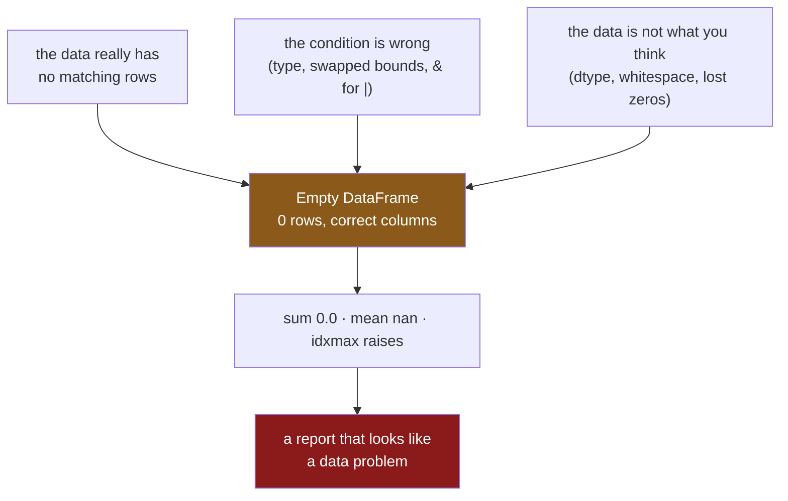

# 2.5 — The mask that matched nothing

## One-line answer

A filter that matches no rows returns an **empty frame** rather than an error, and the reductions you
run on it afterwards disagree with each other — `sum` says `0.0`, `mean` says `nan`, `idxmax` raises
— so an empty result travels a long way through a program before anybody notices.

---

## The story

Somebody is sent to the shop with an instruction: get everything in aisle four.

There is nothing in aisle four. Nobody on the list is in aisle four.

They come home with an empty bag. That is the correct outcome and it is also completely useless,
because now there are two possibilities and the empty bag looks the same under both: either there
genuinely was nothing to get, or the instruction was wrong — somebody meant aisle seven, or typed the
number in a way the shop does not use.

The person who sent them cannot tell which. The bag is empty either way.

The only way to tell the difference is to have asked a second question before setting out: *how many
things are in aisle four?* And nobody asks that, because when the answer is "three" the question
feels like a waste of time.

---

## The idea in plain language

Every filter has three possible outcomes and only two of them are usually thought about: some rows,
all rows, or **no rows**.

An empty result is not an error. `shop.loc[mask]` where the mask is `False` everywhere gives you a
frame with the right columns, the right dtypes, and zero rows. Everything downstream keeps working,
because an empty frame supports every operation a full one does.

What it does *not* do is behave consistently. Reductions over nothing have no obviously right answer,
so pandas makes a different choice for each:

| on an empty column | result | why |
|---|---|---|
| `.sum()` | `0.0` | the sum of nothing is zero, by convention |
| `.mean()` | `nan` | the average of nothing is genuinely undefined |
| `.max()` | `nan` | no maximum exists, so it reports missing |
| `.idxmax()` | **raises** | there is no label to return |
| `len()` | `0` | honest |

Look at the first two rows. **`sum` is `0.0` and `mean` is `nan`, from the same empty column.** Both
are defensible and they are not consistent with each other, which means an empty frame flowing into a
report produces a confusing mixture: some cells zero, some cells blank, and nothing saying why.

There are exactly three reasons a mask matches nothing, and telling them apart is the whole skill:

1. **The data genuinely has no such rows.** This is the answer that is fine, and it is the least
   common of the three.
2. **The condition is wrong.** A type mismatch ([2.4](2.4-isin-between-and-the-readable-ones.md)), a
   `between` with its arguments swapped, a `&` where an `|` was meant.
3. **The data is not what you think.** The column arrived with the wrong dtype, the values have
   trailing spaces, the aisle codes lost their leading zeros somewhere upstream
   ([Day 27, 1.3](../../../day-27-reading-and-writing/parts/01-the-csv/1.3-when-the-guess-is-wrong.md)).

You cannot tell these apart by looking at the empty frame, because all three produce the identical
empty frame. **You tell them apart by looking at the mask and at the column, not at the result** —
and the technique for that is this part's mechanism.

---

## Why Setu needs it

- **[2.4](2.4-isin-between-and-the-readable-ones.md)** showed two filters that silently match
  nothing. This is what happens next.
- **[5.3](../05-reindexing/5.3-duplicate-labels.md)** is the opposite failure — a selection returning
  *more* rows than expected — and the defence is the same: assert the count.
- **[6.2](../06-the-module/6.2-the-test-that-can-go-red.md)** tests the empty case explicitly,
  because it is the case that never comes up in development and always comes up in production.
- **Day 30**'s imputer is fitted on a filtered subset. Fitting an imputer on zero rows produces a
  transformer full of `nan` that then silently corrupts every row it touches.
- **Day 233**'s eval suite has to distinguish "the retriever found nothing" from "the retriever is
  broken", which is exactly this problem with a different noun.

---

## The mechanism

The empty result, and what it still looks like:

```python
import pandas as pd

shop = pd.DataFrame(
    {
        "item": pd.Series(["milk", "bread", "eggs", "rice"], dtype="str"),
        "need": [2, 1, 6, 1],
        "price": [1.15, 1.40, 0.32, 2.05],
        "aisle": pd.Series(["07", "03", "07", "11"], dtype="str"),
    }
).set_index("item")

nothing = shop.loc[shop["price"] > 99]
print(nothing)
print()
print(nothing.dtypes.to_string())
print()
print("len:", len(nothing), "| empty:", nothing.empty)
```

**Line by line:**

- `shop["price"] > 99` — a condition nothing satisfies. Written deliberately here; in real code it is
  a typo or a dtype problem.
- The result prints as `Empty DataFrame` with its **columns and index still listed**, which is pandas
  being helpful — the shape survived even though the rows did not.
- `.dtypes` is unchanged: `int64`, `float64`, `str`. **An empty frame remembers its schema**, which is
  why it flows onward so easily and why nothing downstream objects.
- `.empty` is the readable test. `len(frame) == 0` says the same thing; `if frame:` does **not** work,
  for the reason [2.1](2.1-a-comparison-makes-a-column.md) gave about ambiguous truth values.

```text
Empty DataFrame
Columns: [need, price, aisle]
Index: []

need       int64
price    float64
aisle        str

len: 0 | empty: True
```

Now the reductions, which is where it stops being harmless:

```python
column = nothing["price"]
print("sum   :", column.sum())
print("mean  :", column.mean())
print("max   :", column.max())
print("count :", column.count())
try:
    print("idxmax:", column.idxmax())
except ValueError as error:
    print("idxmax: ValueError:", error)
```

**Line by line:**

- `nothing["price"]` — an empty Series, still `float64`. Every method below is one you would write
  without thinking on a full column.
- `.sum()` returns **`0.0`**, following the mathematical convention that an empty sum is zero. It is
  the right convention and it is indistinguishable from a real total of zero.
- `.mean()` returns **`nan`**, because there is no defensible number to divide by. **The same empty
  column gives a definite answer to one question and a missing answer to another.**
- `.count()` counts non-missing values and returns `0`, which is the only reduction here that is
  unambiguous.
- `.idxmax()` **raises**, because it must return a label and there are none. The `try` is around it
  precisely because it is the odd one out, and the one that will stop a job at three in the morning.

```text
sum   : 0.0
mean  : nan
max   : nan
count : 0
idxmax: ValueError: attempt to get argmax of an empty sequence
```

**Read those five lines as a group.** `0.0`, `nan`, `nan`, `0`, and an exception — five reductions
over the same nothing, behaving four different ways. A report built from them shows a total of zero
next to a blank average, and looks like a data problem rather than a filter problem.

How the three causes converge on one result:



Three different bugs, one indistinguishable symptom. The defence has to happen **before** the arrow
into `E`.

The technique — take the condition apart:

```python
wanted = ["7"]
mask = shop["aisle"].isin(wanted)
print("rows matched  :", mask.sum())
print("column dtype  :", shop["aisle"].dtype)
print("values present:", sorted(shop["aisle"].unique()))
print("asked for     :", sorted(wanted))
print("asked, absent :", sorted(set(wanted) - set(shop["aisle"].unique())))
```

**Line by line:**

- `wanted = ["7"]` — the realistic mistake: `"7"` rather than `"07"`. It is a string, so there is no
  type error, and aisle seven really does exist. Only the spelling is wrong, and the shop writes its
  aisles with two digits.
- `mask.sum()` first, because **counting is the first diagnostic** and it costs nothing
  ([2.1](2.1-a-comparison-makes-a-column.md)). A zero here tells you to keep reading rather than to
  keep debugging downstream.
- `.dtype` printed, because cause 3 is the hardest to see. A column that should be `str` and is
  `int64` explains every empty filter in the file at once.
- `.unique()` — **what is actually in the column.** On four rows you could have looked; on four
  million rows this is the only way, and for a low-cardinality column it is cheap.
- `set(wanted) - set(...unique())` — **the check `isin` cannot do for you.** `isin` reports per row,
  never per wanted value, so a requested value that never occurs is invisible to it
  ([2.4](2.4-isin-between-and-the-readable-ones.md)). This one line names the typo.

```text
rows matched  : 0
column dtype  : str
values present: ['03', '07', '11']
asked for     : ['7']
asked, absent : ['7']
```

**`asked, absent: ['7']`** is the whole diagnosis, printed. The column is the right dtype, so cause 3
is ruled out; the value asked for is simply not one the column contains, so this is cause 2. Nothing
about the empty frame itself could have told you that, and the four lines above cost nothing to
print.

---

## When it breaks

**The empty frame reaching a reduction that raises:**

```text
$ uv run python -c "
import pandas as pd
shop = pd.DataFrame(
    {'price': [1.15, 1.40]},
    index=pd.Index(['milk', 'bread'], name='item'),
)
dearest = shop.loc[shop['price'] > 99]
print('the priciest item is:', dearest['price'].idxmax())
" 2>&1 | tail -1
```

```text
ValueError: attempt to get argmax of an empty sequence
```

**What it means.** The message does not mention frames, filters, columns or `idxmax`'s caller — it is
NumPy's wording, surfacing through pandas. `argmax` is the underlying operation and `sequence` is the
empty array. **Nothing in it points at the filter three lines above**, which is where the problem
actually is. When you meet this, do not look at the reduction; look at what produced the thing being
reduced.

**Two empty frames concatenated — which changes the dtypes:**

```text
$ uv run python -c "
import pandas as pd
shop = pd.DataFrame(
    {'need': [2, 1], 'price': [1.15, 1.40]},
    index=pd.Index(['milk', 'bread'], name='item'),
)
empty = shop.loc[shop['price'] > 99]
print('filtered empty  :', dict(empty.dtypes.astype(str)))
print('built empty     :', dict(pd.DataFrame().dtypes.astype(str)))
print('concat of both  :', dict(pd.concat([empty, pd.DataFrame()]).dtypes.astype(str)))
"
```

```text
filtered empty  : {'need': 'int64', 'price': 'float64'}
built empty     : {}
concat of both  : {'need': 'int64', 'price': 'float64'}
```

**What it means.** A frame emptied *by a filter* keeps its columns and dtypes; a frame built empty has
none. They both print as `Empty DataFrame` and they are not interchangeable. Code that collects
results in a list and concatenates at the end — a common shape — behaves differently depending on
whether the list is empty or contains empty frames, and the symptom is missing columns rather than an
error. **Seed such a list with a correctly-typed empty frame, or check for the empty list
explicitly.**

**The one that does not fail — zero and nothing, side by side:**

```text
$ uv run python -c "
import pandas as pd
shop = pd.DataFrame(
    {'price': [0.0, 0.0]},
    index=pd.Index(['sample', 'freebie'], name='item'),
)
free = shop.loc[shop['price'] == 0]
none_at_all = shop.loc[shop['price'] > 99]
print('two free items    : sum =', free['price'].sum(), '| rows =', len(free))
print('no items at all   : sum =', none_at_all['price'].sum(), '| rows =', len(none_at_all))
"
```

```text
two free items    : sum = 0.0 | rows = 2
no items at all   : sum = 0.0 | rows = 0
```

**What it means.** Two genuinely different situations — two free items, and no items — reporting the
**same total of `0.0`**. A dashboard showing "total spend: £0.00" cannot tell you which happened, and
they mean opposite things: one is a successful shop that cost nothing, the other is a filter that
found nobody. **A total is never enough on its own; it needs the row count beside it.** That is the
single most useful habit in this part, and it costs one extra column in every report you write.

---

## In production

**What a professional writes instead of the teaching version.** The filter asserts what it expects,
and says which of the three causes it ruled out:

```python
import pandas as pd


class NoMatchingRows(ValueError):
    """A filter that was expected to match something matched nothing."""


def in_aisles(shop: pd.DataFrame, aisles: list[str]) -> pd.DataFrame:
    """Rows in any of `aisles`. Raises if an aisle was requested that does not exist."""
    present = set(shop["aisle"].unique())
    unknown = sorted(set(aisles) - present)
    if unknown:
        raise NoMatchingRows(
            f"aisle(s) {unknown} are not in this frame; it has {sorted(present)}. "
            f"Column dtype is {shop['aisle'].dtype}."
        )
    return shop.loc[shop["aisle"].isin(aisles)]
```

**Line by line:**

- The check is on the **requested values**, not on the result, which is what separates cause 2 from
  cause 1. An empty result after this check has passed genuinely means "no rows", and the caller can
  trust it.
- `NoMatchingRows(ValueError)` — a named exception, so a caller can decide that an empty aisle is
  acceptable in their case and catch it, rather than having to parse a message
  ([Day 18, 3.1](../../../day-18-exceptions/parts/03-your-own/3.1-one-base-class-per-project.md)).
- The message carries **three things**: what was asked for, what exists, and the column's dtype. Those
  are exactly the three causes, and the message rules out or confirms each.
- `sorted(...)` on both sets, because an unordered set prints in an arbitrary order and two runs of
  the same failure should produce the same message.
- **The function still returns an empty frame when the aisles exist but no row matches for another
  reason.** It is deliberately not "never empty" — it is "empty only for a reason you have ruled in".

**What changes at scale.** Three things.

`.unique()` on a high-cardinality column is expensive and the message it produces is unreadable.
Above a few dozen distinct values, print a count and a sample: `f"{len(present)} distinct values, e.g.
{sorted(present)[:5]}"`. The check itself — the set difference — stays cheap and stays worth doing.

**The empty case has to be tested, because it will never occur in development.** Your fixture has
matching rows; production has a month where the category was retired. This is the single most common
gap in a pandas test suite, and it is one test:
`assert_frame_equal(fn(empty_input), expected_empty)`. [6.2](../06-the-module/6.2-the-test-that-can-go-red.md)
writes it.

And in a **pipeline**, an empty frame is worse than an exception, because it propagates. An empty
frame joins to produce an empty frame, groups to produce an empty frame, and fits a model that
predicts `nan`. By the time anything complains, the traceback points at a step that is fine. Real
pipelines put a row-count assertion between stages for exactly this reason — not because the count is
interesting, but because it localises the failure to the step that caused it.

**The failure that only appears with real data.** A daily job filtered to one product category and
reported its revenue. One day the upstream system started sending the category name capitalised.
`isin(["widgets"])` matched nothing, the filter returned an empty frame, `sum()` returned `0.0`, and
the dashboard showed **£0 revenue for widgets** — a plausible, alarming, entirely false number that
triggered a two-day investigation into a sales problem that did not exist. **`sum` returning `0.0` on
an empty frame is the most expensive default in pandas**, because zero is a number a business
recognises and acts on.

**The review comment a senior engineer leaves.** *"This filter can return an empty frame and the next
line takes `.mean()` of it, which gives `nan`, which the JSON encoder turns into `null`. Either
assert the frame is non-empty here with a message saying what was filtered, or handle the empty case
explicitly and return something the caller can distinguish from a real zero."*

**The interview question.** *"What happens when a pandas filter matches nothing?"* You get an empty
frame with the correct columns and dtypes — not an error, which is the problem. Then the detail that
shows you have been caught by it: the reductions disagree. `sum()` is `0.0`, `mean()` is `nan`,
`idxmax()` raises, so an empty result produces a confusing mixture downstream rather than one clear
signal, **and a total of zero is indistinguishable from a real total of zero**. The defence is to
check the mask's `sum()` and, when the condition came from a list, to check the set difference
between what you asked for and what the column actually contains — because a filter can never tell
you that a value you looked for was absent.

---

## Check yourself

```bash
uv run python -c "
import pandas as pd
shop = pd.DataFrame(
    {'price': [1.15, 1.40, 0.32, 2.05], 'aisle': ['07', '03', '07', '11']},
    index=pd.Index(['milk', 'bread', 'eggs', 'rice'], name='item'),
).astype({'aisle': 'str'})
none_at_all = shop.loc[shop['aisle'].isin(['7'])]
print('rows  :', len(none_at_all))
print('sum   :', none_at_all['price'].sum())
print('mean  :', none_at_all['price'].mean())
print('absent:', sorted({'7'} - set(shop['aisle'].unique())))
"
```

Two of those four lines look like ordinary answers and one of them names the actual bug. Say which,
and say what you would have concluded from the `sum` alone.

**Answer out loud, without scrolling up:**

> Name the three reasons a filter matches nothing, and say why the empty frame cannot tell you which
> one you have. Then say what `sum()` and `mean()` each return on an empty column, and why the
> difference between those two answers is dangerous in a report.

---

**Next:** [3.1 — Assigning through `loc`](../03-writing/3.1-assigning-through-loc.md).
