# 3.1 — Assigning through `loc`

## One-line answer

Everything `loc` can select, it can also **write to** — put the same expression on the left of an `=`
and pandas changes those cells in place, which is the only spelling of a write that is guaranteed to
land.

---

## The story

Somebody rings from the shop: the eggs are on offer, six for the price of a dozen, so put the number
up to twelve.

That is a change to one cell of the list. Not a new list, not a copy with a note attached — the
number next to eggs, made different.

Somebody at home goes to the fridge, finds the eggs line, finds the number, crosses it out and writes
twelve.

The only way to get that wrong on a fridge is to write on the wrong line. In code there is a second
way, and it is the one that catches everybody: you can copy the list onto a scrap of paper, correct
the scrap, and put the scrap in the bin. The fridge is unchanged and nobody notices, because
correcting the scrap looked exactly like correcting the list.

---

## The idea in plain language

`loc` works on both sides of an assignment. On the right it selects; on the left it **writes**.

```
shop.loc["eggs", "need"] = 12
```

The rules for what goes inside the brackets are unchanged — one label, a list, a slice or a mask
([1.2](../01-label-and-position/1.2-loc-by-label.md)) — and whatever that expression *would have
selected* is what gets written to.

The reason this matters, and the reason it has a part of its own, is that there is another spelling
that looks equivalent and is not:

```
shop["need"]["eggs"] = 12
```

Two sets of brackets means **two operations**. The first, `shop["need"]`, produces a Series. The
second writes into that Series. And under Copy-on-Write — the rule pandas 3.0 introduced, that every
result behaves like a copy
([Day 26, 3.1](../../../day-26-frames-and-copy-on-write/parts/03-copy-on-write/3.1-every-result-behaves-like-a-copy.md))
— that Series is a copy. You changed the copy. The frame is untouched, and the copy is discarded on
the next line.

This is **chained assignment**, and Day 26 spent a whole section on it
([Day 26, 4.1](../../../day-26-frames-and-copy-on-write/parts/04-chained-assignment/4.1-the-write-that-vanished.md)).
The reason it comes back here is that section 2 has just given you masks, and a mask makes the
mistake much easier to write by accident — `shop[shop["price"] > 1]["need"] = 0` is chained
assignment wearing a filter's clothes.

**`loc` with a comma is one operation.** There is no intermediate object, so there is nothing for the
write to land on and be lost. That is the whole argument, and it is why the rule is simply: *if you
are writing, use `loc`.*

One more thing before the code. Assignment through `loc` **changes the frame you called it on**. That
is different from almost everything else on this day — filters, selections and comparisons all return
new objects and leave the original alone. A `loc` assignment is one of the few genuinely mutating
operations in pandas, and knowing that is what makes
[3.2](3.2-the-new-column-that-was-a-mask.md)'s alternative worth having.

---

## Why Setu needs it

- **[3.2](3.2-the-new-column-that-was-a-mask.md)** is the non-mutating alternative, `assign`, and the
  choice between them is a design decision rather than a style one.
- **[3.3](3.3-where-mask-and-the-write-that-was-not.md)** is `where` and `mask`, which change values
  without changing rows, and which have their own silent failure.
- **[2.2](../02-masks/2.2-selecting-with-a-mask.md)** showed that a filtered frame is a copy, so
  writing to it does nothing to the original. This part is the fix for that.
- **[Day 26, 4.3](../../../day-26-frames-and-copy-on-write/parts/04-chained-assignment/4.3-loc-the-single-step.md)**
  made this argument first, without masks. This part is the same argument once filters exist.
- **Day 30** repairs missing values in place before a pipeline, and every repair in it is a `loc`
  assignment through a mask.

---

## The mechanism

One cell, changed:

```python
import pandas as pd

shop = pd.DataFrame(
    {
        "item": pd.Series(["milk", "bread", "eggs", "rice"], dtype="str"),
        "need": [2, 1, 6, 1],
        "price": [1.15, 1.40, 0.32, 2.05],
        "aisle": pd.Series(["07", "03", "07", "11"], dtype="str"),
    }
).set_index("item")

shop.loc["eggs", "need"] = 12
print(shop.loc["eggs"].to_dict())
```

**Line by line:**

- `shop.loc["eggs", "need"] = 12` — row label, comma, column label, on the left of the `=`. **One
  call**, so pandas knows exactly which cell you mean and writes to it
  ([1.4](../01-label-and-position/1.4-rows-and-columns-at-once.md)).
- The comma is not optional here in the way it was when reading. When reading,
  `shop.loc["eggs"]["need"]` gave the right answer slowly; when writing, it gives no answer at all.
- `shop` itself is changed. There is no new frame and nothing was returned — this line is a
  statement, not an expression.

```text
{'need': 12, 'price': 0.32, 'aisle': '07'}
```

Now the form you will actually write — a mask on the left:

```python
shop = pd.DataFrame(
    {
        "item": pd.Series(["milk", "bread", "eggs", "rice"], dtype="str"),
        "need": [2, 1, 6, 1],
        "price": [1.15, 1.40, 0.32, 2.05],
        "aisle": pd.Series(["07", "03", "07", "11"], dtype="str"),
    }
).set_index("item")

shop.loc[shop["price"] > 1, "need"] = 0
print(shop)
```

**Line by line:**

- The frame is rebuilt, because the previous block already changed it. **A mutating operation makes
  every later block depend on every earlier one**, which is a real cost of writing in place and one
  reason [3.2](3.2-the-new-column-that-was-a-mask.md) exists.
- `shop["price"] > 1` — a mask, in the **rows** position, exactly as in
  [2.2](../02-masks/2.2-selecting-with-a-mask.md). Everything section 2 taught applies unchanged.
- `"need"` after the comma — the column being written. Without it, the assignment would try to write
  `0` into **every column** of the matching rows, including the text ones.
- `= 0` — one value, written to every matching cell. That is broadcasting again
  ([Day 22, 1.1](../../../day-22-broadcasting-and-shape/parts/01-broadcasting/1.1-adding-one-number-to-every-day.md)):
  one number spread across three cells.
- The three dear rows are set to zero and eggs is left alone, which is what the mask said.

```text
       need  price aisle
item
milk      0   1.15    07
bread     0   1.40    03
eggs      6   0.32    07
rice      0   2.05    11
```

The two spellings, and where the write goes in each:

```mermaid
flowchart TB
    subgraph GOOD["shop.loc['eggs', 'need'] = 12"]
        G1["one call"]
        G2["pandas resolves row and column together"]
        G3["writes into the frame's own memory"]
        G1 --> G2 --> G3 --> G4["the frame changed ✓"]
    end
    subgraph BAD["shop['need']['eggs'] = 12"]
        B1["call 1: shop['need'] → a Series"]
        B2["under Copy-on-Write, that is a copy"]
        B3["call 2: writes 12 into the copy"]
        B4["the copy is discarded"]
        B1 --> B2 --> B3 --> B4 --> B5["the frame is unchanged ✗"]
    end
    style G4 fill:#238636,color:#fff
    style B5 fill:#8b1a1a,color:#fff
```



---

## When it breaks

**Chained assignment — the write that goes nowhere:**

```text
$ uv run python -c "
import pandas as pd
shop = pd.DataFrame(
    {'need': [2, 1]},
    index=pd.Index(['milk', 'bread'], name='item'),
)
shop['need']['milk'] = 99
print('milk need is still:', shop.loc['milk', 'need'])
" 2>&1 | tail -4
```

```text
ChainedAssignmentError: A value is trying to be set on a copy of a DataFrame or Series through chained assignment.
When using the Copy-on-Write mode, such chained assignment never works to update the original DataFrame or Series, because the intermediate object on which we are setting values always behaves as a copy.

Try using '.loc[row_indexer, col_indexer] = value' instead, to be safe.
milk need is still: 2
```

**What it means.** pandas 3.0 emits `ChainedAssignmentError` — and read the type name carefully,
because **it is a warning, not an exception.** The script did not stop; the last line printed. The
value is still 2.

The message is unusually good: it says what happened, why Copy-on-Write makes it permanent, and what
to write instead. It is also easy to miss, because a warning in a long log scrolls past and the
program carries on producing plausible output.

Day 26 covered this in full
([Day 26, 4.1](../../../day-26-frames-and-copy-on-write/parts/04-chained-assignment/4.1-the-write-that-vanished.md)),
and the thing worth adding here is the fix's shape: `shop.loc["milk", "need"] = 99`. **One call, one
comma.**

**Writing to a filtered frame — no warning at all:**

```text
$ uv run python -c "
import pandas as pd
shop = pd.DataFrame(
    {'need': [2, 1, 6], 'price': [1.15, 1.40, 0.32]},
    index=pd.Index(['milk', 'bread', 'eggs'], name='item'),
)
dear = shop.loc[shop['price'] > 1]
dear['need'] = 0
print('the filtered frame:', dear['need'].tolist())
print('the original      :', shop['need'].tolist())
"
```

```text
the filtered frame: [0, 0]
the original      : [2, 1, 6]
```

**What it means.** **No warning this time** — and that is the important difference. `dear` is a
separate frame with its own name, and writing to it is a completely legitimate thing to do. pandas
has no way to know you meant the original.

This is the same trap as chained assignment with the intermediate given a name, and giving it a name
is exactly what removes the warning
([Day 26, 4.5](../../../day-26-frames-and-copy-on-write/parts/04-chained-assignment/4.5-the-filtered-frame-that-warned-nobody.md)).
**Filter-then-write is the version with no safety net.** The fix is to put the mask on the left
instead of filtering first: `shop.loc[shop["price"] > 1, "need"] = 0`.

**The one that raises for a reason worth knowing — a dtype that cannot hold the value:**

```text
$ uv run python -c "
import pandas as pd
shop = pd.DataFrame(
    {'need': [2, 1]},
    index=pd.Index(['milk', 'bread'], name='item'),
)
shop.loc['milk', 'need'] = 2.5
" 2>&1 | tail -1
```

```text
TypeError: Invalid value '2.5' for dtype 'int64'
```

**What it means.** The `need` column is `int64` and 2.5 is not a whole number, so storing it would
lose information. **pandas 3.0 refuses rather than silently truncating to 2**, which earlier versions
would have done — and which is the kind of quiet corruption that is impossible to find later. The
message names the value and the dtype, so the decision is yours: change the value, or change the
column's dtype with `astype("float64")` first and mean it.

---

## In production

**What a professional writes instead of the teaching version.** The mutation is contained in a
function that takes and returns a frame, so the caller's object is never surprised:

```python
import pandas as pd


def clear_dear_items(shop: pd.DataFrame, threshold: float = 1.0) -> pd.DataFrame:
    """A copy of `shop` with the count zeroed on anything over `threshold`."""
    out = shop.copy()
    too_dear = out["price"] > threshold
    out.loc[too_dear, "need"] = 0
    if not (out.loc[too_dear, "need"] == 0).all():
        raise AssertionError("the write did not land")
    return out
```

**Line by line:**

- `out = shop.copy()` **first**, so the caller's frame is never modified. A function that mutates its
  argument is a function whose callers have to remember that, and one of them will not
  ([Day 10, 3.3](../../../day-10-functions/parts/03-the-module/3.3-pure-functions-and-the-seam.md)).
  The mutation still happens — it just happens to an object this function owns.
- `too_dear` named, so it can be reused on the next line for the check. Building the mask twice would
  work and would also be two chances to write two slightly different conditions.
- `out.loc[too_dear, "need"] = 0` — the single-call form, on a frame this function owns.
- **The effect is checked, not assumed.** This is the one defence that catches every failure in this
  part: chained assignment, a copy that was not the original, a mask that matched nothing. It is
  three lines and it stays in the shipped code, exactly as Day 26's module did it
  ([Day 26, 5.1](../../../day-26-frames-and-copy-on-write/parts/05-the-module/5.1-the-shopping-list-module.md)).
- Returning the frame makes the function chainable and makes the copy visible at the call site:
  `shop = clear_dear_items(shop)` says the frame is being replaced.

**What changes at scale.** Two things.

`copy()` on a large frame is not free — it duplicates every column's data. Under Copy-on-Write pandas
already defers copies until something is written
([Day 26, 3.2](../../../day-26-frames-and-copy-on-write/parts/03-copy-on-write/3.2-the-copy-that-has-not-happened-yet.md)),
so a function that copies and then writes pays once rather than twice; but a pipeline of ten such
functions pays ten times. The production answer is to do the copying **once** at the boundary of the
pipeline and let the internal steps mutate a frame they collectively own — which is a decision to
make deliberately and write down, not to drift into.

The second is that **a `loc` assignment with a mask can change a column's dtype**. Writing a float
into an `int64` column raises, as above; writing `None` or `nan` into one **also** raises for the same
reason. Repairing missing values therefore often needs the column widened to `float64` first, and
that widening is where a memory footprint can double without anybody deciding to
([Day 20, 2.3](../../../day-20-arrays-and-dtypes/parts/02-dtypes/2.3-floats-nan-and-precision.md)).

**The failure that only appears with real data.** A cleanup script used
`df[df["status"] == "pending"]["retries"] = 0` — filter, then write. In testing the fixture always had
pending rows, and the assertion that followed was on the filtered frame, so it passed. In production
the write never reached the real frame, the retry counts kept climbing, and a queue that should have
drained grew for three weeks. **The test asserted on the wrong object**, which is the deeper lesson:
after a write, check the frame you meant to change, never the intermediate.

**The review comment a senior engineer leaves.** *"`df[mask]['col'] = x` — this is chained assignment
and under Copy-on-Write it does nothing. Use `df.loc[mask, 'col'] = x`. And this function mutates its
argument; either copy first and return, or rename it so callers know."*

**The interview question.** *"What is chained assignment and why is it a problem?"* It is writing
through two consecutive selections — `df["a"]["b"] = 1` or `df[mask]["a"] = 1` — where the first
selection produces an intermediate object. Under Copy-on-Write that intermediate is always a copy, so
the write lands on something that is immediately discarded and **the original frame is unchanged**.
The fix is a single `loc` call with a comma. Then the detail that shows you have hit it in anger:
pandas warns with `ChainedAssignmentError` for the inline form, but **if you give the intermediate a
name first there is no warning at all**, because at that point you are writing to a frame you
legitimately own — so the dangerous version is the one that looks tidier.

---

## Check yourself

```bash
uv run python -c "
import pandas as pd
def fresh():
    return pd.DataFrame(
        {'need': [2, 1, 6], 'price': [1.15, 1.40, 0.32]},
        index=pd.Index(['milk', 'bread', 'eggs'], name='item'),
    )
a = fresh(); a.loc[a['price'] > 1, 'need'] = 0
b = fresh(); dear = b.loc[b['price'] > 1]; dear['need'] = 0
print('loc on the left :', a['need'].tolist())
print('filter then write:', b['need'].tolist())
"
```

Two lines that read as though they do the same thing, and one of them changed nothing. Say which
object the second one wrote to, and why nothing warned you.

**Answer out loud, without scrolling up:**

> Say why `shop.loc["eggs", "need"] = 12` works and `shop["need"]["eggs"] = 12` does not, in terms of
> how many operations each one is. Then say which of the two chained-assignment mistakes pandas warns
> about and which it does not, and why.

---

**Next:** [3.2 — The new column that was a mask](3.2-the-new-column-that-was-a-mask.md).
