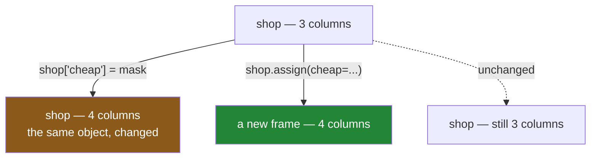

# 3.2 — The new column that was a mask — and `assign`

## One-line answer

A mask is a column, so you can **keep** it as one instead of filtering with it — and `assign` is the
way to add such a column without changing the frame you were given, which is what makes a chain of
steps readable and safe.

---

## The story

Somebody goes down the list ticking everything under a pound, and then — instead of copying out the
ticked lines onto a new sheet — just leaves the ticks where they are.

Now the list has an extra column on it. Every line still there, and beside each one a tick or a
blank.

This turns out to be more useful than the copied-out version, and for a reason that is easy to miss.
The copied-out sheet answers exactly one question: which things are cheap. The marked-up list answers
that one **and** every other question at the same time: how many cheap things are there, what do the
cheap ones come to, is anything in aisle seven cheap, what fraction of the list is cheap.

The information was the same in both. Throwing away the rows that did not match threw away every
question that needed them.

---

## The idea in plain language

[2.2](../02-masks/2.2-selecting-with-a-mask.md) put a mask in `loc` and got back the rows that
matched. **That is not the only thing you can do with a mask.** A mask is a column of booleans, the
same length as the frame, with the same labels
([2.1](../02-masks/2.1-a-comparison-makes-a-column.md)) — which means it can simply *be* a column of
the frame.

There are two ways to add a column, and the difference between them is the subject.

**`frame["new"] = ...`** adds the column to the frame you already have. It is a mutation, exactly like
[3.1](3.1-assigning-through-loc.md)'s assignment: the object changes, nothing is returned.

**`frame.assign(new=...)`** returns a **new frame** with the column added, and leaves the original
alone. Nothing is mutated.

Both give a frame with an extra column. The choice matters for two reasons.

**Chaining.** `assign` returns a frame, so it can sit in the middle of a chain of operations, and each
step can use the columns the previous step made. Bracket assignment returns nothing, so every step
has to be its own statement with its own temporary variable.

**Surprise.** A function that takes a frame and adds a column with brackets has changed its caller's
object. A function that uses `assign` and returns the result has not. Day 26's module made this a
rule — every function returns a new frame
([Day 26, 5.1](../../../day-26-frames-and-copy-on-write/parts/05-the-module/5.1-the-shopping-list-module.md))
— and this is the mechanism behind it.

There is one thing about `assign` that is worth learning early, because it is the whole reason it
works in a chain: the value can be a **function**. `assign(total=lambda d: d["need"] * d["price"])`
receives the frame *as it is at that point in the chain*, which means it can refer to columns that did
not exist before the chain started.

And one thing about adding any column, whichever way you do it: **if the value is a Series, its labels
are matched against the frame's.** That is section 4's subject arriving early
([4.2](../04-alignment/4.2-alignment-is-automatic.md)), and it is the source of the surprise in *When
it breaks*.

---

## Why Setu needs it

- **[3.3](3.3-where-mask-and-the-write-that-was-not.md)** changes values in place rather than adding a
  column, and knowing both is how you choose.
- **[4.2](../04-alignment/4.2-alignment-is-automatic.md)** explains the alignment that makes the
  failure below happen, and why it is a feature.
- **[6.1](../06-the-module/6.1-the-select-module.md)** is built entirely out of `assign` chains, for
  the no-mutation reason above.
- **[Day 26, 3.1](../../../day-26-frames-and-copy-on-write/parts/03-copy-on-write/3.1-every-result-behaves-like-a-copy.md)**
  established that results behave like copies. `assign` is how you take advantage of that rather than
  fighting it.
- **Day 91 onwards**, feature engineering is a chain of derived columns, and every one of them is an
  `assign`. A model's input is built, not mutated into existence.

---

## The mechanism

The mask, kept rather than used:

```python
import pandas as pd

shop = pd.DataFrame(
    {
        "item": pd.Series(["milk", "bread", "eggs", "rice"], dtype="str"),
        "need": [2, 1, 6, 1],
        "price": [1.15, 1.40, 0.32, 2.05],
        "aisle": pd.Series(["07", "03", "07", "11"], dtype="str"),
    }
).set_index("item")

shop["cheap"] = shop["price"] < 1.0
print(shop)
print()
print(shop.dtypes.to_string())
```

**Line by line:**

- `shop["price"] < 1.0` is the same mask expression as section 2. Nothing about it changed; only what
  happens to it did.
- `shop["cheap"] = ...` — bracket assignment, adding a column. **This is the one place plain brackets
  on the left are correct**, because there is only one operation: naming a column of the frame. It is
  not chained assignment, because nothing is selected first
  ([3.1](3.1-assigning-through-loc.md)).
- The new column's dtype is **`bool`**, which is one byte per row rather than the eight an `int64`
  would take.
- The frame now answers questions the filtered version could not. `shop["cheap"].sum()` counts them,
  and `shop.loc[shop["cheap"], "price"].sum()` totals them, both without re-deriving anything.

```text
       need  price aisle  cheap
item
milk      2   1.15    07  False
bread     1   1.40    03  False
eggs      6   0.32    07   True
rice      1   2.05    11  False
need       int64
price    float64
aisle        str
cheap       bool
```

The same idea, without changing the frame:

```python
shop = pd.DataFrame(
    {
        "item": pd.Series(["milk", "bread", "eggs", "rice"], dtype="str"),
        "need": [2, 1, 6, 1],
        "price": [1.15, 1.40, 0.32, 2.05],
        "aisle": pd.Series(["07", "03", "07", "11"], dtype="str"),
    }
).set_index("item")

priced = shop.assign(
    total=lambda frame: frame["need"] * frame["price"],
    cheap=lambda frame: frame["price"] < 1.0,
    worth_it=lambda frame: frame["total"] < 2.00,
)
print(priced)
print()
print("original columns:", list(shop.columns))
```

**Line by line:**

- `assign(total=..., cheap=..., worth_it=...)` — three columns in one call, and **the keyword is the
  column name**. That means a column name has to be a valid Python identifier here; one with a space
  in it needs the dictionary form, `assign(**{"unit price": ...})`.
- `lambda frame: ...` rather than `shop["need"] * shop["price"]` — the lambda receives the frame **as
  it exists at that point in the chain**. Writing `shop[...]` directly would refer to the frame from
  before the chain started, which is a bug the moment this call moves into a longer chain
  ([Day 14, 1.1](../../../day-14-decorators/parts/01-functions-as-values/1.1-a-function-is-a-value.md)).
- `worth_it` uses `frame["total"]`, **a column that did not exist when this call began.** Keyword
  arguments are applied in order, so `total` exists by the time `worth_it` is evaluated. That
  ordering guarantee is what makes `assign` a chaining tool rather than a convenience.
- `priced` is a new frame; `shop` is untouched, which the last line proves.

```text
       need  price aisle  total  cheap  worth_it
item
milk      2   1.15    07   2.30  False     False
bread     1   1.40    03   1.40  False      True
eggs      6   0.32    07   1.92   True      True
rice      1   2.05    11   2.05  False     False

original columns: ['need', 'price', 'aisle']
```

The two ways of getting a column, and what each leaves behind:



The left path has one frame and a history. The right path has two frames and no history, which is
what makes it easy to reason about and easy to test.

---

## When it breaks

**A Series with different labels — the column full of holes:**

```text
$ uv run python -c "
import pandas as pd
shop = pd.DataFrame(
    {'need': [2, 1, 6, 1]},
    index=pd.Index(['milk', 'bread', 'eggs', 'rice'], name='item'),
)
shop['stock'] = pd.Series({'milk': 5, 'tea': 9})
print(shop)
print()
print(shop.dtypes.to_string())
"
```

```text
       need  stock
item
milk      2    5.0
bread     1    NaN
eggs      6    NaN
rice      1    NaN

need     int64
stock    float64
```

**What it means.** Two values went in and one came out. `milk` matched, so it got 5. `tea` is not a
row of this frame, so **it was silently dropped**. `bread`, `eggs` and `rice` are not in the Series,
so they got `NaN`.

Then the dtype: the values were whole numbers and the column is `float64`, because `NaN` is a float
and an `int64` column cannot hold one
([Day 20, 2.3](../../../day-20-arrays-and-dtypes/parts/02-dtypes/2.3-floats-nan-and-precision.md)).

**Nothing raised and nothing warned.** Adding a column from a Series aligns by label, which is
correct and is section 4's subject ([4.2](../04-alignment/4.2-alignment-is-automatic.md)) — but if
you expected the values to go in positionally, you now have one right answer and three holes. The
defence is to check: `set(series.index) - set(frame.index)` should be empty, which is the same check
[2.5](../02-masks/2.5-the-mask-that-matched-nothing.md) used for `isin`.

**`assign` referring to the wrong frame:**

```text
$ uv run python -c "
import pandas as pd
shop = pd.DataFrame(
    {'need': [2, 1], 'price': [1.15, 1.40]},
    index=pd.Index(['milk', 'bread'], name='item'),
)
out = shop.loc[shop['price'] > 1.2].assign(share=shop['price'] / shop['price'].sum())
print(out)
"
```

```text
       need  price    share
item
bread     1    1.4  0.54902
```

**What it means.** No error, and a wrong number. The filter kept only `bread`, but `share` was
computed from `shop` — the **unfiltered** frame — so the denominator is the total of both prices,
`2.55`, giving `0.549` instead of `1.0`. The row that survived then had its share taken from the
aligned result.

Writing `assign(share=lambda f: f["price"] / f["price"].sum())` gives `1.0`, because the lambda sees
the frame **after** the filter. **The lambda form is not a style preference; it is the difference
between referring to the frame in the chain and the frame in the variable.**

**The one that raises helpfully — a name that is not an identifier:**

```text
$ uv run python -c "
import pandas as pd
shop = pd.DataFrame({'need': [2, 1]}, index=pd.Index(['milk', 'bread'], name='item'))
shop.assign(unit price=shop['need'])
" 2>&1 | tail -2
```

```text
    shop.assign(unit price=shop['need'])
                ^^^^^^^^^^
SyntaxError: invalid syntax. Perhaps you forgot a comma?
```

**What it means.** A `SyntaxError` from Python itself, before pandas is involved at all, because
`unit price` is not a legal keyword argument name. The suggestion about a comma is unhelpful and the
cause is simple: **`assign`'s column names are keyword arguments, so they must be valid Python
identifiers.** For anything else — a space, a hyphen, a name starting with a digit — the dictionary
form is required: `shop.assign(**{"unit price": ...})`.

---

## In production

**What a professional writes instead of the teaching version.** One chain, no temporaries, no
mutation:

```python
import pandas as pd


def priced_up(shop: pd.DataFrame, budget: float = 2.00) -> pd.DataFrame:
    """The list with its derived columns, ready to sort or filter. `shop` is not modified."""
    return (
        shop.assign(
            total=lambda frame: frame["need"] * frame["price"],
            cheap=lambda frame: frame["price"] < 1.00,
        )
        .assign(within_budget=lambda frame: frame["total"] <= budget)
        .sort_values("total", ascending=False)
    )
```

**Line by line:**

- The whole body is one expression wrapped in brackets, so each step sits on its own line and the
  chain reads top to bottom. This is the standard shape for pandas in a codebase, and the outer
  brackets are what make it legal to break the lines.
- The **second** `assign` is separate rather than a third keyword in the first, only to show that
  chaining works. In real code these would be one call, since keyword order already guarantees
  `total` exists before `within_budget` uses it.
- `budget` is a closed-over parameter inside the lambda, which is how a chain takes an argument from
  outside itself
  ([Day 10, 2.4](../../../day-10-functions/parts/02-scope/2.4-closures-and-late-binding.md)).
- `sort_values` at the end returns a frame too, so it chains. Sorting is Day 29's subject and it is
  here because a chain that ends in a sort is the most common shape there is.
- **The docstring says `shop` is not modified**, which is a promise this function can keep precisely
  because it never uses bracket assignment.

**What changes at scale.** Two things, and the first is the honest cost of `assign`.

**Every `assign` builds a new frame.** With Copy-on-Write the columns that did not change are shared
rather than copied ([Day 26, 3.2](../../../day-26-frames-and-copy-on-write/parts/03-copy-on-write/3.2-the-copy-that-has-not-happened-yet.md)),
so the cost is the new column plus some bookkeeping, not a full duplicate — which is why chaining is
affordable at all. But a chain of twenty `assign` calls on a wide frame does twenty times that
bookkeeping, and combining them into one call with twenty keywords is measurably cheaper. Readability
usually wins; know that the trade exists.

The second is that a **boolean column is the cheapest kind there is** — one byte per row against
eight for `int64` or a pointer for text. Keeping ten boolean flag columns on a hundred-million-row
frame costs a gigabyte; keeping the same information as ten filtered copies of the frame costs far
more. **Flags scale better than subsets**, which is the production form of this part's story.

**The failure that only appears with real data.** A feature-engineering step used
`df["ratio"] = df["a"] / df["b"]` inside a function, on a frame the caller still held. The caller ran
the function twice — once for training data and once for test — and because the function mutated its
argument, the second call found a `ratio` column already there and overwrote it with a value computed
from a different `b`. **Nothing raised, the training set silently carried the test set's ratios**,
and the model's validation score was implausibly good for a week. Principle 8 calls leakage the
enemy, and mutation-in-place is one of its quietest routes in.

**The review comment a senior engineer leaves.** *"This adds four columns with bracket assignment and
mutates the caller's frame. Use `assign` and return a new one — and use `lambda f:` inside it, not the
outer variable, or the derivations will silently refer to the pre-filter frame when somebody moves
this into a chain."*

**The interview question.** *"What is the difference between `df['x'] = ...` and `df.assign(x=...)`?"*
Bracket assignment mutates the frame in place and returns nothing; `assign` returns a new frame and
leaves the original alone, so it can be chained. Then the two things that show you have used it: the
value should be a **lambda**, because that lambda receives the frame at that point in the chain rather
than the variable from before it, which is the difference between correct and quietly wrong after a
filter; and keyword arguments are applied **in order**, so a later column can be derived from an
earlier one in the same call. If the interviewer pushes on cost, the honest answer is that `assign`
copies more bookkeeping but not the data, and that the readability is almost always worth it.

---

## Check yourself

```bash
uv run python -c "
import pandas as pd
shop = pd.DataFrame(
    {'need': [2, 1, 6, 1], 'price': [1.15, 1.40, 0.32, 2.05]},
    index=pd.Index(['milk', 'bread', 'eggs', 'rice'], name='item'),
)
wrong = shop.loc[shop['price'] > 1.2].assign(share=shop['price'] / shop['price'].sum())
right = shop.loc[shop['price'] > 1.2].assign(share=lambda f: f['price'] / f['price'].sum())
print('outer variable:', wrong['share'].round(3).tolist())
print('lambda        :', right['share'].round(3).tolist())
"
```

Two shares that should each add to 1. Only one does. Say which frame the other one divided by.

**Answer out loud, without scrolling up:**

> Give two reasons to prefer `assign` over bracket assignment. Then say what happens when the value
> you assign is a Series whose index does not match the frame's, and what dtype the new column ends
> up with.

---

**Next:** [3.3 — `where`, `mask`, and the write that was not](3.3-where-mask-and-the-write-that-was-not.md).
