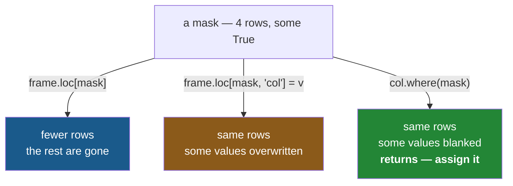

# 3.3 — `where`, `mask`, and the write that was not

## One-line answer

`where` keeps the values where a condition is **true** and blanks the rest, `mask` does the opposite,
and both **return** a new column rather than changing anything — so calling one without assigning the
result is a line that runs, costs time, and does nothing at all.

---

## The story

Somebody wants the list with the expensive prices hidden — not the expensive *lines* removed, just
the prices blanked out, so the shape of the list is unchanged and you can still see what is on it.

That is a different request from anything so far. Filtering would have thrown the rows away
([2.2](../02-masks/2.2-selecting-with-a-mask.md)). Assigning through `loc` would have overwritten
them with something ([3.1](3.1-assigning-through-loc.md)). This is neither: same rows, same order,
some values replaced with a blank.

They do it, look at the list, and the prices are all still there.

They had written down what they wanted very precisely, and then not said what to do with the answer.
The instruction was carried out perfectly and the result went in the bin.

---

## The idea in plain language

Two methods change values without changing which rows exist.

**`where(condition)`** keeps each value where the condition is `True`, and replaces it with `NaN`
where the condition is `False`.

**`mask(condition)`** is the exact opposite: it blanks where the condition is `True`.

The naming catches everybody, so it is worth a sentence to fix it. `where` means *keep it where this
holds* — it is the condition for **keeping**. `mask` means *cover it up where this holds* — the
condition for **hiding**. They are two names for one operation with the condition flipped, and
`frame.where(c)` is always the same as `frame.mask(~c)`.

Both take an `other=` argument saying what to put in the blanked positions. It defaults to `NaN`, and
supplying something else — `0`, an empty string, another column — is usually what you actually want.

Now the thing this part is named after. **`where` and `mask` return a new object.** They do not modify
anything. So:

```
shop["price"].where(shop["price"] > 1)          # computes, returns, discards
shop["price"] = shop["price"].where(...)        # computes, returns, keeps
```

The first line is legal Python, runs without error, produces the right answer, and throws it away.
Nothing warns you, because a function that returns a value and has its value ignored is an ordinary
thing to write.

This used to be less dangerous, because most pandas methods took an `inplace=True` argument that
modified the object instead of returning one. **That argument is being removed across pandas**, and
its removal is deliberate: `inplace=True` never actually saved memory, it broke method chaining, and
it made it impossible to tell by looking whether a line changed something. The replacement is exactly
what [3.2](3.2-the-new-column-that-was-a-mask.md) recommended: **take the return value.**

One more thing, and it is the reason `where` is not simply a nicer `loc` assignment. Because the
blanks are `NaN`, and `NaN` is a float, **`where` on an integer column gives you a float column**.
That is not a bug and it is not avoidable — an `int64` column has no way to represent a blank
([Day 20, 2.3](../../../day-20-arrays-and-dtypes/parts/02-dtypes/2.3-floats-nan-and-precision.md)).

---

## Why Setu needs it

- **[3.1](3.1-assigning-through-loc.md)** overwrites values through a mask, which is the alternative
  when the replacement is a real value rather than a blank.
- **[2.5](../02-masks/2.5-the-mask-that-matched-nothing.md)** explained what `NaN` does to a
  reduction. `where` is a machine for producing `NaN`, so the two go together.
- **[4.3](../04-alignment/4.3-the-nan-that-changed-the-dtype.md)** is the same dtype promotion from
  the other direction, caused by alignment rather than by blanking.
- **Day 23** met `np.where`, which is the NumPy function of the same name and **not** the same thing —
  it takes three arguments and chooses between two values
  ([Day 23, 1.4](../../../day-23-ufuncs-and-statistics/parts/01-ufuncs/1.4-np-where-the-vectorised-if.md)).
  Knowing they differ saves an afternoon.
- **Day 30** censors outliers before fitting, and censoring — replacing rather than dropping — is
  exactly `where` with an `other=`.

---

## The mechanism

`where` and `mask`, side by side:

```python
import pandas as pd

shop = pd.DataFrame(
    {
        "item": pd.Series(["milk", "bread", "eggs", "rice"], dtype="str"),
        "need": [2, 1, 6, 1],
        "price": [1.15, 1.40, 0.32, 2.05],
        "aisle": pd.Series(["07", "03", "07", "11"], dtype="str"),
    }
).set_index("item")

dear = shop["price"] > 1
print("where(dear) — keeps the dear ones:")
print(shop["price"].where(dear).tolist())
print()
print("mask(dear)  — blanks the dear ones:")
print(shop["price"].mask(dear).tolist())
print()
print("where(c) == mask(~c):", shop["price"].where(dear).equals(shop["price"].mask(~dear)))
```

**Line by line:**

- `dear` is the mask from section 2, named once and used three times. Everything about how it was
  built is unchanged ([2.1](../02-masks/2.1-a-comparison-makes-a-column.md)).
- `.where(dear)` — **keeps** the values where `dear` is `True`. Eggs, the only cheap item, becomes
  `nan`.
- `.mask(dear)` — **blanks** the values where `dear` is `True`. The other three become `nan` and only
  eggs survives.
- `.tolist()` to keep the output compact; the real results are Series with the frame's labels.
- The last line proves the identity: **`where` and `mask` are one operation with the condition
  flipped.** You only ever need to remember one of them, and the `~` does the rest
  ([2.3](../02-masks/2.3-and-or-not-and-the-brackets.md)).
- Note that **all four rows are present in both results.** Nothing was filtered; four values in, four
  values out ([2.2](../02-masks/2.2-selecting-with-a-mask.md) is what filtering looks like).

```text
where(dear) — keeps the dear ones:
[1.15, 1.4, nan, 2.05]

mask(dear)  — blanks the dear ones:
[nan, nan, 0.32, nan]

where(c) == mask(~c): True
```

The three ways of acting on a mask, which is the map for this whole section:



Filter, overwrite, blank. Three different answers to "act on the rows that matched", and choosing
between them is the actual skill.

`other=`, which is what you usually want:

```python
print("blanked with 0.00:")
print(shop["price"].where(dear, other=0.0).tolist())
print()
print("blanked with the mean:")
print(shop["price"].where(dear, other=shop["price"].mean()).round(2).tolist())
print()
print("dtype without other:", shop["need"].where(shop["need"] > 1).dtype)
print("dtype with other=0 :", shop["need"].where(shop["need"] > 1, other=0).dtype)
```

**Line by line:**

- `other=0.0` — the replacement, instead of `NaN`. **This is the form to reach for by default**,
  because a `NaN` you did not think about is
  [2.5](../02-masks/2.5-the-mask-that-matched-nothing.md)'s problem waiting to happen.
- `other=shop["price"].mean()` — the replacement can be computed. This is censoring, and it is the
  shape Day 30's outlier handling takes.
- `.round(2)` only so the printed mean is readable.
- The last two lines are the dtype finding. **`where` with no `other` promotes `int64` to `float64`**,
  because the blank has to be a `NaN` and integers cannot hold one. Supplying an integer `other=`
  keeps the column `int64`, because no blank is ever created.

```text
blanked with 0.00:
[1.15, 1.4, 0.0, 2.05]

blanked with the mean:
[1.15, 1.4, 1.23, 2.05]

dtype without other: float64
dtype with other=0 : int64
```

---

## When it breaks

**The write that was not a write:**

```text
$ uv run python -c "
import pandas as pd
shop = pd.DataFrame(
    {'price': [1.15, 1.40, 0.32]},
    index=pd.Index(['milk', 'bread', 'eggs'], name='item'),
)
shop['price'].where(shop['price'] > 1, other=0.0)
print('after the call:', shop['price'].tolist())
"
```

```text
after the call: [1.15, 1.4, 0.32]
```

**What it means.** Nothing changed. **No error, no warning, no output at all** — the method computed a
new Series, returned it, and Python discarded it because nothing was on the left of an `=`.

This is the most common mistake with `where`, and it is invisible in review because the line looks
like it does something. The three fixes, in order of preference:
`shop["price"] = shop["price"].where(...)`, or `shop = shop.assign(price=lambda f: f["price"].where(...))`
([3.2](3.2-the-new-column-that-was-a-mask.md)), or `shop.loc[~dear, "price"] = 0.0` if overwriting is
what you meant ([3.1](3.1-assigning-through-loc.md)).

**`where` and `np.where` are not the same function:**

```text
$ uv run python -c "
import numpy as np
import pandas as pd
shop = pd.DataFrame(
    {'price': [1.15, 0.32]},
    index=pd.Index(['milk', 'eggs'], name='item'),
)
print('pandas where:', shop['price'].where(shop['price'] > 1, other=0.0).tolist())
print('numpy where :', np.where(shop['price'] > 1, shop['price'], 0.0))
shop['price'].where(shop['price'] > 1, 0.0, 'extra')
" 2>&1 | tail -3
```

```text
pandas where: [1.15, 0.0]
numpy where : [1.15 0.  ]
TypeError: NDFrame.where() takes from 2 to 3 positional arguments but 4 were given
```

**What it means.** The same answer from two functions with the same name and different signatures.
`np.where(condition, if_true, if_false)` takes **three** arguments and returns a plain NumPy array
with **no index** ([Day 23, 1.4](../../../day-23-ufuncs-and-statistics/parts/01-ufuncs/1.4-np-where-the-vectorised-if.md)).
`Series.where(condition, other)` takes **two**, keeps its labels, and — as the `TypeError` shows —
refuses a third. (The error says `NDFrame`, which is the internal base class Series and DataFrame
share; it is not a typo and not a different method.)

The practical difference is the index. `np.where` is fine when you assign the result straight back to
a column of the same frame, and it silently loses the alignment protection everywhere else
([4.5](../04-alignment/4.5-turning-alignment-off.md)).

**The one that surprises people — `where` on a text column:**

```text
$ uv run python -c "
import pandas as pd
shop = pd.DataFrame(
    {'aisle': ['07', '03', '07']},
    index=pd.Index(['milk', 'bread', 'eggs'], name='item'),
).astype({'aisle': 'str'})
out = shop['aisle'].where(shop['aisle'] == '07')
print(out.tolist())
print('dtype:', out.dtype)
print('is the blank NaN or NA?', repr(out.iloc[1]))
"
```

```text
['07', nan, '07']
dtype: str
is the blank NaN or NA? nan
```

**What it means.** The dtype stayed `str` this time — a `str` column *can* hold a missing value, so
no promotion was needed. But look at what the blank actually is: **`nan`, a float, sitting inside a
`str` column.** That is pandas 3.0's default missing value for the `str` dtype, and Day 26 spent a
part on why it is `nan` here and `pd.NA` elsewhere
([Day 26, 2.5](../../../day-26-frames-and-copy-on-write/parts/02-the-str-dtype/2.5-the-missing-value-in-a-text-column.md)).

The consequence is practical: `out == nan` is `False` everywhere, so testing for the blank with `==`
finds nothing. **`.isna()` is the only test that works**, on any column, whatever the blank turned
out to be ([2.1](../02-masks/2.1-a-comparison-makes-a-column.md)).

---

## In production

**What a professional writes instead of the teaching version.** Censoring is a named step in a chain,
with the replacement stated and the dtype protected:

```python
import pandas as pd


def censor_outliers(shop: pd.DataFrame, ceiling: float) -> pd.DataFrame:
    """Prices above `ceiling` replaced by `ceiling`. Rows are kept; nothing is dropped."""
    if ceiling <= 0:
        raise ValueError(f"ceiling must be positive, got {ceiling}")
    censored = shop.assign(
        price=lambda frame: frame["price"].where(frame["price"] <= ceiling, other=ceiling),
        was_censored=lambda frame: frame["price"] > ceiling,
    )
    return censored
```

**Line by line:**

- `assign` rather than bracket assignment, so the caller's frame is untouched
  ([3.2](3.2-the-new-column-that-was-a-mask.md)) — and the return value cannot be forgotten, because
  the whole function is a `return`.
- `where(frame["price"] <= ceiling, other=ceiling)` — the condition is the **keep** condition, which
  is the one `where` wants. Writing it as `mask(frame["price"] > ceiling, ceiling)` is identical and
  reads better to some people; pick one and be consistent within a codebase.
- `other=ceiling` and never the default `NaN`, because this is censoring rather than deleting: the
  information "this was at least this much" is preserved, and no `NaN` is introduced for
  [2.5](../02-masks/2.5-the-mask-that-matched-nothing.md) to trip over.
- **`was_censored` is the important line.** A silent replacement is indistinguishable from real data
  afterwards, and a flag column costs one byte per row
  ([3.2](3.2-the-new-column-that-was-a-mask.md)) and makes the operation auditable.
- **There is a bug in this function, and it is instructive.** `was_censored` is evaluated *after*
  `price` has already been censored, so `frame["price"] > ceiling` is `False` on every row. Keyword
  arguments are applied in order ([3.2](3.2-the-new-column-that-was-a-mask.md)) and here that
  ordering works against you. The fix is to compute the flag **first**, from the original values.
  Swap the two keywords and the function is correct — and the fact that it took a paragraph to notice
  is exactly why the flag matters.

**What changes at scale.** Three things.

`where` allocates a **new column of the same length**, so it is not a saving over a `loc` assignment
— it is a different operation with a different result. Chaining several `where` calls over a large
frame allocates once each, and combining the conditions first is cheaper.

The dtype promotion is the expensive surprise. A `where` with no `other=` on an `int64` column of a
hundred million rows produces a `float64` column of the same length — **the same memory, but now
carrying `NaN` through every downstream reduction**, where `sum` and `mean` behave differently
([2.5](../02-masks/2.5-the-mask-that-matched-nothing.md)). Passing `other=` keeps the dtype and is
almost always what was meant.

And **`inplace=True` is going away**, across the whole library. Code that used it must take the return
value instead. This is worth knowing not to argue about but because a large fraction of the pandas
material written before 2026 uses it, and following that advice now produces either a deprecation
warning or, in newer versions, a `TypeError` — while the version that ignores the return value
produces neither.

**The failure that only appears with real data.** A cleaning step called
`df["amount"].where(df["amount"] > 0)` on its own line, with no assignment, in a fifty-line function.
It had no effect for two years, and nobody noticed, because the negative amounts it was supposed to
remove were rare enough that the totals still looked plausible. It was found only when somebody added
a test for the negative case. **A line with no effect is invisible to review and invisible to
monitoring**, and the only thing that catches it is a test that asserts on the result.

**The review comment a senior engineer leaves.** *"Line 34 calls `.where(...)` and drops the result on
the floor — pandas methods return, they do not modify. Assign it. Also pass `other=`; the default
`NaN` will turn this int column into a float and change what `sum` and `mean` do downstream."*

**The interview question.** *"What is the difference between `where` and `mask` in pandas?"* They are
the same operation with the condition inverted: `where` keeps values where the condition is true and
blanks the rest, `mask` blanks where it is true, and `df.where(c)` equals `df.mask(~c)`. Then the
three things that show you have used them: **they return rather than modify**, so the result must be
assigned; the blank defaults to `NaN`, which **promotes an integer column to float**, so pass
`other=`; and `Series.where` is not `np.where` — the NumPy one takes three arguments, chooses between
two values, and returns an array with no index.

---

## Check yourself

```bash
uv run python -c "
import pandas as pd
shop = pd.DataFrame(
    {'need': [2, 1, 6, 1], 'price': [1.15, 1.40, 0.32, 2.05]},
    index=pd.Index(['milk', 'bread', 'eggs', 'rice'], name='item'),
)
shop['price'].where(shop['price'] > 1, other=0.0)
print('after the bare call :', shop['price'].tolist())
shop['price'] = shop['price'].where(shop['price'] > 1, other=0.0)
print('after the assignment:', shop['price'].tolist())
print('int dtype, no other :', shop['need'].where(shop['need'] > 1).dtype)
print('int dtype, other=0  :', shop['need'].where(shop['need'] > 1, other=0).dtype)
"
```

The first two lines run the same computation and only one of them keeps it. Say what happened to the
result of the other.

**Answer out loud, without scrolling up:**

> Say which of `where` and `mask` keeps the values where the condition holds, and give the identity
> that relates them. Then say what `where` does to an `int64` column when you do not pass `other=`,
> and why.

---

**Next:** [4.1 — Two lists, different items](../04-alignment/4.1-two-lists-different-items.md).
