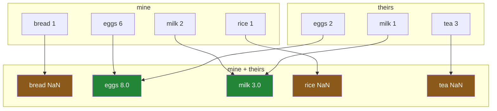

# 4.1 — Two lists, different items — and the NaNs are the lesson

## One-line answer

Add two Series with different labels and you get **more rows than either of them had**, most of them
blank — because pandas adds by label, and a label that appears in only one list has nothing to be
added to.

---

## The story

Two people in the flat write shopping lists without telling each other.

One list says: milk 2, bread 1, eggs 6, rice 1.

The other says: milk 1, eggs 2, tea 3.

Somebody puts them together and starts adding up. Milk is easy — two plus one is three. Eggs, six
plus two, eight.

Then bread. There is one bread on the first list and bread is not on the second list at all. So the
answer is... one? Or is it that the second person did not need bread, meaning one is right? Or did
they simply not think about bread, meaning nobody knows?

Those are different questions with different answers, and the two lists on the table cannot tell you
which. A missing line does not say whether it means zero or means unknown.

That ambiguity is the whole subject of this section, and it is why the sensible thing to do — the
thing pandas does — is to refuse to guess.

---

## The idea in plain language

When two Series are combined — added, subtracted, compared, anything — pandas does **not** put the
first value with the first value. It matches them by **label**.

That is the same rule [2.2](../02-masks/2.2-selecting-with-a-mask.md) used for masks, and
[1.1](../01-label-and-position/1.1-two-ways-to-say-that-row.md) established it for selection. Here it
shows its full consequences, because now both sides have labels and they might not be the same
labels.

The result's index is the **union** of the two — every label that appears in either. So:

- A label in **both** gets a real answer: `milk` is `2 + 1 = 3`.
- A label in **only one** has nothing to pair with, so the answer is `NaN` — pandas' marker for
  "no value here" ([Day 26, 2.5](../../../day-26-frames-and-copy-on-write/parts/02-the-str-dtype/2.5-the-missing-value-in-a-text-column.md)).

`NaN` is the right answer and it is worth being clear about why. The alternative would be to treat the
missing side as zero, and that would be pandas deciding that "not on the list" means "needs none of
it". Sometimes that is true. Often it is not — the second person might simply not have thought about
bread. **pandas does not know which, so it says it does not know**, and gives you `NaN`.

When you *do* know, you say so. Every arithmetic operator has a method form that takes a
`fill_value=`: `a.add(b, fill_value=0)` means "treat a missing side as zero", and that is you making
the decision the operator refused to make.

The one consequence that surprises everybody is what happens to the dtype. Two `int64` Series added
together produce a `float64` result, because `NaN` is a float and an integer column cannot hold one.
That is [4.3](4.3-the-nan-that-changed-the-dtype.md), and it is the reason this behaviour shows up in
places that have nothing to do with addition.

---

## Why Setu needs it

- **[4.2](4.2-alignment-is-automatic.md)** shows that this happens on *every* operation between two
  labelled objects, not just addition, and that it cannot be switched off by accident.
- **[4.3](4.3-the-nan-that-changed-the-dtype.md)** is what the `NaN`s do to your dtypes, which is how
  this reaches code that never adds two Series.
- **[4.4](4.4-the-index-is-the-join-key.md)** is the production framing: the index is a join key, and
  every rule about join keys applies to it.
- **[5.1](../05-reindexing/5.1-reindex-say-the-index-you-want.md)** is how you take control — stating
  the index you want rather than accepting the union.
- **Day 32** is `merge` and `join`, which are this idea made explicit and given options. Everything
  there is easier if alignment is already familiar.

---

## The mechanism

The plan's named example, exactly:

```python
import pandas as pd

mine = pd.Series([2, 1, 6, 1], index=["milk", "bread", "eggs", "rice"], name="need")
theirs = pd.Series([1, 2, 3], index=["milk", "eggs", "tea"], name="need")

print("mine:")
print(mine)
print()
print("theirs:")
print(theirs)
```

**Line by line:**

- `pd.Series([...], index=[...])` — values and labels given together. The `index=` argument is what
  makes this a labelled list rather than an array
  ([Day 26, 1.1](../../../day-26-frames-and-copy-on-write/parts/01-the-two-objects/1.1-a-column-with-labels.md)).
- `name="need"` on both — the Series' own name, which survives into the result and is why the printed
  output says `Name: need` at the bottom.
- **The two indexes overlap but do not match.** `milk` and `eggs` are in both. `bread` and `rice` are
  only in the first; `tea` is only in the second. Four labels and three labels, five distinct between
  them.
- The lengths differ too — four against three — which under NumPy's rules would make them
  unaddable ([Day 22, 1.2](../../../day-22-broadcasting-and-shape/parts/01-broadcasting/1.2-the-rule-in-three-lines.md)).

```text
mine:
milk     2
bread    1
eggs     6
rice     1
Name: need, dtype: int64

theirs:
milk    1
eggs    2
tea     3
Name: need, dtype: int64
```

Now add them:

```python
both = mine + theirs
print(both)
print()
print("dtype:", both.dtype)
print("length in :", len(mine), "and", len(theirs))
print("length out:", len(both))
```

**Line by line:**

- `mine + theirs` — an ordinary `+`. **Nothing here says "align"**; alignment is what `+` means
  between two labelled objects.
- The result is sorted alphabetically — `bread, eggs, milk, rice, tea` — because pandas builds the
  union of the two indexes and, when neither input's order can be preserved, sorts it.
- `len` printed on all three, because **the output is longer than either input**, which is the single
  most surprising thing about this operation.

```text
bread    NaN
eggs     8.0
milk     3.0
rice     NaN
tea      NaN
Name: need, dtype: float64

dtype: float64
length in : 4 and 3
length out: 5
```

**Read that carefully, because there are four separate findings in seven lines.**

**Two rows have real answers.** `eggs` is 8 and `milk` is 3. Those are the labels in both lists, and
the arithmetic is what you expected.

**Three rows are `NaN`.** `bread` and `rice` were only on the first list; `tea` only on the second.
Each had nothing to pair with.

**The result is longer than either input.** Four plus three gave five rows — the union of the labels,
not the length of either side.

**The dtype changed.** Two `int64` Series produced a `float64` result, because `NaN` is a float.
Every value in the result is now a float, including `8.0` and `3.0` which are perfectly good whole
numbers ([4.3](4.3-the-nan-that-changed-the-dtype.md)).

What actually happened:



**Two arrows into a row means a real answer; one arrow means `NaN`.** That is the entire rule.

When you know what the blank means, say so:

```python
print(mine.add(theirs, fill_value=0))
```

**Line by line:**

- `.add(...)` — the **method** form of `+`. It exists precisely so there is somewhere to put the extra
  argument; `+` has no room for one. Every operator has one: `sub`, `mul`, `div`, `pow`.
- `fill_value=0` — **before the addition**, a label missing from one side is treated as 0 on that
  side. So `bread` becomes `1 + 0 = 1` rather than `NaN`.
- This is **you making the decision**, not pandas guessing. It is right when a missing line genuinely
  means "none needed" and wrong when it means "nobody has said" — and only you know which.
- The dtype is still `float64`. `fill_value` removed the `NaN`s from the result but the promotion had
  already happened, and there is no `fill_value` that avoids it
  ([4.3](4.3-the-nan-that-changed-the-dtype.md)).

```text
bread    1.0
eggs     8.0
milk     3.0
rice     1.0
tea      3.0
Name: need, dtype: float64
```

Every row has a number now, and `tea` is 3 — the second person's tea, carried through as though the
first person had asked for none. **That is a claim about the world**, and `fill_value=0` is where you
made it.

---

## When it breaks

**Stripping the labels to "fix" it:**

```text
$ uv run python -c "
import pandas as pd
mine = pd.Series([2, 1, 6, 1], index=['milk', 'bread', 'eggs', 'rice'])
theirs = pd.Series([1, 2, 3], index=['milk', 'eggs', 'tea'])
print(mine.to_numpy() + theirs.to_numpy())
" 2>&1 | tail -1
```

```text
ValueError: operands could not be broadcast together with shapes (4,) (3,)
```

**What it means.** Somebody sees the `NaN`s, decides the labels are the problem, and calls
`.to_numpy()` on both to get "plain arrays". Now there are no labels, so NumPy matches by position,
and the lengths do not agree — so it raises
([Day 22, 1.6](../../../day-22-broadcasting-and-shape/parts/01-broadcasting/1.6-reading-the-broadcast-error.md)).

**This error is the lucky outcome.** [4.5](4.5-turning-alignment-off.md) shows what happens when the
two lengths *do* match, which is the same mistake with no error at all.

**The wrong `fill_value`:**

```text
$ uv run python -c "
import pandas as pd
mine = pd.Series([2, 1], index=['milk', 'bread'], name='need')
theirs = pd.Series([1, 3], index=['milk', 'tea'], name='need')
print('plain +      :', mine.add(theirs).to_dict())
print('fill_value=0 :', mine.add(theirs, fill_value=0).to_dict())
"
```

```text
plain +      : {'bread': nan, 'milk': 3.0, 'tea': nan}
fill_value=0 : {'bread': 1.0, 'milk': 3.0, 'tea': 3.0}
```

**What it means.** No error in either case, and two different answers to the same question. The second
says the flat needs 3 tea — a number that appears on nobody's list as a total, and which is only
correct if you believe the first person's silence about tea meant "none".

**`fill_value=0` is not a fix for `NaN`; it is an assertion about what a missing row means.** Applied
without thinking, it silently converts "we do not know" into "it is zero", and a total computed from
it will be confidently wrong. The `NaN` version at least propagates: `mine.add(theirs).sum()` is
`nan`, which is a signal.

**The one that looks like a bug and is not — subtracting a Series from itself:**

```text
$ uv run python -c "
import pandas as pd
a = pd.Series([1, 2, 3], index=['x', 'y', 'z'])
b = pd.Series([1, 2, 3], index=['x', 'y', 'w'])
print('a - a:', (a - a).to_dict())
print('a - b:', (a - b).to_dict())
"
```

```text
a - a: {'x': 0, 'y': 0, 'z': 0}
a - b: {'w': nan, 'x': 0.0, 'y': 0.0, 'z': nan}
```

**What it means.** `a - a` stayed `int64`, because the indexes were identical so no `NaN` was needed.
`a - b` — the same values, one label different — became `float64` with two blanks.

**The dtype of the result depends on the labels, not on the values.** That is worth holding on to,
because it means a function can return `int64` in testing and `float64` in production purely because
the production data has one extra category in it.

---

## In production

**What a professional writes instead of the teaching version.** The decision about missing labels is
made explicitly, once, and the result is checked:

```python
import pandas as pd


def combine_lists(mine: pd.Series, theirs: pd.Series) -> pd.Series:
    """Add two shopping lists, treating an absent item as zero. Returns whole numbers."""
    combined = mine.add(theirs, fill_value=0)
    if combined.isna().any():
        blank = combined[combined.isna()].index.tolist()
        raise ValueError(f"still blank after filling: {blank}")
    return combined.astype("int64")
```

**Line by line:**

- The docstring states the decision — **"treating an absent item as zero"** — because that is a claim
  about the data, not an implementation detail, and the caller needs to agree with it.
- `fill_value=0` handles a label missing from *one* side. It does **not** handle a `NaN` that was
  already in one of the inputs, which is why the check below is not redundant.
- `combined.isna().any()` — the check. `fill_value` is often assumed to guarantee no blanks, and it
  does not: a real `NaN` in either input survives it
  ([2.1](../02-masks/2.1-a-comparison-makes-a-column.md)).
- The error **names the offending labels** rather than saying "there were blanks", so the caller can
  go and look at them.
- `.astype("int64")` at the end — the counts are whole numbers and should be typed as such. The
  promotion to float was unavoidable during the addition
  ([4.3](4.3-the-nan-that-changed-the-dtype.md)); converting back is a deliberate step that would
  *raise* if any blank had survived, which is a second layer of the same protection.

**What changes at scale.** Two things.

**Alignment costs something.** Combining two Series requires building the union of their indexes,
which for large indexes means hashing every label on both sides. If the two indexes are identical
objects, pandas detects that and skips the work entirely — so a pipeline that keeps its frames on one
shared index is measurably faster than one that rebuilds indexes between steps. That is not a reason
to strip labels; it is a reason to be consistent about them.

**The union can be enormous.** Two Series of a million labels each, overlapping in only a hundred
thousand, produce a result of one point nine million rows, almost all `NaN`. Nothing warns you. The
memory doubles and the meaningful content is five per cent of it. **A result longer than both inputs
is a symptom**, and the production defence is to assert on the length: if you expect an
inner-join-like answer, check that the result is no longer than the shorter input, and if it is,
you have a key mismatch rather than an arithmetic result
([4.4](4.4-the-index-is-the-join-key.md)).

**The failure that only appears with real data.** Two monthly frames were added to get a
year-to-date total, indexed by product code. It worked for a year because the same products appeared
every month. Then a product was discontinued and a new one launched, so each month's index had one
label the other did not — and the total for **both** products came out `NaN` while every other
product was fine. The report showed blanks in two rows out of four hundred, which looked like a data
quality problem in the source and took a week to trace back to the addition. **Alignment failures are
localised**, which is what makes them hard: 398 correct rows are very persuasive.

**The review comment a senior engineer leaves.** *"`a + b` on two Series with different indexes — this
will produce the union with `NaN` in the non-overlapping rows and silently promote to float. Decide
what a missing label means and say so with `add(..., fill_value=...)`, or reindex both to a known
index first. And assert the output length; if it is longer than both inputs we have a key problem."*

**The interview question.** *"What happens when you add two pandas Series with different indexes?"*
They are aligned by label, so the result's index is the **union** of the two, values present in both
are added, and labels present in only one become `NaN`. Then the three things that show you have been
caught: the result can be **longer than either input**, the dtype is promoted from `int64` to
`float64` because `NaN` is a float, and `fill_value=` in the method form is how you say what a missing
label means — which is a decision about the data rather than a fix for an inconvenience.

---

## Check yourself

```bash
uv run python -c "
import pandas as pd
mine = pd.Series([2, 1, 6, 1], index=['milk', 'bread', 'eggs', 'rice'], name='need')
theirs = pd.Series([1, 2, 3], index=['milk', 'eggs', 'tea'], name='need')
print('plain +    :', (mine + theirs).to_dict())
print('fill_value :', mine.add(theirs, fill_value=0).to_dict())
print('lengths    :', len(mine), len(theirs), len(mine + theirs))
print('dtypes     :', mine.dtype, theirs.dtype, (mine + theirs).dtype)
"
```

Four rows plus three rows gives five. Say where the five came from, and say which of the two answers
in the first two lines you would put in a report — and what you would have to believe to justify it.

**Answer out loud, without scrolling up:**

> Two Series are added. Say what decides the result's index, and what decides its length. Then say why
> pandas puts `NaN` where a label appears on only one side rather than treating the missing side as
> zero — and what you write when you know it should be zero.

---

**Next:** [4.2 — Alignment is automatic](4.2-alignment-is-automatic.md).
