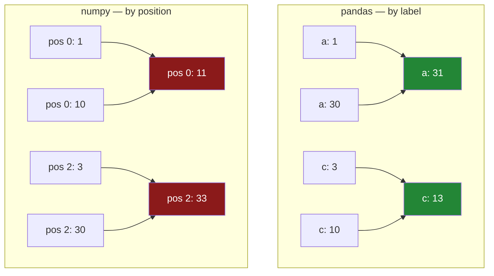

# 4.2 — Alignment is automatic — and comparison is the exception

## One-line answer

Every operation between two labelled objects aligns by label first — including when the lengths match
and the labels are merely in a different order — with one loud exception: the comparison **operators**
refuse to align at all and raise instead.

---

## The story

Two people write out the same three items in different orders. One writes them alphabetically; the
other writes them in the order they appear in the shop.

Both lists have three lines. Both have the same three items on them. Somebody adds them up by holding
the sheets side by side and reading straight across, first line to first line.

Every total is wrong, and every total looks fine. There are three items and three numbers and none of
them is obviously absurd — the milk figure is just the milk plus the rice.

Nobody catches it, because there is nothing to catch. Two lists of three, added, giving three
answers. The only thing that went wrong is that the second line of one sheet was not about the same
thing as the second line of the other, and nothing on either sheet says so.

---

## The idea in plain language

[4.1](4.1-two-lists-different-items.md) showed alignment when the labels **differed**, and the `NaN`s
made it obvious something had happened.

The more important case is when the labels are the **same set** but in a **different order**. Here
the lengths match, no `NaN` appears, and the result looks completely ordinary — so this is where the
difference between aligning and not aligning actually decides whether your numbers are right.

pandas aligns. Always. `a + b` pairs `a`'s `milk` with `b`'s `milk`, wherever each sits. NumPy would
pair the first with the first ([Day 21, 1.1](../../../day-21-indexing-and-views/parts/01-one-element/1.1-index-and-the-negative-index.md)),
and on reordered data those are different answers with no error to tell them apart.

**This is not something you switch on.** It is what the operators mean between labelled objects.
Arithmetic, comparison methods, `where`, mask indexing, assigning a Series into a column — all of
them align first ([3.2](../03-writing/3.2-the-new-column-that-was-a-mask.md) showed the last one).

For DataFrames it happens on **both axes at once**: the row index and the column names are each
unioned, so two frames combined give a result with every row label and every column name from either.
That is spectacular the first time you see it, and the mechanism below has the demonstration.

Now the exception, which is genuinely surprising and worth knowing before you meet it.

**The comparison operators — `>`, `<`, `>=`, `<=`, `==`, `!=` — do not align. They raise.** If the two
objects are not identically labelled in identical order, you get
`ValueError: Can only compare identically-labeled Series objects`.

The reason is that a silently-aligned comparison would be more dangerous than a helpful one. A
comparison feeds an `if`, a filter, or a test, and quietly producing `NaN` for the non-overlapping
labels would give a mask that is neither `True` nor `False` in places — which then behaves as `False`
in a filter ([2.1](../02-masks/2.1-a-comparison-makes-a-column.md)) and drops rows for a reason
nobody wrote down. So pandas refuses.

And the escape hatch: **the method forms do align.** `a.gt(b)` aligns where `a > b` raises. That
asymmetry is not an accident — it is the same design as `add` against `+`
([4.1](4.1-two-lists-different-items.md)): the operator does the safe thing, and the method is where
you say you meant something else.

---

## Why Setu needs it

- **[4.1](4.1-two-lists-different-items.md)** is this rule with the labels differing. This part is the
  same rule with the labels merely reordered, which is the case that produces no visible symptom.
- **[4.3](4.3-the-nan-that-changed-the-dtype.md)** is the dtype consequence of the `NaN`s alignment
  introduces.
- **[4.5](4.5-turning-alignment-off.md)** is how you deliberately get NumPy's positional behaviour,
  and why it is nearly always the wrong choice.
- **[Day 21, 3.2](../../../day-21-indexing-and-views/parts/03-boolean-masks/3.2-indexing-with-a-mask.md)**
  is the positional world this replaces. The contrast is the whole point of this section.
- **Day 32** is `merge`, which is alignment with the join type spelled out. Everything here is the
  implicit version of that.

---

## The mechanism

Same length, same labels, different order:

```python
import pandas as pd

alphabetical = pd.Series([1, 2, 3], index=["a", "b", "c"])
shop_order = pd.Series([10, 20, 30], index=["c", "b", "a"])

print("alphabetical:", alphabetical.to_dict())
print("shop order  :", shop_order.to_dict())
print()
print("pandas, by label   :", (alphabetical + shop_order).to_dict())
print("numpy, by position :", (alphabetical.to_numpy() + shop_order.to_numpy()).tolist())
```

**Line by line:**

- Both Series have **three** values and the **same three labels**. Nothing is missing, so
  [4.1](4.1-two-lists-different-items.md)'s `NaN`s cannot appear and there is no visible signal that
  anything unusual is happening.
- `alphabetical + shop_order` — pandas pairs `a` with `a`, so `1 + 30 = 31`.
- `.to_numpy()` on both strips the labels
  ([4.5](4.5-turning-alignment-off.md)), so NumPy pairs first with first: `1 + 10 = 11`.
- **Both lines run. Neither raises. They disagree completely.**

```text
alphabetical: {'a': 1, 'b': 2, 'c': 3}
shop order  : {'c': 10, 'b': 20, 'a': 30}

pandas, by label   : {'a': 31, 'b': 22, 'c': 13}
numpy, by position : [11, 22, 33]
```

**`{31, 22, 13}` against `[11, 22, 33]`.** The middle value agrees by coincidence — `b` happens to sit
in the middle of both — and the other two are completely different numbers. There is no error, no
warning and no `NaN` anywhere to hint that a choice was made.

**This is the single strongest argument for keeping your labels.** The pandas answer is right, the
NumPy answer is wrong, and the only thing that distinguishes them is that one of them knew what the
rows were called.

Two frames, aligned on both axes at once:

```python
left = pd.DataFrame({"need": [2, 1], "price": [1.15, 1.40]}, index=["milk", "bread"])
right = pd.DataFrame({"price": [1.0, 2.0], "stock": [5, 9]}, index=["milk", "tea"])
print(left)
print()
print(right)
print()
print(left + right)
```

**Line by line:**

- `left` has rows `milk, bread` and columns `need, price`. `right` has rows `milk, tea` and columns
  `price, stock`. **They overlap in exactly one row and one column.**
- `left + right` unions **both** axes: three row labels and three column names.
- Only `milk` and `price` appear in both, so that is the only cell where two numbers met:
  `1.15 + 1.0 = 2.15`.
- Every other cell is `NaN` — eight of the nine.

```text
       need  price
milk      2   1.15
bread     1   1.40

      price  stock
milk    1.0      5
tea     2.0      9

       need  price  stock
bread   NaN    NaN    NaN
milk    NaN   2.15    NaN
tea     NaN    NaN    NaN
```

**A two-by-two plus a two-by-two gave a three-by-three with one real number in it.** That is
alignment on both axes, and it is what happens whenever two frames meet with anything less than
identical labels.

How the two rules differ:



Now the exception — the comparison operators:

```python
same_order = pd.Series([10, 20, 30], index=["a", "b", "c"])
print("same order,  a > b :", (alphabetical > same_order).to_dict())
print("method form, a.gt(shop_order):", alphabetical.gt(shop_order).to_dict())
print("plain +      aligns fine     :", (alphabetical + shop_order).to_dict())
```

**Line by line:**

- `alphabetical > same_order` — **identically labelled in identical order**, so the comparison works
  and returns a mask.
- `alphabetical.gt(shop_order)` — the **method** form against the reordered Series. It aligns, pairing
  `a` with `a`, and returns a mask: `1 > 30` is `False`, `2 > 20` is `False`, `3 > 10` is `False`.
- `alphabetical + shop_order` on the same reordered pair works too, as the block above showed.
- **`alphabetical > shop_order` — the operator against the reordered Series — raises.** It is the only
  form here that does. That is the next section.

```text
same order,  a > b : {'a': False, 'b': False, 'c': False}
method form, a.gt(shop_order): {'a': False, 'b': False, 'c': False}
plain +      aligns fine     : {'a': 31, 'b': 22, 'c': 13}
```

---

## When it breaks

**The comparison operator that refuses:**

```text
$ uv run python -c "
import pandas as pd
a = pd.Series([1, 2, 3], index=['a', 'b', 'c'])
b = pd.Series([10, 20, 30], index=['c', 'b', 'a'])
print('addition works:', (a + b).to_dict())
a > b
" 2>&1 | tail -1
```

```text
ValueError: Can only compare identically-labeled Series objects
```

**What it means.** Addition aligned happily and comparison would not. The message says *identically
labeled*, and it means identically labelled **in the same order** — the two Series here have exactly
the same three labels, and it still raises.

**This is pandas protecting you.** A comparison is normally on its way into a filter or an `if`, and a
silently aligned one would produce `NaN` for any non-overlapping label — which then behaves as `False`
in `loc` and drops rows nobody decided to drop
([2.1](../02-masks/2.1-a-comparison-makes-a-column.md)). The fixes, in order of preference: sort or
reindex both to a common index ([5.1](../05-reindexing/5.1-reindex-say-the-index-you-want.md)), or use
the method form `a.gt(b)` if you genuinely want alignment.

**The same refusal from a frame:**

```text
$ uv run python -c "
import pandas as pd
left = pd.DataFrame({'x': [1], 'y': [2]})
right = pd.DataFrame({'y': [2], 'x': [1]})
left > right
" 2>&1 | tail -1
```

```text
ValueError: Can only compare identically-labeled (both index and columns) DataFrame objects
```

**What it means.** The frame version of the same rule, and the message names both axes. These two
frames hold identical data — the same two columns with the same values — and differ only in the order
the columns were written. **Comparison cares; arithmetic does not.** This is exactly the situation
[Day 27, 3.4](../../../day-27-reading-and-writing/parts/03-parquet/3.4-column-pruning.md) warned
about, where `usecols=` and `columns=` return the same columns in different orders — two frames read
from two formats can fail to compare while adding perfectly well.

**The one that does not fail — a frame times a Series:**

```text
$ uv run python -c "
import pandas as pd
shop = pd.DataFrame(
    {'need': [2, 1], 'price': [1.15, 1.40]},
    index=pd.Index(['milk', 'bread'], name='item'),
)
per_item = pd.Series([10, 100], index=['milk', 'bread'])
print(shop * per_item)
"
```

```text
       bread  milk  need  price
item
milk     NaN   NaN   NaN    NaN
bread    NaN   NaN   NaN    NaN
```

**What it means.** Four columns of nothing, from two objects that both had real numbers in them.

A frame combined with a Series aligns the Series' index against the frame's **columns**, not against
its rows — that is the broadcasting rule, matching the Series across each row
([Day 22, 1.3](../../../day-22-broadcasting-and-shape/parts/01-broadcasting/1.3-a-row-against-a-table.md)).
Here the Series is labelled `milk, bread` and the columns are `need, price`, so nothing matched, and
pandas unioned the two into four columns of `NaN`.

**No error, no warning, and a frame of the wrong shape full of blanks.** To multiply down the rows
instead, say which axis you mean: `shop.mul(per_item, axis=0)`. **When a frame-and-Series operation
gives you a wall of `NaN`, the axis is what to check first.**

---

## In production

**What a professional writes instead of the teaching version.** Two objects that must line up are
made to line up explicitly, and the assumption is checked rather than trusted:

```python
import pandas as pd


def combine(mine: pd.Series, theirs: pd.Series) -> pd.Series:
    """Add two lists after putting both on the same index. Raises if they do not overlap."""
    shared = mine.index.union(theirs.index)
    if mine.index.equals(theirs.index):
        return mine + theirs
    overlap = mine.index.intersection(theirs.index)
    if overlap.empty:
        raise ValueError(
            f"no labels in common: {list(mine.index)[:5]} against {list(theirs.index)[:5]}"
        )
    return mine.reindex(shared).add(theirs.reindex(shared), fill_value=0)
```

**Line by line:**

- `mine.index.equals(theirs.index)` — the fast path. When the indexes are already identical pandas
  skips the alignment work entirely, so checking for it costs nothing and documents the happy case.
- `.union` and `.intersection` are **`Index` methods**, not set operations on Python sets. They keep
  the `Index` type, handle duplicates and are implemented in C
  ([Day 8, 2.2](../../../day-08-containers/parts/02-sets-and-dicts/2.2-set-algebra.md) is the same
  algebra on plain sets).
- `if overlap.empty: raise` — **the check that matters.** Two indexes with nothing in common produce a
  result that is all `NaN` and twice as long as either input, which looks like a data problem rather
  than a key problem. Catching it here names the real cause.
- `list(...)[:5]` in the message — a sample, not the whole index, because a million labels in an
  exception is not a diagnostic.
- `.reindex(shared)` on **both** sides before adding, so the alignment is a step you can see rather
  than a side effect of `+` ([5.1](../05-reindexing/5.1-reindex-say-the-index-you-want.md)).

**What changes at scale.** Three things.

**Identical indexes are the fast path, and it is a big one.** When pandas can see that two objects
share the same `Index` object it skips building a union entirely. A pipeline that keeps its frames on
one index is measurably faster than one that reindexes between every step, and the difference grows
with the number of labels. That is an argument for consistency, never for stripping labels.

**A union of two large, mostly-disjoint indexes is a memory event.** Two Series of a million labels
overlapping in ten thousand produce a result of one point nine nine million rows, of which ninety-nine
per cent are `NaN`. Nothing warns you. **Assert on the output length** — that is the cheapest
detector there is.

**And comparison's strictness becomes an operational problem** in exactly one place: comparing two
frames read from different sources. Column order differs between formats
([Day 27, 3.4](../../../day-27-reading-and-writing/parts/03-parquet/3.4-column-pruning.md)), so a
regression check that does `new > old` can fail on ordering alone. The fix is to sort both — 
`frame.sort_index(axis=1)` — before comparing, or to use `pd.testing.assert_frame_equal` with
`check_like=True`, which ignores order by design
([Day 27, 5.3](../../../day-27-reading-and-writing/parts/05-the-module/5.3-the-round-trip-test.md)).

**The failure that only appears with real data.** A reconciliation job compared this month's totals
against last month's with `this > last`, on frames built from the same query. It worked for two years.
Then somebody added a column to the query, and because the two months were now read from files
written by different versions of the pipeline, the column **order** differed. The job died on
`Can only compare identically-labeled (both index and columns) DataFrame objects` — an error about
labels, on data whose labels were identical as sets. **The fix was one `sort_index(axis=1)`**, and
finding it took a day, because the message says "identically labeled" and the labels looked identical
in every printout.

**The review comment a senior engineer leaves.** *"`df_a + df_b` — these two frames come from
different sources and there is nothing guaranteeing their indexes match. Right now that silently
produces the union with `NaN`s; reindex both to a known index first and assert the length, or use
`align` and handle the result explicitly."*

**The interview question.** *"What is index alignment in pandas?"* Operations between labelled objects
match values by **label**, not position, so the result's index is the union of the inputs' and
non-overlapping labels become `NaN`. Then the two details that show you have hit it: it happens even
when the lengths match and the labels are merely **reordered**, which is the dangerous case because
there is no `NaN` to warn you; and for DataFrames it aligns on **both** axes at once, so two frames
sharing one row and one column produce a result with every row and column from either. If they push
further, the comparison operators are the exception — they refuse to align and raise
`ValueError: Can only compare identically-labeled ...`, while the method forms such as `gt` align
normally.

---

## Check yourself

```bash
uv run python -c "
import pandas as pd
a = pd.Series([1, 2, 3], index=['a', 'b', 'c'])
b = pd.Series([10, 20, 30], index=['c', 'b', 'a'])
print('by label   :', (a + b).to_dict())
print('by position:', (a.to_numpy() + b.to_numpy()).tolist())
print('gt method  :', a.gt(b).to_dict())
try:
    a > b
except ValueError as e:
    print('gt operator:', e)
"
```

Four expressions over the same two Series. Three succeed and give two different sets of numbers, and
one refuses. Say which of the three answers you would trust, and why the fourth refusing is a
kindness.

**Answer out loud, without scrolling up:**

> Two Series have the same three labels in different orders. Say what `a + b` pairs with what, and
> what `a.to_numpy() + b.to_numpy()` pairs with what. Then say why `a > b` raises when `a + b` does
> not, and name the form of `>` that does align.

---

**Next:** [4.3 — The `NaN` that changed the dtype](4.3-the-nan-that-changed-the-dtype.md).
