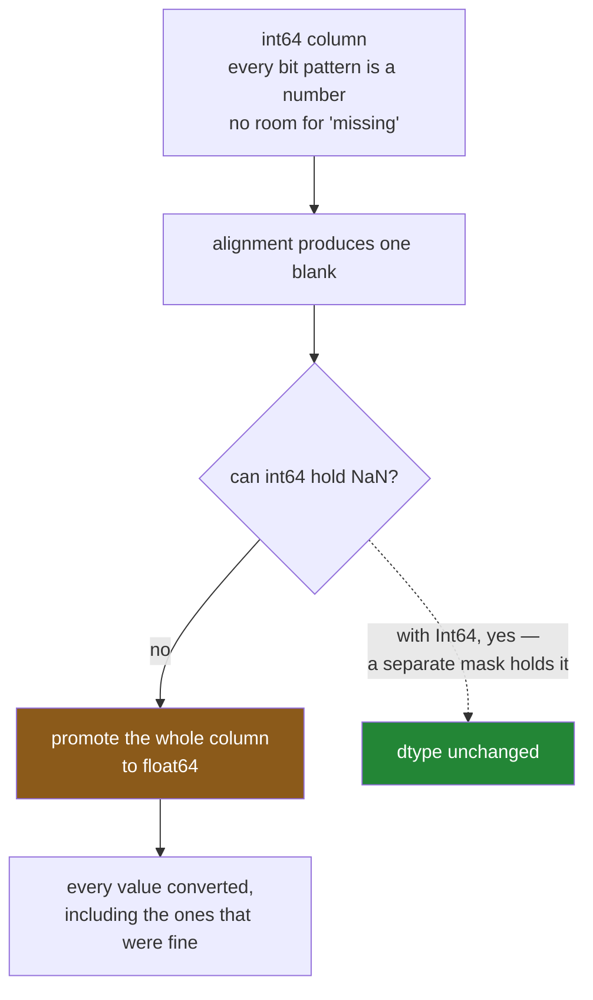

# 4.3 — The `NaN` that changed the dtype

## One-line answer

A `NaN` is a float, and a NumPy integer column cannot hold one — so the moment alignment introduces a
single blank, **every value in the column becomes a float**, whether it needed to or not, and above
about nine quadrillion that conversion changes the numbers.

---

## The story

The flat keeps a tally of how many of each thing they have got through this year. They are counts:
whole numbers, written as whole numbers, and nobody has ever written half a loaf.

Somebody adds this year's tally to last year's. Last year had one item on it that this year does not.

The new tally comes back and every single number on it has gained a decimal point. Two has become
2.0. Six has become 6.0. Nothing is *wrong*, exactly — 2.0 is two — but the list now looks like it is
measuring something continuous, and one line, the item that only appeared last year, is blank.

The blank is the one anybody would expect. The decimal points are the surprise, and they arrived on
every row, including rows that had nothing to do with the missing item.

---

## The idea in plain language

Day 26 established that a pandas column has exactly one dtype
([Day 26, 1.4](../../../day-26-frames-and-copy-on-write/parts/01-the-two-objects/1.4-one-dtype-per-column.md)).
Every value in it is stored the same way, in a block of memory of one kind.

An `int64` column is a block of eight-byte whole numbers. **There is no bit pattern in that block
that means "missing"** — every possible pattern is already a number
([Day 20, 2.2](../../../day-20-arrays-and-dtypes/parts/02-dtypes/2.2-integers-and-the-silent-wrap.md)).

A `float64` column *does* have one. The floating-point standard reserves a set of patterns for "not a
number", which is what `NaN` is
([Day 20, 2.3](../../../day-20-arrays-and-dtypes/parts/02-dtypes/2.3-floats-nan-and-precision.md)).

So when alignment produces a blank ([4.1](4.1-two-lists-different-items.md)), pandas has a choice: it
can refuse, or it can move the whole column to a dtype that can hold a blank. It moves. **The column
becomes `float64`, and every value in it is converted**, including the ones that were fine.

This is called **type promotion**, and the thing to understand is that it is not a pandas quirk. It
is forced by NumPy's storage model: one dtype per block, and no missing marker for integers. Anything
that introduces a blank into an integer column has the same effect —
`where` ([3.3](../03-writing/3.3-where-mask-and-the-write-that-was-not.md)), `reindex`
([5.1](../05-reindexing/5.1-reindex-say-the-index-you-want.md)), a merge, a shift. Alignment is just
the most common way to meet it.

There is a way out, and pandas 3.0 has it. The **nullable** dtypes — written with a capital letter,
`Int64` rather than `int64` — store the values *and* a separate mask saying which are missing. They
can hold a blank without changing type, so `Int64 + Int64` stays `Int64`. They are not the default,
and *In production* is honest about why.

Two consequences worth knowing before the code. First, `float64` can represent every whole number
exactly only up to 2⁵³, which is about nine quadrillion — above that, promotion **changes the value**.
Second, `bool` does not promote to float at all; it goes somewhere else entirely, and that is in
*When it breaks*.

---

## Why Setu needs it

- **[4.1](4.1-two-lists-different-items.md)** produced the `NaN`. This part is what the `NaN` did to
  everything around it.
- **[2.5](../02-masks/2.5-the-mask-that-matched-nothing.md)** explained how `NaN` makes `sum` and
  `mean` disagree, which is why a promoted column behaves differently downstream.
- **[5.2](../05-reindexing/5.2-fill-value-method-and-the-gap.md)** shows how to avoid the blank in the
  first place, which is the only way to avoid the promotion.
- **[Day 27, 5.3](../../../day-27-reading-and-writing/parts/05-the-module/5.3-the-round-trip-test.md)**
  asserted exact dtypes in a test. A promotion turns such a test red, which is the earliest anybody
  finds out.
- **Day 30**'s imputer expects a numeric column and behaves differently on `float64` with `NaN` than
  on `int64` without. The pipeline's first step is often repairing this.

---

## The mechanism

The promotion, and how little it takes:

```python
import pandas as pd

this_year = pd.Series([2, 6], index=["milk", "eggs"], dtype="int64")
last_year = pd.Series([1, 3], index=["milk", "tea"], dtype="int64")

combined = this_year + last_year
print(combined)
print()
print("in :", this_year.dtype, "and", last_year.dtype)
print("out:", combined.dtype)
```

**Line by line:**

- Both inputs are explicitly `int64`. Counts are whole numbers and the dtype says so.
- The indexes overlap in `milk` only, so exactly **one** label on each side has no partner
  ([4.1](4.1-two-lists-different-items.md)).
- `combined` has three rows: one real answer and two blanks.
- **The `milk` row did not need to change.** `2 + 1` is 3, a whole number, computed from two whole
  numbers. It became `3.0` because it shares a column with a blank.

```text
eggs    NaN
milk    3.0
tea     NaN
dtype: float64

in : int64 and int64
out: float64
```

Every integer dtype does the same thing:

```python
for name in ["int8", "int16", "int32", "int64"]:
    left = pd.Series([1, 2], index=["a", "b"], dtype=name)
    right = pd.Series([1, 2], index=["a", "c"], dtype=name)
    print(f"{name:6} + {name:6} -> {(left + right).dtype}")
```

**Line by line:**

- The loop builds the same mismatched pair at four different widths.
- `int8` holds numbers from −128 to 127 and takes one byte per value; `int64` takes eight.
- **All four produce `float64`** — the widest float there is. An `int8` column of a hundred million
  rows is 100 MB, and one missing label turns it into 800 MB.
- There is no `float8` or `float16` fallback in this path: promotion goes straight to `float64`.

```text
int8   + int8   -> float64
int16  + int16  -> float64
int32  + int32  -> float64
int64  + int64  -> float64
```

The nullable dtypes, which do not promote:

```python
for name in ["Int8", "Int64", "Float64"]:
    left = pd.Series([1, 2], index=["a", "b"], dtype=name)
    right = pd.Series([1, 2], index=["a", "c"], dtype=name)
    result = left + right
    print(f"{name:8} + {name:8} -> {str(result.dtype):8} {result.to_dict()}")
```

**Line by line:**

- **The capital letter is the whole difference.** `Int64` is pandas' nullable integer; `int64` is
  NumPy's.
- A nullable column stores a **mask** alongside the values — one bit per row saying present or
  missing — so a blank costs a bit rather than a change of type.
- The dtype is preserved exactly, including the width: `Int8` stays `Int8`.
- The blanks in the column itself are `pd.NA`, a different missing marker from `NaN`, which Day 26
  explained
  ([Day 26, 2.5](../../../day-26-frames-and-copy-on-write/parts/02-the-str-dtype/2.5-the-missing-value-in-a-text-column.md)).
  They print as `None` here only because `.to_dict()` converts them on the way out; printing the
  Series itself shows `<NA>`.

```text
Int8     + Int8     -> Int8     {'a': 2, 'b': None, 'c': None}
Int64    + Int64    -> Int64    {'a': 2, 'b': None, 'c': None}
Float64  + Float64  -> Float64  {'a': 2.0, 'b': None, 'c': None}
```

Where the promotion comes from:



---

## When it breaks

**The whole number that stopped being itself:**

```text
$ uv run python -c "
import pandas as pd
big = 2**53 + 1
s = pd.Series([big, 5], index=['a', 'b'], dtype='int64')
t = pd.Series([0, 0], index=['a', 'c'], dtype='int64')
r = s + t
print('exact int64 :', big)
print('after promo :', repr(r['a']))
print('back to int :', int(r['a']))
print('same?       :', int(r['a']) == big)
"
```

```text
exact int64 : 9007199254740993
after promo : np.float64(9007199254740992.0)
back to int : 9007199254740992
same?       : False
```

**What it means.** The value went in as 9007199254740993 and came out as 9007199254740992. **It is
off by one, and nothing raised.**

A `float64` has 53 bits of significand, so it can represent every whole number exactly up to 2⁵³ and
not one above it ([Day 20, 2.3](../../../day-20-arrays-and-dtypes/parts/02-dtypes/2.3-floats-nan-and-precision.md)).
Above that, the nearest representable value is used, and the odd numbers simply do not exist.

Nine quadrillion sounds safely far away, and it is not: **identifiers reach it.** A 19-digit
account number, a Twitter-style snowflake ID, a hash truncated to 64 bits — all of these live above
2⁵³, and all of them are stored as `int64`. One alignment blank and every such identifier in the
column is silently rounded, which is a corruption you cannot detect afterwards because the result is
still a plausible number. **Identifiers should not be stored as integers**, which is the same argument
[Day 27, 1.3](../../../day-27-reading-and-writing/parts/01-the-csv/1.3-when-the-guess-is-wrong.md)
made about the aisle code.

**`bool` does not promote to float:**

```text
$ uv run python -c "
import pandas as pd
a = pd.Series([True, False], index=['x', 'y'])
b = pd.Series([True, True], index=['x', 'z'])
r = a + b
print(r.to_dict())
print('dtype:', r.dtype)
print('can you filter with it?')
frame = pd.DataFrame({'v': [1, 2, 3]}, index=['x', 'y', 'z'])
print(frame.loc[r])
" 2>&1 | tail -4
```

```text
{'x': 2, 'y': nan, 'z': nan}
dtype: object
can you filter with it?
KeyError: "None of [Index([2, nan, nan], dtype='object')] are in the [index]"
```

**What it means.** Two things went wrong and the second is stranger than the first.

`True + True` gave **`2`**, not `True` — `+` on booleans is addition, not "or"
([2.3](../02-masks/2.3-and-or-not-and-the-brackets.md) is where the logical operators live). And the
column came out as `object`, not `float64`, because `2` and `nan` were stored as Python objects
rather than converted to a common numeric type
([Day 26, 2.4](../../../day-26-frames-and-copy-on-write/parts/02-the-str-dtype/2.4-dtypes-equals-object-finds-nothing.md)).

Then the failure: `loc` was handed an `object` column and **did not treat it as a mask at all.** A
mask has to be `bool` dtype; this one is not, so `loc` fell back to reading it as a **list of
labels** — and there is no row called `2` or `nan`, hence the `KeyError`. The message quotes the
values it was looking for, which is the clue: if `loc` complains that your mask's *values* are not in
the index, your mask is not a boolean column.

**The one that is silent — a test that stopped testing:**

```text
$ uv run python -c "
import pandas as pd
counts = pd.Series([2, 6], index=['milk', 'eggs'], dtype='int64')
extra = pd.Series([1], index=['tea'], dtype='int64')
total = counts.add(extra, fill_value=0)
print('values look right:', total.to_dict())
print('dtype            :', total.dtype)
print('is it int64?     :', total.dtype == 'int64')
"
```

```text
values look right: {'eggs': 6.0, 'milk': 2.0, 'tea': 1.0}
dtype            : float64
is it int64?     : False
```

**What it means.** `fill_value=0` removed every `NaN` — there is not a blank in the result — and the
column is **still `float64`**. The promotion happened during the alignment, before `fill_value` was
applied, and nothing converts it back.

This is the case that catches people who think they have handled it. The values are all correct, the
blanks are all gone, and a schema check comparing against `"int64"` fails
([Day 27, 5.3](../../../day-27-reading-and-writing/parts/05-the-module/5.3-the-round-trip-test.md)).
**`fill_value` fixes the values, not the dtype.** An explicit `.astype("int64")` afterwards is the
other half, and it will raise if you were wrong about the blanks being gone — which makes it a check
as well as a conversion.

---

## In production

**What a professional writes instead of the teaching version.** The dtype is restored deliberately,
and the restoration doubles as an assertion:

```python
import pandas as pd


def total_counts(this_year: pd.Series, last_year: pd.Series) -> pd.Series:
    """Combine two count Series. Absent means zero. The result is int64 or it raises."""
    combined = this_year.add(last_year, fill_value=0)
    if combined.isna().any():
        raise ValueError(f"blanks survived the fill: {combined[combined.isna()].index.tolist()}")
    return combined.astype("int64")
```

**Line by line:**

- `fill_value=0` states what an absent label means, which is the decision
  [4.1](4.1-two-lists-different-items.md) insisted on making explicitly.
- The `isna` check is **not redundant**. `fill_value` handles a label missing from one side; a `NaN`
  that was already in one of the inputs passes straight through it.
- `.astype("int64")` — the deliberate conversion back. **It raises on any remaining blank**, so the
  two lines together make the return type a guarantee rather than a hope.
- The docstring says **"is int64 or it raises"**, which is the contract a caller needs. A function
  that sometimes returns `float64` and sometimes `int64` depending on its inputs is a function whose
  callers all need their own `astype`.

**What changes at scale.** Three things.

**The memory is the obvious one and it is not the whole story.** Promoting `int8` to `float64` is
eight times the memory; promoting `int64` to `float64` is the same width, so nothing changes there.
What always changes is the **behaviour**: a column with `NaN` in it makes `sum` and `mean` disagree
([2.5](../02-masks/2.5-the-mask-that-matched-nothing.md)), makes `==` fail against itself, and makes
`groupby` drop those rows by default on Day 31.

**The nullable dtypes are the real fix and they are not free.** `Int64` keeps the type, keeps `NA`
distinct from `NaN`, and makes the whole class of bug above impossible. Against that: they are not
the default, so every read has to ask for them; some third-party libraries still expect NumPy dtypes
and will convert or fail; and arithmetic on them goes through a masked-array path that is measurably
slower than NumPy's. The honest advice for this curriculum is to know they exist, reach for them when
a column of identifiers or counts must stay integral, and not to convert a whole codebase to them on
principle.

**And the best fix is upstream.** The promotion happens because a blank appeared. A blank appeared
because two indexes disagreed. Reindexing both sides to a known index before the operation
([5.1](../05-reindexing/5.1-reindex-say-the-index-you-want.md)) means no blank, no promotion and no
repair — which is why section 5 exists.

**The failure that only appears with real data.** A pipeline joined an events frame to a lookup frame
on a 19-digit user identifier stored as `int64`. Almost every event matched, so the join produced a
handful of `NaN` rows and promoted the identifier column to `float64`. Every identifier above 2⁵³ was
then rounded to an even number, and a few thousand users were silently merged with their neighbours —
distinct people, sharing a row. **Nothing raised, no count changed, and the identifiers still looked
like identifiers.** It was found months later by somebody who noticed a user's activity they could
not explain. The fix was to store identifiers as strings, which is what they always were.

**The review comment a senior engineer leaves.** *"This adds two count Series and the result is
`float64`, because the indexes do not match perfectly. Add `fill_value=0` and `astype('int64')`, and
assert no blanks between them. If `user_id` ever goes through a path like this, make it a string
first — it is above 2⁵³ and float64 will round it."*

**The interview question.** *"Why does adding two integer Series sometimes give you floats?"* Because
alignment introduces `NaN` for non-overlapping labels, `NaN` is a float, and a NumPy `int64` column
has no bit pattern for missing — so the whole column is promoted to `float64` and every value is
converted, not just the blank ones. Then the two things that show you have been bitten: `fill_value=`
removes the blanks but **does not undo the promotion**, so an explicit `astype` is needed; and above
2⁵³ the promotion is **lossy**, which matters because that is exactly the range large identifiers live
in. If they ask for the fix, it is pandas' nullable `Int64`, which carries a separate missing mask and
keeps its dtype — at the cost of not being the default and being slower.

---

## Check yourself

```bash
uv run python -c "
import pandas as pd
a = pd.Series([2, 6], index=['milk', 'eggs'], dtype='int64')
b = pd.Series([1, 3], index=['milk', 'tea'], dtype='int64')
print('plain      :', (a + b).dtype)
print('fill_value :', a.add(b, fill_value=0).dtype)
print('astype back:', a.add(b, fill_value=0).astype('int64').dtype)
A = a.astype('Int64'); B = b.astype('Int64')
print('nullable   :', (A + B).dtype, (A + B).to_dict())
"
```

Four lines, and only two of them end with an integer dtype. Say which step actually caused the
promotion, and why `fill_value` was not enough to undo it.

**Answer out loud, without scrolling up:**

> Explain why one missing label turns an entire `int64` column into `float64`, in terms of how a
> column is stored. Then say what goes wrong above 2⁵³, and name the dtype that avoids the whole
> problem.

---

**Next:** [4.4 — The index is the join key](4.4-the-index-is-the-join-key.md).
