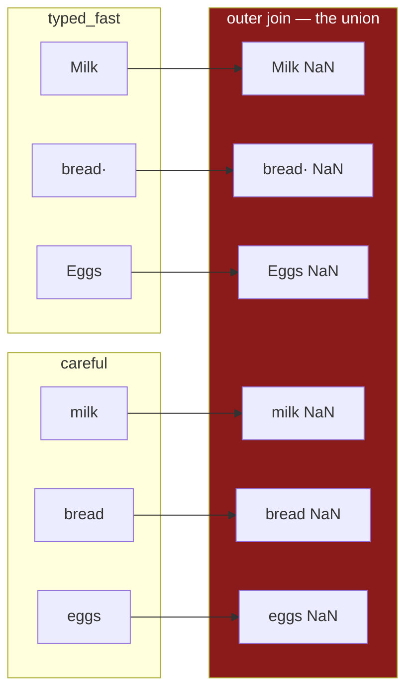

# 4.4 — The index is the join key

## One-line answer

Alignment is a **join**, and the index is its key — so everything a database person knows about keys
applies to it: it must be unique, it must be clean, its type must match on both sides, and a join
that silently produces the union is the one nobody checks.

---

## The story

Two lists again, and this time they nearly line up.

One person wrote `Milk`. The other wrote `milk`. One wrote `bread ` with a space on the end, because
they hit the space bar before the Enter key. One wrote `eggs` and the other wrote `Eggs`.

Adding the two lists together produces a list twice as long, with every item appearing twice, and
every total blank.

To a person holding the two sheets, they say the same things. The items are obviously the same items.
Nobody would hesitate for a second.

To anything matching by name, `Milk` and `milk` are two different items, and so the two lists have
nothing whatever in common.

---

## The idea in plain language

A **join** is combining two tables by matching rows that share a value. The value matched on is the
**key**.

Everything section 4 has shown is a join. `mine + theirs` matched rows by label, which is a join whose
key is the index ([4.1](4.1-two-lists-different-items.md)). And because pandas keeps every label from
either side, it is specifically an **outer join** — the kind that keeps unmatched rows and fills them
with blanks.

That reframing is the point of this part, because it gives you a whole body of knowledge for free.
Every rule about join keys applies to a pandas index:

**A key should be unique.** A duplicated label makes the result explode combinatorially, and it has
its own part ([5.3](../05-reindexing/5.3-duplicate-labels.md)).

**A key must match exactly.** `Milk` is not `milk`; `bread ` is not `bread`. Matching is on the exact
value, and near-misses are simply misses.

**A key's type matters.** The string `"07"` and the number `7` never match, which is what
[Day 27, 1.3](../../../day-27-reading-and-writing/parts/01-the-csv/1.3-when-the-guess-is-wrong.md)
was really about. An index read from a CSV and an index read from a database can differ in dtype
while looking identical when printed.

**A join needs a type.** Databases make you say `INNER` or `LEFT` or `OUTER`. **pandas' operators do
not ask** — they do an outer join and hand you the blanks. `align` is where you get to choose, and
`join=` is the argument.

The practical consequence is one habit: **after any operation between two labelled objects, check the
length.** An inner join can only shrink; an outer join can grow. If the result is longer than both
inputs, the keys did not match and no error is going to tell you.

---

## Why Setu needs it

- **[4.2](4.2-alignment-is-automatic.md)** established that alignment is automatic. This part is what
  to do about it: treat the index as a key and look after it.
- **[5.3](../05-reindexing/5.3-duplicate-labels.md)** is the uniqueness rule, which is the one that
  fails most spectacularly.
- **[5.1](../05-reindexing/5.1-reindex-say-the-index-you-want.md)** is how you force both sides onto a
  known key before combining them.
- **Day 32** is `merge` and `join`, where the key is a **column** rather than the index and you state
  the join type. Everything here transfers directly, and the arguments finally have names.
- **Day 226** designs the project's database schema, where a primary key is declared and enforced by
  the table itself ([Day 27, 4.1](../../../day-27-reading-and-writing/parts/04-sql/4.1-a-table-that-knows-its-types.md)).
  That is the same idea with somebody checking it for you.

---

## The mechanism

Two lists that a person would say are the same:

```python
import pandas as pd

careful = pd.Series([2, 1, 6], index=["milk", "bread", "eggs"], name="need")
typed_fast = pd.Series([1, 2, 3], index=["Milk", "bread ", "Eggs"], name="need")

print("in common:", careful.index.intersection(typed_fast.index).tolist())
print()
combined = careful + typed_fast
print(combined)
print()
print("lengths:", len(careful), "+", len(typed_fast), "->", len(combined))
```

**Line by line:**

- `typed_fast` has the same three items with three ordinary mistakes: a capital `M`, a trailing space,
  a capital `E`. Every one of these is something a person types without noticing.
- `.index.intersection(...)` — **the diagnostic, run before the arithmetic.** It is an `Index` method
  and it answers the only question that matters: do these two share any keys at all?
- `careful + typed_fast` — the outer join. Nothing matched, so every row is blank.
- The lengths are printed because **three plus three giving six is the symptom**. An outer join of two
  three-row objects gives six rows only when the keys are completely disjoint.

```text
in common: []

Eggs      NaN
Milk      NaN
bread     NaN
bread     NaN
eggs      NaN
milk      NaN
Name: need, dtype: float64

lengths: 3 + 3 -> 6
```

**Six rows, all blank, and `bread` appears twice** — once with the trailing space and once without,
which prints identically and is not the same label. That double `bread` in the output is the clearest
possible picture of what a key mismatch looks like.

The join, drawn as a join:



**Every arrow goes to its own row.** Nothing merged, because nothing matched.

Cleaning the key, which is what fixes it:

```python
def clean_key(series: pd.Series) -> pd.Series:
    """Normalise the labels so that near-misses match."""
    return series.set_axis(series.index.str.strip().str.casefold())


fixed = careful + clean_key(typed_fast)
print(fixed)
print()
print("lengths:", len(careful), "+", len(typed_fast), "->", len(fixed))
```

**Line by line:**

- `series.index.str.strip().str.casefold()` — the two normalisations that fix the three mistakes.
  `strip` removes the trailing space; `casefold` flattens case more aggressively than `lower` and is
  the right choice for matching
  ([Day 7, 2.1](../../../day-07-strings/parts/02-methods/2.1-normalising-strip-and-case.md)).
- `.set_axis(...)` — replaces the index with the cleaned one and **returns a new Series**. Assigning
  to `series.index` would mutate the caller's object, which is the habit
  [3.2](../03-writing/3.2-the-new-column-that-was-a-mask.md) argued against.
- **The same normalisation was applied on Day 26 to the `item` column**
  ([Day 26, 5.1](../../../day-26-frames-and-copy-on-write/parts/05-the-module/5.1-the-shopping-list-module.md)),
  and for exactly this reason. Normalising a key is not tidiness; it is what makes a join work.
- Only one side is cleaned here because `careful` is already clean. **In production both sides go
  through the same function**, because "already clean" is an assumption rather than a fact.

```text
milk     3
bread    3
eggs     9
Name: need, dtype: int64

lengths: 3 + 3 -> 3
```

**Three rows, no blanks, and the length is now the length of both inputs.** That length is the check:
an outer join of two identical key sets gives exactly that many rows, and any other number means the
keys disagree.

Two more things changed that nobody asked for, and both are worth noticing. The dtype is **`int64`**,
not `float64` — with no blank to store, there was no promotion
([4.3](4.3-the-nan-that-changed-the-dtype.md)). And the order is the **original** `milk, bread, eggs`
rather than alphabetical, because when the two indexes hold the same labels pandas keeps the left
side's order instead of building a sorted union. **A sorted result is itself a signal** that the keys
did not match.

Choosing the join type, which the operators never let you do:

```python
inner_left, inner_right = careful.align(clean_key(typed_fast), join="inner")
outer_left, outer_right = careful.align(pd.Series([9], index=["tea"]), join="outer")
print("inner:", len(inner_left), "rows —", inner_left.index.tolist())
print("outer:", len(outer_left), "rows —", outer_left.index.tolist())
```

**Line by line:**

- `.align(other, join=...)` returns **two objects**, both reindexed onto the same shared index, so
  that you can then combine them however you like. It is the explicit form of what `+` does behind
  your back.
- `join="inner"` keeps only labels present in both — the join type that **cannot** grow the result,
  and the safe default when you expect a match.
- `join="outer"` is what the operators do, and it is shown against a Series sharing no labels, so the
  growth is visible.
- The other options are `join="left"` and `join="right"`, which keep one side's index exactly. `left`
  is the most useful of the four in practice: it says "keep my rows, bring across what you can".

```text
inner: 3 rows — ['milk', 'bread', 'eggs']
outer: 4 rows — ['bread', 'eggs', 'milk', 'tea']
```

The inner join kept the left side's order; the outer join had to build a union and sorted it. Same
signal as above.

---

## When it breaks

**Keys of different types, which never match:**

```text
$ uv run python -c "
import pandas as pd
from_csv = pd.Series([2, 1], index=['07', '03'], name='count')
from_db = pd.Series([5, 9], index=[7, 3], name='count')
print('csv index dtype:', from_csv.index.dtype)
print('db  index dtype:', from_db.index.dtype)
print('in common      :', from_csv.index.intersection(from_db.index).tolist())
print()
print((from_csv + from_db).to_dict())
"
```

```text
csv index dtype: str
db  index dtype: int64
in common      : []

{3: nan, 7: nan, '03': nan, '07': nan}
```

**What it means.** Aisle codes from a CSV, read as text, against the same codes from a database, read
as integers ([Day 27, 4.2](../../../day-27-reading-and-writing/parts/04-sql/4.2-read-sql-and-the-connection.md)).
They print almost identically and share nothing.

Look at the result's keys: `3, 7, '03', '07'` — **numbers and strings side by side in one index.**
That mixed index is the fingerprint of this bug, and spotting it in a printout is faster than any
other diagnosis. The fix belongs at read time, with `dtype=` stated on both sides
([Day 27, 1.4](../../../day-27-reading-and-writing/parts/01-the-csv/1.4-dtype-at-read-time.md)).

**The join that grew:**

```text
$ uv run python -c "
import pandas as pd
a = pd.Series(range(5), index=[f'a{i}' for i in range(5)])
b = pd.Series(range(5), index=[f'b{i}' for i in range(5)])
c = a + b
print('inputs :', len(a), len(b))
print('result :', len(c))
print('real   :', int(c.notna().sum()))
print('blank  :', int(c.isna().sum()))
"
```

```text
inputs : 5 5
result : 10
real   : 0
blank  : 10
```

**What it means.** Five plus five gave ten, and not one of them is a real number. **No error, no
warning, and a result twice the size of either input.**

This is the shape to watch for, and it is why the length check is worth writing every time: an outer
join can only be as long as the union of the keys, so `len(result) > max(len(a), len(b))` means some
keys did not match, and `len(result) == len(a) + len(b)` means **none** of them did.

**The one that looks like it worked — a partial match:**

```text
$ uv run python -c "
import pandas as pd
a = pd.Series([1] * 100, index=[f'k{i}' for i in range(100)])
b = pd.Series([1] * 100, index=[f'k{i}' for i in range(2, 102)])
c = a + b
print('inputs:', len(a), len(b), '-> result:', len(c))
print('real  :', int(c.notna().sum()), '| blank:', int(c.isna().sum()))
print('total :', c.sum(), '| mean:', c.mean())
"
```

```text
inputs: 100 100 -> result: 102
real  : 98 | blank: 4
total : 196.0 | mean: 2.0
```

**What it means.** This is the dangerous case, because it looks fine. 102 rows from two hundreds — a
two-per-cent overshoot, easily mistaken for a real category appearing. The mean is exactly 2.0, which
is correct and reassuring. The sum is 196 rather than 200, which is **wrong by two per cent and
entirely plausible**.

`mean` skips the blanks, so it reports the average of the rows that matched and tells you nothing
about the four that did not ([2.5](../02-masks/2.5-the-mask-that-matched-nothing.md)). **A mostly-
working join is far harder to spot than a completely broken one**, and the only thing that catches it
is the row count.

---

## In production

**What a professional writes instead of the teaching version.** The key is normalised, checked and
joined explicitly, and the overlap is asserted:

```python
import pandas as pd


def normalise_key(series: pd.Series) -> pd.Series:
    """Strip and case-fold the labels. Both sides of any join go through this."""
    return series.set_axis(series.index.astype("str").str.strip().str.casefold())


def combine_counts(left: pd.Series, right: pd.Series, min_overlap: float = 0.9) -> pd.Series:
    """Add two count Series on a normalised key, refusing a suspiciously poor match."""
    left, right = normalise_key(left), normalise_key(right)
    overlap = left.index.intersection(right.index)
    smaller = min(len(left), len(right))
    if smaller and len(overlap) / smaller < min_overlap:
        raise ValueError(
            f"only {len(overlap)} of {smaller} keys matched; "
            f"unmatched on the left: {left.index.difference(right.index)[:5].tolist()}"
        )
    return left.add(right, fill_value=0)
```

**Line by line:**

- `normalise_key` is **one function applied to both sides**, which is the only way to guarantee they
  are normalised the same way. Two similar-looking normalisations in two places will diverge.
- `.astype("str")` before the string methods, so an index of integers does not raise on `.str` — this
  is the dtype-mismatch failure above, handled by making both sides text.
- `min_overlap` as a **parameter with a default**, because how much mismatch is acceptable is a
  property of the data rather than of the code. Set it to `1.0` where any mismatch is a bug.
- `if smaller and ...` — the guard against an empty input, which would otherwise divide by zero. An
  empty side is a legitimate case ([2.5](../02-masks/2.5-the-mask-that-matched-nothing.md)) and should
  not raise here.
- `left.index.difference(right.index)[:5]` — **a sample of what failed to match**, which is the single
  most useful thing an error like this can carry. Five, not all of them, because an exception with a
  million labels in it is not a diagnostic.
- `fill_value=0` states the meaning of an absent label
  ([4.1](4.1-two-lists-different-items.md)), and the check above it is what makes that assertion
  defensible rather than a shrug.

**What changes at scale.** Three things.

**Uniqueness stops being free.** `index.is_unique` is a linear scan on an unsorted index, and pandas
caches the answer — so checking it once is cheap and checking it in a loop is not. Real pipelines
assert it at the boundary, once, when the frame is loaded
([5.3](../05-reindexing/5.3-duplicate-labels.md)).

**Key normalisation belongs upstream, not at every join.** Stripping and case-folding a million labels
at each of ten joins is ten times the work and ten chances to do it differently. Normalise once, at
load ([Day 27, 5.1](../../../day-27-reading-and-writing/parts/05-the-module/5.1-the-loaders-module.md)),
and every downstream join gets it for free.

**And at real scale the join stops belonging in pandas.** An outer join of two large frames materialises
the union in memory before anything is computed; a database does the same join with an index and
returns only the rows you asked for
([Day 27, 4.2](../../../day-27-reading-and-writing/parts/04-sql/4.2-read-sql-and-the-connection.md)).
Day 35's DuckDB comparison is largely this observation with numbers attached.

**The failure that only appears with real data.** A pipeline joined transactions to a customer table
on customer reference. It worked for two years. Then an upstream system started emitting references
with a leading zero — `0012345` where it used to send `12345` — for accounts created after a
migration. Those transactions matched nothing, joined to blanks, and were dropped by a later
`dropna`. **About four per cent of new customers simply did not appear in any report**, and because
they were new customers the totals still grew month on month. It was found by a person who could not
find their own order. The lesson is that a key's *format* is part of its contract, and the check that
would have caught it — asserting the match rate — is three lines.

**The review comment a senior engineer leaves.** *"`a + b` here is an outer join on the index and we
never check the overlap. If the keys drift we get a longer frame full of `NaN` and no error. Assert
the intersection size, and normalise both indexes through one function — right now the left side is
stripped and the right side is not."*

**The interview question.** *"How would you debug a pandas join that returns mostly nulls?"* Check the
**keys**, not the values: compare `left.index.dtype` against `right.index.dtype`, because text and
integer keys never match and print almost identically; then look at
`left.index.difference(right.index)` for a sample of what failed, which usually shows whitespace, case
or a leading zero. Then the framing that shows experience: **alignment is an outer join and the index
is its key**, so the row count is the diagnostic — if the result is longer than both inputs the keys
disagree, and if it is exactly their sum then nothing matched at all. The fix is to normalise both
keys through one function at load time and to assert the match rate rather than hoping.

---

## Check yourself

```bash
uv run python -c "
import pandas as pd
careful = pd.Series([2, 1, 6], index=['milk', 'bread', 'eggs'], name='need')
fast = pd.Series([1, 2, 3], index=['Milk', 'bread ', 'Eggs'], name='need')
print('overlap raw     :', careful.index.intersection(fast.index).tolist())
clean = fast.set_axis(fast.index.str.strip().str.casefold())
print('overlap cleaned :', careful.index.intersection(clean.index).tolist())
print('rows raw        :', len(careful + fast))
print('rows cleaned    :', len(careful + clean))
"
```

Two lists of three. One combination gives six rows and the other gives three. Say which number tells
you the join failed, before you have looked at a single value.

**Answer out loud, without scrolling up:**

> Alignment is a join. Say which kind of join the `+` operator performs, and what the index is playing
> the part of. Then name the one number you check after any operation between two labelled objects,
> and say what it means when that number equals the sum of the two input lengths.

---

**Next:** [4.5 — Turning alignment off](4.5-turning-alignment-off.md).
