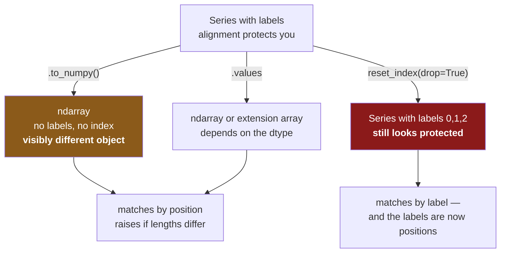

# 4.5 — Turning alignment off — and the three ways to regret it

## One-line answer

You turn alignment off by throwing the labels away — `.to_numpy()`, `.values` or
`reset_index(drop=True)` — and the reason to know how is so that you recognise it when somebody has
done it, because it converts a loud failure into a silent wrong answer.

---

## The story

Somebody has two lists that will not add up. Every total comes back blank, and they have been at it
for twenty minutes.

Then they find a suggestion online: strip the labels off both and add the plain numbers. They try it,
and it works. Three items, three numbers, three totals, no blanks anywhere.

It is the wrong answer, and there is nothing in the output to say so. The blanks were the only thing
telling them the two lists did not line up, and the fix removed the blanks rather than the problem.

The lists still do not line up. Now nobody knows.

---

## The idea in plain language

Alignment is what the labels are *for*. Remove them and you get NumPy's rule: match by position,
require equal lengths ([4.2](4.2-alignment-is-automatic.md)).

There are three ways to remove them, and they are not the same:

**`.to_numpy()`** returns a plain NumPy array — no index, no name, no dtype beyond NumPy's own. This
is the honest one, because the result is visibly a different kind of object.

**`.values`** is the older spelling of the same idea, and its return type depends on the dtype: NumPy
array for numeric columns, something else for extension dtypes like `Int64` or `str`. That
unpredictability is why `.to_numpy()` exists and why `.values` is best avoided.

**`reset_index(drop=True)`** stays in pandas and replaces the index with `0, 1, 2, …`. The object is
still a Series and alignment still happens — it just happens on positions dressed as labels, which is
the most dangerous of the three because the result still *looks* like a labelled object.

So when is it right?

**When there genuinely is no meaningful key.** Two lists of measurements taken in order, where row 3
of one really does correspond to row 3 of the other, and the index is bookkeeping rather than
identity.

**At the boundary to something that does not speak pandas.** A model's `fit` wants an array; a plotting
library wants numbers; a serialiser wants a list. Converting *at that boundary* is correct and
expected.

**When you have already aligned deliberately** and are dropping the labels to avoid paying for
alignment again in a tight loop.

And when is it wrong? Every other time — and especially as a fix for blanks you did not expect,
because that is not fixing the join, it is deleting the evidence.

---

## Why Setu needs it

- **[4.2](4.2-alignment-is-automatic.md)** showed the two rules giving different answers. This part is
  how you would end up on the wrong one.
- **[4.4](4.4-the-index-is-the-join-key.md)** gave the right fix — clean the key — against this
  part's wrong one.
- **[5.1](../05-reindexing/5.1-reindex-say-the-index-you-want.md)** is the deliberate version: forcing
  both sides onto a known index rather than removing the question.
- **[Day 26, 3.4](../../../day-26-frames-and-copy-on-write/parts/03-copy-on-write/3.4-to-numpy-and-the-read-only-array.md)**
  is what `to_numpy` gives you under Copy-on-Write, and it matters here.
- **Day 91 onwards**, every model is fitted on `X.to_numpy()`. Knowing that this is a boundary
  conversion — and that column order becomes the contract at that moment — is what stops a feature
  mismatch at prediction time.

---

## The mechanism

The three ways, on the reordered pair from [4.2](4.2-alignment-is-automatic.md):

```python
import pandas as pd

alphabetical = pd.Series([1, 2, 3], index=["a", "b", "c"])
shop_order = pd.Series([10, 20, 30], index=["c", "b", "a"])

print("by label            :", (alphabetical + shop_order).to_dict())
print("to_numpy            :", (alphabetical.to_numpy() + shop_order.to_numpy()).tolist())
print("values              :", (alphabetical.values + shop_order.values).tolist())
print(
    "reset_index(drop=True):",
    (alphabetical.reset_index(drop=True) + shop_order.reset_index(drop=True)).to_dict(),
)
```

**Line by line:**

- The first line is the correct answer: `a` paired with `a`, giving 31.
- `.to_numpy()` on both sides gives two bare arrays, so `+` is NumPy's, matching by position.
- `.values` gives the same numbers here. It is a different property with a **less predictable return
  type** — on an `Int64` or `str` column it hands back a pandas extension array rather than a NumPy
  one, and code written against `.values` then behaves differently depending on a dtype nobody
  changed on purpose.
- `reset_index(drop=True)` keeps both objects as Series and gives each the index `0, 1, 2`. They now
  align **successfully**, on positions — which is why the result is a Series with integer labels
  rather than an array. `drop=True` throws the old index away; without it, the old labels become a
  new column.
- **All four lines run. The first disagrees with the other three.**

```text
by label            : {'a': 31, 'b': 22, 'c': 13}
to_numpy            : [11, 22, 33]
values              : [11, 22, 33]
reset_index(drop=True): {0: 11, 1: 22, 2: 33}
```

**The fourth is the dangerous one.** Its output has labels — `0, 1, 2` — so it still looks like a
pandas result, and a reader skimming the code sees `Series + Series` and assumes alignment protected
them. It did not; the labels were replaced with the positions first.

What each route removes:



The middle path is unpredictable and the right-hand path is disguised. Only the left one is honest
about what it did.

Two things `to_numpy` does that are worth knowing:

```python
import numpy as np

counts = pd.Series([1, 2, 3])
array = counts.to_numpy()
print("type :", type(array).__name__, "dtype:", array.dtype)
print("shares memory with the Series:", np.shares_memory(array, counts.to_numpy()))
try:
    array[0] = 99
except ValueError as error:
    print("writing to it:", error)
```

**Line by line:**

- `to_numpy()` returns a genuine `ndarray`, so everything from Days 20 to 25 applies to it again.
- `np.shares_memory(...)` — **it is a view, not a copy.** pandas hands back the column's own memory
  rather than duplicating it, which is why the conversion is cheap even on a large frame
  ([Day 21, 2.2](../../../day-21-indexing-and-views/parts/02-the-view-trap/2.2-how-to-tell-base-and-shares-memory.md)).
- Writing to it **raises**. Under Copy-on-Write pandas marks the array read-only, precisely so that a
  write through the array cannot secretly change the frame
  ([Day 26, 3.4](../../../day-26-frames-and-copy-on-write/parts/03-copy-on-write/3.4-to-numpy-and-the-read-only-array.md)).
  `to_numpy(copy=True)` gives you a writable one and pays for the copy.

```text
type : ndarray dtype: int64
shares memory with the Series: True
writing to it: assignment destination is read-only
```

And the deliberate version, which is what you should write instead:

```python
left, right = alphabetical.align(shop_order, join="inner")
print("aligned on purpose:", (left + right).to_dict())
print("then, at the boundary:", (left.to_numpy() + right.to_numpy()).tolist())
```

**Line by line:**

- `.align(..., join="inner")` puts both Series on the same index, in the same order, as an explicit
  step ([4.4](4.4-the-index-is-the-join-key.md)).
- Adding them now gives the correct answer, because the alignment already happened.
- `to_numpy()` on the aligned pair gives the **same** numbers as the labelled addition — because once
  two objects are genuinely aligned, position and label agree.
- **That is the whole rule:** strip labels *after* aligning, never instead of it.

```text
aligned on purpose: {'a': 31, 'b': 22, 'c': 13}
then, at the boundary: [31, 22, 13]
```

---

## When it breaks

**Different lengths — the lucky failure:**

```text
$ uv run python -c "
import pandas as pd
a = pd.Series([1, 2, 3, 4], index=['a', 'b', 'c', 'd'])
b = pd.Series([10, 20, 30], index=['a', 'b', 'c'])
print('pandas aligns fine:', (a + b).to_dict())
a.to_numpy() + b.to_numpy()
" 2>&1 | tail -1
```

```text
ValueError: operands could not be broadcast together with shapes (4,) (3,)
```

**What it means.** pandas handled the mismatch by producing a blank for `d`. NumPy has no labels, so
all it can compare is the lengths, and four against three is not a shape it can broadcast
([Day 22, 1.6](../../../day-22-broadcasting-and-shape/parts/01-broadcasting/1.6-reading-the-broadcast-error.md)).

**Be glad when you see this**, because it is the only case where stripping labels fails loudly. The
lengths happening to match is what makes the mistake silent, and lengths match far more often than
labels do.

**`.values` returning something that is not an array:**

```text
$ uv run python -c "
import pandas as pd
plain = pd.Series([1, 2], dtype='int64')
nullable = pd.Series([1, 2], dtype='Int64')
text = pd.Series(['a', 'b'], dtype='str')
for name, s in [('int64', plain), ('Int64', nullable), ('str', text)]:
    print(f'{name:6} .values -> {type(s.values).__name__}')
"
```

```text
int64  .values -> ndarray
Int64  .values -> IntegerArray
str    .values -> ArrowStringArray
```

**What it means.** Three columns, three different return types from the same property. Code that does
`s.values.mean()` or passes `s.values` to a library expecting an `ndarray` works on the first and
fails or behaves differently on the other two — and **the only thing that changed was the column's
dtype**, which somebody may have altered for an unrelated reason
([4.3](4.3-the-nan-that-changed-the-dtype.md) is one way it changes by itself).

`.to_numpy()` always returns an `ndarray`, converting if it has to. **Use it, and treat `.values` in
existing code as something to replace.**

**The one that does not fail — reset_index on one side:**

```text
$ uv run python -c "
import pandas as pd
a = pd.Series([1, 2, 3], index=['a', 'b', 'c'])
b = pd.Series([10, 20, 30], index=['c', 'b', 'a'])
print('one side reset:', (a.reset_index(drop=True) + b).to_dict())
"
```

```text
one side reset: {0: nan, 1: nan, 2: nan, 'a': nan, 'b': nan, 'c': nan}
```

**What it means.** Resetting **one** side gave six rows of nothing. The left side now has labels
`0, 1, 2` and the right still has `a, b, c`, so the outer join found nothing in common and unioned
them ([4.4](4.4-the-index-is-the-join-key.md)).

This is what happens when the "strip the labels" fix is applied halfway — one side inside a helper
function, the other left alone. The result is worse than either the aligned or the positional answer,
and it is a very common way to arrive at a frame of blanks.

---

## In production

**What a professional writes instead of the teaching version.** The conversion happens once, at a
named boundary, with the column order recorded:

```python
import numpy as np
import pandas as pd

FEATURES: list[str] = ["need", "price"]


def to_model_input(frame: pd.DataFrame) -> np.ndarray:
    """The feature matrix, in FEATURES order. Raises rather than reordering silently."""
    missing = [name for name in FEATURES if name not in frame.columns]
    if missing:
        raise KeyError(f"missing feature columns: {missing}; have {list(frame.columns)}")
    if frame[FEATURES].isna().any().any():
        raise ValueError("cannot build a model input with missing values")
    return frame.loc[:, FEATURES].to_numpy(dtype="float64")
```

**Line by line:**

- `FEATURES` is a **module constant**, and it is the contract. The moment labels are dropped, column
  *order* becomes the only thing identifying a feature, so that order has to be written down
  somewhere it cannot drift ([Day 27, 3.4](../../../day-27-reading-and-writing/parts/03-parquet/3.4-column-pruning.md)
  showed two readers returning the same columns in different orders).
- `frame.loc[:, FEATURES]` — selecting **by name, in the constant's order**
  ([1.4](../01-label-and-position/1.4-rows-and-columns-at-once.md)). This is the line that makes the
  positional world downstream safe: the last thing done with labels is to impose the order.
- The missing-column check first, so the failure names features rather than producing a `KeyError`
  about one column.
- `.isna().any().any()` — two calls, because the first gives one answer per column and the second
  reduces those to one ([2.1](../02-masks/2.1-a-comparison-makes-a-column.md)). A model fitted on
  `NaN` either raises deep inside a library or, worse, silently trains on them.
- `to_numpy(dtype="float64")` — the dtype **stated**, not inherited. Otherwise a column that was
  promoted by an unrelated alignment ([4.3](4.3-the-nan-that-changed-the-dtype.md)) changes the
  array's dtype and, with it, the model's behaviour.
- **The function returns an `ndarray` and its type annotation says so.** After this line, alignment is
  gone and the caller is responsible for order. Naming the function `to_model_input` makes that
  boundary visible.

**What changes at scale.** Three things.

**The conversion is cheap and the copy is not.** `to_numpy()` on a single-dtype frame is a view and
costs nothing; on a **mixed-dtype** frame it must build one array of a common type, which means
copying every column and often promoting them all to `float64` or `object`. A frame of forty mixed
columns converted per request is a real cost, and the fix is to select the numeric columns first —
which `FEATURES` already does.

**Read-only is a feature, not an obstacle.** Under Copy-on-Write the returned array cannot be written
to ([Day 26, 3.4](../../../day-26-frames-and-copy-on-write/parts/03-copy-on-write/3.4-to-numpy-and-the-read-only-array.md)),
which stops a library that modifies its input in place from silently changing your frame. When a
library genuinely needs to write, `to_numpy(copy=True)` is the right answer and the copy is the price
of safety.

**And the column-order contract has to be enforced at both ends.** A model trained on
`["need", "price"]` and served a matrix built as `["price", "need"]` produces confident nonsense with
no error anywhere — the arrays have the same shape and the same dtype. Storing the feature list
alongside the model, and asserting it at prediction time, is the standard defence, and it exists
entirely because `to_numpy()` threw the names away.

**The failure that only appears with real data.** A scoring service built its feature matrix with
`frame.to_numpy()` on a frame assembled from several sources. For a year the columns happened to come
out in the same order every time. Then a source was migrated, one upstream query changed its `SELECT`
order, and the assembled frame's columns swapped. **The model kept returning scores** — plausible
ones, in the right range — computed from price where it expected quantity. It was found by a business
analyst who noticed the rankings had gone strange. The fix was `loc[:, FEATURES]` before the
conversion: one line, and it would have made the change impossible.

**The review comment a senior engineer leaves.** *"`df.to_numpy()` here relies on the column order
being whatever the previous step produced. Select `loc[:, FEATURES]` first so the order is ours. Also
`.values` on line 12 — use `.to_numpy()`; `.values` returns an extension array for the nullable
columns and the caller expects an ndarray."*

**The interview question.** *"When would you call `.to_numpy()` on a DataFrame?"* At a boundary — 
handing data to a model, a plotting library, or anything that does not speak pandas — and not as a way
of making two frames line up. The reason is that dropping the labels replaces label matching with
position matching, so a mismatch that pandas would have shown you as `NaN` becomes a silently wrong
number. Then the two details: **select the columns by name in a fixed order immediately before
converting**, because order becomes the contract the moment names are gone; and prefer `to_numpy()` to
`.values`, which returns an extension array rather than an `ndarray` for nullable and string dtypes.

---

## Check yourself

```bash
uv run python -c "
import pandas as pd
a = pd.Series([1, 2, 3], index=['a', 'b', 'c'])
b = pd.Series([10, 20, 30], index=['c', 'b', 'a'])
print('labels kept  :', (a + b).to_dict())
print('labels gone  :', (a.to_numpy() + b.to_numpy()).tolist())
print('half stripped:', (a.reset_index(drop=True) + b).to_dict())
la, ra = a.align(b, join='inner')
print('aligned first:', (la.to_numpy() + ra.to_numpy()).tolist())
"
```

Four results from two Series. Two of them agree. Say which two, and say why the fourth is the only
one that is both correct and label-free.

**Answer out loud, without scrolling up:**

> Name the three ways to turn alignment off, and say which of the three is most dangerous and why.
> Then say the one thing you must do immediately before calling `to_numpy()` on a frame you are about
> to hand to a model.

---

**Next:** [5.1 — `reindex`: say the index you want](../05-reindexing/5.1-reindex-say-the-index-you-want.md).
