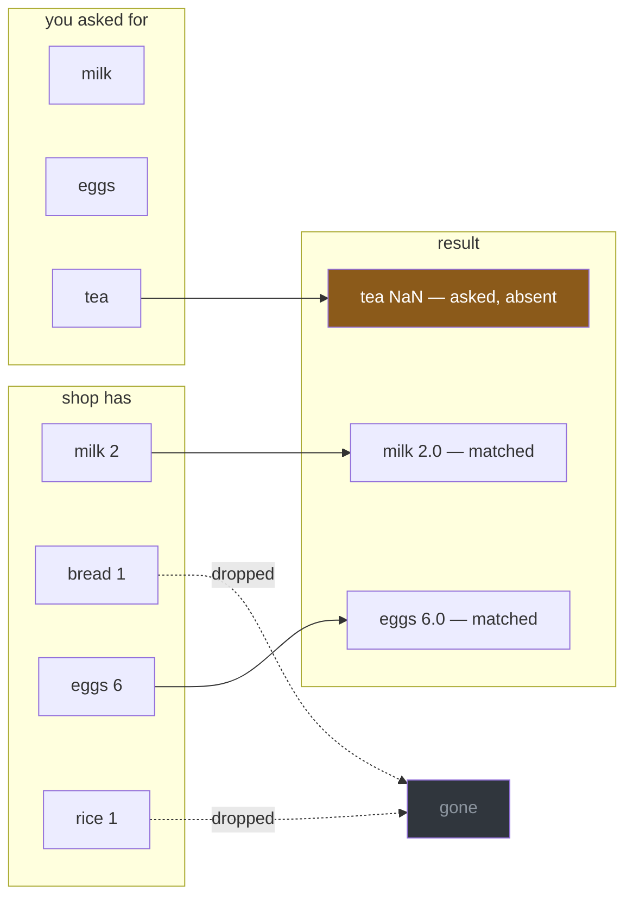

# 5.1 — `reindex` — say the index you want

## One-line answer

`reindex` puts an object onto **an index you name** — keeping the labels that match, inserting blanks
for the ones you asked for that are not there, and dropping the ones that are there and you did not
ask for — which turns alignment from something that happens to you into something you decide.

---

## The story

The flat's list changes every week, but the shop's shelf layout does not.

Somebody gets tired of the totals coming out in a different order every time, with different items in
them, and does something obvious: they write out a fixed sheet with every item the flat ever buys,
in aisle order, and copy the week's numbers onto it.

Items the flat did not buy this week get a blank. Items on the list that are not on the sheet — a
one-off, something a guest wanted — do not appear.

The sheet is the same every week now. It can be compared with last week's line for line, filed, added
up, and handed to somebody else who knows what it looks like.

The information did not change. What changed is that the *shape* stopped depending on what happened
to be bought.

---

## The idea in plain language

`reindex` takes a list of labels and returns a **new object on exactly that index**.

Three things happen at once, and all three are the point:

- **A label you asked for that exists** brings its value along.
- **A label you asked for that does not exist** gets a blank.
- **A label that exists and you did not ask for is dropped.**

That third one is what separates `reindex` from everything in section 2. A mask filters rows *the data
chose*; `reindex` selects rows *you* chose, and asks for ones that may not be there. It is the
difference between "show me the cheap items" and "show me these four items, whatever the data has".

It is also, quietly, the tool that makes alignment predictable. Section 4's whole problem was that
`a + b` produces the union of two indexes you did not choose
([4.1](../04-alignment/4.1-two-lists-different-items.md)). Reindex both sides onto an index you *did* choose, and the
addition has nothing left to surprise you with — no unexpected rows, no unexpected length, and blanks
only where you already knew there would be blanks.

Two things to know before the code.

**`reindex` is not `rename`.** `reindex` selects *by* labels and keeps values with their labels;
`rename` changes what the labels are called and moves nothing. Reaching for the wrong one produces a
frame full of blanks, and it is a common mistake.

**`reindex` requires a unique index.** If the object has a duplicated label, pandas cannot tell which
row you meant and raises. That is [5.3](5.3-duplicate-labels.md).

---

## Why Setu needs it

- **[5.2](5.2-fill-value-method-and-the-gap.md)** is what to put in the blanks this part creates.
- **[5.3](5.3-duplicate-labels.md)** is the one condition `reindex` refuses to work under.
- **[5.4](5.4-align-and-the-boundary.md)** does this to two objects at once, which is the shape you
  actually want before combining them.
- **[4.4](../04-alignment/4.4-the-index-is-the-join-key.md)** framed the index as a join key. Reindex
  is how you impose a key rather than discovering one.
- **Day 91 onwards**, a model is fitted on a fixed set of feature columns and must be served the same
  set in the same order. `reindex(columns=FEATURES)` is exactly how that guarantee is made
  ([4.5](../04-alignment/4.5-turning-alignment-off.md) explained why order becomes the contract).

---

## The mechanism

The three things it does, in one call:

```python
import pandas as pd

shop = pd.Series([2, 1, 6, 1], index=["milk", "bread", "eggs", "rice"], name="need")
shelf = ["milk", "eggs", "tea"]

print(shop.reindex(shelf))
print()
print("asked for :", shelf)
print("had       :", shop.index.tolist())
print("dropped   :", shop.index.difference(shelf).tolist())
```

**Line by line:**

- `shelf` is the index you want — written down, in a variable, because it is a decision rather than a
  by-product.
- `milk` and `eggs` are in both, so they bring their values.
- `tea` was asked for and is not in `shop`, so it is **blank**.
- `bread` and `rice` are in `shop` and not in `shelf`, so they are **gone** — no error, no warning.
  That is the behaviour to be careful with, and the last line is how you check it.
- `.difference(...)` is an `Index` method giving what was dropped
  ([4.4](../04-alignment/4.4-the-index-is-the-join-key.md)), and printing it is the one-line audit of
  a reindex.

```text
milk    2.0
eggs    6.0
tea     NaN
Name: need, dtype: float64

asked for : ['milk', 'eggs', 'tea']
had       : ['milk', 'bread', 'eggs', 'rice']
dropped   : ['bread', 'rice']
```

**The dtype is `float64`**, because `tea` is blank and an `int64` column cannot hold a blank
([4.3](../04-alignment/4.3-the-nan-that-changed-the-dtype.md)). Reindexing is one of the ways to meet
that promotion without adding anything.

The three effects, drawn:



Reindexing also reorders, and drops down to one row:

```python
print("reordered:", shop.reindex(["rice", "milk"]).to_dict())
print("narrowed :", shop.reindex(["milk"]).to_dict())
print("unchanged:", shop.reindex(shop.index).equals(shop))
```

**Line by line:**

- `reindex(["rice", "milk"])` — the result is in **the order you asked for**, not the frame's. That
  makes `reindex` a sorting tool when you already know the order you want, which is exactly the
  fixed-shelf case from the story.
- `reindex(["milk"])` — one label, so one row. The dtype stays `int64` here because no blank was
  created.
- `reindex(shop.index)` — asking for exactly what is already there is a no-op, which is worth knowing
  because it means reindexing defensively costs nothing when the data is already right.

```text
reordered: {'rice': 1, 'milk': 2}
narrowed : {'milk': 2}
unchanged: True
```

And the thing this is really for — making an addition predictable:

```python
mine = pd.Series([2, 1, 6, 1], index=["milk", "bread", "eggs", "rice"], name="need")
theirs = pd.Series([1, 2, 3], index=["milk", "eggs", "tea"], name="need")
shelf = ["milk", "bread", "eggs", "rice", "tea"]

unpredictable = mine + theirs
predictable = mine.reindex(shelf, fill_value=0) + theirs.reindex(shelf, fill_value=0)
print("straight add:", unpredictable.to_dict())
print("reindexed   :", predictable.to_dict())
print("lengths     :", len(unpredictable), "and", len(predictable))
```

**Line by line:**

- `shelf` names **every** label either side might have, written down once. In real code it comes from
  a configuration file or a reference table, not from the data.
- `unpredictable` is section 4's outer join: its index and its length are whatever the two inputs
  happened to contain ([4.1](../04-alignment/4.1-two-lists-different-items.md)).
- `predictable` puts **both** sides on `shelf` first, with `fill_value=0` saying that an absent item
  means none needed ([5.2](5.2-fill-value-method-and-the-gap.md)).
- The two results have the same values here, and that is not the point. **The point is that the
  second one's shape was decided by you** — it will have five rows next week too, whatever either
  list contains.
- `predictable` is also `int64`, because no blank ever existed
  ([4.3](../04-alignment/4.3-the-nan-that-changed-the-dtype.md)).

```text
straight add: {'bread': nan, 'eggs': 8.0, 'milk': 3.0, 'rice': nan, 'tea': nan}
reindexed   : {'milk': 3, 'bread': 1, 'eggs': 8, 'rice': 1, 'tea': 3}
lengths     : 5 and 5
```

---

## When it breaks

**Confusing `reindex` with `rename`:**

```text
$ uv run python -c "
import pandas as pd
shop = pd.Series([2, 1], index=['milk', 'bread'], name='need')
print('rename :', shop.rename({'milk': 'whole milk'}).to_dict())
print('reindex:', shop.reindex(['whole milk', 'bread']).to_dict())
"
```

```text
rename : {'whole milk': 2, 'bread': 1}
reindex: {'whole milk': nan, 'bread': 1.0}
```

**What it means.** `rename` changed the label and kept the value: `whole milk` is still 2. `reindex`
asked for a label called `whole milk`, did not find one, and gave a blank — while dropping `milk`
entirely.

**No error either way.** Somebody meaning to rename a column and reaching for `reindex` gets a frame
of blanks and a column that has quietly disappeared. The two words sound similar and do opposite
things: **`rename` moves the label, `reindex` moves the data onto labels you supply.**

**Reindexing a frame without saying which axis:**

```text
$ uv run python -c "
import pandas as pd
shop = pd.DataFrame(
    {'need': [2, 1], 'price': [1.15, 1.40]},
    index=pd.Index(['milk', 'bread'], name='item'),
)
print(shop.reindex(['need', 'price']))
"
```

```text
       need  price
item
need    NaN    NaN
price   NaN    NaN
```

**What it means.** A frame of blanks, from a request that looks entirely reasonable. `reindex` on a
DataFrame defaults to the **row** axis, so asking for `["need", "price"]` asked for two rows with
those names — and there are none, so both are blank, and the real rows were dropped.

**Nothing raised.** The column names appearing as row labels in the output is the tell. To reindex
columns, say so: `shop.reindex(columns=["need", "price"])`, which is the form that matters for the
model-input contract in [4.5](../04-alignment/4.5-turning-alignment-off.md).

**The one that silently loses rows:**

```text
$ uv run python -c "
import pandas as pd
shop = pd.Series([2, 1, 6, 1], index=['milk', 'bread', 'eggs', 'rice'], name='need')
shelf = ['milk', 'eggs']
out = shop.reindex(shelf)
print('total before:', shop.sum())
print('total after :', out.sum())
print('rows lost   :', shop.index.difference(shelf).tolist())
"
```

```text
total before: 10
total after : 8
rows lost   : ['bread', 'rice']
```

**What it means.** Two rows disappeared and the total dropped by two, with nothing said. This is
`reindex` doing exactly what it promised — the shelf did not have bread on it — and it is still the
failure mode to watch, because a reference list that is missing a category silently drops every row
in that category.

It is the mirror image of [2.5](../02-masks/2.5-the-mask-that-matched-nothing.md)'s problem: there,
asking for something absent gave you nothing; here, *not* asking for something present throws it
away. **The defence is the same one line**: check `index.difference(...)` and decide whether the
answer should have been empty.

---

## In production

**What a professional writes instead of the teaching version.** The reference index is a constant, and
what falls off the edge is an error rather than a silence:

```python
import pandas as pd

SHELF: list[str] = ["milk", "bread", "eggs", "rice", "tea"]


def onto_shelf(counts: pd.Series, shelf: list[str] = SHELF) -> pd.Series:
    """Put `counts` on the standard shelf order. Refuses to silently drop an unknown item."""
    if not counts.index.is_unique:
        raise ValueError(f"duplicate labels: {counts.index[counts.index.duplicated()].tolist()}")
    unknown = counts.index.difference(shelf)
    if len(unknown):
        raise ValueError(f"not on the shelf: {unknown.tolist()}; add them to SHELF or drop them")
    return counts.reindex(shelf, fill_value=0)
```

**Line by line:**

- `SHELF` is a module constant and the parameter defaults to it, so the reference order lives in one
  place and a test can pass a different one.
- `is_unique` checked **first**, because `reindex` raises on duplicates anyway
  ([5.3](5.3-duplicate-labels.md)) and this turns that into a message naming the offending labels.
- `counts.index.duplicated()` gives a mask of the repeats
  ([2.1](../02-masks/2.1-a-comparison-makes-a-column.md)), which is how the message can list them.
- **`unknown` is the important check.** Without it, an item the shelf does not know about is dropped
  and the total quietly falls — the failure above. Raising forces somebody to decide, and the message
  says what the two options are.
- `fill_value=0` states that an absent item means none needed, and keeps the dtype `int64`
  ([5.2](5.2-fill-value-method-and-the-gap.md)).

**What changes at scale.** Three things.

**Reindexing to a fixed index is what makes frames comparable**, and that is worth more than it
sounds. Two weeks' data on the same index can be subtracted, stacked or diffed with no alignment
surprises at all, because the alignment is a no-op ([4.2](../04-alignment/4.2-alignment-is-automatic.md)
noted that pandas detects identical indexes and skips the work). A pipeline that reindexes once at
the boundary is both safer and faster than one that aligns at every step.

**The cost is real when the reference is large.** Reindexing a million-row Series onto a
million-label index means a hash lookup per label; onto a **sorted** index pandas can do better. It
is not free, and doing it once beats doing it in a loop.

**And a wide reindex can explode the memory.** Reindexing a frame of a hundred rows onto ten thousand
labels gives ten thousand rows, mostly blank, and the promotion to `float64`
([4.3](../04-alignment/4.3-the-nan-that-changed-the-dtype.md)) on top. That is occasionally what you
want — a dense grid for a time series — and it is worth being deliberate about, because the shape you
asked for is the shape you get.

**The failure that only appears with real data.** A reporting job reindexed daily figures onto a list
of product codes loaded from a reference table. A new product was launched and the reference table was
updated a week later than the transactions started arriving. For that week, every sale of the new
product was **dropped by the reindex** — not flagged, not counted, not in any total — and the
week-on-week growth looked flat. Nobody noticed until the reference table caught up and the numbers
jumped. **`reindex` drops what you did not ask for**, and a reference list that lags the data is a
silent filter.

**The review comment a senior engineer leaves.** *"`df.reindex(CODES)` — this drops any row whose code
is not in `CODES`, silently. Check `df.index.difference(CODES)` and raise if it is non-empty, or at
minimum log the count. Right now a stale reference list looks exactly like a quiet month."*

**The interview question.** *"What does `reindex` do?"* It returns a new object on the index you give
it: matching labels keep their values, requested labels that are absent become `NaN`, and **existing
labels you did not request are dropped**. That third behaviour is the one to lead with, because it is
the one people forget. Then the reason to use it: it turns alignment into something you control —
reindex both sides onto a known index and the subsequent operation has a shape you decided rather
than one the data chose. If they push, the two gotchas are that it defaults to the row axis on a
DataFrame (`columns=` for the other one) and that it raises on a duplicated index.

---

## Check yourself

```bash
uv run python -c "
import pandas as pd
shop = pd.Series([2, 1, 6, 1], index=['milk', 'bread', 'eggs', 'rice'], name='need')
shelf = ['milk', 'eggs', 'tea']
out = shop.reindex(shelf)
print(out.to_dict())
print('dtype       :', out.dtype)
print('total before:', shop.sum(), '| after:', out.sum())
print('dropped     :', shop.index.difference(shelf).tolist())
print('with fill   :', shop.reindex(shelf, fill_value=0).to_dict())
"
```

Three of the four printed facts are about what was lost rather than what was kept. Say which one you
would put in a log line if you could only have one.

**Answer out loud, without scrolling up:**

> `reindex` does three things to an index. Name all three, and say which of the three has no error
> and no warning attached to it. Then say the difference between `reindex` and `rename` in one
> sentence.

---

**Next:** [5.2 — `fill_value`, `method`, and the gap](5.2-fill-value-method-and-the-gap.md).
