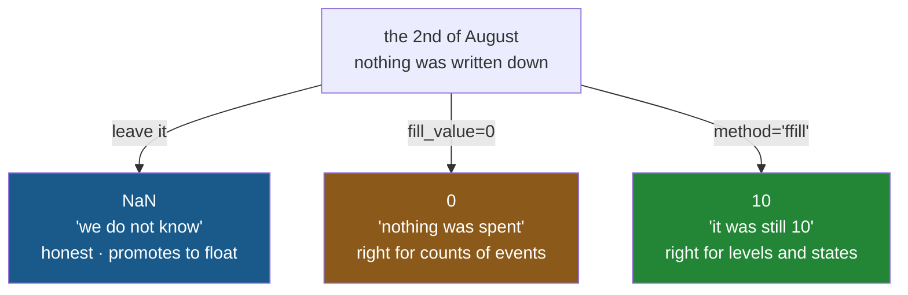

# 5.2 — `fill_value`, `method`, and the gap

## One-line answer

`fill_value=` puts one chosen value in every blank a reindex creates, `method="ffill"` carries the
previous value forward instead — and the difference matters because one of them is a statement about
missing data and the other is a statement about time.

---

## The story

The flat writes down what they spent each day.

They write on the first of the month and on the third, and forget the second entirely — not because
nothing was spent, and not because nothing happened, but because nobody wrote it down.

Somebody later makes a chart with one bar per day, and the second is blank.

Then two people argue about what should go there.

One says zero: no entry means no spending, so the bar should be flat on the floor.

The other says it should be the same as the first: the spending did not stop, the *recording* did,
and the last thing we actually know is what was true on the first.

They are both right, about different situations, and there is nothing in the notebook that says which
one this is. Whoever fills the gap is making a claim, and the two claims give different totals.

---

## The idea in plain language

A reindex creates blanks wherever you asked for a label that was not there
([5.1](5.1-reindex-say-the-index-you-want.md)). There are three things you can do about them, and
choosing between them is a decision about what the data means.

**Leave them.** The blank stays `NaN`, which honestly says "we do not know". It also promotes the
column to `float64` ([4.3](../04-alignment/4.3-the-nan-that-changed-the-dtype.md)) and makes `sum`
and `mean` disagree downstream
([2.5](../02-masks/2.5-the-mask-that-matched-nothing.md)). Honest and inconvenient.

**`fill_value=`.** One value, in every gap. `fill_value=0` says a missing entry means zero, which is
right for counts of things that were genuinely not bought, and wrong for a reading that was simply
not taken. Because no blank is ever created, **the dtype is preserved** — this is the only one of the
three that keeps `int64` as `int64`.

**`method=`.** Carry a neighbouring value into the gap. `"ffill"` — forward fill — takes the last
known value and repeats it forward; `"bfill"` takes the next known value backwards. This is a claim
about *continuity*: that the thing being measured persists between observations.

The word for filling gaps from neighbours is **interpolation** in general; `ffill` and `bfill` are its
simplest forms, the ones that copy rather than compute.

Two rules about `method=` that will save you an afternoon:

**It only makes sense on an ordered index.** "The previous value" means nothing unless there is a
previous. Dates, times, sorted numbers — fine. Item names in arbitrary order — meaningless, and
pandas will still do it.

**It requires the index to be sorted**, and pandas raises if it is not.

And the honest summary of when each is right: `fill_value=0` for **counts of events** — nothing
recorded means nothing happened. `ffill` for **states and levels** — a price, a stock level, a
temperature, which continue between readings. Getting this backwards is one of the most common
quiet errors in time-series work, and Day 33 meets it again properly.

---

## Why Setu needs it

- **[5.1](5.1-reindex-say-the-index-you-want.md)** made the gaps. This part fills them.
- **[4.3](../04-alignment/4.3-the-nan-that-changed-the-dtype.md)** is why `fill_value` matters beyond
  the values: it is the only option that keeps an integer column integral.
- **[5.4](5.4-align-and-the-boundary.md)** takes a `fill_value` too, for the same reason and with the
  same decision behind it.
- **Day 30** is missing data as a subject, where filling becomes **imputation** and the rule is that
  the imputer is fitted after the split (Principle 8). This part is the version you do by hand before
  a pipeline exists.
- **Day 33** resamples a time series to a regular frequency, which creates gaps at every missing
  period, and `ffill` against `fill_value` is the decision on every single one.

---

## The mechanism

The three options on the same gap:

```python
import pandas as pd

shop = pd.Series([2, 1, 6, 1], index=["milk", "bread", "eggs", "rice"], name="need")
shelf = ["milk", "eggs", "tea"]

blank = shop.reindex(shelf)
zeroed = shop.reindex(shelf, fill_value=0)
print("left blank:", blank.to_dict(), blank.dtype)
print("filled    :", zeroed.to_dict(), zeroed.dtype)
```

**Line by line:**

- `tea` is the gap: asked for, not present ([5.1](5.1-reindex-say-the-index-you-want.md)).
- `blank` leaves it `NaN`, and **the dtype is `float64`** — the promotion
  [4.3](../04-alignment/4.3-the-nan-that-changed-the-dtype.md) explained, triggered by one missing
  label out of three.
- `zeroed` never creates a blank, so **the dtype stays `int64`**. That is not a detail: a count column
  that stays a count survives every downstream check that compares against a schema
  ([Day 27, 5.3](../../../day-27-reading-and-writing/parts/05-the-module/5.3-the-round-trip-test.md)).
- **`fill_value` is applied during the reindex, not after it.** That is why it prevents the promotion
  rather than repairing it — the same distinction
  [4.3](../04-alignment/4.3-the-nan-that-changed-the-dtype.md) drew about `add(..., fill_value=)`.

```text
left blank: {'milk': 2.0, 'eggs': 6.0, 'tea': nan} float64
filled    : {'milk': 2, 'eggs': 6, 'tea': 0} int64
```

Now the case `method=` is for — a gap in a series of dates:

```python
spend = pd.Series([10, 30], index=pd.to_datetime(["2026-08-01", "2026-08-03"]), name="spend")
every_day = pd.date_range("2026-08-01", "2026-08-04")

print("as recorded:")
print(spend)
print()
print("every day, no fill:")
print(spend.reindex(every_day))
```

**Line by line:**

- `pd.to_datetime([...])` turns the two date strings into a `DatetimeIndex`, which is an **ordered**
  index — the condition `method=` needs.
- `pd.date_range("2026-08-01", "2026-08-04")` builds every day in that span, including both ends.
  This is the "fixed shelf" idea from [5.1](5.1-reindex-say-the-index-you-want.md) applied to dates,
  and it is how a sparse record becomes a regular series.
- The reindexed result has four rows where the input had two: the 2nd and the 4th are gaps.
- `Freq: D` appears in the output — pandas noticed the index is a regular daily range and recorded
  it. That is a real property, and Day 33 uses it.

```text
as recorded:
2026-08-01    10
2026-08-03    30
Name: spend, dtype: int64

every day, no fill:
2026-08-01    10.0
2026-08-02     NaN
2026-08-03    30.0
2026-08-04     NaN
Freq: D, Name: spend, dtype: float64
```

The two fill directions, which give different answers:

```python
print("ffill — carry the last known value forward:")
print(spend.reindex(every_day, method="ffill"))
print()
print("bfill — pull the next known value backward:")
print(spend.reindex(every_day, method="bfill"))
```

**Line by line:**

- `method="ffill"` — the 2nd takes the 1st's value of 10, and the 4th takes the 3rd's value of 30.
  **Every gap is filled**, because there is always something earlier once the first row is known.
- `method="bfill"` — the 2nd takes the 3rd's value of 30, and the 4th has **nothing after it**, so it
  stays `NaN`. That asymmetry is the practical reason `ffill` is the more common choice: gaps at the
  end of a series are the normal case, and only forward filling reaches them.
- Note the dtypes: `ffill` gives `int64` because it filled every gap and no blank survived; `bfill`
  gives `float64` because one blank remains
  ([4.3](../04-alignment/4.3-the-nan-that-changed-the-dtype.md)).
- Neither one **computed** anything. Both copied an existing value, which is why "the last known
  value" is a defensible claim and "the average of the neighbours" would be a different, stronger one.

```text
ffill — carry the last known value forward:
2026-08-01    10
2026-08-02    10
2026-08-03    30
2026-08-04    30
Freq: D, Name: spend, dtype: int64

bfill — pull the next known value backward:
2026-08-01    10.0
2026-08-02    30.0
2026-08-03    30.0
2026-08-04     NaN
Freq: D, Name: spend, dtype: float64
```

The three claims, side by side:



**Three different totals for the month, from one missing line.** The choice is yours and it is not a
formatting decision.

---

## When it breaks

**`method=` on an index that is not sorted:**

```text
$ uv run python -c "
import pandas as pd
s = pd.Series([1, 2, 3], index=['c', 'a', 'b'])
s.reindex(['a', 'b', 'c', 'd'], method='ffill')
" 2>&1 | tail -1
```

```text
ValueError: index must be monotonic increasing or decreasing
```

**What it means.** "Fill forward from the previous value" has no meaning when there is no previous —
an unsorted index has no notion of before and after. pandas raises rather than filling from whatever
happens to be above.

**This is a good error**, and it is the same demand [1.5](../01-label-and-position/1.5-the-slice-that-includes-its-end.md)
made about label slices: order-based operations need an ordered index, and
`index.is_monotonic_increasing` is how you check before you find out.

**`ffill` on data where it makes no sense — which does not fail:**

```text
$ uv run python -c "
import pandas as pd
shop = pd.Series([2, 6], index=['bread', 'milk'], name='need')
print(shop.reindex(['bread', 'eggs', 'milk', 'tea'], method='ffill').to_dict())
"
```

```text
{'bread': 2, 'eggs': 2, 'milk': 6, 'tea': 6}
```

**What it means.** The index is sorted — alphabetically — so pandas filled happily. The flat now needs
two eggs because eggs come after bread in the alphabet, and six tea because tea comes after milk.

**Every number here is nonsense and nothing raised.** The index was ordered, so the operation was
legal; it was ordered by *spelling*, which has nothing to do with the quantities. `method=` is only
meaningful when the index's order **means** something — time, sequence, a measured quantity — and
alphabetical order almost never does.

**The one that silently changes the answer — filling before aggregating:**

```text
$ uv run python -c "
import pandas as pd
spend = pd.Series([10, 30], index=pd.to_datetime(['2026-08-01', '2026-08-03']), name='spend')
days = pd.date_range('2026-08-01', '2026-08-04')
print('as recorded    : total', spend.sum(), 'over', len(spend), 'days')
print('reindexed, NaN : total', spend.reindex(days).sum(), 'over', len(days), 'days')
print('fill_value=0   : total', spend.reindex(days, fill_value=0).sum())
print('ffill          : total', spend.reindex(days, method='ffill').sum())
print('mean, NaN      :', spend.reindex(days).mean())
print('mean, zeros    :', spend.reindex(days, fill_value=0).mean())
"
```

```text
as recorded    : total 40 over 2 days
reindexed, NaN : total 40.0 over 4 days
fill_value=0   : total 40
ffill          : total 80
mean, NaN      : 20.0
mean, zeros    : 10.0
```

**What it means.** Six numbers, and the only thing that changed between them was what went in two
gaps.

The **totals**: `NaN` and `fill_value=0` both give 40, because `sum` skips blanks and adding zero
changes nothing. `ffill` gives **80** — double — because it invented two more days of spending.

The **means** are worse: 20.0 against 10.0, from the *same* data. `mean` skips blanks, so the `NaN`
version averaged over the two days that had values; the zero-filled version averaged over four. Both
are defensible answers to different questions and neither announces which question it answered.

**This is the practical reason to make the choice deliberately.** A total is fairly robust; an average
is not, and a chart of daily spending built on the wrong fill tells a different story about the
month.

---

## In production

**What a professional writes instead of the teaching version.** The fill rule is chosen per column,
because different columns mean different things:

```python
import pandas as pd

COUNTS = ["units", "orders"]
LEVELS = ["price", "stock_on_hand"]


def on_every_day(frame: pd.DataFrame, start: str, end: str) -> pd.DataFrame:
    """Reindex to every day in the range, filling counts with 0 and levels forward."""
    if not frame.index.is_monotonic_increasing:
        raise ValueError("index must be sorted by date before filling gaps")
    days = pd.date_range(start, end, name=frame.index.name)
    dense = frame.reindex(days)
    return dense.assign(
        **{name: dense[name].fillna(0) for name in COUNTS if name in dense},
        **{name: dense[name].ffill() for name in LEVELS if name in dense},
    )
```

**Line by line:**

- `COUNTS` and `LEVELS` are the decision, written down as data. **A single `method=` for a whole frame
  is almost always wrong**, because a frame usually holds both kinds of column.
- `is_monotonic_increasing` asserted first — the same guard as
  [1.5](../01-label-and-position/1.5-the-slice-that-includes-its-end.md), and the thing `method=`
  would otherwise raise about less helpfully.
- `pd.date_range(..., name=frame.index.name)` — the new index keeps the old one's **name**, so the
  reindexed frame still prints and joins the way the original did.
- `reindex(days)` first, creating all the gaps, then filling per column. Doing it in that order means
  one reindex rather than one per column.
- `.fillna(0)` and `.ffill()` rather than `reindex(..., fill_value=)` and `method=`, because the
  reindex has already happened and these operate on the result. They are the same two ideas under
  different names, which is worth knowing: **`fillna` and `ffill` are the after-the-fact forms.**
- `**{...}` — two dictionary comprehensions unpacked into `assign`'s keyword arguments, which is how
  you use `assign` with column names computed at run time
  ([3.2](../03-writing/3.2-the-new-column-that-was-a-mask.md)).
- `if name in dense` — the frame may not have every column, and a missing one should not raise here.

**What changes at scale.** Three things.

**`ffill` has no limit unless you give it one.** A single reading followed by a year of silence fills
the whole year with that reading, and the chart looks perfectly healthy. `ffill(limit=n)` stops after
`n` periods and leaves the rest blank, which is nearly always what was meant — **a stale value has a
shelf life**, and stating it turns a silent fabrication into a visible gap.

**Densifying a sparse series can be enormous.** A series with a thousand readings scattered over ten
years, reindexed to every minute, is five million rows of mostly repeated values. That is sometimes
exactly right and it is never accidental — check the length of the index you are about to reindex
onto before you do it.

**And filling before splitting is leakage.** `ffill` carries information forward in time, so filling a
gap in the training period with a value from the test period — which `bfill` does routinely — puts the
future into the past. Principle 8's rule that the split comes first applies to gap-filling exactly as
it does to scaling, and Day 30 makes it explicit.

**The failure that only appears with real data.** A dashboard reindexed sensor readings to every
minute and used `ffill`, which was correct: a temperature persists between readings. Then a sensor
failed and stopped reporting for eleven days. `ffill` carried its last reading across all eleven, the
dashboard showed a perfectly steady temperature, and **the alerting never fired** because the value
never moved out of range. The fix was `limit=` plus an explicit staleness check. **Forward fill
cannot distinguish "unchanged" from "not reporting"**, and that distinction is often the thing you
most wanted to know.

**The review comment a senior engineer leaves.** *"`reindex(days, method='ffill')` across the whole
frame — `units` is a count and should fill with 0, not carry yesterday's number forward. Split the
columns by meaning. And put a `limit=` on the ffill; right now a dead feed looks like a flat line."*

**The interview question.** *"You have gaps in a daily time series. How do you fill them?"* First say
that it depends on what the column means: a **count of events** fills with zero, because nothing
recorded means nothing happened; a **level or state** — a price, a stock figure, a temperature —
forward-fills, because it persists between observations. Then the three things that show you have
done it: `method=` needs a sorted index and raises otherwise; forward fill with no `limit` will
happily carry one reading across a year-long outage, so a dead feed looks like a flat line; and
filling changes what `mean` reports even when it does not change `sum`, because `mean` skips blanks
and counts zeros. If they push on correctness, the last point is that gap-filling before a
train/test split leaks the future backwards.

---

## Check yourself

```bash
uv run python -c "
import pandas as pd
spend = pd.Series([10, 30], index=pd.to_datetime(['2026-08-01', '2026-08-03']), name='spend')
days = pd.date_range('2026-08-01', '2026-08-04')
for label, s in [
    ('left blank ', spend.reindex(days)),
    ('fill_value ', spend.reindex(days, fill_value=0)),
    ('ffill      ', spend.reindex(days, method='ffill')),
    ('bfill      ', spend.reindex(days, method='bfill')),
]:
    print(label, 'sum', s.sum(), '| mean', round(s.mean(), 2), '|', str(s.dtype))
"
```

Four fills, four totals, four averages, and one of the dtypes is not like the others. Say which fill
you would choose for a column called `orders`, and which for a column called `price`.

**Answer out loud, without scrolling up:**

> Say when `fill_value=0` is right and when `ffill` is right, in terms of what the column measures.
> Then say why `method=` raises on an unsorted index, and name the argument that stops a forward fill
> running forever.

---

**Next:** [5.3 — Duplicate labels](5.3-duplicate-labels.md).
