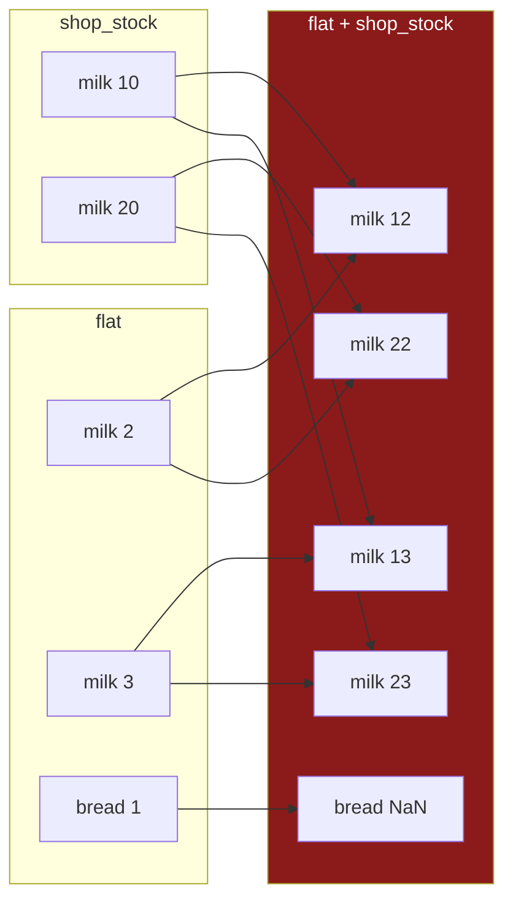

# 5.3 — Duplicate labels

## One-line answer

pandas lets an index contain the same label twice, and that one permission changes three things at
once: `loc` returns a frame where it used to return a row, `reindex` refuses outright, and an
alignment multiplies the matching rows together instead of pairing them.

---

## The story

Somebody adds milk to the list. Somebody else, who has not looked at the list today, also adds milk.

Now there are two milk lines. Nobody notices, because the list is on a fridge and people read the
line they came for.

The trouble starts when the list is used rather than read. Asked "how much milk do we need", the
answer is no longer a number — it is two numbers, and whoever asked has to decide what to do with
that.

Then the flat compares this list against the shop's stock sheet, which also happens to have milk
twice, because the shop keeps two brands.

Two milk lines against two milk lines gives four comparisons. Not two. Four — every combination of
one from each side. Nobody wanted four, nobody wrote four, and the list of results is longer than
either input.

---

## The idea in plain language

A pandas index is not required to be unique. Two rows can carry the same label, and pandas will not
stop you.

That is deliberate — some data genuinely is like that, and a `groupby` result or a `concat` of two
frames produces duplicates naturally. But it breaks three assumptions that everything else on this
day quietly relies on.

**`loc` changes what it returns.** With a unique index, `frame.loc["milk"]` is one row, so it gives a
Series ([1.2](../01-label-and-position/1.2-loc-by-label.md)). With `milk` appearing twice it is two
rows, so it gives a **DataFrame**. The type of the result depends on the data, not on the code.

**`reindex` refuses.** `reindex(["milk"])` cannot know which milk you meant, so it raises rather than
picking one ([5.1](5.1-reindex-say-the-index-you-want.md)). That means every technique section 5 has
offered is unavailable on a frame with duplicates.

**Alignment multiplies.** [4.4](../04-alignment/4.4-the-index-is-the-join-key.md) established that
alignment is a join, and a join on a duplicated key produces the **cartesian product** of the matching
rows — two against two gives four. This is the one that grows.

There is a subtlety in that last one which is worth stating because it makes the behaviour look
inconsistent. **If the two indexes are exactly equal** — same labels, same order, same number of
repeats — pandas skips the join entirely and lines them up positionally, so two-against-two gives
two. Any difference at all, and you are back to the product. So the same operation can behave two
ways depending on data you did not look at.

The practical position to take is simple: **a duplicated index is a bug until proven otherwise.**
Check for it at the boundary, where the data enters, rather than discovering it three steps later
when a frame has quietly grown.

---

## Why Setu needs it

- **[5.1](5.1-reindex-say-the-index-you-want.md)** raises on duplicates, so this is the condition that
  stops every reindexing technique working.
- **[1.2](../01-label-and-position/1.2-loc-by-label.md)** warned that `loc`'s return type can depend
  on the data. This is the reason.
- **[4.4](../04-alignment/4.4-the-index-is-the-join-key.md)** listed uniqueness as a rule for join
  keys. This is what breaking it costs.
- **[6.1](../06-the-module/6.1-the-select-module.md)** asserts uniqueness in the module's entry
  point, which is where such a check belongs.
- **Day 32**'s `merge` has the same explosion with the same cause, on a column key rather than an
  index, and `validate="one_to_one"` is the argument that catches it there.

---

## The mechanism

The duplicated list, and the first thing that changes:

```python
import pandas as pd

flat = pd.Series([2, 1, 3], index=["milk", "bread", "milk"], name="need")
tidy = pd.Series([2, 1], index=["milk", "bread"], name="need")

print(flat)
print()
print("unique?", flat.index.is_unique, "and", tidy.index.is_unique)
print("loc on the tidy one:", type(tidy.loc["milk"]).__name__)
print("loc on the flat one:", type(flat.loc["milk"]).__name__)
```

**Line by line:**

- `flat` has `milk` twice, which pandas builds without complaint. Nothing about constructing this
  Series is an error.
- `index.is_unique` — **the one-line check**, and the only thing standing between you and everything
  below. pandas caches the answer, so asking is cheap.
- `type(...).__name__` on both `loc` results: the tidy one gives a **scalar** — one label, one row, one
  column, so one value — and the duplicated one gives a **Series** of the two matching values.
- **The same expression, two return types, decided by the data.** Code written against the first works
  until the day a duplicate arrives, and then fails somewhere downstream with a message about the
  wrong type.

```text
milk     2
bread    1
milk     3
Name: need, dtype: int64

unique? False and True
loc on the tidy one: int64
loc on the flat one: Series
```

Then `reindex`, which simply stops:

```text
$ uv run python -c "
import pandas as pd
flat = pd.Series([2, 1, 3], index=['milk', 'bread', 'milk'], name='need')
flat.reindex(['milk', 'bread'])
" 2>&1 | tail -1
```

```text
ValueError: cannot reindex on an axis with duplicate labels
```

**What it means.** `reindex(["milk"])` is asking for one row called `milk` and there are two. pandas
cannot choose and will not guess. The message is clear and it names the real problem, which is more
than most of this day's failures manage.

Now the one that grows:

```python
shop_stock = pd.Series([10, 20], index=["milk", "milk"], name="need")
combined = flat + shop_stock
print(combined)
print()
print("lengths:", len(flat), "+", len(shop_stock), "->", len(combined))
```

**Line by line:**

- `shop_stock` has `milk` twice as well — two brands, which is a perfectly reasonable thing for a shop
  to have.
- `flat + shop_stock` — an alignment, so a join
  ([4.4](../04-alignment/4.4-the-index-is-the-join-key.md)). `milk` matches `milk`, and there are two
  on each side.
- **Two against two gives four**: `2+10`, `2+20`, `3+10`, `3+20`. Every combination, which is what a
  join on a duplicated key means.
- `bread` is on one side only, so it is `NaN` as usual
  ([4.1](../04-alignment/4.1-two-lists-different-items.md)).
- Three rows plus two rows gave **five**, and four of them are about milk.

```text
bread     NaN
milk     12.0
milk     22.0
milk     13.0
milk     23.0
Name: need, dtype: float64

lengths: 3 + 2 -> 5
```

The multiplication, drawn:



**Four arrows into four rows from two values on each side.** Two duplicates each is four; ten each
would be a hundred.

And the inconsistency that makes it hard to spot:

```python
identical_a = pd.Series([1, 2], index=["x", "x"])
identical_b = pd.Series([10, 20], index=["x", "x"])
different_a = pd.Series([1, 2], index=["x", "x"])
different_b = pd.Series([10, 20, 30], index=["x", "x", "x"])

print(
    "equal indexes    :", (identical_a + identical_b).tolist(), "->", len(identical_a + identical_b)
)
print("unequal indexes  :", len(different_a + different_b), "rows")
```

**Line by line:**

- The first pair have **exactly equal** indexes: same label, same count, same order. pandas detects
  that and pairs them **positionally**, giving two rows — `1+10` and `2+20`.
- The second pair differ only in how many times `x` appears. That is enough for pandas to fall back to
  the join, and two against three gives six.
- **The same operator, on data that differs only in a count you cannot see in a printout.** This is
  why a duplicated index is worth catching at the boundary rather than reasoning about at each use:
  the rule is knowable but it depends on a property nobody checks.

```text
equal indexes    : [11, 22] -> 2
unequal indexes  : 6 rows
```

---

## When it breaks

**The return type that changed under a caller:**

```text
$ uv run python -c "
import pandas as pd
def price_of(shop, item):
    return shop.loc[item] * 1.2
tidy = pd.Series([1.15, 1.40], index=['milk', 'bread'], name='price')
flat = pd.Series([1.15, 1.40, 1.10], index=['milk', 'bread', 'milk'], name='price')
print('tidy:', price_of(tidy, 'milk'))
print('flat:', price_of(flat, 'milk'))
print('type:', type(price_of(flat, 'milk')).__name__)
"
```

```text
tidy: 1.38
flat: milk    1.38
milk    1.32
Name: price, dtype: float64
type: Series
```

**What it means.** A function documented as returning a price returned **two prices**, with no error.
The arithmetic worked — multiplying a Series by 1.2 is perfectly legal — so the wrong type travelled
onward. A caller writing `f"£{price_of(shop, item):.2f}"` gets a `TypeError` several frames away from
the cause; a caller writing it into a JSON response gets an object where a number was expected.

**This is [1.2](../01-label-and-position/1.2-loc-by-label.md)'s warning made concrete**, and it is the
strongest argument for either asserting uniqueness at load or using `loc[[item]]` and handling a frame
consistently.

**A duplicate that arrived from a concat:**

```text
$ uv run python -c "
import pandas as pd
week1 = pd.Series([2, 1], index=['milk', 'bread'], name='need')
week2 = pd.Series([3, 1], index=['milk', 'rice'], name='need')
both = pd.concat([week1, week2])
print(both.to_dict())
print('rows:', len(both), '| unique index?', both.index.is_unique)
print('now add the shop stock:')
stock = pd.Series([10], index=['milk'], name='need')
print('result rows:', len(both + stock))
"
```

```text
{'milk': 3, 'bread': 1, 'rice': 1}
rows: 4 | unique index? False
now add the shop stock:
result rows: 4
```

**What it means.** Read the first two lines against each other. `to_dict()` says three entries;
`len` says **four rows**. A dictionary cannot hold the same key twice, so one of the two `milk` rows
was silently lost in the conversion — which is worth knowing on its own, because `to_dict()` is a
common way to inspect a Series and it hides exactly this problem.

The duplicate came from `pd.concat`, which stacks and **does not check**. That is the usual origin:
nobody wrote a duplicated index, it appeared when two periods were stacked. `ignore_index=True` on the
concat, or a uniqueness assertion after it, is where this gets caught.

**The one that is correct and looks wrong — `groupby` output:**

```text
$ uv run python -c "
import pandas as pd
sales = pd.DataFrame({
    'aisle': ['07', '07', '03'],
    'item': ['milk', 'eggs', 'bread'],
    'spend': [2.30, 1.92, 1.40],
})
by_aisle = sales.set_index('aisle')
print('index unique?', by_aisle.index.is_unique)
print(by_aisle.groupby(level=0)['spend'].sum().to_dict())
print('grouped index unique?', by_aisle.groupby(level=0)['spend'].sum().index.is_unique)
"
```

```text
index unique? False
{'03': 1.4, '07': 4.22}
grouped index unique? True
```

**What it means.** Here the duplicated index is entirely correct — two items really are in aisle 07 —
and it is exactly what makes the `groupby` meaningful. **Duplicates are not always a bug**, and the
distinction is whether the index is meant to *identify* a row or to *categorise* it.

The useful rule: an index used as a **key** must be unique; an index used as a **grouping** need not
be. And notice that the grouped result *is* unique — grouping is one of the standard ways to get back
to a usable key. Day 31 is where this becomes the main tool.

---

## In production

**What a professional writes instead of the teaching version.** Uniqueness is asserted where the data
enters, once, with a message that names the offenders:

```python
import pandas as pd


def assert_unique_index(frame: pd.DataFrame, name: str = "frame") -> pd.DataFrame:
    """Return `frame` unchanged, or raise naming the duplicated labels."""
    if frame.index.is_unique:
        return frame
    repeats = frame.index[frame.index.duplicated(keep=False)]
    counts = repeats.value_counts()
    raise ValueError(
        f"{name} has {len(counts)} duplicated label(s), "
        f"worst: {counts.head(3).to_dict()}; total extra rows: {len(repeats) - len(counts)}"
    )
```

**Line by line:**

- It returns the frame, so it chains into a pipeline rather than needing its own statement — the same
  design as Day 26's `assert_schema`
  ([Day 26, 5.2](../../../day-26-frames-and-copy-on-write/parts/05-the-module/5.2-asserting-the-schema.md)).
- `is_unique` first and return early, because that is the case that runs every time and it is cached.
- `duplicated(keep=False)` — **`keep=False` marks *every* copy**, not just the second onward, which is
  what you want in a message. The default `keep="first"` would report one fewer of each.
- `.value_counts()` then `.head(3)` — the **worst offenders and how many of each**, rather than a list
  that could be a million labels long. An exception has to fit in a log line to be useful.
- `len(repeats) - len(counts)` — the number of rows that would be *extra* after a self-join, which is
  the number that actually predicts how badly the next alignment will grow.
- `name` as a parameter, because this will be called on several frames and "frame has duplicates" does
  not say which.

**What changes at scale.** Three things.

**The explosion is multiplicative and it is fast.** A key appearing ten times on each side gives a
hundred rows where two were expected. On a frame where a handful of keys are duplicated a few dozen
times, a join can turn ten million rows into several hundred million and exhaust memory — and the
traceback will point at the join, not at whatever produced the duplicates.

**`is_unique` is cached, so check it often.** The first call is a linear scan; after that pandas
remembers, until the index changes. That makes an assertion at every pipeline boundary essentially
free, and there is no reason to be sparing with them.

**And the fix is usually upstream.** Duplicates come from a `concat` of overlapping periods, a join
that already exploded, or a source that genuinely emits repeats. Deduplicating at the point of use —
`frame[~frame.index.duplicated()]` — is a patch that hides the cause and picks an arbitrary winner.
`groupby(level=0).sum()` at least states what should happen to the repeats, and fixing the source
states it best.

**The failure that only appears with real data.** A nightly job concatenated the day's file onto the
running history, keyed by transaction id. A retry in the upstream system delivered one file twice, so
a few thousand ids appeared twice. Nothing raised — `concat` does not check — and the next step joined
that history to a customer table. **Every duplicated transaction matched twice**, revenue for those
ids was double-counted, and the daily total was about two per cent high. It looked like growth. The
duplicate check that would have caught it is one line and it was added afterwards, which is how these
things usually go.

**The review comment a senior engineer leaves.** *"`pd.concat([history, today])` — nothing here
guarantees a unique index afterwards, and the next step joins on it. Assert `index.is_unique` after
the concat, or use `ignore_index=True` if the index is not meaningful. Also `df.loc[key]` on line 40
returns a Series rather than a scalar the moment a duplicate appears; use `loc[[key]]` and handle a
frame."*

**The interview question.** *"Can a pandas index have duplicates, and what breaks if it does?"* Yes, it
can, and three things break. `loc` returns a DataFrame where it returned a Series, so the **return
type depends on the data**; `reindex` raises outright, so every reindexing technique becomes
unavailable; and alignment does a **cartesian product** of the matching rows, so two duplicates on
each side give four rows and the frame grows silently. Then the two things that show experience:
duplicates usually arrive from `concat` or a previous join rather than being written deliberately, and
they are not always a bug — an index used for **grouping** is expected to repeat, while an index used
as a **key** must not. The check is `index.is_unique`, it is cached, and it belongs at every boundary.

---

## Check yourself

```bash
uv run python -c "
import pandas as pd
flat = pd.Series([2, 1, 3], index=['milk', 'bread', 'milk'], name='need')
stock = pd.Series([10, 20], index=['milk', 'milk'], name='need')
print('unique?      :', flat.index.is_unique)
print('loc type     :', type(flat.loc['milk']).__name__)
print('add lengths  :', len(flat), '+', len(stock), '->', len(flat + stock))
print('to_dict hides:', flat.to_dict(), 'but len is', len(flat))
try:
    flat.reindex(['milk'])
except ValueError as e:
    print('reindex      :', e)
"
```

`to_dict()` reports three entries for a four-row Series. Say what happened to the fourth, and why that
makes `to_dict()` a poor way to check a Series you suspect.

**Answer out loud, without scrolling up:**

> Name the three things a duplicated index changes. Then say what two duplicates on each side of an
> addition produce, and give the one-line check that would have caught it before the addition ran.

---

**Next:** [5.4 — `align`, and the boundary](5.4-align-and-the-boundary.md).
