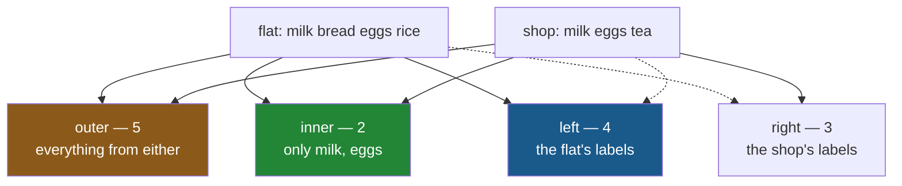

# 5.4 — `align`, and the boundary where you decide

## One-line answer

`align` does to two objects what `reindex` does to one — puts both on a shared index and hands them
back — and its `join=` argument is where you finally get to say which of the four join types you
meant, instead of letting `+` pick the union for you.

---

## The story

The flat and the shop both keep lists, and every week somebody has to put them side by side.

For a while this is done by adding them and looking at what comes out. When the result has more lines
than either list, somebody works backwards to find out why. When it has blanks, somebody works out
which side they came from.

Eventually somebody does the obvious thing: before comparing anything, write both lists out onto one
agreed set of item names. Same names, same order, both sheets.

After that there is nothing to work out. The two sheets line up because they were made to line up,
and any blank on either sheet is a fact about that list rather than a puzzle about the comparison.

The work is the same. It just happens once, on purpose, at the start — rather than being discovered
afterwards from the shape of the answer.

---

## The idea in plain language

`align` takes two labelled objects and returns **two** objects, both on the same index.

```
left_aligned, right_aligned = left.align(right, join="inner")
```

Everything after that line is safe. The two results have identical indexes, so any operation between
them is a no-op alignment ([4.2](../04-alignment/4.2-alignment-is-automatic.md)) — no surprise rows,
no surprise length, and blanks only where you already know there are blanks.

The `join=` argument takes the four names a database uses:

| `join=` | keeps | the result's length, on a **unique** index |
|---|---|---|
| `"outer"` | every label from either side | can **grow** |
| `"inner"` | only labels in both | can only shrink |
| `"left"` | exactly the left side's labels | exactly the left's |
| `"right"` | exactly the right side's labels | exactly the right's |

**That right-hand column holds only while both indexes are unique.** With a duplicated label, every
one of the four can grow, `inner` included — *When it breaks* has the measurement.

**`"outer"` is the default, and it is what every operator does.** So `a + b` is
`a.align(b, join="outer")` followed by an addition — which means section 4's entire subject was a
default nobody chose.

Knowing that, the choice becomes easy to reason about:

- **`"inner"`** when you only want rows both sides know about. On unique indexes it cannot grow, which
  makes it the safe default when you expect a match.
- **`"left"`** when one side is the authority — your customers, your products, this month's rows — and
  the other is a lookup. This is the most common one in real pipelines.
- **`"outer"`** when you genuinely want everything and are prepared to handle the blanks.
- **`"right"`** rarely; it is `"left"` with the arguments swapped, and swapping them reads better.

`align` also takes `fill_value=` and, for frames, an `axis=` to align on rows only, columns only, or
both. And it inherits [5.3](5.3-duplicate-labels.md)'s behaviour rather than protecting you from it:
**a duplicated index does not make `align` raise — it makes the result multiply**, on every join type
including `inner`.

---

## Why Setu needs it

- **[5.1](5.1-reindex-say-the-index-you-want.md)** is this for one object. `align` is the two-object
  version and it is what you usually want.
- **[4.4](../04-alignment/4.4-the-index-is-the-join-key.md)** named the four join types. This is where
  you get to use them.
- **[6.1](../06-the-module/6.1-the-select-module.md)** builds the day's module around one aligning
  function, because that is the shape that makes the rest testable.
- **Day 32**'s `merge` is this with a column key and more options, and `how=` there is `join=` here
  under a different name.
- **Day 108** compares a model's predictions against the truth, two Series that must be on the same
  index. Aligning them explicitly is the difference between a real score and a coincidence.

---

## The mechanism

Two lists, put on one index deliberately:

```python
import pandas as pd

flat = pd.Series([2, 1, 6, 1], index=["milk", "bread", "eggs", "rice"], name="need")
shop = pd.Series([5, 9, 4], index=["milk", "eggs", "tea"], name="stock")

left, right = flat.align(shop, join="outer")
print("left:")
print(left)
print()
print("right:")
print(right)
print()
print("same index?", left.index.equals(right.index))
```

**Line by line:**

- `flat.align(shop, join="outer")` returns **a tuple of two objects**, which is why the left-hand side
  unpacks into two names ([Day 8, 1.4](../../../day-08-containers/parts/01-sequences/1.4-unpacking-and-star-rest.md)).
  Forgetting the unpacking is the first mistake everybody makes.
- Both results are on the **union** of the two indexes — five labels — so `left` has gained a blank
  `tea` and `right` has gained blanks for `bread` and `rice`.
- Neither keeps its original length; both are now five rows.
- `left.index.equals(right.index)` — **the property that makes everything afterwards safe.** Once this
  is `True`, no later operation between them can produce a surprise.
- Both are `float64`, because both gained blanks
  ([4.3](../04-alignment/4.3-the-nan-that-changed-the-dtype.md)).

```text
left:
bread    1.0
eggs     6.0
milk     2.0
rice     1.0
tea      NaN
Name: need, dtype: float64

right:
bread    NaN
eggs     9.0
milk     5.0
rice     NaN
tea      4.0
Name: stock, dtype: float64

same index? True
```

The four join types, on the same pair:

```python
for how in ["outer", "inner", "left", "right"]:
    a, b = flat.align(shop, join=how)
    print(f"{how:6} -> {len(a):2} rows  {a.index.tolist()}")
```

**Line by line:**

- The loop runs the same call four times, changing only `join=`, so the four answers are directly
  comparable.
- `outer` gives five — the union, and the only one that is longer than either input.
- `inner` gives two — `milk` and `eggs`, the labels both sides have. **This is the one that cannot
  surprise you**, as long as neither index has a duplicate.
- `left` gives four — exactly `flat`'s labels, in `flat`'s order. The shop's `tea` is dropped because
  the flat does not stock it.
- `right` gives three — exactly `shop`'s labels.
- `len(a)` printed for each, because the length is the thing the join type decides.

```text
outer  ->  5 rows  ['bread', 'eggs', 'milk', 'rice', 'tea']
inner  ->  2 rows  ['milk', 'eggs']
left   ->  4 rows  ['milk', 'bread', 'eggs', 'rice']
right  ->  3 rows  ['milk', 'eggs', 'tea']
```

**Only `outer` sorted its result.** The other three kept an existing order — `left` and `right` because
they reuse one side's index outright, and `inner` because it takes the left side's labels and drops
the ones that did not match. That is the signal
[4.4](../04-alignment/4.4-the-index-is-the-join-key.md) mentioned: **a sorted result means pandas had
to build a new index**, which only happens when it needs labels neither side's order covers.

The four joins, drawn:



**The solid arrows are the side whose labels survive.** That is all the four names mean.

And the payoff — a comparison you can trust:

```python
left, right = flat.align(shop, join="inner")
print("short by:", (right - left).to_dict())
print("rows compared:", len(left), "of", len(flat), "on the list")
print("not stocked  :", flat.index.difference(shop.index).tolist())
```

**Line by line:**

- `join="inner"` because the question is "of the things the shop stocks, how do we stand" — a question
  only meaningful where both sides have data.
- `right - left` — subtraction on two objects that are **already aligned**, so it is arithmetic and
  nothing else. No blanks appear, no rows are invented, and the dtype survives.
- `len(left)` against `len(flat)` — **the honest reporting.** Two of the four items were comparable,
  and saying so is what stops the answer being read as covering the whole list.
- `index.difference(...)` names the two that were dropped, which is
  [5.1](5.1-reindex-say-the-index-you-want.md)'s audit line applied to a join. **An inner join is a
  filter, and a filter you do not report is a filter nobody knows about.**

```text
short by: {'milk': 3, 'eggs': 3}
rows compared: 2 of 4 on the list
not stocked  : ['bread', 'rice']
```

---

## When it breaks

**Forgetting that it returns two things:**

```text
$ uv run python -c "
import pandas as pd
a = pd.Series([1, 2], index=['x', 'y'])
b = pd.Series([10, 20], index=['x', 'z'])
aligned = a.align(b, join='inner')
print(type(aligned).__name__, 'of length', len(aligned))
print(aligned[0].to_dict())
aligned.sum()
" 2>&1 | tail -1
```

```text
AttributeError: 'tuple' object has no attribute 'sum'
```

**What it means.** `align` returned a **tuple**, and a tuple has no `sum`. The message is clear once
you know what happened and baffling if you thought you had a Series. The fix is to unpack:
`left, right = a.align(b, join="inner")`.

**A duplicated index, which `align` does not protect you from:**

```text
$ uv run python -c "
import pandas as pd
a = pd.Series([1, 2, 3], index=['x', 'y', 'x'])
c = pd.Series([10, 20], index=['x', 'x'])
for how in ['outer', 'inner', 'left', 'right']:
    left, right = a.align(c, join=how)
    print(f'{how:6} -> {len(left)} rows, index {left.index.tolist()}')
"
```

```text
outer  -> 5 rows, index ['x', 'x', 'x', 'x', 'y']
inner  -> 4 rows, index ['x', 'x', 'x', 'x']
left   -> 5 rows, index ['x', 'x', 'y', 'x', 'x']
right  -> 4 rows, index ['x', 'x', 'x', 'x']
```

**What it means.** No error on any of the four. Two `x` labels on one side and two on the other gave
four `x` rows, exactly as [5.3](5.3-duplicate-labels.md)'s addition did — because `align` performs the
same join.

Read the `inner` row carefully, because it undermines the one guarantee this part has been offering.
**An inner join grew the result**: two rows on each side became four. "Inner can only shrink" is true
of *unique* indexes and of nothing else. `left` is worse still — five rows from a three-row left side,
so even the join that is supposed to preserve your rows exactly did not.

This is why [5.3](5.3-duplicate-labels.md) said a duplicated index is a bug until proven otherwise,
and why the production function below checks uniqueness itself rather than trusting `align` to
complain.

**The one that does not fail — an inner join that quietly kept nothing:**

```text
$ uv run python -c "
import pandas as pd
predictions = pd.Series([0.9, 0.2, 0.7], index=['id-1', 'id-2', 'id-3'], name='pred')
truth = pd.Series([1, 0, 1], index=[1, 2, 3], name='true')
p, t = predictions.align(truth, join='inner')
print('rows compared:', len(p))
print('accuracy     :', (p.round() == t).mean())
"
```

```text
rows compared: 0
accuracy     : nan
```

**What it means.** Predictions keyed by string ids, truth keyed by integers
([4.4](../04-alignment/4.4-the-index-is-the-join-key.md)'s dtype mismatch). The inner join found
nothing in common, both sides came back empty, and the accuracy is `nan` because the mean of nothing
is undefined ([2.5](../02-masks/2.5-the-mask-that-matched-nothing.md)).

**An inner join cannot grow, which is what makes it safe — and it can shrink to nothing, which is what
makes it dangerous.** A model evaluation that silently scores zero rows reports `nan` rather than
raising, and `nan` in a metrics dashboard is easy to read as "not computed yet". **`len` after an
inner join is not optional.**

---

## In production

**What a professional writes instead of the teaching version.** The alignment is a named step, the
join type is a parameter, and the shrinkage is reported:

```python
import pandas as pd


def compare(
    ours: pd.Series, theirs: pd.Series, join: str = "inner", min_rows: int = 1
) -> pd.DataFrame:
    """Put two Series side by side on one index. Refuses a comparison of too few rows."""
    for name, series in (("ours", ours), ("theirs", theirs)):
        if not series.index.is_unique:
            raise ValueError(f"{name} has a duplicated index; deduplicate before comparing")
    left, right = ours.align(theirs, join=join)
    if len(left) < min_rows:
        raise ValueError(
            f"only {len(left)} rows after a {join} join of {len(ours)} and {len(theirs)}; "
            f"ours has {ours.index.dtype}, theirs has {theirs.index.dtype}"
        )
    return pd.DataFrame({"ours": left, "theirs": right})
```

**Line by line:**

- The uniqueness check on **both** sides first, because `align` raises with a message about `reindex`
  that does not say which side was at fault ([5.3](5.3-duplicate-labels.md)).
- `join` as a parameter with `"inner"` as the default — the opposite of pandas' `"outer"`, and
  deliberately so: this function is for comparing, and comparing rows that exist on only one side is
  not comparing.
- `min_rows` — **the guard against the silent-empty failure above.** Defaulting to 1 means "at least
  something matched", and a real pipeline sets it to a proportion of the input.
- The error message carries **both dtypes**, because a key-type mismatch is the most common cause of a
  zero-row join and the message can rule it in or out without a second run.
- Returning a **two-column frame** rather than the tuple: both series are on one index by now, so a
  frame is the natural container, and the caller gets `result["ours"] - result["theirs"]` for free.
- Nothing here fills blanks. With an inner join there are none from the alignment, and a blank that
  was already in an input should survive to be noticed rather than be quietly patched
  ([5.2](5.2-fill-value-method-and-the-gap.md)).

**What changes at scale.** Three things.

**Align once, operate many times.** Every operator realigns from scratch, so a chain of ten
operations between two mismatched frames does the union ten times. Aligning once up front turns nine
of those into the fast path where pandas sees identical indexes and skips the work
([4.2](../04-alignment/4.2-alignment-is-automatic.md)). On large frames that is the difference
between a slow pipeline and a quick one, and it costs one line.

**`join="left"` is the workhorse and the one to prefer.** It cannot grow the frame and it cannot lose
your rows — the two failure modes that matter. Blanks appear where the lookup had nothing, which is
information rather than a problem. Most production joins should be left joins with a reported blank
count, and reaching for `outer` should feel like a decision.

**And alignment is the wrong place for large data.** Aligning two hundred-million-row frames
materialises both on the union index before anything is computed. A database, or DuckDB on Day 35,
does the join with an index and streams the result — the same observation
[Day 27, 4.2](../../../day-27-reading-and-writing/parts/04-sql/4.2-read-sql-and-the-connection.md)
made about aggregation, applied to joins.

**The failure that only appears with real data.** A model evaluation aligned predictions against
labels with an inner join and reported accuracy nightly. A schema change made the label file's key a
zero-padded string while predictions kept the integer. The join matched **nothing**, both sides came
back empty, accuracy was `nan`, and the dashboard rendered `nan` as a blank cell — which looked like
the job had not run yet. **Three weeks of a model in production with no evaluation at all**, and no
error anywhere. The fix was `min_rows` and an alert on it.

**The review comment a senior engineer leaves.** *"`preds - actuals` — these come from different
sources and nothing guarantees the same index. Use `align(join='inner')` explicitly and assert the
row count; right now a key mismatch gives you a longer frame of `NaN` and a metric of `nan`, and
neither of those raises."*

**The interview question.** *"How do you make sure two pandas objects line up before combining them?"*
`align`, with an explicit `join=`, which returns both objects on a shared index — after which any
operation between them is safe because the indexes are identical. Then the two things that show you
have used it: **`outer` is the default and it is the only join that can make the frame longer**, so
`inner` or `left` is usually what you want; and an **inner join can shrink to zero rows without
raising**, giving metrics of `nan` that look like missing data rather than a broken key. So the row
count after aligning is the assertion that matters, and the error should print both indexes' dtypes,
because a type mismatch is the usual cause.

---

## Check yourself

```bash
uv run python -c "
import pandas as pd
flat = pd.Series([2, 1, 6, 1], index=['milk', 'bread', 'eggs', 'rice'], name='need')
shop = pd.Series([5, 9, 4], index=['milk', 'eggs', 'tea'], name='stock')
for how in ['outer', 'inner', 'left', 'right']:
    a, b = flat.align(shop, join=how)
    print(f'{how:6} {len(a):2} rows  blanks: left {int(a.isna().sum())} right {int(b.isna().sum())}')
print('plain a + b  :', len(flat + shop), 'rows')
"
```

One of the four join types gives the same row count as the plain `+`. Say which, and say what that
tells you about what `+` has been doing all along.

**Answer out loud, without scrolling up:**

> `align` returns two things. Say what they are and what is true of both of them. Then name the join
> type that can make a frame longer and the one that can shrink it to nothing, and say which
> assertion catches each.

---

**Next:** [6.1 — `src/setu/select.py`, the day's module](../06-the-module/6.1-the-select-module.md).
