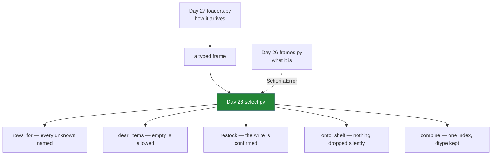

# 6.1 — `src/setu/select.py`: selection with the checks built in

## One-line answer

The day's module is the answer to a single question — *how do you write selection code whose failures
cannot be silent?* — and every function in it pairs an operation from this day with the one-line check
that turns its quiet failure into a sentence.

---

## The story

Everything on this day has failed the same way.

A filter matched nothing and gave an empty frame. A write went to a copy and vanished. Two lists were
added and the result was longer than either. A reindex dropped two rows. A join found nothing in
common. Not one of them raised an exception; every one of them produced a plausible-looking object
and let the program carry on.

The flat's version of this is somebody coming back from the shop with an empty bag, or two of
something, or nothing at all, and nobody being able to say afterwards which instruction went wrong.

The fix is not to be more careful. Being careful is what everybody was already doing. The fix is to
write down, once, what each operation is supposed to produce — and then check it, every time,
automatically.

---

## The idea in plain language

`src/setu/select.py` is one file with a rule: **every function that can fail silently checks itself.**

Nothing in it is clever. Each function is one of this day's operations plus the assertion that catches
its known failure mode:

| the function | the operation | the check it adds |
|---|---|---|
| `assert_unique_index` | — | the precondition everything else assumes ([5.3](../05-reindexing/5.3-duplicate-labels.md)) |
| `rows_for` | `loc` with a list ([1.2](../01-label-and-position/1.2-loc-by-label.md)) | every unknown label named at once |
| `dear_items` | a mask ([2.2](../02-masks/2.2-selecting-with-a-mask.md)) | none — empty is a valid answer, and the docstring says so |
| `flag` | `assign` ([3.2](../03-writing/3.2-the-new-column-that-was-a-mask.md)) | none needed; it cannot mutate |
| `restock` | `.loc` assignment ([3.1](../03-writing/3.1-assigning-through-loc.md)) | the write is confirmed to have landed |
| `onto_shelf` | `reindex` ([5.1](../05-reindexing/5.1-reindex-say-the-index-you-want.md)) | nothing was dropped without being named |
| `combine` | `align` ([5.4](../05-reindexing/5.4-align-and-the-boundary.md)) | one shared index, and the dtype survives |

Two of those rows say **none**, and that is as much a decision as the others. `dear_items` returning
nothing is correct ([2.5](../02-masks/2.5-the-mask-that-matched-nothing.md)) and a function that
raised on it would be wrong. `flag` uses `assign`, so there is no mutation to verify. **Knowing where
a check is not needed is the other half of knowing where one is.**

The module also builds on Day 27's rather than repeating it. It imports `SchemaError`
([Day 26, 5.1](../../../day-26-frames-and-copy-on-write/parts/05-the-module/5.1-the-shopping-list-module.md))
rather than inventing a third exception meaning "this frame is wrong", and it assumes the frame it is
handed came through Day 27's loader
([Day 27, 5.1](../../../day-27-reading-and-writing/parts/05-the-module/5.1-the-loaders-module.md)),
so it never re-checks dtypes.

---

## Why Setu needs it

- **[6.2](6.2-the-test-that-can-go-red.md)** tests every promise this part writes down, and includes
  the mutation that proves the suite can fail.
- **[3.1](../03-writing/3.1-assigning-through-loc.md)** and
  **[5.4](../05-reindexing/5.4-align-and-the-boundary.md)** are the two functions here that carry the
  day's hardest lessons, and they are the ones with the loudest checks.
- **Day 26's `frames.py`** owns what a shopping list *is*; **Day 27's `loaders.py`** owns how it
  *arrives*; this owns how it is *selected from*. Three files, three responsibilities.
- **Day 30** onwards, every pipeline step selects rows before doing anything. A selection layer whose
  failures are loud is what makes a pipeline debuggable.
- **Day 233**'s eval suite needs to distinguish "the filter found nothing" from "the filter is
  broken", which is the distinction every check in this file exists to make.

---

## The mechanism

The head of the file, and the check everything else assumes:

```python
"""Select from and align the flat's shopping list, by label, without ever losing a row silently."""

from __future__ import annotations

import pandas as pd

from setu.frames import SchemaError

SHELF: tuple[str, ...] = ("milk", "bread", "eggs", "rice", "tea")


class SelectionError(ValueError):
    """A selection or alignment did not produce the rows it promised."""


def assert_unique_index(frame: pd.DataFrame, name: str = "frame") -> pd.DataFrame:
    """Return `frame` unchanged, or raise naming the duplicated labels."""
    if frame.index.is_unique:
        return frame
    repeats = frame.index[frame.index.duplicated(keep=False)]
    counts = repeats.value_counts()
    raise SelectionError(
        f"{name} has {len(counts)} duplicated label(s), worst {counts.head(3).to_dict()}; "
        f"{len(repeats) - len(counts)} extra row(s) would appear in any join"
    )
```

**Line by line:**

- The docstring's second half — *"without ever losing a row silently"* — is the module's whole
  contract, stated where `help(select)` shows it.
- `SHELF` is a **tuple**, so it cannot be appended to by accident
  ([Day 8, 1.3](../../../day-08-containers/parts/01-sequences/1.3-a-tuple-is-a-record.md)). It is the
  reference index [5.1](../05-reindexing/5.1-reindex-say-the-index-you-want.md) argued for.
- `SchemaError` is **imported, not redefined**. Two exception classes meaning "this frame is wrong"
  is how an `except` clause starts missing errors
  ([Day 18, 2.2](../../../day-18-exceptions/parts/02-the-hierarchy/2.2-which-built-in-to-raise.md)).
- `SelectionError(ValueError)` is genuinely a different thing — the frame is fine and the *selection*
  did not do what it promised — so it earns its own class.
- `is_unique` first, returning early. That path runs on every call and pandas caches the answer, so the
  check costs nothing when it passes ([5.3](../05-reindexing/5.3-duplicate-labels.md)).
- `duplicated(keep=False)` — **`keep=False` marks every copy**, not just the repeats after the first,
  which is what makes the count in the message match what a reader would count by eye.
- `len(repeats) - len(counts)` — the number of extra rows a join would produce. That is the number
  that predicts the damage, and it is more useful in a log line than the label list.

Selecting, with the failure named:

```python
def rows_for(frame: pd.DataFrame, items: list[str]) -> pd.DataFrame:
    """The rows for `items`, in the order asked for. Raises if any is unknown."""
    assert_unique_index(frame, "frame")
    missing = [name for name in items if name not in frame.index]
    if missing:
        raise SelectionError(f"not on the list: {', '.join(missing)}; have {list(frame.index)}")
    return frame.loc[items]


def dear_items(frame: pd.DataFrame, threshold: float = 1.0) -> pd.DataFrame:
    """Rows costing more than `threshold`. An empty result is a valid answer."""
    if "price" not in frame.columns:
        raise SelectionError(f"no price column; have {list(frame.columns)}")
    return frame.loc[frame["price"] > threshold].copy()
```

**Line by line:**

- `items: list[str]` and `frame.loc[items]` — **always the list form**, so the return type is a
  DataFrame whether one item was asked for or five
  ([1.2](../01-label-and-position/1.2-loc-by-label.md)). A function whose return type depends on its
  argument's length is a function every caller has to branch on.
- `missing` collects **all** the unknown labels before raising, so one call diagnoses one problem.
  `loc` would raise on the first, and `KeyError: "['tea'] not in index"` names one label out of three.
- `dear_items` has **no emptiness check**, and the docstring says why. This is
  [2.5](../02-masks/2.5-the-mask-that-matched-nothing.md)'s rule applied honestly: the caller decides
  whether empty is a problem, and the function's job is to say that empty is possible.
- `.copy()` — stated, so the caller knows they own the result and may write to it
  ([2.2](../02-masks/2.2-selecting-with-a-mask.md)).

The two that carry the day's hardest lessons:

```python
def flag(frame: pd.DataFrame, threshold: float = 1.0) -> pd.DataFrame:
    """A copy of `frame` with `dear` and `total` columns. `frame` is not modified."""
    return frame.assign(
        dear=lambda f: f["price"] > threshold,
        total=lambda f: f["need"] * f["price"],
    )


def restock(frame: pd.DataFrame, minimum: int) -> pd.DataFrame:
    """A copy with every count raised to `minimum`, written through .loc, never chained."""
    if minimum < 0:
        raise ValueError(f"minimum must not be negative, got {minimum}")
    out = frame.copy()
    below = out["need"] < minimum
    out.loc[below, "need"] = minimum
    if not (out["need"] >= minimum).all():
        raise SelectionError("restock did not take effect")
    return out
```

**Line by line:**

- `flag` uses `assign` with **lambdas**, so each derivation sees the frame at that point in the chain
  rather than the outer variable ([3.2](../03-writing/3.2-the-new-column-that-was-a-mask.md)). It
  needs no check because it cannot mutate anything.
- `restock` raises a plain `ValueError` for a bad `minimum`, not `SelectionError` — **the argument is
  wrong, not the selection.** Using the specific class for both would make `except SelectionError`
  swallow a caller's typo.
- `out = frame.copy()` first, so the caller's frame is never touched.
- `below` named on its own line, so it can be read and, if needed, counted.
- `out.loc[below, "need"] = minimum` — **the single-call form** ([3.1](../03-writing/3.1-assigning-through-loc.md)).
  There is no `out[below]["need"] = ...` anywhere in this file, and
  [6.2](6.2-the-test-that-can-go-red.md) is what stops one appearing.
- **The effect is checked.** Three lines that stay in the shipped code, and they are the only thing
  that catches a write landing on a copy — because pandas' `ChainedAssignmentError` is a *warning*
  and a warning in a long log is not a failure ([3.1](../03-writing/3.1-assigning-through-loc.md)).

Reindexing and aligning, both refusing to lose anything quietly:

```python
def onto_shelf(counts: pd.Series, shelf: tuple[str, ...] = SHELF) -> pd.Series:
    """Put `counts` on the standard shelf. Refuses to silently drop an unknown item."""
    if not counts.index.is_unique:
        raise SelectionError(
            f"duplicate labels: {counts.index[counts.index.duplicated()].tolist()}"
        )
    unknown = counts.index.difference(list(shelf))
    if len(unknown):
        raise SelectionError(
            f"not on the shelf: {unknown.tolist()}; add them to SHELF or drop them"
        )
    return counts.reindex(list(shelf), fill_value=0)


def combine(mine: pd.Series, theirs: pd.Series, join: str = "outer") -> pd.DataFrame:
    """Two lists side by side on one index, aligned explicitly. Counts stay whole numbers."""
    for label, series in (("mine", mine), ("theirs", theirs)):
        if not series.index.is_unique:
            raise SelectionError(f"{label} has a duplicated index; deduplicate before combining")
    left, right = mine.align(theirs, join=join, fill_value=0)
    if not left.index.equals(right.index):
        raise SelectionError("align did not produce a shared index")
    return pd.DataFrame({"mine": left, "theirs": right}).astype("int64")
```

**Line by line:**

- `onto_shelf`'s `unknown` check is the one [5.1](../05-reindexing/5.1-reindex-say-the-index-you-want.md)
  argued for: `reindex` **drops** what you did not ask for, silently, and this turns a stale reference
  list into an error rather than a quiet shortfall.
- `fill_value=0` on the reindex, so no blank is created and **the dtype stays `int64`**
  ([5.2](../05-reindexing/5.2-fill-value-method-and-the-gap.md)).
- `combine` checks **both** sides for duplicates by name, because `align`'s own behaviour on
  duplicates is to multiply rather than complain
  ([5.4](../05-reindexing/5.4-align-and-the-boundary.md)) and the resulting message would not say
  which side was at fault.
- `join` is a parameter, so the caller states the join type rather than inheriting `+`'s outer
  default ([5.4](../05-reindexing/5.4-align-and-the-boundary.md)).
- `left.index.equals(right.index)` — the postcondition. It should never fire, and it costs nothing;
  a check that has never fired is not a wasted check, it is a documented assumption.
- `.astype("int64")` at the end — **this is a check disguised as a conversion.** Alignment promotes
  to `float64` ([4.3](../04-alignment/4.3-the-nan-that-changed-the-dtype.md)); converting back
  succeeds only if `fill_value=0` really did remove every blank, and raises loudly if it did not.

What the module is:



---

## When it breaks

**Every check, fired:**

```text
$ uv run python -c "
import pandas as pd
from setu import select as sel
shop = pd.DataFrame(
    {'need': [2, 1], 'price': [1.15, 1.40]},
    index=pd.Index(['milk', 'bread'], name='item'),
)
for label, call in [
    ('unknown items ', lambda: sel.rows_for(shop, ['milk', 'tea', 'coffee'])),
    ('no price col  ', lambda: sel.dear_items(shop.drop(columns=['price']))),
    ('bad minimum   ', lambda: sel.restock(shop, -1)),
    ('off the shelf ', lambda: sel.onto_shelf(pd.Series([1], index=['caviar']))),
    ('duplicated ix ', lambda: sel.combine(
        pd.Series([1, 2], index=['milk', 'milk']), pd.Series([1], index=['milk'])
    )),
]:
    try:
        call()
        print(label, '-> no error')
    except Exception as e:
        print(label, '->', type(e).__name__ + ':', str(e)[:78])
"
```

```text
unknown items  -> SelectionError: not on the list: tea, coffee; have ['milk', 'bread']
no price col   -> SelectionError: no price column; have ['need']
bad minimum    -> ValueError: minimum must not be negative, got -1
off the shelf  -> SelectionError: not on the shelf: ['caviar']; add them to SHELF or drop them
duplicated ix  -> SelectionError: mine has a duplicated index; deduplicate before combining
```

**What it means.** Five failures, five sentences, and every one names the thing that was wrong and
what is available instead. Compare each with what pandas would have said on its own: `KeyError:
"['tea'] not in index"` for the first, `KeyError: 'price'` for the second, nothing at all for the
third and fourth, and a silently doubled frame for the fifth.

**Note that `bad minimum` is a plain `ValueError`.** A caller catching `SelectionError` around this
module gets the four data problems and not their own programming error, which is the point of using
two classes.

**The check that fires when the code is wrong rather than the data:**

```text
$ uv run python -c "
import pandas as pd
from setu import select as sel
shop = pd.DataFrame({'need': [2, 1]}, index=pd.Index(['milk', 'bread'], name='item'))
print(sel.restock(shop, 3)['need'].tolist())
"
```

```text
[3, 3]
```

That is the passing case. Replace `out.loc[below, "need"] = minimum` with
`out[below]["need"] = minimum` — chained assignment, the mistake
[3.1](../03-writing/3.1-assigning-through-loc.md) is about — and the same call gives:

```text
ChainedAssignmentError: A value is being set on a copy of a DataFrame or Series through chained assignment.
setu.select.SelectionError: restock did not take effect
```

**What it means.** Two messages, and only one of them stops the program. pandas' `ChainedAssignmentError`
is a **warning**; the module's own `SelectionError` is an exception. **Without the three-line
post-check, this bug ships**, because a warning in a long log is not a failure and the returned frame
looks perfectly ordinary.

**The one that is allowed to return nothing:**

```text
$ uv run python -c "
import pandas as pd
from setu import select as sel
shop = pd.DataFrame(
    {'need': [2, 1], 'price': [1.15, 1.40]},
    index=pd.Index(['milk', 'bread'], name='item'),
)
nothing = sel.dear_items(shop, threshold=99.0)
print('rows:', len(nothing), '| columns:', list(nothing.columns), '| dtype:', nothing['need'].dtype)
"
```

```text
rows: 0 | columns: ['need', 'price'] | dtype: int64
```

**What it means.** No error, deliberately. An empty result here is a true statement about the data
([2.5](../02-masks/2.5-the-mask-that-matched-nothing.md)), and a module that raised on it would be
unusable — every caller would have to catch an exception to ask an ordinary question.

**The design decision is to keep the columns and the dtypes**, so the empty frame behaves like the
full one everywhere downstream, and to say "an empty result is a valid answer" in the docstring so
the caller knows to check `len` rather than assuming.

---

## In production

**What a professional writes instead of the teaching version.** Two additions, and neither is about
selection.

The first is that the checks become **structured**, not just readable. A message is for a human at
three in the morning; a monitoring system needs the numbers:

```python
import logging

logger = logging.getLogger(__name__)


def onto_shelf_logged(counts: pd.Series, shelf: tuple[str, ...] = SHELF) -> pd.Series:
    """As onto_shelf, but records what it filled rather than only what it refused."""
    shelved = onto_shelf(counts, shelf)
    filled = [name for name in shelf if name not in counts.index]
    if filled:
        logger.info(
            "onto_shelf filled %d of %d labels", len(filled), len(shelf), extra={"filled": filled}
        )
    return shelved
```

**Line by line:**

- It **wraps** `onto_shelf` rather than replacing it, so the checked version stays testable without a
  logger and the logging is a separate concern
  ([Day 18, 4.3](../../../day-18-exceptions/parts/04-in-anger/4.3-logging-exception.md)).
- `logger = logging.getLogger(__name__)` at module level — the standard shape, so a caller can turn
  this module's logging up without touching anybody else's.
- `%d` placeholders rather than an f-string, so the formatting only happens if the message is actually
  emitted.
- `extra={"filled": filled}` — the structured payload. A log line saying "filled 2 of 5" is readable;
  a field a dashboard can chart is what tells you the fill rate has been climbing for a week.
- **It logs the success case**, which the raising version never does. Errors tell you something broke;
  a metric tells you something is *breaking*, which is earlier.

The second is that a real module of this kind grows a **single entry point** — one function that takes
a raw loaded frame and returns a checked one — so that callers cannot skip the checks by reaching for
an inner function. Every check in this file is currently opt-in by virtue of which function you call,
and that is fine at seven functions and wrong at thirty.

**What changes at scale.** Three things.

**The checks stop being free.** `is_unique` is cached, so calling it repeatedly costs nothing; but
`counts.index.difference(shelf)` builds a set every call, and inside a loop over ten thousand groups
that is ten thousand sets. The production shape is to check at the **boundary** — once, when the
frame enters — rather than inside every function, and to have the inner functions document the
precondition instead of re-verifying it.

**`.copy()` becomes the expensive line.** `dear_items` and `restock` both copy, which is correct for
safety and real for a wide frame. Under Copy-on-Write the copy is deferred until a write happens
([Day 26, 3.2](../../../day-26-frames-and-copy-on-write/parts/03-copy-on-write/3.2-the-copy-that-has-not-happened-yet.md)),
so `dear_items`'s explicit `.copy()` mostly costs bookkeeping — but a pipeline of ten such functions
still pays ten times, and the answer is to copy once at the boundary and let internal steps share.

**And the module's real value is that it makes the day's rules greppable.** `grep -n "\.loc\[" ` over
this file finds every write in one place; a codebase where selection is inline has no such place.
That is the argument for a selection layer even when each function is three lines: **the file is where
a reviewer looks.**

**The failure that only appears with real data.** A team had exactly these checks, written well, and
called them from about half their pipeline. The other half selected inline because it was quicker.
A reference list went stale, `reindex` dropped a category, and the drop happened in one of the inline
paths — so none of the checks ran. **The checks were correct and unenforced**, which is the usual way
this goes. The fix was a single entry point and a lint rule banning `.reindex(` outside this module.

**The review comment a senior engineer leaves.** *"Good — I like that `restock` verifies the write
landed rather than trusting `.loc`. Two things: `combine` calls `align` and then `astype('int64')`,
which will raise a fairly opaque error if a blank survives, so catch it and say what happened. And
`assert_unique_index` should be called from one entry point rather than by each function; right now
`dear_items` does not check it and will happily return a duplicated frame."*

**The interview question.** *"How do you make pandas code robust?"* The framing that shows experience:
pandas' failures are mostly **not exceptions** — a filter that matches nothing, a write that lands on
a copy, a join that silently produces the union, a reindex that drops rows — so robustness is not
about catching errors, it is about **asserting the postcondition** of each operation. Then the
concrete version: after a write, check it landed; after a join, check the row count; after a reindex,
check what was dropped; after alignment, convert the dtype back and let that conversion be the test
that no blank survived. And the judgement half: know which operations are allowed to return nothing,
and say so in the docstring, because a check on those is a bug of its own.

---

## Check yourself

```bash
uv run python -c "
import pandas as pd
from setu import select as sel
shop = pd.DataFrame(
    {'need': [2, 1, 6, 1], 'price': [1.15, 1.40, 0.32, 2.05]},
    index=pd.Index(['milk', 'bread', 'eggs', 'rice'], name='item'),
)
print(sel.flag(shop))
print('original columns:', list(shop.columns))
print('restocked       :', sel.restock(shop, 3)['need'].tolist())
print('original need   :', shop['need'].tolist())
print('shelved         :', sel.onto_shelf(shop['need']).to_dict())
"
```

Two of those lines prove that a function did **not** do something. Say which two, and what each of
them would look like if the function were written with brackets instead of `assign` and `.loc`.

**Answer out loud, without scrolling up:**

> Two functions in this module have no self-check. Name them and say why each is right to have none.
> Then say why `restock` verifies its own write when pandas already warns about chained assignment.

---

**Next:** [6.2 — The test that can go red](6.2-the-test-that-can-go-red.md).
