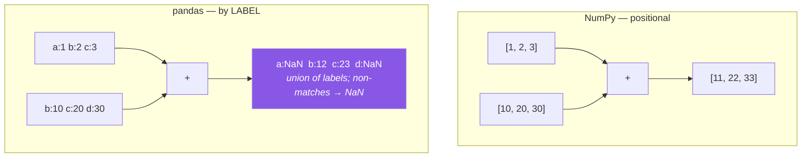

# Day 28 — `loc`, `iloc`, masks, and alignment

**Phase 4 · Module 4** · IDs: **PD-03** (indexing and selecting), **PD-04** (reindexing and alignment)

> **Yesterday:** declaring types at read time.
> **Today:** the two selectors, and the thing that makes pandas different from NumPy — **the index**.
> Arrays line up by position; dataframes line up by **label**, silently, on every operation. That is
> either the most useful feature in the library or the source of a whole class of invisible bugs,
> depending on whether you know about it.
> **Tomorrow:** iteration versus vectorisation.

```bash
./m start 28 && ./m scaffold 28
```

**Time:** 100 minutes. **Request budget:** 0 model calls.

---

## §1 The story

A NumPy array has positions. A pandas Series has **labels**, and every binary operation aligns on
them first.



Read that right-hand result again. You added two four-element things and got four values, two of
which are NaN — and **no error, no warning**. Pandas did the correct thing: it took the union of the
labels and filled the gaps.

This is genuinely useful. It means you can add quarterly revenue to quarterly cost without checking
that the quarters are in the same order. It also means that if you `reset_index()` on one side of a
join and not the other, half your data quietly becomes NaN and the code that produced it looks fine.

The second half of today is the two selectors, and the rule is short:

- **`.loc[...]` selects by label.** Slices are **inclusive** of the endpoint.
- **`.iloc[...]` selects by position.** Slices are **exclusive**, like Python.

That inclusive/exclusive difference is deliberate — `df.loc["2017":"2019"]` should include 2019 —
and it is the single most common off-by-one in pandas.

And one thing you already know: **assignment goes through `.loc`** (Day 26). Today you learn the
positive case for `.loc` beyond avoiding chained assignment.

---

## §2 Setup — run this

```bash
mkdir -p days/day-28/lab
touch days/day-28/lab/selecting.py
```

`src/setu/frames.py` grows today. No new packages.

---

## §3 PD-03 — the two selectors

`days/day-28/lab/selecting.py`:

```python
"""PD-03 / PD-04: label-based vs positional selection, and index alignment."""

from __future__ import annotations

import pandas as pd


def frame() -> pd.DataFrame:
    return pd.DataFrame(
        {
            "title": ["Attention", "BERT", "GPT-3", "T5", "Llama"],
            "year": [2017, 2018, 2020, 2019, 2023],
            "citations": [98000, 72000, 41000, 15000, 30000],
        },
        index=["p012", "p345", "p678", "p901", "p234"],
    )


def loc_versus_iloc() -> None:
    df = frame()
    print(f"\n{df.loc['p345', 'title']=}   <- by LABEL")
    print(f"{df.iloc[1, 0]=}              <- by POSITION")

    print(f"\n{df.loc['p012':'p678'].index.tolist()=}   <- loc slice INCLUDES the end")
    print(f"{df.iloc[0:3].index.tolist()=}              <- iloc slice EXCLUDES it")
    print("  ^ three rows both times here, but for different reasons. Change one end and see.")

    print(f"\n{df.loc[['p012', 'p234'], ['title', 'year']]=}")
    print(f"{df.iloc[[0, 4], [0, 1]]=}")

    print(f"\n{df.loc[:, 'year':'citations'].columns.tolist()=}   <- column slicing by label")


def when_the_index_is_integers() -> None:
    df = pd.DataFrame({"x": [10, 20, 30]}, index=[2, 0, 1])
    print(f"\n{df.index.tolist()=}")
    print(f"{df.loc[0, 'x']=}    <- LABEL 0 -> the second row (20)")
    print(f"{df.iloc[0]['x']=}   <- POSITION 0 -> the first row (10)")
    print("  ^ an integer index makes loc and iloc disagree. This is why `df[0]` is ambiguous")
    print("    and why bare [] on a DataFrame selects COLUMNS, not rows.")

    try:
        df[0]
    except KeyError as exc:
        print(f"  df[0] -> KeyError: {exc}")


def boolean_selection() -> None:
    df = frame()
    recent = df["year"] >= 2019
    print(f"\n{recent.tolist()=} {type(recent).__name__=}")
    print(f"{df.loc[recent, 'title'].tolist()=}")

    print(f"\n{df.loc[(df['year'] >= 2018) & (df['citations'] > 35000), 'title'].tolist()=}")
    print("  ^ & not `and`; brackets required. Day 21's NumPy rule, unchanged.")

    print(f"\n{df.loc[df['year'].between(2018, 2020), 'title'].tolist()=}   <- between is INCLUSIVE")
    print(f"{df.loc[df['title'].isin(['BERT', 'T5']), 'year'].tolist()=}")
    print(f"{df.query('year >= 2019 and citations > 20000')['title'].tolist()=}   <- query uses `and`")


def assignment_recap() -> None:
    df = frame()
    df.loc[df["year"] < 2019, "citations"] = 0
    print(f"\n{df['citations'].tolist()=}   <- one pair of brackets, writes back")

    df2 = frame()
    df2["citations"][df2["year"] < 2019] = 0
    print(f"{df2['citations'].tolist()=}   <- unchanged. Copy-on-Write. Day 26.")

    df3 = frame()
    df3.loc[:, "flag"] = df3["year"] >= 2019
    print(f"\n{df3.dtypes['flag']=}   <- new column via loc")
```

**Line by line:**

- `df.loc['p012':'p678']` — **inclusive** of `'p678'`. `df.iloc[0:3]` — **exclusive** of position 3.
  Both return three rows in this example, which is exactly why the difference is easy to miss. Change
  one endpoint and it bites.
- `df.loc[:, 'year':'citations']` — slicing **columns** by label. The comma separates rows from
  columns; `:` means all rows.
- `when_the_index_is_integers` — with an index of `[2, 0, 1]`, `df.loc[0]` gets the row **labelled**
  0 (the second) and `df.iloc[0]` gets the **first** row. They disagree. This is why bare `df[0]`
  raises: pandas refuses to guess, and instead `df["colname"]` on a DataFrame means *column*.
  **Remember: `[]` on a DataFrame selects columns; `[]` on a Series selects by label.**
- `df["year"] >= 2019` returns a **boolean Series with the same index**. That index is what lets it be
  used inside `.loc` — the mask aligns to the frame by label, not by position.
- `&` not `and`, with brackets — Day 21's NumPy rule, unchanged, and the same `ValueError` if you
  forget (Day 5's truthiness).
- `.between(a, b)` — **inclusive on both ends**. Read the docs before assuming; `pd.cut` and
  `pd.interval_range` default the other way, which is a real inconsistency.
- `df.query("...")` — a string expression where `and`/`or` work normally. Convenient, slightly slower,
  and it cannot be checked by a linter. Use it interactively; prefer explicit masks in `src/setu/`.
- `df.loc[:, "flag"] = ...` — creating a column through `.loc`. `df["flag"] = ...` also works and is
  fine for a *new* column; the `.loc` form is the habit that keeps you safe for **existing** ones.

---

## §4 PD-04 — the index, and alignment

Add to the same file:

```python
def alignment_is_automatic() -> None:
    a = pd.Series([1, 2, 3], index=["a", "b", "c"])
    b = pd.Series([10, 20, 30], index=["b", "c", "d"])

    print(f"\n{(a + b).to_dict()=}")
    print("  ^ union of labels. 'a' and 'd' are NaN. NO warning.")
    print(f"{a.add(b, fill_value=0).to_dict()=}   <- explicit about the gaps")

    same_values_wrong_order = pd.Series([3, 2, 1], index=["c", "b", "a"])
    print(f"\n{(a + same_values_wrong_order).to_dict()=}")
    print("  ^ order does not matter: alignment is by LABEL, so a+a = 2,4,6")


def the_silent_reset_index_bug() -> None:
    df = pd.DataFrame({"x": [1, 2, 3]}, index=["p1", "p2", "p3"])
    filtered = df[df["x"] > 1]
    print(f"\n{filtered.index.tolist()=}   <- the index SURVIVES filtering")

    fresh = filtered.reset_index(drop=True)
    print(f"{fresh.index.tolist()=}   <- now 0, 1")

    print(f"\n{(filtered['x'] + fresh['x']).to_dict()=}")
    print("  ^ FOUR values, all NaN. Labels 'p2','p3' never meet labels 0,1.")
    print("    This is the bug: one side got reset_index, the other did not.")


def reindexing() -> None:
    s = pd.Series([1, 2, 3], index=["a", "b", "c"])
    print(f"\n{s.reindex(['a', 'c', 'e']).to_dict()=}   <- missing label -> NaN")
    print(f"{s.reindex(['a', 'c', 'e'], fill_value=0).to_dict()=}")

    df = pd.DataFrame({"x": [1, 2]}, index=["a", "b"])
    print(f"\n{df.reindex(columns=['x', 'y']).columns.tolist()=}   <- add a missing column")

    print(f"\n{s.align(pd.Series([9], index=['b']))[0].to_dict()=}   <- explicit alignment")


def index_hygiene() -> None:
    df = pd.DataFrame({"id": ["p1", "p2", "p1"], "x": [1, 2, 3]})
    indexed = df.set_index("id")
    print(f"\n{indexed.index.is_unique=}   <- DUPLICATE labels are allowed")
    print(f"{indexed.loc['p1']=}")
    print("  ^ loc on a duplicate label returns a DataFrame, not a Series. Downstream code")
    print("    expecting a Series then fails somewhere unrelated.")

    print(f"\n{indexed.index.duplicated().sum()=}")
    print(f"{indexed.index.name=} {indexed.reset_index().columns.tolist()=}")

    ordered = pd.DataFrame({"x": [1, 2]}, index=["b", "a"]).sort_index()
    print(f"\n{ordered.index.tolist()=} {ordered.index.is_monotonic_increasing=}")
    print("  ^ a sorted index makes .loc slicing O(log n) instead of O(n)")


def the_leakage_shape() -> None:
    df = pd.DataFrame({"x": range(10), "y": range(10)})
    train = df[df["x"] < 7]
    test = df[df["x"] >= 7]
    print(f"\n{train.index.tolist()=}")
    print(f"{test.index.tolist()=}   <- indices are DISJOINT and meaningful")

    stats = train["x"].mean()
    scaled_test = test["x"] - stats
    print(f"{scaled_test.tolist()=}   <- test scaled with TRAIN statistics: correct")

    print("\n  If you reset_index on train but not test, alignment silently produces")
    print("  NaN and a model trains on nothing. Keep the index, or reset BOTH.")


if __name__ == "__main__":
    loc_versus_iloc()
    when_the_index_is_integers()
    boolean_selection()
    assignment_recap()
    alignment_is_automatic()
    the_silent_reset_index_bug()
    reindexing()
    index_hygiene()
    the_leakage_shape()
```

**Line by line:**

- `a + b` with partially overlapping labels — the union, with NaN in the gaps. **Run this and sit with
  it.** No warning is the whole point: pandas considers this correct behaviour, because it is.
- `a.add(b, fill_value=0)` — the explicit form. When you *know* a missing label means zero, say so.
  Every arithmetic operator has a method version (`add`, `sub`, `mul`, `div`) taking `fill_value`.
- `a + same_values_wrong_order` — same labels in a different order gives `2, 4, 6`, not garbage.
  Alignment is genuinely doing work for you here.
- `the_silent_reset_index_bug` — **the bug this lesson exists for.** Filter a frame and the index keeps
  its original labels. `reset_index(drop=True)` renumbers from 0. Combine one of each and *nothing*
  matches: you get four NaN values from two three-element inputs. In a real pipeline this happens
  across a function boundary and takes an hour to find.
- `reindex` — force a Series or frame onto a given set of labels. Missing ones become NaN unless you
  pass `fill_value`. This is the explicit version of what alignment does implicitly.
- `indexed.index.is_unique` is `False` — **pandas allows duplicate index labels.** `loc` on a
  duplicated label then returns a *DataFrame* where you expected a *Series*, and the failure appears
  in whatever consumes it. Check `is_unique` after any `set_index` on data you did not create.
- `sort_index()` and `is_monotonic_increasing` — a sorted index lets `.loc` slicing use binary search.
  On a million-row frame with a datetime index (Day 33), this is the difference between instant and
  slow.
- `the_leakage_shape` — the good pattern: the train and test indices are **disjoint and meaningful**,
  and scaling the test set by a training statistic aligns correctly because the labels are preserved.
  This is Principle 8 with an index attached, and it is why Day 79 will tell you not to reset indices
  casually.

---

## §5 Build brief

Extend `src/setu/frames.py`:

```python
def select(frame, *, rows=None, columns=None) -> pd.DataFrame:
    """TODO(me): label-based selection with validation.

    - `rows` may be a boolean Series or a list of labels; `columns` a list of names
    - raise DataError naming EVERY missing column, not just the first
    - if `rows` is a boolean Series, raise DataError when its index does not match
      the frame's (a misaligned mask silently selects the wrong rows)
    - always .loc; return a new frame, never a view (ADR-001 applies here too)
    """
    raise NotImplementedError


def assert_unique_index(frame) -> None:
    """TODO(me): raise DataError if the index has duplicates.

    The message must include the duplicated labels (up to 5) and the total count.
    Call this after every set_index on data you did not create.
    """
    raise NotImplementedError


def align_frames(left, right) -> tuple[pd.DataFrame, pd.DataFrame]:
    """TODO(me): return both frames restricted to their COMMON index, in the same order.

    - raise DataError if the intersection is empty (that is the reset_index bug)
    - the message must say how many labels each side had and how many overlapped
    """
    raise NotImplementedError


def split_by_mask(frame, mask) -> tuple[pd.DataFrame, pd.DataFrame]:
    """TODO(me): return (where_true, where_false) as independent copies.

    - preserve the original index on BOTH sides (do NOT reset)
    - the two parts must together contain every original row exactly once
    - NaN in the mask raises DataError (a missing condition is not False)
    """
    raise NotImplementedError
```

- `select` validating the mask's index is the day's design point: a boolean Series built from a
  *different* frame will align by label and silently select the wrong rows. Refusing is better.
- `align_frames` raising on an empty intersection turns the §4 bug into an immediate, named error
  instead of a frame full of NaN.
- `split_by_mask` preserving indices is what Day 79's train/test split will build on.

---

## §6 The eval that must be able to fail

Add to `tests/test_frames.py`:

```python
from setu.frames import align_frames, assert_unique_index, select, split_by_mask


@pytest.fixture
def papers() -> pd.DataFrame:
    return pd.DataFrame(
        {"title": ["a", "b", "c"], "year": [2017, 2019, 2021]},
        index=["p1", "p2", "p3"],
    )


def test_select_by_columns(papers):
    assert list(select(papers, columns=["year"]).columns) == ["year"]


def test_select_reports_every_missing_column(papers):
    with pytest.raises(DataError) as info:
        select(papers, columns=["year", "nope", "also_nope"])
    assert "nope" in str(info.value) and "also_nope" in str(info.value)


def test_select_with_a_boolean_mask(papers):
    out = select(papers, rows=papers["year"] > 2018)
    assert out.index.tolist() == ["p2", "p3"]


def test_select_rejects_a_misaligned_mask(papers):
    foreign = pd.Series([True, False, True], index=["x", "y", "z"])
    with pytest.raises(DataError):
        select(papers, rows=foreign)


def test_select_returns_an_independent_frame(papers):
    out = select(papers, columns=["year"])
    out.loc["p1", "year"] = 9999
    assert papers.loc["p1", "year"] == 2017, "select returned a view into the source"


def test_assert_unique_index_passes(papers):
    assert_unique_index(papers)  # must not raise


def test_assert_unique_index_names_the_duplicates():
    frame = pd.DataFrame({"x": [1, 2, 3]}, index=["a", "b", "a"])
    with pytest.raises(DataError) as info:
        assert_unique_index(frame)
    assert "a" in str(info.value)


def test_align_restricts_to_the_intersection():
    left = pd.DataFrame({"x": [1, 2, 3]}, index=["a", "b", "c"])
    right = pd.DataFrame({"y": [10, 20]}, index=["b", "c"])
    la, ra = align_frames(left, right)
    assert la.index.tolist() == ra.index.tolist() == ["b", "c"]


def test_align_puts_both_sides_in_the_same_order():
    left = pd.DataFrame({"x": [1, 2]}, index=["a", "b"])
    right = pd.DataFrame({"y": [20, 10]}, index=["b", "a"])
    la, ra = align_frames(left, right)
    assert la.index.tolist() == ra.index.tolist()
    assert (la["x"].values == [1, 2]).all() or (la["x"].values == [2, 1]).all()


def test_align_raises_on_the_reset_index_bug():
    original = pd.DataFrame({"x": [1, 2]}, index=["p1", "p2"])
    reset = original.reset_index(drop=True)
    with pytest.raises(DataError) as info:
        align_frames(original, reset)
    assert "0" in str(info.value) or "overlap" in str(info.value).lower()


def test_split_by_mask_preserves_indices():
    frame = pd.DataFrame({"x": range(5)}, index=[f"p{i}" for i in range(5)])
    left, right = split_by_mask(frame, frame["x"] < 3)
    assert left.index.tolist() == ["p0", "p1", "p2"]
    assert right.index.tolist() == ["p3", "p4"]


def test_split_by_mask_is_a_complete_partition():
    frame = pd.DataFrame({"x": range(20)}, index=[f"p{i}" for i in range(20)])
    left, right = split_by_mask(frame, frame["x"] % 3 == 0)
    assert len(left) + len(right) == 20
    assert set(left.index) | set(right.index) == set(frame.index)
    assert not (set(left.index) & set(right.index))


def test_split_parts_are_independent(papers):
    left, right = split_by_mask(papers, papers["year"] > 2018)
    left.loc[:, "year"] = 0
    assert papers["year"].tolist() == [2017, 2019, 2021], "split returned views"


def test_split_rejects_a_mask_with_missing_values():
    frame = pd.DataFrame({"x": [1.0, None, 3.0]})
    with pytest.raises(DataError):
        split_by_mask(frame, frame["x"] > 1)


def test_alignment_footgun_is_documented():
    """Executable documentation of the §4 bug."""
    a = pd.Series([1, 2], index=["p1", "p2"])
    b = pd.Series([1, 2], index=[0, 1])
    assert (a + b).isna().all(), "if this ever passes, pandas changed alignment"
    assert len(a + b) == 4
```

**Line by line:**

- `test_select_rejects_a_misaligned_mask` — **the day's real assessment.** A boolean Series built from
  a different frame aligns by label; pandas will happily produce an empty or wrong selection. An
  implementation that just does `frame.loc[rows]` passes every other test here and fails this one.
- `test_select_returns_an_independent_frame` — ADR-001 (Day 25) applied to dataframes. Writing to the
  result must not reach the source.
- `test_align_raises_on_the_reset_index_bug` — the §4 bug, caught at the boundary and reported with
  numbers rather than producing NaN.
- `test_split_by_mask_is_a_complete_partition` — three assertions: the sizes add up, the union is
  complete, and the intersection is empty. That is what "partition" means, and stating it as three
  assertions is how you get a test that cannot be satisfied by accident.
- `test_split_rejects_a_mask_with_missing_values` — `None > 1` is `False` in pandas, so a NaN row
  silently lands in the "false" bucket. Treating missing as false is a *decision*; making it explicit
  is the point.
- `test_alignment_footgun_is_documented` — asserts the surprising behaviour is still true. Like Day
  26's `test_legacy_object_check_would_have_failed`, it exists as executable documentation and as a
  tripwire if pandas ever changes.

```bash
uv run python -m pytest tests/test_frames.py -v
```

---

## §7 Request budget

| Resource | Spent today |
|---|---|
| LLM calls | **0** |

---

## §8 Traps

- **Forgetting `.loc` slices are inclusive.** `df.loc[0:3]` gives four rows; `df.iloc[0:3]` gives three.
- **An integer index.** `loc` and `iloc` disagree, and `df[0]` raises.
- **`[]` on a DataFrame selecting columns, not rows.** Different from a Series.
- **`reset_index` on one side only.** Alignment produces all-NaN, silently.
- **A mask built from a different frame.** Aligns by label; selects the wrong rows.
- **`and` instead of `&`.** Raises. And missing brackets around comparisons.
- **Assuming `.between` is exclusive.** It is inclusive on both ends.
- **Duplicate index labels.** `loc` returns a DataFrame where you expected a Series.
- **Unsorted index with `.loc` slicing.** O(n) instead of O(log n), and possibly a `KeyError`.
- **Treating NaN in a mask as False without saying so.** Decide explicitly.

---

## §9 Verify before you code

Written **2026-08-21**:

- <https://pandas.pydata.org/docs/user_guide/indexing.html> — `.loc` versus `.iloc`, and the
  inclusive-slice note.
- <https://pandas.pydata.org/docs/user_guide/basics.html#aligning-objects-with-each-other-with-align> —
  alignment and `fill_value`.
- <https://pandas.pydata.org/docs/reference/api/pandas.DataFrame.reindex.html> — explicit reindexing.
- <https://pandas.pydata.org/docs/user_guide/indexing.html#duplicate-data> — duplicate labels.

---

## §10 Say it in an interview

> "The thing that separates pandas from NumPy is the index: every binary operation aligns on labels
> first, taking the union and filling gaps with NaN, with no warning. That's usually a gift — you can
> add two series without checking they're in the same order — but it's also a failure mode. If you
> `reset_index` on one side of an operation and not the other, nothing matches and you get a frame of
> NaN that looks structurally fine. So my helpers raise when two frames have an empty index
> intersection, and my selector refuses a boolean mask whose index doesn't match the frame, because a
> mask built from a different dataframe will align by label and silently select the wrong rows."

---

## §11 Done when

Tick [`CHECKLIST.md`](CHECKLIST.md), then `./m check && ./m done 28`.
