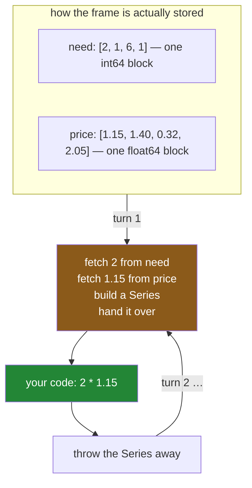

# 1.1 — Reading the list one line at a time

## One-line answer

Walking a frame row by row is the first thing everybody tries, because it is how a person reads a
list — and it is the slowest thing you can do in pandas, because each row has to be built into a new
Python object before your code ever sees it.

---

## The story

Somebody wants to know what the shopping comes to.

They do the obvious thing, which is what anybody would do with a piece of paper. Start at the top.
Milk, two of them, one fifteen each — that is two thirty. Write it down. Next line. Bread, one, one
forty. Running total three seventy. Next line.

Four lines. It takes a few seconds and it is completely correct.

Then the shop sends three years of history — a million lines — and the same approach is started out
of habit. It is still correct. It is just not going to finish this afternoon.

The interesting question is not why a million lines takes longer than four. It is why it takes so
*much* longer than it should, when adding a million pairs of numbers is not, in itself, difficult
work.

---

## The idea in plain language

A pandas frame is not stored as rows. It is stored as **columns** — each one a single block of
memory holding values of one type, laid out end to end
([Day 26, 1.4](../../../day-26-frames-and-copy-on-write/parts/01-the-two-objects/1.4-one-dtype-per-column.md)).
That is why a column of a million numbers takes eight megabytes and not much more: there is no
per-value overhead, just the numbers.

A **row** cuts across all of those blocks. It is not a thing that exists in memory waiting to be
handed to you; it has to be **built** — one value fetched from each column's block, converted into a
Python object, and packed into a new Series
([Day 28, 1.2](../../../day-28-selection-and-alignment/parts/01-label-and-position/1.2-loc-by-label.md)).

So when you write a loop over a frame, every single trip round it does that construction work. A
million rows means a million Series built, used once, and thrown away. **The arithmetic in your loop
body is not the expensive part; the row is.**

The word for the alternative is **vectorised** — writing `shop["need"] * shop["price"]` and letting
pandas do the whole column at once, in compiled code, without ever making a row. Section 2 is about
that, and section 3 measures the difference.

Two terms before the mechanisms, because pandas offers several ways to loop and they are not equally
bad:

- **`iterrows`** yields `(label, Series)` for each row. The most readable and the slowest.
- **`itertuples`** yields a small named record instead of a Series. Much faster, and it keeps the
  types.
- **`apply(axis=1)`** calls your function once per row. It looks like a pandas operation and it is a
  loop underneath.

And one honest caveat, stated now so it is not a surprise later: **looping is not always wrong.** A
four-row frame does not care. A loop that calls a network service once per row is dominated by the
network. What is always wrong is looping *by default*, without knowing what it costs — and section 3
is how you find out what it costs.

---

## Why Setu needs it

- **[1.2](1.2-iterrows-and-the-row-that-lost-its-dtype.md)** is `iterrows` in detail, including a
  surprise about the values it hands you.
- **[2.1](../02-vectorised/2.1-one-operation-every-row.md)** is the alternative, and it is one line.
- **[3.2](../03-the-measurement/3.2-the-four-ways-timed.md)** is the plan's named example: the same
  sum written five ways and timed on a million rows.
- **[Day 28, 1.4](../../../day-28-selection-and-alignment/parts/01-label-and-position/1.4-rows-and-columns-at-once.md)**
  measured a single cell lookup at about fifteen microseconds and observed that a million of them is
  fifteen seconds. This day is that observation, followed through.
- **Day 31**'s `groupby` and **Day 33**'s `.str` and `.dt` accessors are both vectorised replacements
  for loops people would otherwise write. Neither makes sense until this does.

---

## The mechanism

The loop anybody would write first:

```python
import pandas as pd

shop = pd.DataFrame(
    {
        "item": pd.Series(["milk", "bread", "eggs", "rice"], dtype="str"),
        "need": [2, 1, 6, 1],
        "price": [1.15, 1.40, 0.32, 2.05],
    }
).set_index("item")

total = 0.0
for label, row in shop.iterrows():
    total += row["need"] * row["price"]
print("total:", round(total, 2))
```

**Line by line:**

- `shop.iterrows()` yields a **pair** on each turn: the row's label, and the row itself as a Series.
  Unpacking it into `label, row` in the `for` target is why this reads so naturally
  ([Day 8, 1.4](../../../day-08-containers/parts/01-sequences/1.4-unpacking-and-star-rest.md)).
- `row["need"]` — the row is a Series, so this is a lookup **inside a one-row object** that was built
  a moment ago and will be discarded a moment later.
- `total += ...` — a Python float, accumulated in Python. Four additions here; a million in the real
  case.
- This is correct, readable, and the pattern to unlearn. It is worth writing once so that
  [2.1](../02-vectorised/2.1-one-operation-every-row.md)'s version has something to be compared
  against.

```text
total: 7.67
```

What happens on each turn of that loop:



**The green box is the work you asked for. The orange box is what it cost to get there**, and it
happens once per row.

The same sum, written the way section 2 will argue for:

```python
print("total:", round(float((shop["need"] * shop["price"]).sum()), 2))
```

**Line by line:**

- `shop["need"] * shop["price"]` — **two whole columns multiplied**, giving a new column. No rows are
  built, and the multiplication happens in compiled code over the two memory blocks
  ([Day 23, 1.1](../../../day-23-ufuncs-and-statistics/parts/01-ufuncs/1.1-one-operation-every-element.md)).
- `.sum()` — the whole column reduced to one number, again in compiled code
  ([Day 23, 2.1](../../../day-23-ufuncs-and-statistics/parts/02-statistics/2.1-a-reduction-turns-many-into-one.md)).
- `float(...)` — the boundary conversion, so what comes out is a plain Python float rather than a
  NumPy scalar ([Day 26, 5.1](../../../day-26-frames-and-copy-on-write/parts/05-the-module/5.1-the-shopping-list-module.md)).
- **One line, and no Python runs per row.** That is the entire difference, and on four rows it buys
  nothing at all.

```text
total: 7.67
```

The same answer. On four rows the loop is fine and the difference is invisible, which is precisely
why the habit forms — and why [3.2](../03-the-measurement/3.2-the-four-ways-timed.md) has to measure
a million.

---

## When it breaks

**Looping over a frame without `iterrows`:**

```text
$ uv run python -c "
import pandas as pd
shop = pd.DataFrame({'need': [2, 1], 'price': [1.15, 1.40]})
for row in shop:
    print(repr(row))
"
```

```text
'need'
'price'
```

**What it means.** **No error, and the wrong thing entirely.** Iterating a DataFrame directly yields
its **column names**, not its rows — the same way iterating a dictionary yields its keys
([Day 8, 2.3](../../../day-08-containers/parts/02-sets-and-dicts/2.3-a-dict-is-ordered-now.md)).

The bug this produces is memorable: `for row in df: print(row["need"])` fails with
`TypeError: string indices must be integers`, because `row` is the string `'need'`. The error names
strings on a line about a frame, which sends people looking in the wrong place. **If you meant rows,
you have to say so** — `iterrows`, `itertuples` or `apply`.

**Iterating a Series, which does something different again:**

```text
$ uv run python -c "
import pandas as pd
prices = pd.Series([1.15, 1.40], index=['milk', 'bread'])
print('for v in series      :', [v for v in prices])
print('for k, v in .items() :', list(prices.items()))
"
```

```text
for v in series      : [1.15, 1.4]
for k, v in .items() : [('milk', 1.15), ('bread', 1.4)]
```

**What it means.** Iterating a **Series** gives its values; iterating a **DataFrame** gives its column
names. Two objects from the same library, iterating two different ways, and neither warns you.

The rule that makes it memorable: **both iterate the thing that indexes the other axis.** A Series is
one column, so you get values; a frame is many columns, so you get their names. `.items()` gives
label-and-value pairs on either, and it is the form to write when you mean it.

**The one that is silently slow — a frame nobody would call big:**

```text
$ uv run python -c "
import time
import pandas as pd
shop = pd.DataFrame({'need': list(range(2000)), 'price': [1.0] * 2000})

def best(fn, reps):
    times = []
    for _ in range(reps):
        s = time.perf_counter()
        fn()
        times.append(time.perf_counter() - s)
    return min(times) * 1000

loop = best(lambda: sum(r['need'] * r['price'] for _, r in shop.iterrows()), 3)
vec = best(lambda: float((shop['need'] * shop['price']).sum()), 20)
print(f'loop       {loop:7.1f} ms')
print(f'vectorised {vec:7.2f} ms')
print(f'ratio      {loop / vec:7.0f}x')
"
```

```text
loop          43.5 ms
vectorised    0.10 ms
ratio          450x
```

**What it means.** Two thousand rows — a frame small enough that nobody would think twice — and the
loop is already **four hundred and fifty times slower**. Both answers are identical to the penny.

That ratio is the thing to carry out of this part. It is not ten per cent and it is not double; it is
between two and three orders of magnitude, and it is there at two thousand rows, long before anybody
would call the data big. [3.2](../03-the-measurement/3.2-the-four-ways-timed.md) measures it properly
at a million, where the same comparison reaches five figures.

Note the `reps` in that script: 3 for the loop and 20 for the vectorised version, taking the **fastest**
of each ([Day 25, 4.2](../../../day-25-copy-view-and-the-gate/parts/04-the-benchmark/4.2-timeit-honestly.md)).
A single un-repeated run of the vectorised call measures Python's first-call overhead rather than the
work, and reports a ratio nearer 40 — which would understate the finding by a factor of ten.

---

## In production

**What a professional writes instead of the teaching version.** There is no production version of
this loop — the production version is section 2's one-liner. What *is* worth writing down is the
decision, because "never loop" is too blunt to be useful:

```python
import pandas as pd


def total_spend(shop: pd.DataFrame) -> float:
    """What the list comes to. Vectorised; no Python runs per row."""
    missing = [name for name in ("need", "price") if name not in shop.columns]
    if missing:
        raise KeyError(f"cannot total without {missing}; have {list(shop.columns)}")
    return float((shop["need"] * shop["price"]).sum())
```

**Line by line:**

- The docstring says **"no Python runs per row"**, which is the property a reader needs to know is
  being preserved. Somebody refactoring this in a year needs to know that turning it into a loop is a
  regression rather than a style choice.
- The column check first, so a missing column gives a sentence rather than `KeyError: 'price'`
  ([Day 28, 6.1](../../../day-28-selection-and-alignment/parts/06-the-module/6.1-the-select-module.md)).
- `float(...)` at the boundary, so the return type matches the annotation exactly.
- **It is three lines and it replaces a loop.** That is the usual ratio: the vectorised version is
  shorter as well as faster, which is why it is worth learning rather than merely tolerating.

**When a loop is genuinely the right answer.** Three cases, and they are narrower than people hope.

**The work per row is not arithmetic.** Calling an API, writing a file, invoking a model that takes
one record — the per-row cost is milliseconds of waiting, and pandas' overhead of a few microseconds
disappears against it. Day 19's concurrency work is the right tool there, not vectorisation
([Day 19, 4.1](../../../day-19-typing-dataclasses-and-concurrency/parts/04-concurrency/4.1-waiting-is-not-working.md)).

**The frame is tiny and the code runs once.** Four rows in a script nobody runs twice. Optimising it
is a waste of your afternoon, which is a real cost too.

**The operation genuinely depends on the previous row's *result*** — not merely the previous row's
value, which `shift` and `cumsum` handle
([Day 23, 1.7](../../../day-23-ufuncs-and-statistics/parts/01-ufuncs/1.7-reduce-accumulate-and-at.md)),
but a true sequential dependency such as a state machine. Those exist, and
[2.3](../02-vectorised/2.3-when-there-is-no-vectorised-form.md) is about recognising them honestly
rather than using them as an excuse.

**The failure that only appears with real data.** A nightly job iterated a frame to enrich each row,
and ran in about four minutes on the twenty thousand rows it started with. It grew. Nobody watched it
grow, because it always finished before anyone arrived. At about two million rows it stopped
finishing overnight, and the fix — one vectorised expression — took twenty minutes and had been
available from the first day. **The cost of a loop is invisible until it is urgent**, because it
grows smoothly and nothing ever fails.

**The review comment a senior engineer leaves.** *"`for _, row in df.iterrows()` — this is
multiplying two columns, which is `df['a'] * df['b']`. Please vectorise it. If there is a reason a
loop is needed here, put it in a comment, because the next person will assume it was written before
anybody knew better."*

**The interview question.** *"Why is iterating over a DataFrame slow?"* Because a frame is stored by
**column**, as contiguous typed blocks, and a row cuts across all of them — so every turn of the loop
has to construct a new Python object from values fetched out of each block, and then discard it. The
arithmetic is not the cost; the row construction is. Then the detail that shows you have measured it:
the penalty is around **three orders of magnitude**, and it is already there at a couple of thousand
rows, not just at a million. And the honest qualification: a loop is fine when the per-row work
dominates the overhead — a network call, a file write — or when the frame is small enough that the
whole thing runs in less time than it took to ask the question.

---

## Check yourself

```bash
uv run python -c "
import pandas as pd
shop = pd.DataFrame(
    {'need': [2, 1, 6, 1], 'price': [1.15, 1.40, 0.32, 2.05]},
    index=pd.Index(['milk', 'bread', 'eggs', 'rice'], name='item'),
)
print('for x in frame  :', [x for x in shop])
print('for x in column :', [x for x in shop['need']])
print('loop total      :', round(sum(r['need'] * r['price'] for _, r in shop.iterrows()), 2))
print('vectorised total:', round(float((shop['need'] * shop['price']).sum()), 2))
"
```

The first two lines iterate two pandas objects and give two completely different kinds of thing. Say
what each gave and state the rule that predicts both.

**Answer out loud, without scrolling up:**

> A frame is stored by column. Say what has to happen before your loop body can see a row, and why
> that makes the loop slow even when the arithmetic inside it is trivial. Then name one situation
> where looping really is the right choice.

---

**Next:** [1.2 — `iterrows`, and the row that lost its dtype](1.2-iterrows-and-the-row-that-lost-its-dtype.md).
