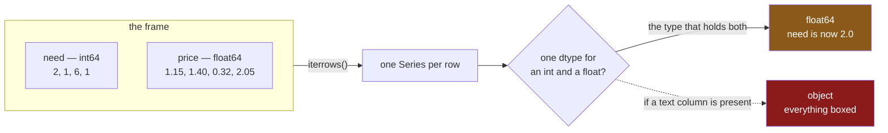

# 1.2 — `iterrows` — and the row that lost its dtype

## One-line answer

`iterrows` builds a Series for every row, and because a Series holds one type while a row crosses
several, **your whole numbers arrive as floats** — so `iterrows` is not only the slowest way to walk a
frame, it is the one that quietly changes the values it hands you.

---

## The story

Somebody loops over the shopping list to print it out, one line per item, and the printout comes back
saying the flat needs `2.0` milk and `6.0` eggs.

Nobody typed a decimal point. The list says two milk and six eggs, and it has said that all day. The
column is whole numbers and everything that has ever looked at it agrees.

It is not wrong, exactly — two point zero is two. It just is not what anybody wrote down, and if that
number goes into a message, a filename or a database column expecting a whole number, "not exactly
wrong" stops being good enough.

The decimal point came from the loop. It was not in the data before the loop and it is not in the
data after it.

---

## The idea in plain language

`iterrows` yields a pair on each turn: the row's **label**, and the row as a **Series**.

The Series is the problem, and it is the same problem
[Day 28, 1.2](../../../day-28-selection-and-alignment/parts/01-label-and-position/1.2-loc-by-label.md)
found with `frame.loc["eggs"]`. A frame's columns each have their own dtype
([Day 26, 1.4](../../../day-26-frames-and-copy-on-write/parts/01-the-two-objects/1.4-one-dtype-per-column.md)).
A **Series has exactly one.** So a row that crosses an `int64` column and a `float64` column has to be
stored as one type, and pandas picks the one that can hold both: `float64`.

That is why the counts come back with decimal points. Nothing was corrupted; a whole number was put
into a container that only holds floats.

And if the row also crosses a **text** column, there is no numeric type that fits, so the row becomes
`object` — every value boxed as a Python object, which is slower still and loses the numeric dtype
entirely ([Day 26, 2.4](../../../day-26-frames-and-copy-on-write/parts/02-the-str-dtype/2.4-dtypes-equals-object-finds-nothing.md)).

So `iterrows` costs you three things on every single row:

1. **Speed** — a Series is constructed and discarded on every row, which is
   [1.1](1.1-reading-the-list-one-line-at-a-time.md)'s subject.
2. **Types** — integers become floats, or everything becomes `object`.
3. **Any write you attempt** — the row is a copy, so assigning to it changes nothing
   ([1.4](1.4-the-loop-that-changed-nothing.md)).

The one thing it is genuinely good at is **reading**. `row["need"]` is clear, it survives the columns
being reordered, and on a small frame in a script nobody will run twice, that readability is worth
something. [1.3](1.3-itertuples-and-what-it-costs.md) is what to reach for when it is not.

---

## Why Setu needs it

- **[1.3](1.3-itertuples-and-what-it-costs.md)** fixes both the speed and the dtype problem, at the
  cost of some readability.
- **[1.4](1.4-the-loop-that-changed-nothing.md)** is the third cost — the write that goes nowhere.
- **[3.2](../03-the-measurement/3.2-the-four-ways-timed.md)** puts a number on the first cost, and
  `iterrows` is the slowest row in the table by a wide margin.
- **[Day 28, 1.2](../../../day-28-selection-and-alignment/parts/01-label-and-position/1.2-loc-by-label.md)**
  met the same dtype collapse from a single `loc` lookup. This is that, a million times.
- **Day 30** imputes missing values, and a column that arrived as `float64` because of a loop looks
  exactly like a column that is genuinely continuous. The imputer will treat it as one.

---

## The mechanism

The dtype collapse, made visible:

```python
import pandas as pd

shop = pd.DataFrame(
    {
        "item": pd.Series(["milk", "bread", "eggs", "rice"], dtype="str"),
        "need": [2, 1, 6, 1],
        "price": [1.15, 1.40, 0.32, 2.05],
    }
).set_index("item")

print("frame dtypes:", shop.dtypes.to_dict())
print()
for label, row in shop.head(2).iterrows():
    print(
        f"  {label}: {row.to_dict()}  row dtype={row.dtype}  need is {type(row['need']).__name__}"
    )
```

**Line by line:**

- The frame's `need` column is `int64` and `price` is `float64`, printed first so there is no doubt
  about what went in.
- `.head(2)` only to keep the output short; the behaviour is the same on every row.
- `row.dtype` — **singular**. A frame has `dtypes` and a Series has one
  ([Day 26, 1.5](../../../day-26-frames-and-copy-on-write/parts/01-the-two-objects/1.5-reading-a-frame-before-you-touch-it.md)),
  and that singularity is the whole cause.
- `type(row["need"]).__name__` — not `int`. The value is a NumPy `float64`, so it will not compare
  `is` equal to a Python int, will format with a decimal point, and will fail a strict type check.

```text
frame dtypes: {'need': dtype('int64'), 'price': dtype('float64')}

  milk: {'need': 2.0, 'price': 1.15}  row dtype=float64  need is float64
  bread: {'need': 1.0, 'price': 1.4}  row dtype=float64  need is float64
```

**`need` went in as `2` and came out as `2.0`.** No warning, no error, and every value in the column is
affected — not just some of them.

What the loop does to each row:



Add a text column and it gets worse:

```python
with_aisle = shop.assign(aisle=pd.Series(["07", "03", "07", "11"], index=shop.index))
label, row = next(with_aisle.iterrows())
print("row dtype :", row.dtype)
print("need is   :", type(row["need"]).__name__, "=", repr(row["need"]))
print("price is  :", type(row["price"]).__name__)
print("aisle is  :", type(row["aisle"]).__name__)
```

**Line by line:**

- `assign` rather than bracket assignment, so `shop` is untouched
  ([Day 28, 3.2](../../../day-28-selection-and-alignment/parts/03-writing/3.2-the-new-column-that-was-a-mask.md)).
- `pd.Series([...], index=shop.index)` — **the index is given**, because a bare list would be labelled
  `0, 1, 2, 3` and align to nothing
  ([Day 28, 4.2](../../../day-28-selection-and-alignment/parts/04-alignment/4.2-alignment-is-automatic.md)).
- `next(...iterrows())` takes just the first pair, since one row is enough to make the point
  ([Day 11, 1.1](../../../day-11-iterators-and-generators/parts/01-iterators/1.1-iterable-and-iterator.md)).
- Now there is no numeric type that fits text, so the row is `object` — and **`need` comes back as a
  plain Python `int` again**, which looks like an improvement and is not. Every value is now a boxed
  Python object, which is the slowest representation there is.

```text
row dtype : object
need is   : int = 2
price is  : float
aisle is  : str
```

**Read those two blocks together, because the pair of them is the real lesson.** Without the text
column, `need` is `2.0` — wrong type, right storage. With it, `need` is `2` — right type, worst
storage. **The behaviour of `iterrows` depends on which other columns happen to be in the frame**, and
neither result is the column's actual dtype.

The version that has none of these problems:

```python
print("vectorised:", (shop["need"] * shop["price"]).round(2).to_dict())
print("need dtype stays:", shop["need"].dtype)
```

**Line by line:**

- No row is built, so nothing is converted and nothing collapses.
- `shop["need"]` is still `int64` afterwards, because nothing touched it.
- `.round(2)` on the result, purely so the printed floats are readable.
- **One line against a four-line loop**, and it is the shorter one that is also correct about types.

```text
vectorised: {'milk': 2.3, 'bread': 1.4, 'eggs': 1.92, 'rice': 2.05}
need dtype stays: int64
```

---

## When it breaks

**A count used where a whole number is required:**

```text
$ uv run python -c "
import pandas as pd
shop = pd.DataFrame(
    {'need': [2, 1], 'price': [1.15, 1.40]},
    index=pd.Index(['milk', 'bread'], name='item'),
)
for label, row in shop.iterrows():
    print(f'buy {row[\"need\"]} {label}')
    print('  as a list index:', end=' ')
    try:
        print(['a', 'b', 'c'][row['need']])
    except TypeError as error:
        print('TypeError:', error)
    break
"
```

```text
buy 2.0 milk
  as a list index: TypeError: list indices must be integers or slices, not numpy.float64
```

**What it means.** Two things went wrong from one cause. The printed line says `buy 2.0 milk`, which
is merely ugly. Then the same value used as a list index **raises**, and the message names
`numpy.float64` on a line where the programmer is certain they have an integer.

The error is correct and the cause is three lines away, in the `iterrows` call. **When a value that
should be an integer turns up as a float and nothing in your code converted it, look for a row
object.**

**Modifying the frame while iterating it:**

```text
$ uv run python -c "
import pandas as pd
shop = pd.DataFrame({'need': [2, 1, 6]}, index=['milk', 'bread', 'eggs'])
seen = []
for label, row in shop.iterrows():
    seen.append(label)
    if label == 'milk':
        shop.loc['tea'] = 1
print('rows visited:', seen)
print('frame now has:', shop.index.tolist())
"
```

```text
rows visited: ['milk', 'bread', 'eggs']
frame now has: ['milk', 'bread', 'eggs', 'tea']
```

**What it means.** The row added during the loop was **not visited**, and no error was raised. That
happens to be the safe outcome here, and it is not a guarantee — `iterrows` is a generator reading
from the frame as it goes ([Day 11, 2.1](../../../day-11-iterators-and-generators/parts/02-generators/2.1-yield-the-function-that-pauses.md)),
so what a mid-loop change does depends on what the change was and where.

The rule is the same as for a Python list: **do not change a thing while you are iterating it.** Build
the new rows in a list and `concat` once at the end, which is faster anyway.

**The one that is correct and looks wrong — comparing a looped value:**

```text
$ uv run python -c "
import pandas as pd
shop = pd.DataFrame({'need': [2, 1]}, index=['milk', 'bread'])
_, row = next(shop.iterrows())
print('row value      :', repr(row['need']))
print('== 2           :', row['need'] == 2)
print('type is int    :', type(row['need']) is int)
print('isinstance int :', isinstance(row['need'], int))
"
```

```text
row value      : np.int64(2)
== 2           : True
type is int    : False
isinstance int : False
```

**What it means.** With only one numeric column there is no collapse to float — the row is `int64`
and `need` is a NumPy `int64`. It **equals** 2, which is what almost all code checks. Its type
is not `int`, and `isinstance(..., int)` is `False`, because `numpy.int64` is not a subclass of
Python's `int`.

So a value from a loop can pass `==` and fail a type check, in the same function. Code that
validates with `isinstance` — a serialiser, a schema validator, a strict API layer — rejects it
([Day 5, 1.4](../../../day-05-operators-and-conditionals/parts/01-operators/1.4-equals-is-overloadable-is-is-not.md)).
**The fix at that boundary is an explicit `int(...)` or `float(...)`**, which is the same
boundary-conversion habit Day 26's module used.

---

## In production

**What a professional writes instead of the teaching version.** There is no good production use of
`iterrows`. The nearest thing is a case where a loop is genuinely justified — one slow call per row —
and even then the loop is over a **narrowed, converted** structure rather than over the frame:

```python
from collections.abc import Iterator

import pandas as pd


def rows_to_send(shop: pd.DataFrame) -> Iterator[dict[str, object]]:
    """One plain dict per row, with real Python types, ready for a JSON body."""
    narrowed = shop.loc[:, ["need", "price"]]
    yield from (
        {"item": label, "need": int(need), "price": float(price)}
        for label, need, price in zip(
            narrowed.index, narrowed["need"], narrowed["price"], strict=True
        )
    )
```

**Line by line:**

- `zip` over the **columns**, not over the rows. Each column is iterated as a flat sequence of values,
  so no Series is built per row — this is the "zip of columns" line in
  [3.2](../03-the-measurement/3.2-the-four-ways-timed.md)'s table, and it is dramatically faster than
  `iterrows` while remaining a loop.
- `strict=True` — added in Python 3.10, and it raises if the columns are different lengths rather
  than silently stopping at the shortest. They cannot be, coming from one frame, but the argument
  costs nothing and documents the assumption.
- `narrowed = shop.loc[:, [...]]` first, so only the columns being sent are touched
  ([Day 28, 1.4](../../../day-28-selection-and-alignment/parts/01-label-and-position/1.4-rows-and-columns-at-once.md)).
- `int(need)` and `float(price)` — **the explicit conversions**, so what leaves this function is plain
  Python. That fixes both the `2.0` problem and the `isinstance` problem at the one place where it
  matters: the boundary.
- `Iterator[dict[...]]` and `yield from` — the caller gets rows one at a time, so a large frame does
  not become a large list ([Day 11, 2.4](../../../day-11-iterators-and-generators/parts/02-generators/2.4-yield-from-and-the-pipeline.md)).

**What changes at scale.** Two things.

**`iterrows` gets worse than linearly in the number of columns**, because every row builds a Series
holding all of them. A ten-column frame is not twice the work of a five-column frame per row — it is
worse, since the wider row is more likely to collapse to `object`. Narrowing the frame before
looping, if you must loop, is the single cheapest improvement available.

**And the dtype collapse survives the loop.** Values collected from `iterrows` into a list and rebuilt
into a frame come back `float64` even though the source was `int64` — so a "round trip" through a
loop silently changes a schema, and a schema check downstream goes red for a reason that is nowhere
near the loop ([Day 27, 5.3](../../../day-27-reading-and-writing/parts/05-the-module/5.3-the-round-trip-test.md)).

**The failure that only appears with real data.** A job iterated a frame to build JSON messages, and
the `quantity` field went out as `2.0` instead of `2`. The receiving system's schema declared an
integer and its validator was lenient, so it accepted them for a year. Then the receiving system was
upgraded to a strict validator and **every message began failing at once**, on a field nobody had
changed. The cause was a loop written eighteen months earlier over a frame that had since gained a
float column — because until that column was added, the row Series had been `int64` and the values
had been fine. **`iterrows`' output type depends on the whole frame**, so adding an unrelated column
changed the type of a different field.

**The review comment a senior engineer leaves.** *"`iterrows` here — this multiplies two columns, so
vectorise it. If the loop has to stay, note that `row['count']` is a float because the frame has a
float column in it, and this value goes into a JSON body typed as an integer. Wrap it in `int()` at
minimum."*

**The interview question.** *"What is wrong with `iterrows`?"* Three things, and most people only say
the first. It is **slow**, because a Series is constructed and discarded for every row. It **changes
your types**: a row crosses columns of different dtypes and a Series holds one, so integers come back
as `float64` — or, if any column is text, everything comes back as `object`. And **you cannot write
through it**, because the row is a copy. Then the detail that shows you have been caught: the type you
get depends on the *other* columns in the frame, so adding an unrelated float column silently changes
the type of an integer field, and the failure surfaces wherever that value is finally used.

---

## Check yourself

```bash
uv run python -c "
import pandas as pd
shop = pd.DataFrame(
    {'need': [2, 1, 6, 1], 'price': [1.15, 1.40, 0.32, 2.05]},
    index=pd.Index(['milk', 'bread', 'eggs', 'rice'], name='item'),
)
print('column dtype :', shop['need'].dtype)
_, row = next(shop.iterrows())
print('looped dtype :', type(row['need']).__name__, repr(row['need']))
only_need = shop[['need']]
_, row2 = next(only_need.iterrows())
print('narrowed     :', type(row2['need']).__name__, repr(row2['need']))
"
```

The same column, looped twice, giving two different types — and the only difference is whether the
`price` column was in the frame. Say why, and say what that implies about adding a column to a frame
somebody else loops over.

**Answer out loud, without scrolling up:**

> `iterrows` hands you a Series per row. Say what that does to an `int64` column when the frame also
> has a `float64` column, and what it does when the frame also has a text column. Then name the third
> cost of `iterrows`, the one that has nothing to do with speed or types.

---

**Next:** [1.3 — `itertuples`, and what it costs](1.3-itertuples-and-what-it-costs.md).
