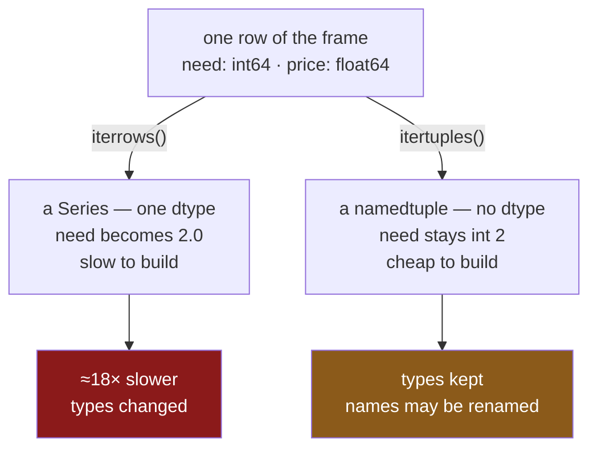

# 1.3 — `itertuples` — the faster one, and what it costs

## One-line answer

`itertuples` yields a small named record instead of a Series, so it keeps every column's type and
runs about eighteen times faster than `iterrows` — and it pays for that by renaming any column whose
name is not a valid Python identifier.

---

## The story

Somebody finds out that the printout's decimal points came from the loop, and looks for a loop that
does not do that.

There is one, and switching to it takes about a minute. The counts come back as whole numbers again.
The printout is correct. The job that was taking a couple of minutes now takes a few seconds.

Then it is pointed at the shop's full export — the wide one, with forty columns and names like
`unit price` and `2nd choice` — and the loop stops working. Not slowly, not wrongly: the line that
reads the unit price raises, saying there is no such thing.

The column is right there. It is in the frame, it prints, it can be selected by name. The loop simply
cannot see it, and the reason is a rule about what a name is allowed to look like.

---

## The idea in plain language

`itertuples` yields **one namedtuple per row** rather than one Series.

A **namedtuple** is a small, fixed record whose fields are reached by attribute — `row.need` rather
than `row["need"]` ([Day 8, 1.3](../../../day-08-containers/parts/01-sequences/1.3-a-tuple-is-a-record.md)).
It is a plain Python object with no pandas machinery in it, and that is where both the speed and the
type-preservation come from.

**The types survive** because a tuple has no single dtype to collapse to. Each field is just a value,
so an `int64` column gives you an `int` and a `float64` column gives you a `float`. The problem
[1.2](1.2-iterrows-and-the-row-that-lost-its-dtype.md) is entirely about does not exist here.

**It is much faster** because a namedtuple is far cheaper to construct than a Series — no index, no
dtype, no alignment machinery. [3.2](../03-the-measurement/3.2-the-four-ways-timed.md) measures it at
about eighteen times quicker than `iterrows`. It is still a loop, and still hundreds of times slower
than not looping at all.

The cost is the naming rule. A namedtuple's fields are **attributes**, and an attribute name has to
be a valid Python identifier: letters, digits and underscores, not starting with a digit, and not a
Python keyword. A column called `unit price` cannot be an attribute. So pandas **renames it**, to
`_1`, `_2` and so on by position — silently.

Two smaller things worth knowing:

- The row's **index label** arrives as a field called `Index`, first. `itertuples(index=False)` leaves
  it out and loses the label; whether it is measurably faster is a question *When it breaks* answers,
  and the answer is not the one you would expect.
- The record's type is called `Pandas` by default; `name="Shop"` renames it, which shows up in
  debugger output and in `repr`.

---

## Why Setu needs it

- **[1.2](1.2-iterrows-and-the-row-that-lost-its-dtype.md)** is the problem this solves, and the
  reason to know both.
- **[1.5](1.5-apply-is-a-loop-wearing-a-hat.md)** is the third way to loop, and it is slower than this
  one while looking more like real pandas.
- **[3.2](../03-the-measurement/3.2-the-four-ways-timed.md)** puts all of them in one table, and shows
  that even this one is far behind the vectorised version.
- **[Day 27, 3.4](../../../day-27-reading-and-writing/parts/03-parquet/3.4-column-pruning.md)** built
  a forty-column export with names like `extra_00`. Real exports have names like `unit price`, and
  that is exactly the case this part's failure is about.
- **Day 227**'s ingestion project reads files whose column names it does not control, so any loop over
  them meets the renaming rule immediately.

---

## The mechanism

The record, and the types that survived:

```python
import pandas as pd

shop = pd.DataFrame(
    {
        "item": pd.Series(["milk", "bread", "eggs", "rice"], dtype="str"),
        "need": [2, 1, 6, 1],
        "price": [1.15, 1.40, 0.32, 2.05],
    }
).set_index("item")

for row in shop.head(2).itertuples():
    print(" ", row)
print("record type:", type(next(shop.itertuples())).__name__)
print("need type  :", type(next(shop.itertuples()).need).__name__)
```

**Line by line:**

- `shop.itertuples()` yields **one thing** per turn, not a pair — so there is no `label, row`
  unpacking. The label is inside the record instead, as `Index`.
- The printed record shows its own field names, which makes a `print(row)` in a debugger far more
  readable than a Series' multi-line display.
- `type(...).__name__` on the record is **`Pandas`** — that is the default name pandas gives the
  namedtuple class it builds.
- `type(...need).__name__` is **`int`**, a plain Python integer. Compare that with
  [1.2](1.2-iterrows-and-the-row-that-lost-its-dtype.md), where the same column came back as
  `float64` from the same frame.

```text
  Pandas(Index='milk', need=2, price=1.15)
  Pandas(Index='bread', need=1, price=1.4)
record type: Pandas
need type  : int
```

The two loops, side by side:



Neither is green, because [2.1](../02-vectorised/2.1-one-operation-every-row.md)'s version is the
green one. `itertuples` is the best of the bad options, not a good one.

Now the cost — a column whose name is not an identifier:

```python
export = pd.DataFrame({"unit price": [1.15, 1.40], "2nd choice": ["oat", "rye"], "need": [2, 1]})
print("columns:", list(export.columns))
for row in export.itertuples():
    print(" ", row)
    break
```

**Line by line:**

- `unit price` has a **space** in it and `2nd choice` **starts with a digit**. Both are perfectly legal
  column names and both are common in real exports.
- `need` is a valid identifier, so it survives.
- The loop prints the record, and the two illegal names are gone — replaced by positional names.
- `break` after the first row, because one is enough to see it.

```text
columns: ['unit price', '2nd choice', 'need']
  Pandas(Index=0, _1=1.15, _2='oat', need=2)
```

**`unit price` became `_1` and `2nd choice` became `_2`.** No warning. The numbers are **positions in
the record**, counting `Index` as zero — so they shift if a column is added, removed or reordered.

That is the trap in one line: **the renaming is silent and positional**, so code written against `_1`
keeps running and starts meaning a different column the day somebody adds a field to the export.

The fix, which is to not need the rule at all:

```python
tidy = export.rename(columns={"unit price": "unit_price", "2nd choice": "second_choice"})
for row in tidy.itertuples():
    print(" ", row)
    break
```

**Line by line:**

- `rename(columns={...})` — renaming is
  [Day 28, 5.1](../../../day-28-selection-and-alignment/parts/05-reindexing/5.1-reindex-say-the-index-you-want.md)'s
  other function: it changes what a column is *called* and moves no data.
- The new names are valid identifiers, so `itertuples` uses them and `row.unit_price` works.
- **Rename at load, not at the loop.** Day 27's loader is where a project decides what its columns are
  called ([Day 27, 5.1](../../../day-27-reading-and-writing/parts/05-the-module/5.1-the-loaders-module.md)),
  and doing it there means no downstream code ever meets `_1`.

```text
  Pandas(Index=0, unit_price=1.15, second_choice='oat', need=2)
```

---

## When it breaks

**Reading a column that was renamed:**

```text
$ uv run python -c "
import pandas as pd
export = pd.DataFrame({'unit price': [1.15, 1.40], 'need': [2, 1]})
for row in export.itertuples():
    print(row.unit_price)
" 2>&1 | tail -1
```

```text
AttributeError: 'Pandas' object has no attribute 'unit_price'
```

**What it means.** The obvious guess — that a space becomes an underscore — is wrong. pandas does not
try to repair the name; it replaces it with a **position**. So the attribute you want is `_1`, and
`row.unit_price` does not exist.

The message is accurate and unhelpful: `'Pandas' object` is the namedtuple class's default name, which
tells a reader nothing about frames or columns. **When you see `'Pandas' object has no attribute`,
the cause is a column name that is not a valid identifier**, and `print(next(df.itertuples()))` shows
you what the fields are actually called.

**Two illegal names, and the positions that shift:**

```text
$ uv run python -c "
import pandas as pd
before = pd.DataFrame({'unit price': [1.15], 'need': [2]})
after = pd.DataFrame({'id': [7], 'unit price': [1.15], 'need': [2]})
print('before:', next(before.itertuples()))
print('after :', next(after.itertuples()))
"
```

```text
before: Pandas(Index=0, _1=1.15, need=2)
after : Pandas(Index=0, id=7, _2=1.15, need=2)
```

**What it means.** The unit price was `_1` and is now `_2`, because a column was added **before** it.

Code written as `row._1` still runs. It now reads the id where it used to read the price, and both are
numbers, so nothing downstream objects. **This is the day's recurring shape**: a positional handle
that silently changes meaning when the data changes, exactly as
[Day 28, 1.1](../../../day-28-selection-and-alignment/parts/01-label-and-position/1.1-two-ways-to-say-that-row.md)
warned about `iloc`.

**The one that is not a bug at all — an optimisation lost in the noise:**

```text
$ uv run python -c "
import time
import pandas as pd
shop = pd.DataFrame({'need': list(range(200000)), 'price': [1.0] * 200000})

def best(fn, reps=5):
    t = []
    for _ in range(reps):
        s = time.perf_counter()
        fn()
        t.append(time.perf_counter() - s)
    return min(t) * 1000

a = best(lambda: sum(r.need * r.price for r in shop.itertuples()))
b = best(lambda: sum(r.need * r.price for r in shop.itertuples(index=False)))
c = best(lambda: float((shop['need'] * shop['price']).sum()), 50)
print(f'with index    {a:7.1f} ms')
print(f'index=False   {b:7.1f} ms')
print(f'vectorised    {c:7.2f} ms')
print(f'loop vs vectorised: {a / c:.0f}x')
"
```

```text
with index      113.5 ms
index=False     132.6 ms
vectorised       0.97 ms
loop vs vectorised: 117x
```

**What it means.** `index=False` does less work — it leaves a field out of every record — and here it
came out **slower**. An earlier run of the same script on the same machine had it eleven per cent
faster. The difference is inside the measurement noise, so **the honest conclusion is that there is no
measurable difference**, not that leaving the index out hurts.

That is worth meeting deliberately, because it is
[Day 25, 4.4](../../../day-25-copy-view-and-the-gate/parts/04-the-benchmark/4.4-the-benchmark-that-lied.md)'s
lesson happening live: a benchmark that follows every rule can still report a difference that is not
there, and repeating it is the only way to find out.

The number that *is* real is the third one. **117 times**, and it does not wobble between runs. When
one comparison moves by twenty per cent run to run and another is stable across two orders of
magnitude, the second is the one to act on — and it says the loop should not exist
([2.1](../02-vectorised/2.1-one-operation-every-row.md)).

---

## In production

**What a professional writes instead of the teaching version.** If a loop is genuinely justified — one
slow call per row ([1.1](1.1-reading-the-list-one-line-at-a-time.md)) — then it loops over a narrowed
frame with names it controls:

```python
from collections.abc import Iterator
from typing import NamedTuple

import pandas as pd


class Line(NamedTuple):
    """One line of the shopping list, with real Python types."""

    item: str
    need: int
    price: float


def lines(shop: pd.DataFrame) -> Iterator[Line]:
    """Each row as a typed record. Raises rather than renaming a column silently."""
    wanted = ["need", "price"]
    missing = [name for name in wanted if name not in shop.columns]
    if missing:
        raise KeyError(f"cannot build lines without {missing}; have {list(shop.columns)}")
    narrowed = shop.loc[:, wanted]
    for row in narrowed.itertuples():
        yield Line(item=str(row.Index), need=int(row.need), price=float(row.price))
```

**Line by line:**

- `class Line(NamedTuple)` — **your own record type**, declared with field names and types
  ([Day 19, 1.2](../../../day-19-typing-dataclasses-and-concurrency/parts/01-type-hints/1.2-the-vocabulary.md)).
  A type checker now knows what `line.need` is; with pandas' anonymous `Pandas` record it knows
  nothing.
- `narrowed = shop.loc[:, wanted]` — the columns are **selected by name in a fixed order** before the
  loop, so the record's positions are ours rather than the frame's
  ([Day 28, 1.4](../../../day-28-selection-and-alignment/parts/01-label-and-position/1.4-rows-and-columns-at-once.md)).
  A column added upstream cannot shift anything.
- The missing-column check first, so a rename upstream is an error naming the column rather than an
  `AttributeError` about a `'Pandas' object`.
- `int(row.need)` and `float(row.price)` — explicit conversions at the boundary, so the record's types
  match its annotations exactly ([1.2](1.2-iterrows-and-the-row-that-lost-its-dtype.md)).
- `str(row.Index)` — the label, converted, because an index of numbers would otherwise give an `int`
  where the annotation says `str`.
- `Iterator[Line]` and `yield` — the caller gets records one at a time, so a large frame does not
  become a large list.

**What changes at scale.** Three things.

**The gap between `itertuples` and vectorised does not narrow — it widens.** Both are linear in the
number of rows, but the loop's constant is enormous, so at ten million rows the vectorised version is
still under a second and the loop is minutes. There is no size at which looping catches up.

**Constructing a namedtuple per row allocates**, and at millions of rows that is real pressure on
Python's garbage collector on top of the arithmetic. Yielding them lazily rather than building a list
keeps the peak memory flat, which is the same argument
[Day 27, 5.2](../../../day-27-reading-and-writing/parts/05-the-module/5.2-the-file-that-does-not-fit.md)
made about chunks.

**And the fastest loop is not `itertuples` at all.** Zipping the columns directly — 
`zip(df["a"], df["b"], strict=True)` — skips the record construction entirely and is several times
quicker again ([3.2](../03-the-measurement/3.2-the-four-ways-timed.md) has both). It is less readable
and it is positional, so it is the right answer only when you have already decided a loop is
necessary and measured that it is the bottleneck.

**The failure that only appears with real data.** A pipeline looped a partner's export with
`itertuples` and read `row._3`, which somebody had written after inspecting one file and finding the
name unusable. The partner added a column at the front. `_3` became a different field, the pipeline
kept running, and a quantity was written into a price column for two weeks. **Positional field names
are `iloc` by another route**, and the fix — rename the columns at load — had been available the whole
time.

**The review comment a senior engineer leaves.** *"`row._1` — that is a positional name, so it moves
if the export gains a column. Rename the columns in the loader so they are valid identifiers, then use
`row.unit_price`. And this loop is computing a product of two columns; is there a reason it is not
`df['a'] * df['b']`?"*

**The interview question.** *"What is the difference between `iterrows` and `itertuples`?"*
`iterrows` yields a Series per row, so it is slow and it **collapses the dtypes** — integers come back
as floats. `itertuples` yields a namedtuple, which is far cheaper to build and preserves each
column's type, so it is roughly eighteen times faster. Then the catch that shows you have used it: a
namedtuple's fields are attributes, so any column whose name is not a valid Python identifier gets
**renamed to `_1`, `_2` by position**, silently — and those positions shift when the frame's columns
change. And the answer that matters most: both are loops, and both are hundreds of times slower than
the vectorised expression, so the real question is why there is a loop.

---

## Check yourself

```bash
uv run python -c "
import pandas as pd
export = pd.DataFrame({'unit price': [1.15, 1.40], 'need': [2, 1]})
print('columns  :', list(export.columns))
print('record   :', next(export.itertuples()))
print('fields   :', next(export.itertuples())._fields)
tidy = export.rename(columns={'unit price': 'unit_price'})
print('renamed  :', next(tidy.itertuples()))
"
```

`_fields` on a namedtuple lists its field names. Say which column lost its name and what it is called
now, and say what would happen to that name if a column were inserted at the front of the frame.

**Answer out loud, without scrolling up:**

> Say why `itertuples` keeps an `int64` column as an `int` when `iterrows` turns it into a float — in
> terms of what each one builds. Then name the one thing `itertuples` does silently that `iterrows`
> does not, and say why it is the same category of problem as using `iloc`.

---

**Next:** [1.4 — The loop that changed nothing](1.4-the-loop-that-changed-nothing.md).
