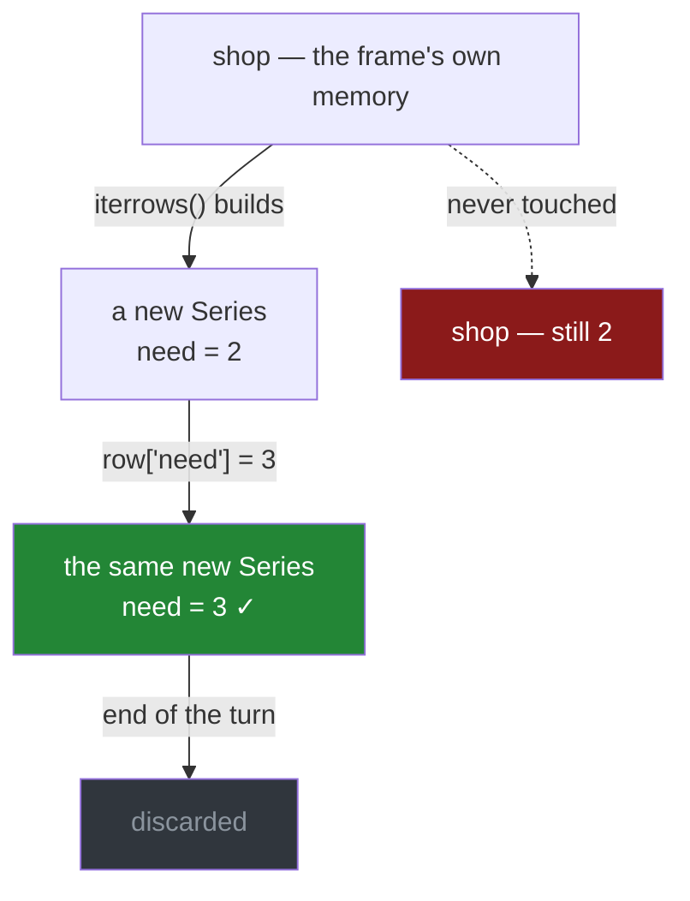

# 1.4 — The loop that changed nothing

## One-line answer

Writing to the row a loop hands you changes a temporary copy and nothing else — so the loop runs, the
values look right inside it, and the frame you were trying to edit is exactly as it was.

---

## The story

Somebody decides everything on the list should be at least three, so there is enough for the weekend.

They write the obvious loop. Go down the list; if the number is under three, set it to three. Print
it inside the loop to check, and the printout says three, three, six, three. Correct.

Then they print the list afterwards and it says two, one, six, one.

Nothing failed. No error, no warning, and the loop demonstrably did the right thing — they watched it
happen, line by line, on the screen. The list simply does not have the change in it.

The row the loop was writing to was never the list. It was a photocopy of one line, handed over so it
could be read, and thrown away at the end of each turn.

---

## The idea in plain language

[1.2](1.2-iterrows-and-the-row-that-lost-its-dtype.md) established that `iterrows` **builds** a Series
for each row. Building means the row is a **new object**, holding copies of the values — not a window
onto the frame's memory.

So assigning to it writes into that new object. The write succeeds. The object is then discarded on
the next turn of the loop, taking your change with it.

This is the same shape as chained assignment
([Day 28, 3.1](../../../day-28-selection-and-alignment/parts/03-writing/3.1-assigning-through-loc.md)):
a write that lands on a temporary. The difference is that pandas **warns** about chained assignment
and says nothing at all about this. There is nothing suspicious to warn about — you asked for a
Series and you wrote to it, which is a perfectly ordinary thing to do to a Series.

`itertuples` is worse in a way that is better: a namedtuple is **immutable**, so `row.need = 3` raises
`AttributeError` immediately ([1.3](1.3-itertuples-and-what-it-costs.md)). You cannot make this
mistake with `itertuples`, only with `iterrows`.

There are two ways out, and one of them is not a loop.

**If you must loop**, write through `.loc` on the frame, using the label the loop gave you:
`shop.loc[label, "need"] = 3`. That is a single call against the real frame
([Day 28, 3.1](../../../day-28-selection-and-alignment/parts/03-writing/3.1-assigning-through-loc.md)),
and it works — slowly.

**The real answer** is that this is not a loop-shaped problem at all. "Raise everything below three to
three" is one vectorised call, and section 2 is about recognising that.

---

## Why Setu needs it

- **[1.2](1.2-iterrows-and-the-row-that-lost-its-dtype.md)** explained why the row is a new object.
  This is the consequence people actually hit.
- **[2.1](../02-vectorised/2.1-one-operation-every-row.md)** is the version of this task that is one
  line and cannot fail this way.
- **[Day 28, 3.1](../../../day-28-selection-and-alignment/parts/03-writing/3.1-assigning-through-loc.md)**
  is the same failure without a loop, and it is worth seeing both because only one of them warns.
- **[Day 26, 3.1](../../../day-26-frames-and-copy-on-write/parts/03-copy-on-write/3.1-every-result-behaves-like-a-copy.md)**
  is the rule underneath: every result behaves like a copy, and a row from a loop is a result.
- **Day 30** repairs missing values across a frame, and the loop version of that repair is this bug
  with more at stake.

---

## The mechanism

The loop that looks right from the inside:

```python
import pandas as pd

shop = pd.DataFrame(
    {
        "item": pd.Series(["milk", "bread", "eggs", "rice"], dtype="str"),
        "need": [2, 1, 6, 1],
        "price": [1.15, 1.40, 0.32, 2.05],
    }
).set_index("item")

for label, row in shop.iterrows():
    if row["need"] < 3:
        row["need"] = 3
    print(f"  inside the loop, {label} is {row['need']}")
print()
print("after the loop:", shop["need"].tolist())
```

**Line by line:**

- `row["need"] = 3` — assigning **into the Series the loop handed over**. This is legal and it works:
  the Series really does now hold 3.
- The `print` inside the loop reads back from that same Series, so it shows the new value. **The
  evidence inside the loop is genuine and completely misleading.**
- `shop["need"]` after the loop reads the frame, which was never touched.
- **No exception, no warning, no output that looks wrong** until the last line.

```text
  inside the loop, milk is 3.0
  inside the loop, bread is 3.0
  inside the loop, eggs is 6.0
  inside the loop, rice is 3.0

after the loop: [2, 1, 6, 1]
```

Note the decimal points inside the loop — that is
[1.2](1.2-iterrows-and-the-row-that-lost-its-dtype.md)'s dtype collapse showing up again, on the same
frame, for the same reason. Even the `6.0` that was never written to has one.

Where the write went:



**The green box is real** — the write succeeded. It succeeded on the thing in the grey box.

The loop that does work, and is still the wrong answer:

```python
slow = shop.copy()
for label, row in slow.iterrows():
    if row["need"] < 3:
        slow.loc[label, "need"] = 3
print("loop with .loc :", slow["need"].tolist())

fast = shop.copy()
fast.loc[fast["need"] < 3, "need"] = 3
print("one vectorised :", fast["need"].tolist())
print("same answer    :", slow["need"].equals(fast["need"]))
```

**Line by line:**

- `slow.loc[label, "need"] = 3` — writing to **the frame**, using the label the loop provided, in a
  single `loc` call ([Day 28, 1.4](../../../day-28-selection-and-alignment/parts/01-label-and-position/1.4-rows-and-columns-at-once.md)).
  This lands.
- Note that the **condition** still reads from `row`, which is fine — reading a copy is not a problem,
  only writing to one is.
- `fast.loc[fast["need"] < 3, "need"] = 3` — the whole thing, no loop: a mask on the left of an `=`
  ([Day 28, 3.1](../../../day-28-selection-and-alignment/parts/03-writing/3.1-assigning-through-loc.md)).
  One line, no Python per row.
- `.equals(...)` confirms the two give the identical column, so the loop bought nothing but time.
- **Both `copy()` calls** are there so each version starts from the same frame; without them the second
  block would be testing the first block's output.

```text
loop with .loc : [3, 3, 6, 3]
one vectorised : [3, 3, 6, 3]
same answer    : True
```

---

## When it breaks

**The same mistake with `itertuples`, which cannot happen:**

```text
$ uv run python -c "
import pandas as pd
shop = pd.DataFrame({'need': [2, 1]}, index=['milk', 'bread'])
for row in shop.itertuples():
    row.need = 3
" 2>&1 | tail -1
```

```text
AttributeError: can't set attribute
```

**What it means.** A namedtuple is **immutable**, so the write raises rather than succeeding on a
copy ([Day 8, 1.3](../../../day-08-containers/parts/01-sequences/1.3-a-tuple-is-a-record.md)).

**This is the better failure**, and it is worth noticing which of the two loops protects you.
`iterrows` lets you write and silently discards it; `itertuples` refuses. Immutability is not a
restriction here, it is a guard rail — the same argument for using tuples for records generally.

**Writing through `.loc` while iterating, which works and is a trap anyway:**

```text
$ uv run python -c "
import time
import pandas as pd
shop = pd.DataFrame({'need': list(range(20000))})

start = time.perf_counter()
a = shop.copy()
for label, row in a.iterrows():
    if row['need'] < 10000:
        a.loc[label, 'need'] = 10000
loop = time.perf_counter() - start

start = time.perf_counter()
b = shop.copy()
b.loc[b['need'] < 10000, 'need'] = 10000
vec = time.perf_counter() - start
print(f'loop with .loc {loop * 1000:8.1f} ms')
print(f'vectorised     {vec * 1000:8.2f} ms')
print(f'ratio          {loop / vec:8.0f}x   same answer: {a[\"need\"].equals(b[\"need\"])}')
"
```

```text
loop with .loc   1926.4 ms
vectorised         0.75 ms
ratio              2583x   same answer: True
```

**What it means.** The `.loc` version is correct and it is **two and a half thousand times slower** —
far worse than the read-only loop [1.1](1.1-reading-the-list-one-line-at-a-time.md) measured, because
each write is its own `loc` call on top of each row being built.

So "use `.loc` inside the loop" is the fix for correctness and not for anything else. **A loop that
writes is the worst thing in this section**, and it is the one people arrive at after discovering
that writing to the row does nothing.

**The one that is subtler — reading a value you have already changed:**

```text
$ uv run python -c "
import pandas as pd
shop = pd.DataFrame({'need': [1, 1, 1]}, index=['a', 'b', 'c'])
for label, row in shop.iterrows():
    shop.loc[label, 'need'] = row['need'] + 10
print('result:', shop['need'].tolist())

shop2 = pd.DataFrame({'need': [1, 1, 1]}, index=['a', 'b', 'c'])
for label in shop2.index:
    shop2.loc[label, 'need'] = shop2.loc[label, 'need'] + 10
print('reading the frame each time:', shop2['need'].tolist())
"
```

```text
result: [11, 11, 11]
reading the frame each time: [11, 11, 11]
```

**What it means.** Both give the same answer here, and that is luck rather than a guarantee.

`iterrows` yields rows from a snapshot taken as it goes, so `row["need"]` may or may not reflect a
write you made on an earlier turn of the same loop. In this example each row is written once, so it
cannot matter. In a loop that writes to a *different* row than the one it is visiting — carrying a
value forward, filling a gap from the row above — it matters a great deal, and the two versions
diverge.

**The rule: never read from the frame you are writing to inside a loop over it.** If the operation
needs a previous row's value, that is `shift` or `cumsum`
([Day 23, 1.7](../../../day-23-ufuncs-and-statistics/parts/01-ufuncs/1.7-reduce-accumulate-and-at.md)),
and [2.3](../02-vectorised/2.3-when-there-is-no-vectorised-form.md) is about the cases where it
genuinely is not.

---

## In production

**What a professional writes instead of the teaching version.** The task is expressed as a
transformation, not as an edit, so there is nothing to write into:

```python
import pandas as pd


def restocked(shop: pd.DataFrame, minimum: int) -> pd.DataFrame:
    """A copy with every count raised to `minimum`. `shop` is not modified."""
    if minimum < 0:
        raise ValueError(f"minimum must not be negative, got {minimum}")
    out = shop.assign(need=lambda frame: frame["need"].clip(lower=minimum))
    if not (out["need"] >= minimum).all():
        raise AssertionError("restock did not take effect")
    return out
```

**Line by line:**

- `.clip(lower=minimum)` — **the whole column raised in one call**
  ([Day 23, 1.5](../../../day-23-ufuncs-and-statistics/parts/01-ufuncs/1.5-maximum-clip-and-elementwise.md)).
  No mask, no loop, no assignment. This is the same function Day 26's module used for the same job
  ([Day 26, 5.1](../../../day-26-frames-and-copy-on-write/parts/05-the-module/5.1-the-shopping-list-module.md)).
- `assign` rather than `.loc` on the left — the function returns a new frame and cannot touch its
  argument ([Day 28, 3.2](../../../day-28-selection-and-alignment/parts/03-writing/3.2-the-new-column-that-was-a-mask.md)).
  **There is no write in this function at all**, so this part's bug is not merely avoided, it is
  unrepresentable.
- The effect is still checked, because a check that has never fired costs nothing and documents the
  promise.
- The docstring says `shop` is not modified — the property a caller needs and the one this whole part
  is about.

**What changes at scale.** Two things.

**A loop that writes is quadratic in disguise.** Each `.loc` assignment on a frame may trigger
Copy-on-Write bookkeeping and, on some column layouts, a copy of the column
([Day 26, 3.2](../../../day-26-frames-and-copy-on-write/parts/03-copy-on-write/3.2-the-copy-that-has-not-happened-yet.md)).
Twenty thousand writes is the two-second figure above; a million is not something to wait for. This is
the single worst pattern in pandas, and it is common precisely because it is where people land after
this part's bug.

**And the safe alternative is not "collect changes in a list".** Building a list of edits and applying
them one by one at the end has the same cost. What works is building the **whole new column** — with
`clip`, `where` ([Day 28, 3.3](../../../day-28-selection-and-alignment/parts/03-writing/3.3-where-mask-and-the-write-that-was-not.md)),
`map` or arithmetic — and assigning it once.

**The failure that only appears with real data.** A cleanup script looped a frame and set a flag on
each row that met a condition. It ran nightly and reported how many rows it had flagged — counting
inside the loop, which was accurate. The flag column in the database never changed. **The count was
right and the data was untouched for four months**, because the count came from the loop's own
variable and the write went to a discarded row. The monitoring was measuring the intention rather
than the effect, which is the deeper lesson: **count what the frame says afterwards, not what the loop
thinks it did.**

**The review comment a senior engineer leaves.** *"`row['need'] = 3` inside `iterrows` — that writes to
a copy and does nothing. This whole loop is `df['need'].clip(lower=3)`. If a loop were genuinely
needed you would have to write through `df.loc[label, col]`, but please do not; it is thousands of
times slower and this does not need one."*

**The interview question.** *"Can you modify a DataFrame while iterating over it with `iterrows`?"*
No — the row `iterrows` yields is a **newly constructed Series**, so assigning to it changes a
temporary that is discarded at the end of the turn, and **nothing warns you**. It is the same class of
bug as chained assignment, except that pandas raises a `ChainedAssignmentError` warning for that and
says nothing for this. Then the two things that show experience: `itertuples` cannot have the bug
because a namedtuple is immutable, so the write raises instead; and writing through `df.loc[label,
col]` inside the loop is correct but thousands of times slower than the vectorised form, so
discovering this bug should send you to `clip`, `where` or a mask assignment rather than to a
different kind of loop.

---

## Check yourself

```bash
uv run python -c "
import pandas as pd
shop = pd.DataFrame({'need': [2, 1, 6, 1]}, index=['milk', 'bread', 'eggs', 'rice'])
a = shop.copy()
for label, row in a.iterrows():
    row['need'] = 99
print('wrote to the row  :', a['need'].tolist())
b = shop.copy()
for label, row in b.iterrows():
    b.loc[label, 'need'] = 99
print('wrote to the frame:', b['need'].tolist())
c = shop.copy()
c.loc[:, 'need'] = 99
print('vectorised        :', c['need'].tolist())
"
```

Three loops-worth of intent, and one of them left the frame alone. Say which, and say what evidence
*inside* that loop would have convinced you it was working.

**Answer out loud, without scrolling up:**

> Say why writing to the row `iterrows` gives you has no effect, in terms of what that row is. Then
> say why `itertuples` cannot have this bug, and why "write through `.loc` inside the loop instead"
> is a fix you should not reach for.

---

**Next:** [1.5 — `apply` is a loop wearing a hat](1.5-apply-is-a-loop-wearing-a-hat.md).
