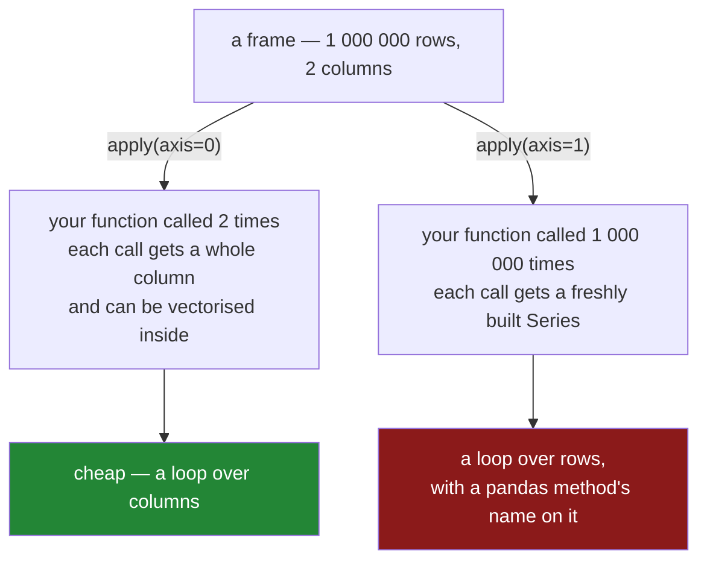

# 1.5 — `apply` is a loop wearing a hat

## One-line answer

`apply(axis=1)` calls your function once per row, so it is a Python loop with a pandas method name on
it — about three times slower than `itertuples` — and it is easy to mistake for a vectorised
operation because it is the only loop in pandas that does not contain the word `for`.

---

## The story

Somebody is told that looping over a frame is slow, and goes looking for the pandas way to do it
instead.

They find `apply`. It is a method on the frame, it takes a function, and it returns a Series — no
`for`, no accumulator, no index variable. It reads like the vectorised expressions in the
documentation.

They switch to it. The code is shorter and much nicer to look at. It is also, when they finally time
it, slower than the loop they replaced.

Nothing about the way it is written suggests that. There is no `for` on the screen. The loop is
inside `apply`, doing exactly what the old loop did, and the only thing that changed is who wrote it.

---

## The idea in plain language

`apply` calls a function you supply, once per **row** or once per **column**, and collects the
results.

The `axis` argument decides which, and it is the argument people get wrong:

- **`axis=1`** — once per **row**. Your function receives a row as a Series, exactly the object
  `iterrows` hands over ([1.2](1.2-iterrows-and-the-row-that-lost-its-dtype.md)), with the same dtype
  collapse.
- **`axis=0`** — the default — once per **column**. Your function receives a whole column, and this
  form is genuinely useful: `frame.apply(lambda c: c.max() - c.min())` is a reasonable thing to
  write, because the function runs a handful of times, not a million.

The distinction is the whole part. **`axis=0` runs your function once per column; `axis=1` runs it
once per row.** The first is cheap because frames have few columns. The second is the loop.

It is worth being precise about what `apply(axis=1)` is not. It is **not** vectorised, it does **not**
push your function into compiled code, and it does **not** get faster because it is a pandas method.
Its only advantage over `iterrows` is that it reads better; it is measurably faster than `iterrows`
and about three times **slower** than `itertuples`
([3.2](../03-the-measurement/3.2-the-four-ways-timed.md)).

There is also `Series.apply` and `Series.map`, which run once per **value**. Those have the same
character — a Python call per element — and the same answer: if there is a vectorised expression, use
it ([2.2](../02-vectorised/2.2-the-three-ways-to-write-a-condition.md)).

And one behaviour that catches people, which has nothing to do with speed: on an **empty** frame,
`apply(axis=1)` still calls your function once, to work out what shape the result should be.

---

## Why Setu needs it

- **[1.2](1.2-iterrows-and-the-row-that-lost-its-dtype.md)** is the object your function receives
  under `axis=1`, including its dtype problem.
- **[2.1](../02-vectorised/2.1-one-operation-every-row.md)** is what to write instead, in almost every
  case.
- **[3.2](../03-the-measurement/3.2-the-four-ways-timed.md)** measures `apply(axis=1)` against the
  three other loops and the vectorised version, and its position in that table surprises people.
- **[2.3](../02-vectorised/2.3-when-there-is-no-vectorised-form.md)** is where `apply` is the honest
  answer, and knowing that case is what stops "never use apply" being a superstition.
- **Day 31**'s `groupby` has its own `apply`, which runs once per **group** rather than once per row —
  a much smaller number, and a genuinely reasonable tool.

---

## The mechanism

The two axes, which are the whole subject:

```python
import pandas as pd

shop = pd.DataFrame(
    {
        "item": pd.Series(["milk", "bread", "eggs", "rice"], dtype="str"),
        "need": [2, 1, 6, 1],
        "price": [1.15, 1.40, 0.32, 2.05],
    }
).set_index("item")

print("axis=1, once per row   :", shop.apply(lambda r: r["need"] * r["price"], axis=1).to_dict())
print("axis=0, once per column:", shop[["need", "price"]].apply(lambda c: c.sum()).to_dict())
```

**Line by line:**

- `axis=1` — the lambda receives a **row**, so `r["need"]` reads a field of a one-row Series. Called
  four times here; a million times on a million-row frame.
- `axis=0` is the **default**, and the lambda receives a **column**. Called twice — once for `need`,
  once for `price` — regardless of how many rows there are.
- `shop[["need", "price"]]` in the second call, because `sum` on a text column would concatenate the
  strings rather than fail, which is its own small surprise.
- **The results have different shapes.** `axis=1` gives one value per row, labelled by the frame's
  index; `axis=0` gives one value per column, labelled by the column names.
- `c.sum()` inside `axis=0` is itself vectorised — the function is called twice and each call does the
  fast thing. That is why `axis=0` is fine and `axis=1` is not.

```text
axis=1, once per row   : {'milk': 2.3, 'bread': 1.4, 'eggs': 1.92, 'rice': 2.05}
axis=0, once per column: {'need': 10.0, 'price': 4.92}
```

Where the calls go:



**The number of calls is the number of things on that axis.** A frame has few columns and many rows,
which is the entire explanation of why one is fine and the other is not.

And the same result without `apply` at all:

```python
print("apply(axis=1) :", shop.apply(lambda r: r["need"] * r["price"], axis=1).to_dict())
print("vectorised    :", (shop["need"] * shop["price"]).to_dict())
print(
    "identical     :",
    shop.apply(lambda r: r["need"] * r["price"], axis=1).equals(shop["need"] * shop["price"]),
)
```

**Line by line:**

- The two expressions produce the same values with the same labels, which `.equals` confirms
  ([Day 28, 1.2](../../../day-28-selection-and-alignment/parts/01-label-and-position/1.2-loc-by-label.md)).
- The second is shorter, and it is the one that does not run Python once per row.
- **This is the substitution to look for whenever you see `apply(axis=1)`:** if the lambda's body is
  arithmetic or comparison on a few columns, it is an expression on those columns instead.

```text
apply(axis=1) : {'milk': 2.3, 'bread': 1.4, 'eggs': 1.92, 'rice': 2.05}
vectorised    : {'milk': 2.3, 'bread': 1.4, 'eggs': 1.92, 'rice': 2.05}
identical     : True
```

---

## When it breaks

**The empty frame that called your function anyway:**

```text
$ uv run python -c "
import pandas as pd
shop = pd.DataFrame({'need': [2, 1], 'price': [1.15, 1.40]})
empty = shop.iloc[:0]
calls = []
def watched(row):
    calls.append(1)
    return row['need'] * row['price']
out = empty.apply(watched, axis=1)
print('rows in :', len(empty))
print('calls   :', len(calls))
print('result  :', type(out).__name__, 'of length', len(out))
"
```

```text
rows in : 0
calls   : 1
result  : Series of length 0
```

**What it means.** Zero rows, **one call.** pandas calls your function once on an empty row to work
out what shape and dtype the result should have, then discards it.

That is harmless for arithmetic and not harmless for a function with a **side effect** — one that
appends to a list, writes a line to a log, increments a counter, or sends a request. Such a function
fires once on a frame that has nothing in it, and the count in your log is one higher than the number
of rows processed. [Day 28, 2.5](../../../day-28-selection-and-alignment/parts/02-masks/2.5-the-mask-that-matched-nothing.md)
warned that the empty case never appears in development; this is one of the specific ways it bites.

**Getting the axis wrong, which does not raise:**

```text
$ uv run python -c "
import pandas as pd
shop = pd.DataFrame(
    {'need': [2, 1, 6], 'price': [1.15, 1.40, 0.32]},
    index=pd.Index(['milk', 'bread', 'eggs'], name='item'),
)
print('meant per row, wrote the default:')
print(shop.apply(lambda x: x['need'] * 2))
" 2>&1 | tail -1
```

```text
KeyError: 'need'
```

**What it means.** With the default `axis=0` the lambda receives a **column**, and a column has the
frame's *row* labels — `milk`, `bread`, `eggs` — so `x["need"]` is a lookup for a row called `need`,
which does not exist.

The error is a `KeyError` naming a column that is plainly in the frame, which is why it is confusing.
**When `apply` raises `KeyError` on a column you can see, the axis is wrong.** And the reverse mistake
is worse: a function that works on both a row and a column — `lambda x: x.sum()`, say — runs happily
under either axis and gives a completely different answer with no error at all.

**The one that is slow rather than wrong — `apply` against the alternatives:**

```text
$ uv run python -c "
import time
import pandas as pd
shop = pd.DataFrame({'need': list(range(200000)), 'price': [1.0] * 200000})

def best(fn, reps=3):
    t = []
    for _ in range(reps):
        s = time.perf_counter()
        fn()
        t.append(time.perf_counter() - s)
    return min(t) * 1000

print(f'apply(axis=1) {best(lambda: shop.apply(lambda r: r[\"need\"] * r[\"price\"], axis=1).sum()):8.1f} ms')
print(f'itertuples    {best(lambda: sum(r.need * r.price for r in shop.itertuples())):8.1f} ms')
print(f'vectorised    {best(lambda: float((shop[\"need\"] * shop[\"price\"]).sum()), 20):8.2f} ms')
"
```

```text
apply(axis=1)   1358.7 ms
itertuples       441.7 ms
vectorised        2.68 ms
```

**What it means.** `apply(axis=1)` is **about three times slower than `itertuples`** and around five
hundred times slower than the expression.

That ordering is the finding, because it is the opposite of what the code looks like.
`apply(axis=1)` reads like a pandas operation and `itertuples` reads like a loop, and the one that
reads like a loop is three times quicker. **Looking like pandas is not the same as being
vectorised**, and `apply` is the place that distinction is most often missed.

(The absolute numbers here are higher than
[1.3](1.3-itertuples-and-what-it-costs.md)'s for the same 200 000 rows, because that block ran while
the machine was quieter. The **ratios within one run** are what to read; comparing timings across two
runs on a busy laptop is exactly the mistake
[Day 25, 4.4](../../../day-25-copy-view-and-the-gate/parts/04-the-benchmark/4.4-the-benchmark-that-lied.md)
is about.)

---

## In production

**What a professional writes instead of the teaching version.** `apply` survives on the **column**
axis, where the call count is small and each call does vectorised work:

```python
import pandas as pd


def column_report(frame: pd.DataFrame) -> pd.DataFrame:
    """One row per numeric column: its range, its spread and how much of it is missing."""
    numeric = frame.select_dtypes("number")
    if numeric.empty:
        raise ValueError(f"no numeric columns; have {dict(frame.dtypes.astype(str))}")
    return numeric.apply(
        lambda column: pd.Series(
            {
                "span": column.max() - column.min(),
                "spread": column.std(),
                "missing": column.isna().mean(),
            }
        )
    ).T
```

**Line by line:**

- No `axis=` argument, so this is `axis=0` — **once per column**. On a forty-column frame of ten
  million rows the lambda runs forty times.
- `select_dtypes("number")` picks the numeric columns by dtype rather than by a hard-coded list, so
  the report does not break when a column is added.
- Each line inside the lambda — `max`, `min`, `std`, `isna().mean()` — is itself **vectorised**
  ([Day 23, 2.1](../../../day-23-ufuncs-and-statistics/parts/02-statistics/2.1-a-reduction-turns-many-into-one.md)).
  The Python-level loop is over columns; the per-row work is all in compiled code. **That is the shape
  that makes `apply` acceptable.**
- Returning a `pd.Series` from the lambda makes `apply` build a frame rather than a Series, which is
  how one function produces several statistics per column.
- `.T` transposes it so the columns become rows, which is how anybody would want to read a report.
- `numeric.empty` checked first, because `apply` on an empty frame is the failure above.

**What changes at scale.** Three things.

**`apply(axis=1)` does not improve with size — it degrades.** Its per-row cost includes building a
Series, so a wider frame is worse per row as well as having more rows. Narrowing the frame before
applying is the only tuning available, and it is not much.

**The `raw=True` argument helps and is rarely enough.** `apply(func, axis=1, raw=True)` passes a NumPy
array instead of a Series, which skips the Series construction and is measurably faster — at the cost
of losing the column names inside your function, so `row["need"]` becomes `row[0]`. That is
positional access ([Day 28, 1.3](../../../day-28-selection-and-alignment/parts/01-label-and-position/1.3-iloc-by-position.md))
with all its fragility, bought for a speedup that is still nowhere near vectorised.

**And the honest production answer is usually a different tool.** If the per-row function genuinely
cannot be vectorised ([2.3](../02-vectorised/2.3-when-there-is-no-vectorised-form.md)), the options
that actually change the number are compiling it — with Numba or Cython — or moving the whole
operation to something built for it, which is Day 35's subject. `apply` is not a step on that path;
it is the thing you leave behind.

**The failure that only appears with real data.** A scoring job used `apply(axis=1)` to compute a
feature, and a reviewer approved it because it looked like idiomatic pandas. It ran nightly on a
growing table. Nobody profiled it, because there was no `for` loop to be suspicious of. At about
three million rows it began overrunning its window, and the fix — the same expression written on two
columns — was a two-line change that made it four thousand times faster. **`apply` had been hiding a
loop in plain sight for two years**, and the reason nobody looked is that it did not look like one.

**The review comment a senior engineer leaves.** *"`df.apply(lambda r: r['a'] / r['b'], axis=1)` — that
is `df['a'] / df['b']`, and it is thousands of times faster. `axis=1` is a per-row Python call, not a
vectorised operation. If you genuinely need per-row logic, say why in a comment so the next reviewer
does not have to work it out."*

**The interview question.** *"Is `apply` vectorised?"* No. `apply(axis=1)` calls your Python function
once per row, so it is a loop — and measurably a **slower** loop than `itertuples`, because it builds
a Series for each row and adds a function call on top. What it has over a `for` loop is readability,
which is why it survives in code that nobody has profiled. Then the distinction that shows you
understand it: `apply(axis=0)` — the default — runs once per **column**, which on a normal frame is a
handful of calls, and each of those calls can do vectorised work inside, so that form is perfectly
reasonable. **The cost is the number of calls, and the axis decides that number.**

---

## Check yourself

```bash
uv run python -c "
import pandas as pd
shop = pd.DataFrame(
    {'need': [2, 1, 6], 'price': [1.15, 1.40, 0.32]},
    index=pd.Index(['milk', 'bread', 'eggs'], name='item'),
)
calls = {'row': 0, 'col': 0}
def per_row(r):
    calls['row'] += 1
    return r['need']
def per_col(c):
    calls['col'] += 1
    return c.sum()
shop.apply(per_row, axis=1)
shop.apply(per_col, axis=0)
print('rows in frame   :', len(shop), '| columns:', len(shop.columns))
print('calls at axis=1 :', calls['row'])
print('calls at axis=0 :', calls['col'])
"
```

Two calls to `apply` on the same frame, and the call counts differ. Say what each count is equal to,
and say which of the two would change if the frame grew to a million rows.

**Answer out loud, without scrolling up:**

> `apply(axis=1)` and a `for` loop over `itertuples` do the same thing. Say which is faster and by
> roughly how much, then say why the slower one is the one that looks more like pandas. Finally, say
> what `apply` does to a frame with no rows in it.

---

**Next:** [2.1 — One operation, every row](../02-vectorised/2.1-one-operation-every-row.md).
