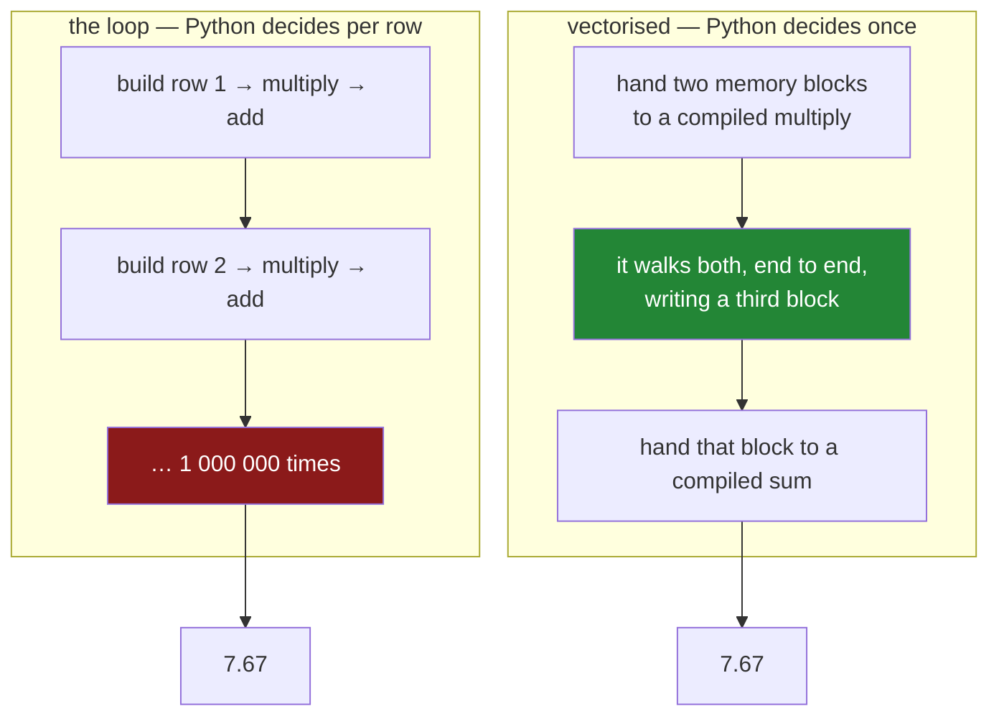

# 2.1 — One operation, every row

## One-line answer

`shop["need"] * shop["price"]` describes the operation once and lets compiled code run it over both
columns end to end — so no row is ever built, no Python runs per row, and the result comes back as a
labelled column rather than a number you accumulated.

---

## The story

Two people are given the shopping list and asked what it comes to.

The first works down it line by line. Milk, two at one fifteen, that is two thirty, write it down.
Bread, one at one forty. Keep a running total in your head. Four lines, four small pieces of mental
arithmetic, one answer at the end.

The second does something that only works because the list is written in columns. They put a ruler
under the counts, another under the prices, and say: *multiply these by those.* One instruction. Then:
*add all of that up.* A second instruction.

Both get seven sixty-seven. The second person did not do less arithmetic — the same eight numbers were
multiplied and added. What they did less of is **deciding**. They gave two instructions instead of
four rounds of "now look at this line, now find this column, now remember the total".

On four lines that saving is nothing. It is the whole game on a million.

---

## The idea in plain language

**Vectorised** means: you describe an operation once, and it is applied to every element by code that
was compiled long before your program started.

Day 23 established this over NumPy arrays
([Day 23, 1.1](../../../day-23-ufuncs-and-statistics/parts/01-ufuncs/1.1-one-operation-every-element.md)).
A pandas column is a NumPy array with labels attached
([Day 26, 1.1](../../../day-26-frames-and-copy-on-write/parts/01-the-two-objects/1.1-a-column-with-labels.md)),
so everything from that day applies here, plus one addition: the result keeps the labels.

The important thing to understand is **where the loop went**. It did not disappear — eight numbers
still had to be multiplied. It moved out of Python and into a compiled routine that walks two blocks
of memory. That routine does not build a Series per row, does not look up a column name per row, and
does not call back into Python at all. All the per-row overhead
[1.1](../01-the-loop/1.1-reading-the-list-one-line-at-a-time.md) described simply is not there.

Three properties follow, and they are worth stating because they are what you are buying:

**The dtypes are respected.** `int64 * int64` gives `int64`; `int64 * float64` gives `float64`. Nothing
collapses, because no row is ever formed ([1.2](../01-the-loop/1.2-iterrows-and-the-row-that-lost-its-dtype.md)).

**The labels come with it.** The result is a Series on the same index, so it can be assigned back into
the frame, compared against another column, or used as a mask
([Day 28, 2.1](../../../day-28-selection-and-alignment/parts/02-masks/2.1-a-comparison-makes-a-column.md)).

**Expressions compose.** `(shop["need"] * shop["price"]).round(2) > 2` is three vectorised operations
in a row, each producing a column for the next. There is never a point at which you hold a single row.

The vocabulary for what you write instead of a loop is short, and you have already met most of it:
arithmetic operators, comparison operators
([Day 28, 2.1](../../../day-28-selection-and-alignment/parts/02-masks/2.1-a-comparison-makes-a-column.md)),
the reductions `sum`, `mean`, `min`, `max`
([Day 23, 2.1](../../../day-23-ufuncs-and-statistics/parts/02-statistics/2.1-a-reduction-turns-many-into-one.md)),
and the element-wise helpers `clip`, `round`, `abs`, `where`
([Day 28, 3.3](../../../day-28-selection-and-alignment/parts/03-writing/3.3-where-mask-and-the-write-that-was-not.md)).
[2.2](2.2-the-three-ways-to-write-a-condition.md) adds the ones for conditions.

---

## Why Setu needs it

- **Section 1** was the alternative, in four flavours, all of them slow. This is the replacement.
- **[2.2](2.2-the-three-ways-to-write-a-condition.md)** covers the case section 1's loops were most
  often written for — an `if` per row.
- **[3.2](../03-the-measurement/3.2-the-four-ways-timed.md)** measures this against all four loops on
  a million rows, which is the plan's named example.
- **[Day 23, 1.1](../../../day-23-ufuncs-and-statistics/parts/01-ufuncs/1.1-one-operation-every-element.md)**
  is the same idea one layer down, without labels. Everything there is still true.
- **Day 31**'s `groupby`, **Day 33**'s `.str` and `.dt` accessors and **Day 34**'s `describe` are all
  vectorised operations, and each one exists so that a loop does not have to.

---

## The mechanism

The whole of section 1, in one line:

```python
import pandas as pd

shop = pd.DataFrame(
    {
        "item": pd.Series(["milk", "bread", "eggs", "rice"], dtype="str"),
        "need": [2, 1, 6, 1],
        "price": [1.15, 1.40, 0.32, 2.05],
    }
).set_index("item")

line_total = shop["need"] * shop["price"]
print(line_total)
print()
print("type :", type(line_total).__name__)
print("dtype:", line_total.dtype)
print("total:", round(float(line_total.sum()), 2))
```

**Line by line:**

- `shop["need"] * shop["price"]` — **two whole columns**, multiplied. pandas checks that the two
  indexes match ([Day 28, 4.2](../../../day-28-selection-and-alignment/parts/04-alignment/4.2-alignment-is-automatic.md)),
  finds that they are the same object, and hands both blocks of memory to a compiled multiply.
- The result is a **Series**, not a number — one value per row, still labelled. That is the difference
  from the loop, which produced a running total and lost the per-row values on the way.
- `line_total.dtype` is `float64`, because `int64 * float64` promotes. That is genuine numeric
  promotion, not the dtype collapse of [1.2](../01-the-loop/1.2-iterrows-and-the-row-that-lost-its-dtype.md).
- `.sum()` is a second vectorised operation, over the result of the first
  ([Day 23, 2.1](../../../day-23-ufuncs-and-statistics/parts/02-statistics/2.1-a-reduction-turns-many-into-one.md)).
- `float(...)` at the boundary, so the printed value is a plain Python float
  ([Day 26, 5.1](../../../day-26-frames-and-copy-on-write/parts/05-the-module/5.1-the-shopping-list-module.md)).

```text
item
milk     2.30
bread    1.40
eggs     1.92
rice     2.05
dtype: float64

type : Series
dtype: float64
total: 7.67
```

**Notice what you got that the loop did not give you:** the four line totals, individually, labelled.
The loop threw those away one at a time to build its running sum. Here they are a column you can sort,
filter, or write back into the frame — which is usually what you wanted anyway.

Where the loop went:



**The same arithmetic happens in both.** What changes is how many times Python is asked to make a
decision: a million times on the left, twice on the right.

Expressions compose, which is what makes this practical:

```python
print("scalar    :", (shop["price"] * 2).to_dict())
print("comparison:", (shop["price"] > 1).to_dict())
print("chained   :", ((shop["need"] * shop["price"]).round(2) > 2).to_dict())
print("int stays :", (shop["need"] * 2).dtype)
```

**Line by line:**

- `shop["price"] * 2` — a column against a **single number**. The 2 is broadcast to every row
  ([Day 22, 1.1](../../../day-22-broadcasting-and-shape/parts/01-broadcasting/1.1-adding-one-number-to-every-day.md)),
  so there is no need to build a column of twos.
- `shop["price"] > 1` — a comparison is vectorised too, and its result is a **mask**
  ([Day 28, 2.1](../../../day-28-selection-and-alignment/parts/02-masks/2.1-a-comparison-makes-a-column.md)).
  That is how section 2 of Day 28 and section 2 of today are the same subject from two directions.
- The chained line is **three** vectorised steps: multiply, round, compare. Each hands a whole column
  to the next, and at no point does a row exist.
- `(shop["need"] * 2).dtype` is `int64` — **the dtype is preserved** where a loop would have collapsed
  it ([1.2](../01-the-loop/1.2-iterrows-and-the-row-that-lost-its-dtype.md)).

```text
scalar    : {'milk': 2.3, 'bread': 2.8, 'eggs': 0.64, 'rice': 4.1}
comparison: {'milk': True, 'bread': True, 'eggs': False, 'rice': True}
chained   : {'milk': True, 'bread': False, 'eggs': False, 'rice': True}
int stays : int64
```

---

## When it breaks

**Multiplying a text column, which does not raise:**

```text
$ uv run python -c "
import pandas as pd
shop = pd.DataFrame(
    {'item': ['milk', 'bread'], 'need': [2, 1]},
    index=pd.Index(['a', 'b'], name='row'),
).astype({'item': 'str'})
print((shop['item'] * 2).to_dict())
print((shop['item'] * shop['need']).to_dict())
"
```

```text
{'a': 'milkmilk', 'b': 'breadbread'}
{'a': 'milkmilk', 'b': 'bread'}
```

**What it means.** `*` on text is **repetition**, so the operation succeeded and produced nonsense.
`"milk" * 2` is `"milkmilk"` in ordinary Python too, and vectorising it does not change the meaning.

The second line is the nastier one: a text column times an integer column repeated each name by its
own count. **No error, plausible-looking strings, and a column that will pass a `str` dtype check.**
The defence is the one Day 27 argued for — declaring the dtypes at read time so a numeric column is
never text by accident
([Day 27, 1.4](../../../day-27-reading-and-writing/parts/01-the-csv/1.4-dtype-at-read-time.md)).

**Mixing a column with a plain Python list:**

```text
$ uv run python -c "
import pandas as pd
shop = pd.DataFrame(
    {'need': [2, 1, 6, 1]},
    index=pd.Index(['milk', 'bread', 'eggs', 'rice'], name='item'),
)
print('right length:', (shop['need'] * [1, 2, 3, 4]).to_dict())
print('wrong length:', end=' ')
print((shop['need'] * [1, 2]).to_dict())
" 2>&1 | tail -2
```

```text
right length: {'milk': 2, 'bread': 2, 'eggs': 18, 'rice': 4}
wrong length: ValueError: operands could not be broadcast together with shapes (4,) (2,)
```

**What it means.** A plain list has no labels, so it is matched **by position** and only its length is
checked ([Day 28, 4.5](../../../day-28-selection-and-alignment/parts/04-alignment/4.5-turning-alignment-off.md)).
The right-length case worked and gave no warning that alignment was skipped; the wrong-length case
raised NumPy's broadcasting error
([Day 22, 1.6](../../../day-22-broadcasting-and-shape/parts/01-broadcasting/1.6-reading-the-broadcast-error.md)).

**The equal length is the dangerous one.** If those four numbers had come from another frame in a
different order, the answer would be wrong and silent. Multiplying by a **Series** aligns by label and
protects you; multiplying by a list does not.

**The one that is silently wrong — integer overflow:**

```text
$ uv run python -c "
import numpy as np
import pandas as pd
counts = pd.Series([2, 1, 6], dtype='int8', index=['a', 'b', 'c'])
print('int8 max    :', np.iinfo('int8').max)
print('times 100   :', (counts * 100).to_dict(), (counts * 100).dtype)
print('true divide :', (counts / 4).to_dict(), (counts / 4).dtype)
print('floor divide:', (counts // 4).to_dict(), (counts // 4).dtype)
"
```

```text
int8 max    : 127
times 100   : {'a': -56, 'b': 100, 'c': 88} int8
true divide : {'a': 0.5, 'b': 0.25, 'c': 1.5} float64
floor divide: {'a': 0, 'b': 0, 'c': 1} int8
```

**What it means.** `2 * 100` is 200, and the answer says **−56**.

An `int8` holds −128 to 127. The result stayed `int8`, so 200 did not fit and **wrapped around** —
200 − 256 is −56. Likewise `6 * 100` is 600, which wraps to 88. No error, no warning, and one of the
three answers (`1 * 100 = 100`) is correct, which makes the column look believable.

This is Day 20's silent wrap
([Day 20, 2.2](../../../day-20-arrays-and-dtypes/parts/02-dtypes/2.2-integers-and-the-silent-wrap.md))
arriving through pandas. Under NumPy 2's promotion rules a Python `int` does not widen the array's
dtype ([Day 20, 2.5](../../../day-20-arrays-and-dtypes/parts/02-dtypes/2.5-nep-50-and-the-python-number.md)),
so the narrow type wins and the values are destroyed.

**Vectorised code does not protect you from this.** A loop over these values in Python would have
given 200, 100 and 600, because Python integers do not overflow. So here is a case where the fast
version is the one that needs care: if a column is a narrow integer type, **check the range before
multiplying**, or widen it first with `astype("int64")`.

The two division operators are the ordinary Python ones
([Day 5, 1.2](../../../day-05-operators-and-conditionals/parts/01-operators/1.2-the-two-divisions.md)):
`/` always produces `float64`, and `//` stays integral — and stays `int8`, keeping the same overflow
exposure. Reaching for `/` on a count column and then wondering why a schema check fails on `float64`
is a common few minutes.

---

## In production

**What a professional writes instead of the teaching version.** The derived columns are built in one
chain, named, and never mutate the input:

```python
import pandas as pd


def priced(shop: pd.DataFrame) -> pd.DataFrame:
    """The list with its derived columns. Vectorised throughout; `shop` is not modified."""
    needed = {"need", "price"}
    missing = needed - set(shop.columns)
    if missing:
        raise KeyError(f"cannot price without {sorted(missing)}; have {list(shop.columns)}")
    return shop.assign(
        line_total=lambda frame: (frame["need"] * frame["price"]).round(2),
        share=lambda frame: frame["line_total"] / frame["line_total"].sum(),
    )
```

**Line by line:**

- `assign` with lambdas, so `shop` is untouched and each derivation sees the frame at that point in
  the chain ([Day 28, 3.2](../../../day-28-selection-and-alignment/parts/03-writing/3.2-the-new-column-that-was-a-mask.md)).
- `share` uses `line_total`, **a column that did not exist when the call began** — keyword arguments
  are applied in order, which is what makes a chain of derivations possible in one call.
- `.round(2)` on the money column, because a price times a count is a quantity of money and floats do
  not hold money exactly
  ([Day 20, 2.3](../../../day-20-arrays-and-dtypes/parts/02-dtypes/2.3-floats-nan-and-precision.md)).
  Rounding once, where the value is created, beats rounding at every display.
- `frame["line_total"].sum()` inside the lambda — a **reduction over the whole column**, broadcast
  back across every row when it divides. Two vectorised operations, no loop, and no intermediate list.
- `needed - set(shop.columns)` — set difference, so both missing columns are named at once
  ([Day 8, 2.2](../../../day-08-containers/parts/02-sets-and-dicts/2.2-set-algebra.md)).

**What changes at scale.** Three things.

**Every operation allocates a new column.** A chain of six vectorised steps on a hundred-million-row
frame builds six intermediate arrays of 800 MB each. They are freed as the chain proceeds, but the
**peak** can be several times the frame. Combining steps — `(a * b - c) / d` in one expression rather
than four assignments — lets NumPy reuse buffers and is measurably lighter
([Day 23, 1.2](../../../day-23-ufuncs-and-statistics/parts/01-ufuncs/1.2-out-and-the-temporaries.md)).

**Vectorised does not mean parallel.** These operations use one core. Their advantage is the absence
of per-element overhead, not the presence of threads — which is why Day 35's Polars and DuckDB, which
do use every core, are a further step rather than the same one.

**And the win is bounded by memory bandwidth, not by arithmetic.** Once a column is large enough not
to fit in the processor's cache, the operation is limited by how fast the numbers can be fetched. That
is why `(a * b).sum()` is barely slower than `a.sum()`: the multiplication is free compared with
reading the data.

**The failure that only appears with real data.** A pipeline computed a per-row score with a chain of
vectorised expressions and was fast and correct. Then a column that had always been `int64` began
arriving as `object`, because one upstream file had a stray text value in it
([Day 27, 1.3](../../../day-27-reading-and-writing/parts/01-the-csv/1.3-when-the-guess-is-wrong.md)).
The expressions still worked — `object` columns support `*` by falling back to a Python loop per
element — and the job went from four seconds to nine minutes with **no error and identical output**.
**Vectorised code silently stops being vectorised when a dtype changes**, and the only symptom is the
clock. Asserting the dtypes after loading is what catches it.

**The review comment a senior engineer leaves.** *"Good — one chain, no loops. Two notes: `line_total`
is money, so round it here rather than in three different display functions. And add a dtype assertion
after the load; if `need` ever arrives as `object` these expressions keep working and get a hundred
times slower with no other symptom."*

**The interview question.** *"What does 'vectorised' mean in pandas, and why is it faster?"* You
describe the operation once and a compiled routine applies it across the whole column, so Python is
not involved per element — no row objects are built, no attribute lookups happen per row, and no
Python-level function is called a million times. The arithmetic is identical; the **overhead** is
gone. Then the two things that show you have used it: the result is a **Series with the original
labels**, so it composes into the next operation and can be assigned back, which a loop's accumulator
cannot; and vectorised code **stops being vectorised** if the column's dtype becomes `object`, at
which point pandas falls back to a per-element Python loop and the only symptom is that it got slow.

---

## Check yourself

```bash
uv run python -c "
import pandas as pd
shop = pd.DataFrame(
    {'need': [2, 1, 6, 1], 'price': [1.15, 1.40, 0.32, 2.05]},
    index=pd.Index(['milk', 'bread', 'eggs', 'rice'], name='item'),
)
line = shop['need'] * shop['price']
print('per row  :', line.round(2).to_dict())
print('total    :', round(float(line.sum()), 2))
print('int dtype:', (shop['need'] * 2).dtype)
print('mix dtype:', (shop['need'] * shop['price']).dtype)
print('as object:', (shop['need'].astype('object') * 2).dtype)
"
```

The last line does the same multiplication on an `object` column and still gives the right numbers.
Say what changed underneath, and how you would notice it in a job that had been running for months.

**Answer out loud, without scrolling up:**

> The loop and the vectorised expression do the same arithmetic. Say what the vectorised version does
> *less* of, and name two things it gives you that a loop's running total does not. Then say what
> happens to a vectorised expression when the column's dtype becomes `object`.

---

**Next:** [2.2 — The three ways to write a condition](2.2-the-three-ways-to-write-a-condition.md).
