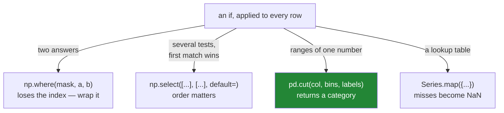

# 2.2 — The three ways to write a condition

## One-line answer

An `if` per row becomes `np.where` for two outcomes, `np.select` for several, and `pd.cut` for
numeric bands — and the only one of the three that keeps your labels is the one you have to wrap
yourself.

---

## The story

Somebody wants each line of the list marked *dear* or *cheap*, depending on whether it is over a
pound.

That is an `if`. Everybody knows how to write an `if`, and the obvious way to apply one to every line
is a loop — which is why almost every row-by-row loop in the world exists to hold an `if`.

Then somebody asks for three bands rather than two: cheap, middling, dear. The `if` grows an `elif`.
Then the boundaries need to come from a configuration file, and the `elif` grows a variable. The loop
is now doing real work and it is the slowest thing in the job.

None of that is complicated. It just needed a way to say "test this column, and pick from these
answers" — which is a thing you can say in one line, once you know the words.

---

## The idea in plain language

A condition applied to every row is still a vectorised operation. There are three shapes of it and
each has its own tool.

**Two outcomes: `np.where(condition, if_true, if_false)`.** It takes a mask
([Day 28, 2.1](../../../day-28-selection-and-alignment/parts/02-masks/2.1-a-comparison-makes-a-column.md))
and two values, and picks element by element. It is a NumPy function, so it returns a **plain array
with no index** — the thing
[Day 28, 4.5](../../../day-28-selection-and-alignment/parts/04-alignment/4.5-turning-alignment-off.md)
warned about. Wrapping it back into a Series with the frame's index is the fix, and it is one call.

**Several outcomes: `np.select([conditions], [choices], default=...)`.** It takes a list of masks and
a list of answers, and uses **the first condition that matches**. That "first match wins" rule is
exactly what an `if`/`elif` chain does, so the translation is direct.

**Numeric bands: `pd.cut(column, bins=[...], labels=[...])`.** When the conditions are simply ranges
of one number, `cut` says so more clearly than either of the above — and it returns a **categorical**
column, which is Day 34's subject and is cheaper to store than text.

There is a fourth tool worth naming because people reach for it wrongly. **`Series.map`** replaces
values via a dictionary — `{1: "one", 2: "two"}` — one value at a time. It is right for a lookup table
and wrong for a range test, and **a value not in the dictionary becomes `NaN`**, silently.

The choice between them is not about speed; all four are fast. It is about which one says what you
mean:

| the condition | the tool |
|---|---|
| one test, two answers | `np.where` |
| several tests, first match wins | `np.select` |
| ranges of one number | `pd.cut` |
| a lookup from a fixed set of values | `Series.map` |

---

## Why Setu needs it

- **[2.1](2.1-one-operation-every-row.md)** covered arithmetic. This covers the other thing loops are
  written for.
- **[2.3](2.3-when-there-is-no-vectorised-form.md)** is the honest limit: what to do when the
  condition genuinely cannot be expressed this way.
- **[Day 28, 3.3](../../../day-28-selection-and-alignment/parts/03-writing/3.3-where-mask-and-the-write-that-was-not.md)**
  met `Series.where`, which is the **one-sided** version — it keeps values where the condition holds
  and blanks the rest, rather than choosing between two answers.
- **Day 34** builds `describe` into a data-quality report and uses the categorical dtype `cut`
  produces.
- **Day 91 onwards**, feature engineering is mostly banding and flagging, and every one of those
  features is one of these four calls.

---

## The mechanism

Two outcomes, and the index that went missing:

```python
import numpy as np
import pandas as pd

shop = pd.DataFrame(
    {
        "item": pd.Series(["milk", "bread", "eggs", "rice"], dtype="str"),
        "need": [2, 1, 6, 1],
        "price": [1.15, 1.40, 0.32, 2.05],
    }
).set_index("item")

raw = np.where(shop["price"] > 1, "dear", "cheap")
print("np.where returns:", type(raw).__name__)
print("values          :", raw.tolist())
print()
labelled = pd.Series(raw, index=shop.index, name="band")
print(labelled)
```

**Line by line:**

- `np.where(condition, if_true, if_false)` — three arguments. The condition is a mask; the two answers
  can be single values, as here, or whole columns.
- It is a **NumPy** function, so it takes the mask's values and returns an `ndarray`. The labels are
  gone ([Day 28, 4.5](../../../day-28-selection-and-alignment/parts/04-alignment/4.5-turning-alignment-off.md)).
- `pd.Series(raw, index=shop.index, name="band")` — **the wrap that puts them back.** Without it, the
  result cannot be assigned into the frame safely, cannot be compared with another column, and cannot
  be used as a mask.
- Note that assigning `shop["band"] = raw` **does** work — pandas accepts a bare array of the right
  length and matches it by position. That is convenient and it is exactly the positional matching
  Day 28 spent a section warning about, so the wrap is the habit worth having.

```text
np.where returns: ndarray
values          : ['dear', 'dear', 'cheap', 'dear']

item
milk      dear
bread     dear
eggs     cheap
rice      dear
Name: band, dtype: object
```

Several outcomes, three ways:

```python
nested = np.where(shop["price"] > 2, "high", np.where(shop["price"] > 1, "mid", "low"))
chosen = np.select(
    [shop["price"] > 2, shop["price"] > 1],
    ["high", "mid"],
    default="low",
)
banded = pd.cut(shop["price"], bins=[0, 1, 2, 99], labels=["low", "mid", "high"])
print("nested where:", nested.tolist())
print("np.select   :", chosen.tolist())
print("pd.cut      :", banded.tolist())
print("cut dtype   :", banded.dtype)
```

**Line by line:**

- The **nested** `np.where` works and is the version people write first. With three bands it is
  already hard to read; with five it is unmaintainable, and the closing brackets stack up at the end.
- `np.select([conditions], [choices], default=...)` — **the lists are parallel**: the first condition
  goes with the first choice. The **first matching condition wins**, so the order matters and the
  conditions are written most-specific first, exactly like an `if`/`elif` chain.
- `default="low"` is what happens when no condition matches. **Leaving it out gives `0`** — which
  raises here, because a number cannot go in an array of strings, and which silently scores an
  unmatched row zero when the choices are numeric. Both cases are in *When it breaks*.
- `pd.cut(column, bins=[0, 1, 2, 99], labels=[...])` — **four boundaries make three bands.** This says
  "these are ranges of one number" in a way the other two do not.
- `banded.dtype` is `category`, not `object` — a categorical stores each distinct label once and the
  column as small integers, which is dramatically cheaper on a large frame (Day 34).
- All three give the same answer, so the choice is entirely about which one a reader understands
  fastest.

```text
nested where: ['mid', 'mid', 'low', 'high']
np.select   : ['mid', 'mid', 'low', 'high']
pd.cut      : ['mid', 'mid', 'low', 'high']
cut dtype   : category
```

The four tools, and which question each answers:



And `map`, which is for a different question:

```python
print("map on values:", shop["need"].map({1: "one", 2: "two"}).to_dict())
```

**Line by line:**

- `map` takes a dictionary and replaces each **value** with its entry. It is a lookup, not a test.
- `need` holds `2, 1, 6, 1`. The dictionary knows 1 and 2 and does not know 6.
- **The 6 becomes `NaN`.** No error, no warning — a value the dictionary does not cover is simply
  missing in the result. That is the behaviour to remember, and it is why `map` needs a coverage check
  in production.

```text
map on values: {'milk': 'two', 'bread': 'one', 'eggs': nan, 'rice': 'one'}
```

---

## When it breaks

**`np.select` with no default, and string choices:**

```text
$ uv run python -c "
import numpy as np
import pandas as pd
price = pd.Series([1.15, 0.32], index=['milk', 'eggs'])
np.select([price > 2, price > 1], ['high', 'mid'])
" 2>&1 | tail -1
```

```text
TypeError: Choicelist and default value do not have a common dtype: The DType <class 'numpy.dtypes._PyLongDType'> could not be promoted by <class 'numpy.dtypes.StrDType'>. This means that no common DType exists for the given inputs. For example they cannot be stored in a single array unless the dtype is `object`. The full list of DTypes is: (<class 'numpy.dtypes.StrDType'>, <class 'numpy.dtypes.StrDType'>, <class 'numpy.dtypes._PyLongDType'>)

```

**What it means.** The default you did not supply is **`0`**, an integer — and NumPy 2 refuses to put
an integer in an array of strings, so it raises instead of guessing. The message is long and it is
saying one thing: *your choices are text and your default is a number.*

**This is the good outcome, and it is new.** Under NumPy 1 the same call silently produced the string
`'0'` for every unmatched row, which passed a `str` dtype check and looked like a category nobody had
defined. NumPy 2's promotion rules
([Day 20, 2.5](../../../day-20-arrays-and-dtypes/parts/02-dtypes/2.5-nep-50-and-the-python-number.md))
turned that into an error.

It only protects you when the choices are text. With **numeric** choices the default is still a silent
zero:

```text
$ uv run python -c "
import numpy as np
import pandas as pd
price = pd.Series([1.15, 0.32], index=['milk', 'eggs'])
print(np.select([price > 2, price > 1], [10, 5]).tolist())
"
```

```text
[5, 0]
```

The eggs matched nothing and scored **0** — a plausible number in a column of numbers, with no error.
**Always pass `default=`**, and make it something you would notice.

**A `bins` boundary that excludes a value:**

```text
$ uv run python -c "
import pandas as pd
price = pd.Series([0.0, 1.0, 2.0], index=['free', 'one', 'two'])
print('default   :', pd.cut(price, bins=[0, 1, 2], labels=['low', 'high']).tolist())
print('include 0 :', pd.cut(price, bins=[0, 1, 2], labels=['low', 'high'], include_lowest=True).tolist())
print('right=False:', pd.cut(price, bins=[0, 1, 2], labels=['low', 'high'], right=False).tolist())
"
```

```text
default   : [nan, 'low', 'high']
include 0 : ['low', 'low', 'high']
right=False: ['low', 'high', nan]
```

**What it means.** `cut`'s bins are **half-open on the left by default** — `(0, 1]` and `(1, 2]` — so
a value exactly equal to the lowest boundary falls outside every bin and becomes `NaN`.

The free item got no band at all, silently. `include_lowest=True` pulls it in; `right=False` flips
which end each bin is open at, and then the *top* value falls out instead. **There is no setting that
includes both ends**, so a value on a boundary has to be thought about rather than assumed. Extending
the outer bins — `bins=[-0.01, 1, 99]` — is the usual pragmatic answer.

**The one that is silent and expensive — `map` with a partial dictionary:**

```text
$ uv run python -c "
import pandas as pd
aisle = pd.Series(['07', '03', '11', '07'], index=['milk', 'bread', 'rice', 'eggs'])
names = {'07': 'dairy', '03': 'bakery'}
mapped = aisle.map(names)
print(mapped.to_dict())
print('rows :', len(mapped), '| unmapped:', int(mapped.isna().sum()))
print('missing keys:', sorted(set(aisle) - set(names)))
"
```

```text
{'milk': 'dairy', 'bread': 'bakery', 'rice': nan, 'eggs': 'dairy'}
rows : 4 | unmapped: 1
missing keys: ['11']
```

**What it means.** Three of four rows mapped and one became `NaN`, because aisle `11` is not in the
dictionary. `map` never raises on a key it does not know; it simply produces a blank.

Read the second and third printed lines against each other. `unmapped: 1` tells you **how many** rows
failed; only `missing keys: ['11']` tells you **which key** was absent — and that line is one you have
to write. **`map` reports per row and never per key**, exactly as `isin` does
([Day 28, 2.4](../../../day-28-selection-and-alignment/parts/02-masks/2.4-isin-between-and-the-readable-ones.md)).

`set(column.unique()) - set(mapping)` is the check, and it is one line. Without it, a lookup table
that has fallen behind the data produces blanks that look like missing source data rather than a
stale mapping.

---

## In production

**What a professional writes instead of the teaching version.** The bands are a named constant, the
default is loud, and the coverage is checked:

```python
import numpy as np
import pandas as pd

BANDS: dict[str, tuple[float, float]] = {
    "low": (0.0, 1.0),
    "mid": (1.0, 2.0),
    "high": (2.0, float("inf")),
}


def band_prices(shop: pd.DataFrame) -> pd.DataFrame:
    """Label each price low / mid / high. Any price outside every band is an error."""
    conditions = [shop["price"].between(lo, hi, inclusive="left") for lo, hi in BANDS.values()]
    labelled = pd.Series(
        np.select(conditions, list(BANDS), default="unbanded"),
        index=shop.index,
        name="band",
    )
    if (labelled == "unbanded").any():
        stray = shop.loc[labelled == "unbanded", "price"].tolist()
        raise ValueError(f"prices outside every band: {stray[:5]}")
    return shop.assign(band=labelled.astype("category"))
```

**Line by line:**

- `BANDS` is **one object holding both the names and the boundaries**, so they cannot drift apart. Two
  parallel lists — one of labels, one of numbers — will eventually disagree by one.
- `between(lo, hi, inclusive="left")` — half-open on purpose, and **stated** rather than inherited
  ([Day 28, 2.4](../../../day-28-selection-and-alignment/parts/02-masks/2.4-isin-between-and-the-readable-ones.md)).
  Contiguous half-open bands cannot double-count a boundary value, which is the `cut` failure above,
  solved by construction.
- `list(BANDS)` gives the keys in insertion order
  ([Day 8, 2.3](../../../day-08-containers/parts/02-sets-and-dicts/2.3-a-dict-is-ordered-now.md)), so
  the conditions and the choices are generated from the same source and stay parallel.
- `default="unbanded"` — **a word, not a zero**, so a fall-through is visible rather than looking like
  data.
- The `unbanded` check turns that visibility into an error, and the message carries a **sample** of
  the offending prices rather than all of them.
- `.astype("category")` on the way out, which is what `cut` would have given for free and is worth
  having on a large frame.
- `assign` rather than bracket assignment, so `shop` is untouched
  ([Day 28, 3.2](../../../day-28-selection-and-alignment/parts/03-writing/3.2-the-new-column-that-was-a-mask.md)).

**What changes at scale.** Three things.

**`np.select` evaluates every condition, always.** It does not short-circuit the way an `if`/`elif`
does — all the masks are computed, then combined. With eight conditions over a hundred million rows
that is eight boolean arrays alive at once, 100 MB each
([Day 28, 2.1](../../../day-28-selection-and-alignment/parts/02-masks/2.1-a-comparison-makes-a-column.md)).
It is still vastly faster than a loop; it is not free, and ordering the conditions "cheapest first"
buys nothing.

**The output dtype is decided by the choices**, and a mixture is expensive. `np.select` with string
choices gives an `object` array; converting to `category` afterwards, as above, turns a
pointer-per-row column into one small integer per row. On a hundred million rows that is the
difference between 800 MB and 100 MB.

**And `map` is the fastest of the four** when it applies, because a dictionary lookup per unique value
beats a comparison per row — pandas maps the distinct values and broadcasts the answers. If your
condition really is a lookup, `map` is both the clearest and the quickest.

**The failure that only appears with real data.** A pipeline banded customers with a nested
`np.where` chain, four levels deep. A new tier was added, and somebody inserted its condition in the
middle of the nest — one level too low, so it never matched, because a broader condition above it
caught those rows first. **The chain still ran, every row still got a band, and the new tier was
simply always empty.** It was found when a report showed zero customers in a tier that marketing knew
had thousands. `np.select` with the conditions in a named, ordered structure makes that mistake
visible; a nest of `np.where` hides it inside its brackets.

**The review comment a senior engineer leaves.** *"Three nested `np.where` calls — use `np.select` with
a list of conditions, and pass `default=`. Right now a row matching nothing gets `0`, which becomes
the string `'0'` and looks like a category. Also assert that nothing hits the default; a silent
fall-through is how a band goes missing."*

**The interview question.** *"How do you apply an if/else to every row without a loop?"* `np.where` for
two outcomes, `np.select` for several, `pd.cut` when the conditions are numeric ranges, and
`Series.map` when it is really a lookup. Then the three gotchas that show you have used them:
`np.where` returns a **NumPy array with no index**, so wrap it in a Series before assigning or
comparing; `np.select`'s default is **`0`** if you do not supply one, which silently becomes the
string `'0'` among string choices; and both `map` and `cut` produce **`NaN`** for anything they do not
cover — `map` for a key not in the dictionary, `cut` for a value on the lowest boundary — so the
coverage needs checking rather than assuming.

---

## Check yourself

```bash
uv run python -c "
import numpy as np
import pandas as pd
price = pd.Series([0.0, 1.15, 2.50], index=['free', 'milk', 'rice'], name='price')
print('np.where  :', np.where(price > 1, 'dear', 'cheap').tolist())
print('np.select :', np.select([price > 2, price > 1], ['high', 'mid'], default='low').tolist())
print('pd.cut    :', pd.cut(price, bins=[0, 1, 2, 99], labels=['low', 'mid', 'high']).tolist())
print('index kept:', type(np.where(price > 1, 1, 0)).__name__)
"
```

One of those four result lines has a value in it that is not one of the labels you asked for. Find
it, say where it came from, and say which argument would have prevented it.

**Answer out loud, without scrolling up:**

> Name the tool for two outcomes, the tool for several, and the tool for numeric ranges. Then say what
> `np.select` does with a row that matches no condition when you have not passed `default=`, and what
> `pd.cut` does with a value exactly equal to the lowest bin edge.

---

**Next:** [2.3 — When there is no vectorised form](2.3-when-there-is-no-vectorised-form.md).
