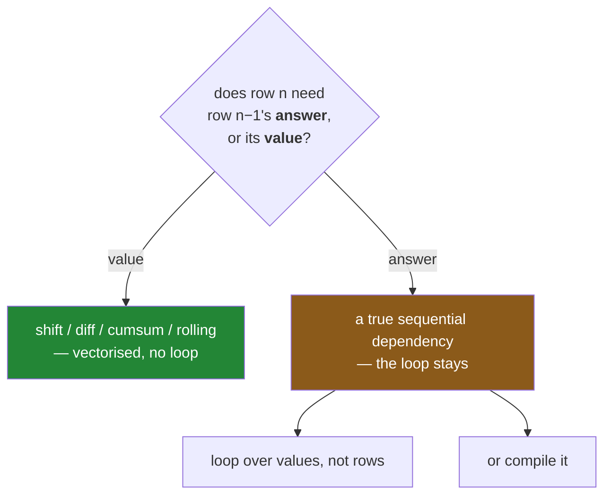

# 2.3 — When there is no vectorised form

## One-line answer

Almost everything people think needs a loop has a vectorised form — `cumsum`, `shift`, `diff`, the
`.str` accessor — and the genuine exception is a **true sequential dependency**, where each row's
answer depends on the previous row's *answer* rather than on its value.

---

## The story

Somebody keeps a running balance of the flat's kitty. Money in, money out, one line at a time, and a
running total down the right-hand side.

That looks like a loop, and for a while it is written as one. Then somebody points out that a running
total is a single call, and it is — the balance column comes out right and the loop disappears.

Then a rule is added: the kitty is never allowed to go below zero. If a week's spending would take it
negative, the balance is set to zero and the next week starts from there.

The single call stops working. Not by a little — the numbers are completely different, and the reason
is that the floor changes what the *next* row starts from. Every row now depends on what the previous
row's answer turned out to be, not on what the previous row's value was.

That is a different kind of problem, and it is the one case in this section where the loop stays.

---

## The idea in plain language

Most "this needs a loop" instincts are wrong, and it is worth knowing the specific vectorised
replacements before believing yours is the exception:

**A running total** is `cumsum` — and `cumprod`, `cummax`, `cummin` for the others
([Day 23, 1.7](../../../day-23-ufuncs-and-statistics/parts/01-ufuncs/1.7-reduce-accumulate-and-at.md)).

**"Compare this row with the previous one"** is `shift`, which moves a column up or down by a number
of rows, or `diff`, which subtracts the shifted version. Neither needs a loop, because the previous
row's **value** is just the column offset by one.

**Text work** — upper-casing, stripping, splitting, matching — is the `.str` accessor, which applies a
string operation down the whole column and, on pandas 3.0's Arrow-backed `str` dtype, does it in
compiled code ([Day 26, 2.3](../../../day-26-frames-and-copy-on-write/parts/02-the-str-dtype/2.3-the-storage-behind-it.md)).
Day 33 covers it properly.

**A rolling window** — a seven-day average, a running maximum over the last ten — is `rolling`, and
Day 33 covers that too.

So the honest test for "does this need a loop" is one question: **does row `n` depend on the
*answer* computed for row `n − 1`, or only on row `n − 1`'s data?**

If it depends on the data, `shift` gives you that data and no loop is needed. If it depends on the
**answer** — a running balance with a floor, a state machine, a cumulative process that can reset —
then the answer for each row cannot be computed until the previous one exists, and there is nothing to
parallelise. That is a **true sequential dependency**, and it is the real exception.

When you have one, three honest options, in order of how much they cost you:

1. **Loop, and accept it.** Over the values, not over rows — `for value in column` or a `zip` of
   columns ([1.3](../01-the-loop/1.3-itertuples-and-what-it-costs.md)) — which is far quicker than
   `iterrows` and is often fast enough.
2. **Compile the loop**, with a tool such as Numba, which turns the Python loop into machine code.
   This genuinely closes most of the gap and adds a dependency.
3. **Find a clever vectorised reformulation.** These exist for some problems and are usually harder to
   read than the loop. Reach for one when it is measured to matter, not on principle.

---

## Why Setu needs it

- **[2.1](2.1-one-operation-every-row.md)** and **[2.2](2.2-the-three-ways-to-write-a-condition.md)**
  are what to use nearly always. This is the boundary of that advice.
- **[3.3](../03-the-measurement/3.3-the-number-and-where-it-stops-mattering.md)** is the other side of
  the same honesty: knowing when the speedup does not matter.
- **[1.1](../01-the-loop/1.1-reading-the-list-one-line-at-a-time.md)** listed the cases where a loop
  is right. This adds the fourth and hardest one.
- **Day 33** is `rolling` and the `.str`/`.dt` accessors — the vectorised forms of three more things
  people write loops for.
- **Day 35** is where Polars and DuckDB appear, and a sequential dependency is one of the few places
  where they help no more than pandas does.

---

## The mechanism

The three replacements people most often miss:

```python
import pandas as pd

shop = pd.DataFrame(
    {
        "item": pd.Series(["milk", "bread", "eggs", "rice"], dtype="str"),
        "need": [2, 1, 6, 1],
        "price": [1.15, 1.40, 0.32, 2.05],
    }
).set_index("item")

print("running total :", shop["need"].cumsum().to_dict())
print("previous price:", shop["price"].shift(1).to_dict())
print("change        :", shop["price"].diff().round(2).to_dict())
```

**Line by line:**

- `cumsum()` — the running total, one call. Each entry is the sum of everything up to and including
  that row, which is exactly what the loop with an accumulator was building
  ([Day 23, 1.7](../../../day-23-ufuncs-and-statistics/parts/01-ufuncs/1.7-reduce-accumulate-and-at.md)).
- `shift(1)` — every value moved **down** one row, so each row now sees what the row above held. The
  first row has nothing above it, so it is `NaN` — and that blank promotes the column to `float64`
  ([Day 28, 4.3](../../../day-28-selection-and-alignment/parts/04-alignment/4.3-the-nan-that-changed-the-dtype.md)).
- `diff()` is `column - column.shift(1)`, spelled shorter. It is the answer to "how much did this
  change from the last one", which is one of the most common reasons a loop gets written.
- `.round(2)` on the diff, because subtracting floats produces long tails
  ([Day 20, 2.3](../../../day-20-arrays-and-dtypes/parts/02-dtypes/2.3-floats-nan-and-precision.md)).
- **None of these needs the previous row's answer** — only its value, which `shift` supplies as a
  column.

```text
running total : {'milk': 2, 'bread': 3, 'eggs': 9, 'rice': 10}
previous price: {'milk': nan, 'bread': 1.15, 'eggs': 1.4, 'rice': 0.32}
change        : {'milk': nan, 'bread': 0.25, 'eggs': -1.08, 'rice': 1.73}
```

The test, drawn:



Now the genuine exception — a running balance that cannot go below zero:

```python
def running_floor(values: list[float], floor: float = 0.0) -> list[float]:
    """A running total that never drops below `floor`. Each step needs the last step's answer."""
    out = []
    balance = 0.0
    for value in values:
        balance = max(balance + value, floor)
        out.append(balance)
    return out


weekly = [5.0, -8.0, 3.0, -1.0]
print("with a floor :", running_floor(weekly))
print("plain cumsum :", pd.Series(weekly).cumsum().tolist())
```

**Line by line:**

- `balance = max(balance + value, floor)` — **the line that cannot be vectorised.** The `max` may
  replace the running total with the floor, and the next iteration starts from *that*, not from the
  arithmetic sum.
- The loop is over **values**, not rows — `for value in values` — which is the cheap kind of loop
  ([1.1](../01-the-loop/1.1-reading-the-list-one-line-at-a-time.md)). Even here, `iterrows` would be
  the wrong choice.
- `cumsum` is shown next to it to make the difference concrete rather than assert it.
- Read the two outputs against each other: the floor version's third entry is 3.0 because the balance
  was reset to zero by the second week. `cumsum` has no way to know that; its third entry is 0.0,
  carrying the full −8.0 forward.

```text
with a floor : [5.0, 0.0, 3.0, 2.0]
plain cumsum : [5.0, -3.0, 0.0, -1.0]
```

**Every value after the first differs.** That is what a true sequential dependency looks like: not a
small discrepancy, but a different computation, because the state carried between rows is not the
running sum.

---

## When it breaks

**Assuming `shift` needs a sorted frame — it does not, and that is the problem:**

```text
$ uv run python -c "
import pandas as pd
readings = pd.DataFrame(
    {'day': [3, 1, 2], 'value': [30, 10, 20]},
    index=['c', 'a', 'b'],
)
print('as given  :', readings['value'].diff().to_dict())
print('sorted    :', readings.sort_values('day')['value'].diff().to_dict())
"
```

```text
as given  : {'c': nan, 'a': -20.0, 'b': 10.0}
sorted    : {'a': nan, 'b': 10.0, 'c': 10.0}
```

**What it means.** `shift` and `diff` move rows by **position**, not by any notion of order in the
data ([Day 28, 1.3](../../../day-28-selection-and-alignment/parts/01-label-and-position/1.3-iloc-by-position.md)).
The frame arrived with day 3 first, so "the previous row" meant day 3 for day 1, and the differences
are nonsense.

**No error, and every number is plausible.** A `diff` on an unsorted frame answers a question nobody
asked. Sorting first is not optional, and asserting `is_monotonic_increasing` on the ordering column
before calling `diff` is the version that cannot be forgotten
([Day 28, 1.5](../../../day-28-selection-and-alignment/parts/01-label-and-position/1.5-the-slice-that-includes-its-end.md)).

**Trying to vectorise a sequential dependency and getting a plausible answer:**

```text
$ uv run python -c "
import pandas as pd
weekly = pd.Series([5.0, -8.0, 3.0, -1.0])
print('clip then cumsum:', weekly.clip(lower=0).cumsum().tolist())
print('cumsum then clip:', weekly.cumsum().clip(lower=0).tolist())
print('the real answer :', [5.0, 0.0, 3.0, 2.0])
"
```

```text
clip then cumsum: [5.0, 5.0, 8.0, 8.0]
cumsum then clip: [5.0, 0.0, 0.0, 0.0]
print('the real answer :', [5.0, 0.0, 3.0, 2.0])
```

**What it means.** Two reasonable-looking one-liners, and **neither is right.**

Clipping first throws away the spending entirely, so the balance only ever rises. Clipping afterwards
floors the *displayed* total but never resets what the next row builds on, so once it goes negative it
stays there. The correct answer — `[5.0, 0.0, 3.0, 2.0]` — is neither.

**This is why the test matters.** Both attempts are the kind of thing that gets written, reviewed and
merged, because they use the right functions and produce a column of plausible numbers. Only comparing
against the loop reveals that they answer different questions.

**The one that is a loop and should not be — text:**

```text
$ uv run python -c "
import time
import pandas as pd
names = pd.Series(['  Milk ', 'BREAD', 'eggs '] * 30000)
print('dtype:', names.dtype)
obj = names.astype('object')

def best(fn, reps=3):
    t = []
    for _ in range(reps):
        s = time.perf_counter()
        fn()
        t.append(time.perf_counter() - s)
    return min(t) * 1000

print(f'list comprehension  {best(lambda: [n.strip().casefold() for n in names]):7.1f} ms')
print(f'.str on str dtype   {best(lambda: names.str.strip().str.casefold()):7.1f} ms')
print(f'.str on object      {best(lambda: obj.str.strip().str.casefold()):7.1f} ms')
"
```

```text
dtype: str
list comprehension    208.4 ms
.str on str dtype      29.6 ms
.str on object         67.0 ms
```

**What it means.** Text vectorises too, and the dtype decides by how much.

`.str` on pandas 3.0's `str` dtype is **seven times faster** than the list comprehension. That dtype
is Arrow-backed
([Day 26, 2.3](../../../day-26-frames-and-copy-on-write/parts/02-the-str-dtype/2.3-the-storage-behind-it.md)),
so the strip and the case-fold happen in compiled code over a contiguous buffer, exactly as arithmetic
does on a numeric column.

The third line is the one worth remembering. The **same call** on the same values stored as `object`
takes more than twice as long, because an `object` column is a block of pointers to separate Python
string objects, and the operation has to chase each one
([Day 26, 2.1](../../../day-26-frames-and-copy-on-write/parts/02-the-str-dtype/2.1-text-used-to-be-object.md)).

So Day 26's insistence that text columns should be `str` and not `object` was not only about memory.
**A dtype that arrived wrong at read time makes every later text operation two to three times
slower**, silently, and the only symptom is the clock — the same failure mode
[2.1](2.1-one-operation-every-row.md) described for numeric columns turning into `object`.

---

## In production

**What a professional writes instead of the teaching version.** A genuine sequential dependency is
isolated in one small, well-named, tested function that loops over **values**:

```python
from collections.abc import Iterable

import pandas as pd


def running_balance(amounts: pd.Series, floor: float = 0.0) -> pd.Series:
    """A running total that never falls below `floor`. Sequential by nature; see the docstring."""
    if not amounts.index.is_unique:
        raise ValueError("a running balance needs a unique index to be reproducible")
    return pd.Series(_walk(amounts.to_numpy(), floor), index=amounts.index, name="balance")


def _walk(values: Iterable[float], floor: float) -> list[float]:
    """The one loop in this module. Each step needs the previous step's result, so it cannot vectorise."""
    out: list[float] = []
    balance = 0.0
    for value in values:
        balance = max(balance + value, floor)
        out.append(balance)
    return out
```

**Line by line:**

- The loop is in a **private helper** with a docstring saying *why* it is a loop. Without that
  sentence, the next person to read the module deletes it and replaces it with `cumsum`, and the
  numbers change quietly — which is exactly the failure above.
- `amounts.to_numpy()` before looping — iterating a NumPy array is faster than iterating a Series, and
  the labels are not needed inside the loop
  ([Day 28, 4.5](../../../day-28-selection-and-alignment/parts/04-alignment/4.5-turning-alignment-off.md)).
- The result is wrapped **back into a Series with the original index**, so the function's caller gets
  a labelled column and the label-stripping is confined to the inside of one function.
- `index.is_unique` checked, because a running balance over a duplicated index is not reproducible —
  the order of the duplicates decides the answer ([Day 28, 5.3](../../../day-28-selection-and-alignment/parts/05-reindexing/5.3-duplicate-labels.md)).
- **The public function is vectorised in shape** — Series in, Series out — even though its middle is a
  loop. Callers never see the loop, and it can be replaced with a compiled version later without
  changing a signature.

**What changes at scale.** Three things.

**A Python loop over values is roughly a hundred times slower than compiled code, and that is the
ceiling** for a sequential dependency in pure pandas. At a million rows the loop above takes a
fraction of a second; at a hundred million it takes a minute, and no amount of pandas cleverness
changes that.

**Numba is the honest next step.** Decorating `_walk` with `@njit` compiles it to machine code and
typically recovers most of the gap, because the loop's *structure* was never the problem — the Python
interpreter was. It is a real dependency with a real compile step, so it goes in when a measurement
justifies it, not before.

**And some sequential problems have a parallel reformulation, and some do not.** A running maximum
parallelises; a running balance with a reset does not, in general, because the reset makes the answer
depend on the whole prefix. Knowing which kind you have is a genuinely hard question, and the
pragmatic answer for this curriculum is: measure the loop, and if it is fast enough, stop.

**The failure that only appears with real data.** A finance job computed a running balance with a
floor, correctly, in a loop. A performance review flagged the loop, and it was replaced with
`cumsum().clip(lower=0)` — which is the second wrong answer above. **The totals were right whenever
the balance never went negative**, which was most accounts, so the tests passed and the change
shipped. The accounts that did go negative reported balances that were too low, and it took four
months and a customer complaint to find. The loop's docstring saying "cannot be vectorised" was added
afterwards.

**The review comment a senior engineer leaves.** *"This loop is a genuine sequential dependency — the
floor resets what the next row starts from — so `cumsum` is not equivalent. Please say that in the
docstring, and add a test comparing against `cumsum` on a case where the balance goes negative, so
nobody 'optimises' it later."*

**The interview question.** *"Can everything in pandas be vectorised?"* No, and the test is precise:
if row `n` depends only on row `n − 1`'s **value**, `shift` or `diff` gives you that as a column and no
loop is needed; if it depends on row `n − 1`'s **answer** — a running balance that resets, a state
machine — then it is a true sequential dependency and there is nothing to parallelise. Then the two
things that show judgement: when you do loop, loop over **values or a zip of columns**, not over rows,
because that is a hundred times cheaper than `iterrows`; and the speedup you get depends on the
**dtype** — `.str` on pandas 3.0's Arrow-backed `str` column is around seven times faster than a list
comprehension, while the same call on an `object` column is less than half that, so a dtype that
arrived wrong at read time quietly costs you performance as well as correctness.

---

## Check yourself

```bash
uv run python -c "
import pandas as pd
weekly = pd.Series([5.0, -8.0, 3.0, -1.0])
def walk(values, floor=0.0):
    out, balance = [], 0.0
    for v in values:
        balance = max(balance + v, floor)
        out.append(balance)
    return out
print('loop            :', walk(weekly))
print('clip then cumsum:', weekly.clip(lower=0).cumsum().tolist())
print('cumsum then clip:', weekly.cumsum().clip(lower=0).tolist())
print('shift           :', weekly.shift(1).tolist())
"
```

Three one-liners try to replace the loop and all three fail. Say, for each, what question it actually
answers — and say which of the four uses the previous row's *answer* rather than its *value*.

**Answer out loud, without scrolling up:**

> Give the one-question test for whether something needs a loop. Then name the vectorised replacement
> for a running total and for "compare this row with the previous one", and say why `.str` methods do
> not give the speedup you would expect.

---

**Next:** [3.1 — What a million rows is for](../03-the-measurement/3.1-what-a-million-rows-is-for.md).
