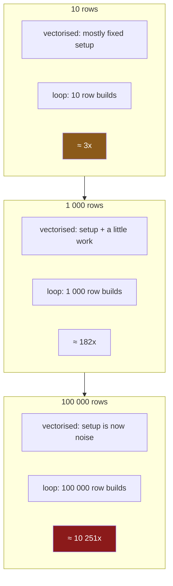

# 3.1 — What a million rows is for

## One-line answer

The loop is three times slower on ten rows and ten thousand times slower on a hundred thousand — so
the size you measure at does not merely change the number, it changes the **conclusion**, and a
million rows is where the answer stops being an artefact of the overhead.

---

## The story

Somebody is told the loop is slow and does not believe it, so they check.

They write the loop, write the one-liner, time both on the shopping list, and the loop is about three
times slower. Three times is nothing. Three times is the kind of difference you accept for code that
reads better, and the four-line loop with the running total reads better to them than the expression
does.

So they carry on writing loops, having done the responsible thing and measured.

The measurement was real. The list had four lines on it.

---

## The idea in plain language

Every timing has two parts: the work, and the **overhead** of setting the work up.

For the vectorised expression, the overhead is fixed — a few function calls, a dtype check, an
alignment check ([Day 28, 4.2](../../../day-28-selection-and-alignment/parts/04-alignment/4.2-alignment-is-automatic.md))
— and the work is proportional to the number of rows. On a tiny frame the overhead *is* the timing,
and the work is invisible.

For the loop, there is almost no fixed overhead and a large **per-row** cost
([1.1](../01-the-loop/1.1-reading-the-list-one-line-at-a-time.md)). Everything it does is
proportional to the rows.

So on a small frame the two are close — you are comparing pandas' fixed setup against a handful of
row constructions. As the frame grows, the vectorised version's setup gets amortised across more and
more rows while the loop's per-row cost keeps accumulating. **The ratio itself grows with the size.**

That is the thing to understand before reading any benchmark in this section: *"how much faster is
vectorised"* has no single answer. It has a curve. Quoting one number without the size is close to
meaningless, which is why the plan's example names a size — **a million rows** — and why this part
measures the curve before section 3.2 measures the point.

A million is a reasonable place to land for three reasons. It is large enough that the fixed overhead
has vanished into the noise, so the ratio reflects the real per-row costs. It is small enough to fit
comfortably in memory on a laptop, so nothing is measuring swap. And it is a realistic size for the
kind of data this curriculum handles — Day 27's benchmark file had half a million rows
([Day 27, 3.3](../../../day-27-reading-and-writing/parts/03-parquet/3.3-the-size-and-the-speed-measured.md)).

Everything Day 25 established about honest timing still applies: take the **minimum** of several runs,
not the mean; keep setup out of the timed region; and be suspicious of a comparison that moves between
runs ([Day 25, 4.2](../../../day-25-copy-view-and-the-gate/parts/04-the-benchmark/4.2-timeit-honestly.md)).

---

## Why Setu needs it

- **[3.2](3.2-the-four-ways-timed.md)** is the plan's named example, measured at a million, and this
  part is why that size was chosen.
- **[3.3](3.3-the-number-and-where-it-stops-mattering.md)** is the other half: where on this curve
  your data actually sits, and whether the difference matters for you.
- **[Day 25, 4.1](../../../day-25-copy-view-and-the-gate/parts/04-the-benchmark/4.1-what-fifty-times-is-against.md)**
  asked what a speed-up figure is measured *against*. This asks what it is measured *at*.
- **[1.1](../01-the-loop/1.1-reading-the-list-one-line-at-a-time.md)** measured 450× at two thousand
  rows. This part explains why that number is neither wrong nor the whole story.
- **Day 35** compares pandas against Polars and DuckDB, where the same trap waits: those tools have
  larger fixed overheads and win only above a size that has to be measured rather than assumed.

---

## The mechanism

The same comparison, at five sizes:

```python
import time

import numpy as np
import pandas as pd

rng = np.random.default_rng(29)


def frame(n: int) -> pd.DataFrame:
    """A frame of `n` rows, built from the day's seed so the sizes are comparable."""
    return pd.DataFrame(
        {
            "need": rng.integers(1, 9, n).astype("int64"),
            "price": np.round(rng.uniform(0.2, 4.0, n), 2),
        }
    )


def best(fn, reps: int) -> float:
    """Milliseconds for the fastest of `reps` runs."""
    times = []
    for _ in range(reps):
        start = time.perf_counter()
        fn()
        times.append(time.perf_counter() - start)
    return min(times) * 1000


print(f"{'rows':>9}  {'iterrows':>10}  {'vectorised':>10}  {'ratio':>8}")
for n in (10, 100, 1_000, 10_000, 100_000):
    f = frame(n)
    reps = 5 if n <= 10_000 else 2
    loop = best(lambda: sum(r["need"] * r["price"] for _, r in f.iterrows()), reps)
    vec = best(lambda: float((f["need"] * f["price"]).sum()), 50)
    print(f"{n:>9,}  {loop:>9.2f}ms  {vec:>9.3f}ms  {loop / vec:>7.0f}x")
```

**Line by line:**

- `default_rng(29)` — the day's seed, so the frames are reproducible
  ([Day 20, 4.2](../../../day-20-arrays-and-dtypes/parts/04-random/4.2-the-seed-is-part-of-the-result.md)).
- `frame(n)` is called **outside** the timed region, so building the data is never measured
  ([Day 25, 4.2](../../../day-25-copy-view-and-the-gate/parts/04-the-benchmark/4.2-timeit-honestly.md)).
- `min(times)` and never the mean — the fastest run is the one least disturbed by everything else on
  the machine.
- `reps = 5 if n <= 10_000 else 2` — **fewer repetitions on the big frames**, because the loop at a
  hundred thousand rows takes seconds and five of those is a long wait. Fewer repetitions is a
  slightly noisier number, and at those sizes the ratio is so large that noise cannot change the
  conclusion.
- `reps=50` for the vectorised call, because a single sub-millisecond run measures Python's first-call
  overhead rather than the work.
- The lambdas capture `f` from the enclosing loop, which is fine here because each is called before
  `f` is reassigned ([Day 10, 2.4](../../../day-10-functions/parts/02-scope/2.4-closures-and-late-binding.md)).

```text
     rows    iterrows  vectorised     ratio
       10       0.28ms      0.090ms        3x
      100       2.11ms      0.089ms       24x
    1,000      29.24ms      0.160ms      182x
   10,000     343.83ms      0.243ms     1416x
  100,000    8147.11ms      0.795ms    10251x
```

**Read down the last column, because that column is the whole part.**

Three times. Twenty-four. A hundred and eighty-two. Fourteen hundred. Ten thousand.

**Every one of those is a true measurement of the same two pieces of code.** Somebody who benchmarks
on ten rows will tell you honestly that the loop is fine. Somebody who benchmarks on a hundred
thousand will tell you, just as honestly, that it is four orders of magnitude worse. They are both
right and they will not be able to agree.

Now read the middle column. The vectorised time goes from 0.090 ms to 0.795 ms — **it grew by less
than nine times while the data grew by ten thousand**. Most of that first number was not work at all;
it was the fixed cost of asking. By a hundred thousand rows the fixed cost has been absorbed and the
column has started to grow with the data, which is what it should do.

Why the ratio climbs:



**The loop's line is straight and the vectorised line is nearly flat at first**, so the gap between
them widens for as long as the fixed cost matters — which is up to somewhere around ten thousand rows
on this machine.

---

## When it breaks

**A benchmark on the four-row shopping list:**

```text
$ uv run python -c "
import time
import pandas as pd
shop = pd.DataFrame({'need': [2, 1, 6, 1], 'price': [1.15, 1.40, 0.32, 2.05]})

def best(fn, reps=200):
    t = []
    for _ in range(reps):
        s = time.perf_counter()
        fn()
        t.append(time.perf_counter() - s)
    return min(t) * 1_000_000

print(f'iterrows   {best(lambda: sum(r[\"need\"] * r[\"price\"] for _, r in shop.iterrows())):8.1f} us')
print(f'vectorised {best(lambda: float((shop[\"need\"] * shop[\"price\"]).sum())):8.1f} us')
"
```

```text
iterrows      182.4 us
vectorised    153.6 us
```

**What it means.** About **one and a fifth times**, in microseconds. On four rows the two are
practically indistinguishable — both are dominated by their fixed costs — and a reasonable person
reading only this would conclude the loop is free.

**The measurement is correct and the conclusion does not generalise.** That is the trap, and it is not
carelessness — it is the natural result of benchmarking on the data you happen to have open. The fix
is not to distrust benchmarks; it is to state the size with every ratio you quote, and to measure at
the size you actually run at ([3.3](3.3-the-number-and-where-it-stops-mattering.md)).

**A single un-repeated timing of a fast operation:**

```text
$ uv run python -c "
import time
import pandas as pd
shop = pd.DataFrame({'need': list(range(100000)), 'price': [1.0] * 100000})
s = time.perf_counter()
float((shop['need'] * shop['price']).sum())
once = time.perf_counter() - s
times = []
for _ in range(50):
    s = time.perf_counter()
    float((shop['need'] * shop['price']).sum())
    times.append(time.perf_counter() - s)
print(f'first call   {once * 1000:7.3f} ms')
print(f'best of 50   {min(times) * 1000:7.3f} ms')
print(f'overstated by {once / min(times):5.1f}x')
"
```

```text
first call     1.374 ms
best of 50     0.382 ms
overstated by   3.6x
```

**What it means.** The first call took three and a half times longer than the same call warmed up,
because the first one paid for imports, allocation and cache misses that the later ones did not.

Time a millisecond-scale operation once and you overstate it by a factor of three; put that in the
denominator of a ratio and the ratio is three times too small. **This is exactly the mistake
[1.1](../01-the-loop/1.1-reading-the-list-one-line-at-a-time.md)'s check-yourself warns about**, and
it is why every timing in this day takes the minimum of several runs
([Day 25, 4.2](../../../day-25-copy-view-and-the-gate/parts/04-the-benchmark/4.2-timeit-honestly.md)).

**The one that quietly changes what is being measured:**

```text
$ uv run python -c "
import time
import numpy as np
import pandas as pd
rng = np.random.default_rng(29)

s = time.perf_counter()
f = pd.DataFrame({'need': rng.integers(1, 9, 200000), 'price': rng.uniform(0.2, 4.0, 200000)})
total = float((f['need'] * f['price']).sum())
with_setup = time.perf_counter() - s

times = []
for _ in range(20):
    s = time.perf_counter()
    float((f['need'] * f['price']).sum())
    times.append(time.perf_counter() - s)
print(f'building + summing {with_setup * 1000:7.2f} ms')
print(f'summing only       {min(times) * 1000:7.2f} ms')
print(f'the frame was      {with_setup / min(times):5.0f}x the operation')
"
```

```text
building + summing   11.90 ms
summing only          1.08 ms
the frame was        11x the operation
```

**What it means.** Building the frame took eleven times as long as the operation being measured.

Leave the construction inside the timed region — which is easy to do, because it looks like part of
the setup — and you are mostly timing `default_rng`. The vectorised version then appears far slower
than it is, the ratio against the loop collapses, and the benchmark says the two are comparable.

**Build once, outside; time only the operation.** It is the first rule of
[Day 25, 4.2](../../../day-25-copy-view-and-the-gate/parts/04-the-benchmark/4.2-timeit-honestly.md)
and the easiest one to break by accident.

---

## In production

**What a professional writes instead of the teaching version.** A benchmark that is going to be
believed states its size, repeats itself, and reports the shape rather than one number:

```python
import time
from collections.abc import Callable

import pandas as pd


def sweep(build: Callable[[int], pd.DataFrame], sizes: tuple[int, ...], **cases) -> pd.DataFrame:
    """Time each case at each size. Returns a frame, so the result can be checked in."""
    rows = []
    for n in sizes:
        frame = build(n)
        for name, run in cases.items():
            times = []
            for _ in range(3):
                start = time.perf_counter()
                run(frame)
                times.append(time.perf_counter() - start)
            rows.append({"rows": n, "case": name, "ms": min(times) * 1000})
    return pd.DataFrame(rows).pivot(index="rows", columns="case", values="ms")
```

**Line by line:**

- It **returns a frame**, not printed text. A benchmark whose output is a frame can be written to
  Parquet, compared against last month's, and asserted on in a test
  ([Day 25, 5.2](../../../day-25-copy-view-and-the-gate/parts/05-the-gate/5.2-the-performance-test-in-ci.md)).
- `build(n)` is called **once per size**, outside the timing loop — the rule the third failure above
  exists to teach.
- `min(times)` again, and `3` repetitions as a floor. A serious sweep raises that for the fast cases.
- `**cases` — the cases are named keyword arguments, so a call reads
  `sweep(frame, SIZES, loop=..., vectorised=...)` and the names end up as columns.
- `.pivot(...)` turns the long list of measurements into a table with one row per size and one column
  per case, which is the shape a human reads. Pivoting is Day 32's subject.
- **`sizes` is a parameter**, because the whole point of this part is that the answer depends on it.

**What changes at scale.** Three things worth knowing before you trust any number in section 3.2.

**The curve flattens.** The ratio grows while the fixed overhead still matters, then levels off once
both sides are dominated by per-row work. Somewhere past a hundred thousand rows the loop and the
expression are both linear, and the ratio stops climbing — so "it gets worse forever" is not true
either. The measured plateau on this machine is around ten thousand times.

**Memory changes the shape.** Once a column no longer fits in the processor's cache, the vectorised
version becomes limited by memory bandwidth rather than arithmetic, and its line steepens slightly.
The loop is so far from that limit that it does not notice. This is why a benchmark that fits in cache
can flatter the vectorised version, and why a realistic size matters in both directions.

**And the machine matters more than people admit.** Every number in this day was measured on one
laptop, under whatever else it was doing. A ratio of ten thousand is robust to that; a difference of
ten per cent is not, which is why
[1.3](../01-the-loop/1.3-itertuples-and-what-it-costs.md) refused to draw a conclusion from one.

**The failure that only appears with real data.** A team benchmarked two implementations on a
thousand-row sample carved out of production, chose the one that won, and shipped it. In production,
at four million rows, the other one was six times faster — because the winner's advantage was a lower
fixed cost and the loser's was a lower per-row cost, and the sample had been chosen small enough to be
convenient. **The sample size was the experiment's most important parameter and nobody had written it
down.**

**The review comment a senior engineer leaves.** *"This benchmark says 3× — at what size? The frame in
the fixture has four rows. Please sweep a few sizes and report the table; a single ratio without a row
count is not a result anybody can act on."*

**The interview question.** *"How would you decide whether to optimise a pandas operation?"* Measure it
**at the size you actually run at**, because the ratio between a loop and a vectorised expression is
not a constant — it is around three times at ten rows and ten thousand times at a hundred thousand, on
the same two pieces of code. Then the mechanics that make the measurement trustworthy: build the data
outside the timed region, repeat and take the **minimum** rather than the mean, and treat any
difference that moves between runs as noise. And the judgement: a ratio measured on a fixture-sized
frame is not evidence about production, which is the single most common way benchmarks mislead.

---

## Check yourself

```bash
uv run python -c "
import time
import pandas as pd
def best(fn, reps):
    t = []
    for _ in range(reps):
        s = time.perf_counter()
        fn()
        t.append(time.perf_counter() - s)
    return min(t) * 1000
for n in (10, 1000, 20000):
    f = pd.DataFrame({'need': list(range(n)), 'price': [1.0] * n})
    loop = best(lambda: sum(r['need'] * r['price'] for _, r in f.iterrows()), 3)
    vec = best(lambda: float((f['need'] * f['price']).sum()), 30)
    print(f'{n:>6} rows: loop {loop:8.2f} ms   vectorised {vec:6.3f} ms   {loop / vec:6.0f}x')
"
```

Three sizes, three very different answers to the same question. Say which of the three you would quote
if somebody asked "how much faster is vectorised", and what you would have to say alongside it.

**Answer out loud, without scrolling up:**

> The loop is three times slower on ten rows and ten thousand times slower on a hundred thousand. Say
> why the ratio changes, in terms of fixed cost and per-row cost. Then say what a benchmark of a
> millisecond-scale operation gets wrong if it runs the operation only once.

---

**Next:** [3.2 — The four ways, timed](3.2-the-four-ways-timed.md).
