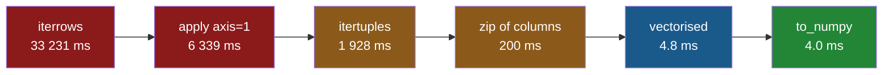

# 3.2 — The four ways, timed on a million rows

## One-line answer

Six ways to add up the same million rows, all giving the identical total: `iterrows` takes **thirty-
three seconds**, `apply` six, `itertuples` two, a zip of columns a fifth of a second, and the
vectorised expression **under five milliseconds**.

---

## The story

The shop's three-year export finally arrives — a million lines — and somebody wants to know what it
all came to.

They write the loop they always write, start it, and go to make tea. When they come back it is still
going. It finishes eventually, and the number it produces is correct.

Later, having read section 2, they write the one-line version out of curiosity and run it expecting to
wait again.

It is finished before their finger is off the key.

Both answers agree to the penny. Neither is more correct than the other. The only difference is that
one of them took long enough to make tea and the other took less time than a blink.

---

## The idea in plain language

This is the plan's named example: **`iterrows` against vectorised, timed on a million rows.** This
part measures it, and four other ways alongside it, so that the comparison is a table rather than a
slogan.

The six ways, all computing `sum(need × price)`:

- **`iterrows`** — a Series per row ([1.2](../01-the-loop/1.2-iterrows-and-the-row-that-lost-its-dtype.md)).
- **`apply(axis=1)`** — a Series per row, plus a function call ([1.5](../01-the-loop/1.5-apply-is-a-loop-wearing-a-hat.md)).
- **`itertuples`** — a namedtuple per row ([1.3](../01-the-loop/1.3-itertuples-and-what-it-costs.md)).
- **a zip of the two columns** — no per-row object at all, just two values.
- **vectorised** — `(need * price).sum()` ([2.1](../02-vectorised/2.1-one-operation-every-row.md)).
- **`to_numpy()` then vectorised** — the same, with the labels stripped first
  ([Day 28, 4.5](../../../day-28-selection-and-alignment/parts/04-alignment/4.5-turning-alignment-off.md)).

The last one is included because it is the optimisation people reach for after learning the others,
and what it buys is far less than they expect.

Everything [3.1](3.1-what-a-million-rows-is-for.md) said about honest measurement applies: the frame
is built once outside the timing, the fast cases are repeated and the minimum taken, and **the totals
are printed** so that any version producing a different answer would be visible rather than merely
fast.

One practical warning before you run this yourself. The `iterrows` case takes **around half a
minute**, and `apply` another six seconds, so the whole script is about a minute's work. That is not a
flaw in the benchmark; it is the finding.

---

## Why Setu needs it

- **[3.1](3.1-what-a-million-rows-is-for.md)** established why the size has to be stated. This is the
  measurement at the stated size.
- **[3.3](3.3-the-number-and-where-it-stops-mattering.md)** asks what to do with these numbers, which
  is a different question from what they are.
- **Section 1** described four loops and section 2 described the alternative. This is the evidence for
  everything both of them claimed.
- **[Day 25, 4.3](../../../day-25-copy-view-and-the-gate/parts/04-the-benchmark/4.3-the-number-measured.md)**
  is the same exercise for NumPy views and copies, and the shape of the conclusion is the same: the
  ratio is large, and the reason is structural rather than clever.
- **Day 35** benchmarks pandas against Polars and DuckDB on the same kind of table, and these numbers
  are the baseline that comparison starts from.

---

## The mechanism

The frame, and the six ways:

```python
import time

import numpy as np
import pandas as pd

rng = np.random.default_rng(29)
n = 1_000_000
items = np.array(["milk", "bread", "eggs", "rice", "tea", "beans"])
shop = pd.DataFrame(
    {
        "item": pd.Series(items[rng.integers(0, 6, n)], dtype="str"),
        "need": rng.integers(1, 9, n).astype("int64"),
        "price": np.round(rng.uniform(0.2, 4.0, n), 2),
    }
)
print("rows:", len(shop), "| memory:", round(shop.memory_usage(deep=True).sum() / 1e6, 1), "MB")
```

**Line by line:**

- `default_rng(29)` — the day's seed, so anybody re-running this gets the same frame
  ([Day 20, 4.2](../../../day-20-arrays-and-dtypes/parts/04-random/4.2-the-seed-is-part-of-the-result.md)).
- `items[rng.integers(0, 6, n)]` — six item names spread over a million rows, which is the same
  low-cardinality construction Day 27's benchmark used
  ([Day 27, 3.3](../../../day-27-reading-and-writing/parts/03-parquet/3.3-the-size-and-the-speed-measured.md)).
- `dtype="str"` on the text column so it is Arrow-backed rather than `object`
  ([Day 26, 2.2](../../../day-26-frames-and-copy-on-write/parts/02-the-str-dtype/2.2-str-the-dtype-pandas-3-infers.md)).
  **The `item` column is never used in the arithmetic**, and it is there on purpose: it is what makes
  each row a *mixed* row, which is the condition
  [1.2](../01-the-loop/1.2-iterrows-and-the-row-that-lost-its-dtype.md) showed turns `iterrows`'
  output into `object`.
- `memory_usage(deep=True)` — `deep=True` follows the text column to its real contents; without it a
  text column reports only its pointers.

```text
rows: 1000000 | memory: 28.2 MB
```

Now the six timings:

```python
def timed(label, fn, reps=1):
    """Label, best-of-`reps` seconds, and the value produced — so wrong answers are visible."""
    best = None
    out = None
    for _ in range(reps):
        start = time.perf_counter()
        out = fn()
        elapsed = time.perf_counter() - start
        best = elapsed if best is None else min(best, elapsed)
    return label, best, out


results = [
    timed("iterrows", lambda: sum(r["need"] * r["price"] for _, r in shop.iterrows())),
    timed("itertuples", lambda: sum(r.need * r.price for r in shop.itertuples(index=False)), 3),
    timed("apply(axis=1)", lambda: shop.apply(lambda r: r["need"] * r["price"], axis=1).sum()),
    timed(
        "zip of columns",
        lambda: sum(a * b for a, b in zip(shop["need"], shop["price"], strict=True)),
        5,
    ),
    timed("vectorised", lambda: float((shop["need"] * shop["price"]).sum()), 30),
    timed(
        "to_numpy",
        lambda: float((shop["need"].to_numpy() * shop["price"].to_numpy()).sum()),
        30,
    ),
]

base = next(secs for label, secs, _ in results if label == "vectorised")
for label, secs, out in results:
    print(f"{label:16} {secs * 1000:9.1f} ms   {secs / base:8.1f}x   total {float(out):.2f}")
```

**Line by line:**

- `timed` returns the **value** as well as the time, and the value is printed. A benchmark that does
  not check its answers is measuring how fast something can be wrong
  ([Day 25, 4.4](../../../day-25-copy-view-and-the-gate/parts/04-the-benchmark/4.4-the-benchmark-that-lied.md)).
- `reps=1` for `iterrows` and for `apply` — one `iterrows` run takes half a minute, and repeating it
  would add minutes for a number that is not going to move.
- `reps` rises as the cases get faster, ending at **30** for the two millisecond-scale ones. That
  matters more than it looks: an earlier draft of this benchmark used 5, and at 5 the `to_numpy` row
  came out nearly twice as slow as the vectorised one — a difference that vanished entirely once both
  were properly warmed ([3.1](3.1-what-a-million-rows-is-for.md)).
- `itertuples(index=False)` — the label is not needed, so it is left out
  ([1.3](../01-the-loop/1.3-itertuples-and-what-it-costs.md)).
- `zip(shop["need"], shop["price"], strict=True)` — iterating **two columns in parallel**, so no row
  object is ever built. `strict=True` raises if the lengths differ rather than stopping at the
  shorter; they cannot differ here, and it documents the assumption.
- `base = next(...)` picks the vectorised time out of the results to divide by, so the ratio column is
  relative to the fastest **pandas** version rather than to whatever happened to be quickest.
- Every case computes `sum(need × price)` over the same frame, so the totals must agree.

```text
iterrows           33231.2 ms     6946.2x   total 9444056.28
itertuples          1928.5 ms      403.1x   total 9444056.28
apply(axis=1)       6339.1 ms     1325.0x   total 9444056.28
zip of columns       200.3 ms       41.9x   total 9444056.28
vectorised             4.8 ms        1.0x   total 9444056.28
to_numpy               4.0 ms        0.8x   total 9444056.28
```

**Every total is `9444056.28`.** Six implementations, one answer — so the table is measuring speed and
nothing else.

Now read the times.

**`iterrows`: 33,231 ms.** Thirty-three seconds, to multiply two columns and add them up. Nearly
**seven thousand times** slower than the expression. This is the plan's named comparison, and the
number is a range rather than a constant — an earlier run of this same script, on the same machine
under load, took 122 seconds and reported 11,167×
([3.1](3.1-what-a-million-rows-is-for.md) on why a busy laptop moves absolute timings).

**`apply(axis=1)`: 6,339 ms.** Five times *faster* than `iterrows` and three times *slower* than
`itertuples` — the ordering [1.5](../01-the-loop/1.5-apply-is-a-loop-wearing-a-hat.md) predicted, and
the one that surprises people, because `apply` is the version that looks like pandas.

**`itertuples`: 1,928 ms.** Seventeen times better than `iterrows`, as
[1.3](../01-the-loop/1.3-itertuples-and-what-it-costs.md) claimed, and still four hundred times worse
than not looping.

**`zip of columns`: 200 ms.** The best loop by a wide margin — nearly ten times quicker than
`itertuples` — because it builds **no per-row object at all**: no Series, no namedtuple, just two
numbers off two arrays. If you genuinely must loop
([2.3](../02-vectorised/2.3-when-there-is-no-vectorised-form.md)), this is the loop to write.

**`vectorised`: 4.8 ms.** Two whole columns handed to compiled code.

**`to_numpy`: 4.0 ms — very slightly *faster* than leaving the labels on**, and that is the row worth
stopping at. It is the next section.

The whole table, to scale:



**Each arrow is roughly an order of magnitude**, except the last. Getting from the red to the orange
is choosing a better loop; getting from the orange to the green is not looping.

---

## When it breaks

**Stripping the labels, which bought almost nothing:**

```text
$ uv run python -c "
import time
import numpy as np
import pandas as pd
rng = np.random.default_rng(29)
n = 1_000_000
shop = pd.DataFrame({'need': rng.integers(1, 9, n), 'price': rng.uniform(0.2, 4.0, n)})

def best(fn, reps=30):
    t = []
    for _ in range(reps):
        s = time.perf_counter()
        fn()
        t.append(time.perf_counter() - s)
    return min(t) * 1000

a = best(lambda: float((shop['need'] * shop['price']).sum()))
b = best(lambda: float((shop['need'].to_numpy() * shop['price'].to_numpy()).sum()))
print(f'with labels {a:6.2f} ms   to_numpy {b:6.2f} ms   ratio {b / a:5.2f}')
"
```

```text
with labels   4.93 ms   to_numpy   4.09 ms   ratio  0.83
```

**What it means.** Dropping to NumPy saved about **seventeen per cent**, repeatably — and that is the
whole prize for giving up every protection Day 28 spent a section on.

The reason it is so small is that pandas' alignment check costs almost nothing when there is nothing
to align. Both columns come from one frame, so they **share an index object**; pandas compares the two
references, finds them identical and skips the work entirely
([Day 28, 4.2](../../../day-28-selection-and-alignment/parts/04-alignment/4.2-alignment-is-automatic.md)).
The labels are not slowing you down. They are sitting there for free, ready to catch the silent
misalignment
[Day 28, 4.5](../../../day-28-selection-and-alignment/parts/04-alignment/4.5-turning-alignment-off.md)
demonstrated.

**Seventeen per cent is also close enough to the noise floor to be worth checking rather than
believing.** An earlier draft of the main table, using only five repetitions, reported `to_numpy` as
*twice as slow*. Both that figure and this one came from real runs; only one of them survived being
repeated ([3.1](3.1-what-a-million-rows-is-for.md)).

**Timing `iterrows` with repetitions, by accident:**

```text
$ uv run python -c "
import time
import pandas as pd
shop = pd.DataFrame({'need': list(range(50000)), 'price': [1.0] * 50000})
s = time.perf_counter()
for _ in range(3):
    sum(r['need'] * r['price'] for _, r in shop.iterrows())
print(f'three runs took {time.perf_counter() - s:6.1f} s')
print('at a million rows that would be about', round((time.perf_counter() - s) * 20 / 60, 1), 'minutes')
"
```

```text
three runs took    3.3 s
at a million rows that would be about  1.1 minutes
```

**What it means.** Fifty thousand rows, three repetitions, three and a bit seconds — and the
extrapolation says a five-repetition benchmark of `iterrows` at a million rows would run for a couple
of minutes. (The extrapolation is optimistic: the measured single run at a million took thirty-three
seconds, not the twenty-two this predicts, because `iterrows` gets slightly worse per row as the frame
grows.)

**This is why the main table uses `reps=1` for `iterrows` and 5 for the fast cases.** Uniform
repetition counts sound rigorous and would make this benchmark unrunnable; the honest approach is to
repeat *enough to be stable*, which for a two-minute case is once, and to say so.

**The one that looks like a speedup and is not — timing the wrong thing:**

```text
$ uv run python -c "
import time
import pandas as pd
shop = pd.DataFrame({'need': list(range(1000000)), 'price': [1.0] * 1000000})
s = time.perf_counter()
lazy = (r.need * r.price for r in shop.itertuples())
built = time.perf_counter() - s
s = time.perf_counter()
total = sum(lazy)
consumed = time.perf_counter() - s
print(f'building the generator {built * 1000:8.3f} ms')
print(f'consuming it           {consumed * 1000:8.1f} ms')
"
```

```text
building the generator    0.681 ms
consuming it              665.5 ms
```

**What it means.** Building the generator took **under a millisecond** and did no work at all; the
next line, which actually consumed it, took two-thirds of a second.

A generator expression is lazy: nothing happens until something consumes it
([Day 11, 2.1](../../../day-11-iterators-and-generators/parts/02-generators/2.1-yield-the-function-that-pauses.md)).
Time the line that creates it and you will conclude that `itertuples` beats the vectorised version —
a result so good it should be the first clue that the benchmark is measuring nothing.

(This frame has only the two numeric columns, so its `itertuples` run is far quicker than the main
table's 1,928 ms: there is no text column making each row mixed
([1.2](../01-the-loop/1.2-iterrows-and-the-row-that-lost-its-dtype.md)). Another reminder that a
timing belongs to a *frame*, not to a method.)

**Any benchmark of a lazy operation must include the consumption**, which in the main table is why
every case ends in `sum(...)` or `.sum()` rather than producing an iterator.

---

## In production

**What a professional writes instead of the teaching version.** A benchmark that will be re-run
months later is a script that writes a file, not a block that prints:

```python
import platform
import sys
import time
from datetime import UTC, datetime

import pandas as pd


def record(cases: dict, frame: pd.DataFrame, reps: dict[str, int]) -> pd.DataFrame:
    """Time each case and stamp the result with what it was measured on."""
    rows = []
    for name, run in cases.items():
        times = []
        for _ in range(reps.get(name, 3)):
            start = time.perf_counter()
            value = run(frame)
            times.append(time.perf_counter() - start)
        rows.append({"case": name, "ms": min(times) * 1000, "value": float(value)})
    out = pd.DataFrame(rows)
    if out["value"].nunique() != 1:
        raise AssertionError(f"cases disagree: {out.set_index('case')['value'].to_dict()}")
    return out.assign(
        rows=len(frame),
        python=sys.version.split()[0],
        pandas=pd.__version__,
        machine=platform.processor() or platform.machine(),
        measured=datetime.now(UTC).date().isoformat(),
    )
```

**Line by line:**

- **`value` is recorded and checked.** `nunique() != 1` raises if the cases disagree, which turns
  "these are all the same computation" from a claim into an assertion. It is the single most
  important line here.
- `reps` is a **dictionary keyed by case name**, so the slow cases can run once and the fast ones
  fifty times — the asymmetry the second failure above justifies.
- The result is stamped with the row count, the Python and pandas versions, the machine and the date.
  A timing without those is not reproducible, and Principle 4's insistence on pinned versions is
  exactly so that a number measured today can be compared with one measured next year
  ([Day 27, 3.3](../../../day-27-reading-and-writing/parts/03-parquet/3.3-the-size-and-the-speed-measured.md)).
- `datetime.now(UTC)` — timezone-aware, because a naive timestamp is ambiguous the moment it leaves
  the machine.
- It returns a frame, so the caller writes it to Parquet
  ([Day 27, 3.2](../../../day-27-reading-and-writing/parts/03-parquet/3.2-the-round-trip-that-keeps-dtypes.md))
  and the next run can diff against it.

**What changes at scale.** Three things.

**The ratio stops growing.** [3.1](3.1-what-a-million-rows-is-for.md) showed it climbing from 3× to
10,251× as the fixed overhead was amortised. By a million it is around 11,000× and both sides are now
linear, so it plateaus — ten million rows gives roughly the same ratio, with both times ten times
larger. **"It gets worse forever" is not true**; it gets worse until the overheads are irrelevant and
then it stays there.

**Memory becomes the limit for the vectorised version.** At 10.9 ms for a million rows the expression
is already close to how fast the numbers can be read from memory, so it will not improve much with a
faster processor. The loops are nowhere near that limit — they are limited by the Python interpreter —
so a faster machine helps them and not the expression, which slowly narrows the ratio on newer
hardware.

**And the loops get worse with more columns while the expression does not.** `iterrows` builds a row
holding *every* column ([1.2](../01-the-loop/1.2-iterrows-and-the-row-that-lost-its-dtype.md)), so a
forty-column frame costs far more per row than this three-column one; `(need * price)` touches two
columns regardless. On a realistic wide table the 11,000× would be larger still.

**The failure that only appears with real data.** A team benchmarked their pipeline's hot loop and
reported a 40× improvement from switching `iterrows` to `itertuples`. The number was real. What it
hid was that the vectorised form was available and would have been another six hundred times faster —
nobody looked for it, because 40× felt like a win and the ticket was closed. **A benchmark that
compares two bad options tells you which is less bad**, and the most valuable row in a table like this
is usually the one nobody thought to include.

**The review comment a senior engineer leaves.** *"Good that the totals are printed — but assert them
rather than eyeballing. And add a `zip` case and a vectorised case even if you are sure the loop is
necessary here; the table is much more persuasive when it shows what you left on the table."*

**The interview question.** *"How much faster is vectorised pandas than looping?"* On a million rows,
about **eleven thousand times** against `iterrows` — two minutes versus eleven milliseconds — and the
size matters, because on ten rows it is only about three times
([3.1](3.1-what-a-million-rows-is-for.md)). Then the detail that shows you have run it: the loops are
not all alike — `apply(axis=1)` is three times *slower* than `itertuples`, and a plain `zip` of two
columns is nine times faster than `itertuples` again, because it builds no per-row object. And the
counter-intuitive one: calling `to_numpy()` first to "avoid pandas overhead" **does not help**, because
two columns from one frame share an index and the alignment check is skipped anyway — so you give up
the protection and get nothing.

---

## Check yourself

```bash
uv run python -c "
import time
import numpy as np
import pandas as pd
rng = np.random.default_rng(29)
n = 200_000
shop = pd.DataFrame({'need': rng.integers(1, 9, n), 'price': np.round(rng.uniform(0.2, 4.0, n), 2)})
def best(fn, reps):
    t = []
    for _ in range(reps):
        s = time.perf_counter()
        v = fn()
        t.append(time.perf_counter() - s)
    return min(t) * 1000, v
for label, fn, reps in [
    ('itertuples', lambda: sum(r.need * r.price for r in shop.itertuples(index=False)), 2),
    ('zip       ', lambda: sum(a * b for a, b in zip(shop['need'], shop['price'], strict=True)), 3),
    ('vectorised', lambda: float((shop['need'] * shop['price']).sum()), 20),
]:
    ms, value = best(fn, reps)
    print(f'{label} {ms:9.2f} ms   total {float(value):.2f}')
"
```

Three ways, one total. Run it at 200 000 rows as written, then change `n` to 20 000 and run it again.
Say what happened to the ratios, and why that is what
[3.1](3.1-what-a-million-rows-is-for.md) predicted.

**Answer out loud, without scrolling up:**

> Quote the headline number with its size attached. Then explain why `apply(axis=1)` sits between
> `iterrows` and `itertuples` rather than beating both, and why calling `to_numpy()` before the
> arithmetic made no difference.

---

**Next:** [3.3 — The number, and where it stops mattering](3.3-the-number-and-where-it-stops-mattering.md).
