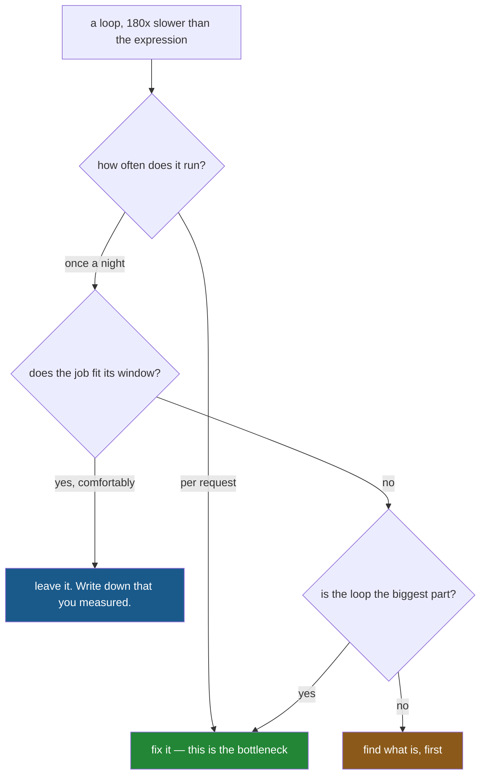

# 3.3 — The number, and where it stops mattering

## One-line answer

A hundred and eighty times faster is a real measurement and a bad reason on its own — because the
same change saves twenty-four seconds a year in a nightly job and makes an impossible service
possible, and only one of those is worth your afternoon.

---

## The story

Somebody comes back from reading section 3.2 determined to remove every loop in the codebase.

The first one they find takes about a tenth of a second, in a script that runs once a night. They
rewrite it, test it, review it, and merge it. The script now finishes a tenth of a second sooner.

Nobody will ever notice. Over a year the change saves less time than the review took.

Meanwhile, three files away, there is a loop inside a request handler that runs a hundred times a
second, and nobody has looked at it, because it is shorter and does not have the word `iterrows` in
it.

The ratio was the same in both places. What differed was how often the code runs and what is waiting
for it — and the ratio says nothing about either.

---

## The idea in plain language

A speed-up ratio is only half a decision. The other half is **how much time it actually saves**, and
that depends on two things the benchmark cannot see:

**How often the code runs.** A saving of sixty milliseconds is nothing once a night and everything a
hundred times a second.

**What else is in the way.** If the same function writes a CSV afterwards, and the write takes longer
than the loop did, then removing the loop cannot make the job much faster no matter what the ratio
says. That is **Amdahl's law** in its everyday form: the speed-up of the whole is limited by the part
you did not change.

So the question to ask is not "how much faster is this" but **"how much of the total is this, and how
often does the total happen"**. There are three honest answers and it is worth being able to reach all
of them:

- **It is the bottleneck and it runs often.** Fix it. This is where section 3.2's number becomes
  money.
- **It is the bottleneck and it runs once a night, well inside its window.** Leave it, and write a
  comment saying you measured. The comment is the deliverable — it stops the next person re-doing the
  measurement.
- **It is not the bottleneck.** Find out what is, before changing anything.

None of that argues for writing loops. The vectorised version is usually **shorter and clearer as
well as faster** ([2.1](../02-vectorised/2.1-one-operation-every-row.md)), so it wins on readability
alone and the speed is a bonus. What this part argues against is *optimising by superstition* —
rewriting code because of a rule rather than because of a measurement.

---

## Why Setu needs it

- **[3.2](3.2-the-four-ways-timed.md)** produced the number. This is what to do with it.
- **[3.1](3.1-what-a-million-rows-is-for.md)** showed the ratio depends on size. This shows the
  *decision* depends on things the ratio does not include at all.
- **[2.3](../02-vectorised/2.3-when-there-is-no-vectorised-form.md)** was the same honesty about
  correctness: sometimes the loop has to stay. This is the same honesty about speed.
- **[Day 25, 4.4](../../../day-25-copy-view-and-the-gate/parts/04-the-benchmark/4.4-the-benchmark-that-lied.md)**
  is the companion piece — benchmarks that follow every rule and mislead anyway.
- **Day 237** builds the project's observability and cost dashboard, where "how often does this run"
  stops being a guess and becomes a number you can look up.

---

## The mechanism

The same saving, in two jobs:

```python
import time

import numpy as np
import pandas as pd

rng = np.random.default_rng(29)
n = 100_000
shop = pd.DataFrame({"need": rng.integers(1, 9, n), "price": rng.uniform(0.2, 4.0, n)})


def best(fn, reps: int) -> float:
    times = []
    for _ in range(reps):
        start = time.perf_counter()
        fn()
        times.append(time.perf_counter() - start)
    return min(times) * 1000


loop = best(lambda: sum(r.need * r.price for r in shop.itertuples(index=False)), 2)
vectorised = best(lambda: float((shop["need"] * shop["price"]).sum()), 30)
saving = loop - vectorised
print(f"itertuples {loop:8.1f} ms")
print(f"vectorised {vectorised:8.2f} ms")
print(f"saving     {saving:8.1f} ms per run")
print()
print("run once a night :", round(saving / 1000 * 365, 1), "seconds saved per year")
print("run 100x a second:", round(saving / 1000 * 100, 1), "seconds of work per second of clock")
```

**Line by line:**

- `itertuples` rather than `iterrows`, because this is about a **realistic** decision — nobody is
  defending `iterrows`, and the interesting case is whether a decent loop is worth replacing.
- `saving = loop - vectorised` — **the difference, not the ratio.** A ratio has no units and cannot be
  multiplied by a frequency; milliseconds can.
- `saving / 1000 * 365` — the yearly saving for a nightly job, in seconds.
- `saving / 1000 * 100` — the work per second of clock at a hundred calls a second. **A number above 1
  here means the service cannot keep up at all**, which is a different category of problem from being
  slow.

```text
itertuples     66.5 ms
vectorised     0.37 ms
saving         66.1 ms per run
```

```text
run once a night : 24.1 seconds saved per year
run 100x a second: 6.6 seconds of work per second of clock
```

**Read the last two lines against each other.** Identical code, identical machine, identical 180×
ratio.

In the nightly job it buys **twenty-four seconds a year** — less than the time to write the change,
review it and deploy it. In the request handler it is the difference between a service that works and
one that falls six seconds further behind every second it runs.

The ratio was the same in both. It was never the number that mattered.

Where the time actually goes:



And the thing that most often turns out to be in the way:

```python
import io

to_parquet = best(lambda: shop.to_parquet(io.BytesIO(), index=False), 3)
to_csv = best(lambda: shop.to_csv(io.StringIO(), index=False), 3)
print(f"the loop   {loop:8.1f} ms")
print(f"to_parquet {to_parquet:8.1f} ms")
print(f"to_csv     {to_csv:8.1f} ms")
```

**Line by line:**

- `io.BytesIO()` and `io.StringIO()` — in-memory buffers, so the disk is not being measured
  ([Day 16, 2.1](../../../day-16-files-and-context-managers/parts/02-reading-and-writing/2.1-open-and-the-mode-string.md)).
  A real write would be slower still, which strengthens the point rather than weakening it.
- `to_csv` on the same hundred thousand rows, which is what most of these jobs do at the end.
- The three numbers are printed together so the comparison is unavoidable.

```text
the loop     66.5 ms
to_parquet   19.8 ms
to_csv      165.3 ms
```

**Writing the CSV takes two and a half times longer than the loop.** So in a job that ends in
`to_csv`, removing the loop entirely takes the total from about 232 ms to 166 ms — a 29% improvement,
not a 180× one.

That is Amdahl's law with numbers on it: **you cannot speed up the whole by more than the share you
are changing.** And it points at the more useful action, which is switching the output to Parquet —
a change that saves 145 ms, more than twice what removing the loop saves
([Day 27, 3.3](../../../day-27-reading-and-writing/parts/03-parquet/3.3-the-size-and-the-speed-measured.md)).

---

## When it breaks

**Optimising the part that was not the problem:**

```text
$ uv run python -c "
import io
import time
import numpy as np
import pandas as pd
rng = np.random.default_rng(29)
shop = pd.DataFrame({'need': rng.integers(1, 9, 100000), 'price': rng.uniform(0.2, 4.0, 100000)})

def best(fn, reps):
    t = []
    for _ in range(reps):
        s = time.perf_counter()
        fn()
        t.append(time.perf_counter() - s)
    return min(t) * 1000

loop = best(lambda: sum(r.need * r.price for r in shop.itertuples(index=False)), 2)
vec = best(lambda: float((shop['need'] * shop['price']).sum()), 30)
write = best(lambda: shop.to_csv(io.StringIO(), index=False), 3)
print(f'before: loop {loop:6.1f} + write {write:6.1f} = {loop + write:6.1f} ms')
print(f'after : vec  {vec:6.2f} + write {write:6.1f} = {vec + write:6.1f} ms')
print(f'whole-job improvement: {(loop + write) / (vec + write):.2f}x, not 180x')
"
```

```text
before: loop   66.5 + write  165.3 =  231.8 ms
after : vec    0.37 + write  165.3 =  165.7 ms
whole-job improvement: 1.40x, not 180x
```

**What it means.** A 180× improvement to one step produced a **1.4×** improvement to the job.

Nothing is wrong with either number. The 180× is real and the 1.4× is what the user experiences, and
quoting the first in a stand-up while the second is what shipped is how performance work loses its
credibility. **Always measure the whole thing, before and after** — not the part you changed.

**A ratio that cannot be multiplied by anything:**

```text
$ uv run python -c "
loop_ms, vec_ms = 66.5, 0.37
print('ratio       :', round(loop_ms / vec_ms), 'x')
print('saving      :', round(loop_ms - vec_ms, 1), 'ms')
print()
for label, per_day in [('nightly', 1), ('hourly', 24), ('every minute', 1440), ('10 per second', 864000)]:
    hours = (loop_ms - vec_ms) / 1000 * per_day * 365 / 3600
    print(f'{label:>14}: {hours:9.2f} hours saved per year')
"
```

```text
ratio       : 180 x
saving      : 66.1 ms
             
       nightly:      0.01 hours saved per year
        hourly:      0.16 hours saved per year
  every minute:      9.66 hours saved per year
 10 per second:   5796.60 hours saved per year
```

**What it means.** One ratio, four completely different decisions.

**The ratio is identical in every row** — it is a property of the code. The hours are a property of the
*system*, and they span six orders of magnitude. Nightly, the change is not worth the pull request.
Ten times a second, it is worth two-thirds of a person-year.

You cannot get from the top line to the bottom four without knowing how often the code runs, and **a
benchmark never knows that**. It is the one input that has to come from you.

**The one that is a real trap — optimising before it works:**

```text
$ uv run python -c "
import time
import numpy as np
import pandas as pd
rng = np.random.default_rng(29)
shop = pd.DataFrame({'need': rng.integers(1, 9, 1000), 'price': rng.uniform(0.2, 4.0, 1000)})
s = time.perf_counter()
clever = float((shop['need'].to_numpy() * shop['price'].to_numpy()).sum())
print(f'the optimised version took {(time.perf_counter() - s) * 1000:.3f} ms')
print('and the frame it runs on has', len(shop), 'rows')
print('a human blink is about 100 ms')
"
```

```text
the optimised version took 0.242 ms
and the frame it runs on has 1000 rows
a human blink is about 100 ms
```

**What it means.** The whole operation takes a quarter of a millisecond, on a frame of a thousand
rows, which is four hundred times faster than a blink.

There was never a performance problem here. Any time spent choosing between implementations at this
scale is time not spent on whether the numbers are **right** — which is what Day 27 and Day 28 were
about, and which is the failure that actually costs money. **Correctness first, and measure before
optimising**, are the same rule pointing in two directions.

---

## In production

**What a professional writes instead of the teaching version.** The decision is recorded next to the
code, so nobody has to re-derive it:

```python
import pandas as pd


# Measured 2026-09-03, pandas 3.0.5, 100k rows: itertuples 66.5 ms, vectorised 0.37 ms.
# This runs once nightly and the job's budget is 10 minutes, so the 66 ms is not worth
# removing — the CSV write in `export()` is 165 ms and is the larger target if we ever care.
def audit_totals(shop: pd.DataFrame) -> pd.Series:
    """Line totals for the nightly audit. Vectorised; see the note above before changing."""
    return (shop["need"] * shop["price"]).round(2)
```

**Line by line:**

- The comment carries **four things**: the date, the version, the size, and the two timings. Without
  all four it is not reproducible and the next person measures again
  ([3.1](3.1-what-a-million-rows-is-for.md)).
- It states **the budget** — ten minutes — which is what turns 66 ms from a number into a decision. A
  measurement without a budget cannot conclude anything.
- It names **the larger target**, so the next person to look at performance starts in the right place
  rather than in this function.
- The function itself is vectorised anyway, because the vectorised version is also the shorter and
  clearer one. **The comment is not defending a loop**; it is recording that the question was asked
  and answered, which is what stops it being asked again.
- `.round(2)` because these are money ([2.1](../02-vectorised/2.1-one-operation-every-row.md)).

**What changes at scale.** Three things.

**Memory is often the real constraint, not time.** A job that runs comfortably in its window can still
fail because a chain of vectorised operations allocated six intermediate columns
([2.1](../02-vectorised/2.1-one-operation-every-row.md)). At that point the loop — which holds one row
at a time — is the version that *fits*, and the chunked reading of
[Day 27, 5.2](../../../day-27-reading-and-writing/parts/05-the-module/5.2-the-file-that-does-not-fit.md)
is the real answer. **Speed and memory can point in opposite directions**, and only one of them stops
the job.

**The tail matters more than the mean in a service.** A request handler that is usually fast and
occasionally does a per-row loop over a large result has a fine average and a terrible ninety-ninth
percentile, and it is the percentile that pages somebody. Averages hide exactly the case worth fixing.

**And the cost of a rewrite is not zero.** Every change is a chance to introduce the kind of silent
wrongness Day 28 catalogued — a misaligned join, a dropped row, a promoted dtype. A rewrite that saves
twenty-four seconds a year and has a one-in-fifty chance of a subtle bug is a bad trade, and saying so
out loud is part of the job.

**The failure that only appears with real data.** A team spent three weeks vectorising a data pipeline
and reported a 90× improvement on the transformation step. The job's runtime fell from fifty-two
minutes to forty-nine. The transformation had never been the problem — the pipeline spent forty-five
minutes waiting on a database query with no index on it. **Nobody had profiled the whole job**, because
the loop was visible and the query was in another repository. The index took an afternoon and cut the
runtime to six minutes.

**The review comment a senior engineer leaves.** *"This is a nice speed-up and I want to see the
whole-job numbers before and after, not just this function. If the export is still 165 ms then we have
gone from 232 to 166 and the ticket should say 1.4×, not 180×. Also please leave the measurement in a
comment so the next person does not repeat it."*

**The interview question.** *"You have found a slow loop in production. What do you do?"* Measure the
**whole** operation first, not the loop, so you know what share of the total it is — Amdahl's law caps
your improvement at that share, and a 180× fix to a third of the runtime is a 1.4× fix to the job.
Then work out **how often it runs**, because the same sixty-millisecond saving is twenty-four seconds
a year nightly and thousands of hours a year in a request path. Then the judgement half: a rewrite
carries risk, so if the job comfortably fits its window the right answer can be to leave it and
**record the measurement in a comment** — which is a deliverable, because it stops the question being
re-asked. And correctness comes first regardless: a fast wrong answer is the more expensive kind.

---

## Check yourself

```bash
uv run python -c "
loop_ms, vec_ms, write_ms = 66.5, 0.37, 165.3
before = loop_ms + write_ms
after = vec_ms + write_ms
print(f'step ratio  : {loop_ms / vec_ms:6.0f}x')
print(f'job ratio   : {before / after:6.2f}x')
for label, per_day in [('nightly', 1), ('every minute', 1440)]:
    print(f'{label:>13}: {(loop_ms - vec_ms) / 1000 * per_day * 365 / 3600:8.2f} hours a year')
"
```

Two ratios from one change, and they differ by a factor of a hundred. Say which one you would put in
a pull request title, and what you would have to know before deciding the change is worth making at
all.

**Answer out loud, without scrolling up:**

> A loop is 180 times slower than the expression that replaces it. Name the two things you need to
> know before deciding whether to change it, neither of which a benchmark can tell you. Then say what
> Amdahl's law means for a step that is a third of a job's runtime.

---

**Next:** [4.1 — `sort_values`: the order you asked for](../04-sorting/4.1-sort-values-the-order-you-asked-for.md).
