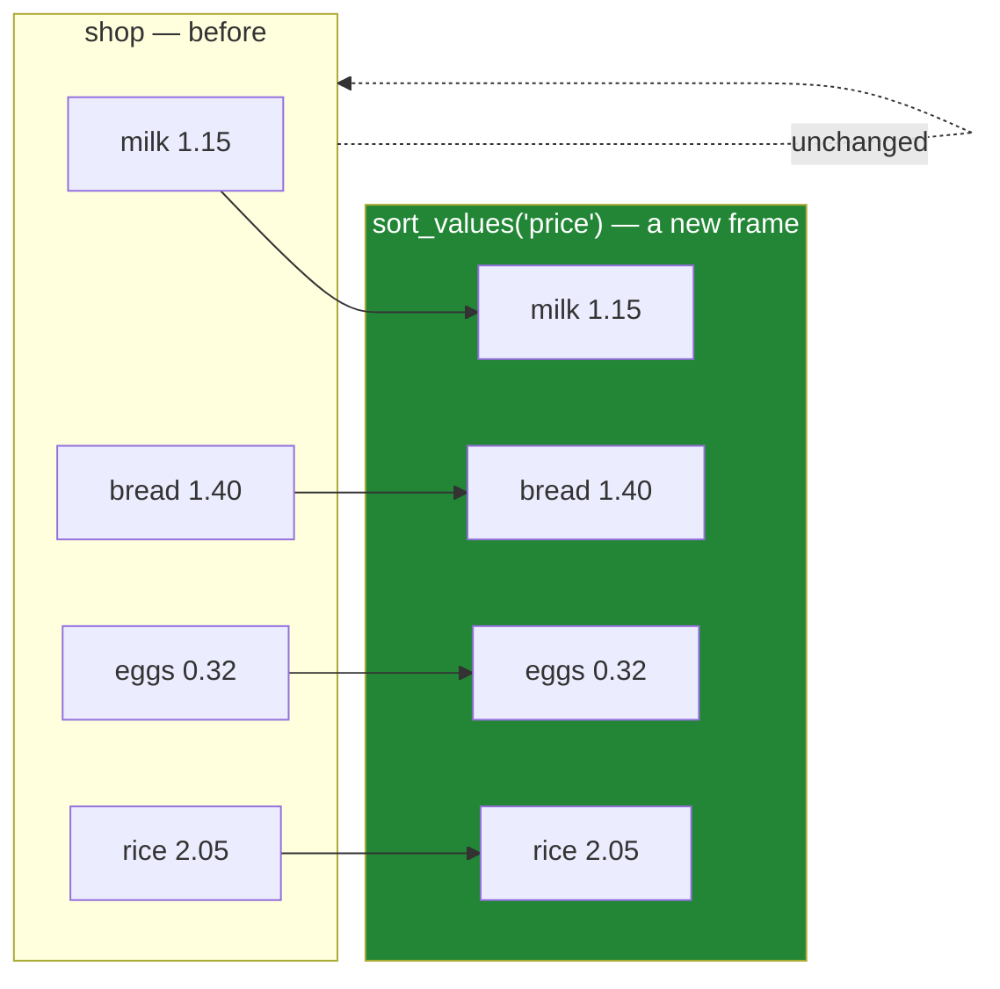

# 4.1 — `sort_values` — the order you asked for

## One-line answer

`sort_values` returns a **new frame** with the rows rearranged by one or more columns — it does not
change the frame you called it on, and it carries every row's label along with it, so nothing is lost
in the rearranging.

---

## The story

The shopping list is in the order people thought of things. Milk, because somebody noticed the carton
was empty. Bread. Eggs. Rice, added last by whoever was standing there.

That order is a record of how the list was written, and it is useless for actually shopping. Walking
round the shop you want it in aisle order. Deciding what to cut you want it cheapest first. Checking
you have not forgotten anything you want it alphabetical.

So the list gets copied out, three times, in three orders.

Nobody suggests rubbing out the original. It is the same four items every time — only the sequence
changes, and each copy answers a different question. The original still says who thought of what
first, which is occasionally the thing you want.

---

## The idea in plain language

`sort_values` takes a column name and gives you back the frame with its rows in that column's order.

Three things about it are worth stating plainly, because each is a decision pandas made that could
have gone the other way.

**It returns a new frame.** The original is untouched. That is the same rule as everything else in
pandas ([Day 26, 3.1](../../../day-26-frames-and-copy-on-write/parts/03-copy-on-write/3.1-every-result-behaves-like-a-copy.md)),
and it means a sort has to be assigned to be kept — `shop.sort_values("price")` on its own is a line
that does nothing, exactly like the `where` in
[Day 28, 3.3](../../../day-28-selection-and-alignment/parts/03-writing/3.3-where-mask-and-the-write-that-was-not.md).

**The labels come with the rows.** Sorting does not renumber anything; the index is rearranged along
with the data, so a row keeps its name wherever it lands
([Day 28, 1.1](../../../day-28-selection-and-alignment/parts/01-label-and-position/1.1-two-ways-to-say-that-row.md)).
That is what makes it safe: a sorted frame can still be looked up by label, and `loc` gives the same
answer before and after. `iloc` does not, which is the point Day 28 kept making.

**It sorts by column, ascending, by default.** `ascending=False` reverses it. A **list** of column
names sorts by the first, then breaks ties with the second, and so on — and `ascending` accepts a list
too, one direction per column, which is how you get "cheapest first within each aisle".

There is a sibling worth knowing about now and using later: **`sort_index`** sorts by the *labels*
rather than by a column's values. It is what you want when the index means something — a date, an
identifier — and it is what makes the label slicing of
[Day 28, 1.5](../../../day-28-selection-and-alignment/parts/01-label-and-position/1.5-the-slice-that-includes-its-end.md)
work. [4.4](4.4-sort-index-and-the-cost-of-order.md) covers it.

Two things this part deliberately leaves to later parts, because both are traps rather than options:
what happens when two rows tie ([4.2](4.2-the-tie-that-broke-the-report.md)), and where the missing
values go ([4.3](4.3-na-position-and-the-rows-that-went-to-the-end.md)).

---

## Why Setu needs it

- **[4.2](4.2-the-tie-that-broke-the-report.md)** is what this part left out: two rows with the same
  value, and which of them comes first.
- **[5.3](../05-ranking/5.3-nlargest-sorting-you-do-not-pay-for.md)** is the shortcut for when you
  only want the top few, which is most of the time.
- **[Day 28, 1.3](../../../day-28-selection-and-alignment/parts/01-label-and-position/1.3-iloc-by-position.md)**
  warned that `iloc[0]` after a sort is an assumption about ties. This is the sort it was warning
  about.
- **Day 31**'s `groupby` sorts its groups by default, and knowing that this is a choice rather than a
  law is what stops it being a surprise.
- **Day 33** works with time series, where sorting by the index is a precondition for almost
  everything — resampling, rolling windows and label slicing all need it.

---

## The mechanism

One column, two directions:

```python
import pandas as pd

shop = pd.DataFrame(
    {
        "item": pd.Series(["milk", "bread", "eggs", "rice"], dtype="str"),
        "need": [2, 1, 6, 1],
        "price": [1.15, 1.40, 0.32, 2.05],
        "aisle": pd.Series(["07", "03", "07", "11"], dtype="str"),
    }
).set_index("item")

print(shop.sort_values("price"))
print()
print("descending:", shop.sort_values("price", ascending=False).index.tolist())
print("original  :", shop.index.tolist())
```

**Line by line:**

- `sort_values("price")` — the column to sort by, as a string. Ascending is the default, so the
  cheapest is first.
- **The index went with the rows.** `eggs` is now first and it is still called `eggs`; the labels were
  rearranged, not renumbered. That is the property that makes a sorted frame still usable by `loc`
  ([Day 28, 1.2](../../../day-28-selection-and-alignment/parts/01-label-and-position/1.2-loc-by-label.md)).
- `ascending=False` reverses the order. It is a keyword rather than a separate method, so it can be
  set from a variable.
- **The last line prints the original and it is unchanged.** Two sorts happened and `shop` is still in
  the order it was written. A sort is a new frame, and forgetting to keep it is the failure in *When
  it breaks*.

```text
       need  price aisle
item
eggs      6   0.32    07
milk      2   1.15    07
bread     1   1.40    03
rice      1   2.05    11

descending: ['rice', 'bread', 'milk', 'eggs']
original  : ['milk', 'bread', 'eggs', 'rice']
```

What a sort does and does not touch:



**Each row moved as a whole, label and all.** Nothing was left behind and nothing was renumbered.

Several columns, and a direction each:

```python
print("by aisle, then price:")
print(shop.sort_values(["aisle", "price"]))
print()
print(
    "aisle up, price down:",
    shop.sort_values(["aisle", "price"], ascending=[True, False]).index.tolist(),
)
```

**Line by line:**

- `["aisle", "price"]` — a **list**, so the frame is sorted by `aisle` first and ties within an aisle
  are broken by `price`. Aisle 07 holds both milk and eggs, so their relative order is decided by the
  second column.
- **The order of the list is the priority order.** `["price", "aisle"]` would be a completely
  different sort, and it is an easy pair to write the wrong way round.
- `ascending=[True, False]` — **one direction per column**, in the same order as the names. Aisles
  ascending, and within each aisle the dearest first. This is how "cheapest first within each
  category" and its opposite are written.
- The lengths of the two lists must match. A single `ascending=False` applies to every column, which
  is usually not what somebody sorting by two columns means.

```text
by aisle, then price:
       need  price aisle
item
bread     1   1.40    03
eggs      6   0.32    07
milk      2   1.15    07
rice      1   2.05    11

aisle up, price down: ['bread', 'milk', 'eggs', 'rice']
```

**Read the two aisle-07 rows in each result.** Ascending by price gives eggs then milk; descending
gives milk then eggs. The aisles are in the same order both times — only the tie-break within aisle 07
flipped.

---

## When it breaks

**The sort that was not kept:**

```text
$ uv run python -c "
import pandas as pd
shop = pd.DataFrame(
    {'price': [1.15, 1.40, 0.32]},
    index=pd.Index(['milk', 'bread', 'eggs'], name='item'),
)
shop.sort_values('price')
print('after sorting:', shop.index.tolist())
shop = shop.sort_values('price')
print('after keeping:', shop.index.tolist())
"
```

```text
after sorting: ['milk', 'bread', 'eggs']
after keeping: ['eggs', 'milk', 'bread']
```

**What it means.** The first `sort_values` sorted the frame, returned it, and the result went nowhere —
so the next line printed the original order. **No error and no warning**, because a method returning a
value you ignore is an ordinary thing to write.

This is the same failure as `where` without an assignment
([Day 28, 3.3](../../../day-28-selection-and-alignment/parts/03-writing/3.3-where-mask-and-the-write-that-was-not.md)),
and it is worth meeting twice because it is the single most common pandas mistake there is. Older
pandas had an `inplace=True` argument for this; it is being removed, and taking the return value is
the replacement.

**Sorting by a column that is text when you meant numbers:**

```text
$ uv run python -c "
import pandas as pd
shop = pd.DataFrame(
    {'need': ['2', '10', '6']},
    index=pd.Index(['milk', 'bread', 'eggs'], name='item'),
).astype({'need': 'str'})
print('as text  :', shop.sort_values('need').index.tolist())
print('as number:', shop.astype({'need': 'int64'}).sort_values('need').index.tolist())
"
```

```text
as text  : ['bread', 'milk', 'eggs']
as number: ['milk', 'eggs', 'bread']
```

**What it means.** Bread has ten and it sorts **first** as text, because text is compared character by
character and `'1'` comes before `'2'`. Sorted as numbers it is last, which is what anybody meant.

**No error either way**, and the two answers are complete reversals of each other. That is the whole
cost of a column arriving with the wrong dtype
([Day 27, 1.3](../../../day-27-reading-and-writing/parts/01-the-csv/1.3-when-the-guess-is-wrong.md)),
showing up three days later as a report in a strange order. When a sort looks nearly right, check the
dtype before you check the sort.

**The one that is correct and catches people — sorting does not reset the position:**

```text
$ uv run python -c "
import pandas as pd
shop = pd.DataFrame(
    {'price': [1.15, 1.40, 0.32]},
    index=pd.Index(['milk', 'bread', 'eggs'], name='item'),
)
cheapest_first = shop.sort_values('price')
print('the cheapest is:', cheapest_first.iloc[0].name)
print('loc[\"eggs\"]     :', float(cheapest_first.loc['eggs', 'price']))
print('index after sort:', cheapest_first.index.tolist())
print('reset_index     :', cheapest_first.reset_index().index.tolist())
"
```

```text
the cheapest is: eggs
loc["eggs"]     : 0.32
index after sort: ['eggs', 'milk', 'bread']
reset_index     : [0, 1, 2]
```

**What it means.** After sorting, `iloc[0]` is the cheapest — which is the whole point — and
`loc["eggs"]` still finds the eggs, because the label travelled with the row. Those two lines together
are why sorting is safe.

The last line is the trap. `reset_index()` moves the old index into **a column** and puts a fresh
`0, 1, 2` range in its place, so `.index.tolist()` gives `[0, 1, 2]` — a list of the right length, full
of the wrong things, and no error. Code that reaches for the item names after a `reset_index` gets row
numbers instead and carries on.

**Sort when you want an order; `reset_index(drop=True)` only when you have decided the labels are
meaningless** ([Day 28, 4.5](../../../day-28-selection-and-alignment/parts/04-alignment/4.5-turning-alignment-off.md)).

---

## In production

**What a professional writes instead of the teaching version.** The sort keys are a named constant and
the sort is total — every tie broken — so the output is reproducible:

```python
import pandas as pd

# The last key is the frame's own unique label, so the ordering is total.
SHOP_ORDER: list[str] = ["aisle", "price", "item"]
SHOP_DIRECTION: list[bool] = [True, True, True]


def in_shopping_order(shop: pd.DataFrame) -> pd.DataFrame:
    """The list in aisle order, cheapest first within an aisle, ties broken by item name."""
    shop = shop.reset_index()
    missing = [name for name in SHOP_ORDER if name not in shop.columns]
    if missing:
        raise KeyError(f"cannot sort without {missing}; have {list(shop.columns)}")
    return shop.sort_values(by=SHOP_ORDER, ascending=SHOP_DIRECTION, kind="stable")
```

**Line by line:**

- `SHOP_ORDER` and `SHOP_DIRECTION` as **parallel constants**, so the keys and their directions cannot
  drift apart and both are visible in one place.
- `shop.reset_index()` moves the item label into a **column**, so the sorted frame carries it as data
  rather than as an index. `sort_values` will in fact accept an index's *name* in `by=`, so the reset
  is not required to sort — it is here because a leaderboard is usually handed on as rows, and a
  caller who is about to write JSON wants the item as a field. The result therefore has a `0, 1, 2`
  index, which is the behaviour *When it breaks* warned about and is deliberate here.
- The missing-column check comes **after** the reset, because `item` is only a column once the reset
  has happened. Checking before it would report `item` as missing on every call.
- `kind="stable"` stated rather than left to the default — that is
  [4.2](4.2-the-tie-that-broke-the-report.md)'s subject, and stating it is what makes the result the
  same on every machine and every pandas version.
- **`SHOP_ORDER` ends in a column that is unique**, so no two rows can tie on the whole key and the
  order is total. That is the simplest way to get a deterministic sort, and
  [4.2](4.2-the-tie-that-broke-the-report.md) is about what happens when you skip it.
- The docstring states the **complete** ordering including the tie-break, because a caller relying on
  "the first row" needs to know what decides it.

**What changes at scale.** Three things.

**A sort is not free and it is not linear.** Sorting is `n log n`, so a million rows is not ten times
a hundred thousand — it is more like twelve. On the frames this curriculum handles that is
milliseconds ([4.4](4.4-sort-index-and-the-cost-of-order.md) measures it), and on a hundred million
rows it becomes the dominant cost of a pipeline step.

**Sorting copies.** The result is a new frame with the rows gathered into new memory, so a sort of a
large frame briefly needs room for two ([Day 21, 4.3](../../../day-21-indexing-and-views/parts/04-fancy-indexing/4.3-fancy-indexing-always-copies.md)).
That is the practical reason not to sort in the middle of a chain when you could sort once at the end.

**And most sorts are unnecessary.** If you want the top ten, `nlargest` does it without sorting the
other 999,990 rows ([5.3](../05-ranking/5.3-nlargest-sorting-you-do-not-pay-for.md)). If you want a
group's maximum, `groupby` does it without sorting at all (Day 31). Sorting the whole frame to look at
one end of it is the most common avoidable cost in this section.

**The failure that only appears with real data.** A report sorted by score and took the top twenty.
The sort was correct, the report was correct, and it changed every night — because the underlying
frame was assembled from several files whose read order varied, and rows tied on score kept whatever
order they arrived in. **The sort was not wrong; it was incomplete**, and the fix was to add a unique
tie-breaker, which is [4.2](4.2-the-tie-that-broke-the-report.md).

**The review comment a senior engineer leaves.** *"`df.sort_values('score')` and then `head(10)` —
first, add a tie-breaker so the output is deterministic; second, this is `nlargest(10, 'score')`, which
does not sort the other million rows. And the sort's result is not assigned on line 30, so that line
does nothing."*

**The interview question.** *"How do you sort a DataFrame?"* `sort_values` with a column name, or a
list of names to sort by several — and `ascending` takes a list too, one per column. Then the three
things that show you have used it: it **returns a new frame**, so the result has to be assigned and a
bare `df.sort_values(...)` is a line that does nothing; the **index travels with the rows**, so `loc`
still works afterwards and only `iloc` changes meaning; and a sort by a column that arrived as text
orders `'10'` before `'2'`, so a sort that looks nearly right is usually a dtype problem rather than a
sorting problem.

---

## Check yourself

```bash
uv run python -c "
import pandas as pd
shop = pd.DataFrame(
    {'need': [2, 1, 6, 1], 'price': [1.15, 1.40, 0.32, 2.05], 'aisle': ['07', '03', '07', '11']},
    index=pd.Index(['milk', 'bread', 'eggs', 'rice'], name='item'),
).astype({'aisle': 'str'})
print('by price       :', shop.sort_values('price').index.tolist())
print('by price, desc :', shop.sort_values('price', ascending=False).index.tolist())
print('aisle then price:', shop.sort_values(['aisle', 'price']).index.tolist())
print('price then aisle:', shop.sort_values(['price', 'aisle']).index.tolist())
print('original        :', shop.index.tolist())
"
```

The third and fourth lines use the same two columns and give different answers. Say what decides
which, and say why the last line is unchanged after four sorts.

**Answer out loud, without scrolling up:**

> `sort_values` gives you back a new frame. Say what happens to the index when it does, and what that
> means for `loc` and for `iloc` afterwards. Then say what `ascending=[True, False]` does, and what
> `ascending=False` does when you have passed two column names.

---

**Next:** [4.2 — The tie that broke the report](4.2-the-tie-that-broke-the-report.md).
