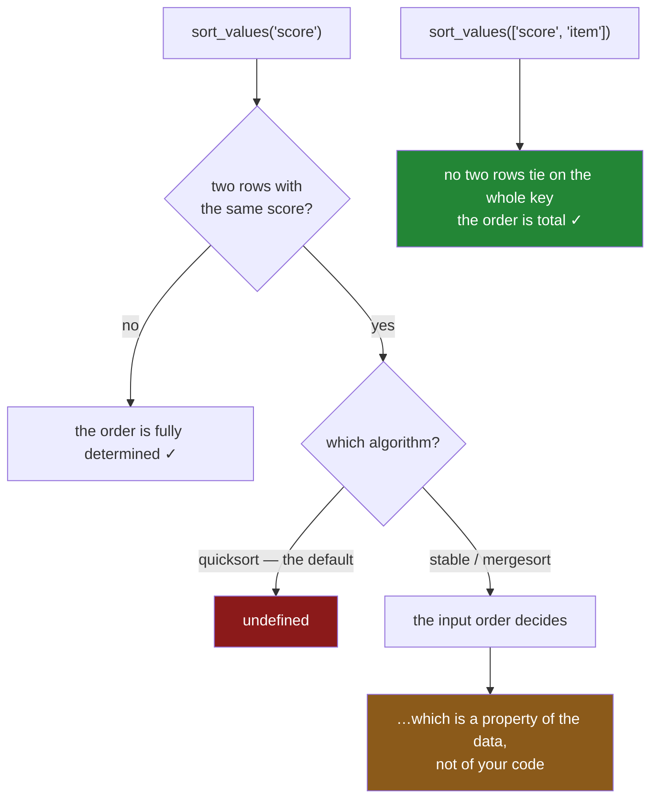

# 4.2 — The tie that broke the report

## One-line answer

When two rows have the same sort key, their order is decided by the **input order and the algorithm**
— neither of which you wrote down — so a report that takes the top row is only reproducible once you
have made the sort **total** by adding a tie-breaker.

---

## The story

The flat runs a small competition: whoever contributes most to the kitty each month gets to choose
the takeaway.

One month three people contribute exactly the same amount. The spreadsheet sorts by contribution,
picks the top row, and announces a winner.

Nobody objects, because the sort was fair and the number really is the highest. Then somebody rebuilds
the spreadsheet from the receipts — same numbers, entered in a different order — and it announces a
different winner.

Both runs sorted correctly. Both took the top row. The three tied people were in a different order
each time, and nothing in the spreadsheet ever said how to choose between them, because nobody had
thought about what "highest" means when three people are equally highest.

---

## The idea in plain language

A sort puts rows in order **by the key you gave it**. When two rows have the same key, the sort has no
instruction, and something else decides.

That something is two things together.

**The input order.** A **stable** sort keeps tied rows in the order they arrived. An **unstable** one
may not. pandas' default algorithm is `quicksort`, which is not stable; `mergesort` and `stable` are.
So the first thing that decides a tie is which algorithm ran.

**The order the rows arrived in.** Even with a stable sort, "the order they arrived in" is a property
of the data, not of your code. A frame assembled from several files, or from a `groupby`, or from a
database with no `ORDER BY`, arrives in whatever order those things produced — and that can differ
between runs ([Day 28, 1.3](../../../day-28-selection-and-alignment/parts/01-label-and-position/1.3-iloc-by-position.md)).

Put those together and you get the rule: **a sort on a key with ties does not define an order.** It
defines a *partial* order — the groups are ordered, and within a group nothing is.

The fix is one word: make the sort **total**. Add a column to the key that cannot tie — an
identifier, a name, the index — so that no two rows have the same complete key. Then the algorithm and
the input order stop mattering, because there is nothing left for them to decide.

```
shop.sort_values("score", ascending=False)                    # partial — ties are undefined
shop.sort_values(["score", "item"], ascending=[False, True])  # total — reproducible
```

`kind="stable"` is worth stating as well, and it is not a substitute. Stability makes the result
depend on the input order **predictably**; a tie-breaker makes it not depend on the input order at
all. Use the tie-breaker when the result matters, and state `kind=` so that the behaviour is written
down either way.

---

## Why Setu needs it

- **[4.1](4.1-sort-values-the-order-you-asked-for.md)** is the sort. This is the part of it nobody
  specifies.
- **[5.2](../05-ranking/5.2-the-five-ways-to-rank-a-tie.md)** is the same question for ranking, where
  pandas makes you choose between five answers instead of silently picking one.
- **[5.3](../05-ranking/5.3-nlargest-sorting-you-do-not-pay-for.md)** has a `keep=` argument for
  exactly this, and its options are worth comparing with these.
- **[Day 28, 1.3](../../../day-28-selection-and-alignment/parts/01-label-and-position/1.3-iloc-by-position.md)**
  described a dashboard whose winner changed nightly. This is the cause of that story.
- **Day 233**'s eval suite compares model outputs run to run, and a non-deterministic ordering makes
  two identical runs look different — which is the most confusing kind of test failure there is.

---

## The mechanism

Three rows tied on the key:

```python
import pandas as pd

tied = pd.DataFrame(
    {"item": pd.Series(["milk", "bread", "eggs", "rice"], dtype="str"), "score": [5, 5, 3, 5]}
).set_index("item")

print(tied)
print()
print("quicksort :", tied.sort_values("score", ascending=False).index.tolist())
print("mergesort :", tied.sort_values("score", ascending=False, kind="mergesort").index.tolist())
print("stable    :", tied.sort_values("score", ascending=False, kind="stable").index.tolist())
```

**Line by line:**

- Three items score 5 and one scores 3, so the sort has one real decision to make and three it cannot.
- `quicksort` is the **default** — fast, and not stable.
- `mergesort` and `stable` are stable, and on the current pandas they are the same algorithm under
  two names.
- All three lines print the same answer **on this data and this version**. That is the trap: the
  default happens to preserve the input order here, so testing it once tells you nothing about
  whether it always will.

```text
       score
item
milk       5
bread      5
eggs       3
rice       5

quicksort : ['milk', 'bread', 'rice', 'eggs']
mergesort : ['milk', 'bread', 'rice', 'eggs']
stable    : ['milk', 'bread', 'rice', 'eggs']
```

**Milk, bread, rice — in exactly the order they were written into the frame.** Nothing about the
scores put milk first; the input did.

Now change only the input order:

```python
shuffled = tied.iloc[[3, 1, 0, 2]]
print("input order:", shuffled.index.tolist())
print("sorted     :", shuffled.sort_values("score", ascending=False).index.tolist())
print(
    "tie-broken :", shuffled.sort_values(["score", "item"], ascending=[False, True]).index.tolist()
)
```

**Line by line:**

- `tied.iloc[[3, 1, 0, 2]]` — the **same four rows** with the same scores, in a different order. No
  value changed; only the arrangement did
  ([Day 28, 1.3](../../../day-28-selection-and-alignment/parts/01-label-and-position/1.3-iloc-by-position.md)).
- The plain sort returns them in the new input order, so **"the winner" is now rice rather than
  milk** — from data that is identical in every respect a report would care about.
- `sort_values(["score", "item"], ...)` — the key is now **two columns**: the score, then the item
  name. Since the item names are unique, no two rows can tie on the whole key.
- `ascending=[False, True]` — score descending, name ascending. **The directions are per column**
  ([4.1](4.1-sort-values-the-order-you-asked-for.md)), and getting this pair wrong is how a
  tie-breaker ends up sorting the wrong way.
- The tie-broken line gives `bread, milk, rice` — alphabetical among the three fives — and it will
  give that on any input order, any algorithm and any machine.

```text
input order: ['rice', 'bread', 'milk', 'eggs']
sorted     : ['rice', 'bread', 'milk', 'eggs']
tie-broken : ['bread', 'milk', 'rice', 'eggs']
```

**Compare the second line here with the second line above.** Same scores, same sort, different answer.
The third line is the same in both.

What decides a tie:



**Both red and orange paths end somewhere you did not choose.** Only the bottom row is a decision.

---

## When it breaks

**The top row that changes with the input:**

```text
$ uv run python -c "
import pandas as pd
scores = {'milk': 5, 'bread': 5, 'rice': 5, 'eggs': 3}
first = pd.DataFrame({'score': scores}).sort_values('score', ascending=False)
reversed_input = pd.DataFrame({'score': dict(reversed(scores.items()))}).sort_values(
    'score', ascending=False
)
print('winner, as written  :', first.index[0])
print('winner, reversed    :', reversed_input.index[0])
print('same scores?        :', sorted(first['score']) == sorted(reversed_input['score']))
"
```

```text
winner, as written  : milk
winner, reversed    : rice
same scores?        : True
```

**What it means.** Two frames holding the same four items with the same four scores, differing only in
the order the dictionary was written, and the sort names a different winner.

**Nothing raised and neither answer is wrong.** `index[0]` after a partial sort is asking a question
the data does not answer, and pandas gives back whichever row happens to be there. A report built this
way is correct on any given day and not reproducible across days, which is the worst combination for
anybody trying to debug it.

**A tie-breaker that sorts the wrong way:**

```text
$ uv run python -c "
import pandas as pd
tied = pd.DataFrame(
    {'score': [5, 5, 3, 5]},
    index=pd.Index(['milk', 'bread', 'eggs', 'rice'], name='item'),
).reset_index()
print('one direction  :', tied.sort_values(['score', 'item'], ascending=False)['item'].tolist())
print('per column     :', tied.sort_values(['score', 'item'], ascending=[False, True])['item'].tolist())
"
```

```text
one direction  : ['rice', 'milk', 'bread', 'eggs']
per column     : ['bread', 'milk', 'rice', 'eggs']
```

**What it means.** A single `ascending=False` applies to **every** key, so the tie-breaker ran
backwards and the three fives came out reverse-alphabetically.

Both orders are total and reproducible, so neither is broken — but only one of them is what "highest
score, then alphabetical" means. **`ascending` takes a list for a reason**, and a tie-breaker is
exactly the case where the two columns usually want different directions.

**The one that looks safe and is not — a tie-breaker that also ties:**

```text
$ uv run python -c "
import pandas as pd
rows = pd.DataFrame(
    {'score': [5, 5, 5], 'aisle': ['07', '07', '03'], 'item': ['milk', 'eggs', 'bread']}
)
print('unique on the key?', not rows.duplicated(['score', 'aisle']).any())
print('sorted            :', rows.sort_values(['score', 'aisle'], ascending=[False, True])['item'].tolist())
print('reversed input    :', rows.iloc[::-1].sort_values(['score', 'aisle'], ascending=[False, True])['item'].tolist())
"
```

```text
unique on the key? False
sorted            : ['bread', 'milk', 'eggs']
reversed input    : ['bread', 'eggs', 'milk']
```

**What it means.** A tie-breaker was added and the sort is **still** not total, because milk and eggs
share both a score and an aisle. The first two rows swap when the input is reversed.

The check is on the first line: `duplicated(keys).any()` tells you whether the key you are sorting by
actually distinguishes the rows. **A tie-breaker is only a fix if it breaks every tie**, and the way
to know is to assert it rather than to assume that adding a second column was enough.

---

## In production

**What a professional writes instead of the teaching version.** The sort key is a constant that ends
in something unique, and the function refuses a key that does not:

```python
import pandas as pd

RANKING: list[str] = ["score", "item"]
RANKING_DIRECTION: list[bool] = [False, True]


def leaderboard(rows: pd.DataFrame) -> pd.DataFrame:
    """Highest score first, ties broken alphabetically. Deterministic for a given set of rows."""
    missing = [name for name in RANKING if name not in rows.columns]
    if missing:
        raise KeyError(f"cannot rank without {missing}; have {list(rows.columns)}")
    if rows.duplicated(RANKING).any():
        clashes = rows.loc[rows.duplicated(RANKING, keep=False), RANKING]
        raise ValueError(f"the sort key does not break every tie:\n{clashes.head()}")
    return rows.sort_values(by=RANKING, ascending=RANKING_DIRECTION, kind="stable")
```

**Line by line:**

- `RANKING` ends in `item`, which is unique, so the ordering is total. **That last element is the whole
  design**; everything else is checking it.
- `duplicated(RANKING).any()` — **the assertion that the key is total.** It is the check the third
  failure above showed is necessary, and it costs one pass over the frame.
- `keep=False` in the second `duplicated` call so the message shows **every** row involved in a clash,
  not just the second of each pair
  ([Day 28, 5.3](../../../day-28-selection-and-alignment/parts/05-reindexing/5.3-duplicate-labels.md)).
- `.head()` on the clashes, so an exception on a large frame does not print a million rows.
- `kind="stable"` stated even though the tie-breaker makes it irrelevant — because it costs nothing
  and it stops a future reader wondering whether the determinism depends on the default.
- The docstring says **"deterministic for a given set of rows"**, which is the precise promise: the
  same rows in any order give the same output.

**What changes at scale.** Three things.

**A stable sort is slower than an unstable one**, which is why `quicksort` is the default. The
difference is small — typically ten to twenty per cent — and it buys a property worth far more than
that. On the frames this curriculum handles the cost is not measurable
([4.4](4.4-sort-index-and-the-cost-of-order.md)).

**The `duplicated` check is a full pass and it is worth it.** On a very large frame you might move it
behind a flag, but the honest position is that a leaderboard whose order is undefined is worse than a
leaderboard that takes an extra second to build.

**And the real fix is often upstream.** If rows tie because a natural key was lost — two records that
should have been one, a join that duplicated rows
([Day 28, 5.3](../../../day-28-selection-and-alignment/parts/05-reindexing/5.3-duplicate-labels.md))
— then a tie-breaker papers over a data problem. Ask why the rows tie before deciding how to order
them.

**The failure that only appears with real data.** A recommendation service ranked items by score and
served the top five. Scores were rounded to two decimal places before ranking, so ties were common —
and the input arrived from a set of shards read in whatever order they completed. **The five items
served changed between requests for the same user**, which looked like a personalisation feature and
was reported as a bug by nobody for eight months, because each individual response was plausible. The
fix was one extra sort key.

**The review comment a senior engineer leaves.** *"`sort_values('score')` then `head(10)` — scores tie
here, so this is not deterministic. Add a unique tie-breaker to the key, assert
`not df.duplicated(keys).any()`, and pass `kind='stable'` so the behaviour is written down rather than
inherited from the default."*

**The interview question.** *"Is `sort_values` stable?"* Not by default — pandas uses `quicksort`
unless you pass `kind="stable"` or `kind="mergesort"`. Then the point that matters more than the
answer: **stability is not what makes a sort reproducible.** A stable sort preserves the input order
for tied rows, and the input order is a property of the data — how the files were read, what the
`groupby` produced — so it can change between runs. The fix is a **total** order: add a column to the
key that cannot tie, so nothing is left for the algorithm or the arrival order to decide. And the
check that it worked is `df.duplicated(keys).any()`, because a tie-breaker that also ties is a very
easy thing to ship.

---

## Check yourself

```bash
uv run python -c "
import pandas as pd
tied = pd.DataFrame(
    {'score': [5, 5, 3, 5]},
    index=pd.Index(['milk', 'bread', 'eggs', 'rice'], name='item'),
).reset_index()
plain = tied.sort_values('score', ascending=False)['item'].tolist()
flipped = tied.iloc[::-1].sort_values('score', ascending=False)['item'].tolist()
total = tied.sort_values(['score', 'item'], ascending=[False, True])['item'].tolist()
total_flipped = tied.iloc[::-1].sort_values(['score', 'item'], ascending=[False, True])['item'].tolist()
print('partial          :', plain)
print('partial, flipped :', flipped)
print('total            :', total)
print('total, flipped   :', total_flipped)
print('key is total?    :', not tied.duplicated(['score', 'item']).any())
"
```

Four sorts of the same four rows. Two of them agree with each other and two do not. Say which pair is
which, and say what the last line has to print for the agreement to be guaranteed.

**Answer out loud, without scrolling up:**

> Two rows tie on the sort key. Name the two things that then decide their order, and say why neither
> is under your control. Then say what makes a sort *total*, and the one-line check that it actually
> is.

---

**Next:** [4.3 — `na_position` and the rows that went to the end](4.3-na-position-and-the-rows-that-went-to-the-end.md).
