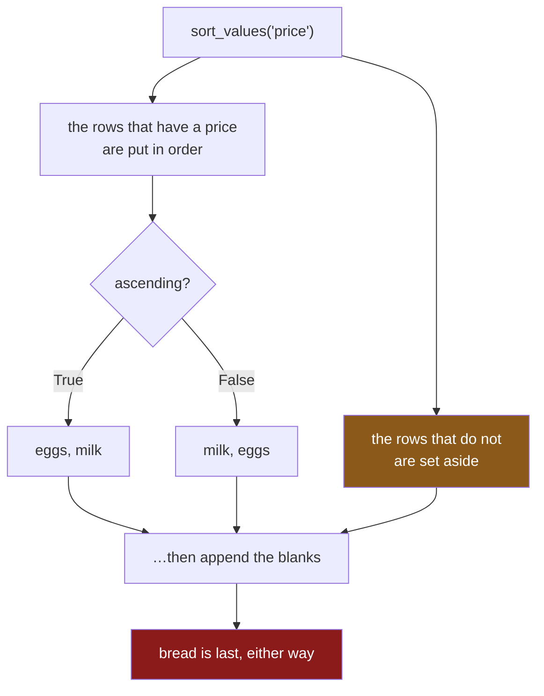

# 4.3 — `na_position` and the rows that went to the end

## One-line answer

Rows with a missing sort key go **last**, and they go last whether you sort ascending or descending —
so reversing a sort does not bring them to the front, and "the last row" is a row with no value in it
rather than the largest one.

---

## The story

Somebody sorts the list by price to find the most expensive thing, and takes the bottom row.

The bottom row is the tinned tomatoes, which have no price on them — nobody wrote one down, because
they were on offer and the label had come off.

So the answer to "what is the dearest item" is an item with no price. Not a mistake in the sort; the
sort put the priced things in order perfectly and then put the unpriced one somewhere.

The person tries the obvious fix: sort the other way and take the top row instead. The tinned tomatoes
are still at the bottom. They are always at the bottom. Reversing the order did not move them, because
they were never in the order at all.

---

## The idea in plain language

A missing value has no position in an ordering. It is not larger than a price and not smaller than
one; it is unknown, and unknown does not sort
([Day 28, 2.1](../../../day-28-selection-and-alignment/parts/02-masks/2.1-a-comparison-makes-a-column.md)
showed the same thing for comparisons — every comparison against a missing value is `False`).

So pandas does not try to sort them. It sorts everything else and then **puts the missing rows at the
end**, as a block.

The consequence that catches people is that this is **not affected by `ascending`**. The direction
argument reorders the values that have an order; the missing rows are appended afterwards either way.
So:

- `sort_values("price")` — cheapest first, then the blanks.
- `sort_values("price", ascending=False)` — dearest first, then the blanks.

**"The last row" is a blank in both.** If you want the largest value, the last row is the wrong place
to look whenever the column might have gaps.

`na_position` is the argument that moves them. It takes `"last"` (the default) or `"first"`. There is
no option that interleaves them, because there is nowhere sensible to interleave them to.

And the deeper point, which is the one to carry: **a blank in a sort key is a question the data has
not answered.** Putting it at the end is pandas declining to guess, exactly as it declines to guess
elsewhere on Day 28. The decision of what an unpriced item means — free, unknown, excluded — is yours,
and `na_position` only decides where it is displayed.

---

## Why Setu needs it

- **[4.1](4.1-sort-values-the-order-you-asked-for.md)** is the sort this modifies.
- **[5.3](../05-ranking/5.3-nlargest-sorting-you-do-not-pay-for.md)** skips the blanks entirely rather
  than parking them, which is a different and often better answer.
- **[Day 28, 2.5](../../../day-28-selection-and-alignment/parts/02-masks/2.5-the-mask-that-matched-nothing.md)**
  showed `sum` and `mean` disagreeing on blanks. This is the third place blanks behave in a way you
  have to know about rather than derive.
- **[Day 28, 4.3](../../../day-28-selection-and-alignment/parts/04-alignment/4.3-the-nan-that-changed-the-dtype.md)**
  is where the blanks often come from — an alignment, not the source data.
- **Day 30** is missing data as a subject, where the decision this part defers finally gets made.

---

## The mechanism

Where the blanks go:

```python
import pandas as pd

shop = pd.DataFrame(
    {
        "item": pd.Series(["milk", "bread", "eggs"], dtype="str"),
        "price": [1.15, None, 0.32],
    }
).set_index("item")

print(shop)
print()
print("ascending      :", shop.sort_values("price").index.tolist())
print("descending     :", shop.sort_values("price", ascending=False).index.tolist())
print("na_position    :", shop.sort_values("price", na_position="first").index.tolist())
```

**Line by line:**

- `None` in the price list becomes `NaN`, and the column is `float64` — an `int64` column could not
  hold it ([Day 28, 4.3](../../../day-28-selection-and-alignment/parts/04-alignment/4.3-the-nan-that-changed-the-dtype.md)).
- `sort_values("price")` — cheapest first: eggs, milk, and **bread last** because it has no price.
- `ascending=False` — dearest first: milk, eggs, and **bread last again.** The two real prices
  swapped; the blank did not move.
- `na_position="first"` puts the blank at the top. It is the only argument that moves it, and the
  default is `"last"`.

```text
       price
item
milk    1.15
bread    NaN
eggs    0.32

ascending      : ['eggs', 'milk', 'bread']
descending     : ['milk', 'eggs', 'bread']
na_position    : ['bread', 'eggs', 'milk']
```

**Read the first two result lines together.** `eggs, milk` reversed to `milk, eggs` — and `bread`
finished last both times.

Why reversing does not help:



**The `ascending` argument acts on the left branch only.** The right branch is appended afterwards and
never reordered.

The three honest ways to deal with them:

```python
print("park them   :", shop.sort_values("price", na_position="last").index.tolist())
print("drop them   :", shop.dropna(subset=["price"]).sort_values("price").index.tolist())
print("fill them   :", shop.fillna({"price": 0.0}).sort_values("price").index.tolist())
print()
print("how many blanks:", int(shop["price"].isna().sum()), "of", len(shop))
```

**Line by line:**

- `na_position="last"` — **park them.** The rows stay, and the caller has to know not to take the last
  one. Right when the report should show every item.
- `.dropna(subset=["price"])` — **drop them**, and only for a missing *price*; without `subset` it
  would drop a row with a blank in any column. The count changes, which is honest and needs reporting
  ([Day 28, 2.5](../../../day-28-selection-and-alignment/parts/02-masks/2.5-the-mask-that-matched-nothing.md)).
- `.fillna({"price": 0.0})` — **fill them**, which is a claim that an unpriced item is free. Sometimes
  true and usually not, and it is exactly the decision
  [Day 28, 5.2](../../../day-28-selection-and-alignment/parts/05-reindexing/5.2-fill-value-method-and-the-gap.md)
  described: filling a gap is a statement about what the gap means.
- The last line is the one to actually write. **Count the blanks before choosing**, because all three
  options are reasonable and only the count tells you whether it matters.

```text
park them   : ['eggs', 'milk', 'bread']
drop them   : ['eggs', 'milk']
fill them   : ['bread', 'eggs', 'milk']
```

```text
how many blanks: 1 of 3
```

**Three different answers to "sort by price".** Dropping loses a row; filling puts bread first, which
claims it costs nothing. Neither is more correct than the other, and the frame cannot tell you which
you meant.

---

## When it breaks

**Taking the dearest item from the bottom:**

```text
$ uv run python -c "
import pandas as pd
shop = pd.DataFrame(
    {'price': [1.15, None, 0.32, 2.05]},
    index=pd.Index(['milk', 'bread', 'eggs', 'rice'], name='item'),
)
dearest = shop.sort_values('price').iloc[-1]
print('the dearest item is:', dearest.name, 'at', dearest['price'])
print('the real maximum is:', shop['price'].max(), 'which is', shop['price'].idxmax())
"
```

```text
the dearest item is: bread at nan
the real maximum is: 2.05 which is rice
```

**What it means.** The bottom row after a sort is bread, with no price. The actual most expensive item
is rice at 2.05.

**Nothing raised**, and the answer is a real row of the frame with a real name on it — so a report
saying "most expensive: bread" looks like data rather than a bug. `max()` and `idxmax()` skip blanks
by default and give the right answer directly, which is the fix: **do not sort to find an extreme.**

**A sort key with blanks feeding a tie-break:**

```text
$ uv run python -c "
import pandas as pd
rows = pd.DataFrame(
    {'score': [5, None, 5], 'item': ['milk', 'bread', 'eggs']}
)
print('sorted:', rows.sort_values(['score', 'item'], ascending=[False, True])['item'].tolist())
print('blank position is decided by na_position, not by the tie-break')
print('first  :', rows.sort_values(['score', 'item'], ascending=[False, True], na_position='first')['item'].tolist())
"
```

```text
sorted: ['eggs', 'milk', 'bread']
blank position is decided by na_position, not by the tie-break
first  : ['bread', 'eggs', 'milk']
```

**What it means.** The tie-breaker ordered `eggs` before `milk` correctly, and bread — whose score is
blank — was appended at the end regardless of its name.

**The tie-breaker does not apply to the blanks**, because they were never in the ordering to be tied.
So a sort that is total in the sense of [4.2](4.2-the-tie-that-broke-the-report.md) can still put rows
somewhere you did not choose, and `na_position` is a separate decision from the sort key.

**The one that is correct and surprising — blanks in the *tie-breaker*:**

```text
$ uv run python -c "
import pandas as pd
rows = pd.DataFrame({'score': [5, 5, 5], 'name': ['milk', None, 'eggs']})
print('sorted:', rows.sort_values(['score', 'name'], ascending=[False, True])['name'].tolist())
print('reversed input:', rows.iloc[::-1].sort_values(['score', 'name'], ascending=[False, True])['name'].tolist())
"
```

```text
sorted: ['eggs', 'milk', nan]
reversed input: ['eggs', 'milk', nan]
```

**What it means.** The blank is in the **second** key rather than the first, and it still goes last —
`na_position` applies to any key that has blanks, at whatever level.

Here that is the good outcome: the order is stable across input orders, so this sort is reproducible.
But it is worth noticing that **a tie-breaker containing blanks does not fully break ties**: if two
rows both had a blank name and the same score, they would tie again, and
[4.2](4.2-the-tie-that-broke-the-report.md)'s `duplicated` check is what tells you so. A column with
gaps is a poor choice of tie-breaker for exactly that reason.

---

## In production

**What a professional writes instead of the teaching version.** The blanks are counted, the decision is
named, and the caller is told:

```python
import pandas as pd


def by_price(shop: pd.DataFrame, drop_unpriced: bool = False) -> tuple[pd.DataFrame, int]:
    """Sorted cheapest first. Returns the frame and how many rows had no price."""
    if "price" not in shop.columns:
        raise KeyError(f"no price column; have {list(shop.columns)}")
    unpriced = int(shop["price"].isna().sum())
    rows = shop.dropna(subset=["price"]) if drop_unpriced else shop
    ordered = rows.sort_values(
        by=["price", "item"],
        ascending=[True, True],
        na_position="last",
        kind="stable",
    )
    return ordered, unpriced
```

**Line by line:**

- It returns **the count as well as the frame**, so a caller cannot use the result without being handed
  the number of rows that had no key. That is the whole design: the function refuses to hide the
  blanks.
- `drop_unpriced` is a **parameter with a safe default**, so the caller chooses between parking and
  dropping rather than the function choosing for them.
- `na_position="last"` stated even though it is the default, because it is a decision and a reader
  should see it made.
- `kind="stable"` and a tie-breaker on `item`, so the priced rows are in a total order
  ([4.2](4.2-the-tie-that-broke-the-report.md)).
- **There is no `fillna` anywhere.** Filling a price with zero would be a claim about the world, and a
  sorting function is the wrong place to make it — that belongs to whatever knows what an unpriced
  item means (Day 30).
- The tuple return is slightly awkward to use, and that is deliberate: it makes ignoring the count a
  visible act rather than an omission.

**What changes at scale.** Three things.

**Blanks are usually not in the source data.** They arrive from an alignment
([Day 28, 4.3](../../../day-28-selection-and-alignment/parts/04-alignment/4.3-the-nan-that-changed-the-dtype.md)),
a `reindex` ([Day 28, 5.2](../../../day-28-selection-and-alignment/parts/05-reindexing/5.2-fill-value-method-and-the-gap.md)),
a left join or a `shift`. So a sort key that has never had blanks can acquire them when an upstream
join changes, and the sort then quietly starts parking rows at the end. **Counting the blanks is a
regression test as much as a report.**

**`dropna` on a large frame copies.** It is a filter, so the result is a new frame
([Day 28, 2.2](../../../day-28-selection-and-alignment/parts/02-masks/2.2-selecting-with-a-mask.md)),
and dropping then sorting builds two. Where it matters, filter and sort in one pass by combining them
rather than chaining.

**And the extremes should not come from a sort at all.** `max`, `min`, `idxmax` and `nlargest` all skip
blanks and none of them sorts the whole frame
([5.3](../05-ranking/5.3-nlargest-sorting-you-do-not-pay-for.md)). Sorting a million rows to look at
one end of them is the avoidable cost [4.1](4.1-sort-values-the-order-you-asked-for.md) mentioned, and
the blank-at-the-bottom bug is a second reason not to.

**The failure that only appears with real data.** A pricing report sorted by margin and showed the
bottom ten as "worst performers". A supplier change introduced a batch of products with no cost
recorded, so their margin was blank, and those ten products filled the bottom of the report every day
for a month. **The report was not wrong about anything** — it showed ten real products at the bottom
of a correct sort — and the team spent two weeks investigating products whose margin was simply
unknown. `isna().sum()` on the sort key, printed at the top of the report, would have ended it in a
day.

**The review comment a senior engineer leaves.** *"`sort_values('score').tail(10)` for the top ten —
that gives you the rows with no score, because blanks sort last regardless of `ascending`. Use
`nlargest(10, 'score')`, which skips them, and log how many were skipped."*

**The interview question.** *"Where do NaNs go when you sort?"* Last, by default — and, importantly,
**last regardless of `ascending`**, because they are not ordered at all: pandas sorts the values that
have an order and appends the blanks afterwards. `na_position="first"` is the only thing that moves
them. Then the practical consequence: taking `.iloc[-1]` after an ascending sort to find the maximum
gives you a blank row rather than the largest value, so extremes should come from `max`, `idxmax` or
`nlargest`, all of which skip blanks. And the thing worth adding: the blanks usually arrive from a
join or an alignment rather than from the source, so counting them on the sort key is a cheap way to
notice an upstream change.

---

## Check yourself

```bash
uv run python -c "
import pandas as pd
shop = pd.DataFrame(
    {'price': [1.15, None, 0.32, 2.05]},
    index=pd.Index(['milk', 'bread', 'eggs', 'rice'], name='item'),
)
print('ascending  :', shop.sort_values('price').index.tolist())
print('descending :', shop.sort_values('price', ascending=False).index.tolist())
print('na first   :', shop.sort_values('price', na_position='first').index.tolist())
print('last row   :', shop.sort_values('price').index[-1])
print('idxmax     :', shop['price'].idxmax())
print('blanks     :', int(shop['price'].isna().sum()))
"
```

Two of those lines claim to identify the most expensive item and they disagree. Say which one is
right, and say what the last line would have to print for both to agree.

**Answer out loud, without scrolling up:**

> Say where a row with a missing sort key ends up, and what `ascending=False` does to it. Then name
> the three things you can do about such rows, and say which of the three makes a claim about the
> world.

---

**Next:** [4.4 — `sort_index` and the cost of order](4.4-sort-index-and-the-cost-of-order.md).
