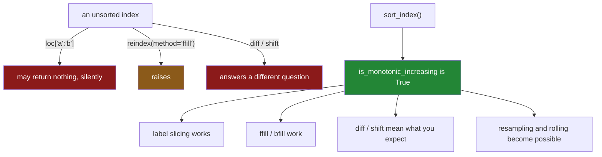

# 4.4 — `sort_index` and the cost of order

## One-line answer

`sort_index` orders by the **labels** rather than by a column, and it is the precondition for label
slicing, `ffill` and every time-series operation — so it is less a formatting choice than a state the
frame has to be in before large parts of pandas will answer correctly.

---

## The story

The flat starts keeping the receipts in a shoebox.

For a while this is fine: you want a receipt, you tip out the box and look through it. Then somebody
asks what was spent in the first week of August, and going through the box takes twenty minutes,
because every receipt has to be looked at to know whether it belongs.

So the receipts get put in date order. It takes an afternoon, once.

After that, "the first week of August" is a matter of finding one edge and taking everything until the
other — a few seconds, without looking at a single receipt outside the range. The afternoon bought
every future question, and none of the individual answers changed.

---

## The idea in plain language

`sort_index` sorts by the **index**, where `sort_values` sorts by a column
([4.1](4.1-sort-values-the-order-you-asked-for.md)). Everything else about it is the same: it returns
a new frame, the rows keep their labels, and `ascending` and `kind` work identically.

What makes it worth its own part is that a sorted index is not just a presentation. It is a
**precondition**, and several things Day 28 and Day 29 have already shown depend on it:

- **Label slicing.** `loc["bread":"rice"]` walks the index in its current order, so on an unsorted
  index it can silently return nothing
  ([Day 28, 1.5](../../../day-28-selection-and-alignment/parts/01-label-and-position/1.5-the-slice-that-includes-its-end.md)).
- **`reindex(method="ffill")`.** "The previous value" is meaningless without an order, and pandas
  raises rather than guessing
  ([Day 28, 5.2](../../../day-28-selection-and-alignment/parts/05-reindexing/5.2-fill-value-method-and-the-gap.md)).
- **`diff` and `shift`.** They move by position, so they answer a different question on an unsorted
  frame ([2.3](../02-vectorised/2.3-when-there-is-no-vectorised-form.md)).
- **Everything on Day 33.** Resampling and rolling windows both require a sorted time index.

So `index.is_monotonic_increasing` is the check that half those parts kept asking for, and this is the
operation that makes it true.

The other half of the part is the cost, because "sort everything, always" is not free advice:

- A sort is **`n log n`**, not linear, so it grows faster than the data does.
- It **copies**, so a large frame briefly needs room for two
  ([Day 21, 4.3](../../../day-21-indexing-and-views/parts/04-fancy-indexing/4.3-fancy-indexing-always-copies.md)).
- Sorting an **already-sorted** frame is not free either — pandas still does the work unless you check
  first.

Which gives the shape of the production advice: **sort once, at the boundary, and check rather than
re-sort.** `is_monotonic_increasing` is much cheaper than a sort, so the guard costs less than the
operation it avoids.

---

## Why Setu needs it

- **[4.1](4.1-sort-values-the-order-you-asked-for.md)** is the column version; this is the label
  version and the two share every argument.
- **[Day 28, 1.5](../../../day-28-selection-and-alignment/parts/01-label-and-position/1.5-the-slice-that-includes-its-end.md)**
  found that a label slice on an unsorted index can return nothing. This is the fix it was pointing at.
- **[Day 28, 5.2](../../../day-28-selection-and-alignment/parts/05-reindexing/5.2-fill-value-method-and-the-gap.md)**
  raises `index must be monotonic` — this is what to do about it.
- **[5.3](../05-ranking/5.3-nlargest-sorting-you-do-not-pay-for.md)** is the argument for not sorting
  when you only want the extremes, which is the same cost question from the other side.
- **Day 33** is time series, where a sorted index is assumed by every single operation and this part
  is the thing that has to have happened first.

---

## The mechanism

Sorting by labels rather than by a column:

```python
import pandas as pd

shop = pd.DataFrame(
    {
        "item": pd.Series(["milk", "bread", "eggs", "rice"], dtype="str"),
        "price": [1.15, 1.40, 0.32, 2.05],
    }
).set_index("item")

print("as written    :", shop.index.tolist())
print("sort_index    :", shop.sort_index().index.tolist())
print("sort_values   :", shop.sort_values("price").index.tolist())
print()
print("monotonic before:", shop.index.is_monotonic_increasing)
print("monotonic after :", shop.sort_index().index.is_monotonic_increasing)
```

**Line by line:**

- `sort_index()` — no column name, because the labels *are* the key. Alphabetical here, because the
  labels are text.
- `sort_values("price")` on the same frame gives a **different** order, which is the point of having
  both: one orders by what a row is called, the other by what it contains.
- `is_monotonic_increasing` — **the check.** It is a cached property on the index, so asking is cheap
  and asking repeatedly is free ([Day 28, 5.3](../../../day-28-selection-and-alignment/parts/05-reindexing/5.3-duplicate-labels.md)
  noted the same about `is_unique`).
- It is `False` before and `True` after, which is the whole state change this operation exists to
  make.

```text
as written    : ['milk', 'bread', 'eggs', 'rice']
sort_index    : ['bread', 'eggs', 'milk', 'rice']
sort_values   : ['eggs', 'milk', 'bread', 'rice']
monotonic before: False
monotonic after : True
```

What a sorted index unlocks:



Now the cost, measured on a million rows:

```python
import time

import numpy as np

rng = np.random.default_rng(29)
n = 1_000_000
big = pd.DataFrame({"need": rng.integers(1, 9, n), "price": np.round(rng.uniform(0.2, 4.0, n), 2)})


def best(fn, reps: int) -> float:
    times = []
    for _ in range(reps):
        start = time.perf_counter()
        fn()
        times.append(time.perf_counter() - start)
    return min(times) * 1000


sorted_frame = big.sort_values("price")
print(f"sort_values, unsorted input {best(lambda: big.sort_values('price'), 3):8.1f} ms")
print(f"sort_values, sorted input   {best(lambda: sorted_frame.sort_values('price'), 3):8.1f} ms")
print(f"sort_index, already sorted  {best(lambda: big.sort_index(), 3):8.2f} ms")
print(
    f"is_monotonic_increasing     {best(lambda: sorted_frame['price'].is_monotonic_increasing, 50):8.4f} ms"
)
```

**Line by line:**

- `big.sort_values("price")` on random data — the honest cost of sorting a million rows.
- `sorted_frame.sort_values("price")` — the **same call on already-sorted input.** It is faster,
  because the algorithm has less work to do, and it is not free.
- `big.sort_index()` — the frame's index is the default `RangeIndex`, which pandas knows is already
  sorted, so this is close to instant. **That is a special case**, not a general property of
  `sort_index`.
- `is_monotonic_increasing` timed with 50 repetitions, because the first call computes the answer and
  the rest read a cached flag.

```text
sort_values, unsorted input    195.3 ms
sort_values, sorted input       25.7 ms
sort_index, already sorted       0.1 ms
is_monotonic_increasing          2.2813 ms
```

**Read the last two lines against the first.** Checking whether the data is already ordered costs
about 2.3 ms; sorting it costs 195 ms. **The check is roughly eighty times cheaper than the
operation**, so guarding a sort with a check is worth it whenever the frame might already be sorted —
which, in a pipeline that sorts at the boundary, it usually is.

And the second line is the one people do not expect: **re-sorting sorted data still cost 25.7 ms.**
pandas does not check for you.

---

## When it breaks

**Sorting the wrong thing:**

```text
$ uv run python -c "
import pandas as pd
shop = pd.DataFrame(
    {'price': [1.15, 1.40, 0.32]},
    index=pd.Index(['milk', 'bread', 'eggs'], name='item'),
)
print('sort_index :', shop.sort_index().index.tolist())
print('sort_values:', shop.sort_values('price').index.tolist())
shop.sort_index('price')
" 2>&1 | tail -1
```

```text
TypeError: DataFrame.sort_index() takes 1 positional argument but 2 were given
```

**What it means.** `sort_index` takes **no positional arguments at all** in pandas 3.0 — everything
after the frame is keyword-only — because it sorts labels and there is no column to name.

The message is about argument counts rather than about sorting, which is confusing the first time,
and it is a strict improvement on older pandas: there, the first positional argument was `axis`, so
`sort_index("price")` was interpreted as an axis name and raised a puzzling `ValueError` about axes
instead.

The rule that makes them easy to keep apart: **`sort_values` needs a `by`, `sort_index` does not take
one.** If you are naming a column, you want `sort_values`.

**Sorting an index of mixed types:**

```text
$ uv run python -c "
import pandas as pd
mixed = pd.DataFrame({'v': [1, 2, 3]}, index=['milk', 7, 'eggs'])
mixed.sort_index()
" 2>&1 | tail -1
```

```text
TypeError: '<' not supported between instances of 'int' and 'str'
```

**What it means.** An index holding both text and numbers has no ordering, because Python cannot
compare a `str` with an `int`
([Day 5, 1.3](../../../day-05-operators-and-conditionals/parts/01-operators/1.3-comparison-and-chaining.md)).

The error is Python's rather than pandas', and it names the two types — which is the clue. A mixed
index is almost always the fingerprint of the key-type mismatch
[Day 28, 4.4](../../../day-28-selection-and-alignment/parts/04-alignment/4.4-the-index-is-the-join-key.md)
described: two sources whose keys were text on one side and integers on the other, unioned into one
index. **The fix belongs at the read**, not here.

**The one that is correct and quietly wasteful — sorting inside a loop:**

```text
$ uv run python -c "
import time
import numpy as np
import pandas as pd
rng = np.random.default_rng(29)
big = pd.DataFrame({'price': np.round(rng.uniform(0.2, 4.0, 200000), 2)})

start = time.perf_counter()
for _ in range(5):
    top = big.sort_values('price').head(3)
every_time = time.perf_counter() - start

start = time.perf_counter()
once = big.sort_values('price')
for _ in range(5):
    top = once.head(3)
sorted_once = time.perf_counter() - start
print(f'sorting each time {every_time * 1000:8.1f} ms')
print(f'sorting once      {sorted_once * 1000:8.1f} ms')
print(f'ratio             {every_time / sorted_once:8.1f}x')
"
```

```text
sorting each time     38.3 ms
sorting once           7.0 ms
ratio                  5.5x
```

**What it means.** Five identical sorts of the same unchanged frame, because the sort was written
inside the loop rather than before it.

**No error and the answer is right every time**, which is why it survives review — the code reads
perfectly well and each individual line is correct. It is the same category as the loop this whole day
is about: work being repeated that only needed doing once. **Sort at the boundary, then reuse**, and
the guard from the mechanism above is how you make that cheap even when you are not sure.

---

## In production

**What a professional writes instead of the teaching version.** The sort is guarded, so calling the
function on already-ordered data costs a check rather than a sort:

```python
import pandas as pd


def ensure_sorted(frame: pd.DataFrame) -> pd.DataFrame:
    """Return `frame` with a sorted, unique index — unchanged if it already has one."""
    if not frame.index.is_unique:
        raise ValueError(f"duplicate labels: {frame.index[frame.index.duplicated()][:5].tolist()}")
    if frame.index.is_monotonic_increasing:
        return frame
    return frame.sort_index(kind="stable")
```

**Line by line:**

- `is_unique` **first**, because a sorted index with duplicates still breaks `reindex` and still
  multiplies an alignment
  ([Day 28, 5.3](../../../day-28-selection-and-alignment/parts/05-reindexing/5.3-duplicate-labels.md)).
  Sorting would not fix it and would hide it.
- `[:5].tolist()` in the message — a sample, because an exception carrying a million labels is not a
  diagnostic.
- `is_monotonic_increasing` — **the guard.** It is a cached property, so a pipeline that calls this
  between every step pays for the check once and returns the frame unchanged thereafter. Measured
  above at 2.3 ms against 195 ms.
- `return frame` **unchanged** on the fast path, not `frame.copy()`. The caller gets the same object,
  which is correct because nothing was modified, and under Copy-on-Write it is safe
  ([Day 26, 3.1](../../../day-26-frames-and-copy-on-write/parts/03-copy-on-write/3.1-every-result-behaves-like-a-copy.md)).
- `kind="stable"` for the reason [4.2](4.2-the-tie-that-broke-the-report.md) gave — and here it matters
  less, because a unique index cannot tie. It is stated anyway so that the guarantee does not depend on
  the uniqueness check being upstream.

**What changes at scale.** Three things.

**A sorted index changes how lookups work, not just how they look.** On a monotonic index pandas can
binary-search, so a label slice is logarithmic rather than a scan
([Day 28, 1.5](../../../day-28-selection-and-alignment/parts/01-label-and-position/1.5-the-slice-that-includes-its-end.md)).
For a frame that is sliced many times — a time series queried per report — the sort pays for itself
after a handful of queries.

**Sorting is `n log n` and copies.** At ten million rows a sort is seconds and briefly doubles the
memory, which is enough to matter in a constrained job. Sorting **once**, as early as possible, and
carrying the ordered frame through the pipeline is the shape that avoids repeating it.

**And the best place to sort is often not pandas.** A database returns rows in order for the cost of
an index ([Day 27, 4.2](../../../day-27-reading-and-writing/parts/04-sql/4.2-read-sql-and-the-connection.md)),
and a Parquet file written in sorted order arrives sorted
([Day 27, 3.1](../../../day-27-reading-and-writing/parts/03-parquet/3.1-columns-on-disk-with-types.md)).
Sorting at the source means never sorting in the pipeline, which is the same "push the work to the
data" argument Day 27 made about aggregation.

**The failure that only appears with real data.** A time-series job resampled daily readings and
worked for a year. Then a backfill inserted historical rows at the end of the file rather than in date
order. The index was no longer monotonic, and `reindex(method="ffill")` began raising
`index must be monotonic increasing or decreasing` — **on a job that had not changed** and against data
that was completely valid. It took a morning to find, because the error mentions monotonicity and
nobody had thought of the index as having a state. A `sort_index` at the load, or the guard above,
would have made the backfill a non-event.

**The review comment a senior engineer leaves.** *"This slices by label and there is nothing
guaranteeing the index is sorted — on unsorted input that returns an empty frame rather than raising.
Add a monotonic check at the loader. And `sort_index()` inside this loop sorts the same frame five
times; hoist it."*

**The interview question.** *"When would you use `sort_index` rather than `sort_values`?"* When the
order you want is the **labels'** — a time index, an identifier — rather than a column's values. Then
the answer that shows you have used it: a sorted index is a **precondition**, not a presentation
choice. Label slicing walks the index in its current order and returns nothing on unsorted input;
`reindex(method="ffill")` raises; `diff` and `shift` answer a different question; and every resampling
or rolling operation requires it. So the practical pattern is to sort **once at the boundary** and
then guard with `index.is_monotonic_increasing`, which is a cached property and roughly eighty times
cheaper than the sort it avoids.

---

## Check yourself

```bash
uv run python -c "
import pandas as pd
shop = pd.DataFrame(
    {'price': [1.15, 1.40, 0.32, 2.05]},
    index=pd.Index(['milk', 'bread', 'eggs', 'rice'], name='item'),
)
print('monotonic?    :', shop.index.is_monotonic_increasing)
print('slice unsorted:', shop.loc['bread':'milk'].index.tolist())
ordered = shop.sort_index()
print('monotonic?    :', ordered.index.is_monotonic_increasing)
print('slice sorted  :', ordered.loc['bread':'milk'].index.tolist())
print('by value      :', shop.sort_values('price').index.tolist())
"
```

The same label slice on the same four rows gives two different answers. Say why, and say which single
property you would assert before ever writing a label slice.

**Answer out loud, without scrolling up:**

> Name three operations that need a sorted index and say what each does when it does not get one.
> Then say roughly how much cheaper `is_monotonic_increasing` is than a sort, and what that implies
> about where a pipeline should sort.

---

**Next:** [5.1 — `rank`: the position in the order](../05-ranking/5.1-rank-the-position-in-the-order.md).
