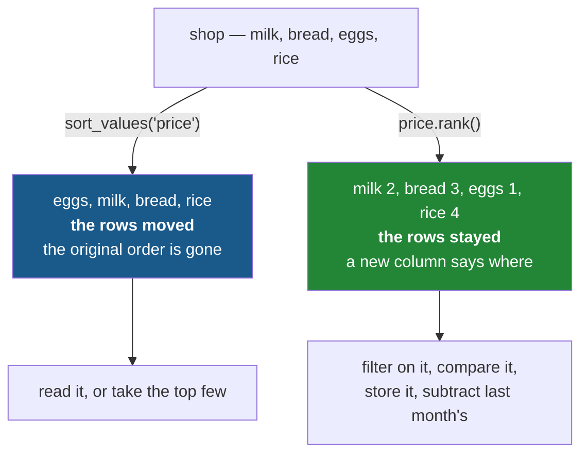

# 5.1 — `rank` — the position in the order

## One-line answer

`rank` gives every row **its number in the order** without moving anything — the frame stays exactly
as it was and gains a column saying where each row would have come.

---

## The story

The flat has a wall chart of who has done the washing-up, and somebody wants to know who is doing
best.

Sorting the chart would answer it, and it would also destroy the chart — the names are in a fixed
order on the wall, next to the days of the week, and moving them would break everything else on it.

So instead of reordering the rows, somebody writes a small number beside each name: 1, 2, 3. The chart
is untouched, still readable the way it always was, and now it also says where everybody stands.

The numbers are the same information a sort would have given. They are just written **beside** the
rows rather than expressed **as** the rows' order.

---

## The idea in plain language

`rank` answers "where would this row come if I sorted?" — as a **value per row**, not as a
rearrangement.

Sorting and ranking are two ways of expressing one thing, and which you want depends on what happens
next:

- **Sorting** changes the order and loses the original one
  ([4.1](../04-sorting/4.1-sort-values-the-order-you-asked-for.md)). Right when you want to *read* the
  data in order, or take the top few.
- **Ranking** keeps the order and adds a number. Right when the position is a **fact about the row**
  that you want to compare, filter, store or plot alongside everything else.

The second is more useful than it first looks. A rank is a column
([Day 28, 3.2](../../../day-28-selection-and-alignment/parts/03-writing/3.2-the-new-column-that-was-a-mask.md)),
so it can be filtered on, compared against last month's rank, subtracted to show movement, or written
back to the frame — none of which a sorted frame gives you.

Three things about `rank` follow from that:

**It counts from 1, not from 0.** Rank 1 is first. That is the human convention rather than the
positional one, because a rank is meant to be read.

**It defaults to ascending**, so rank 1 is the **smallest** value. `ascending=False` makes rank 1 the
largest, which is what "top of the leaderboard" means and is the form you will write most often.

**It returns `float64`.** Even when every rank is a whole number. That is because ties can produce
halves under the default method, and a column holds one dtype
([Day 26, 1.4](../../../day-26-frames-and-copy-on-write/parts/01-the-two-objects/1.4-one-dtype-per-column.md)).

And the thing that makes `rank` more than a convenience: **it makes you choose what a tie means.**
Sorting quietly picks an order for tied rows and does not tell you
([4.2](../04-sorting/4.2-the-tie-that-broke-the-report.md)); ranking gives them the same number by
default, and offers five different answers if that is not what you want
([5.2](5.2-the-five-ways-to-rank-a-tie.md)).

---

## Why Setu needs it

- **[5.2](5.2-the-five-ways-to-rank-a-tie.md)** is the choice this part defers: five ways to number
  three rows that tie.
- **[5.3](5.3-nlargest-sorting-you-do-not-pay-for.md)** is the third member of the family — when you
  want only the extremes and neither a sort nor a rank of everything.
- **[4.1](../04-sorting/4.1-sort-values-the-order-you-asked-for.md)** is the alternative, and knowing
  when each is right is most of this section.
- **[Day 28, 3.2](../../../day-28-selection-and-alignment/parts/03-writing/3.2-the-new-column-that-was-a-mask.md)**
  argued that a flag kept as a column answers more questions than a filter does. A rank is the same
  argument with a number instead of a boolean.
- **Day 34** builds a data-quality report where a column's rank among its peers is one of the summary
  statistics, and **Day 91 onwards** uses rank as a feature — a customer's position among customers is
  often more predictive than their raw value.

---

## The mechanism

Ranks beside the rows, not instead of them:

```python
import pandas as pd

shop = pd.DataFrame(
    {
        "item": pd.Series(["milk", "bread", "eggs", "rice"], dtype="str"),
        "price": [1.15, 1.40, 0.32, 2.05],
    }
).set_index("item")

ranked = shop.assign(
    cheapest=lambda frame: frame["price"].rank(),
    dearest=lambda frame: frame["price"].rank(ascending=False),
)
print(ranked)
print()
print("original order kept:", ranked.index.tolist() == shop.index.tolist())
print("rank dtype         :", ranked["cheapest"].dtype)
```

**Line by line:**

- `.rank()` on a **column**, giving a Series of the same length with the same labels — so it can be
  assigned straight back ([Day 28, 3.2](../../../day-28-selection-and-alignment/parts/03-writing/3.2-the-new-column-that-was-a-mask.md)).
- `assign` with lambdas, so `shop` is untouched and both ranks are added in one call.
- `rank()` ascending: **rank 1 is the cheapest**, which is eggs at 0.32.
- `rank(ascending=False)`: rank 1 is the dearest, which is rice. The two columns are mirror images and
  each sums with the other to five — one more than the number of rows, which is a useful sanity check.
- **The index is unchanged**, which the second-to-last line asserts. That is the whole difference from
  sorting.
- The dtype is `float64` even though every value is a whole number, for the tie reason above.

```text
       price  cheapest  dearest
item
milk    1.15       2.0      3.0
bread   1.40       3.0      2.0
eggs    0.32       1.0      4.0
rice    2.05       4.0      1.0

original order kept: True
rank dtype         : float64
```

Sorting against ranking:



**Neither is better.** The left branch is for reading; the right branch is for computing.

What a rank column lets you do that a sorted frame does not:

```python
last_month = pd.Series([1.05, 1.50, 0.40, 1.80], index=shop.index, name="price")
movement = ranked.assign(
    was=lambda frame: last_month.rank(ascending=False),
    moved=lambda frame: frame["was"] - frame["dearest"],
)
print(movement[["dearest", "was", "moved"]])
print()
print("climbed:", movement.loc[movement["moved"] > 0].index.tolist())
```

**Line by line:**

- `last_month` is a Series **on the same index**, so the ranks line up row for row
  ([Day 28, 4.2](../../../day-28-selection-and-alignment/parts/04-alignment/4.2-alignment-is-automatic.md)).
  Two *sorted* frames could not be compared this way at all — you would have to match them back up by
  label first, which is what keeping the index does for free.
- `was - dearest` — **positions subtracted**, giving movement. A positive number means the item was
  ranked further down last month and has climbed.
- `movement["moved"] > 0` — a mask over a rank column
  ([Day 28, 2.1](../../../day-28-selection-and-alignment/parts/02-masks/2.1-a-comparison-makes-a-column.md)),
  which is the kind of question ranking exists for.
- **None of this is possible with a sort.** Sorting gives you an order; only a rank gives you a number
  you can do arithmetic on.

```text
       dearest  was  moved
item
milk       3.0  3.0    0.0
bread      2.0  2.0    0.0
eggs       4.0  4.0    0.0
rice       1.0  1.0    0.0

climbed: []
```

**Nothing moved**, because the prices all changed in the same direction and the ordering held. That is
the honest result on this data, and it is worth seeing: **a rank comparison that shows no movement is
information**, not a failure.

---

## When it breaks

**Ranking a text column, which works and probably is not what you meant:**

```text
$ uv run python -c "
import pandas as pd
shop = pd.DataFrame(
    {'aisle': ['07', '03', '11', '07']},
    index=pd.Index(['milk', 'bread', 'rice', 'eggs'], name='item'),
).astype({'aisle': 'str'})
print(shop['aisle'].rank().to_dict())
"
```

```text
{'milk': 2.5, 'bread': 1.0, 'rice': 4.0, 'eggs': 2.5}
```

**What it means.** Text ranks alphabetically, so `'03'` is 1 and `'11'` is 4 — and the two `'07'` rows
share rank 2.5, which is the average of the positions they would have occupied
([5.2](5.2-the-five-ways-to-rank-a-tie.md)).

**No error.** Ranking aisle codes is a perfectly well-formed operation and almost never a meaningful
one: aisle 11 is not "more" than aisle 7 in any sense a rank captures. When a rank appears on a column
that is really a label rather than a quantity, the question to ask is what the ordering is supposed to
mean.

**Ranking a column with blanks:**

```text
$ uv run python -c "
import pandas as pd
shop = pd.DataFrame(
    {'price': [1.15, None, 0.32, 2.05]},
    index=pd.Index(['milk', 'bread', 'eggs', 'rice'], name='item'),
)
print('default        :', shop['price'].rank().to_dict())
print('na_option=keep :', shop['price'].rank(na_option='keep').to_dict())
print('na_option=top  :', shop['price'].rank(na_option='top').to_dict())
print('rows ranked    :', int(shop['price'].rank().notna().sum()), 'of', len(shop))
"
```

```text
default        : {'milk': 2.0, 'bread': nan, 'eggs': 1.0, 'rice': 3.0}
na_option=keep : {'milk': 2.0, 'bread': nan, 'eggs': 1.0, 'rice': 3.0}
na_option=top  : {'milk': 3.0, 'bread': 1.0, 'eggs': 2.0, 'rice': 4.0}
```

**What it means.** A blank price gets a **blank rank** by default — which is honest, and it means the
highest rank is 3 rather than 4 even though there are four rows.

That matters if anything downstream assumes ranks run from 1 to `len(frame)`. They do not when there
are gaps, and `na_option="top"` or `"bottom"` gives the blanks a real rank if you would rather they had
one. **This is the same decision as [4.3](../04-sorting/4.3-na-position-and-the-rows-that-went-to-the-end.md)'s
`na_position`**, and like that one it is a claim about what a missing value means rather than a
formatting choice.

Running that block on this pinned stack also prints a `FutureWarning` from pyarrow —
*"Specifying null_placement in RankOptions is deprecated as of 25.0.0"* — on the `na_option` lines. It
comes from the Arrow layer underneath, not from your code, and it is a signal that this argument's
spelling is in motion. It does not change the answers shown above.

**The one that is correct and surprising — ranks that are not whole numbers:**

```text
$ uv run python -c "
import pandas as pd
scores = pd.Series([5, 5, 3, 5], index=['milk', 'bread', 'eggs', 'rice'])
r = scores.rank(ascending=False)
print(r.to_dict())
print('dtype     :', r.dtype)
print('max rank  :', r.max(), 'with', len(scores), 'rows')
print('as ints?  :', (r % 1 == 0).all())
"
```

```text
{'milk': 2.0, 'bread': 2.0, 'eggs': 4.0, 'rice': 2.0}
dtype     : float64
max rank  : 4.0 with 4 rows
as ints?  : True
```

**What it means.** Three rows tie and all three get rank **2.0** — the average of the positions 1, 2
and 3 that they jointly occupy. Then the next rank is **4**, not 3, because positions 1 to 3 are used
up.

So the ranks here are `2, 2, 4, 2`: there is no rank 1 and no rank 3. That is correct under the
default method and it surprises everybody the first time. **A rank column is not a permutation of
1..n**, and code that assumes it is — indexing a list by rank, say — breaks on the first tie.

The dtype is `float64` for this reason: with four rows tying, the shared rank would be `2.5`, and a
column holds one type. Here every value happens to be whole, which the last line confirms — but the
dtype cannot know that in advance.

---

## In production

**What a professional writes instead of the teaching version.** The rank is a named column with its
direction and tie rule stated, and it is checked:

```python
import pandas as pd


def with_rank(rows: pd.DataFrame, column: str, name: str = "rank") -> pd.DataFrame:
    """Add a 1-based rank on `column`, highest first, ties sharing the lowest rank."""
    if column not in rows.columns:
        raise KeyError(f"cannot rank on {column!r}; have {list(rows.columns)}")
    blanks = int(rows[column].isna().sum())
    if blanks:
        raise ValueError(f"{blanks} row(s) have no {column}; decide what their rank means first")
    return rows.assign(**{name: rows[column].rank(method="min", ascending=False).astype("int64")})
```

**Line by line:**

- The docstring states **all three** decisions: 1-based, highest first, and how ties are handled. A
  rank column whose direction is not written down is read backwards by somebody eventually.
- `method="min"` — ties share the **best** rank, which is the competition convention: two people equal
  first are both first ([5.2](5.2-the-five-ways-to-rank-a-tie.md) compares all five).
- The blank check **raises rather than choosing**, because `na_option` is a claim about the data and
  this function does not know enough to make it
  ([4.3](../04-sorting/4.3-na-position-and-the-rows-that-went-to-the-end.md)).
- `.astype("int64")` — since blanks are ruled out and `method="min"` never produces a half, the ranks
  are genuinely whole numbers, and converting says so. **It would raise if a blank had survived**,
  which makes it a second check as well as a conversion
  ([Day 28, 4.3](../../../day-28-selection-and-alignment/parts/04-alignment/4.3-the-nan-that-changed-the-dtype.md)).
- `assign(**{name: ...})` — the dictionary form, because the column name is a **parameter** and
  `assign`'s keyword form cannot take a variable
  ([Day 28, 3.2](../../../day-28-selection-and-alignment/parts/03-writing/3.2-the-new-column-that-was-a-mask.md)).

**What changes at scale.** Three things.

**Ranking is a sort underneath, so it costs about the same.** On a million rows `rank` takes a few
hundred milliseconds ([5.3](5.3-nlargest-sorting-you-do-not-pay-for.md) has the number) — noticeably
more than the vectorised arithmetic of section 2, and in the same class as `sort_values`. Ranking a
column you are about to sort by anyway is doing the work twice.

**A rank is a good feature and a leaky one.** A customer's rank among all customers uses information
from every other customer, so computing it before a train/test split leaks the test set into the
training data — Principle 8's rule, in one of its least obvious forms. Ranks belong inside the
pipeline, fitted on the training fold, which is Day 30's subject.

**And `pct=True` is often what you actually want.** It gives the rank as a fraction between 0 and 1,
which is comparable across frames of different sizes — a rank of 3 means nothing without knowing
whether there were four rows or four million.

**The failure that only appears with real data.** A leaderboard used the rank column to index a list of
medal names — `MEDALS[rank - 1]` — and worked for months. Then two entries tied for first, both got
rank 1 under `method="min"`, and rank 2 **did not exist**. The list index for the third-placed entry
was 2, which pointed at bronze, and silver was never awarded. **The code assumed ranks were a
permutation of 1..n**, which they are only when nothing ties, and the failure was a missing medal
rather than an exception.

**The review comment a senior engineer leaves.** *"`.rank()` here defaults to ascending, so rank 1 is
the *lowest* score — I think you want `ascending=False`. Also state the `method=`, because the default
gives tied rows a fractional rank and this column is stored as an integer downstream."*

**The interview question.** *"What is the difference between sorting and ranking?"* Sorting rearranges
the rows and loses the original order; ranking leaves the frame alone and adds a **column** saying
where each row would have come. The second is what you want whenever the position is a fact you need
to compute with — compare against last period, filter on, store as a feature — because a rank is a
value and an order is not. Then the details that show you have used it: ranks are **1-based** and
**ascending by default**, so rank 1 is the smallest unless you say otherwise; the result is
**`float64`** because ties can produce halves; and a rank column is **not a permutation of 1..n** — with
`method="min"` a three-way tie for first is followed by rank 4, and code that indexes by rank breaks
on it.

---

## Check yourself

```bash
uv run python -c "
import pandas as pd
shop = pd.DataFrame(
    {'price': [1.15, 1.40, 0.32, 2.05]},
    index=pd.Index(['milk', 'bread', 'eggs', 'rice'], name='item'),
)
print('cheapest first:', shop['price'].rank().to_dict())
print('dearest first :', shop['price'].rank(ascending=False).to_dict())
print('as a fraction :', shop['price'].rank(pct=True).round(2).to_dict())
print('order kept?   :', shop.index.tolist())
print('sorted instead:', shop.sort_values('price').index.tolist())
"
```

The two rank columns add up to the same number for every row. Say what that number is and why, and
say which of the two lines at the bottom you would use if the next step were "compare with last
month".

**Answer out loud, without scrolling up:**

> Say what `rank` gives you that `sort_values` does not, and name one thing you can do with the first
> that is impossible with the second. Then say why a rank column comes back as `float64` when every
> value in it is a whole number.

---

**Next:** [5.2 — The five ways to rank a tie](5.2-the-five-ways-to-rank-a-tie.md).
