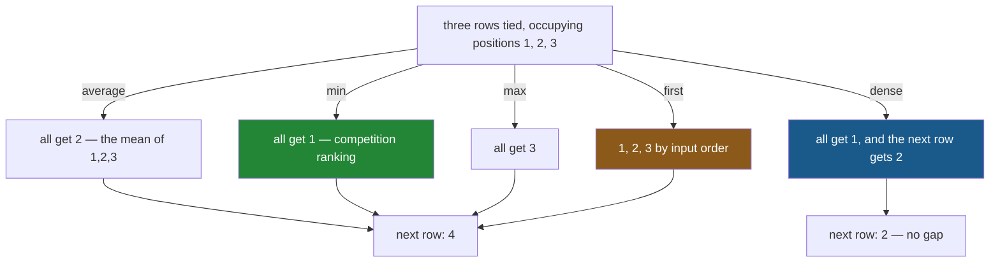

# 5.2 — The five ways to rank a tie

## One-line answer

Three rows tied for first can be numbered five different ways — `average`, `min`, `max`, `first` and
`dense` — and pandas makes you name one, which is the opposite of what `sort_values` does and the
reason `rank` is the safer tool when ties matter.

---

## The story

Three people in the flat do exactly the same number of washing-ups.

Somebody writes the numbers on the chart and immediately has an argument on their hands, because
there are several defensible answers and everybody prefers a different one.

They could all be first, and the next person is fourth — which is how athletics does it, and it means
there is no second or third place at all.

They could all be third, on the grounds that being one of three people at the top is not the same as
being alone at the top.

They could be first, second and third in whatever order their names happen to be on the chart, which
settles it and is obviously arbitrary.

Or the next person could be second, because there are only two *levels* of performance here even
though there are four people.

Nobody is being difficult. All four are ordinary ways of numbering a tie, they give different
answers, and the chart cannot decide.

---

## The idea in plain language

`rank(method=...)` takes five values, and each is a different answer to "what number do tied rows
get?"

Take four scores — three fives and a three — ranked highest first. The three fives jointly occupy
positions 1, 2 and 3:

| `method=` | the three fives get | the three gets | what it means |
|---|---|---|---|
| `"average"` | 2, 2, 2 | 4 | the average of the positions they occupy — **the default** |
| `"min"` | 1, 1, 1 | 4 | the best position any of them could have — **competition ranking** |
| `"max"` | 3, 3, 3 | 4 | the worst position any of them could have |
| `"first"` | 1, 2, 3 | 4 | in the order they appear — arbitrary but total |
| `"dense"` | 1, 1, 1 | 2 | rank the **distinct values**, so no numbers are skipped |

Three things follow from that table and they are the whole part.

**Only `dense` has no gaps.** The other four all jump from the tie straight to 4, because positions 1
to 3 are used up. If you need ranks that run 1, 2, 3, … with nothing missing, `dense` is the only
one — and it is answering a different question: it numbers the *values*, not the rows.

**Only `first` is total.** Every other method gives tied rows the same number, so a rank column cannot
be used to pick a single winner. `first` breaks ties by input order — which makes it reproducible only
in the sense [4.2](../04-sorting/4.2-the-tie-that-broke-the-report.md) warned about: the input order
is a property of the data.

**`average` is the default and is rarely what a person means.** It is the statistically neutral
choice, and it produces fractional ranks like 2.5, which is why `rank` returns `float64`
([5.1](5.1-rank-the-position-in-the-order.md)). For a leaderboard, `min` is almost always the intended
answer.

And the contrast worth holding on to: **`sort_values` picks an order for tied rows and does not tell
you; `rank` refuses to pick and makes you say.** That is why, when ties matter, ranking is the safer
tool even if you sort afterwards.

---

## Why Setu needs it

- **[5.1](5.1-rank-the-position-in-the-order.md)** introduced `rank` and deferred exactly this.
- **[4.2](../04-sorting/4.2-the-tie-that-broke-the-report.md)** is the same question for sorting,
  where pandas quietly decides instead of asking.
- **[5.3](5.3-nlargest-sorting-you-do-not-pay-for.md)** has `keep=`, which is this choice again for
  "the top n" — and one of its options can return more rows than you asked for.
- **Day 31**'s `groupby` ranks within groups, where the tie method has to be chosen per group and the
  same five options apply.
- **Day 91 onwards**, a rank used as a model feature has to be reproducible, which rules out `first`
  and usually means `min` or `dense`.

---

## The mechanism

All five, on the same four rows:

```python
import pandas as pd

scores = pd.DataFrame(
    {"item": pd.Series(["milk", "bread", "eggs", "rice"], dtype="str"), "score": [5, 5, 3, 5]}
).set_index("item")

print(scores["score"].to_dict())
print()
for how in ["average", "min", "max", "first", "dense"]:
    print(f"{how:8}", scores["score"].rank(method=how, ascending=False).tolist())
```

**Line by line:**

- Three items score 5 and one scores 3, so there is one three-way tie and one clear last place.
- `ascending=False` on every call, so **rank 1 is the highest score** — the leaderboard direction
  ([5.1](5.1-rank-the-position-in-the-order.md)).
- The loop runs the same call five times, changing only `method=`, so the five answers are directly
  comparable.
- `.tolist()` rather than `.to_dict()`, so the four ranks line up in columns and the pattern is
  visible down the page.

```text
{'milk': 5, 'bread': 5, 'eggs': 3, 'rice': 5}

average  [2.0, 2.0, 4.0, 2.0]
min      [1.0, 1.0, 4.0, 1.0]
max      [3.0, 3.0, 4.0, 3.0]
first    [1.0, 2.0, 4.0, 3.0]
dense    [1.0, 1.0, 2.0, 1.0]
```

**Read the third column — the eggs, the only row that is not tied.** It is `4` in four of the five
methods and `2` in `dense`. That single difference is what "no gaps" means: `dense` numbered the two
distinct scores rather than the four rows.

Then read the `first` row. It is the only one where the three tied items get three different numbers —
1, 2 and 3, assigned in the order they sit in the frame. **Reorder the frame and those three numbers
move with it.**

The five, drawn on the positions the tie occupies:



**Green is the usual leaderboard answer, blue is the no-gaps answer, orange is the one that depends on
the input.**

Which to reach for:

```python
print(
    "who is joint first:",
    scores.loc[scores["score"].rank(method="min", ascending=False) == 1].index.tolist(),
)
print("how many levels   :", int(scores["score"].rank(method="dense", ascending=False).max()))
print(
    "a single winner   :",
    scores.loc[scores["score"].rank(method="first", ascending=False) == 1].index.tolist(),
)
```

**Line by line:**

- `method="min"` and `== 1` — **everybody who is joint first.** With `min` a three-way tie all score
  1, so the mask catches all three ([Day 28, 2.1](../../../day-28-selection-and-alignment/parts/02-masks/2.1-a-comparison-makes-a-column.md)).
  This is usually the honest answer to "who won".
- `method="dense"` and `.max()` — **how many distinct levels there are**, which is the number of
  different scores rather than the number of rows. That is a genuinely different question and `dense`
  is the only method that answers it.
- `method="first"` and `== 1` — **exactly one row**, always. It is the only method that can pick a
  single winner, and the winner it picks depends on the frame's order, so it should be used with an
  explicit sort or not at all.

```text
who is joint first: ['milk', 'bread', 'rice']
how many levels   : 2
a single winner   : ['milk']
```

**Three answers, all correct, to three different questions.** The last one is the dangerous one: it
looks like "the winner" and it is really "whichever of the joint winners happens to be first in the
frame".

---

## When it breaks

**`first` giving a different winner from the same data:**

```text
$ uv run python -c "
import pandas as pd
scores = pd.Series([5, 5, 3, 5], index=['milk', 'bread', 'eggs', 'rice'])
print('as written:', scores.rank(method='first', ascending=False).idxmin())
print('reversed  :', scores.iloc[::-1].rank(method='first', ascending=False).idxmin())
print('same scores:', sorted(scores) == sorted(scores.iloc[::-1]))
"
```

```text
as written: milk
reversed  : rice
same scores: True
```

**What it means.** `method="first"` broke the tie by input order, and reversing the input changed the
winner.

**No error, and both answers are valid ranks.** This is [4.2](../04-sorting/4.2-the-tie-that-broke-the-report.md)'s
failure wearing a different hat: `first` produces a total order, so it *looks* decisive, and the thing
deciding it is the arrival order of the rows rather than anything in them. If you need one winner,
add a real tie-breaker to the data — a timestamp, a name — rather than letting `first` invent one.

**Assuming ranks run from 1 to n:**

```text
$ uv run python -c "
import pandas as pd
scores = pd.Series([5, 5, 3, 5], index=['milk', 'bread', 'eggs', 'rice'])
medals = ['gold', 'silver', 'bronze', 'none']
ranks = scores.rank(method='min', ascending=False).astype('int64')
print('ranks :', ranks.to_dict())
print('awards:', {name: medals[r - 1] for name, r in ranks.items()})
"
```

```text
ranks : {'milk': 1, 'bread': 1, 'eggs': 4, 'rice': 1}
awards: {'milk': 'gold', 'bread': 'gold', 'eggs': 'none', 'rice': 'gold'}
```

**What it means.** Three golds and no silver or bronze — which is correct for a three-way tie, and it
is also almost certainly not what the person writing `medals[r - 1]` expected.

**Ranks 2 and 3 do not exist here.** With `method="min"` the ranks are `1, 1, 4, 1`, so indexing a list
by rank skips entries and, on a longer list, would raise `IndexError` the moment a rank exceeded the
list's length. **A rank column is not a permutation of 1..n** — only `first` guarantees that, and only
`dense` guarantees no gaps.

**The one that changes a report without changing the data — switching the default:**

```text
$ uv run python -c "
import pandas as pd
scores = pd.Series([5, 5, 3, 5], index=['milk', 'bread', 'eggs', 'rice'])
for how in ['average', 'min', 'dense']:
    r = scores.rank(method=how, ascending=False)
    print(f'{how:8} top three by rank: {r.nsmallest(3).index.tolist()}  ranks {r.nsmallest(3).tolist()}')
"
```

```text
average  top three by rank: ['milk', 'bread', 'rice']  ranks [2.0, 2.0, 2.0]
min      top three by rank: ['milk', 'bread', 'rice']  ranks [1.0, 1.0, 1.0]
dense    top three by rank: ['milk', 'bread', 'rice']  ranks [1.0, 1.0, 1.0]
```

**What it means.** The same three items in every case — and three completely different rank *values*
attached to them: 2.0, 1.0 and 1.0.

The membership of the top three did not change, so a report showing names looks identical under all
three methods. A report showing **the rank number** shows "2" under the default and "1" under `min`,
for a row that is joint first. **A stakeholder reading "rank 2" for the top-scoring item will file a
bug**, and the cause is a default nobody chose rather than a mistake in the data.

---

## In production

**What a professional writes instead of the teaching version.** The method is stated, the ambiguity is
surfaced, and the caller is told how many share the top:

```python
import pandas as pd


def leaderboard(rows: pd.DataFrame, column: str) -> tuple[pd.DataFrame, int]:
    """Rank highest first, ties sharing the best rank. Returns the frame and how many are joint first."""
    if column not in rows.columns:
        raise KeyError(f"cannot rank on {column!r}; have {list(rows.columns)}")
    if rows[column].isna().any():
        raise ValueError(f"{int(rows[column].isna().sum())} row(s) have no {column}")
    ranked = rows.assign(
        rank=rows[column].rank(method="min", ascending=False).astype("int64"),
        level=rows[column].rank(method="dense", ascending=False).astype("int64"),
    )
    return ranked.sort_values(["rank", column], ascending=[True, False]), int(
        (ranked["rank"] == 1).sum()
    )
```

**Line by line:**

- `method="min"` for `rank` — **competition ranking**, which is what a reader of a leaderboard expects:
  joint winners are all first.
- `method="dense"` for `level` as well, in the same call. The two together answer both questions —
  "what position is this" and "how many tiers are there" — and having both makes the gaps in `rank`
  explicable rather than puzzling.
- `.astype("int64")` on both, which is safe because neither `min` nor `dense` produces a fraction and
  the blanks were ruled out above. **It would raise if a blank had survived**, so it doubles as a check
  ([5.1](5.1-rank-the-position-in-the-order.md)).
- **The count of joint firsts is returned**, so a caller cannot render "the winner" without being
  handed the number of winners. That is the design: the function refuses to hide the tie.
- The sort at the end is by rank then by the raw value, so the display order matches the ranks and is
  stable within a tie — and it is still not *total*
  ([4.2](../04-sorting/4.2-the-tie-that-broke-the-report.md)), which the returned count is there to
  make visible.

**What changes at scale.** Three things.

**`rank` sorts underneath, so it is `n log n`** and costs about the same as `sort_values`
([5.3](5.3-nlargest-sorting-you-do-not-pay-for.md) has the measurement). The method chosen barely
changes that — `first` and `average` are within a few per cent of each other — so pick the one that
means what you want and do not think about the cost.

**Ties get more common as data gets coarser, not rarer.** Rounding a score to two decimal places, or
bucketing into deciles, creates ties everywhere; and the more rows there are, the more of them collide.
So a tie policy that never mattered on a thousand test rows becomes the dominant behaviour on a
million real ones.

**And `pct=True` interacts with the method.** A percentile rank under `average` and under `min` differ
for tied rows, so two systems computing "the top 10%" with different methods disagree about the
boundary. When a threshold is contractual, the method belongs in the contract.

**The failure that only appears with real data.** A pricing tier was assigned by percentile rank, using
the default `average` method, with the top decile getting a discount. Prices were rounded to the
nearest penny, so at the tier boundary hundreds of accounts had identical values and all received the
same averaged rank — which fell just **below** the threshold. **Every one of them missed the
discount**, including accounts that would have qualified under `min`. Nobody had chosen `average`; it
was the default, and the boundary case never appeared in testing because the test fixture had no ties
in it.

**The review comment a senior engineer leaves.** *"`.rank()` with no `method=` gives tied rows the
average of their positions, so our top-scoring items will show as rank 2 when three of them tie. Use
`method='min'` for a leaderboard, and return the count of joint firsts so the template can say 'joint
1st' rather than pretending there is one."*

**The interview question.** *"How does pandas rank ties?"* By default with `method="average"` — tied
rows all get the mean of the positions they occupy, which is why ranks can be fractional and why the
result is `float64`. Then the four alternatives and what each is for: `min` is competition ranking and
is what a leaderboard usually means; `max` is its pessimistic mirror; `dense` ranks the **distinct
values**, so it is the only one with no gaps; and `first` breaks the tie by input order, which makes it
the only total one and also the only one whose answer depends on how the rows arrived. The point worth
making unprompted: with anything but `first`, **a rank column is not a permutation of 1..n**, so code
that indexes a list by rank breaks on the first tie.

---

## Check yourself

```bash
uv run python -c "
import pandas as pd
scores = pd.Series([5, 5, 3, 5], index=['milk', 'bread', 'eggs', 'rice'])
for how in ['average', 'min', 'max', 'first', 'dense']:
    r = scores.rank(method=how, ascending=False)
    print(f'{how:8} {r.tolist()}   max {r.max():.0f}   distinct {r.nunique()}')
"
```

Five methods, and the last two columns differ between them. Say which method you would use for a
leaderboard, which for "how many tiers are there", and which you would never use for anything that has
to be reproducible.

**Answer out loud, without scrolling up:**

> Three rows tie for first. Say what rank each gets under `average`, under `min` and under `dense`,
> and what the *next* row gets in each case. Then say which single method guarantees the ranks have no
> gaps, and which guarantees no two rows share one.

---

**Next:** [5.3 — `nlargest`: sorting you do not pay for](5.3-nlargest-sorting-you-do-not-pay-for.md).
