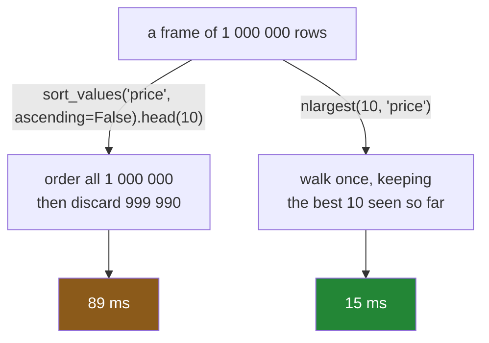

# 5.3 — `nlargest` — sorting you do not pay for

## One-line answer

`nlargest(10, "price")` gives you the top ten without putting the other 999,990 rows in order — around
six times quicker than sorting and taking the head — and its `keep=` argument can hand back **more
rows than you asked for** when there is a tie.

---

## The story

Somebody wants the three most expensive things on the year's shopping.

The obvious way is to put the whole thing in price order and read the top three off. It works, and on
a million lines it takes long enough to notice.

Then somebody points out that nobody asked for the list in order. They asked for three items. Putting
the cheapest nine hundred thousand things into a careful sequence — a sequence nobody will ever look
at — is almost all of the work, and none of it was requested.

You can find the three biggest numbers in a list by going through it once, keeping the best three you
have seen. That is not clever; it is what a person does. And it does not involve ordering anything
except the three.

---

## The idea in plain language

`nlargest(n, column)` returns the `n` rows with the largest values in that column, already in order.
`nsmallest(n, column)` is the same at the other end.

Both are **selection**, not sorting. To find the top ten they keep a running set of the best ten seen
so far and walk the frame once, so the cost is roughly linear in the rows and logarithmic in `n` — 
against `n log n` for a sort of everything.

Three practical properties beyond the speed.

**They skip blanks.** A missing value is never among the largest, so `nlargest` does not have
[4.3](../04-sorting/4.3-na-position-and-the-rows-that-went-to-the-end.md)'s "the last row is a blank"
problem at all. That is a correctness advantage, not only a speed one, and it is the better reason to
prefer them.

**They accept several columns.** `nlargest(3, ["score", "price"])` breaks ties on the first column
using the second, exactly as a multi-column sort would
([4.1](../04-sorting/4.1-sort-values-the-order-you-asked-for.md)).

**`keep=` decides what happens at the boundary**, and this is where they surprise people. When the
tenth and eleventh rows tie, somebody has to choose:

- `keep="first"` — the default. Take whichever tied row comes first in the frame. Exactly `n` rows,
  and which ones depends on the input order ([5.2](5.2-the-five-ways-to-rank-a-tie.md)'s `first`
  problem).
- `keep="last"` — the same, from the other end.
- `keep="all"` — **keep every row that ties at the boundary**, so the result can be longer than `n`.

That last one is the honest option and the one that breaks a caller expecting exactly `n` rows.

The rule for when to use these at all is simple: **if you want the whole frame in order, sort; if you
want the ends of it, do not.** Sorting a million rows to look at ten of them is the most common
avoidable cost in this section, and [4.1](../04-sorting/4.1-sort-values-the-order-you-asked-for.md)
flagged it for this part.

---

## Why Setu needs it

- **[4.1](../04-sorting/4.1-sort-values-the-order-you-asked-for.md)** is the sort this replaces when
  you only want the ends.
- **[4.3](../04-sorting/4.3-na-position-and-the-rows-that-went-to-the-end.md)** described a report
  whose "most expensive item" was a row with no price. `nlargest` cannot make that mistake.
- **[5.2](5.2-the-five-ways-to-rank-a-tie.md)** is the same tie question for ranking, and `keep=` is
  its counterpart here.
- **[3.3](../03-the-measurement/3.3-the-number-and-where-it-stops-mattering.md)** is the framework for
  deciding whether that saving is worth anything to you.
- **Day 31**'s `groupby` has `nlargest` per group — "the top three in each aisle" — which is one of the
  most common real questions and is built directly on this.

---

## The mechanism

The top and bottom, without sorting the middle:

```python
import pandas as pd

shop = pd.DataFrame(
    {
        "item": pd.Series(["milk", "bread", "eggs", "rice"], dtype="str"),
        "need": [2, 1, 6, 1],
        "price": [1.15, 1.40, 0.32, 2.05],
    }
).set_index("item")

print(shop.nlargest(2, "price"))
print()
print("nsmallest:", shop.nsmallest(2, "price").index.tolist())
print(
    "same as sorting:",
    shop.nlargest(2, "price").index.tolist()
    == shop.sort_values("price", ascending=False).head(2).index.tolist(),
)
```

**Line by line:**

- `nlargest(2, "price")` — the count first, then the column. That argument order catches people;
  `nlargest("price", 2)` raises.
- The result is a **DataFrame with every column**, not just the one ranked on, and it comes back
  already in order — largest first.
- `nsmallest` is the mirror, and its result is smallest first rather than reversed-largest, which
  matters if you are about to display it.
- The last line confirms the answer matches `sort_values(...).head(2)`. **The two agree on the values
  and differ only in cost**, which is the whole argument.

```text
       need  price
item
rice      1   2.05
bread     1   1.40

nsmallest: ['eggs', 'milk']
same as sorting: True
```

What each one actually does:



**The left branch does work it then throws away.** That is the entire difference.

Measured on a million rows:

```python
import time

import numpy as np

rng = np.random.default_rng(29)
n = 1_000_000
big = pd.DataFrame({"need": rng.integers(1, 9, n), "price": np.round(rng.uniform(0.2, 4.0, n), 2)})


def best(fn, reps: int = 3) -> float:
    times = []
    for _ in range(reps):
        start = time.perf_counter()
        fn()
        times.append(time.perf_counter() - start)
    return min(times) * 1000


print(
    f"sort then head(10) {best(lambda: big.sort_values('price', ascending=False).head(10)):8.1f} ms"
)
print(f"nlargest(10)       {best(lambda: big.nlargest(10, 'price')):8.1f} ms")
print(f"sort the whole     {best(lambda: big.sort_values('price')):8.1f} ms")
print(f"rank the whole     {best(lambda: big['price'].rank()):8.1f} ms")
```

**Line by line:**

- `sort_values(..., ascending=False).head(10)` — the version people write, and it does the full sort
  before taking ten rows.
- `nlargest(10, "price")` — the same answer by selection.
- `sort_values` on its own is included so the `head` is visibly not the expensive part — the sort is.
- `rank` is here because [5.1](5.1-rank-the-position-in-the-order.md) claimed it costs about what a
  sort costs, and this is the evidence.

```text
sort then head(10)     89.0 ms
nlargest(10)           15.2 ms
sort the whole         86.5 ms
rank the whole        123.7 ms
```

**Around six times**, and the third line explains why: the sort alone is 86.5 ms and `head(10)` is
free, so essentially all of `sort().head()` is the sort. `nlargest` does not do that sort.

The fourth line is worth noting in passing. **Ranking a million rows costs more than sorting them** —
it sorts and then computes positions — which is the measurement
[5.1](5.1-rank-the-position-in-the-order.md) referred to.

Now the tie, which is `keep=`:

```python
tied = pd.DataFrame(
    {"item": pd.Series(["milk", "bread", "eggs", "rice"], dtype="str"), "score": [5, 5, 3, 5]}
).set_index("item")

print("keep='first' :", tied.nlargest(2, "score").index.tolist())
print("keep='all'   :", tied.nlargest(2, "score", keep="all").index.tolist())
print("rows asked for: 2")
print("rows returned :", len(tied.nlargest(2, "score", keep="all")))
```

**Line by line:**

- Three items score 5, so "the top two" is genuinely ambiguous — any two of the three would do.
- `keep="first"` — the default. It returns **exactly two**, chosen by their order in the frame, which
  is [5.2](5.2-the-five-ways-to-rank-a-tie.md)'s `first` problem again: reorder the frame and you get a
  different pair.
- `keep="all"` — returns **three rows for `n=2`**, because all three tie at the boundary. That is the
  honest answer and it breaks any caller that assumed `len(result) == n`.
- The last two prints are there because the discrepancy is the point. **`nlargest` does not promise to
  return `n` rows** under `keep="all"`, and nothing in the call site says so.

```text
keep='first' : ['milk', 'bread']
keep='all'   : ['milk', 'bread', 'rice']
rows asked for: 2
rows returned : 3
```

---

## When it breaks

**The arguments the wrong way round:**

```text
$ uv run python -c "
import pandas as pd
shop = pd.DataFrame(
    {'price': [1.15, 1.40, 0.32]},
    index=pd.Index(['milk', 'bread', 'eggs'], name='item'),
)
shop.nlargest('price', 2)
" 2>&1 | tail -1
```

```text
KeyError: 2
```

**What it means.** `nlargest` takes `n` **first** and the column second, so swapping them made pandas
treat `2` as a column name and look for a column called `2`.

`KeyError: 2` mentions neither the count nor the column argument, so it takes a moment to place — and
it would be far worse on a frame that happened to have a column named `2`, where it would run and rank
the wrong thing. **The mnemonic is that `n` is in the name**: `nlargest` starts with the `n`, so the
`n` goes first.

**Assuming you get `n` rows back:**

```text
$ uv run python -c "
import pandas as pd
tied = pd.DataFrame(
    {'score': [5, 5, 3, 5]},
    index=pd.Index(['milk', 'bread', 'eggs', 'rice'], name='item'),
)
top = tied.nlargest(2, 'score', keep='all')
first, second = top.index
print('unpacked fine:', first, second)
"
```

```text
ValueError: too many values to unpack (expected 2)
```

**What it means.** The caller asked for two, wrote code expecting two, and got three.

**This is the good failure** — the unpacking raised immediately. The bad version is code that does
`top.iloc[0]` and `top.iloc[1]` and silently ignores the third, or a template that renders "top 2" over
a list of three. `keep="all"` is the correct default for honesty and the wrong one for a caller that
cannot handle a variable length, so choosing between it and `keep="first"` is a decision about **who
handles the tie**.

**The one that is silently different — `nlargest` against a sort, with blanks:**

```text
$ uv run python -c "
import pandas as pd
shop = pd.DataFrame(
    {'price': [1.15, None, 0.32, 2.05]},
    index=pd.Index(['milk', 'bread', 'eggs', 'rice'], name='item'),
)
print('nsmallest(2)       :', shop.nsmallest(2, 'price').index.tolist())
print('sort then head(2)  :', shop.sort_values('price').head(2).index.tolist())
print('nlargest(2)        :', shop.nlargest(2, 'price').index.tolist())
print('sort then tail(2)  :', shop.sort_values('price').tail(2).index.tolist())
"
```

```text
nsmallest(2)       : ['eggs', 'milk']
sort then head(2)  : ['eggs', 'milk']
nlargest(2)        : ['rice', 'milk']
sort then tail(2)  : ['rice', 'bread']
```

**What it means.** Read the last two lines. `nlargest(2)` gives rice and milk — the two largest prices.
`sort().tail(2)` gives rice and **bread**, which has no price at all.

The blank sorted to the end ([4.3](../04-sorting/4.3-na-position-and-the-rows-that-went-to-the-end.md))
and `tail` picked it up; `nlargest` skipped it because a missing value is not large. **Neither call
raised and only one is right.**

That is the strongest argument in this part, and it is about correctness rather than speed: **`nlargest`
is not merely a faster `sort().tail()`, it is a different and better-behaved operation** on any column
that might have gaps.

---

## In production

**What a professional writes instead of the teaching version.** The tie policy is explicit and the
caller is told when the result is not the size they asked for:

```python
import pandas as pd


def top_n(rows: pd.DataFrame, n: int, column: str, tie_breaker: str | None = None) -> pd.DataFrame:
    """The `n` highest rows by `column`. Deterministic when `tie_breaker` uniquely orders ties."""
    if column not in rows.columns:
        raise KeyError(f"cannot rank on {column!r}; have {list(rows.columns)}")
    if n < 1:
        raise ValueError(f"n must be at least 1, got {n}")
    keys = [column] if tie_breaker is None else [column, tie_breaker]
    top = rows.nlargest(n, keys, keep="all")
    if len(top) > n:
        raise ValueError(
            f"{len(top)} rows tie for the top {n} on {keys}; "
            f"pass a tie_breaker or accept keep='first'"
        )
    return top
```

**Line by line:**

- `keep="all"` is used **deliberately, as a detector.** The function does not want extra rows; it wants
  to know when there would have been extras, and then refuse rather than silently pick.
- `if len(top) > n: raise` — **the tie is surfaced to the caller**, with the number of tied rows and the
  two ways out. Compare with `keep="first"`, which would have returned quietly and non-deterministically.
- `tie_breaker` is optional and, when given, is passed as a second sort key so `nlargest` breaks the tie
  itself — the same idea as [4.2](../04-sorting/4.2-the-tie-that-broke-the-report.md)'s total order.
- `n < 1` checked, because `nlargest(0, ...)` returns an empty frame rather than raising, and an empty
  "top" is a silent wrong answer ([Day 28, 2.5](../../../day-28-selection-and-alignment/parts/02-masks/2.5-the-mask-that-matched-nothing.md)).
- **No `dropna` anywhere**, because `nlargest` already skips blanks — which is worth a comment in a real
  codebase, since a reader who has only ever used `sort().head()` will wonder where the guard is.
- The docstring says **"deterministic when `tie_breaker` uniquely orders ties"**, which is the precise
  promise: with no tie-breaker it raises rather than being non-deterministic.

**What changes at scale.** Three things.

**The advantage grows with the frame and shrinks with `n`.** `nlargest` is roughly linear in rows and
its edge over sorting comes from not doing the `log n` part. Ask for the top ten of a million and it is
around six times quicker; ask for the top half a million and it has to do nearly the work of a sort anyway,
and the two converge. Somewhere around `n` being a few per cent of the rows the sort wins on
simplicity.

**Per-group is where it earns most.** `groupby(...)["price"].nlargest(3)` on Day 31 finds the top three
in each of ten thousand groups without sorting any group fully, and the saving multiplies by the number
of groups. That is the shape most real "top n" questions have.

**And the fastest top-n is the one the database did.** `ORDER BY price DESC LIMIT 10` with an index on
`price` returns ten rows without reading the rest of the table at all
([Day 27, 4.2](../../../day-27-reading-and-writing/parts/04-sql/4.2-read-sql-and-the-connection.md)),
which beats anything pandas can do with a frame it has already had to load. The same "push the work to
the data" argument as everywhere else.

**The failure that only appears with real data.** A "top 20 products" panel used
`sort_values(...).tail(20)` and had shown the same handful of products at the top for months. A supplier
feed began arriving with null margins, those nulls sorted to the end, and the panel filled with products
whose margin was unknown. **The panel was not empty and did not error** — it showed twenty real
products, confidently, and the merchandising team acted on it for three weeks. Switching to `nlargest`
would have made it impossible, because `nlargest` cannot return a blank.

**The review comment a senior engineer leaves.** *"`sort_values('score').tail(10)` — two problems. It
sorts a million rows to show ten, and it will surface rows with a null score, because those sort last
regardless of direction. `nlargest(10, 'score')` fixes both. Add a tie-breaker or decide explicitly
what happens when the tenth and eleventh tie."*

**The interview question.** *"How do you get the top ten rows by a column?"* `nlargest(10, "column")` —
and the reason is not only that it is several times faster than sorting a million rows to take ten of
them. It **skips missing values**, so it cannot return a null row the way `sort().tail()` can, which
is a correctness difference rather than a performance one. Then the detail that shows you have used it:
`keep="all"` can return **more rows than you asked for** when there is a tie at the boundary, and the
default `keep="first"` returns exactly `n` but picks between tied rows by input order — so if the result
matters, either pass a tie-breaking column or check the length and refuse.

---

## Check yourself

```bash
uv run python -c "
import pandas as pd
shop = pd.DataFrame(
    {'price': [1.15, None, 0.32, 2.05], 'score': [5, 5, 3, 5]},
    index=pd.Index(['milk', 'bread', 'eggs', 'rice'], name='item'),
)
print('nlargest price   :', shop.nlargest(2, 'price').index.tolist())
print('sort tail  price :', shop.sort_values('price').tail(2).index.tolist())
print('nlargest score   :', shop.nlargest(2, 'score').index.tolist())
print('keep=all score   :', shop.nlargest(2, 'score', keep='all').index.tolist())
print('asked 2, got     :', len(shop.nlargest(2, 'score', keep='all')))
"
```

Two of those lines claim to give the two dearest items and they disagree. Say which is right and why —
and say what the last line means for code that unpacks the result into two variables.

**Answer out loud, without scrolling up:**

> Say why `nlargest(10, "price")` is faster than sorting and taking the head, in terms of what each one
> does. Then give the reason to prefer it that has nothing to do with speed, and say what `keep="all"`
> can do that surprises a caller.

---

**Next:** [6.1 — `src/setu/order.py`, the day's module](../06-the-module/6.1-the-order-module.md).
