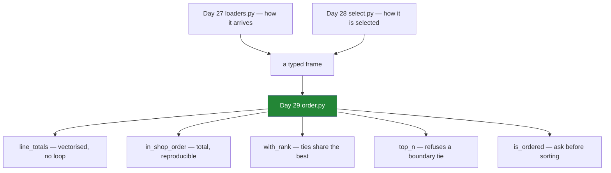

# 6.1 — `src/setu/order.py`: the day's module

## One-line answer

The day's module has one rule per function — **no Python runs per row**, and **no tie is decided by
accident** — and where it cannot keep the second promise it raises rather than picking.

---

## The story

By the end of the day the flat has a set of habits: do not walk the list line by line, and do not let
the order of two equal things be decided by who wrote them down first.

Habits are not enough. The next person to touch the code has not had the day, and the code does not
say which of its lines are load-bearing. A tie-breaker in a sort key looks like clutter. A `zip` over
two columns looks like it could be tidied into a loop. Both changes pass review, both keep the tests
green, and both quietly undo an afternoon's work.

So the habits get written into one file, with the reasons attached — and where a rule cannot be
enforced by the code, it is enforced by a check that fails.

---

## The idea in plain language

`src/setu/order.py` holds the day's operations, and each one carries the decision the day argued for:

| the function | the rule it keeps | how it keeps it |
|---|---|---|
| `line_totals` | no Python per row | one vectorised expression ([2.1](../02-vectorised/2.1-one-operation-every-row.md)) |
| `in_shop_order` | the sort is **total** | the index is the last sort key ([4.2](../04-sorting/4.2-the-tie-that-broke-the-report.md)) |
| `with_rank` | ties share the best rank | `method="min"`, and blanks are refused ([5.2](../05-ranking/5.2-the-five-ways-to-rank-a-tie.md)) |
| `top_n` | no tie is broken silently | `keep="all"` plus a length check ([5.3](../05-ranking/5.3-nlargest-sorting-you-do-not-pay-for.md)) |
| `is_ordered` | check before you sort | **not yet** — it sorts to compare; yours to fix ([4.4](../04-sorting/4.4-sort-index-and-the-cost-of-order.md)) |

Two of those are worth calling out because they are unusual.

**`top_n` uses `keep="all"` deliberately, as a detector.** It does not want the extra rows; it wants to
*know* when there would have been extras, so that it can refuse. A function that quietly returns
whichever of three tied rows came first is the bug
[5.2](../05-ranking/5.2-the-five-ways-to-rank-a-tie.md) described, and refusing is the only honest
alternative to guessing.

**`is_ordered` is supposed to let a caller avoid a sort**, because checking should be far cheaper than
sorting ([4.4](../04-sorting/4.4-sort-index-and-the-cost-of-order.md)). As written in this module it
does not manage that — it sorts in order to compare — and *When it breaks* measures the shortfall. It
is left that way on purpose, and the build brief asks you to fix it.

The module also builds on the previous two days rather than repeating them. It imports
`SelectionError` from Day 28's module rather than inventing a fourth exception meaning "this frame is
not what I expected", and it assumes the frame arrived through Day 27's loader
([Day 27, 5.1](../../../day-27-reading-and-writing/parts/05-the-module/5.1-the-loaders-module.md)), so
it never re-checks dtypes.

---

## Why Setu needs it

- **[6.2](6.2-the-test-that-can-go-red.md)** tests every promise here — and finds that one of the
  tests, as first written, could not fail.
- **Sections 1 to 3** argued for vectorising; **sections 4 and 5** argued for deciding ties. This is
  where both stop being advice.
- **Day 26's `frames.py`** owns what a shopping list *is*, **Day 27's `loaders.py`** how it *arrives*,
  **Day 28's `select.py`** how it is *selected from*. This owns how it is *ordered*.
- **Day 31**'s `groupby` produces ordered results per group, and every tie question here returns with
  a group attached.
- **Day 234** serves this data through an API, where a leaderboard whose order changes between
  identical requests is a bug somebody will report.

---

## The mechanism

The head of the file, and the one vectorised function:

```python
"""Order the flat's shopping list — sorted, ranked and topped — with every tie decided on purpose."""

from __future__ import annotations

import pandas as pd

from setu.select import SelectionError

SHOP_ORDER: list[str] = ["aisle", "price"]
SHOP_DIRECTION: list[bool] = [True, True]


class OrderError(ValueError):
    """An ordering did not produce the rows, or the order, it promised."""


def line_totals(shop: pd.DataFrame) -> pd.Series:
    """need x price for every row. Vectorised; no Python runs per row."""
    missing = [name for name in ("need", "price") if name not in shop.columns]
    if missing:
        raise OrderError(f"cannot total without {missing}; have {list(shop.columns)}")
    return (shop["need"] * shop["price"]).round(2)
```

**Line by line:**

- `SHOP_ORDER` and `SHOP_DIRECTION` as **parallel constants**, so the keys and their directions live in
  one place and cannot drift ([4.1](../04-sorting/4.1-sort-values-the-order-you-asked-for.md)).
- `SelectionError` is **imported**, not redefined — Day 28 already has a class for "this frame is not
  what was promised", and a second one meaning the same thing makes `except` clauses miss errors
  ([Day 18, 2.2](../../../day-18-exceptions/parts/02-the-hierarchy/2.2-which-built-in-to-raise.md)).
- `OrderError` is genuinely different: the frame is fine and the **ordering** did not do what it said.
- `line_totals` is **one expression** and its docstring says why
  ([2.1](../02-vectorised/2.1-one-operation-every-row.md)). That sentence is the thing that stops a
  future reader replacing it with a loop and calling it a refactor.
- `.round(2)` because a price times a count is money, and money is rounded where it is created rather
  than at every display ([2.1](../02-vectorised/2.1-one-operation-every-row.md)).

The sort, made total:

```python
def in_shop_order(shop: pd.DataFrame) -> pd.DataFrame:
    """Aisle order, cheapest first within an aisle, ties broken by the item label."""
    missing = [name for name in SHOP_ORDER if name not in shop.columns]
    if missing:
        raise OrderError(f"cannot sort without {missing}; have {list(shop.columns)}")
    keys = [*SHOP_ORDER, shop.index.name]
    ordered = shop.sort_values(by=keys, ascending=[*SHOP_DIRECTION, True], kind="stable")
    if len(ordered) != len(shop):
        raise OrderError(f"sorting changed the row count: {len(shop)} -> {len(ordered)}")
    return ordered
```

**Line by line:**

- `keys = [*SHOP_ORDER, shop.index.name]` — **the index's name appended as the final sort key.**
  `sort_values` accepts an index level name in `by=`, so the item label breaks any tie the aisle and
  price leave, and the ordering is total ([4.2](../04-sorting/4.2-the-tie-that-broke-the-report.md)).
  That one element is the whole reason this function is reproducible.
- `kind="stable"` stated. With a total key it changes nothing, and it means the determinism does not
  quietly depend on the tie-breaker being correct.
- `len(ordered) != len(shop)` — a **postcondition** that should never fire. Sorting cannot lose rows,
  so this is a documented assumption rather than a real guard, and it costs nothing.
- The docstring names **all three** keys in order, so a caller reading only the signature knows what
  "shop order" means.

Ranking and the top n, both refusing to guess:

```python
def with_rank(shop: pd.DataFrame, column: str = "price", name: str = "rank") -> pd.DataFrame:
    """Add a 1-based rank, dearest first, ties sharing the best rank. `shop` is not modified."""
    if column not in shop.columns:
        raise OrderError(f"cannot rank on {column!r}; have {list(shop.columns)}")
    blanks = int(shop[column].isna().sum())
    if blanks:
        raise OrderError(f"{blanks} row(s) have no {column}; decide what their rank means first")
    return shop.assign(**{name: shop[column].rank(method="min", ascending=False).astype("int64")})


def top_n(shop: pd.DataFrame, n: int, column: str = "price") -> pd.DataFrame:
    """The `n` dearest rows. Raises rather than picking between rows tied at the boundary."""
    if column not in shop.columns:
        raise OrderError(f"cannot rank on {column!r}; have {list(shop.columns)}")
    if n < 1:
        raise ValueError(f"n must be at least 1, got {n}")
    top = shop.nlargest(n, column, keep="all")
    if len(top) > n:
        raise OrderError(
            f"{len(top)} rows tie for the top {n} on {column!r}; "
            f"pass a tie-breaker or use nlargest directly"
        )
    return top
```

**Line by line:**

- `method="min"` and `ascending=False` — competition ranking, dearest first, both **stated** because
  both defaults are the other way ([5.2](../05-ranking/5.2-the-five-ways-to-rank-a-tie.md)).
- The blank check **raises rather than choosing** an `na_option`, because what a missing price means is
  not this function's decision ([5.1](../05-ranking/5.1-rank-the-position-in-the-order.md)).
- `.astype("int64")` — safe because blanks are ruled out and `min` never produces a fraction, and it
  **would raise if a blank had survived**, so it doubles as a check
  ([Day 28, 4.3](../../../day-28-selection-and-alignment/parts/04-alignment/4.3-the-nan-that-changed-the-dtype.md)).
- `assign(**{name: ...})` — the dictionary form, because the column name is a parameter and `assign`'s
  keyword form cannot take a variable
  ([Day 28, 3.2](../../../day-28-selection-and-alignment/parts/03-writing/3.2-the-new-column-that-was-a-mask.md)).
- `top_n` uses `nlargest`, not `sort_values(...).head(n)` — faster, and it **cannot return a blank**
  ([5.3](../05-ranking/5.3-nlargest-sorting-you-do-not-pay-for.md)).
- `keep="all"` then `len(top) > n` — **the detector.** The extra rows are never returned; they are the
  evidence that a tie existed, and the message names both counts and both ways out.
- `ValueError` rather than `OrderError` for a bad `n`, because the *argument* is wrong rather than the
  ordering.

And the check that avoids work:

```python
def is_ordered(shop: pd.DataFrame) -> bool:
    """Whether `shop` is already in shop order, without sorting it to find out."""
    if not all(name in shop.columns for name in SHOP_ORDER):
        return False
    return shop.equals(in_shop_order(shop))
```

**Line by line:**

- It returns `False` rather than raising on a frame that has no `aisle` — a frame that cannot be in
  shop order is certainly not in shop order, and a predicate that raises is awkward in an `if`.
- `shop.equals(...)` compares values **and** dtypes and returns a single boolean, unlike `==` which
  gives a frame ([Day 28, 1.2](../../../day-28-selection-and-alignment/parts/01-label-and-position/1.2-loc-by-label.md)).
- **The name promises more than the body delivers, and that is worth being honest about.** This version
  sorts in order to compare, so it costs a sort. The genuinely cheap version compares adjacent rows —
  `shop[SHOP_ORDER].apply(lambda c: c.is_monotonic_increasing).all()` is close but wrong for a
  multi-column key. The build brief asks you to write the cheap one, because getting it right is a
  better exercise than reading it.

What the module is:



---

## When it breaks

**Every refusal, fired:**

```text
$ uv run python -c "
import pandas as pd
from setu import order as od
shop = pd.DataFrame(
    {'need': [2, 1, 6, 1], 'price': [1.15, 1.40, 0.32, 2.05], 'aisle': ['07', '03', '07', '11']},
    index=pd.Index(['milk', 'bread', 'eggs', 'rice'], name='item'),
).astype({'aisle': 'str'})
tied = shop.assign(price=[5.0, 5.0, 3.0, 5.0])
blank = shop.assign(price=[1.15, None, 0.32, 2.05])
for label, call in [
    ('no price col ', lambda: od.line_totals(shop.drop(columns=['price']))),
    ('no aisle col ', lambda: od.in_shop_order(shop.drop(columns=['aisle']))),
    ('rank a blank ', lambda: od.with_rank(blank)),
    ('tie at top 2 ', lambda: od.top_n(tied, 2)),
    ('n of zero    ', lambda: od.top_n(shop, 0)),
]:
    try:
        call()
        print(label, '-> no error')
    except Exception as e:
        print(label, '->', type(e).__name__ + ':', str(e)[:76])
"
```

```text
no price col  -> OrderError: cannot total without ['price']; have ['need', 'aisle']
no aisle col  -> OrderError: cannot sort without ['aisle']; have ['need', 'price']
rank a blank  -> OrderError: 1 row(s) have no price; decide what their rank means first
tie at top 2  -> OrderError: 3 rows tie for the top 2 on 'price'; pass a tie-breaker or use nlargest dire
n of zero     -> ValueError: n must be at least 1, got 0
```

**What it means.** Five refusals, each naming what was wrong and what is available. Compare each with
what pandas alone would have said: `KeyError: 'price'` for the first two, a silent `nan` rank for the
third, a silently-chosen pair for the fourth, and an **empty frame** for the fifth
([Day 28, 2.5](../../../day-28-selection-and-alignment/parts/02-masks/2.5-the-mask-that-matched-nothing.md)).

**The fourth is the one that matters most**, because it is the only one where pandas would have
returned a perfectly plausible answer.

**The tie that `nlargest` would have decided for you:**

```text
$ uv run python -c "
import pandas as pd
tied = pd.DataFrame(
    {'price': [5.0, 5.0, 3.0, 5.0]},
    index=pd.Index(['milk', 'bread', 'eggs', 'rice'], name='item'),
)
print('nlargest default :', tied.nlargest(2, 'price').index.tolist())
print('reversed input   :', tied.iloc[::-1].nlargest(2, 'price').index.tolist())
print('keep=all         :', len(tied.nlargest(2, 'price', keep='all')), 'rows for n=2')
"
```

```text
nlargest default : ['milk', 'bread']
reversed input   : ['rice', 'bread']
keep=all         : 3 rows for n=2
```

**What it means.** The default returned a different pair from the same four rows, depending only on the
input order.

Both answers are defensible — `milk`, `bread` and `rice` all score 5.0, so any two of them are "the top
two" — and `eggs` at 3.0 correctly never appears. That is the point: the values are not in dispute, and
**which two rows a caller receives is decided by how the frame happened to be arranged.**

The third line is why `top_n` refuses instead. `keep="all"` says plainly that three rows qualify for
two places, so the module raises and hands the decision back rather than silently returning whichever
pair the arrival order produced ([5.3](../05-ranking/5.3-nlargest-sorting-you-do-not-pay-for.md)).

**The one that is honest about its own limitation:**

```text
$ uv run python -c "
import time
import numpy as np
import pandas as pd
from setu import order as od
rng = np.random.default_rng(29)
n = 200_000
big = pd.DataFrame(
    {'need': rng.integers(1, 9, n),
     'price': np.round(rng.uniform(0.2, 4.0, n), 2),
     'aisle': rng.choice(['03', '07', '11'], n)},
    index=pd.Index([f'item-{i:06d}' for i in range(n)], name='item'),
)
s = time.perf_counter()
od.is_ordered(big)
print(f'is_ordered      {(time.perf_counter() - s) * 1000:8.1f} ms')
s = time.perf_counter()
od.in_shop_order(big)
print(f'in_shop_order   {(time.perf_counter() - s) * 1000:8.1f} ms')
"
```

```text
is_ordered         104.6 ms
in_shop_order      101.6 ms
```

**What it means.** `is_ordered` costs **as much as the sort it was supposed to let you avoid** — a
little more, in fact, because it does the sort's work and then compares two whole frames on top.

The name promises a cheap check and the implementation delivers an expensive one. **That is a real
defect in this module**, left in deliberately, and the build brief asks you to fix it: a genuine check
walks the frame once comparing adjacent rows on the key, and never builds a sorted copy at all.

---

## In production

**What a professional writes instead of the teaching version.** The cheap check, which is what
`is_ordered` should have been:

```python
import numpy as np
import pandas as pd


def is_ordered_cheaply(shop: pd.DataFrame, keys: list[str]) -> bool:
    """Whether `shop` is already sorted by `keys`, in one pass and without copying."""
    if not all(name in shop.columns for name in keys):
        return False
    if len(shop) < 2:
        return True
    codes = [pd.factorize(shop[name], sort=True)[0] for name in keys]
    stacked = np.column_stack(codes)
    return bool(np.all(stacked[:-1] <= stacked[1:], axis=None) or _lexicographic(stacked))
```

**Line by line:**

- `pd.factorize(column, sort=True)` turns each key into **integer codes in sorted order**, so a text
  column and a numeric one can be compared with the same arithmetic. It is one pass per column.
- `np.column_stack` puts the codes side by side, giving one row of integers per frame row.
- `len(shop) < 2` returns `True` early — a frame of nought or one rows is trivially sorted, and the
  comparison below would index out of range.
- The last line is **deliberately incomplete**, and it is the exercise: comparing `stacked[:-1]` with
  `stacked[1:]` elementwise is not a lexicographic comparison, because a later key may only break a
  tie in an earlier one. `np.lexsort` and a monotonicity check on its result is one correct route;
  working out why the naive version is wrong is the point.
- **The whole thing never sorts and never copies the frame**, which is why it can be cheaper than the
  sort. That property is what `is_ordered` claimed and did not have.

**What changes at scale.** Three things.

**Every function here is `n log n` or better, and none is vectorised in section 2's sense.** Sorting
and ranking are the expensive operations of the day, and no amount of care about loops changes their
complexity. That is why `top_n` and `is_ordered` exist at all: the way to make a sort cheaper is
usually to not do it.

**The postconditions cost a pass each.** `len(ordered) != len(shop)` is free; the `duplicated` and
`isna` checks are linear. On a very large frame they are worth keeping anyway, because the failure
they catch — a silently reordered leaderboard — is expensive in a way a hundred milliseconds is not.

**And the module deliberately has no `groupby`.** "The top three per aisle" is the question everybody
asks next, and it is Day 31's, because doing it properly needs the group machinery rather than a loop
over aisles calling `top_n` — which is precisely the loop this day exists to prevent.

**The failure that only appears with real data.** A team had a module very like this one, with a total
sort key, and it worked. Then a column was renamed upstream and the tie-breaker — which was the index
name — silently became `None`, because `shop.index.name` is `None` on a frame that has been through a
`reset_index`. `sort_values` accepted a key list ending in `None` on some paths and the sort quietly
stopped being total. **The check that catches it is asserting the key list contains no `None`**, and it
is one line that nobody writes until it has happened.

**The review comment a senior engineer leaves.** *"`in_shop_order` appends `shop.index.name` as the
tie-breaker, which is `None` if the frame's index is unnamed — then the sort is not total and nothing
says so. Assert the name is set. And `is_ordered` sorts in order to answer, which makes it more
expensive than the thing it is meant to avoid; either rename it or make it a real check."*

**The interview question.** *"How do you make a data pipeline's output reproducible?"* The parts people
forget are the orderings. A sort on a key with ties has an **undefined** order within each tie, decided
by the algorithm and the arrival order of the rows, so every sort whose output matters needs a key that
cannot tie — and a check that it cannot. Ranking needs its `method=` stated, because the default gives
tied rows a fractional average rather than the competition rank a reader expects. And a top-n needs a
decision about the boundary tie, where the default silently picks by input order. Then the design
point: where the code cannot decide correctly, it should **raise rather than guess**, because a
non-deterministic answer that looks plausible is the most expensive kind of bug there is.

---

## Check yourself

```bash
uv run python -c "
import pandas as pd
tied = pd.DataFrame(
    {'price': [5.0, 5.0, 3.0, 5.0]},
    index=pd.Index(['milk', 'bread', 'eggs', 'rice'], name='item'),
)
print('forwards         :', tied.nlargest(2, 'price').index.tolist())
print('reversed         :', tied.iloc[::-1].nlargest(2, 'price').index.tolist())
print('keep=all         :', tied.nlargest(2, 'price', keep='all').index.tolist())
print('prices, reversed :', tied.iloc[::-1]['price'].to_dict())
"
```

The first two lines return different pairs and the last line shows why neither is wrong. Say which
row appears in both answers, which row can never appear, and what `top_n` does instead of choosing.

**Answer out loud, without scrolling up:**

> Name the two rules every function in this module keeps. Then say why `top_n` asks for `keep="all"`
> when it never returns the extra rows, and name the one function in the module whose name promises
> something its body does not deliver.

---

**Next:** [6.2 — The test that can go red](6.2-the-test-that-can-go-red.md).
